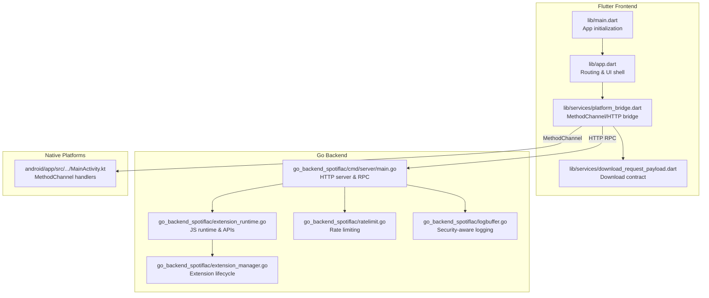
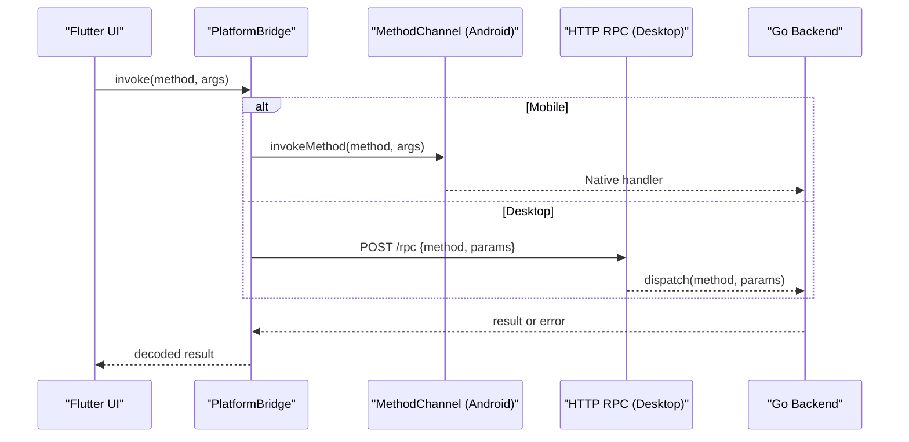
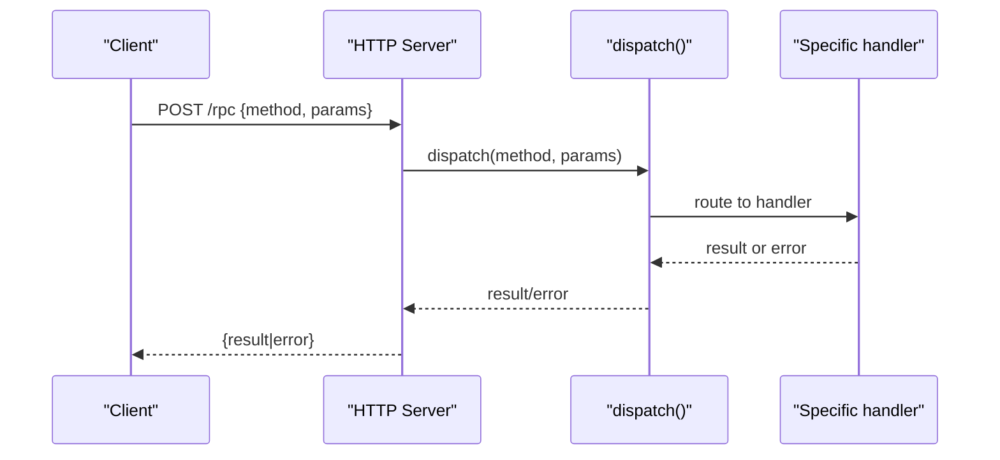
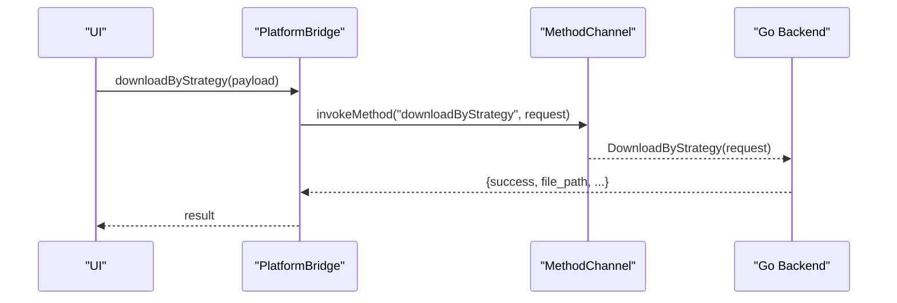
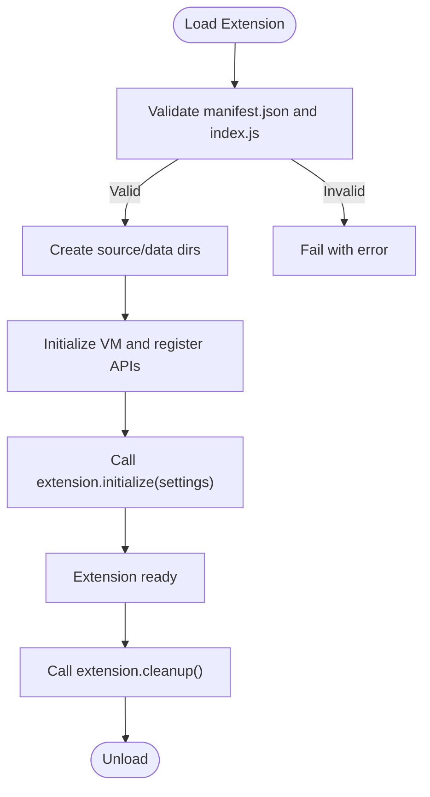
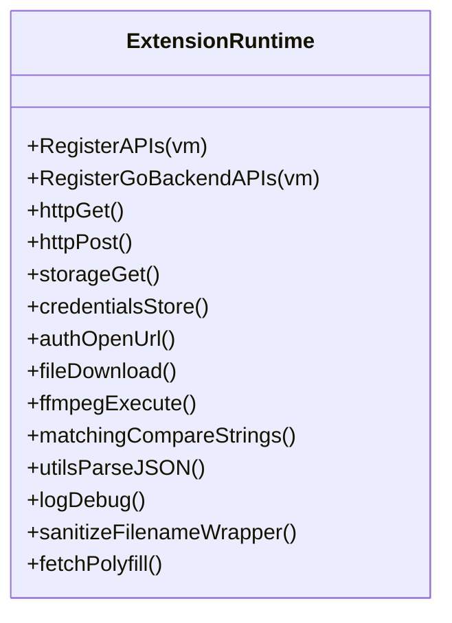
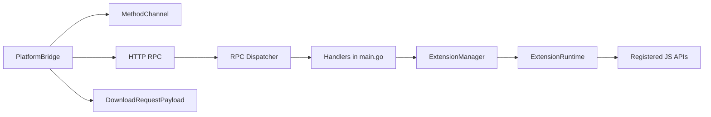

# API Reference

<cite>
**Referenced Files in This Document**
- [main.dart](file://lib/main.dart)
- [app.dart](file://lib/app.dart)
- [platform_bridge.dart](file://lib/services/platform_bridge.dart)
- [download_request_payload.dart](file://lib/services/download_request_payload.dart)
- [android MainActivity.kt](file://android/app/src/main/kotlin/com/example/bitly/MainActivity.kt)
- [extension_runtime.go](file://go_backend_spotiflac/extension_runtime.go)
- [extension_runtime_polyfills.go](file://go_backend_spotiflac/extension_runtime_polyfills.go)
- [extension_manager.go](file://go_backend_spotiflac/extension_manager.go)
- [main.go](file://go_backend_spotiflac/cmd/server/main.go)
- [ratelimit.go](file://go_backend_spotiflac/ratelimit.go)
- [logbuffer.go](file://go_backend_spotiflac/logbuffer.go)
</cite>

## Table of Contents
1. [Introduction](#introduction)
2. [Project Structure](#project-structure)
3. [Core Components](#core-components)
4. [Architecture Overview](#architecture-overview)
5. [Detailed Component Analysis](#detailed-component-analysis)
6. [Dependency Analysis](#dependency-analysis)
7. [Performance Considerations](#performance-considerations)
8. [Troubleshooting Guide](#troubleshooting-guide)
9. [Conclusion](#conclusion)
10. [Appendices](#appendices)

## Introduction
This document provides a comprehensive API reference for Bitly’s public interfaces across three categories:
- HTTP APIs exposed by the Go backend server
- Flutter MethodChannel APIs used for cross-platform native communication
- JavaScript extension APIs for plugin-based functionality

It covers endpoint specifications, request/response schemas, authentication methods, error handling, rate limiting, security considerations, versioning, and client integration patterns. Examples are provided via file references and diagrams mapped to actual source code.

## Project Structure
The application consists of:
- A Flutter frontend that initializes platform bridges and manages app lifecycle
- A Go backend server exposing HTTP endpoints and an RPC interface
- An extension system that runs JavaScript plugins inside a sandboxed runtime
- Android/iOS integration points for native capabilities

**Diagram sources**
- [main.dart:22-44](file://lib/main.dart#L22-L44)
- [app.dart:13-52](file://lib/app.dart#L13-L52)
- [platform_bridge.dart:37-81](file://lib/services/platform_bridge.dart#L37-L81)
- [download_request_payload.dart:1-104](file://lib/services/download_request_payload.dart#L1-L104)
- [main.go:107-134](file://go_backend_spotiflac/cmd/server/main.go#L107-L134)
- [extension_runtime.go:424-533](file://go_backend_spotiflac/extension_runtime.go#L424-L533)
- [extension_manager.go:120-156](file://go_backend_spotiflac/extension_manager.go#L120-L156)
- [ratelimit.go:8-92](file://go_backend_spotiflac/ratelimit.go#L8-L92)
- [logbuffer.go:12-47](file://go_backend_spotiflac/logbuffer.go#L12-L47)
- [android MainActivity.kt:39-59](file://android/app/src/main/kotlin/com/example/bitly/MainActivity.kt#L39-L59)

**Section sources**
- [main.dart:22-44](file://lib/main.dart#L22-L44)
- [app.dart:13-52](file://lib/app.dart#L13-L52)
- [platform_bridge.dart:37-81](file://lib/services/platform_bridge.dart#L37-L81)
- [download_request_payload.dart:1-104](file://lib/services/download_request_payload.dart#L1-L104)
- [main.go:107-134](file://go_backend_spotiflac/cmd/server/main.go#L107-L134)
- [extension_runtime.go:424-533](file://go_backend_spotiflac/extension_runtime.go#L424-L533)
- [extension_manager.go:120-156](file://go_backend_spotiflac/extension_manager.go#L120-L156)
- [ratelimit.go:8-92](file://go_backend_spotiflac/ratelimit.go#L8-L92)
- [logbuffer.go:12-47](file://go_backend_spotiflac/logbuffer.go#L12-L47)
- [android MainActivity.kt:39-59](file://android/app/src/main/kotlin/com/example/bitly/MainActivity.kt#L39-L59)

## Core Components
- HTTP Server and RPC
  - Exposes endpoints under localhost for internal desktop usage
  - Provides an RPC dispatcher for method invocation
- Flutter Platform Bridge
  - Routes calls to MethodChannel on mobile or HTTP RPC on desktop
  - Manages caches, event streams, and cancellation
- Extension Runtime
  - Sandboxed JavaScript environment with restricted APIs
  - Registers HTTP, storage, credentials, file, ffmpeg, matching, utils, and logging APIs
- Extension Manager
  - Loads/unloads extensions, validates manifests, and manages lifecycle
- Rate Limiting and Logging
  - Implements sliding-window rate limiting and sensitive data sanitization

**Section sources**
- [main.go:107-134](file://go_backend_spotiflac/cmd/server/main.go#L107-L134)
- [platform_bridge.dart:37-81](file://lib/services/platform_bridge.dart#L37-L81)
- [extension_runtime.go:424-533](file://go_backend_spotiflac/extension_runtime.go#L424-L533)
- [extension_manager.go:120-156](file://go_backend_spotiflac/extension_manager.go#L120-L156)
- [ratelimit.go:8-92](file://go_backend_spotiflac/ratelimit.go#L8-L92)
- [logbuffer.go:12-47](file://go_backend_spotiflac/logbuffer.go#L12-L47)

## Architecture Overview
The Flutter app communicates with the Go backend either via MethodChannel on mobile or HTTP RPC on desktop. The backend exposes:
- HTTP endpoints for search, playback, and downloads
- An RPC interface for advanced operations
- A JavaScript extension system with sandboxed APIs

**Diagram sources**
- [platform_bridge.dart:44-81](file://lib/services/platform_bridge.dart#L44-L81)
- [android MainActivity.kt:39-59](file://android/app/src/main/kotlin/com/example/bitly/MainActivity.kt#L39-L59)
- [main.go:359-385](file://go_backend_spotiflac/cmd/server/main.go#L359-L385)

## Detailed Component Analysis

### HTTP APIs

#### Endpoint: GET /
- Purpose: Health check and service info
- Authentication: None
- Response: JSON with service name, version, and status
- Example response keys: service, version, status

**Section sources**
- [main.go:288-295](file://go_backend_spotiflac/cmd/server/main.go#L288-L295)

#### Endpoint: GET /buscar?q={query}&limite={limit}
- Purpose: Search tracks
- Authentication: None
- Query parameters:
  - q: search query (required)
  - limite: limit (default 10, max 50)
- Response: JSON with songs array and total count
  - Songs include id, title, artist, album, cover, duration, source

**Section sources**
- [main.go:297-347](file://go_backend_spotiflac/cmd/server/main.go#L297-L347)

#### Endpoint: POST /play/
- Purpose: Initiate playback session and download
- Authentication: None
- Request body JSON:
  - provider: service identifier
  - track_id: track identifier
  - track_name: track title
  - artist_name: artist name
  - isrc: ISRC code
  - quality: quality setting
- Response: JSON with key and status
- Notes:
  - On success, a key is returned; later used to poll status or serve audio

**Section sources**
- [main.go:136-171](file://go_backend_spotiflac/cmd/server/main.go#L136-L171)

#### Endpoint: GET /play/{key}/status
- Purpose: Poll session status
- Path parameter: key (from POST /play/)
- Response: JSON with key, status, progress, track, artist, and optional error

**Section sources**
- [main.go:237-254](file://go_backend_spotiflac/cmd/server/main.go#L237-L254)

#### Endpoint: GET /play/{key}
- Purpose: Serve audio file when ready
- Path parameter: key (from POST /play/)
- Response: Audio stream (audio/mp4) when status is ready
- Errors:
  - 400: missing key
  - 404: session not found
  - 425: not ready

**Section sources**
- [main.go:256-270](file://go_backend_spotiflac/cmd/server/main.go#L256-L270)

#### Endpoint: GET /dl/{filename}
- Purpose: Download previously processed file
- Path parameter: filename under ready directory
- Response: Binary stream (octet-stream)
- Errors:
  - 400: missing path
  - 404: not found

**Section sources**
- [main.go:272-286](file://go_backend_spotiflac/cmd/server/main.go#L272-L286)

#### Endpoint: POST /rpc
- Purpose: RPC invocation
- Authentication: None
- Request body JSON:
  - method: string
  - params: object
- Response: JSON with result or error
- Errors:
  - 405: method not allowed
  - 400: invalid JSON or cannot read body
  - 500: dispatch error

**Diagram sources**
- [main.go:359-385](file://go_backend_spotiflac/cmd/server/main/main.go#L359-L385)
- [main.go:555-800](file://go_backend_spotiflac/cmd/server/main.go#L555-L800)

**Section sources**
- [main.go:359-385](file://go_backend_spotiflac/cmd/server/main.go#L359-L385)
- [main.go:555-800](file://go_backend_spotiflac/cmd/server/main.go#L555-L800)

### MethodChannel APIs (Flutter-Native Communication)

#### Initialization and Backend Selection
- Desktop initialization:
  - Starts Go backend process on a free port
  - Switches to HTTP RPC mode
- Mobile:
  - Uses MethodChannel com.zarz.spotiflac/backend

**Section sources**
- [platform_bridge.dart:83-141](file://lib/services/platform_bridge.dart#L83-L141)
- [android MainActivity.kt:39-59](file://android/app/src/main/kotlin/com/example/bitly/MainActivity.kt#L39-L59)

#### Download Workflow
- Contract: DownloadRequestPayload defines the request schema
- Methods:
  - downloadByStrategy: orchestrates download with strategy flags
  - getDownloadProgress / getAllDownloadProgress: progress retrieval
  - downloadProgressStream: event stream for progress updates
  - cancelDownload, initItemProgress, finishItemProgress, clearItemProgress
  - setDownloadDirectory, checkDuplicate, buildFilename, sanitizeFilename

**Diagram sources**
- [platform_bridge.dart:565-606](file://lib/services/platform_bridge.dart#L565-L606)
- [download_request_payload.dart:106-158](file://lib/services/download_request_payload.dart#L106-L158)

**Section sources**
- [platform_bridge.dart:565-606](file://lib/services/platform_bridge.dart#L565-L606)
- [download_request_payload.dart:106-158](file://lib/services/download_request_payload.dart#L106-L158)

#### Availability and Metadata Caching
- checkAvailability: checks availability with caching and persistence
- Persistent caches are stored and restored across app sessions

**Section sources**
- [platform_bridge.dart:241-283](file://lib/services/platform_bridge.dart#L241-L283)
- [platform_bridge.dart:409-496](file://lib/services/platform_bridge.dart#L409-L496)

#### SAF (Scoped Storage) Operations (Android)
- Methods include resolving SAF URIs, copying, replacing, creating files, and sharing
- Used for Android content URI operations

**Section sources**
- [platform_bridge.dart:702-792](file://lib/services/platform_bridge.dart#L702-L792)

### Extension APIs (JavaScript Plugins)

#### Extension Lifecycle
- Loading:
  - Load from directory or ZIP (.spotiflac-ext)
  - Validates manifest and index.js presence
- Initialization:
  - Initializes VM, registers APIs, and calls extension.initialize(settings)
- Running:
  - Executes extension code and exposes registered APIs
- Cleanup:
  - Calls extension.cleanup() during teardown

**Diagram sources**
- [extension_manager.go:158-294](file://go_backend_spotiflac/extension_manager.go#L158-L294)
- [extension_manager.go:296-344](file://go_backend_spotiflac/extension_manager.go#L296-L344)
- [extension_manager.go:416-468](file://go_backend_spotiflac/extension_manager.go#L416-L468)
- [extension_manager.go:539-554](file://go_backend_spotiflac/extension_manager.go#L539-L554)

**Section sources**
- [extension_manager.go:158-294](file://go_backend_spotiflac/extension_manager.go#L158-L294)
- [extension_manager.go:296-344](file://go_backend_spotiflac/extension_manager.go#L296-L344)
- [extension_manager.go:416-468](file://go_backend_spotiflac/extension_manager.go#L416-L468)
- [extension_manager.go:539-554](file://go_backend_spotiflac/extension_manager.go#L539-L554)

#### JavaScript Runtime APIs
The extension runtime exposes the following global objects and functions:

- http
  - Methods: get, post, put, delete, patch, request, clearCookies
- storage
  - Methods: get, set, remove
- credentials
  - Methods: store, get, remove, has
- auth
  - Methods: openAuthUrl, getAuthCode, setAuthCode, clearAuth, isAuthenticated, getTokens, generatePKCE, getPKCE, startOAuthWithPKCE, exchangeCodeWithPKCE
- file
  - Methods: download, exists, delete, read, readBytes, write, writeBytes, copy, move, getSize
- ffmpeg
  - Methods: execute, getInfo, convert
- matching
  - Methods: compareStrings, compareDuration, normalizeString
- utils
  - Methods: base64Encode, base64Decode, md5, sha256, hmacSHA256, hmacSHA256Base64, hmacSHA1, parseJSON, stringifyJSON, encrypt, decrypt, encryptBlockCipher, decryptBlockCipher, generateKey, randomUserAgent, appVersion, appUserAgent, sleep, isDownloadCancelled, isRequestCancelled, setDownloadStatus
- log
  - Methods: debug, info, warn, error
- gobackend
  - Methods: sanitizeFilename
- globals
  - fetch polyfill with validation and response helpers (text, json, arrayBuffer)
  - atob/btoa polyfills
  - URL class polyfill
  - JSON global polyfill

**Diagram sources**
- [extension_runtime.go:424-533](file://go_backend_spotiflac/extension_runtime.go#L424-L533)
- [extension_runtime_polyfills.go:15-150](file://go_backend_spotiflac/extension_runtime_polyfills.go#L15-L150)

**Section sources**
- [extension_runtime.go:424-533](file://go_backend_spotiflac/extension_runtime.go#L424-L533)
- [extension_runtime_polyfills.go:15-150](file://go_backend_spotiflac/extension_runtime_polyfills.go#L15-L150)

#### Provider Registration and Invocation
- Providers are registered via extension runtime and invoked through the Go backend
- Methods include:
  - initExtensionSystem, loadExtensionsFromDir, loadExtensionFromPath
  - unloadExtension, removeExtension, upgradeExtension, checkExtensionUpgrade
  - getInstalledExtensions, setExtensionEnabled, invokeExtensionAction
  - cleanupExtensions
  - getExtensionSettings, setExtensionSettings
  - checkExtensionHealth
  - getExtensionPendingAuth, setExtensionAuthCode, setExtensionTokens, clearExtensionPendingAuth

**Section sources**
- [extension_manager.go:120-156](file://go_backend_spotiflac/extension_manager.go#L120-L156)
- [extension_manager.go:567-584](file://go_backend_spotiflac/extension_manager.go#L567-L584)
- [extension_manager.go:738-755](file://go_backend_spotiflac/extension_manager.go#L738-L755)
- [extension_manager.go:758-800](file://go_backend_spotiflac/extension_manager.go#L758-L800)
- [android MainActivity.kt:39-59](file://android/app/src/main/kotlin/com/example/bitly/MainActivity.kt#L39-L59)

## Dependency Analysis

**Diagram sources**
- [platform_bridge.dart:44-81](file://lib/services/platform_bridge.dart#L44-L81)
- [main.go:359-385](file://go_backend_spotiflac/cmd/server/main.go#L359-L385)
- [download_request_payload.dart:106-158](file://lib/services/download_request_payload.dart#L106-L158)
- [extension_manager.go:120-156](file://go_backend_spotiflac/extension_manager.go#L120-L156)
- [extension_runtime.go:424-533](file://go_backend_spotiflac/extension_runtime.go#L424-L533)

**Section sources**
- [platform_bridge.dart:44-81](file://lib/services/platform_bridge.dart#L44-L81)
- [main.go:359-385](file://go_backend_spotiflac/cmd/server/main.go#L359-L385)
- [download_request_payload.dart:106-158](file://lib/services/download_request_payload.dart#L106-L158)
- [extension_manager.go:120-156](file://go_backend_spotiflac/extension_manager.go#L120-L156)
- [extension_runtime.go:424-533](file://go_backend_spotiflac/extension_runtime.go#L424-L533)

## Performance Considerations
- HTTP RPC timeouts: 60 seconds for RPC requests
- Desktop backend startup attempts multiple ports and logs conflicts
- Extension HTTP clients reuse shared transport and enforce HTTPS redirects
- Private IP and domain allowlists prevent local network access and unauthorized domains
- Rate limiting:
  - Sliding window implementation for SongLink (9 requests per minute)
  - Additional rate limiter utilities available for other providers

**Section sources**
- [platform_bridge.dart:65-81](file://lib/services/platform_bridge.dart#L65-L81)
- [platform_bridge.dart:102-141](file://lib/services/platform_bridge.dart#L102-L141)
- [extension_runtime.go:250-286](file://go_backend_spotiflac/extension_runtime.go#L250-L286)
- [extension_runtime.go:300-394](file://go_backend_spotiflac/extension_runtime.go#L300-L394)
- [ratelimit.go:8-92](file://go_backend_spotiflac/ratelimit.go#L8-L92)

## Troubleshooting Guide
- HTTP RPC failures:
  - Verify backend is running and port is free
  - Inspect response status and body for errors
- MethodChannel issues:
  - Confirm channel name matches com.zarz.spotiflac/backend
  - Ensure native handlers exist for requested methods
- Extension loading:
  - Validate .spotiflac-ext package contains manifest.json and index.js
  - Check extension.initialize(settings) completion
- Security logging:
  - Sensitive data is sanitized in logs (tokens, bearer tokens, query tokens)
- Rate limiting:
  - Respect rate limits to avoid throttling; consider exponential backoff

**Section sources**
- [platform_bridge.dart:65-81](file://lib/services/platform_bridge.dart#L65-L81)
- [android MainActivity.kt:39-59](file://android/app/src/main/kotlin/com/example/bitly/MainActivity.kt#L39-L59)
- [extension_manager.go:158-294](file://go_backend_spotiflac/extension_manager.go#L158-L294)
- [logbuffer.go:40-47](file://go_backend_spotiflac/logbuffer.go#L40-L47)
- [ratelimit.go:8-92](file://go_backend_spotiflac/ratelimit.go#L8-L92)

## Conclusion
Bitly exposes a robust set of public interfaces:
- HTTP endpoints for search, playback, and downloads
- A unified RPC interface accessible via MethodChannel or HTTP RPC
- A secure, sandboxed JavaScript extension system with rich APIs
- Built-in caching, rate limiting, and security safeguards

Clients should integrate using the Flutter bridge, selecting MethodChannel on mobile and HTTP RPC on desktop, and leverage extension APIs for advanced customization.

## Appendices

### Versioning Information
- HTTP service version is included in the root endpoint response
- Extension packages carry a semantic version in their manifest

**Section sources**
- [main.go:288-295](file://go_backend_spotiflac/cmd/server/main.go#L288-L295)
- [extension_manager.go:197-200](file://go_backend_spotiflac/extension_manager.go#L197-L200)

### Security Considerations
- HTTPS enforcement and redirect blocking for extension HTTP clients
- Domain allowlists and private IP detection
- Sensitive data redaction in logs
- Fetch polyfill validates domains and bodies

**Section sources**
- [extension_runtime.go:250-286](file://go_backend_spotiflac/extension_runtime.go#L250-L286)
- [extension_runtime.go:300-394](file://go_backend_spotiflac/extension_runtime.go#L300-L394)
- [logbuffer.go:40-47](file://go_backend_spotiflac/logbuffer.go#L40-L47)
- [extension_runtime_polyfills.go:15-150](file://go_backend_spotiflac/extension_runtime_polyfills.go#L15-L150)

### Client Implementation Guidelines
- Choose MethodChannel on mobile; HTTP RPC on desktop
- Use DownloadRequestPayload to construct requests
- Implement retry/backoff for rate-limited operations
- Utilize extension APIs for provider-specific integrations

**Section sources**
- [platform_bridge.dart:44-81](file://lib/services/platform_bridge.dart#L44-L81)
- [download_request_payload.dart:106-158](file://lib/services/download_request_payload.dart#L106-L158)
- [ratelimit.go:8-92](file://go_backend_spotiflac/ratelimit.go#L8-L92)