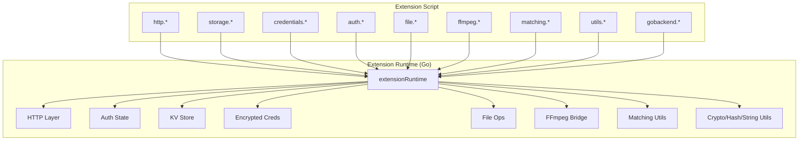
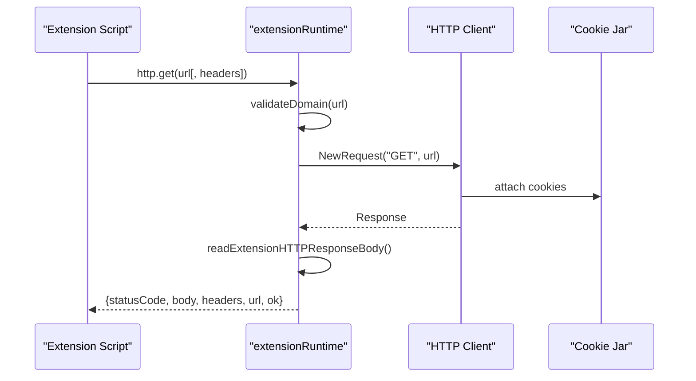
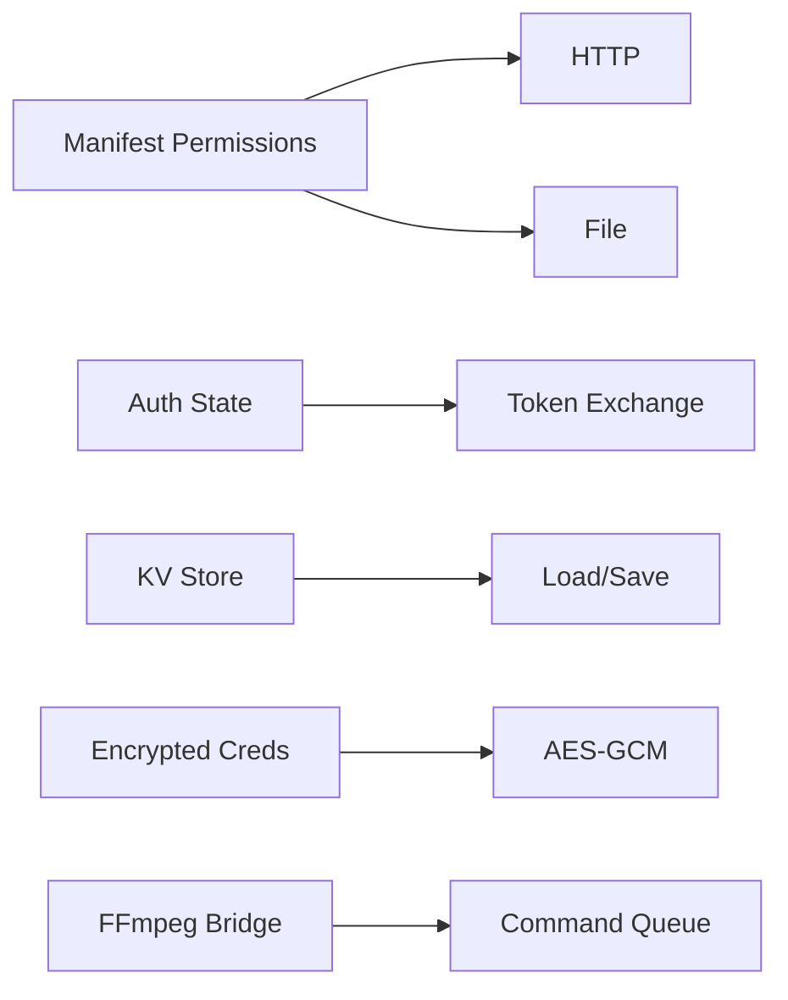

# API Bindings

<cite>
**Referenced Files in This Document**
- [extension_runtime.go](file://go_backend_spotiflac/extension_runtime.go)
- [extension_runtime_http.go](file://go_backend_spotiflac/extension_runtime_http.go)
- [extension_runtime_auth.go](file://go_backend_spotiflac/extension_runtime_auth.go)
- [extension_runtime_storage.go](file://go_backend_spotiflac/extension_runtime_storage.go)
- [extension_runtime_file.go](file://go_backend_spotiflac/extension_runtime_file.go)
- [extension_runtime_ffmpeg.go](file://go_backend_spotiflac/extension_runtime_ffmpeg.go)
- [extension_runtime_matching.go](file://go_backend_spotiflac/extension_runtime_matching.go)
- [extension_runtime_utils.go](file://go_backend_spotiflac/extension_runtime_utils.go)
- [extension_manifest.go](file://go_backend_spotiflac/extension_manifest.go)
- [extension_runtime_polyfills.go](file://go_backend_spotiflac/extension_runtime_polyfills.go)
</cite>

## Table of Contents
1. [Introduction](#introduction)
2. [Project Structure](#project-structure)
3. [Core Components](#core-components)
4. [Architecture Overview](#architecture-overview)
5. [Detailed Component Analysis](#detailed-component-analysis)
6. [Dependency Analysis](#dependency-analysis)
7. [Performance Considerations](#performance-considerations)
8. [Troubleshooting Guide](#troubleshooting-guide)
9. [Conclusion](#conclusion)

## Introduction
This document describes the JavaScript API bindings exposed to extension scripts hosted inside the Go-backed extension runtime. It covers HTTP networking, authentication, persistent storage, secure credential storage, filesystem operations, audio processing via FFmpeg, matching utilities, and general utilities for cryptography, hashing, and string manipulation. For each API, we specify parameters, return values, error handling, and practical usage patterns.

## Project Structure
The extension runtime exposes a set of namespaces under the global JavaScript object:
- http: HTTP client helpers (get, post, put, delete, patch, request) plus cookie clearing
- storage: Key-value persistence
- credentials: Secure token/key storage
- auth: OAuth/OpenID Connect flows (PKCE)
- file: Filesystem operations and downloads
- ffmpeg: Audio processing commands and metadata
- matching: String and duration similarity helpers
- utils: Cryptography, hashing, JSON, encoding, logging, and scheduling helpers
- gobackend: Additional backend utilities
- Polyfills: fetch, atob/btoa, TextEncoder/Decoder, and URL class

**Diagram sources**
- [extension_runtime.go:424-533](file://go_backend_spotiflac/extension_runtime.go#L424-L533)

**Section sources**
- [extension_runtime.go:424-533](file://go_backend_spotiflac/extension_runtime.go#L424-L533)

## Core Components
- HTTP namespace: Wraps Go’s http.Client with sandboxed domain allowlists, redirects, and response size limits. Provides convenience methods and a generic request method.
- Storage namespace: In-memory cache persisted to disk with batching and async flush.
- Credentials namespace: AES-GCM encrypted key-value store keyed by extension ID and salt.
- Auth namespace: OpenAuth URL opening, PKCE verifier/challenge generation, token exchange, and state management.
- File namespace: Filesystem operations and downloads with sandboxed paths, optional chunked downloads, and progress callbacks.
- FFmpeg namespace: Queues commands for the Flutter side and waits for completion with timeouts.
- Matching namespace: String similarity and duration comparison utilities.
- Utils namespace: Hashing, HMAC, encryption/decryption, JSON parsing/stringification, encoding/decoding, logging, sleep with cancellation, and UA/version helpers.

**Section sources**
- [extension_runtime_http.go:71-491](file://go_backend_spotiflac/extension_runtime_http.go#L71-L491)
- [extension_runtime_storage.go:171-472](file://go_backend_spotiflac/extension_runtime_storage.go#L171-L472)
- [extension_runtime_auth.go:55-550](file://go_backend_spotiflac/extension_runtime_auth.go#L55-L550)
- [extension_runtime_file.go:110-800](file://go_backend_spotiflac/extension_runtime_file.go#L110-L800)
- [extension_runtime_ffmpeg.go:53-183](file://go_backend_spotiflac/extension_runtime_ffmpeg.go#L53-L183)
- [extension_runtime_matching.go:9-134](file://go_backend_spotiflac/extension_runtime_matching.go#L9-L134)
- [extension_runtime_utils.go:19-531](file://go_backend_spotiflac/extension_runtime_utils.go#L19-L531)

## Architecture Overview
The extension runtime enforces permissions and security policies:
- Network: HTTPS-only by default, allowlisted domains, no private/local network access, redirect checks.
- Filesystem: Sandbox restricted to extension data directory; configurable allowed directories for downloads.
- Authentication: Centralized state with expiration and PKCE support; token exchange via validated domains.
- Persistence: KV store and encrypted credentials with lazy loading and async flushing.

**Diagram sources**
- [extension_runtime_http.go:71-145](file://go_backend_spotiflac/extension_runtime_http.go#L71-L145)
- [extension_runtime.go:396-422](file://go_backend_spotiflac/extension_runtime.go#L396-L422)

**Section sources**
- [extension_runtime_http.go:38-69](file://go_backend_spotiflac/extension_runtime_http.go#L38-L69)
- [extension_runtime.go:250-286](file://go_backend_spotiflac/extension_runtime.go#L250-L286)

## Detailed Component Analysis

### HTTP Namespace
Methods:
- http.get(url, headers?)
- http.post(url, body?, headers?)
- http.put(url, body?, headers?)
- http.delete(url, headers?)
- http.patch(url, body?, headers?)
- http.request(url, options?)
- http.clearCookies()

Parameters:
- url: string; must be https unless allowHttp is granted; no embedded credentials; allowed domain must be in manifest permissions.
- headers: optional object; User-Agent defaults to a product string if not provided.
- body: optional string/object/array; objects/arrays are JSON-marshaled; defaults Content-Type to application/json when absent and body is present.
- options: object for http.request with fields:
  - method: string
  - body: string/object/array
  - headers: object

Return values:
- On success: object with statusCode, status, ok, url, body, headers.
- On error: object with error string; or undefined for invalid arguments depending on method.

Error handling:
- Domain validation blocks private/local networks and disallowed hosts.
- Redirects are blocked if scheme is not https or domain not allowed.
- Response body is limited; exceeding the limit returns an error.
- Large media downloads should use file.download instead of http.request.

Practical usage examples:
- GET with custom headers
- POST JSON payload with automatic JSON serialization
- Generic request with method and body
- Cookie clearing between runs

**Section sources**
- [extension_runtime_http.go:71-145](file://go_backend_spotiflac/extension_runtime_http.go#L71-L145)
- [extension_runtime_http.go:147-243](file://go_backend_spotiflac/extension_runtime_http.go#L147-L243)
- [extension_runtime_http.go:245-353](file://go_backend_spotiflac/extension_runtime_http.go#L245-L353)
- [extension_runtime_http.go:355-479](file://go_backend_spotiflac/extension_runtime_http.go#L355-L479)
- [extension_runtime_http.go:481-491](file://go_backend_spotiflac/extension_runtime_http.go#L481-L491)
- [extension_runtime_http.go:22-36](file://go_backend_spotiflac/extension_runtime_http.go#L22-L36)
- [extension_runtime.go:250-286](file://go_backend_spotiflac/extension_runtime.go#L250-L286)

### Authentication Namespace
Methods:
- auth.openAuthUrl(authUrl, callbackUrl?)
- auth.getAuthCode()
- auth.setAuthCode(codeOrTokens)
- auth.clearAuth()
- auth.isAuthenticated()
- auth.getTokens()
- auth.generatePKCE(length?)
- auth.getPKCE()
- auth.startOAuthWithPKCE(config)
- auth.exchangeCodeWithPKCE(config)

Parameters:
- openAuthUrl: requires https authUrl; callbackUrl optional.
- setAuthCode: accepts string code or object with code/access_token/refresh_token/expires_in.
- generatePKCE: optional verifier length (43–128).
- startOAuthWithPKCE: config with authUrl, clientId, redirectUri, scope, extraParams.
- exchangeCodeWithPKCE: config with tokenUrl, clientId, redirectUri, code, extraParams.

Return values:
- Objects with success flags and/or error messages; tokens include access_token, refresh_token, expires_at, is_expired when applicable.
- PKCE returns verifier, challenge, method.

Error handling:
- URL validation rejects http, private/local networks, embedded credentials.
- Token exchange validates token endpoint domain and parses JSON; returns structured error with body preview when parsing fails.

Practical usage examples:
- Open browser auth URL and wait for callback
- Generate PKCE and start OAuth flow
- Exchange authorization code for tokens
- Persist tokens and check authentication status

**Section sources**
- [extension_runtime_auth.go:55-100](file://go_backend_spotiflac/extension_runtime_auth.go#L55-L100)
- [extension_runtime_auth.go:102-150](file://go_backend_spotiflac/extension_runtime_auth.go#L102-L150)
- [extension_runtime_auth.go:152-179](file://go_backend_spotiflac/extension_runtime_auth.go#L152-L179)
- [extension_runtime_auth.go:181-202](file://go_backend_spotiflac/extension_runtime_auth.go#L181-L202)
- [extension_runtime_auth.go:231-282](file://go_backend_spotiflac/extension_runtime_auth.go#L231-L282)
- [extension_runtime_auth.go:284-386](file://go_backend_spotiflac/extension_runtime_auth.go#L284-L386)
- [extension_runtime_auth.go:388-549](file://go_backend_spotiflac/extension_runtime_auth.go#L388-L549)
- [extension_manifest.go:27-32](file://go_backend_spotiflac/extension_manifest.go#L27-L32)

### Storage Namespace
Methods:
- storage.get(key, defaultValue?)
- storage.set(key, value) → boolean
- storage.remove(key) → boolean

Behavior:
- Lazy load from storage.json in extension data dir.
- Async flush with debounced timer; retries on failure.
- Returns undefined for missing keys when defaultValue not provided.

Practical usage examples:
- Persist user preferences
- Cache computed values
- Remove stale entries

**Section sources**
- [extension_runtime_storage.go:171-194](file://go_backend_spotiflac/extension_runtime_storage.go#L171-L194)
- [extension_runtime_storage.go:196-226](file://go_backend_spotiflac/extension_runtime_storage.go#L196-L226)
- [extension_runtime_storage.go:228-255](file://go_backend_spotiflac/extension_runtime_storage.go#L228-L255)
- [extension_runtime_storage.go:39-107](file://go_backend_spotiflac/extension_runtime_storage.go#L39-L107)

### Credentials Namespace
Methods:
- credentials.store(key, value) → {success, error?}
- credentials.get(key, defaultValue?) → value
- credentials.remove(key) → boolean
- credentials.has(key) → boolean

Behavior:
- Encrypted with AES-256-GCM using a key derived from extension ID and salt.
- Persists to .credentials.enc in extension data dir.
- Lazy load and save on change.

Practical usage examples:
- Store access tokens securely
- Retrieve and remove sensitive keys
- Check presence before use

**Section sources**
- [extension_runtime_storage.go:370-405](file://go_backend_spotiflac/extension_runtime_storage.go#L370-L405)
- [extension_runtime_storage.go:407-430](file://go_backend_spotiflac/extension_runtime_storage.go#L407-L430)
- [extension_runtime_storage.go:432-455](file://go_backend_spotiflac/extension_runtime_storage.go#L432-L455)
- [extension_runtime_storage.go:457-472](file://go_backend_spotiflac/extension_runtime_storage.go#L457-L472)
- [extension_runtime_storage.go:257-294](file://go_backend_spotiflac/extension_runtime_storage.go#L257-L294)
- [extension_runtime_storage.go:343-368](file://go_backend_spotiflac/extension_runtime_storage.go#L343-L368)

### File Namespace
Methods:
- file.download(url, outputPath, options?) → {success, error?, path?, size?}
- file.exists(path) → boolean
- file.delete(path) → {success, error?}
- file.read(path) → {success, error?, data?}
- file.readBytes(path, options?) → {success, error?, data, bytes_read, offset, size, eof}
- file.write(path, data) → {success, error?, path?}
- file.writeBytes(path, data, options?) → {success, error?}
- file.copy(src, dst) → {success, error?}
- file.move(src, dst) → {success, error?}
- file.getSize(path) → number

Options:
- download: headers, onProgress(fn), chunked (boolean or chunkSize), custom User-Agent.
- readBytes: offset, length, encoding (base64).
- writeBytes: append, truncate, offset, encoding.

Security:
- Paths are validated against manifest permissions and sandboxed to extension data dir or allowed directories.

Practical usage examples:
- Download large media with progress and chunked mode
- Read/write binary data with base64 encoding
- Copy/move files within sandbox

**Section sources**
- [extension_runtime_file.go:110-311](file://go_backend_spotiflac/extension_runtime_file.go#L110-L311)
- [extension_runtime_file.go:313-536](file://go_backend_spotiflac/extension_runtime_file.go#L313-L536)
- [extension_runtime_file.go:538-580](file://go_backend_spotiflac/extension_runtime_file.go#L538-L580)
- [extension_runtime_file.go:582-611](file://go_backend_spotiflac/extension_runtime_file.go#L582-L611)
- [extension_runtime_file.go:613-709](file://go_backend_spotiflac/extension_runtime_file.go#L613-L709)
- [extension_runtime_file.go:711-749](file://go_backend_spotiflac/extension_runtime_file.go#L711-L749)
- [extension_runtime_file.go:751-800](file://go_backend_spotiflac/extension_runtime_file.go#L751-L800)
- [extension_manifest.go:27-32](file://go_backend_spotiflac/extension_manifest.go#L27-L32)

### FFmpeg Namespace
Methods:
- ffmpeg.execute(command) → {success, output, error?}
- ffmpeg.getInfo(path) → {success, bit_depth, sample_rate, total_samples, duration}
- ffmpeg.convert(input, output, options?) → {success, output, error?}

Options for convert:
- codec, bitrate, sample_rate, channels.

Behavior:
- Queues command with a unique ID; waits up to a fixed timeout while polling completion.
- getInfo probes audio quality from file.

Practical usage examples:
- Convert audio to a specific codec/bitrate
- Probe quality for downstream decisions

**Section sources**
- [extension_runtime_ffmpeg.go:53-108](file://go_backend_spotiflac/extension_runtime_ffmpeg.go#L53-L108)
- [extension_runtime_ffmpeg.go:110-135](file://go_backend_spotiflac/extension_runtime_ffmpeg.go#L110-L135)
- [extension_runtime_ffmpeg.go:137-182](file://go_backend_spotiflac/extension_runtime_ffmpeg.go#L137-L182)

### Matching Namespace
Methods:
- matching.compareStrings(a, b) → number in [0, 1]
- matching.compareDuration(ms1, ms2, toleranceMs?) → boolean
- matching.normalizeString(str) → string

Behavior:
- compareStrings computes normalized Levenshtein similarity.
- compareDuration compares absolute difference with tolerance (default 3000ms).
- normalizeString strips common suffixes and normalizes whitespace.

Practical usage examples:
- Normalize titles before comparison
- Compare durations with configurable tolerance

**Section sources**
- [extension_runtime_matching.go:9-23](file://go_backend_spotiflac/extension_runtime_matching.go#L9-L23)
- [extension_runtime_matching.go:25-44](file://go_backend_spotiflac/extension_runtime_matching.go#L25-L44)
- [extension_runtime_matching.go:46-54](file://go_backend_spotiflac/extension_runtime_matching.go#L46-L54)
- [extension_runtime_matching.go:56-105](file://go_backend_spotiflac/extension_runtime_matching.go#L56-L105)
- [extension_runtime_matching.go:107-133](file://go_backend_spotiflac/extension_runtime_matching.go#L107-L133)

### Utils Namespace
Methods:
- base64Encode(input) → string
- base64Decode(input) → string
- md5(input) → hex
- sha256(input) → hex
- hmacSHA256(message, key) → hex
- hmacSHA256Base64(message, key) → base64
- hmacSHA1(message, key) → array of bytes
- parseJSON(text) → value or undefined
- stringifyJSON(value) → string
- encrypt(plaintext, key) → {success, data} (base64)
- decrypt(ciphertext, key) → {success, data}
- encryptBlockCipher(...) / decryptBlockCipher(...) → {success, data}
- generateKey(length?) → {success, key, hex}
- randomUserAgent() → string
- appVersion() → string
- appUserAgent() → string
- sleep(ms) → boolean (false if cancelled)
- isDownloadCancelled() → boolean
- isRequestCancelled() → boolean
- setDownloadStatus(status) → undefined
- log.debug/info/warn/error(...)

Practical usage examples:
- Encode/decode payloads
- Hash and HMAC for signatures
- Encrypt/decrypt small secrets
- Sleep with cancellation awareness
- Log with structured levels

**Section sources**
- [extension_runtime_utils.go:19-79](file://go_backend_spotiflac/extension_runtime_utils.go#L19-L79)
- [extension_runtime_utils.go:133-161](file://go_backend_spotiflac/extension_runtime_utils.go#L133-L161)
- [extension_runtime_utils.go:163-223](file://go_backend_spotiflac/extension_runtime_utils.go#L163-L223)
- [extension_runtime_utils.go:225-246](file://go_backend_spotiflac/extension_runtime_utils.go#L225-L246)
- [extension_runtime_utils.go:248-321](file://go_backend_spotiflac/extension_runtime_utils.go#L248-L321)
- [extension_runtime_utils.go:323-340](file://go_backend_spotiflac/extension_runtime_utils.go#L323-L340)
- [extension_runtime_utils.go:342-364](file://go_backend_spotiflac/extension_runtime_utils.go#L342-L364)
- [extension_runtime_utils.go:374-380](file://go_backend_spotiflac/extension_runtime_utils.go#L374-L380)
- [extension_runtime_utils.go:382-531](file://go_backend_spotiflac/extension_runtime_utils.go#L382-L531)

### Polyfills
- fetch(url, options?) → Promise-like object with ok, status, statusText, error, text(), json(), arrayBuffer()
- atob/btoa polyfills
- TextEncoder/Decoder registration
- URL class registration

Practical usage examples:
- Use fetch with the same domain allowlist and redirect rules as http.*

**Section sources**
- [extension_runtime_polyfills.go:15-150](file://go_backend_spotiflac/extension_runtime_polyfills.go#L15-L150)

## Dependency Analysis
- HTTP depends on:
  - Domain allowlist and redirect checks from manifest permissions
  - Cookie jar for session persistence
  - Response size limiter
- File depends on:
  - Manifest permissions for file access
  - Allowed download directories for sandboxed writes
- Auth depends on:
  - Centralized state map with expiration
  - PKCE verifier/challenge lifecycle
- Storage/Credentials depend on:
  - Extension data directory and file I/O
  - Encryption/decryption primitives
- FFmpeg depends on:
  - Command queuing and result polling
- Matching/utils are self-contained

**Diagram sources**
- [extension_manifest.go:27-32](file://go_backend_spotiflac/extension_manifest.go#L27-L32)
- [extension_runtime_http.go:38-69](file://go_backend_spotiflac/extension_runtime_http.go#L38-L69)
- [extension_runtime_file.go:75-108](file://go_backend_spotiflac/extension_runtime_file.go#L75-L108)
- [extension_runtime_storage.go:257-294](file://go_backend_spotiflac/extension_runtime_storage.go#L257-L294)
- [extension_runtime_ffmpeg.go:53-108](file://go_backend_spotiflac/extension_runtime_ffmpeg.go#L53-L108)

**Section sources**
- [extension_manifest.go:27-32](file://go_backend_spotiflac/extension_manifest.go#L27-L32)
- [extension_runtime_http.go:38-69](file://go_backend_spotiflac/extension_runtime_http.go#L38-L69)
- [extension_runtime_file.go:75-108](file://go_backend_spotiflac/extension_runtime_file.go#L75-L108)
- [extension_runtime_storage.go:257-294](file://go_backend_spotiflac/extension_runtime_storage.go#L257-L294)
- [extension_runtime_ffmpeg.go:53-108](file://go_backend_spotiflac/extension_runtime_ffmpeg.go#L53-L108)

## Performance Considerations
- HTTP response size limit prevents memory pressure; large downloads should use file.download.
- Storage flush is debounced; avoid excessive writes to reduce I/O.
- Credentials encryption/decryption adds overhead; cache decrypted values in memory when appropriate.
- FFmpeg commands are synchronous-wait; keep commands minimal and avoid long-running conversions.
- Matching uses dynamic programming for Levenshtein; cache results for repeated comparisons.

## Troubleshooting Guide
Common issues and resolutions:
- Network errors:
  - Verify URL scheme and domain allowlist; ensure https unless allowHttp is configured.
  - Check redirect rules; non-https redirects or disallowed domains are blocked.
- Response too large:
  - Use file.download for large media; http.* expects small payloads.
- File path errors:
  - Ensure path is within sandbox or in allowed directories; avoid absolute paths.
- Authentication failures:
  - Confirm PKCE verifier/challenge pairing and token endpoint domain validation.
- Storage/Credentials errors:
  - Inspect logs for load/save failures; ensure extension data directory is writable.
- FFmpeg timeouts:
  - Command may take longer than the fixed timeout; simplify conversion or increase timeout externally if possible.

**Section sources**
- [extension_runtime_http.go:22-36](file://go_backend_spotiflac/extension_runtime_http.go#L22-L36)
- [extension_runtime_http.go:38-69](file://go_backend_spotiflac/extension_runtime_http.go#L38-L69)
- [extension_runtime_file.go:75-108](file://go_backend_spotiflac/extension_runtime_file.go#L75-L108)
- [extension_runtime_auth.go:311-386](file://go_backend_spotiflac/extension_runtime_auth.go#L311-L386)
- [extension_runtime_ffmpeg.go:98-107](file://go_backend_spotiflac/extension_runtime_ffmpeg.go#L98-L107)

## Conclusion
The extension JavaScript API provides a secure, sandboxed environment for extensions to perform HTTP requests, manage authentication, persist data, handle files, process audio, and perform matching and utility operations. Adhering to manifest permissions and runtime safeguards ensures predictable behavior and strong security boundaries.