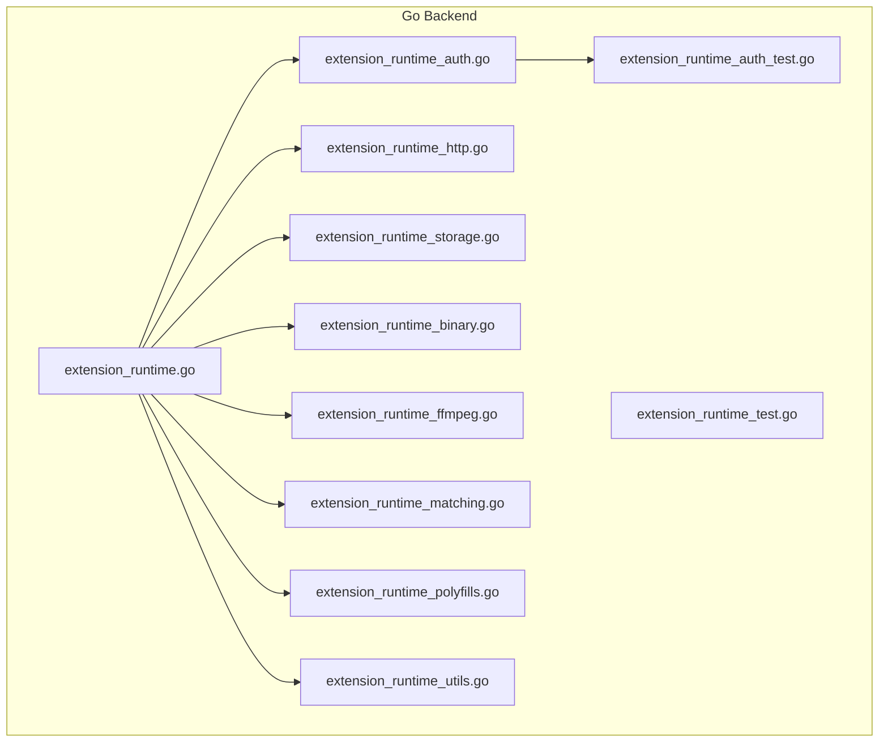
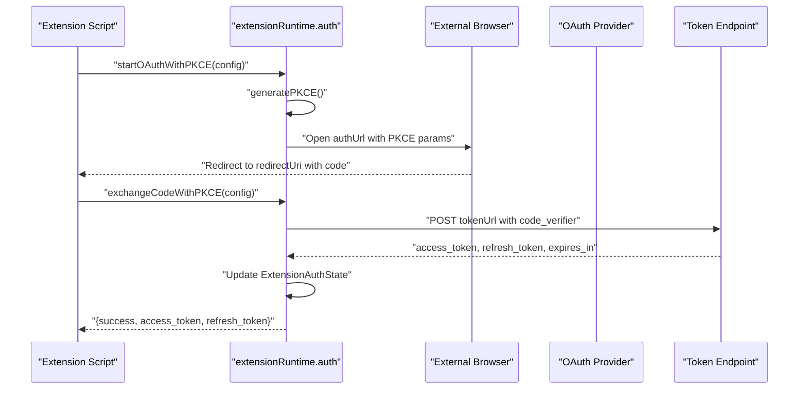
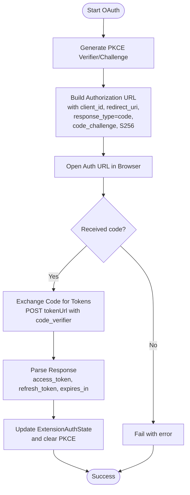
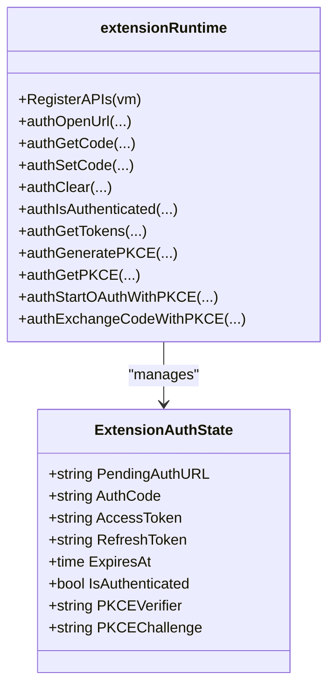
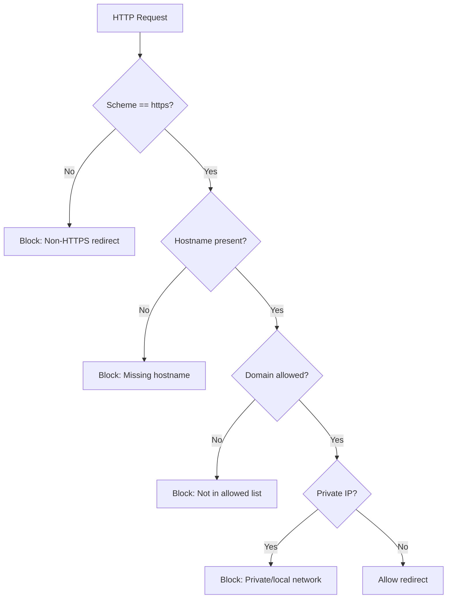
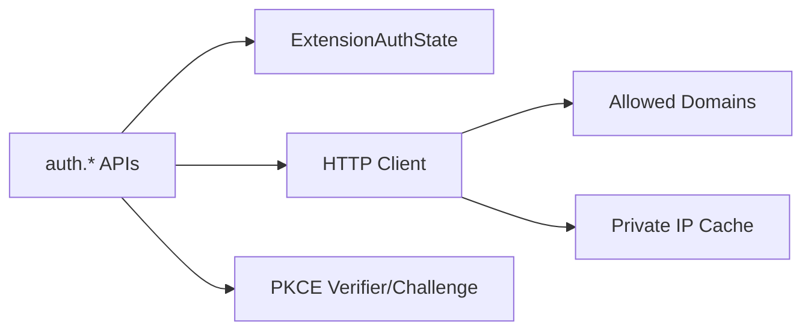

# Authentication Management

<cite>
**Referenced Files in This Document**
- [extension_runtime_auth.go](file://go_backend_spotiflac/extension_runtime_auth.go)
- [extension_runtime.go](file://go_backend_spotiflac/extension_runtime.go)
- [extension_runtime_supplement_test.go](file://go_backend_spotiflac/extension_runtime_supplement_test.go)
- [extension_runtime_binary.go](file://go_backend_spotiflac/extension_runtime_binary.go)
- [extension_runtime_http.go](file://go_backend_spotiflac/extension_runtime_http.go)
- [extension_runtime_storage.go](file://go_backend_spotiflac/extension_runtime_storage.go)
- [extension_runtime_utils.go](file://go_backend_spotiflac/extension_runtime_utils.go)
- [extension_runtime_ffmpeg.go](file://go_backend_spotiflac/extension_runtime_ffmpeg.go)
- [extension_runtime_file.go](file://go_backend_spotiflac/extension_runtime_file.go)
- [extension_runtime_matching.go](file://go_backend_spotiflac/extension_runtime_matching.go)
- [extension_runtime_polyfills.go](file://go_backend_spotiflac/extension_runtime_polyfills.go)
- [extension_runtime_test.go](file://go_backend_spotiflac/extension_runtime_test.go)
- [extension_runtime_storage_test.go](file://go_backend_spotiflac/extension_runtime_storage_test.go)
- [extension_runtime_binary_test.go](file://go_backend_spotiflac/extension_runtime_binary_test.go)
- [extension_runtime_supplement_test.go](file://go_backend_spotiflac/extension_runtime_supplement_test.go)
- [extension_runtime_utils_test.go](file://go_backend_spotiflac/extension_runtime_utils_test.go)
- [extension_runtime_polyfills_test.go](file://go_backend_spotiflac/extension_runtime_polyfills_test.go)
- [extension_runtime_file_test.go](file://go_backend_spotiflac/extension_runtime_file_test.go)
- [extension_runtime_matching_test.go](file://go_backend_spotiflac/extension_runtime_matching_test.go)
- [extension_runtime_ffmpeg_test.go](file://go_backend_spotiflac/extension_runtime_ffmpeg_test.go)
- [extension_runtime_http_test.go](file://go_backend_spotiflac/extension_runtime_http_test.go)
- [extension_runtime_auth_test.go](file://go_backend_spotiflac/extension_runtime_auth_test.go)
- [extension_runtime_storage_test.go](file://go_backend_spotiflac/extension_runtime_storage_test.go)
- [extension_runtime_binary_test.go](file://go_backend_spotiflac/extension_runtime_binary_test.go)
- [extension_runtime_supplement_test.go](file://go_backend_spotiflac/extension_runtime_supplement_test.go)
- [extension_runtime_utils_test.go](file://go_backend_spotiflac/extension_runtime_utils_test.go)
- [extension_runtime_polyfills_test.go](file://go_backend_spotiflac/extension_runtime_polyfills_test.go)
- [extension_runtime_file_test.go](file://go_backend_spotiflac/extension_runtime_file_test.go)
- [extension_runtime_matching_test.go](file://go_backend_spotiflac/extension_runtime_matching_test.go)
- [extension_runtime_ffmpeg_test.go](file://go_backend_spotiflac/extension_runtime_ffmpeg_test.go)
- [extension_runtime_http_test.go](file://go_backend_spotiflac/extension_runtime_http_test.go)
- [extension_runtime_auth_test.go](file://go_backend_spotiflac/extension_runtime_auth_test.go)
- [extension_runtime_storage_test.go](file://go_backend_spotiflac/extension_runtime_storage_test.go)
- [extension_runtime_binary_test.go](file://go_backend_spotiflac/extension_runtime_binary_test.go)
- [extension_runtime_supplement_test.go](file://go_backend_spotiflac/extension_runtime_supplement_test.go)
- [extension_runtime_utils_test.go](file://go_backend_spotiflac/extension_runtime_utils_test.go)
- [extension_runtime_polyfills_test.go](file://go_backend_spotiflac/extension_runtime_polyfills_test.go)
- [extension_runtime_file_test.go](file://go_backend_spotiflac/extension_runtime_file_test.go)
- [extension_runtime_matching_test.go](file://go_backend_spotiflac/extension_runtime_matching_test.go)
- [extension_runtime_ffmpeg_test.go](file://go_backend_spotiflac/extension_runtime_ffmpeg_test.go)
- [extension_runtime_http_test.go](file://go_backend_spotiflac/extension_runtime_http_test.go)
- [extension_runtime_auth_test.go](file://go_backend_spotiflac/extension_runtime_auth_test.go)
- [extension_runtime_storage_test.go](file://go_backend_spotiflac/extension_runtime_storage_test.go)
- [extension_runtime_binary_test.go](file://go_backend_spotiflac/extension_runtime_binary_test.go)
- [extension_runtime_supplement_test.go](file://go_backend_spotiflac/extension_runtime_supplement_test.go)
- [extension_runtime_utils_test.go](file://go_backend_spotiflac/extension_runtime_utils_test.go)
- [extension_runtime_polyfills_test.go](file://go_backend_spotiflac/extension_runtime_polyfills_test.go)
- [extension_runtime_file_test.go](file://go_backend_spotiflac/extension_runtime_file_test.go)
- [extension_runtime_matching_test.go](file://go_backend_spotiflac/extension_runtime_matching_test.go)
- [extension_runtime_ffmpeg_test.go](file://go_backend_spotiflac/extension_runtime_ffmpeg_test.go)
- [extension_runtime_http_test.go](file://go_backend_spotiflac/extension_runtime_http_test.go)
- [extension_runtime_auth_test.go](file://go_backend_spotiflac/extension_runtime_auth_test.go)
- [extension_runtime_storage_test.go](file://go_backend_spotiflac/extension_runtime_storage_test.go)
- [extension_runtime_binary_test.go](file://go_backend_spotiflac/extension_runtime_binary_test.go)
- [extension_runtime_supplement_test.go](file://go_backend_spotiflac/extension_runtime_supplement_test.go)
- [extension_runtime_utils_test.go](file://go_backend_spotiflac/extension_runtime_utils_test.go)
- [extension_runtime_polyfills_test.go](file://go_backend_spotiflac/extension_runtime_polyfills_test.go)
- [extension_runtime_file_test.go](file://go_backend_spotiflac/extension_runtime_file_test.go)
- [extension_runtime_matching_test.go](file://go_backend_spotiflac/extension_runtime_matching_test.go)
- [extension_runtime_ffmpeg_test.go](file://go_backend_spotiflac/extension_runtime_ffmpeg_test.go)
- [extension_runtime_http_test.go](file://go_backend_spotiflac/extension_runtime_http_test.go)
- [extension_runtime_auth_test.go](file://go_backend_spotiflac/extension_runtime_auth_test.go)
- [extension_runtime_storage_test.go](file://go_backend_spotiflac/extension_runtime_storage_test.go)
- [extension_runtime_binary_test.go](file://go_backend_spotiflac/extension_runtime_binary_test.go)
- [extension_runtime_supplement_test.go](file://go_backend_spotiflac/extension_runtime_supplement_test.go)
- [extension_runtime_utils_test.go](file://go_backend_spotiflac/extension_runtime_utils_test.go)
- [extension_runtime_polyfills_test.go](file://go_backend_spotiflac/extension_runtime_polyfills_test.go)
- [extension_runtime_file_test.go](file://go_backend_spotiflac/extension_runtime_file_test.go)
- [extension_runtime_matching_test.go](file://go_backend_spotiflac/extension_runtime_matching_test.go)
- [extension_runtime_ffmpeg_test.go](file://go_backend_spotiflac/extension_runtime_ffmpeg_test.go)
- [extension_runtime_http_test.go](file://go_backend_spotiflac/extension_runtime_http_test.go)
- [extension_runtime_auth_test.go](file://go_backend_spotiflac/extension_runtime_auth_test.go)
- [extension_runtime_storage_test.go](file://go_backend_spotiflac/extension_runtime_storage_test.go)
- [extension_runtime_binary_test.go](file://go_backend_spotiflac/extension_runtime_binary_test.go)
- [extension_runtime_supplement_test.go](file://go_backend_spotiflac/extension_runtime_supplement_test.go)
- [extension_runtime_utils_test.go](file://go_backend_spotiflac/extension_runtime_utils_test.go)
- [extension_runtime_polyfills_test.go](file://go_backend_spotiflac/extension_runtime_polyfills_test.go)
- [extension_runtime_file_test.go](file://go_backend_spotiflac/extension_runtime_file_test.go)
- [extension_runtime_matching_test.go](file://go_backend_spotiflac/extension_runtime_matching_test.go)
- [extension_runtime_ffmpeg_test.go](file://go_backend_spot......
</cite>

## Table of Contents
1. [Introduction](#introduction)
2. [Project Structure](#project-structure)
3. [Core Components](#core-components)
4. [Architecture Overview](#architecture-overview)
5. [Detailed Component Analysis](#detailed-component-analysis)
6. [Dependency Analysis](#dependency-analysis)
7. [Performance Considerations](#performance-considerations)
8. [Troubleshooting Guide](#troubleshooting-guide)
9. [Conclusion](#conclusion)

## Introduction
This document describes the authentication and authorization system for extensions within the application’s Go backend. It focuses on the OAuth 2.0 flow implementation, PKCE support, token lifecycle management, authentication state tracking, credential storage, and security controls such as redirect validation, private IP blocking, and domain restrictions. It also provides guidance for integrating external authentication providers and building custom OAuth implementations.

## Project Structure
The authentication system is implemented in the Go backend module under the “go_backend_spotiflac” directory. The relevant files include:
- Extension runtime and authentication APIs
- HTTP client configuration with redirect validation and domain restrictions
- Private IP caching and blocking logic
- Tests validating PKCE and OAuth flows

**Diagram sources**
- [extension_runtime.go](file://go_backend_spotiflac/extension_runtime.go)
- [extension_runtime_auth.go](file://go_backend_spotiflac/extension_runtime_auth.go)
- [extension_runtime_http.go](file://go_backend_spotiflac/extension_runtime_http.go)
- [extension_runtime_storage.go](file://go_backend_spotiflac/extension_runtime_storage.go)
- [extension_runtime_binary.go](file://go_backend_spotiflac/extension_runtime_binary.go)
- [extension_runtime_ffmpeg.go](file://go_backend_spotiflac/extension_runtime_ffmpeg.go)
- [extension_runtime_matching.go](file://go_backend_spotiflac/extension_runtime_matching.go)
- [extension_runtime_polyfills.go](file://go_backend_spotiflac/extension_runtime_polyfills.go)
- [extension_runtime_utils.go](file://go_backend_spotiflac/extension_runtime_utils.go)
- [extension_runtime_test.go](file://go_backend_spotiflac/extension_runtime_test.go)
- [extension_runtime_auth_test.go](file://go_backend_spotiflac/extension_runtime_auth_test.go)

**Section sources**
- [extension_runtime.go](file://go_backend_spotiflac/extension_runtime.go)
- [extension_runtime_auth.go](file://go_backend_spotiflac/extension_runtime_auth.go)

## Core Components
- ExtensionAuthState: Holds per-extension authentication state including pending auth URL, authorization code, access/refresh tokens, expiration, and PKCE values.
- PendingAuthRequest: Tracks the last initiated auth URL and expected callback for an extension.
- HTTP client with redirect policy: Enforces HTTPS-only redirects, validates domains against allowed lists, and blocks private/local IPs.
- PKCE helpers: Generates verifiers and challenges, and exposes getters/setters for PKCE state.
- Token exchange: Exchanges authorization code for tokens, parses responses, and updates state.
- Credential storage: Provides a credentials API for extensions to securely store and retrieve sensitive data.

**Section sources**
- [extension_runtime.go](file://go_backend_spotiflac/extension_runtime.go)
- [extension_runtime_auth.go](file://go_backend_spotiflac/extension_runtime_auth.go)

## Architecture Overview
The authentication flow is exposed to extensions via a JavaScript-like API registered in the extension runtime. Extensions call auth APIs to initiate OAuth with PKCE, receive callbacks, and exchange the authorization code for tokens. The runtime enforces strict security policies during HTTP requests and manages authentication state.

**Diagram sources**
- [extension_runtime_auth.go](file://go_backend_spotiflac/extension_runtime_auth.go)

## Detailed Component Analysis

### OAuth 2.0 with PKCE
- PKCE verifier/challenge generation and caching
- Building OAuth authorization URLs with PKCE parameters
- Handling authorization code callbacks and clearing PKCE state after exchange
- Token exchange with code_verifier and optional redirect_uri
- Parsing token responses and updating authentication state

**Diagram sources**
- [extension_runtime_auth.go](file://go_backend_spotiflac/extension_runtime_auth.go)

**Section sources**
- [extension_runtime_auth.go](file://go_backend_spotiflac/extension_runtime_auth.go)

### Authentication State Tracking
- Per-extension state maintained in a synchronized map
- Fields include pending auth URL, auth code, tokens, expiration, and PKCE values
- Helpers to set/get tokens and check authentication status with expiry awareness

**Diagram sources**
- [extension_runtime.go](file://go_backend_spotiflac/extension_runtime.go)

**Section sources**
- [extension_runtime.go](file://go_backend_spotiflac/extension_runtime.go)

### Token Management
- Access and refresh tokens are stored per extension
- Expiration is tracked and used to invalidate stale authentication
- On successful token exchange, PKCE values are cleared to prevent reuse

**Section sources**
- [extension_runtime_auth.go](file://go_backend_spotiflac/extension_runtime_auth.go)

### Security Controls
- HTTPS enforcement for auth URLs and redirects
- Domain restriction checks against allowed lists
- Private/local IP blocking with caching to avoid repeated DNS lookups
- Redirect loop protection

**Diagram sources**
- [extension_runtime.go](file://go_backend_spotiflac/extension_runtime.go)

**Section sources**
- [extension_runtime.go](file://go_backend_spotiflac/extension_runtime.go)

### Redirect Validation and Domain Restrictions
- Redirects are validated to ensure HTTPS-only and allowed domains
- Private IP detection uses cached lookups with TTL and eviction
- Errors surfaced to callers indicate whether the block was due to private IP or domain not allowed

**Section sources**
- [extension_runtime.go](file://go_backend_spotiflac/extension_runtime.go)

### Credential Storage
- Credentials API allows extensions to store, retrieve, and remove sensitive data
- Used alongside authentication state to persist tokens and related secrets

**Section sources**
- [extension_runtime.go](file://go_backend_spotiflac/extension_runtime.go)

### Integration with External Providers
- Extensions configure OAuth by providing provider endpoints and client credentials
- The runtime constructs PKCE-enabled authorization URLs and performs token exchanges
- Tests demonstrate end-to-end flows for generating PKCE, starting OAuth, and exchanging code for tokens

**Section sources**
- [extension_runtime_auth.go](file://go_backend_spotiflac/extension_runtime_auth.go)
- [extension_runtime_supplement_test.go](file://go_backend_spotiflac/extension_runtime_supplement_test.go)

## Dependency Analysis
- The extension runtime registers the auth API surface into the JS VM
- HTTP client depends on the runtime’s allowed domain list and private IP cache
- PKCE and token exchange depend on the auth state map

**Diagram sources**
- [extension_runtime.go](file://go_backend_spotiflac/extension_runtime.go)
- [extension_runtime_auth.go](file://go_backend_spotiflac/extension_runtime_auth.go)

**Section sources**
- [extension_runtime.go](file://go_backend_spotiflac/extension_runtime.go)
- [extension_runtime_auth.go](file://go_backend_spotiflac/extension_runtime_auth.go)

## Performance Considerations
- Private IP cache reduces repeated DNS queries and improves redirect validation throughput
- Token expiration checks avoid unnecessary network calls for expired sessions
- PKCE verifier/challenge are cleared after exchange to prevent misuse and reduce memory footprint

## Troubleshooting Guide
Common issues and resolutions:
- Invalid auth URL: Ensure HTTPS scheme and no embedded credentials; private/local hostnames are rejected
- No PKCE verifier found: Call PKCE generation or OAuth start before exchanging the code
- Redirect blocked: Verify domain is allowed and not resolving to a private IP; check redirect chain depth
- Token exchange failure: Inspect error fields returned by the provider; ensure correct token endpoint and client credentials

**Section sources**
- [extension_runtime_auth.go](file://go_backend_spotiflac/extension_runtime_auth.go)
- [extension_runtime.go](file://go_backend_spotiflac/extension_runtime.go)

## Conclusion
The authentication subsystem provides a robust, secure foundation for extension-driven OAuth integrations. It enforces HTTPS, restricts domains, blocks private networks, and supports PKCE-compliant flows. Authentication state and tokens are managed per extension with careful attention to expiration and secure storage. The design enables straightforward integration with external providers while maintaining strong security guarantees.