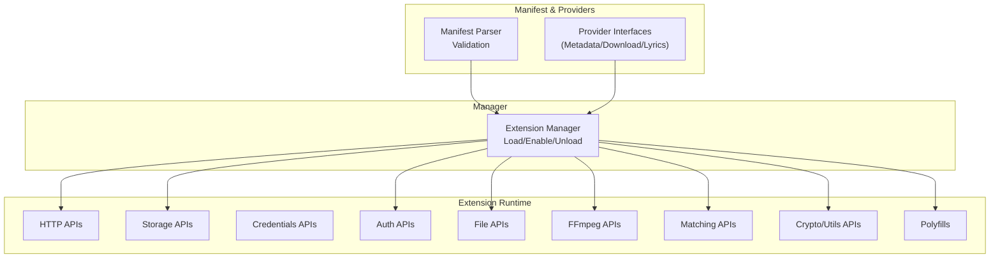
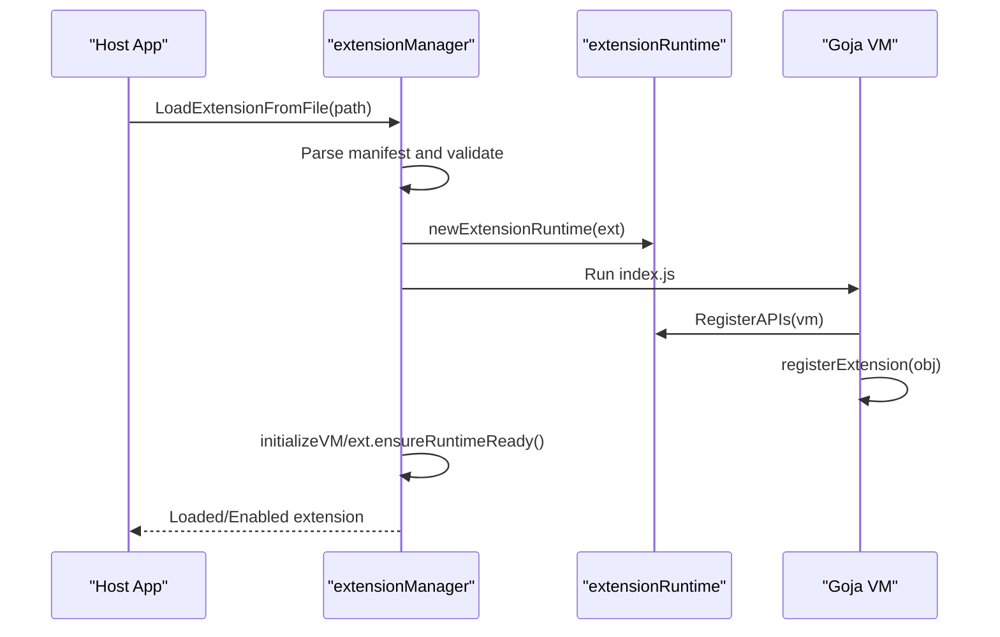
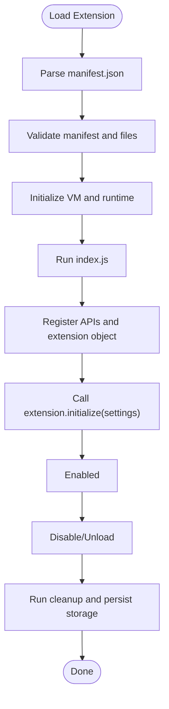
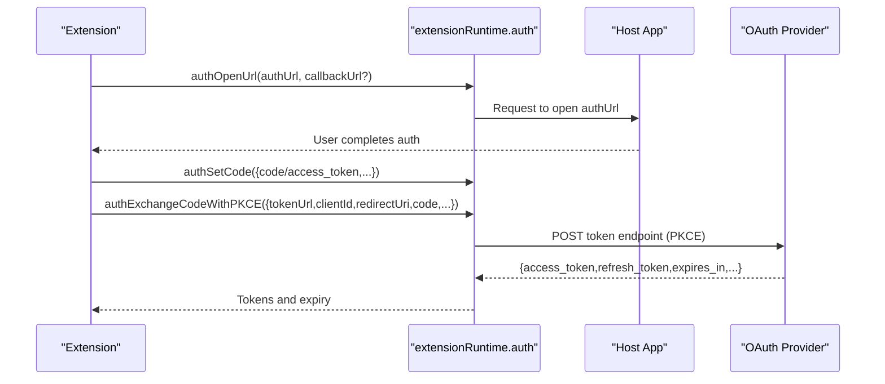
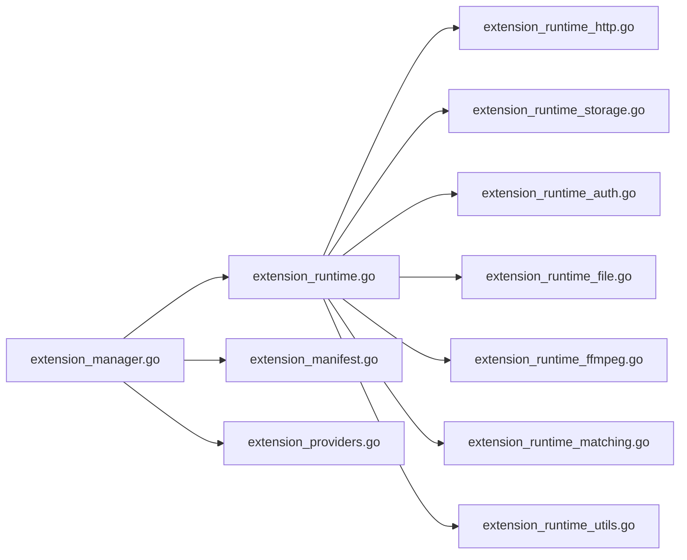

# Extension API

<cite>
**Referenced Files in This Document**
- [extension_runtime.go](file://go_backend_spotiflac/extension_runtime.go)
- [extension_manifest.go](file://go_backend_spotiflac/extension_manifest.go)
- [extension_providers.go](file://go_backend_spotiflac/extension_providers.go)
- [extension_manager.go](file://go_backend_spotiflac/extension_manager.go)
- [extension_runtime_auth.go](file://go_backend_spotiflac/extension_runtime_auth.go)
- [extension_runtime_http.go](file://go_backend_spotiflac/extension_runtime_http.go)
- [extension_runtime_storage.go](file://go_backend_spotiflac/extension_runtime_storage.go)
- [extension_runtime_file.go](file://go_backend_spotiflac/extension_runtime_file.go)
- [extension_runtime_binary.go](file://go_backend_spotiflac/extension_runtime_binary.go)
- [extension_runtime_ffmpeg.go](file://go_backend_spotiflac/extension_runtime_ffmpeg.go)
- [extension_runtime_matching.go](file://go_backend_spotiflac/extension_runtime_matching.go)
- [extension_runtime_polyfills.go](file://go_backend_spotiflac/extension_runtime_polyfills.go)
- [extension_runtime_utils.go](file://go_backend_spotiflac/extension_runtime_utils.go)
</cite>

## Table of Contents
1. [Introduction](#introduction)
2. [Project Structure](#project-structure)
3. [Core Components](#core-components)
4. [Architecture Overview](#architecture-overview)
5. [Detailed Component Analysis](#detailed-component-analysis)
6. [Dependency Analysis](#dependency-analysis)
7. [Performance Considerations](#performance-considerations)
8. [Troubleshooting Guide](#troubleshooting-guide)
9. [Conclusion](#conclusion)
10. [Appendices](#appendices)

## Introduction
This document describes Bitly’s Extension API for building plugins that integrate with the application’s backend. It covers the JavaScript runtime interface exposed to extensions, lifecycle hooks, provider registration, and extension development patterns. It also documents the extension manifest format, permissions, capabilities, authentication flows, inter-plugin communication, and security/sandboxing considerations.

## Project Structure
The Extension API is implemented in the Go backend under the go_backend_spotiflac module. Key areas:
- Runtime and sandboxing: HTTP, file, crypto, matching, logging, polyfills, FFmpeg integration
- Manifest parsing and validation: extension types, permissions, settings, capabilities
- Provider interfaces: metadata, download, and lyrics providers
- Manager: loading, enabling/disabling, initialization, and lifecycle management
- Authentication: OAuth flows, PKCE, token storage, and state management

**Diagram sources**
- [extension_runtime.go:84-147](file://go_backend_spotiflac/extension_runtime.go#L84-L147)
- [extension_manifest.go:116-138](file://go_backend_spotiflac/extension_manifest.go#L116-L138)
- [extension_providers.go:19-83](file://go_backend_spotiflac/extension_providers.go#L19-L83)
- [extension_manager.go:120-139](file://go_backend_spotiflac/extension_manager.go#L120-L139)

**Section sources**
- [extension_runtime.go:84-147](file://go_backend_spotiflac/extension_runtime.go#L84-L147)
- [extension_manifest.go:116-138](file://go_backend_spotiflac/extension_manifest.go#L116-L138)
- [extension_providers.go:19-83](file://go_backend_spotiflac/extension_providers.go#L19-L83)
- [extension_manager.go:120-139](file://go_backend_spotiflac/extension_manager.go#L120-L139)

## Core Components
- JavaScript runtime binding: Extensions run inside a sandboxed Goja VM with a curated API surface.
- Manifest-driven configuration: Defines type, permissions, settings, capabilities, and optional features like custom search, matching, and post-processing.
- Provider interfaces: Extensions can act as metadata providers, download providers, or lyrics providers.
- Lifecycle: Load, validate, enable, initialize with stored settings, run, and cleanup.
- Security model: Strict HTTP sandboxing, domain allowlists, private IP blocking, and file sandboxing.

**Section sources**
- [extension_runtime.go:424-533](file://go_backend_spotiflac/extension_runtime.go#L424-L533)
- [extension_manifest.go:116-138](file://go_backend_spotiflac/extension_manifest.go#L116-L138)
- [extension_providers.go:19-83](file://go_backend_spotiflac/extension_providers.go#L19-L83)
- [extension_manager.go:470-539](file://go_backend_spotiflac/extension_manager.go#L470-L539)

## Architecture Overview
The extension system composes a manager, a runtime, and a set of APIs. The manager loads and validates extensions, initializes the runtime, and exposes a JavaScript object graph to the extension. The runtime enforces sandboxing and exposes typed APIs for HTTP, storage, credentials, auth, file IO, FFmpeg, matching, and utilities.

**Diagram sources**
- [extension_manager.go:158-294](file://go_backend_spotiflac/extension_manager.go#L158-L294)
- [extension_manager.go:296-344](file://go_backend_spotiflac/extension_manager.go#L296-L344)
- [extension_runtime.go:424-533](file://go_backend_spotiflac/extension_runtime.go#L424-L533)

## Detailed Component Analysis

### JavaScript Runtime Interface
Extensions receive a JavaScript object graph bound to the Go runtime. The most important top-level objects are:
- http: HTTP helpers (get, post, put, delete, patch, request, clearCookies)
- storage: Key-value persistence scoped to the extension’s data directory
- credentials: Encrypted key-value storage for secrets
- auth: OAuth/PKCE helpers and token state
- file: File download, existence checks, read/write, move/delete, size
- ffmpeg: Queue FFmpeg commands and inspect audio quality
- matching: String similarity, duration comparison, normalization
- utils: Crypto/hash/base64/json/encryption/decryption, UA/version helpers, sleep, cancellation, logging
- gobackend: Backend helpers (filename sanitization, lyrics lookup, ISRC indexing, template filename builder, local time)
- Polyfills: fetch, atob/btoa, TextEncoder/TextDecoder, URL/URLSearchParams, JSON

These are registered during runtime initialization.

**Section sources**
- [extension_runtime.go:424-533](file://go_backend_spotiflac/extension_runtime.go#L424-L533)
- [extension_runtime_http.go:71-145](file://go_backend_spotiflac/extension_runtime_http.go#L71-L145)
- [extension_runtime_storage.go:171-255](file://go_backend_spotiflac/extension_runtime_storage.go#L171-L255)
- [extension_runtime_auth.go:55-100](file://go_backend_spotiflac/extension_runtime_auth.go#L55-L100)
- [extension_runtime_file.go:110-311](file://go_backend_spotiflac/extension_runtime_file.go#L110-L311)
- [extension_runtime_ffmpeg.go:53-108](file://go_backend_spotiflac/extension_runtime_ffmpeg.go#L53-L108)
- [extension_runtime_matching.go:9-54](file://go_backend_spotiflac/extension_runtime_matching.go#L9-L54)
- [extension_runtime_utils.go:19-380](file://go_backend_spotiflac/extension_runtime_utils.go#L19-L380)
- [extension_runtime_polyfills.go:15-150](file://go_backend_spotiflac/extension_runtime_polyfills.go#L15-L150)

### Extension Lifecycle Hooks
- Load: The manager reads the .spotiflac-ext archive or directory, parses manifest, validates, and extracts files into an extension directory.
- Validate: Ensures manifest presence and correctness, and that index.js exists.
- Enable: Initializes the VM, registers APIs, runs index.js, and calls extension.initialize(settings) if present.
- Disable/Unload: Runs cleanup, persists storage, tears down runtime.
- Settings: Stored per extension ID; initialize is invoked with persisted settings.

**Diagram sources**
- [extension_manager.go:158-294](file://go_backend_spotiflac/extension_manager.go#L158-L294)
- [extension_manager.go:296-414](file://go_backend_spotiflac/extension_manager.go#L296-L414)
- [extension_manager.go:416-539](file://go_backend_spotiflac/extension_manager.go#L416-L539)

**Section sources**
- [extension_manager.go:158-294](file://go_backend_spotiflac/extension_manager.go#L158-L294)
- [extension_manager.go:296-414](file://go_backend_spotiflac/extension_manager.go#L296-L414)
- [extension_manager.go:416-539](file://go_backend_spotiflac/extension_manager.go#L416-L539)

### Provider Registration Mechanisms
Extensions register themselves by exporting an object via registerExtension and assigning it to the global extension variable. The manager expects this call to succeed and binds the APIs before invoking initialize(settings).

- Registration: registerExtension(extensionObject)
- Initialization: extension.initialize(settings) (optional)
- Cleanup: extension.cleanup() (optional)

The runtime exposes provider wrappers that convert JS values to internal provider structs and vice versa.

**Section sources**
- [extension_manager.go:325-343](file://go_backend_spotiflac/extension_manager.go#L325-L343)
- [extension_providers.go:523-533](file://go_backend_spotiflac/extension_providers.go#L523-L533)
- [extension_providers.go:673-705](file://go_backend_spotiflac/extension_providers.go#L673-L705)

### Plugin Development Patterns
Common patterns include:
- Metadata provider: Implement search and resolution functions; return arrays of ExtTrackMetadata/ExtAlbumMetadata/ExtArtistMetadata.
- Download provider: Resolve availability, compute URLs, and produce normalized download results.
- Lyrics provider: Provide LRC lyrics retrieval.
- Settings UI: Define settings in manifest; use storage for transient state and credentials for secrets.
- Inter-plugin communication: Use shared storage or credentials to coordinate state.

**Section sources**
- [extension_providers.go:19-83](file://go_backend_spotiflac/extension_providers.go#L19-L83)
- [extension_providers.go:417-448](file://go_backend_spotiflac/extension_providers.go#L417-L448)
- [extension_manifest.go:34-62](file://go_backend_spotiflac/extension_manifest.go#L34-L62)

### Extension Manifest Format
The manifest defines identity, capabilities, permissions, and optional behaviors:
- Identity: name, displayName, version, description, homepage, icon
- Types: metadata_provider, download_provider, lyrics_provider
- Permissions: network domains, storage, file, allowHttp
- Settings: key/type/label/description/required/secret/default/options/action
- Capabilities: arbitrary key/value map (e.g., replacesBuiltInProviders)
- Optional features: searchBehavior, urlHandler, trackMatching, postProcessing, serviceHealth, minAppVersion, skip flags

Validation ensures required fields and correct types.

**Section sources**
- [extension_manifest.go:116-138](file://go_backend_spotiflac/extension_manifest.go#L116-L138)
- [extension_manifest.go:162-242](file://go_backend_spotiflac/extension_manifest.go#L162-L242)

### Authentication Flows
The runtime supports:
- Open an auth URL for user consent
- Store/retrieve auth code
- Exchange code for tokens (including PKCE)
- Persist tokens and refresh state
- Enforce HTTPS-only and domain allowlist for auth endpoints

**Diagram sources**
- [extension_runtime_auth.go:55-100](file://go_backend_spotiflac/extension_runtime_auth.go#L55-L100)
- [extension_runtime_auth.go:388-549](file://go_backend_spotiflac/extension_runtime_auth.go#L388-L549)

**Section sources**
- [extension_runtime_auth.go:55-100](file://go_backend_spotiflac/extension_runtime_auth.go#L55-L100)
- [extension_runtime_auth.go:388-549](file://go_backend_spotiflac/extension_runtime_auth.go#L388-L549)

### Inter-Plugin Communication
- Shared storage: Use storage.get/set/remove to share lightweight state across extensions.
- Credentials: Use credentials.store/get/remove/has for secure cross-extension secret sharing.
- File sandbox: Use file.download to stage artifacts in the extension’s data directory.

**Section sources**
- [extension_runtime_storage.go:171-255](file://go_backend_spotiflac/extension_runtime_storage.go#L171-L255)
- [extension_runtime_storage.go:370-455](file://go_backend_spotiflac/extension_runtime_storage.go#L370-L455)
- [extension_runtime_file.go:110-311](file://go_backend_spotiflac/extension_runtime_file.go#L110-L311)

### Security and Sandboxing
- HTTP sandbox:
  - Only HTTPS allowed unless AllowHTTP is granted
  - Redirects must remain HTTPS or be explicitly allowed
  - Domains must be in the manifest’s network allowlist
  - Private/local IPs are blocked
- File sandbox:
  - Only relative paths within the extension’s data directory are allowed
  - Absolute paths are rejected unless explicitly permitted by configuration
- Secrets:
  - Credentials are encrypted at rest using AES-GCM keyed by extension ID and salt
- Logging:
  - Console logs are captured and tagged with extension ID

**Section sources**
- [extension_runtime_http.go:38-69](file://go_backend_spotiflac/extension_runtime_http.go#L38-L69)
- [extension_runtime_http.go:234-353](file://go_backend_spotiflac/extension_runtime_http.go#L234-L353)
- [extension_runtime_file.go:75-108](file://go_backend_spotiflac/extension_runtime_file.go#L75-L108)
- [extension_runtime_storage.go:257-367](file://go_backend_spotiflac/extension_runtime_storage.go#L257-L367)
- [extension_runtime.go:250-286](file://go_backend_spotiflac/extension_runtime.go#L250-L286)

### API Reference

#### HTTP APIs
- http.get(url, headers?): GET request with response metadata
- http.post(url, body?, headers?): POST request
- http.put(url, body?, headers?): PUT request
- http.delete(url, headers?): DELETE request
- http.patch(url, body?, headers?): PATCH request
- http.request(url, options?): Generic request with method/body/headers
- http.clearCookies(): Clear stored cookies

Response shape includes statusCode/status/ok/url/body/headers.

**Section sources**
- [extension_runtime_http.go:71-145](file://go_backend_spotiflac/extension_runtime_http.go#L71-L145)
- [extension_runtime_http.go:147-243](file://go_backend_spotiflac/extension_runtime_http.go#L147-L243)
- [extension_runtime_http.go:245-353](file://go_backend_spotiflac/extension_runtime_http.go#L245-L353)
- [extension_runtime_http.go:355-479](file://go_backend_spotiflac/extension_runtime_http.go#L355-L479)
- [extension_runtime_http.go:481-491](file://go_backend_spotiflac/extension_runtime_http.go#L481-L491)

#### Storage APIs
- storage.get(key, defaultValue?): Get value or default
- storage.set(key, value): Set value; returns boolean success
- storage.remove(key): Remove key; returns boolean success

Values are persisted to a JSON file in the extension’s data directory with debounced writes.

**Section sources**
- [extension_runtime_storage.go:171-255](file://go_backend_spotiflac/extension_runtime_storage.go#L171-L255)
- [extension_runtime_storage.go:39-158](file://go_backend_spotiflac/extension_runtime_storage.go#L39-L158)

#### Credentials APIs
- credentials.store(key, value): Encrypt and store secret
- credentials.get(key, defaultValue?): Retrieve secret
- credentials.remove(key): Delete secret
- credentials.has(key): Check presence

Secrets are encrypted at rest using AES-GCM with a key derived from the extension ID and a per-extension salt.

**Section sources**
- [extension_runtime_storage.go:370-455](file://go_backend_spotiflac/extension_runtime_storage.go#L370-L455)
- [extension_runtime_storage.go:257-367](file://go_backend_spotiflac/extension_runtime_storage.go#L257-L367)

#### Auth APIs
- auth.openAuthUrl(authUrl, callbackUrl?): Requests host to open auth URL
- auth.getAuthCode(): Returns last received auth code
- auth.setAuthCode(codeOrTokens): Sets code/tokens/expiry
- auth.clearAuth(): Clears auth state
- auth.isAuthenticated(): Boolean auth state
- auth.getTokens(): Returns tokens and expiry
- auth.generatePKCE(length?): Generates verifier/challenge
- auth.getPKCE(): Returns current PKCE
- auth.startOAuthWithPKCE(config): Builds PKCE auth URL and stores state
- auth.exchangeCodeWithPKCE(config): Exchanges code for tokens

**Section sources**
- [extension_runtime_auth.go:55-100](file://go_backend_spotiflac/extension_runtime_auth.go#L55-L100)
- [extension_runtime_auth.go:102-150](file://go_backend_spotiflac/extension_runtime_auth.go#L102-L150)
- [extension_runtime_auth.go:152-202](file://go_backend_spotiflac/extension_runtime_auth.go#L152-L202)
- [extension_runtime_auth.go:231-282](file://go_backend_spotiflac/extension_runtime_auth.go#L231-L282)
- [extension_runtime_auth.go:284-386](file://go_backend_spotiflac/extension_runtime_auth.go#L284-L386)
- [extension_runtime_auth.go:388-549](file://go_backend_spotiflac/extension_runtime_auth.go#L388-L549)

#### File APIs
- file.download(url, outputPath, options?): Downloads to file; supports headers, onProgress callback, chunked downloads
- file.exists(path): Existence check
- file.delete(path): Delete file
- file.read(path): Read text
- file.readBytes(path, options?): Read bytes with offset/length/encoding
- file.write(path, data): Write text
- file.writeBytes(path, data, options?): Write bytes with append/truncate/offset/encoding
- file.copy(src, dst), file.move(src, dst), file.getSize(path)

Options include headers, onProgress, chunked, chunkSize, and encoding.

**Section sources**
- [extension_runtime_file.go:110-311](file://go_backend_spotiflac/extension_runtime_file.go#L110-L311)
- [extension_runtime_file.go:313-536](file://go_backend_spotiflac/extension_runtime_file.go#L313-L536)
- [extension_runtime_file.go:538-800](file://go_backend_spotiflac/extension_runtime_file.go#L538-L800)

#### FFmpeg APIs
- ffmpeg.execute(command): Queue command and wait up to timeout; returns success/output/error
- ffmpeg.getInfo(path): Inspect audio quality (bit depth, sample rate, samples, duration)
- ffmpeg.convert(input, output, options?): Build and execute conversion command

FFmpeg commands are tracked globally and resolved asynchronously.

**Section sources**
- [extension_runtime_ffmpeg.go:53-108](file://go_backend_spotiflac/extension_runtime_ffmpeg.go#L53-L108)
- [extension_runtime_ffmpeg.go:110-135](file://go_backend_spotiflac/extension_runtime_ffmpeg.go#L110-L135)
- [extension_runtime_ffmpeg.go:137-182](file://go_backend_spotiflac/extension_runtime_ffmpeg.go#L137-L182)

#### Matching APIs
- matching.compareStrings(a, b): Similarity score in [0,1]
- matching.compareDuration(dur1, dur2, tolerance?): Duration match within tolerance
- matching.normalizeString(s): Normalize for matching

**Section sources**
- [extension_runtime_matching.go:9-54](file://go_backend_spotiflac/extension_runtime_matching.go#L9-L54)

#### Utilities and Crypto APIs
- utils.base64Encode/Decode, md5, sha256, hmacSHA256, hmacSHA256Base64, hmacSHA1
- utils.parseJSON/stringifyJSON
- utils.cryptoEncrypt/cryptoDecrypt/cryptoGenerateKey
- utils.randomUserAgent, appVersion, appUserAgent
- utils.sleep(ms), isDownloadCancelled(), isRequestCancelled(), setDownloadStatus(status)
- log.debug/info/warn/error
- gobackend.sanitizeFilename, getAudioQuality, getLyricsLRC, checkISRCExists, addToISRCIndex, buildFilename, getLocalTime

**Section sources**
- [extension_runtime_utils.go:19-380](file://go_backend_spotiflac/extension_runtime_utils.go#L19-L380)
- [extension_runtime_utils.go:382-531](file://go_backend_spotiflac/extension_runtime_utils.go#L382-L531)
- [extension_runtime_binary.go:26-192](file://go_backend_spotiflac/extension_runtime_binary.go#L26-L192)
- [extension_runtime_polyfills.go:15-150](file://go_backend_spotiflac/extension_runtime_polyfills.go#L15-L150)

### Provider Interfaces

#### Metadata Provider
- ExtTrackMetadata: id/name/artists/album fields, cover/images, dates, numbers, provider IDs, external links, audio quality/modes
- ExtAlbumMetadata: id/name/artists/cover/release date/tracks/provider ID
- ExtArtistMetadata: id/name/images/lists/releases/top tracks/provider ID
- ExtSearchResult: tracks[], total
- ExtAvailabilityResult: available/reason/track_id/skip_fallback

**Section sources**
- [extension_providers.go:19-83](file://go_backend_spotiflac/extension_providers.go#L19-L83)
- [extension_providers.go:90-95](file://go_backend_spotiflac/extension_providers.go#L90-L95)

#### Download Provider
- ExtDownloadResult: success/file_path/already_exists/error fields, plus metadata and decryption info
- Normalization helpers: normalize download result and overlay metadata

**Section sources**
- [extension_providers.go:417-448](file://go_backend_spotiflac/extension_providers.go#L417-L448)
- [extension_providers.go:230-269](file://go_backend_spotiflac/extension_providers.go#L230-L269)
- [extension_providers.go:271-339](file://go_backend_spotiflac/extension_providers.go#L271-L339)

#### Lyrics Provider
- Uses gobackend.getLyricsLRC with Spotify ID, track name, artist name, optional file path and duration.

**Section sources**
- [extension_runtime_utils.go:421-450](file://go_backend_spotiflac/extension_runtime_utils.go#L421-L450)

### Configuration Options
- Manifest settings: key/type/label/description/required/secret/default/options/action
- Quality options: per-provider quality presets with settings
- Capabilities: arbitrary key/value map (e.g., replacesBuiltInProviders)
- Service health checks: id/url/method/timeout/cache TTL/required
- Custom behaviors: searchBehavior, urlHandler, trackMatching, postProcessing

**Section sources**
- [extension_manifest.go:34-62](file://go_backend_spotiflac/extension_manifest.go#L34-L62)
- [extension_manifest.go:46-62](file://go_backend_spotiflac/extension_manifest.go#L46-L62)
- [extension_manifest.go:105-114](file://go_backend_spotiflac/extension_manifest.go#L105-L114)
- [extension_manifest.go:70-80](file://go_backend_spotiflac/extension_manifest.go#L70-L80)
- [extension_manifest.go:81-84](file://go_backend_spotiflac/extension_manifest.go#L81-L84)
- [extension_manifest.go:86-90](file://go_backend_spotiflac/extension_manifest.go#L86-L90)
- [extension_manifest.go:92-98](file://go_backend_spotiflac/extension_manifest.go#L92-L98)
- [extension_manifest.go:137-138](file://go_backend_spotiflac/extension_manifest.go#L137-L138)

### Update Mechanisms
- Load from .spotiflac-ext: Validates manifest, checks for index.js, extracts files, compares versions, and either upgrades, downgrades (not supported), or rejects.
- Directory load: Reads manifest from disk, validates, restores enabled state from settings store.

**Section sources**
- [extension_manager.go:158-294](file://go_backend_spotiflac/extension_manager.go#L158-L294)
- [extension_manager.go:757-800](file://go_backend_spotiflac/extension_manager.go#L757-L800)
- [extension_manager.go:680-736](file://go_backend_spotiflac/extension_manager.go#L680-L736)

## Dependency Analysis
- Manager depends on runtime and manifest parsing
- Runtime depends on Goja VM and Go standard libraries
- HTTP/file/auth/FFmpeg/matching/utils are cohesive subsystems under runtime
- Providers depend on runtime APIs and internal data models

**Diagram sources**
- [extension_manager.go:120-139](file://go_backend_spotiflac/extension_manager.go#L120-L139)
- [extension_runtime.go:84-147](file://go_backend_spotiflac/extension_runtime.go#L84-L147)
- [extension_manifest.go:116-138](file://go_backend_spotiflac/extension_manifest.go#L116-L138)
- [extension_providers.go:19-83](file://go_backend_spotiflac/extension_providers.go#L19-L83)

**Section sources**
- [extension_manager.go:120-139](file://go_backend_spotiflac/extension_manager.go#L120-L139)
- [extension_runtime.go:84-147](file://go_backend_spotiflac/extension_runtime.go#L84-L147)

## Performance Considerations
- Debounced storage writes: Changes are batched and persisted after a short delay to reduce I/O.
- HTTP response size limits: Large responses are rejected to avoid memory pressure.
- Chunked downloads: For CDNs requiring ranged requests, chunked downloads minimize failures and improve reliability.
- FFmpeg async execution: Commands are queued and awaited with timeouts to prevent deadlocks.
- Matching algorithms: Levenshtein distance is computed per call; cache or pre-normalize strings for repeated comparisons.

[No sources needed since this section provides general guidance]

## Troubleshooting Guide
- Extension did not call registerExtension(): The loader fails early; ensure extension.exports an object and registerExtension is invoked.
- Initialize failed: The manager reports the error; check extension.initialize for exceptions.
- Network errors: Verify HTTPS-only policy, domain allowlist, and absence of private IPs.
- File access denied: Ensure relative paths within the extension’s data directory and file permissions.
- Auth failures: Confirm HTTPS auth URLs, PKCE verifier/challenge pairing, and token endpoint allowlist.
- FFmpeg timeout: Reduce workload or increase timeout; verify command syntax.

**Section sources**
- [extension_manager.go:325-343](file://go_backend_spotiflac/extension_manager.go#L325-L343)
- [extension_manager.go:422-468](file://go_backend_spotiflac/extension_manager.go#L422-L468)
- [extension_runtime_http.go:38-69](file://go_backend_spotiflac/extension_runtime_http.go#L38-L69)
- [extension_runtime_file.go:75-108](file://go_backend_spotiflac/extension_runtime_file.go#L75-L108)
- [extension_runtime_auth.go:311-386](file://go_backend_spotiflac/extension_runtime_auth.go#L311-L386)
- [extension_runtime_ffmpeg.go:98-107](file://go_backend_spotiflac/extension_runtime_ffmpeg.go#L98-L107)

## Conclusion
Bitly’s Extension API provides a secure, sandboxed JavaScript runtime with a comprehensive set of APIs for HTTP, storage, credentials, file IO, authentication, FFmpeg, matching, and utilities. Extensions are manifest-driven, lifecycle-managed, and can implement metadata, download, or lyrics providers. The system emphasizes safety via strict HTTP and file sandboxes, encrypted credentials, and controlled provider replacement.

## Appendices

### Example Development Checklist
- Create manifest with name, version, description, types, permissions, and settings
- Implement registerExtension and extension.initialize(settings)
- Use http for API calls; auth for OAuth/PKCE
- Persist state with storage; keep secrets in credentials
- Use file.download for media; ffmpeg.convert for format changes
- Implement provider functions returning standardized structs
- Test with manager load/unload and enable/disable cycles

[No sources needed since this section provides general guidance]