# JavaScript Runtime

<cite>
**Referenced Files in This Document**
- [extension_runtime.go](file://go_backend_spotiflac/extension_runtime.go)
- [extension_runtime_http.go](file://go_backend_spotiflac/extension_runtime_http.go)
- [extension_runtime_storage.go](file://go_backend_spotiflac/extension_runtime_storage.go)
- [extension_runtime_file.go](file://go_backend_spotiflac/extension_runtime_file.go)
- [extension_runtime_ffmpeg.go](file://go_backend_spotiflac/extension_runtime_ffmpeg.go)
- [extension_runtime_utils.go](file://go_backend_spotiflac/extension_runtime_utils.go)
- [extension_runtime_matching.go](file://go_backend_spotiflac/extension_runtime_matching.go)
- [extension_runtime_auth.go](file://go_backend_spotiflac/extension_runtime_auth.go)
- [extension_timeout.go](file://go_backend_spotiflac/extension_timeout.go)
- [extension_manager.go](file://go_backend_spotiflac/extension_manager.go)
- [main.go](file://go_backend_spotiflac/cmd/server/main.go)
</cite>

## Table of Contents
1. [Introduction](#introduction)
2. [Project Structure](#project-structure)
3. [Core Components](#core-components)
4. [Architecture Overview](#architecture-overview)
5. [Detailed Component Analysis](#detailed-component-analysis)
6. [Dependency Analysis](#dependency-analysis)
7. [Performance Considerations](#performance-considerations)
8. [Troubleshooting Guide](#troubleshooting-guide)
9. [Conclusion](#conclusion)

## Introduction
This document describes the JavaScript runtime environment used by Bitly extensions. It explains how the Goja JavaScript engine is integrated, how the runtime is initialized, and how the sandbox security model protects the host system. It documents the built-in API bindings (http, storage, credentials, file, ffmpeg, matching, utils, and logging), security restrictions, timeout handling, and resource limitations. It also provides guidance on runtime configuration, error handling, and performance optimization techniques.

## Project Structure
The JavaScript runtime is implemented in the Go backend under the go_backend_spotiflac directory. The key files are:
- Runtime lifecycle and sandbox: extension_runtime.go
- Built-in APIs: extension_runtime_http.go, extension_runtime_storage.go, extension_runtime_file.go, extension_runtime_ffmpeg.go, extension_runtime_utils.go, extension_runtime_matching.go, extension_runtime_auth.go
- Execution timeouts and cancellation: extension_timeout.go
- Extension manager and VM initialization: extension_manager.go
- Server entry point and RPC dispatch: cmd/server/main.go

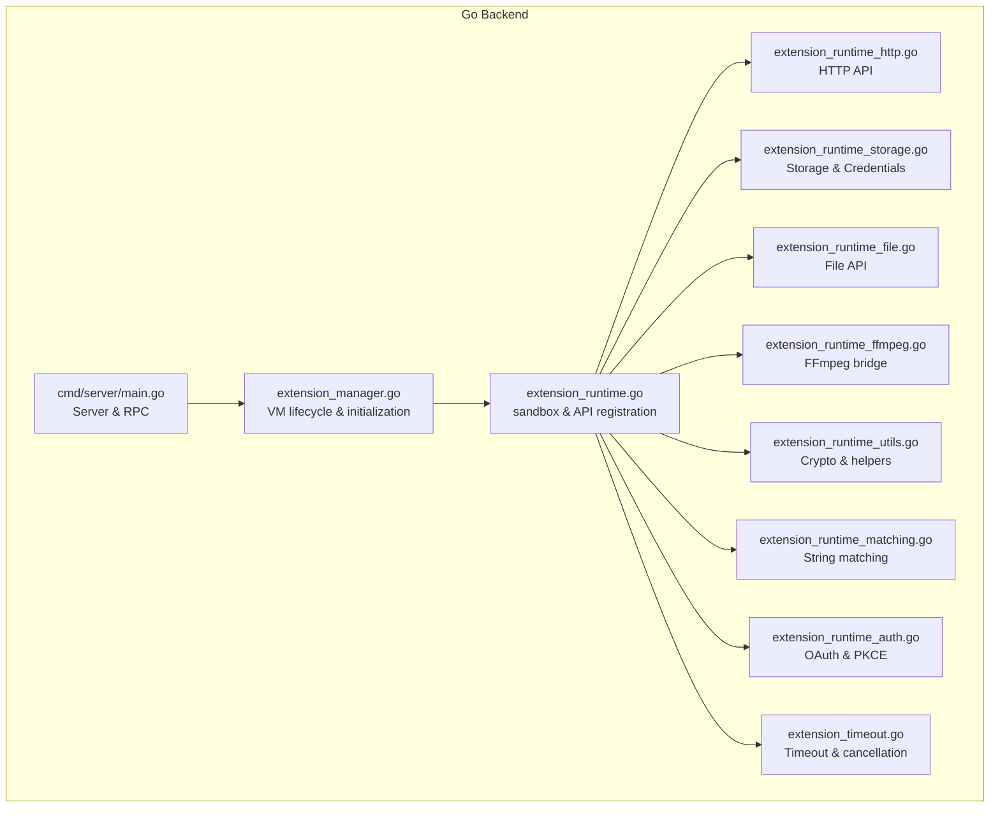

**Diagram sources**
- [extension_manager.go:296-344](file://go_backend_spotiflac/extension_manager.go#L296-L344)
- [extension_runtime.go:424-533](file://go_backend_spotiflac/extension_runtime.go#L424-L533)
- [extension_runtime_http.go:1-491](file://go_backend_spotiflac/extension_runtime_http.go#L1-L491)
- [extension_runtime_storage.go:1-518](file://go_backend_spotiflac/extension_runtime_storage.go#L1-L518)
- [extension_runtime_file.go:1-1003](file://go_backend_spotiflac/extension_runtime_file.go#L1-L1003)
- [extension_runtime_ffmpeg.go:1-183](file://go_backend_spotiflac/extension_runtime_ffmpeg.go#L1-L183)
- [extension_runtime_utils.go:1-531](file://go_backend_spotiflac/extension_runtime_utils.go#L1-L531)
- [extension_runtime_matching.go:1-134](file://go_backend_spotiflac/extension_runtime_matching.go#L1-L134)
- [extension_runtime_auth.go:1-550](file://go_backend_spotiflac/extension_runtime_auth.go#L1-L550)
- [extension_timeout.go:22-118](file://go_backend_spotiflac/extension_timeout.go#L22-L118)
- [main.go:107-134](file://go_backend_spotiflac/cmd/server/main.go#L107-L134)

**Section sources**
- [extension_manager.go:1-1202](file://go_backend_spotiflac/extension_manager.go#L1-L1202)
- [extension_runtime.go:1-534](file://go_backend_spotiflac/extension_runtime.go#L1-L534)
- [extension_timeout.go:1-142](file://go_backend_spotiflac/extension_timeout.go#L1-L142)
- [main.go:1-1456](file://go_backend_spotiflac/cmd/server/main.go#L1-L1456)

## Core Components
- Goja VM lifecycle and isolation: The extension manager creates a dedicated VM per extension, registers sandboxed APIs, and ensures thread-safe access via mutexes.
- Sandbox security model: Network access is restricted to HTTPS-only (with optional HTTP allowance), redirects are validated against allowed domains and disallow private IPs, and file access is confined to the extension’s data directory and configured download directories.
- Built-in API surface: HTTP, storage, credentials, file I/O, FFmpeg integration, cryptography/utils, string matching, OAuth/PKCE, logging, and polyfills.
- Timeout and cancellation: Execution timeouts are enforced with graceful interruption and VM cleanup; HTTP requests honor per-request cancellation tokens.

**Section sources**
- [extension_manager.go:296-344](file://go_backend_spotiflac/extension_manager.go#L296-L344)
- [extension_runtime.go:250-286](file://go_backend_spotiflac/extension_runtime.go#L250-L286)
- [extension_runtime_file.go:75-108](file://go_backend_spotiflac/extension_runtime_file.go#L75-L108)
- [extension_timeout.go:22-118](file://go_backend_spotiflac/extension_timeout.go#L22-L118)

## Architecture Overview
The runtime initializes a Goja VM per extension, injects a curated set of APIs, and executes extension-provided JavaScript. The server exposes RPC endpoints to manage extensions and orchestrate downloads and metadata operations.

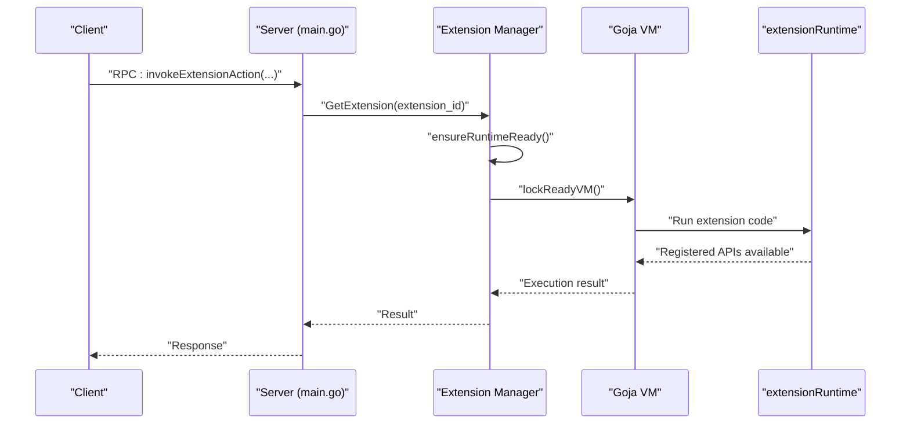

**Diagram sources**
- [main.go:749-750](file://go_backend_spotiflac/cmd/server/main.go#L749-L750)
- [extension_manager.go:104-118](file://go_backend_spotiflac/extension_manager.go#L104-L118)
- [extension_manager.go:296-344](file://go_backend_spotiflac/extension_manager.go#L296-L344)

## Detailed Component Analysis

### Virtual Machine Setup and Initialization
- VM creation: A fresh Goja VM is created per extension, and the extension’s index.js is executed.
- API registration: The runtime binds http, storage, credentials, file, ffmpeg, matching, utils, and logging modules to the VM.
- Console and registration hooks: A console object is provided, and the extension must call registerExtension to expose its API surface.
- Settings initialization: Stored settings are injected into the extension via a scripted initialization call.

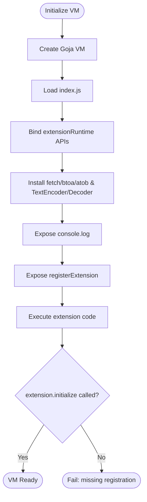

**Diagram sources**
- [extension_manager.go:296-344](file://go_backend_spotiflac/extension_manager.go#L296-L344)
- [extension_runtime.go:424-533](file://go_backend_spotiflac/extension_runtime.go#L424-L533)

**Section sources**
- [extension_manager.go:296-344](file://go_backend_spotiflac/extension_manager.go#L296-L344)
- [extension_manager.go:422-468](file://go_backend_spotiflac/extension_manager.go#L422-L468)

### Security Model and Sandboxing
- Network restrictions:
  - HTTPS-only by default; HTTP allowed only if explicitly permitted by the extension manifest.
  - Redirects are blocked if scheme is not https (unless HTTP is allowed) and if the destination domain is not in the allowed list or resolves to private/local IP ranges.
- File access restrictions:
  - Paths are validated to prevent escaping the extension’s data directory.
  - Only configured download directories are allowed for absolute paths.
- Cookie jar isolation: Each runtime maintains its own cookie jar to isolate session state.
- Private IP cache: DNS lookups for private IP detection are cached with TTL and eviction.

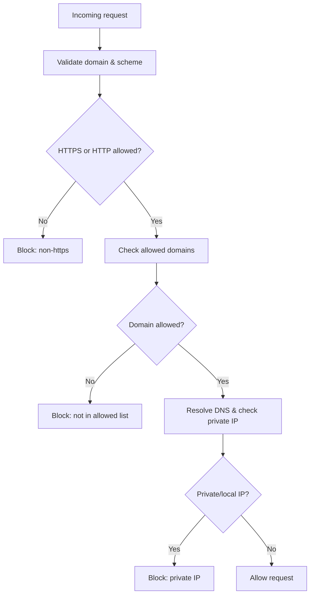

**Diagram sources**
- [extension_runtime.go:250-286](file://go_backend_spotiflac/extension_runtime.go#L250-L286)
- [extension_runtime.go:300-394](file://go_backend_spotiflac/extension_runtime.go#L300-L394)

**Section sources**
- [extension_runtime.go:250-286](file://go_backend_spotiflac/extension_runtime.go#L250-L286)
- [extension_runtime.go:300-394](file://go_backend_spotiflac/extension_runtime.go#L300-L394)
- [extension_runtime_file.go:75-108](file://go_backend_spotiflac/extension_runtime_file.go#L75-L108)

### HTTP API
- Methods: get, post, put, delete, patch, request, clearCookies.
- Validation: URL scheme, hostname presence, embedded credentials, private IP checks, and allowed domain list.
- Limits: Response body capped to prevent excessive memory usage.
- Headers: Default User-Agent applied if not provided; Content-Type defaults to application/json for POST/PUT/PATCH bodies.

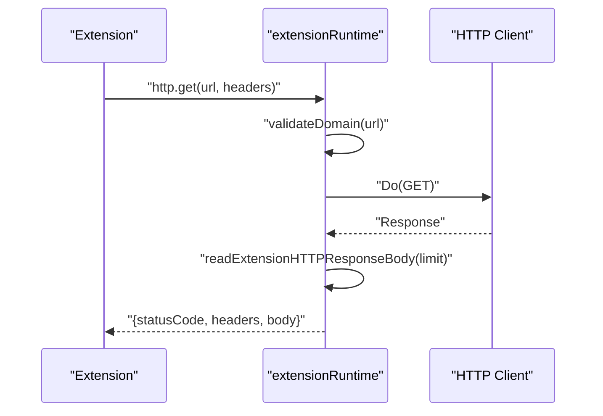

**Diagram sources**
- [extension_runtime_http.go:71-145](file://go_backend_spotiflac/extension_runtime_http.go#L71-L145)
- [extension_runtime_http.go:38-69](file://go_backend_spotiflac/extension_runtime_http.go#L38-L69)
- [extension_runtime_http.go:22-36](file://go_backend_spotiflac/extension_runtime_http.go#L22-L36)

**Section sources**
- [extension_runtime_http.go:1-491](file://go_backend_spotiflac/extension_runtime_http.go#L1-L491)

### Storage and Credentials
- Storage:
  - Persistent key-value store backed by a JSON file in the extension’s data directory.
  - Async flush with debouncing and retry on failure.
  - Thread-safe reads/writes guarded by mutexes.
- Credentials:
  - AES-GCM encrypted store keyed by extension ID and salt.
  - Separate encryption per extension for isolation.
  - Atomic updates and persistence.

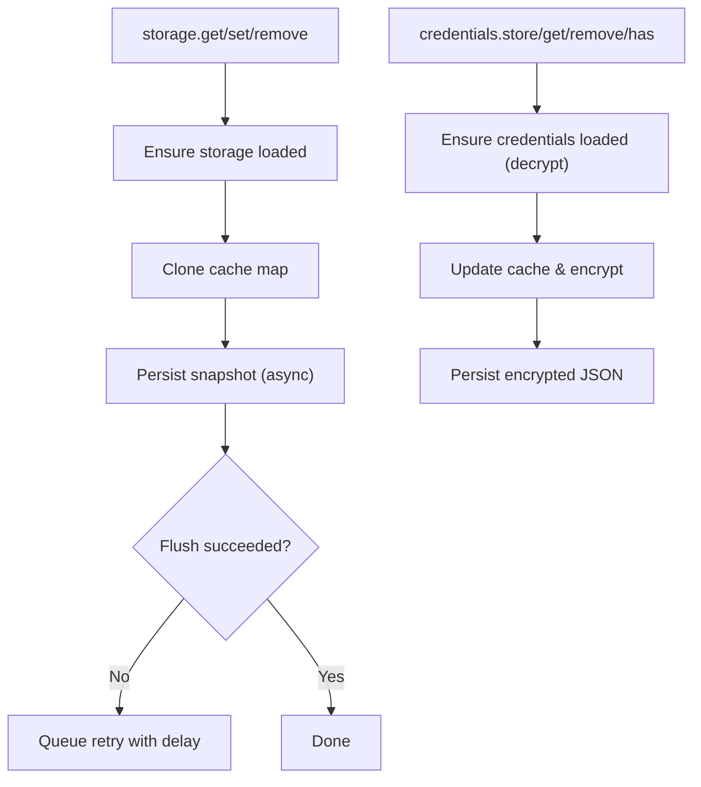

**Diagram sources**
- [extension_runtime_storage.go:39-158](file://go_backend_spotiflac/extension_runtime_storage.go#L39-L158)
- [extension_runtime_storage.go:296-367](file://go_backend_spotiflac/extension_runtime_storage.go#L296-L367)

**Section sources**
- [extension_runtime_storage.go:1-518](file://go_backend_spotiflac/extension_runtime_storage.go#L1-L518)

### File API
- Capabilities: download, exists, delete, read, readBytes, write, writeBytes, copy, move, getSize.
- Validation: Enforces file permissions, cleans and validates paths, prevents escaping the sandbox, and restricts absolute paths to allowed download directories.
- Download: Supports chunked downloads for servers requiring ranged requests; progress tracking and cancellation support.

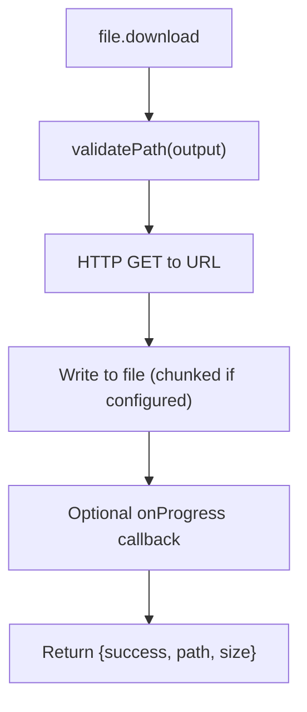

**Diagram sources**
- [extension_runtime_file.go:110-311](file://go_backend_spotiflac/extension_runtime_file.go#L110-L311)
- [extension_runtime_file.go:313-536](file://go_backend_spotiflac/extension_runtime_file.go#L313-L536)

**Section sources**
- [extension_runtime_file.go:1-1003](file://go_backend_spotiflac/extension_runtime_file.go#L1-L1003)

### FFmpeg Integration
- Command execution: Queues commands and waits for completion with a timeout.
- Information: Reads audio quality metadata from files.
- Conversion: Builds FFmpeg command arguments from options and executes.

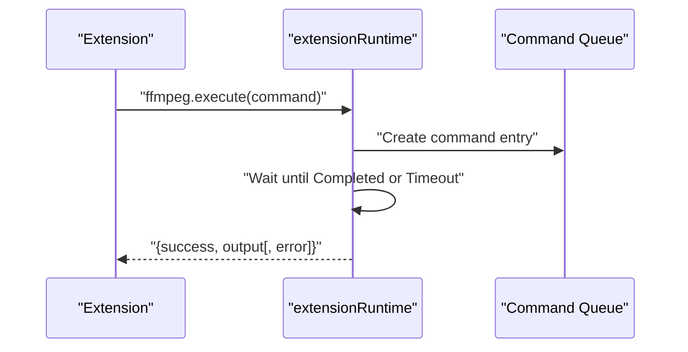

**Diagram sources**
- [extension_runtime_ffmpeg.go:53-108](file://go_backend_spotiflac/extension_runtime_ffmpeg.go#L53-L108)
- [extension_runtime_ffmpeg.go:110-135](file://go_backend_spotiflac/extension_runtime_ffmpeg.go#L110-L135)
- [extension_runtime_ffmpeg.go:137-182](file://go_backend_spotiflac/extension_runtime_ffmpeg.go#L137-L182)

**Section sources**
- [extension_runtime_ffmpeg.go:1-183](file://go_backend_spotiflac/extension_runtime_ffmpeg.go#L1-L183)

### Matching Utilities
- String comparison: Case-insensitive comparison with similarity calculation.
- Duration comparison: Compares durations within a configurable tolerance.
- Normalization: Removes suffixes and normalizes whitespace for robust matching.

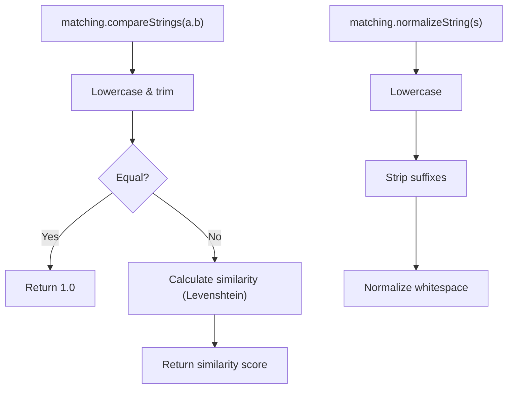

**Diagram sources**
- [extension_runtime_matching.go:9-23](file://go_backend_spotiflac/extension_runtime_matching.go#L9-L23)
- [extension_runtime_matching.go:107-133](file://go_backend_spotiflac/extension_runtime_matching.go#L107-L133)

**Section sources**
- [extension_runtime_matching.go:1-134](file://go_backend_spotiflac/extension_runtime_matching.go#L1-L134)

### Authentication and OAuth
- Open auth URL: Validates HTTPS and allowed domains; stores pending auth request.
- Token retrieval: Stores auth code or tokens and manages expiration.
- PKCE: Generates verifier/challenge pairs and supports OAuth with PKCE.
- Exchange: Performs token exchange with PKCE verification and secure form submission.

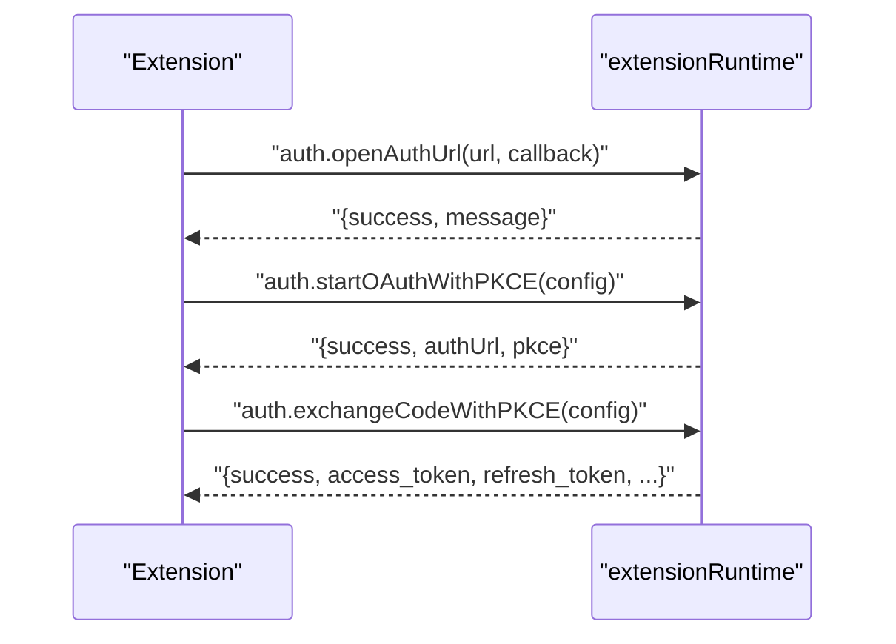

**Diagram sources**
- [extension_runtime_auth.go:55-100](file://go_backend_spotiflac/extension_runtime_auth.go#L55-L100)
- [extension_runtime_auth.go:284-386](file://go_backend_spotiflac/extension_runtime_auth.go#L284-L386)
- [extension_runtime_auth.go:388-549](file://go_backend_spotiflac/extension_runtime_auth.go#L388-L549)

**Section sources**
- [extension_runtime_auth.go:1-550](file://go_backend_spotiflac/extension_runtime_auth.go#L1-L550)

### Utilities and Logging
- Cryptography: Base64 encode/decode, MD5, SHA-256, HMAC-SHA1/256, AES-GCM encrypt/decrypt, key generation.
- JSON: Safe parse/stringify with error logging.
- OS helpers: Random user agent, app version, sleep with cancellation, download status control, filename sanitization.
- Logging: Unified log formatter for extension messages.

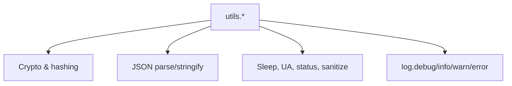

**Diagram sources**
- [extension_runtime_utils.go:19-380](file://go_backend_spotiflac/extension_runtime_utils.go#L19-L380)
- [extension_runtime_utils.go:342-372](file://go_backend_spotiflac/extension_runtime_utils.go#L342-L372)

**Section sources**
- [extension_runtime_utils.go:1-531](file://go_backend_spotiflac/extension_runtime_utils.go#L1-L531)

## Dependency Analysis
- VM-to-API binding: The runtime constructs JS objects and assigns methods to expose capabilities.
- HTTP client reuse: A shared transport is used across clients to maintain compatibility modes.
- Cancellation propagation: Active download/request IDs are bound to HTTP requests to support cancellation.
- Polyfills: fetch, btoa/atob, and TextEncoder/Decoder are provided for compatibility.

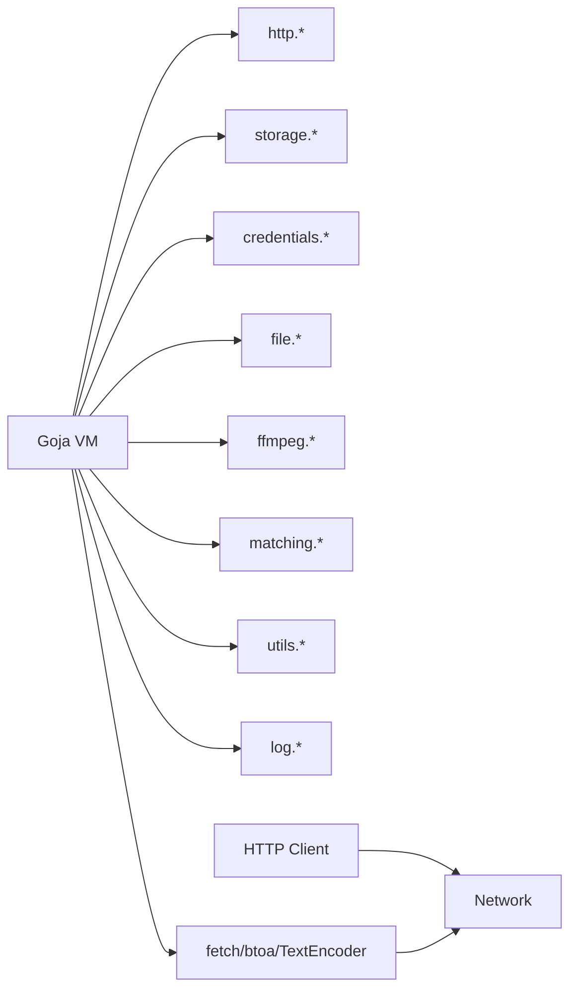

**Diagram sources**
- [extension_runtime.go:424-533](file://go_backend_spotiflac/extension_runtime.go#L424-L533)
- [extension_runtime_http.go:1-491](file://go_backend_spotiflac/extension_runtime_http.go#L1-L491)
- [extension_runtime_file.go:1-1003](file://go_backend_spotiflac/extension_runtime_file.go#L1-L1003)

**Section sources**
- [extension_runtime.go:424-533](file://go_backend_spotiflac/extension_runtime.go#L424-L533)

## Performance Considerations
- Memory limits:
  - HTTP response body is capped to prevent excessive memory usage.
  - Async storage flush uses debouncing to batch writes and reduce I/O overhead.
- Concurrency:
  - VM access is serialized via per-extension mutexes to avoid race conditions.
  - HTTP client shares a transport to reuse connections efficiently.
- I/O:
  - File downloads support chunked transfers for servers requiring ranged requests.
  - Buffered reads/writes minimize syscall overhead.
- CPU:
  - Matching uses optimized Levenshtein distance computation.
  - Hashing and HMAC operations leverage Go’s standard crypto libraries.

[No sources needed since this section provides general guidance]

## Troubleshooting Guide
- Execution timeouts:
  - Use RunWithTimeout to enforce a deadline; the VM is interrupted and cleaned up.
  - If the goroutine does not exit promptly, a warning is logged advising against reusing the VM.
- Panic handling:
  - Panics during execution are captured and surfaced as errors with stack traces.
- Network errors:
  - Redirects blocked due to non-https, disallowed domains, or private IPs are logged with specific error messages.
- File access errors:
  - Path validation failures indicate sandbox violations or invalid paths.
- FFmpeg errors:
  - Command timeouts or failures return structured results with error details.

**Section sources**
- [extension_timeout.go:22-118](file://go_backend_spotiflac/extension_timeout.go#L22-L118)
- [extension_runtime.go:288-298](file://go_backend_spotiflac/extension_runtime.go#L288-L298)
- [extension_runtime_file.go:75-108](file://go_backend_spotiflac/extension_runtime_file.go#L75-L108)
- [extension_runtime_ffmpeg.go:53-108](file://go_backend_spotiflac/extension_runtime_ffmpeg.go#L53-L108)

## Conclusion
The Bitly JavaScript runtime integrates Goja securely and efficiently, exposing a carefully curated API surface while enforcing strict sandbox boundaries. Execution timeouts, cancellation, and resource limits protect the host system, while polyfills and convenience utilities ease extension development. Proper configuration of permissions, domains, and timeouts ensures reliable operation across diverse extension workloads.