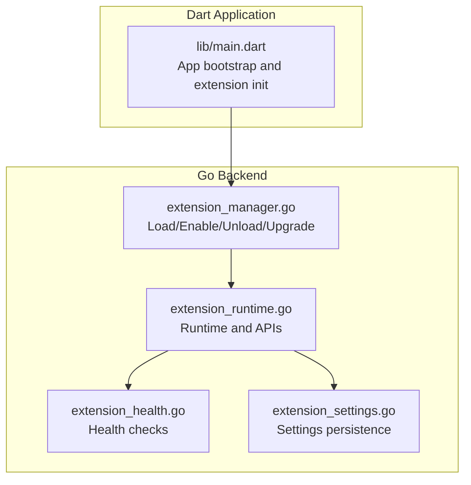
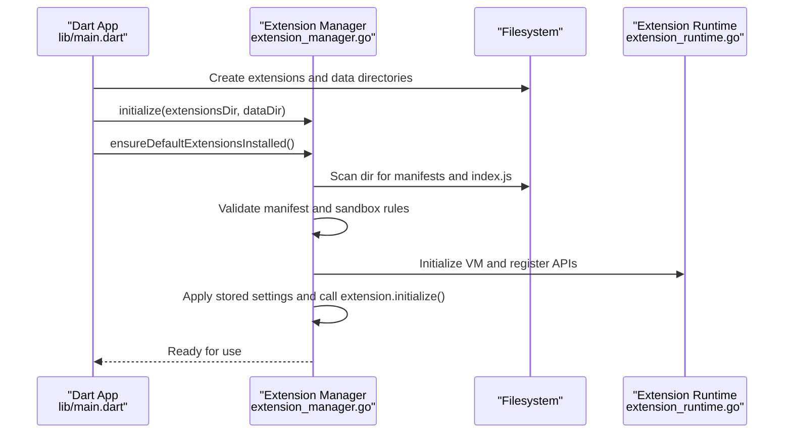
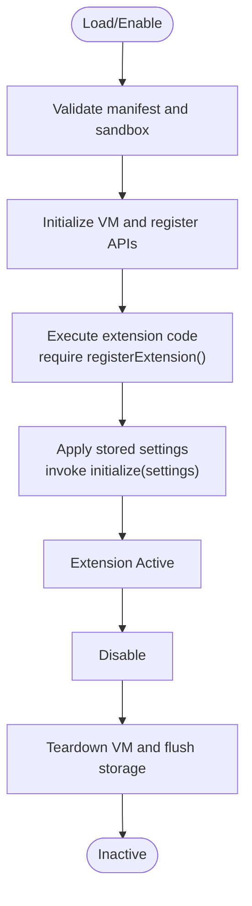
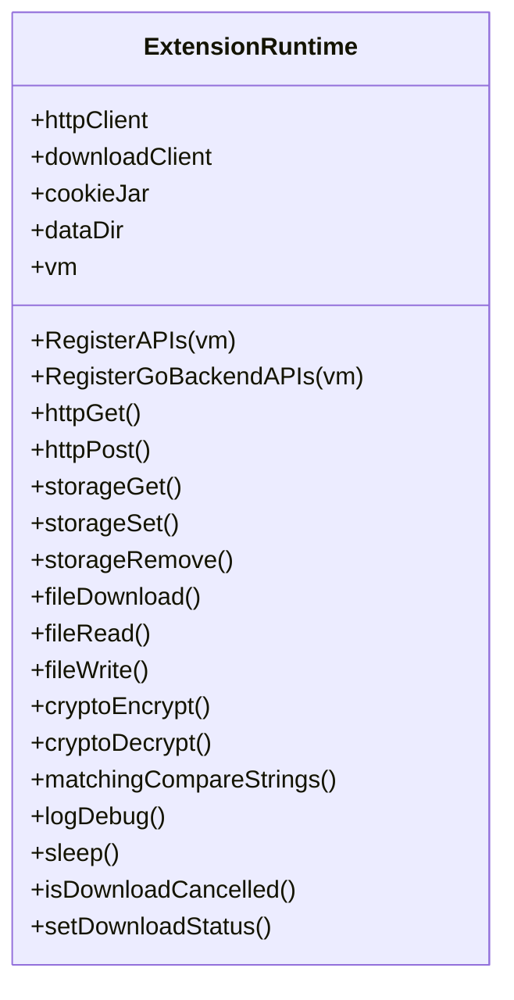
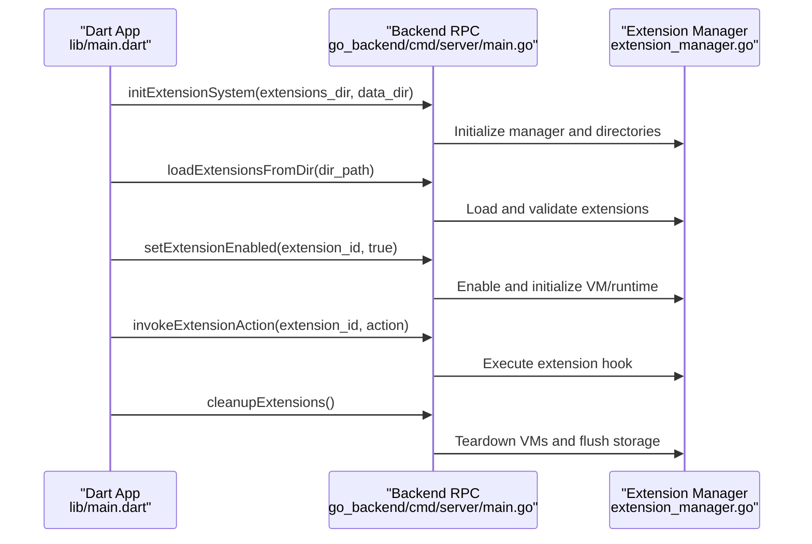
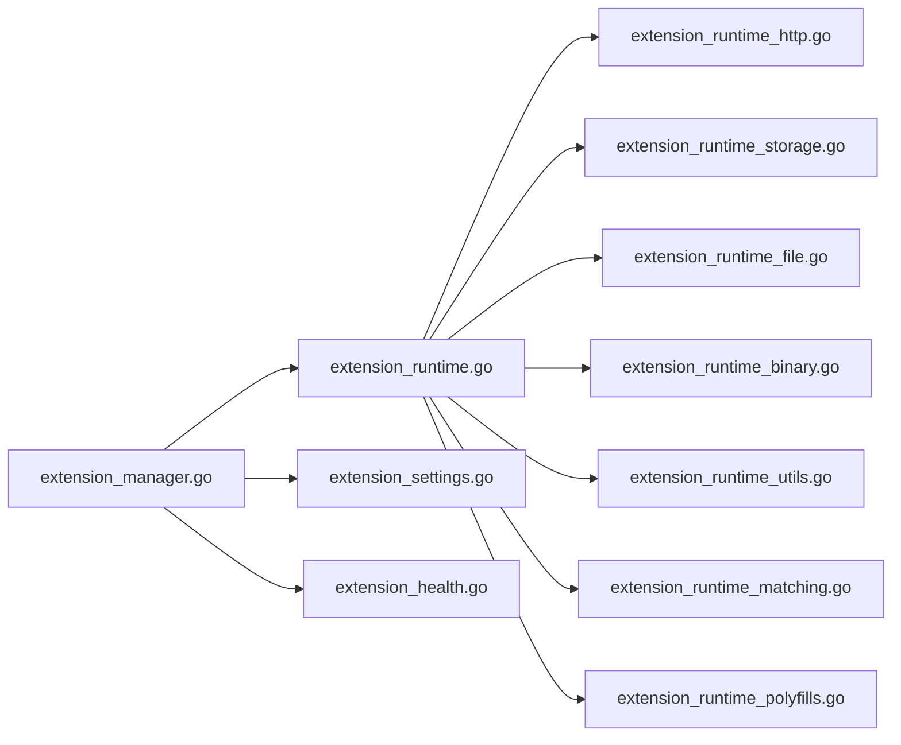

# Lifecycle Hooks

<cite>
**Referenced Files in This Document**
- [extension_manager.go](file://go_backend_spotiflac/extension_manager.go)
- [extension_runtime.go](file://go_backend_spotiflac/extension_runtime.go)
- [extension_manifest.go](file://go_backend_spotiflac/extension_manifest.go)
- [extension_runtime_auth.go](file://go_backend_spotiflac/extension_runtime_auth.go)
- [extension_runtime_storage.go](file://go_backend_spotiflac/extension_runtime_storage.go)
- [extension_runtime_http.go](file://go_backend_spotiflac/extension_runtime_http.go)
- [extension_runtime_file.go](file://go_backend_spotiflac/extension_runtime_file.go)
- [extension_runtime_binary.go](file://go_backend_spotiflac/extension_runtime_binary.go)
- [extension_runtime_utils.go](file://go_backend_spotiflac/extension_runtime_utils.go)
- [extension_runtime_matching.go](file://go_backend_spotiflac/extension_runtime_matching.go)
- [extension_runtime_polyfills.go](file://go_backend_spotiflac/extension_runtime_polyfills.go)
- [extension_settings.go](file://go_backend_spotiflac/extension_settings.go)
- [extension_health.go](file://go_backend_spotiflac/extension_health.go)
- [main.dart](file://lib/main.dart)
- [main.go](file://go_backend_spotiflac/cmd/server/main.go)
</cite>

## Table of Contents
1. [Introduction](#introduction)
2. [Project Structure](#project-structure)
3. [Core Components](#core-components)
4. [Architecture Overview](#architecture-overview)
5. [Detailed Component Analysis](#detailed-component-analysis)
6. [Dependency Analysis](#dependency-analysis)
7. [Performance Considerations](#performance-considerations)
8. [Troubleshooting Guide](#troubleshooting-guide)
9. [Conclusion](#conclusion)
10. [Appendices](#appendices)

## Introduction
This document explains the extension lifecycle management and hook systems used to load, initialize, activate, and clean up JavaScript-based extensions within the Go backend. It covers startup sequencing, dependency resolution, error handling during lifecycle transitions, and the runtime APIs exposed to extensions. It also documents how extensions coordinate with the main application, including background tasks, resource allocation, and graceful shutdowns.

## Project Structure
The extension system spans two primary areas:
- Dart application bootstrap and extension initialization orchestration
- Go backend responsible for extension packaging, loading, runtime registration, and lifecycle management

**Diagram sources**
- [main.dart:247-280](file://lib/main.dart#L247-L280)
- [extension_manager.go:120-139](file://go_backend_spotiflac/extension_manager.go#L120-L139)
- [extension_runtime.go:84-147](file://go_backend_spotiflac/extension_runtime.go#L84-L147)
- [extension_health.go:41-99](file://go_backend_spotiflac/extension_health.go#L41-L99)
- [extension_settings.go:22-41](file://go_backend_spotiflac/extension_settings.go#L22-L41)

**Section sources**
- [main.dart:22-44](file://lib/main.dart#L22-L44)
- [main.dart:247-280](file://lib/main.dart#L247-L280)
- [extension_manager.go:120-139](file://go_backend_spotiflac/extension_manager.go#L120-L139)

## Core Components
- Extension Manager: Loads, validates, enables/disables, upgrades, and unloads extensions; manages VM lifecycle and initialization.
- Extension Runtime: Exposes APIs to extensions (HTTP, storage, credentials, file IO, crypto, matching, logging, polyfills) and handles cancellation, timeouts, and sandboxing.
- Manifest: Defines extension capabilities, permissions, settings, and health checks.
- Settings Store: Persists extension settings and enabled state.
- Health Checker: Evaluates extension service health based on manifest-defined checks.
- Application Bootstrap: Initializes directories and triggers extension system setup.

**Section sources**
- [extension_manager.go:47-59](file://go_backend_spotiflac/extension_manager.go#L47-L59)
- [extension_runtime.go:84-147](file://go_backend_spotiflac/extension_runtime.go#L84-L147)
- [extension_manifest.go:116-138](file://go_backend_spotiflac/extension_manifest.go#L116-L138)
- [extension_settings.go:11-29](file://go_backend_spotiflac/extension_settings.go#L11-L29)
- [extension_health.go:41-99](file://go_backend_spotiflac/extension_health.go#L41-L99)
- [main.dart:247-280](file://lib/main.dart#L247-L280)

## Architecture Overview
The lifecycle follows a deterministic sequence: directories are prepared, extensions are discovered and validated, VMs are initialized, settings are applied, and extensions become active. Deactivation tears down VMs and flushes storage.

**Diagram sources**
- [main.dart:247-280](file://lib/main.dart#L247-L280)
- [extension_manager.go:642-678](file://go_backend_spotiflac/extension_manager.go#L642-L678)
- [extension_manager.go:158-294](file://go_backend_spotiflac/extension_manager.go#L158-L294)
- [extension_runtime.go:424-533](file://go_backend_spotiflac/extension_runtime.go#L424-L533)

## Detailed Component Analysis

### Extension Manager: Loading, Initialization, Activation, Cleanup
- Loading:
  - From filesystem archives (.spotiflac-ext) and local directories.
  - Validates presence of manifest.json and index.js; enforces version comparisons and safe extraction.
- Initialization:
  - Creates a dedicated Goja VM per extension.
  - Registers runtime APIs and polyfills.
  - Executes extension code and ensures it calls registerExtension().
  - Applies stored settings by invoking extension.initialize(settings).
- Activation:
  - Enabling sets Enabled=true and ensures runtime readiness.
  - Disabling tears down VM and clears state.
- Cleanup:
  - Calls extension.cleanup() if present.
  - Flushes storage and closes background timers.

**Diagram sources**
- [extension_manager.go:158-294](file://go_backend_spotiflac/extension_manager.go#L158-L294)
- [extension_manager.go:416-487](file://go_backend_spotiflac/extension_manager.go#L416-L487)
- [extension_manager.go:489-554](file://go_backend_spotiflac/extension_manager.go#L489-L554)

**Section sources**
- [extension_manager.go:158-294](file://go_backend_spotiflac/extension_manager.go#L158-L294)
- [extension_manager.go:416-487](file://go_backend_spotiflac/extension_manager.go#L416-L487)
- [extension_manager.go:489-554](file://go_backend_spotiflac/extension_manager.go#L489-L554)

### Extension Runtime: APIs, Sandboxing, and Cancellation
- HTTP: Validates domains, enforces HTTPS-only unless explicitly allowed, blocks private IPs, and limits response sizes.
- Storage: Provides get/set/remove with asynchronous flushing and encryption for credentials.
- File IO: Sandboxed to extension data directory; supports chunked downloads and cancellation binding.
- Crypto and Matching: Utilities for hashing, HMAC, AES/Blowfish, and string similarity.
- Logging and Polyfills: Console logging, fetch polyfill, TextEncoder/Decoder, URL/URLSearchParams, and JSON polyfill.
- Cancellation: Integrates with active download/request IDs to honor cancellations.

**Diagram sources**
- [extension_runtime.go:84-147](file://go_backend_spotiflac/extension_runtime.go#L84-L147)
- [extension_runtime_http.go:71-145](file://go_backend_spotiflac/extension_runtime_http.go#L71-L145)
- [extension_runtime_storage.go:171-255](file://go_backend_spotiflac/extension_runtime_storage.go#L171-L255)
- [extension_runtime_file.go:110-311](file://go_backend_spotiflac/extension_runtime_file.go#L110-L311)
- [extension_runtime_binary.go:266-361](file://go_backend_spotiflac/extension_runtime_binary.go#L266-L361)
- [extension_runtime_matching.go:9-54](file://go_backend_spotiflac/extension_runtime_matching.go#L9-L54)
- [extension_runtime_utils.go:19-380](file://go_backend_spotiflac/extension_runtime_utils.go#L19-L380)
- [extension_runtime_polyfills.go:15-150](file://go_backend_spotiflac/extension_runtime_polyfills.go#L15-L150)

**Section sources**
- [extension_runtime_http.go:38-69](file://go_backend_spotiflac/extension_runtime_http.go#L38-L69)
- [extension_runtime_storage.go:39-75](file://go_backend_spotiflac/extension_runtime_storage.go#L39-L75)
- [extension_runtime_file.go:75-108](file://go_backend_spotiflac/extension_runtime_file.go#L75-L108)
- [extension_runtime_utils.go:260-340](file://go_backend_spotiflac/extension_runtime_utils.go#L260-L340)
- [extension_runtime_polyfills.go:15-150](file://go_backend_spotiflac/extension_runtime_polyfills.go#L15-L150)

### Manifest and Capabilities
- Defines extension types (metadata, download, lyrics), permissions (network, storage, file), settings schema, quality options, and post-processing hooks.
- Supports optional custom search behavior, URL handlers, and provider fallback controls.
- Validates manifest fields and permissions.

**Section sources**
- [extension_manifest.go:116-138](file://go_backend_spotiflac/extension_manifest.go#L116-L138)
- [extension_manifest.go:162-242](file://go_backend_spotiflac/extension_manifest.go#L162-L242)

### Settings Persistence
- Stores extension settings per extension ID in JSON files under the data directory.
- Persists enabled state and exposes batch operations for retrieval and updates.

**Section sources**
- [extension_settings.go:11-29](file://go_backend_spotiflac/extension_settings.go#L11-L29)
- [extension_settings.go:137-157](file://go_backend_spotiflac/extension_settings.go#L137-L157)

### Health Checks
- Evaluates extension service health based on manifest-defined checks (GET/HEAD over HTTPS, allowed domains, optional service key parsing).
- Aggregates statuses (online/degraded/offline/unknown) and records latency and messages.

**Section sources**
- [extension_health.go:41-99](file://go_backend_spotiflac/extension_health.go#L41-L99)
- [extension_health.go:101-205](file://go_backend_spotiflac/extension_health.go#L101-L205)

### Application Integration and Startup Sequence
- Dart app initializes directories and calls into the extension provider to initialize the backend extension system.
- Backend server exposes RPC methods to manage extensions, including loading, enabling, invoking actions, and cleanup.

**Diagram sources**
- [main.dart:247-280](file://lib/main.dart#L247-L280)
- [main.go:721-754](file://go_backend_spotiflac/cmd/server/main.go#L721-L754)
- [extension_manager.go:642-678](file://go_backend_spotiflac/extension_manager.go#L642-L678)
- [extension_manager.go:608-640](file://go_backend_spotiflac/extension_manager.go#L608-L640)

**Section sources**
- [main.dart:247-280](file://lib/main.dart#L247-L280)
- [main.go:721-754](file://go_backend_spotiflac/cmd/server/main.go#L721-L754)

## Dependency Analysis
- Extension Manager depends on:
  - Filesystem for discovery and extraction
  - Goja VM for JavaScript execution
  - Extension Runtime for API registration and sandboxing
  - Settings Store for persisted state
  - Health checker for service monitoring
- Extension Runtime depends on:
  - HTTP client with redirect policies and domain allowlists
  - Storage subsystem for settings and credentials
  - File IO subsystem for sandboxed operations
  - Crypto primitives for secure storage and utilities

**Diagram sources**
- [extension_manager.go:120-139](file://go_backend_spotiflac/extension_manager.go#L120-L139)
- [extension_runtime.go:424-533](file://go_backend_spotiflac/extension_runtime.go#L424-L533)
- [extension_runtime_http.go:38-69](file://go_backend_spotiflac/extension_runtime_http.go#L38-L69)
- [extension_runtime_storage.go:39-75](file://go_backend_spotiflac/extension_runtime_storage.go#L39-L75)
- [extension_runtime_file.go:75-108](file://go_backend_spotiflac/extension_runtime_file.go#L75-L108)
- [extension_runtime_binary.go:266-361](file://go_backend_spotiflac/extension_runtime_binary.go#L266-L361)
- [extension_runtime_utils.go:260-340](file://go_backend_spotiflac/extension_runtime_utils.go#L260-L340)
- [extension_runtime_matching.go:9-54](file://go_backend_spotiflac/extension_runtime_matching.go#L9-L54)
- [extension_runtime_polyfills.go:15-150](file://go_backend_spotiflac/extension_runtime_polyfills.go#L15-L150)
- [extension_settings.go:11-29](file://go_backend_spotiflac/extension_settings.go#L11-L29)
- [extension_health.go:41-99](file://go_backend_spotiflac/extension_health.go#L41-L99)

**Section sources**
- [extension_manager.go:120-139](file://go_backend_spotiflac/extension_manager.go#L120-L139)
- [extension_runtime.go:424-533](file://go_backend_spotiflac/extension_runtime.go#L424-L533)

## Performance Considerations
- Asynchronous storage flushing: Uses delayed timers to batch writes and reduce disk I/O.
- HTTP response size limits: Prevents excessive memory usage by capping response bodies.
- Chunked downloads: Enables large media downloads with configurable chunk sizes and retry logic.
- Cancellation propagation: Integrates with active download/request IDs to avoid wasted work.
- Private IP caching: Reduces DNS overhead for repeated checks.

[No sources needed since this section provides general guidance]

## Troubleshooting Guide
Common issues and resolutions:
- Extension did not call registerExtension(): Indicates missing registration in index.js; the manager rejects such packages.
- Network access denied: HTTPS-only enforcement or domain not in allowlist; verify manifest permissions and URLs.
- File access denied: Sandbox restrictions; ensure paths are relative to extension data directory.
- Initialization failure: extension.initialize(settings) threw; inspect logs and settings JSON.
- Health check offline: Verify HTTPS endpoints, allowed domains, and service availability.

**Section sources**
- [extension_manager.go:325-344](file://go_backend_spotiflac/extension_manager.go#L325-L344)
- [extension_runtime_http.go:38-69](file://go_backend_spotiflac/extension_runtime_http.go#L38-L69)
- [extension_runtime_file.go:75-108](file://go_backend_spotiflac/extension_runtime_file.go#L75-L108)
- [extension_health.go:101-205](file://go_backend_spotiflac/extension_health.go#L101-L205)

## Conclusion
The extension lifecycle system provides a robust, sandboxed environment for JavaScript extensions with clear loading, initialization, activation, and cleanup phases. The runtime exposes a comprehensive API surface while enforcing security and performance constraints. Health checks and settings persistence support operational reliability, and the application bootstrap integrates seamlessly with the backend RPC for lifecycle control.

[No sources needed since this section summarizes without analyzing specific files]

## Appendices

### Hook System and Background Tasks
- Hooks are invoked through extension actions exposed by the backend RPC and executed within the extension’s VM.
- Background tasks (downloads, HTTP requests) are cancellable and tracked via active item/request IDs.
- Graceful shutdown occurs during teardown, ensuring storage flushes and VM cleanup.

**Section sources**
- [extension_manager.go:489-554](file://go_backend_spotiflac/extension_manager.go#L489-L554)
- [extension_runtime_utils.go:260-340](file://go_backend_spotiflac/extension_runtime_utils.go#L260-L340)
- [extension_runtime_file.go:110-311](file://go_backend_spotiflac/extension_runtime_file.go#L110-L311)

### Implementing Lifecycle-Aware Extensions
- Implement initialize(settings) to process stored settings and prepare resources.
- Implement cleanup() to release resources and persist state.
- Use storage APIs for settings and credentials; use file APIs for sandboxed IO.
- Use HTTP APIs with HTTPS and allowed domains; leverage chunked downloads for large payloads.
- Use sleep() and cancellation helpers to implement cooperative background tasks.

**Section sources**
- [extension_runtime_storage.go:171-255](file://go_backend_spotiflac/extension_runtime_storage.go#L171-L255)
- [extension_runtime_file.go:110-311](file://go_backend_spotiflac/extension_runtime_file.go#L110-L311)
- [extension_runtime_http.go:71-145](file://go_backend_spotiflac/extension_runtime_http.go#L71-L145)
- [extension_runtime_utils.go:260-340](file://go_backend_spotiflac/extension_runtime_utils.go#L260-L340)