# Provider System

<cite>
**Referenced Files in This Document**
- [extension_providers.go](file://go_backend_spotiflac/extension_providers.go)
- [extension_manager.go](file://go_backend_spotiflac/extension_manager.go)
- [extension_runtime.go](file://go_backend_spotiflac/extension_runtime.go)
- [extension_manifest.go](file://go_backend_spotiflac/extension_manifest.go)
- [exports.go](file://go_backend_spotiflac/exports.go)
- [metadata.go](file://go_backend_spotiflac/metadata.go)
- [download_validation.go](file://go_backend_spotiflac/download_validation.go)
</cite>

## Table of Contents
1. [Introduction](#introduction)
2. [Project Structure](#project-structure)
3. [Core Components](#core-components)
4. [Architecture Overview](#architecture-overview)
5. [Detailed Component Analysis](#detailed-component-analysis)
6. [Dependency Analysis](#dependency-analysis)
7. [Performance Considerations](#performance-considerations)
8. [Troubleshooting Guide](#troubleshooting-guide)
9. [Conclusion](#conclusion)

## Introduction
This document describes the extension provider system that powers search, metadata enrichment, URL handling, lyrics fetching, and downloads across multiple music services. It explains how providers are registered, discovered, prioritized, and executed, along with their lifecycle, error handling, and performance characteristics. The system is built around a JavaScript VM sandbox that isolates third-party extensions while exposing a controlled API surface for network, storage, authentication, file operations, and utilities.

## Project Structure
The provider system spans several Go packages:
- Extension lifecycle and discovery: extension manager, runtime, and manifest parsing
- Provider contracts and execution: wrapper APIs for search, metadata, availability checks, downloads, URL handling, matching, and post-processing
- Application integration: request/response models and orchestration functions
- Supporting utilities: metadata embedding, download validation, and cross-cutting concerns

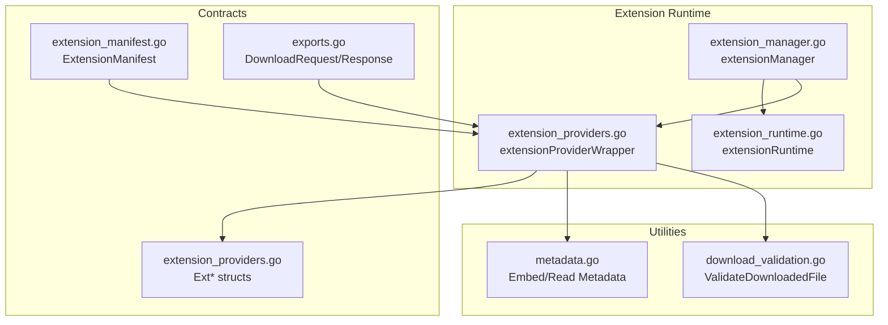

**Diagram sources**
- [extension_manager.go:120-125](file://go_backend_spotiflac/extension_manager.go#L120-L125)
- [extension_runtime.go:84-112](file://go_backend_spotiflac/extension_runtime.go#L84-L112)
- [extension_providers.go:523-526](file://go_backend_spotiflac/extension_providers.go#L523-L526)
- [extension_manifest.go:116-138](file://go_backend_spotiflac/extension_manifest.go#L116-L138)
- [exports.go:158-237](file://go_backend_spotiflac/exports.go#L158-L237)
- [metadata.go:104-129](file://go_backend_spotiflac/metadata.go#L104-L129)
- [download_validation.go:17-21](file://go_backend_spotiflac/download_validation.go#L17-L21)

**Section sources**
- [extension_manager.go:120-125](file://go_backend_spotiflac/extension_manager.go#L120-L125)
- [extension_runtime.go:84-112](file://go_backend_spotiflac/extension_runtime.go#L84-L112)
- [extension_providers.go:523-526](file://go_backend_spotiflac/extension_providers.go#L523-L526)
- [extension_manifest.go:116-138](file://go_backend_spotiflac/extension_manifest.go#L116-L138)
- [exports.go:158-237](file://go_backend_spotiflac/exports.go#L158-L237)
- [metadata.go:104-129](file://go_backend_spotiflac/metadata.go#L104-L129)
- [download_validation.go:17-21](file://go_backend_spotiflac/download_validation.go#L17-L21)

## Core Components
- Extension Manager: Loads, validates, initializes, and manages the lifecycle of extensions. Provides discovery of providers by type and capability.
- Extension Runtime: Creates and configures a sandboxed JavaScript runtime with restricted APIs, timeouts, and cancellation support.
- Extension Provider Wrapper: Exposes typed provider methods (search, metadata, availability, download, URL handling, matching, post-processing, lyrics) with robust error handling and performance telemetry.
- Manifest: Defines provider capabilities, permissions, settings, and behaviors (e.g., custom search, URL handlers, post-processing hooks).
- Contracts: Structs for search results, availability, download results, URL handling, lyrics, and request/response models.

Key responsibilities:
- Registration: Extensions register via a dedicated function exposed to the JS runtime.
- Discovery: Providers are discovered by type (metadata, download, lyrics) and capability (custom search, URL handler, post-processing).
- Priority: Provider ordering is configurable for both metadata and download flows.
- Fallback: The system supports graceful fallback across providers with explicit stop conditions.

**Section sources**
- [extension_manager.go:120-125](file://go_backend_spotiflac/extension_manager.go#L120-L125)
- [extension_runtime.go:424-533](file://go_backend_spotiflac/extension_runtime.go#L424-L533)
- [extension_providers.go:523-526](file://go_backend_spotiflac/extension_providers.go#L523-L526)
- [extension_manifest.go:116-138](file://go_backend_spotiflac/extension_manifest.go#L116-L138)
- [exports.go:158-237](file://go_backend_spotiflac/exports.go#L158-L237)

## Architecture Overview
The provider system orchestrates requests across multiple providers with deterministic priority and fallback behavior. The main application defines request/response contracts, while extensions implement provider capabilities through a JavaScript API exposed inside a sandboxed runtime.

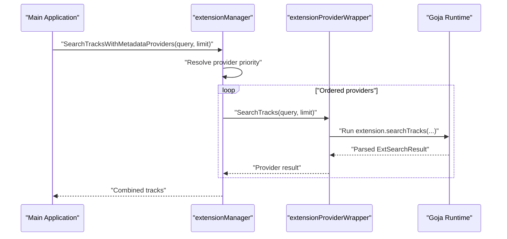

**Diagram sources**
- [extension_providers.go:1682-1723](file://go_backend_spotiflac/extension_providers.go#L1682-L1723)
- [extension_providers.go:1044-1115](file://go_backend_spotiflac/extension_providers.go#L1044-L1115)

**Section sources**
- [extension_providers.go:1682-1723](file://go_backend_spotiflac/extension_providers.go#L1682-L1723)
- [extension_providers.go:1044-1115](file://go_backend_spotiflac/extension_providers.go#L1044-L1115)

## Detailed Component Analysis

### Extension Lifecycle and Registration
- Loading: Extensions are loaded from ZIP archives or directories, validated against a manifest, and stored in memory with enabled/disabled state and error tracking.
- Initialization: A Goja VM is created, APIs are registered, and the extension’s registerExtension callback is invoked. Settings can be injected during initialization.
- Teardown: On unload or disable, cleanup hooks are executed and storage is flushed.

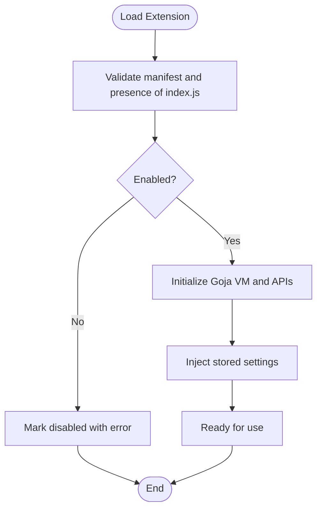

**Diagram sources**
- [extension_manager.go:158-294](file://go_backend_spotiflac/extension_manager.go#L158-L294)
- [extension_manager.go:296-344](file://go_backend_spotiflac/extension_manager.go#L296-L344)
- [extension_manager.go:416-487](file://go_backend_spotiflac/extension_manager.go#L416-L487)

**Section sources**
- [extension_manager.go:158-294](file://go_backend_spotiflac/extension_manager.go#L158-L294)
- [extension_manager.go:296-344](file://go_backend_spotiflac/extension_manager.go#L296-L344)
- [extension_manager.go:416-487](file://go_backend_spotiflac/extension_manager.go#L416-L487)

### Provider Discovery and Priority
- Discovery: Providers are discovered by type (metadata, download, lyrics, URL handler, post-processing) and capability (custom search, URL handler, post-processing hooks).
- Priority: Provider ordering is configurable for both metadata and download flows. Built-in retired providers are excluded from priority lists.
- Fallback: The download orchestration supports strict mode, source extension preflight, and fallback across providers with explicit stop conditions.

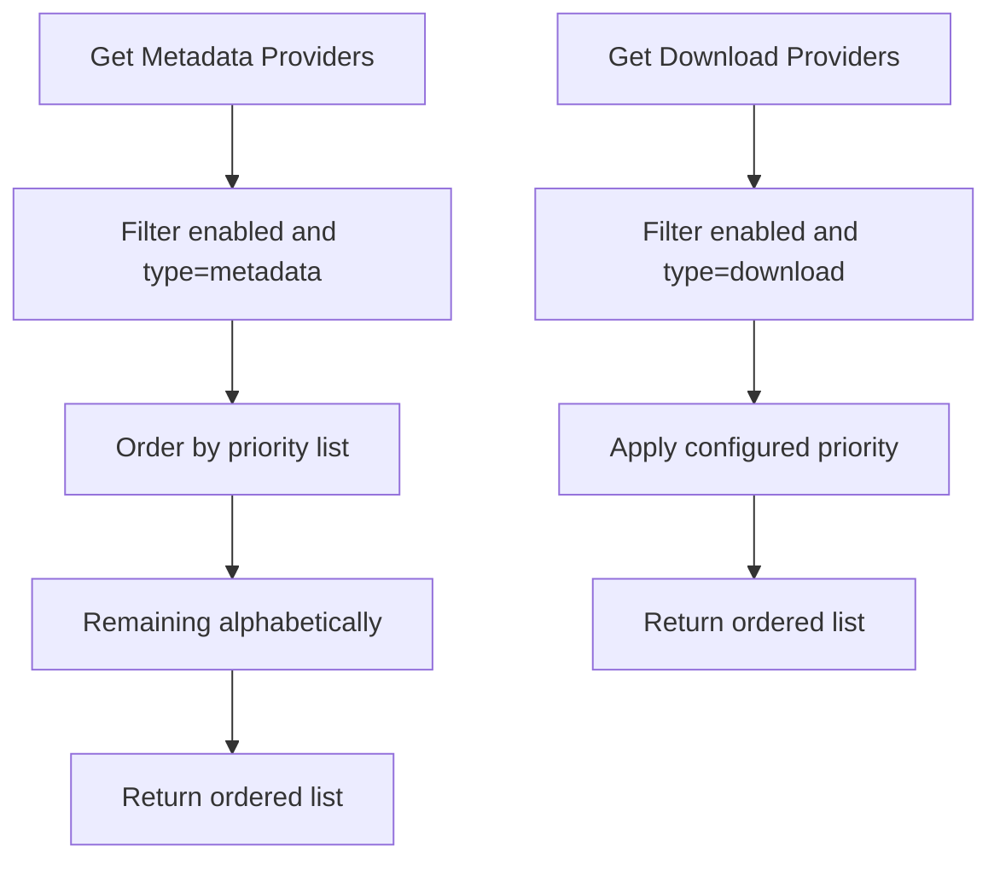

**Diagram sources**
- [extension_providers.go:1656-1680](file://go_backend_spotiflac/extension_providers.go#L1656-L1680)
- [extension_providers.go:1669-1680](file://go_backend_spotiflac/extension_providers.go#L1669-L1680)
- [extension_providers.go:1725-1790](file://go_backend_spotiflac/extension_providers.go#L1725-L1790)
- [extension_providers.go:1860-1892](file://go_backend_spotiflac/extension_providers.go#L1860-L1892)

**Section sources**
- [extension_providers.go:1656-1680](file://go_backend_spotiflac/extension_providers.go#L1656-L1680)
- [extension_providers.go:1669-1680](file://go_backend_spotiflac/extension_providers.go#L1669-L1680)
- [extension_providers.go:1725-1790](file://go_backend_spotiflac/extension_providers.go#L1725-L1790)
- [extension_providers.go:1860-1892](file://go_backend_spotiflac/extension_providers.go#L1860-L1892)

### Search, Metadata, and Availability Contracts
- Search: Providers implement searchTracks and optionally customSearch. Results are normalized into a unified track model with provider attribution.
- Metadata: Providers implement getTrack/getAlbum/getPlaylist/getArtist and enrichTrack. Results are normalized and attributed to the provider.
- Availability: Providers implement checkAvailability to determine if a track is available and optionally provide a preferred track ID and reasons to stop fallback.

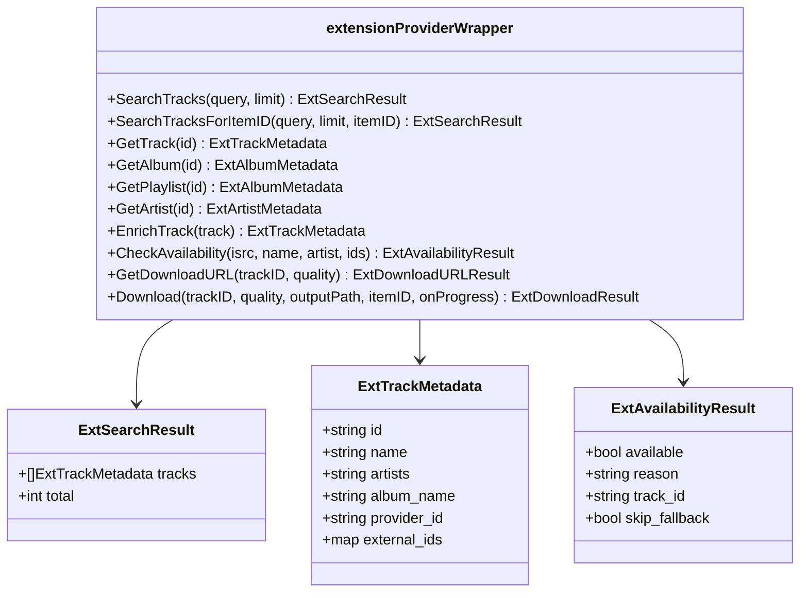

**Diagram sources**
- [extension_providers.go:1044-1115](file://go_backend_spotiflac/extension_providers.go#L1044-L1115)
- [extension_providers.go:1117-1164](file://go_backend_spotiflac/extension_providers.go#L1117-L1164)
- [extension_providers.go:1166-1220](file://go_backend_spotiflac/extension_providers.go#L1166-L1220)
- [extension_providers.go:1222-1279](file://go_backend_spotiflac/extension_providers.go#L1222-L1279)
- [extension_providers.go:1281-1338](file://go_backend_spotiflac/extension_providers.go#L1281-L1338)
- [extension_providers.go:1340-1419](file://go_backend_spotiflac/extension_providers.go#L1340-L1419)
- [extension_providers.go:1421-1494](file://go_backend_spotiflac/extension_providers.go#L1421-L1494)
- [extension_providers.go:1496-1542](file://go_backend_spotiflac/extension_providers.go#L1496-L1542)
- [extension_providers.go:1546-1654](file://go_backend_spotiflac/extension_providers.go#L1546-L1654)

**Section sources**
- [extension_providers.go:1044-1115](file://go_backend_spotiflac/extension_providers.go#L1044-L1115)
- [extension_providers.go:1117-1164](file://go_backend_spotiflac/extension_providers.go#L1117-L1164)
- [extension_providers.go:1166-1220](file://go_backend_spotiflac/extension_providers.go#L1166-L1220)
- [extension_providers.go:1222-1279](file://go_backend_spotiflac/extension_providers.go#L1222-L1279)
- [extension_providers.go:1281-1338](file://go_backend_spotiflac/extension_providers.go#L1281-L1338)
- [extension_providers.go:1340-1419](file://go_backend_spotiflac/extension_providers.go#L1340-L1419)
- [extension_providers.go:1421-1494](file://go_backend_spotiflac/extension_providers.go#L1421-L1494)
- [extension_providers.go:1496-1542](file://go_backend_spotiflac/extension_providers.go#L1496-L1542)
- [extension_providers.go:1546-1654](file://go_backend_spotiflac/extension_providers.go#L1546-L1654)

### Download Orchestration and Fallback
The download flow integrates provider availability checks, preferred track ID resolution, and fallback across providers. It supports strict mode, source extension preflight, and explicit stop conditions.

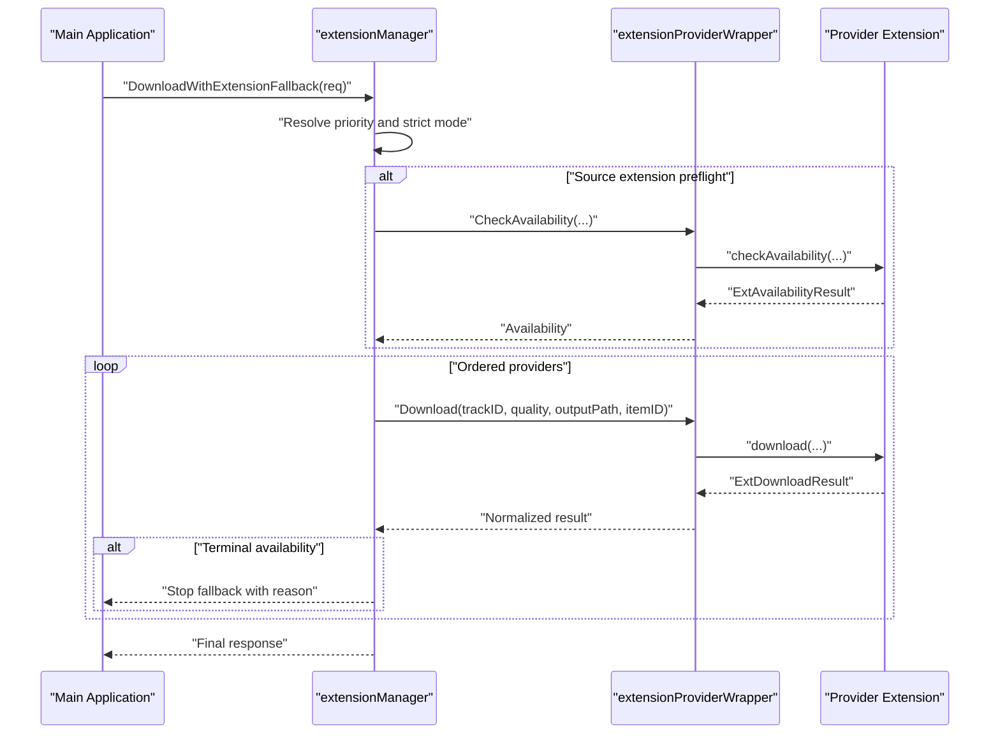

**Diagram sources**
- [extension_providers.go:1993-2548](file://go_backend_spotiflac/extension_providers.go#L1993-L2548)
- [extension_providers.go:1421-1494](file://go_backend_spotiflac/extension_providers.go#L1421-L1494)
- [extension_providers.go:1546-1654](file://go_backend_spotiflac/extension_providers.go#L1546-L1654)

**Section sources**
- [extension_providers.go:1993-2548](file://go_backend_spotiflac/extension_providers.go#L1993-L2548)
- [extension_providers.go:1421-1494](file://go_backend_spotiflac/extension_providers.go#L1421-L1494)
- [extension_providers.go:1546-1654](file://go_backend_spotiflac/extension_providers.go#L1546-L1654)

### URL Handling and Matching
- URL Handling: Providers can declare URL patterns and implement handleUrl to parse and return structured content (track, album, artist).
- Matching: Providers can implement matchTrack to select the best candidate among a list of options based on confidence and reason.

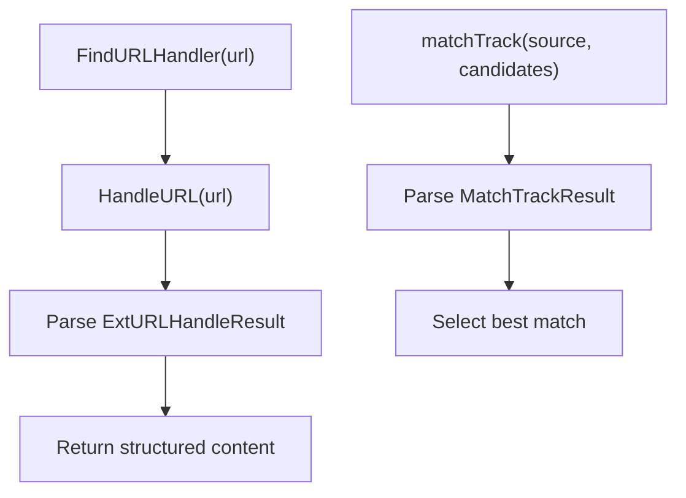

**Diagram sources**
- [extension_providers.go:3111-3146](file://go_backend_spotiflac/extension_providers.go#L3111-L3146)
- [extension_providers.go:2793-2884](file://go_backend_spotiflac/extension_providers.go#L2793-L2884)
- [extension_providers.go:2893-2942](file://go_backend_spotiflac/extension_providers.go#L2893-L2942)

**Section sources**
- [extension_providers.go:3111-3146](file://go_backend_spotiflac/extension_providers.go#L3111-L3146)
- [extension_providers.go:2793-2884](file://go_backend_spotiflac/extension_providers.go#L2793-L2884)
- [extension_providers.go:2893-2942](file://go_backend_spotiflac/extension_providers.go#L2893-L2942)

### Post-Processing Hooks
Providers can expose post-processing hooks to transform downloaded files. The system iterates through enabled hooks and applies transformations sequentially.

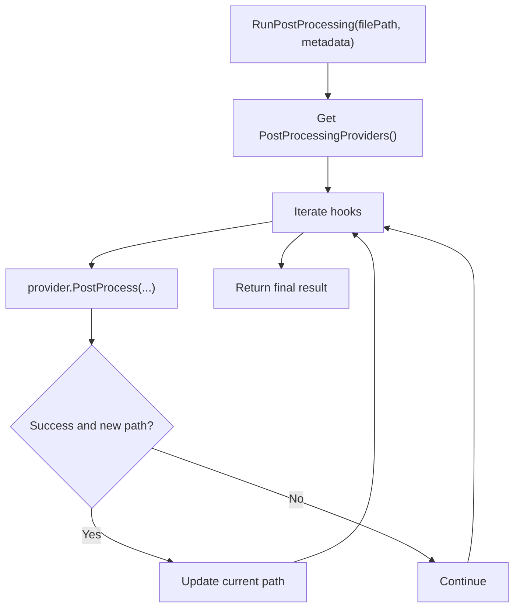

**Diagram sources**
- [extension_providers.go:3148-3204](file://go_backend_spotiflac/extension_providers.go#L3148-L3204)
- [extension_providers.go:3206-3258](file://go_backend_spotiflac/extension_providers.go#L3206-L3258)

**Section sources**
- [extension_providers.go:3148-3204](file://go_backend_spotiflac/extension_providers.go#L3148-L3204)
- [extension_providers.go:3206-3258](file://go_backend_spotiflac/extension_providers.go#L3206-L3258)

### Manifest and Capabilities
The manifest defines provider types, permissions, settings, and behaviors. It controls network timeouts, domain allowlists, custom search, URL handlers, post-processing hooks, and health checks.

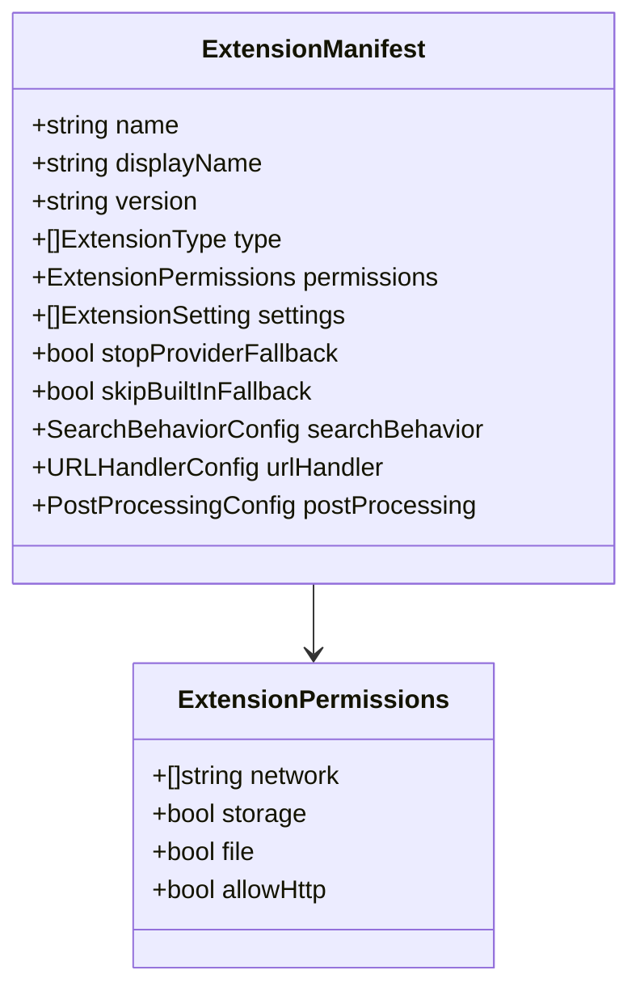

**Diagram sources**
- [extension_manifest.go:116-138](file://go_backend_spotiflac/extension_manifest.go#L116-L138)
- [extension_manifest.go:27-32](file://go_backend_spotiflac/extension_manifest.go#L27-L32)

**Section sources**
- [extension_manifest.go:116-138](file://go_backend_spotiflac/extension_manifest.go#L116-L138)
- [extension_manifest.go:27-32](file://go_backend_spotiflac/extension_manifest.go#L27-L32)

### Data Models and Contracts
Unified data models represent search results, metadata, availability, download results, URL handling, and lyrics. These models are parsed from extension responses and normalized into application-wide structures.

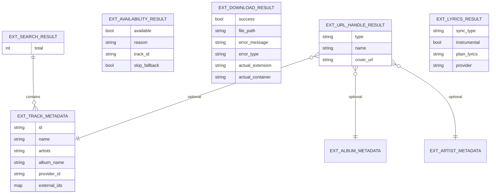

**Diagram sources**
- [extension_providers.go:19-51](file://go_backend_spotiflac/extension_providers.go#L19-L51)
- [extension_providers.go:85-88](file://go_backend_spotiflac/extension_providers.go#L85-L88)
- [extension_providers.go:90-95](file://go_backend_spotiflac/extension_providers.go#L90-L95)
- [extension_providers.go:417-448](file://go_backend_spotiflac/extension_providers.go#L417-L448)
- [extension_providers.go:2783-2791](file://go_backend_spotiflac/extension_providers.go#L2783-L2791)
- [extension_providers.go:3260-3272](file://go_backend_spotiflac/extension_providers.go#L3260-L3272)

**Section sources**
- [extension_providers.go:19-51](file://go_backend_spotiflac/extension_providers.go#L19-L51)
- [extension_providers.go:85-88](file://go_backend_spotiflac/extension_providers.go#L85-L88)
- [extension_providers.go:90-95](file://go_backend_spotiflac/extension_providers.go#L90-L95)
- [extension_providers.go:417-448](file://go_backend_spotiflac/extension_providers.go#L417-L448)
- [extension_providers.go:2783-2791](file://go_backend_spotiflac/extension_providers.go#L2783-L2791)
- [extension_providers.go:3260-3272](file://go_backend_spotiflac/extension_providers.go#L3260-L3272)

## Dependency Analysis
- Extension Manager depends on the runtime to create and manage VM instances and on manifests to validate capabilities.
- Provider Wrapper depends on the runtime for cancellations, timeouts, and isolated execution contexts.
- Application integration relies on request/response models and orchestration functions to coordinate provider calls.

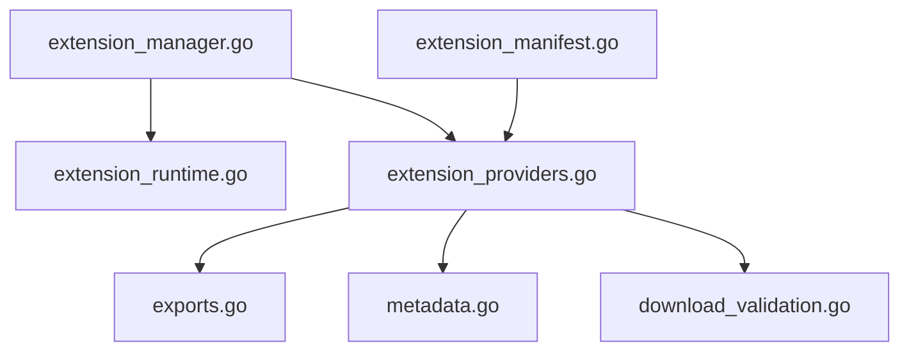

**Diagram sources**
- [extension_manager.go:120-125](file://go_backend_spotiflac/extension_manager.go#L120-L125)
- [extension_runtime.go:84-112](file://go_backend_spotiflac/extension_runtime.go#L84-L112)
- [extension_providers.go:523-526](file://go_backend_spotiflac/extension_providers.go#L523-L526)
- [exports.go:158-237](file://go_backend_spotiflac/exports.go#L158-L237)
- [metadata.go:104-129](file://go_backend_spotiflac/metadata.go#L104-L129)
- [download_validation.go:17-21](file://go_backend_spotiflac/download_validation.go#L17-L21)
- [extension_manifest.go:116-138](file://go_backend_spotiflac/extension_manifest.go#L116-L138)

**Section sources**
- [extension_manager.go:120-125](file://go_backend_spotiflac/extension_manager.go#L120-L125)
- [extension_runtime.go:84-112](file://go_backend_spotiflac/extension_runtime.go#L84-L112)
- [extension_providers.go:523-526](file://go_backend_spotiflac/extension_providers.go#L523-L526)
- [exports.go:158-237](file://go_backend_spotiflac/exports.go#L158-L237)
- [metadata.go:104-129](file://go_backend_spotiflac/metadata.go#L104-L129)
- [download_validation.go:17-21](file://go_backend_spotiflac/download_validation.go#L17-L21)
- [extension_manifest.go:116-138](file://go_backend_spotiflac/extension_manifest.go#L116-L138)

## Performance Considerations
- Timeout control: Each provider call runs under a default timeout to prevent stalls. Availability and download calls have distinct timeouts.
- Isolation: Downloads run in an isolated runtime to prevent interference and enable proper cleanup.
- Deduplication: Metadata search results are de-duplicated by ISRC, Spotify ID, or provider ID plus track ID.
- Validation: Downloaded files are validated for minimum size and duration thresholds to avoid previews.
- Cancellation: Active download and request IDs are tracked to support cancellation propagation.

**Section sources**
- [extension_runtime.go:16-16](file://go_backend_spotiflac/extension_runtime.go#L16-L16)
- [extension_providers.go:1546-1546](file://go_backend_spotiflac/extension_providers.go#L1546-L1546)
- [extension_providers.go:1907-1905](file://go_backend_spotiflac/extension_providers.go#L1907-L1905)
- [download_validation.go:23-54](file://go_backend_spotiflac/download_validation.go#L23-L54)

## Troubleshooting Guide
Common issues and strategies:
- Extension not enabled or failed to load: Check the extension’s enabled flag and error field. Re-enable or reload the extension.
- Provider not a metadata/download/lyrics provider: Verify the manifest type and capabilities.
- Availability checks failing: Inspect availability results and reasons; some providers may request to stop fallback.
- Download failures: Review error messages and types; check if the provider supports the requested quality or track ID.
- URL handling: Ensure the provider declares URL patterns and implements handleUrl.
- Post-processing: Confirm hooks are enabled and supported for the file format.

Operational tips:
- Use strict mode to lock a single provider for testing.
- Enable source extension preflight to short-circuit unnecessary downloads.
- Monitor logs for provider-specific errors and timeouts.

**Section sources**
- [extension_manager.go:608-640](file://go_backend_spotiflac/extension_manager.go#L608-L640)
- [extension_providers.go:1421-1494](file://go_backend_spotiflac/extension_providers.go#L1421-L1494)
- [extension_providers.go:1546-1654](file://go_backend_spotiflac/extension_providers.go#L1546-L1654)
- [extension_providers.go:2793-2884](file://go_backend_spotiflac/extension_providers.go#L2793-L2884)
- [extension_providers.go:3148-3204](file://go_backend_spotiflac/extension_providers.go#L3148-L3204)

## Conclusion
The extension provider system offers a robust, extensible framework for integrating third-party music services. Through a sandboxed runtime, well-defined contracts, and flexible discovery and priority mechanisms, it enables powerful search, metadata enrichment, URL handling, lyrics, and downloads with strong fallback and error handling. By leveraging manifests, timeouts, isolation, and validation, the system balances flexibility with reliability and performance.