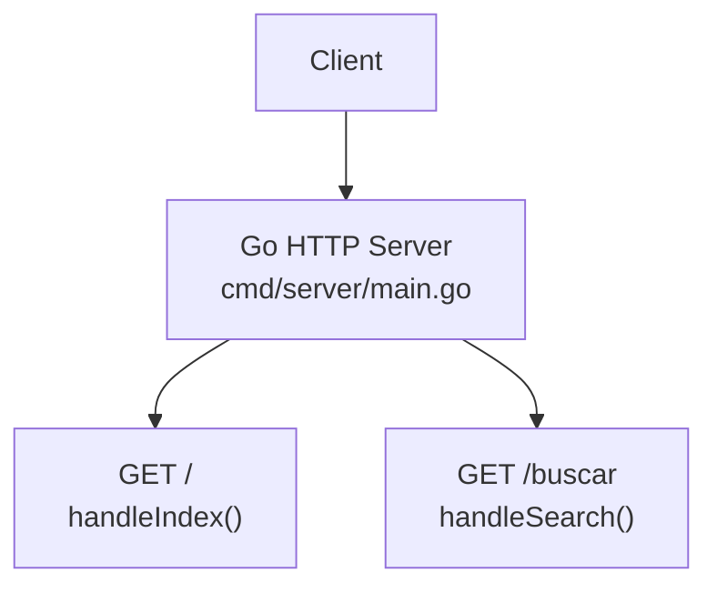
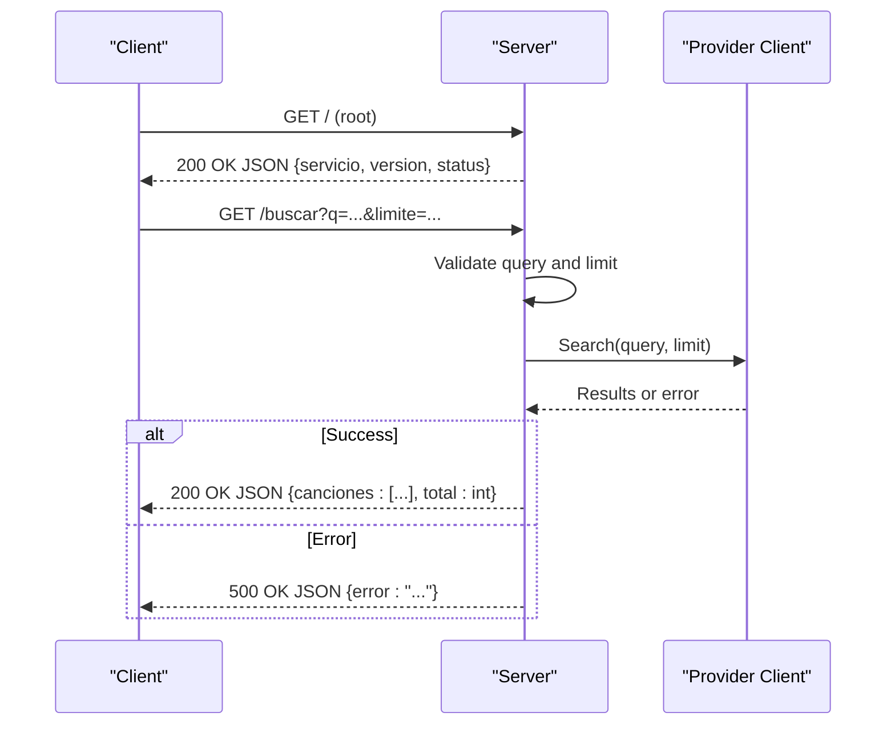
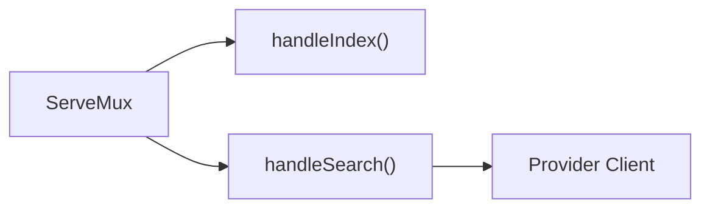

# Basic Endpoints

<cite>
**Referenced Files in This Document**
- [main.go](file://go_backend_spotiflac/cmd/server/main.go)
- [ratelimit.go](file://go_backend_spotiflac/ratelimit.go)
</cite>

## Table of Contents
1. [Introduction](#introduction)
2. [Project Structure](#project-structure)
3. [Core Components](#core-components)
4. [Architecture Overview](#architecture-overview)
5. [Detailed Component Analysis](#detailed-component-analysis)
6. [Dependency Analysis](#dependency-analysis)
7. [Performance Considerations](#performance-considerations)
8. [Troubleshooting Guide](#troubleshooting-guide)
9. [Conclusion](#conclusion)

## Introduction
This document describes Bitly’s basic HTTP endpoints exposed by the Go backend server. It focuses on:
- Root endpoint GET / returning service metadata
- Search endpoint GET /buscar?q=query&limite=limit for track searches

It specifies request/response schemas, parameter validation, defaults, error handling, and practical examples. It also covers rate limiting and performance optimization guidance for search queries.

## Project Structure
The HTTP server is implemented in a single Go file that registers handlers for the root and search endpoints. The server listens on localhost with a configurable port.

**Diagram sources**
- [main.go:124-134](file://go_backend_spotiflac/cmd/server/main.go#L124-L134)
- [main.go:288-295](file://go_backend_spotiflac/cmd/server/main.go#L288-L295)
- [main.go:297-347](file://go_backend_spotiflac/cmd/server/main.go#L297-L347)

**Section sources**
- [main.go:107-134](file://go_backend_spotiflac/cmd/server/main.go#L107-L134)

## Core Components
- Root endpoint GET /
  - Returns service metadata: service name, version, and status.
  - Content-Type: application/json
- Search endpoint GET /buscar?q=query&limite=limit
  - Performs a track search against an underlying provider.
  - Validates query presence and applies pagination limits.
  - Returns a list of tracks and total count.

**Section sources**
- [main.go:288-295](file://go_backend_spotiflac/cmd/server/main.go#L288-L295)
- [main.go:297-347](file://go_backend_spotiflac/cmd/server/main.go#L297-L347)

## Architecture Overview
The server exposes two primary routes:
- / returns service information
- /buscar performs a search and returns results

**Diagram sources**
- [main.go:288-295](file://go_backend_spotiflac/cmd/server/main.go#L288-L295)
- [main.go:297-347](file://go_backend_spotiflac/cmd/server/main.go#L297-L347)

## Detailed Component Analysis

### Root Endpoint: GET /
- Purpose: Return service metadata
- Path: /
- Method: GET
- Response schema:
  - servicio: string, service name
  - version: string, semantic version
  - status: string, operational status
- Example response:
  - {
    "servicio": "spotiflac-backend",
    "version": "0.5.0",
    "status": "ok"
    }

Notes:
- Always returns 200 OK
- No query parameters or body required

**Section sources**
- [main.go:288-295](file://go_backend_spotiflac/cmd/server/main.go#L288-L295)

### Search Endpoint: GET /buscar?q=query&limite=limit
- Purpose: Search tracks by query with pagination limit
- Path: /buscar
- Method: GET
- Query parameters:
  - q: string, required. Non-empty after trimming.
  - limite: integer, optional. Defaults to 10 if outside (0..50]; upper bound enforced at 50.
- Validation rules:
  - If q is empty or blank, returns 400 with error message.
  - Limit clamped to [1..50], default 10.
- Response schema:
  - canciones: array of track objects
    - id: string, unique identifier
    - titulo: string, track title
    - artista: string, artist(s)
    - album: string, album name
    - cover: string, cover image URL
    - duracion: integer, duration in seconds
    - fuente: string, source provider
  - total: integer, number of returned tracks
- Error responses:
  - 400 Bad Request: {"error":"query required"}
  - 500 Internal Server Error: {"error":"search failed: <cause>"}
- Example successful response:
  - {
    "canciones": [
      {
        "id": "spotify-id-1",
        "titulo": "Song Title",
        "artista": "Artist Name",
        "album": "Album Title",
        "cover": "https://cover.url/image.jpg",
        "duracion": 200,
        "fuente": "deezer"
      }
    ],
    "total": 1
  }
- Example error response:
  - {
    "error": "query required"
  }

Implementation highlights:
- Query extraction trims whitespace
- Limit parsing allows values outside [1..50] but normalizes to default or cap
- Search delegates to an internal provider client
- Response maps provider fields to canonical schema

**Section sources**
- [main.go:297-347](file://go_backend_spotiflac/cmd/server/main.go#L297-L347)

## Dependency Analysis
- Routing registration:
  - "/" -> handleIndex
  - "/buscar" -> handleSearch
- Search endpoint depends on an internal provider client for performing the search
- Rate limiting:
  - A generic rate limiter exists in the codebase for other services, but the search endpoint does not apply it directly

**Diagram sources**
- [main.go:124-134](file://go_backend_spotiflac/cmd/server/main.go#L124-L134)
- [main.go:297-347](file://go_backend_spotiflac/cmd/server/main.go#L297-L347)

**Section sources**
- [main.go:124-134](file://go_backend_spotiflac/cmd/server/main.go#L124-L134)

## Performance Considerations
- Pagination limit
  - Enforce reasonable limits on client side to avoid large payloads
  - The server caps limit at 50 and defaults to 10 if invalid
- Network latency
  - Search delegates to an external provider; latency depends on network and provider availability
- Concurrency
  - The server is single-threaded per request; avoid long-running operations in handlers
- Caching
  - Consider caching frequent queries at the application layer if appropriate for your workload
- Rate limiting
  - The codebase includes a generic rate limiter suitable for throttling provider calls or other endpoints
  - Current search handler does not apply rate limiting; consider adding a per-IP limiter if needed

[No sources needed since this section provides general guidance]

## Troubleshooting Guide
Common issues and resolutions:
- Empty query parameter
  - Symptom: 400 error with query required
  - Fix: Provide a non-empty q value
- Provider failure
  - Symptom: 500 error indicating search failed
  - Fix: Retry after checking provider availability or adjust query
- Unexpected large payload
  - Symptom: Many results overwhelming clients
  - Fix: Reduce limite or filter results client-side

Operational checks:
- Confirm server is listening on the expected port (default 55009)
- Validate that the provider client is initialized and reachable

**Section sources**
- [main.go:297-347](file://go_backend_spotiflac/cmd/server/main.go#L297-L347)
- [main.go:107-134](file://go_backend_spotiflac/cmd/server/main.go#L107-L134)

## Conclusion
The basic endpoints provide essential service metadata and a paginated search interface. The search endpoint validates inputs, normalizes limits, and returns a structured response. For production use, consider applying rate limiting and optimizing client-side pagination to improve responsiveness and reduce load.