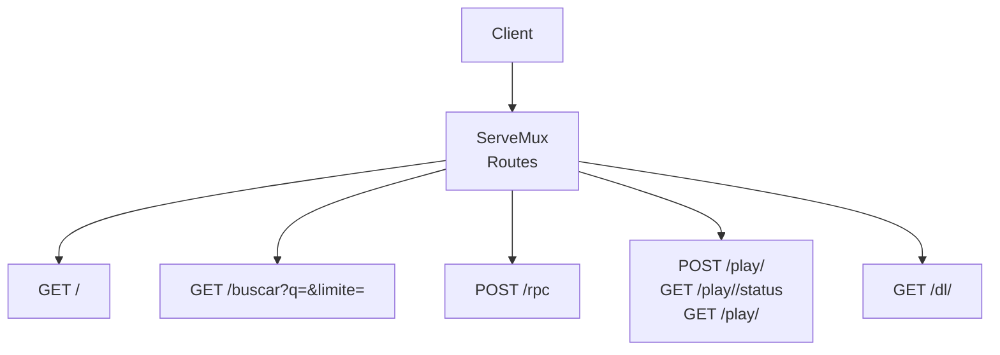
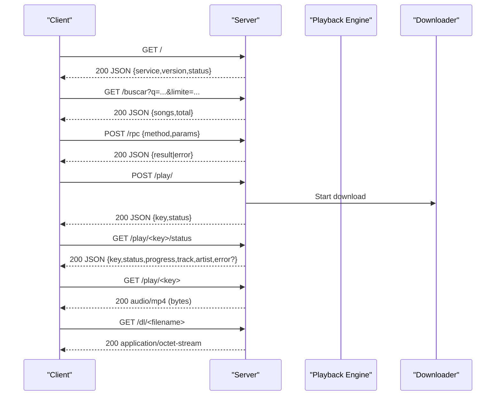
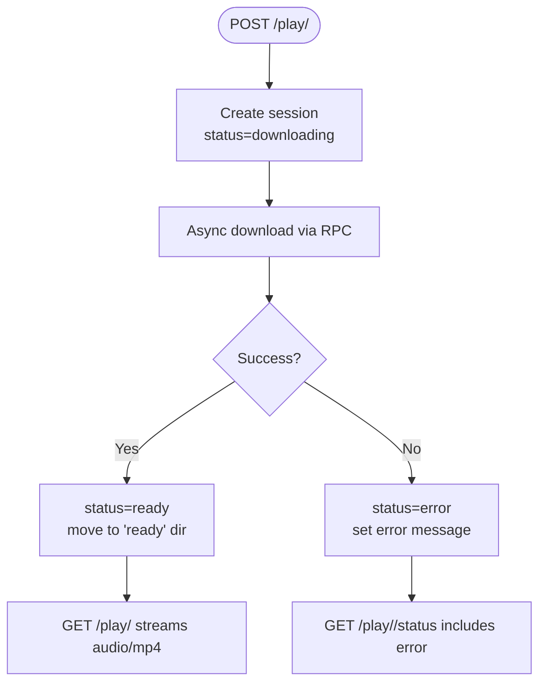
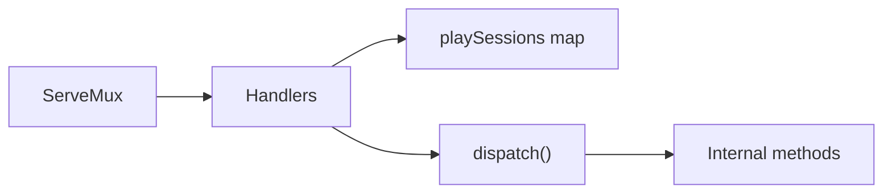
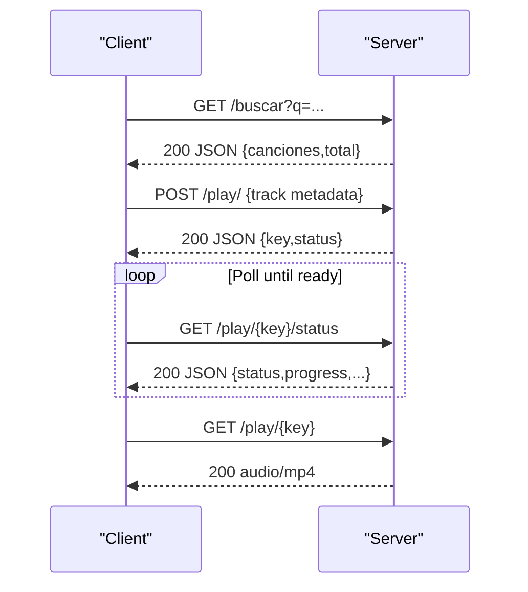
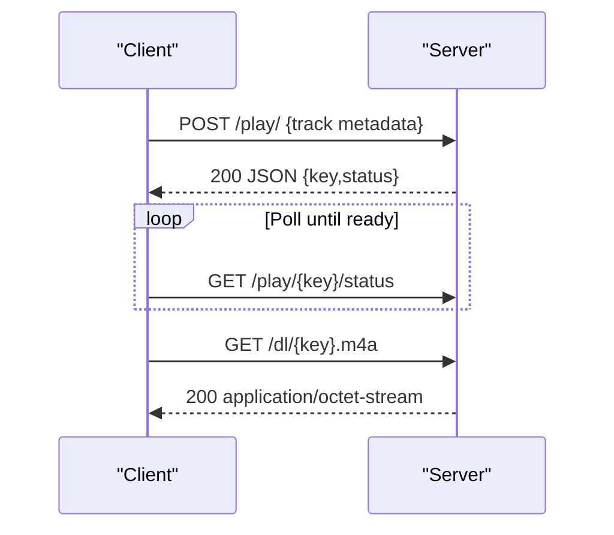

# HTTP API

<cite>
**Referenced Files in This Document**
- [main.go](file://go_backend_spotiflac/cmd/server/main.go)
- [ratelimit.go](file://go_backend_spotiflac/ratelimit.go)
- [httputil.go](file://go_backend_spotiflac/httputil.go)
- [README_FINAL.md](file://README_FINAL.md)
</cite>

## Table of Contents
1. [Introduction](#introduction)
2. [Project Structure](#project-structure)
3. [Core Components](#core-components)
4. [Architecture Overview](#architecture-overview)
5. [Detailed Component Analysis](#detailed-component-analysis)
6. [Dependency Analysis](#dependency-analysis)
7. [Performance Considerations](#performance-considerations)
8. [Troubleshooting Guide](#troubleshooting-guide)
9. [Conclusion](#conclusion)
10. [Appendices](#appendices)

## Introduction
This document describes the HTTP API exposed by the Bitly backend server (Go-based). It covers all HTTP endpoints, the RPC interface, authentication, error handling, rate limiting, and security considerations. It also provides example requests/responses and integration patterns for clients.

## Project Structure
The backend exposes a small set of HTTP endpoints backed by a single HTTP multiplexer. Handlers implement streaming playback, file downloads, and a JSON-RPC interface. The server listens on localhost by default and does not implement CORS or authentication at the HTTP layer.

**Diagram sources**
- [main.go:124-134](file://go_backend_spotiflac/cmd/server/main.go#L124-L134)
- [main.go:125-129](file://go_backend_spotiflac/cmd/server/main.go#L125-L129)

**Section sources**
- [main.go:107-134](file://go_backend_spotiflac/cmd/server/main.go#L107-L134)

## Core Components
- HTTP server: Creates a ServeMux and registers routes for the index, search, RPC, playback, and download endpoints.
- Playback engine: Manages transient playback sessions keyed by a random token. Sessions track status, progress, and file path.
- RPC interface: A JSON-RPC 2.0 compatible endpoint that dispatches to internal methods.
- Download pipeline: Transient audio files are stored under a temp directory and later moved to a “ready” folder for retrieval.

**Section sources**
- [main.go:24-40](file://go_backend_spotiflac/cmd/server/main.go#L24-L40)
- [main.go:136-270](file://go_backend_spotiflac/cmd/server/main.go#L136-L270)
- [main.go:272-286](file://go_backend_spotiflac/cmd/server/main.go#L272-L286)
- [main.go:359-385](file://go_backend_spotiflac/cmd/server/main.go#L359-L385)

## Architecture Overview
The server runs on localhost and exposes five primary endpoints. Requests are handled synchronously by handlers. The RPC endpoint supports a broad set of internal methods for downloads, metadata, lyrics, extensions, playback control, and statistics.

**Diagram sources**
- [main.go:125-129](file://go_backend_spotiflac/cmd/server/main.go#L125-L129)
- [main.go:136-270](file://go_backend_spotiflac/cmd/server/main.go#L136-L270)
- [main.go:272-286](file://go_backend_spotiflac/cmd/server/main.go#L272-L286)
- [main.go:359-385](file://go_backend_spotiflac/cmd/server/main.go#L359-L385)

## Detailed Component Analysis

### Endpoint: GET /
- Purpose: Health and identity probe.
- Method: GET
- URL: /
- Authentication: None
- Response: JSON object with service name, version, and status.
- Example response:
  - {
    "servicio": "spotiflac-backend",
    "version": "0.5.0",
    "status": "ok"
  }

Common use cases:
- Verify server availability.
- Confirm backend version during integration.

**Section sources**
- [main.go:288-295](file://go_backend_spotiflac/cmd/server/main.go#L288-L295)

### Endpoint: GET /buscar?q=&limite=
- Purpose: Search tracks via an internal provider.
- Method: GET
- URL: /buscar?q={query}&limite={limit}
- Query parameters:
  - q (required): Search term.
  - limite (optional): Limit, clamped to 1–50, defaults to 10.
- Authentication: None
- Response: JSON with songs array and total count.
- Example response:
  - {
    "canciones": [
      {
        "id": "string",
        "titulo": "string",
        "artista": "string",
        "album": "string",
        "cover": "string",
        "duracion": 120,
        "fuente": "deezer"
      }
    ],
    "total": 1
  }
- Error codes:
  - 400: Query required.
  - 500: Search failed.

Common use cases:
- Integrate a search UI.
- Paginate results using the returned total.

**Section sources**
- [main.go:297-347](file://go_backend_spotiflac/cmd/server/main.go#L297-L347)

### Endpoint: POST /rpc
- Purpose: JSON-RPC 2.0 interface to internal methods.
- Method: POST
- URL: /rpc
- Content-Type: application/json
- Request body:
  - JSON object with fields:
    - method (string): Internal method name.
    - params (object): Arbitrary parameters depending on method.
- Response:
  - On success: JSON {result: <value>}
  - On error: JSON {error: "<message>"}
- Error codes:
  - 405: Method not allowed (non-POST).
  - 400: Invalid JSON or cannot read body.
  - 500: Dispatch error (e.g., unknown method).

Common use cases:
- Trigger downloads, fetch metadata, manage extensions, control playback, and query stats.

Notes:
- The RPC supports a very broad set of methods (see dispatch). Typical categories include:
  - Initialization and lifecycle: ping, exitApp, cleanupConnections
  - Premium checks: validarCodigoPremium, verificarPremium
  - Downloads: downloadByStrategy, getDownloadProgress, getAllDownloadProgress, cancelDownload, setDownloadDirectory, checkDuplicate, buildFilename, sanitizeFilename
  - Lyrics: fetchLyrics, getLyricsLRC, embedLyricsToFile, getLyricsProviders, setLyricsProviders
  - Metadata: readAudioMetadata, editFileMetadata, rewriteSplitArtistTags, runPostProcessing
  - Extensions: initExtensionSystem, loadExtensionsFromDir, unloadExtension, upgradeExtension, getInstalledExtensions, setExtensionEnabled, invokeExtensionAction, cleanupExtensions
  - Providers: searchTracksWithMetadataProviders, getProviderPriority, setProviderPriority, setDownloadFallbackExtensionIds
  - Playback control: playbackPlayTrack, playbackPause, playbackResume, playbackStop, playbackSeek, playbackSetQueue, playbackAddToQueue, playbackSetShuffle, playbackSetRepeat, playbackTrackCompleted, playbackGetState, playbackGetHistory, playbackGetQueue, playbackRemoveFromQueue, playbackClearQueue, playbackUpdatePosition
  - YouTube integration: searchYouTubeVideo, downloadYouTubeVideo
  - Favorites/Collections: upsertFavorite, deleteFavorite, getAllFavorites, upsertCollection, deleteCollection, addToCollection, removeFromCollection, getAllCollections, getCollectionItems, getAllCollectionItems, getCollectionItemIDsByItemID
  - Play history/aggregates/stats: logPlay, getRecentPlays, clearPlayHistory, incrementPlayCount, getPlayAggregates, getTotalStats, getTopTracks, getTopAlbums, getTopArtists, getSecretCounter, incrementNightPlays, updateAlbumStreak, isSecretUnlocked, unlockSecret, getUnlockedSecrets, clearAllStats
  - Download queue and recent access: saveDownloadQueue, loadDownloadQueue, getPendingDownloadQueueRows, replacePendingDownloadQueueRows, upsertRecentAccessRow, getRecentAccessRows, deleteRecentAccessRow, clearRecentAccessRows, getHiddenRecentDownloadIds, addHiddenRecentDownloadId, clearHiddenRecentDownloadIds
  - App settings: saveAppSettings, loadAppSettings

Example request:
- {
  "method": "ping",
  "params": {}
}

Example response:
- {
  "result": "pong"
}

Example error:
- {
  "error": "unknown method: unknownMethod"
}

**Section sources**
- [main.go:359-385](file://go_backend_spotiflac/cmd/server/main.go#L359-L385)
- [main.go:555-1456](file://go_backend_spotiflac/cmd/server/main.go#L555-L1456)

### Endpoint: POST /play/{key}
- Purpose: Start a new playback session by initiating a download.
- Method: POST
- URL: /play/
- Body (JSON):
  - provider (string): Service identifier (e.g., "deezer").
  - track_id (string): Provider track identifier.
  - track_name (string): Track title.
  - artist_name (string): Artist name.
  - isrc (string): ISRC code.
  - quality (string): Quality preference.
- Authentication: None
- Response:
  - 200 JSON: {
    "key": "string",
    "status": "downloading"
  }
- Error codes:
  - 400: Invalid JSON.

Common use cases:
- Initiate a streamable download for subsequent playback.

Notes:
- The server generates a random key and starts an asynchronous download. The key is used to poll status and later retrieve the file.

**Section sources**
- [main.go:141-171](file://go_backend_spotiflac/cmd/server/main.go#L141-L171)

### Endpoint: GET /play/{key}/status
- Purpose: Poll the status of a playback session.
- Method: GET
- URL: /play/{key}/status
- Authentication: None
- Response:
  - 200 JSON: {
    "key": "string",
    "status": "downloading|ready|error",
    "progress": 0..100,
    "track": "string",
    "artist": "string",
    "error": "string?"  // present if status is error
  }
- Error codes:
  - 404: Session not found.

Common use cases:
- Drive a progress UI and decide when to enable playback.

**Section sources**
- [main.go:237-254](file://go_backend_spotiflac/cmd/server/main.go#L237-L254)

### Endpoint: GET /play/{key}
- Purpose: Stream the downloaded audio file.
- Method: GET
- URL: /play/{key}
- Authentication: None
- Response:
  - 200 audio/mp4 with Accept-Ranges: bytes
  - 425: Not ready (session not ready)
- Error codes:
  - 404: Session not found.

Common use cases:
- Progressive playback in browsers or media players supporting byte-range requests.

**Section sources**
- [main.go:256-269](file://go_backend_spotiflac/cmd/server/main.go#L256-L269)

### Endpoint: GET /dl/{filename}
- Purpose: Download a previously prepared file from the “ready” folder.
- Method: GET
- URL: /dl/{filename}
- Authentication: None
- Response:
  - 200 application/octet-stream
- Error codes:
  - 400: Missing path.
  - 404: Not found.

Common use cases:
- Direct file download after a session completes.

**Section sources**
- [main.go:272-286](file://go_backend_spotiflac/cmd/server/main.go#L272-L286)

### Playback Engine Internals
- Session model: Stores key, status, progress, file path, error, creation time, and track metadata.
- Lifecycle:
  - POST /play/ creates a session and starts a download asynchronously.
  - Status transitions: downloading -> ready or error.
  - After readiness, the file is moved to a “ready” directory and can be streamed or downloaded.

**Diagram sources**
- [main.go:24-40](file://go_backend_spotiflac/cmd/server/main.go#L24-L40)
- [main.go:136-270](file://go_backend_spotiflac/cmd/server/main.go#L136-L270)

## Dependency Analysis
- Routing: ServeMux registers endpoints and delegates to handlers.
- Playback: Sessions are stored in-memory with a mutex-protected map.
- RPC: A single dispatch function routes to hundreds of internal methods.
- HTTP utilities: Shared and download clients, retry logic, and ISP blocking detection are available in the gobackend package.

**Diagram sources**
- [main.go:124-134](file://go_backend_spotiflac/cmd/server/main.go#L124-L134)
- [main.go:24-40](file://go_backend_spotiflac/cmd/server/main.go#L24-L40)
- [main.go:555-1456](file://go_backend_spotiflac/cmd/server/main.go#L555-L1456)

**Section sources**
- [main.go:124-134](file://go_backend_spotiflac/cmd/server/main.go#L124-L134)
- [main.go:24-40](file://go_backend_spotiflac/cmd/server/main.go#L24-L40)
- [httputil.go:100-130](file://go_backend_spotiflac/httputil.go#L100-L130)

## Performance Considerations
- Streaming: The audio endpoint sets Accept-Ranges to support efficient seeking and resume.
- Concurrency: Playback downloads are started in goroutines; handlers remain lightweight.
- Timeouts: HTTP clients in the gobackend package define default and extended timeouts suitable for downloads.
- Retries: HTTP utilities implement retry logic with exponential backoff and special handling for 429/5xx and ISP blocking scenarios.

Recommendations:
- Use byte-range requests for responsive playback.
- Respect server-side limits and avoid excessive polling of /play/{key}/status.
- For bulk downloads, prefer /dl/{filename} after sessions become ready.

**Section sources**
- [main.go:267-269](file://go_backend_spotiflac/cmd/server/main.go#L267-L269)
- [httputil.go:45-52](file://go_backend_spotiflac/httputil.go#L45-L52)
- [httputil.go:265-345](file://go_backend_spotiflac/httputil.go#L265-L345)

## Troubleshooting Guide
Common issues and resolutions:
- 400 Bad Request
  - /play/: Invalid JSON body.
  - /dl/: Missing path.
- 404 Not Found
  - /play/{key}: Session not found.
  - /dl/{filename}: File not found in the “ready” directory.
- 425 Too Early
  - /play/{key}: Attempted to stream before readiness.
- 500 Internal Server Error
  - /buscar: Search failed.
  - /rpc: Unknown method or dispatch error.

ISP and network issues:
- HTTP utilities detect ISP blocking and suggest using a VPN or changing DNS.
- Automatic retries and backoff are applied for 429 and 5xx responses.

Rate limiting:
- A general-purpose rate limiter is available in the gobackend package.
- The server itself does not implement global rate limiting for HTTP endpoints.

Security and CORS:
- No authentication or CORS handling is implemented at the HTTP layer.
- The server binds to localhost by default.

**Section sources**
- [main.go:150-153](file://go_backend_spotiflac/cmd/server/main.go#L150-L153)
- [main.go:275-282](file://go_backend_spotiflac/cmd/server/main.go#L275-L282)
- [main.go:262-264](file://go_backend_spotiflac/cmd/server/main.go#L262-L264)
- [main.go:314-318](file://go_backend_spotiflac/cmd/server/main.go#L314-L318)
- [main.go:141-171](file://go_backend_spotiflac/cmd/server/main.go#L141-L171)
- [httputil.go:294-345](file://go_backend_spotiflac/httputil.go#L294-L345)
- [ratelimit.go:8-92](file://go_backend_spotiflac/ratelimit.go#L8-L92)

## Conclusion
The Bitly backend server provides a focused HTTP surface for search, playback orchestration, and a powerful JSON-RPC interface. It is designed for local operation without built-in authentication or CORS. Clients should implement their own security measures and integrate with the RPC interface for advanced functionality.

## Appendices

### Appendix A: RPC Method Categories
- Initialization and lifecycle: ping, exitApp, cleanupConnections
- Premium checks: validarCodigoPremium, verificarPremium
- Downloads: downloadByStrategy, getDownloadProgress, getAllDownloadProgress, cancelDownload, setDownloadDirectory, checkDuplicate, buildFilename, sanitizeFilename
- Lyrics: fetchLyrics, getLyricsLRC, embedLyricsToFile, getLyricsProviders, setLyricsProviders
- Metadata: readAudioMetadata, editFileMetadata, rewriteSplitArtistTags, runPostProcessing
- Extensions: initExtensionSystem, loadExtensionsFromDir, unloadExtension, upgradeExtension, getInstalledExtensions, setExtensionEnabled, invokeExtensionAction, cleanupExtensions
- Providers: searchTracksWithMetadataProviders, getProviderPriority, setProviderPriority, setDownloadFallbackExtensionIds
- Playback control: playbackPlayTrack, playbackPause, playbackResume, playbackStop, playbackSeek, playbackSetQueue, playbackAddToQueue, playbackSetShuffle, playbackSetRepeat, playbackTrackCompleted, playbackGetState, playbackGetHistory, playbackGetQueue, playbackRemoveFromQueue, playbackClearQueue, playbackUpdatePosition
- YouTube integration: searchYouTubeVideo, downloadYouTubeVideo
- Favorites/Collections: upsertFavorite, deleteFavorite, getAllFavorites, upsertCollection, deleteCollection, addToCollection, removeFromCollection, getAllCollections, getCollectionItems, getAllCollectionItems, getCollectionItemIDsByItemID
- Play history/aggregates/stats: logPlay, getRecentPlays, clearPlayHistory, incrementPlayCount, getPlayAggregates, getTotalStats, getTopTracks, getTopAlbums, getTopArtists, getSecretCounter, incrementNightPlays, updateAlbumStreak, isSecretUnlocked, unlockSecret, getUnlockedSecrets, clearAllStats
- Download queue and recent access: saveDownloadQueue, loadDownloadQueue, getPendingDownloadQueueRows, replacePendingDownloadQueueRows, upsertRecentAccessRow, getRecentAccessRows, deleteRecentAccessRow, clearRecentAccessRows, getHiddenRecentDownloadIds, addHiddenRecentDownloadId, clearHiddenRecentDownloadIds
- App settings: saveAppSettings, loadAppSettings

**Section sources**
- [main.go:555-1456](file://go_backend_spotiflac/cmd/server/main.go#L555-L1456)

### Appendix B: Example Workflows

#### Workflow: Search and Play

**Diagram sources**
- [main.go:297-347](file://go_backend_spotiflac/cmd/server/main.go#L297-L347)
- [main.go:141-171](file://go_backend_spotiflac/cmd/server/main.go#L141-L171)
- [main.go:237-269](file://go_backend_spotiflac/cmd/server/main.go#L237-L269)

#### Workflow: Direct Download

**Diagram sources**
- [main.go:141-171](file://go_backend_spotiflac/cmd/server/main.go#L141-L171)
- [main.go:237-254](file://go_backend_spotiflac/cmd/server/main.go#L237-L254)
- [main.go:272-286](file://go_backend_spotiflac/cmd/server/main.go#L272-L286)

### Appendix C: Security and Deployment Notes
- Binding: The server listens on 127.0.0.1 by default. Expose externally at your own risk.
- Authentication: None implemented at the HTTP layer.
- CORS: None implemented at the HTTP layer.
- Recommendations:
  - Place behind a reverse proxy with authentication and TLS termination.
  - Enforce CORS policies at the proxy level if exposing externally.
  - Consider adding rate limiting at the proxy or application level.

**Section sources**
- [main.go:131-133](file://go_backend_spotiflac/cmd/server/main.go#L131-L133)
- [README_FINAL.md:230-237](file://README_FINAL.md#L230-L237)