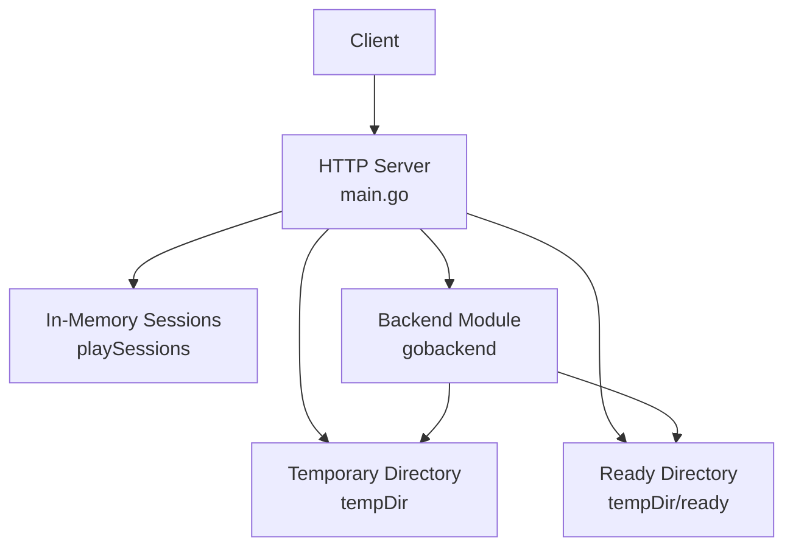
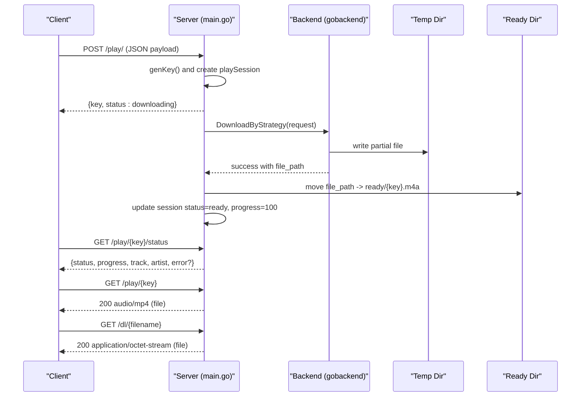
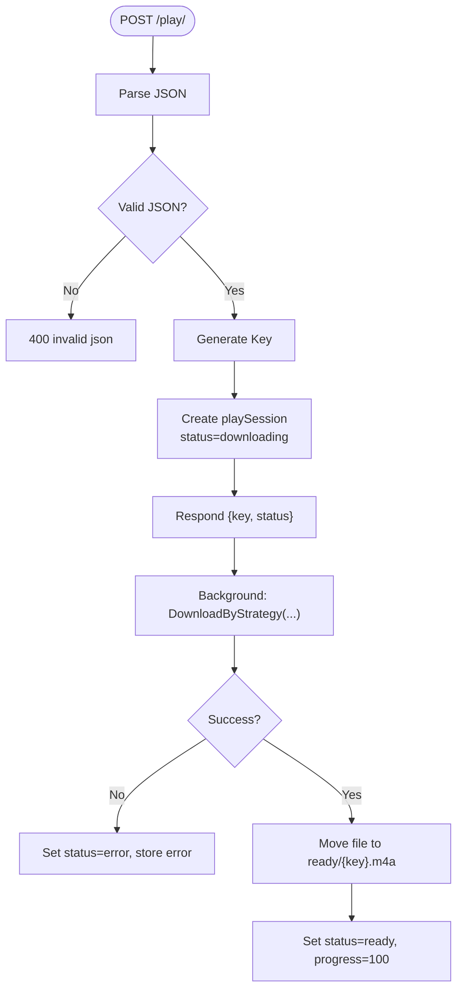
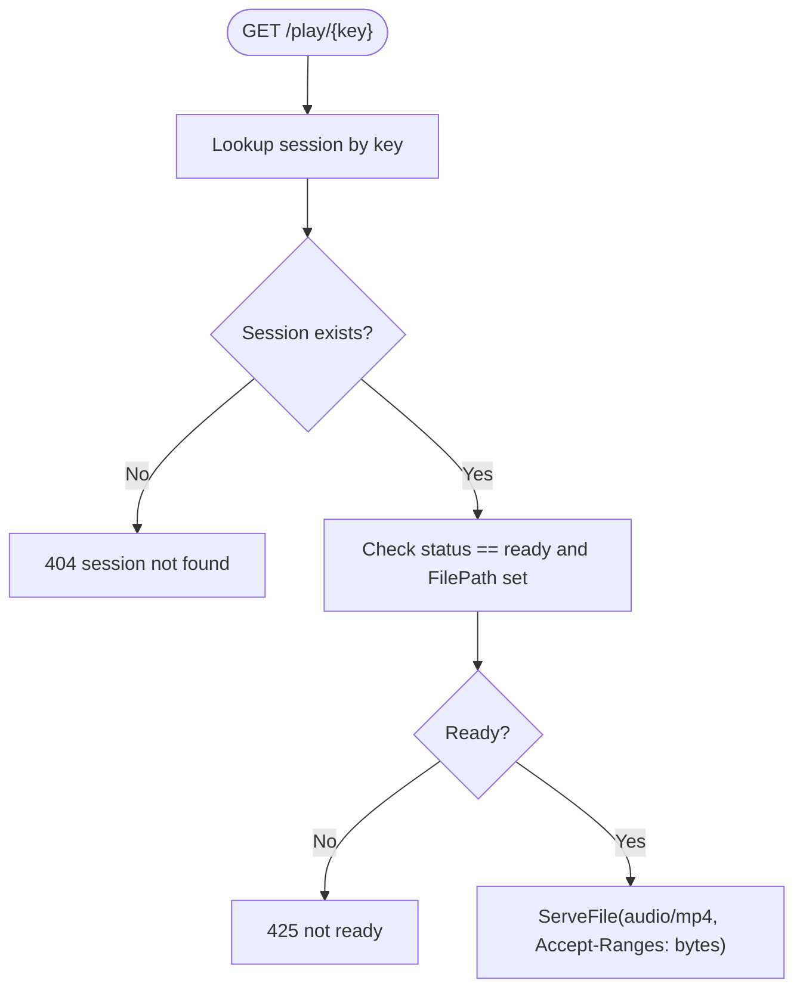
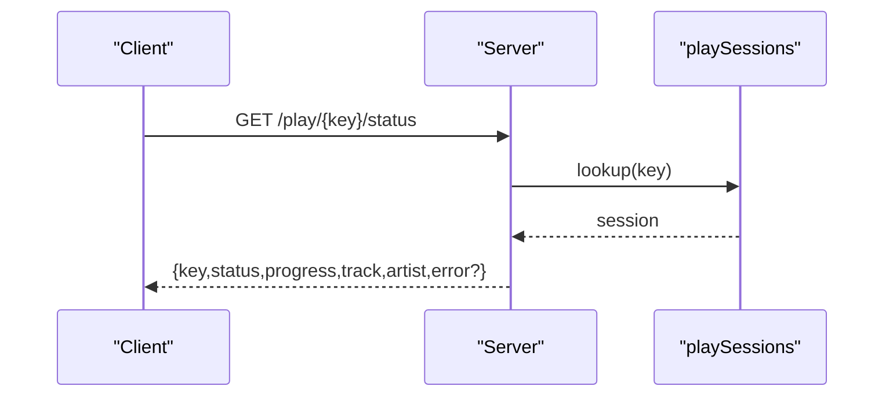
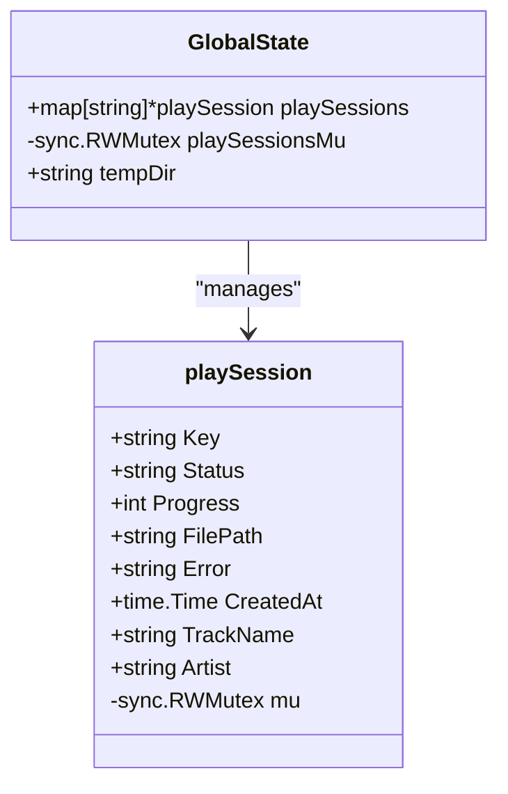
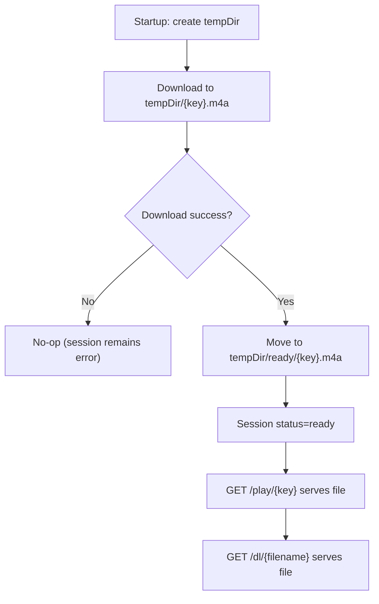
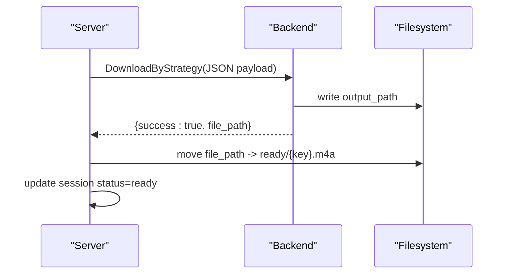
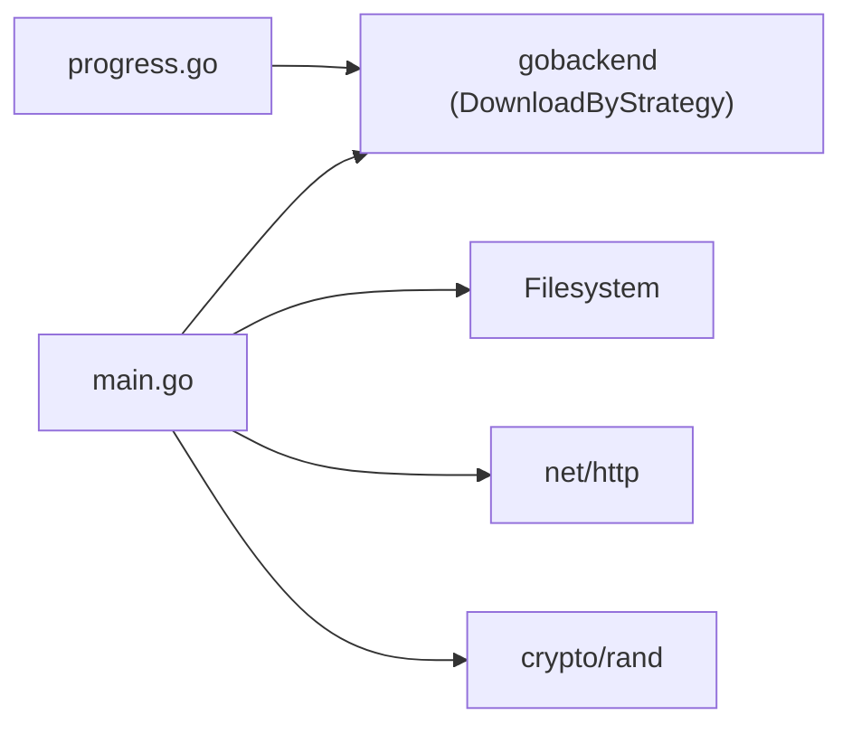

# Play and Download Endpoints

<cite>
**Referenced Files in This Document**
- [main.go](file://go_backend_spotiflac/cmd/server/main.go)
- [progress.go](file://go_backend_spotiflac/progress.go)
- [exports.go](file://go_backend_spotiflac/exports.go)
</cite>

## Table of Contents
1. [Introduction](#introduction)
2. [Project Structure](#project-structure)
3. [Core Components](#core-components)
4. [Architecture Overview](#architecture-overview)
5. [Detailed Component Analysis](#detailed-component-analysis)
6. [Dependency Analysis](#dependency-analysis)
7. [Performance Considerations](#performance-considerations)
8. [Troubleshooting Guide](#troubleshooting-guide)
9. [Conclusion](#conclusion)

## Introduction
This document explains Bitly’s audio streaming and download endpoints with a focus on:
- POST /play/: Initiates an audio download with a JSON payload specifying provider, track identifiers, and quality.
- GET /play/{key}: Streams the downloaded audio file when ready.
- GET /play/{key}/status: Reports download progress and status.
- GET /dl/{filename}: Directly downloads a file from the “ready” directory.

It covers the session-based architecture, automatic key generation, temporary file management, concurrency handling, and error semantics.

## Project Structure
The server is implemented in a single Go file with a small set of supporting modules:
- HTTP handlers for routes under /play/ and /dl/
- In-memory session storage keyed by auto-generated identifiers
- Temporary directory management for staged downloads and final “ready” files
- Integration with a backend module for orchestration of downloads

**Diagram sources**
- [main.go:107-134](file://go_backend_spotiflac/cmd/server/main.go#L107-L134)
- [main.go:36-49](file://go_backend_spotiflac/cmd/server/main.go#L36-L49)

**Section sources**
- [main.go:107-134](file://go_backend_spotiflac/cmd/server/main.go#L107-L134)
- [main.go:36-49](file://go_backend_spotiflac/cmd/server/main.go#L36-L49)

## Core Components
- Session model: Tracks key, status, progress, file path, error, creation time, and metadata.
- Global in-memory registry: Map of active sessions guarded by a mutex.
- Temporary directory: Created at startup; used for staging downloads and final “ready” files.
- Key generator: Cryptographically secure random key generation.
- Handlers:
  - POST /play/: Creates a session, starts a background download, returns a key.
  - GET /play/{key}: Serves the audio file when ready; otherwise returns an error.
  - GET /play/{key}/status: Returns current status and progress.
  - GET /dl/{filename}: Directly serves files from the “ready” directory.

**Section sources**
- [main.go:24-49](file://go_backend_spotiflac/cmd/server/main.go#L24-L49)
- [main.go:136-270](file://go_backend_spotiflac/cmd/server/main.go#L136-L270)
- [main.go:272-286](file://go_backend_spotiflac/cmd/server/main.go#L272-L286)

## Architecture Overview
The system uses a simple, in-process architecture:
- Clients initiate downloads via POST /play/.
- A background goroutine performs the download using the backend module.
- On completion, the file is moved to the “ready” directory and marked as ready.
- Clients poll GET /play/{key}/status to monitor progress.
- Once ready, clients stream via GET /play/{key} or download via GET /dl/{filename}.

**Diagram sources**
- [main.go:136-220](file://go_backend_spotiflac/cmd/server/main.go#L136-L220)
- [main.go:224-270](file://go_backend_spotiflac/cmd/server/main.go#L224-L270)
- [main.go:272-286](file://go_backend_spotiflac/cmd/server/main.go#L272-L286)

## Detailed Component Analysis

### POST /play/
- Purpose: Start a new download session.
- Request body (JSON):
  - provider: Service identifier (e.g., provider name)
  - track_id: Unique identifier for the track
  - track_name: Track title
  - artist_name: Artist name
  - isrc: International Standard Recording Code
  - quality: Desired quality (backend decides interpretation)
- Behavior:
  - Validates JSON; returns 400 on decode failure.
  - Generates a random key and creates a session with status “downloading”.
  - Starts a background goroutine to call the backend’s download strategy.
  - On success, moves the file to the “ready” directory and marks the session “ready”.
  - On failure, sets session status to “error” with an error message.
- Response:
  - 200 OK with JSON: {key, status: downloading}

**Diagram sources**
- [main.go:141-221](file://go_backend_spotiflac/cmd/server/main.go#L141-L221)

**Section sources**
- [main.go:141-170](file://go_backend_spotiflac/cmd/server/main.go#L141-L170)
- [main.go:172-221](file://go_backend_spotiflac/cmd/server/main.go#L172-L221)

### GET /play/{key}
- Purpose: Stream the audio file when ready.
- Path parameter:
  - key: Session identifier generated by POST /play/.
- Behavior:
  - Retrieves the session by key.
  - If the session does not exist, returns 404.
  - If the session exists but is not ready, returns 425.
  - Otherwise, serves the file with Content-Type audio/mp4 and Accept-Ranges: bytes.

**Diagram sources**
- [main.go:224-270](file://go_backend_spotiflac/cmd/server/main.go#L224-L270)

**Section sources**
- [main.go:224-270](file://go_backend_spotiflac/cmd/server/main.go#L224-L270)

### GET /play/{key}/status
- Purpose: Poll for download progress and status.
- Behavior:
  - Retrieves the session by key.
  - Returns JSON with key, status, progress, track, artist, and optional error field.

**Diagram sources**
- [main.go:237-254](file://go_backend_spotiflac/cmd/server/main.go#L237-L254)

**Section sources**
- [main.go:237-254](file://go_backend_spotiflac/cmd/server/main.go#L237-L254)

### GET /dl/{filename}
- Purpose: Directly download a file from the “ready” directory.
- Behavior:
  - Validates path and constructs a safe path under tempDir/ready.
  - If the file does not exist, returns 404.
  - Otherwise, serves the file with Content-Type application/octet-stream.

**Section sources**
- [main.go:272-286](file://go_backend_spotiflac/cmd/server/main.go#L272-L286)

### Session Model and Concurrency
- Session fields:
  - Key, Status ("downloading", "ready", "error"), Progress, FilePath, Error, CreatedAt, TrackName, Artist, and a read-write mutex.
- Concurrency:
  - playSessions is a map protected by a global mutex.
  - Each session has its own mutex for atomic reads/writes to status/progress/file path.
  - Background goroutines update session state safely.

**Diagram sources**
- [main.go:24-49](file://go_backend_spotiflac/cmd/server/main.go#L24-L49)

**Section sources**
- [main.go:24-49](file://go_backend_spotiflac/cmd/server/main.go#L24-L49)

### Temporary Directory and File Management
- Initialization:
  - At startup, a temporary directory is created; if creation fails, the OS temporary directory is used.
- Staging and readiness:
  - Downloads are initially written to tempDir/{key}.m4a.
  - On success, the file is moved to tempDir/ready/{key}.m4a.
- Serving:
  - GET /play/{key} serves the file from its final location.
  - GET /dl/{filename} serves files from tempDir/ready.

**Diagram sources**
- [main.go:42-49](file://go_backend_spotiflac/cmd/server/main.go#L42-L49)
- [main.go:172-220](file://go_backend_spotiflac/cmd/server/main.go#L172-L220)
- [main.go:272-286](file://go_backend_spotiflac/cmd/server/main.go#L272-L286)

**Section sources**
- [main.go:42-49](file://go_backend_spotiflac/cmd/server/main.go#L42-L49)
- [main.go:172-220](file://go_backend_spotiflac/cmd/server/main.go#L172-L220)
- [main.go:272-286](file://go_backend_spotiflac/cmd/server/main.go#L272-L286)

### Backend Integration and Progress
- The download is initiated by calling the backend’s download strategy with a JSON payload containing track metadata, provider, and output path.
- The backend writes the file to the provided output path and returns a success result with the final file path.
- The server updates session state accordingly and moves the file to the “ready” directory.

**Diagram sources**
- [main.go:172-220](file://go_backend_spotiflac/cmd/server/main.go#L172-L220)
- [exports.go:158-200](file://go_backend_spotiflac/exports.go#L158-L200)

**Section sources**
- [main.go:172-220](file://go_backend_spotiflac/cmd/server/main.go#L172-L220)
- [exports.go:158-200](file://go_backend_spotiflac/exports.go#L158-L200)

## Dependency Analysis
- Internal dependencies:
  - main.go depends on a backend module for orchestration of downloads.
  - Progress reporting is managed by a separate module that tracks multi-item progress.
- External dependencies:
  - Uses standard library networking, file system, and crypto/rand for key generation.
  - Optionally ensures FFmpeg availability on Windows (not part of play/dl endpoints).

**Diagram sources**
- [main.go:107-134](file://go_backend_spotiflac/cmd/server/main.go#L107-L134)
- [progress.go:107-146](file://go_backend_spotiflac/progress.go#L107-L146)

**Section sources**
- [main.go:107-134](file://go_backend_spotiflac/cmd/server/main.go#L107-L134)
- [progress.go:107-146](file://go_backend_spotiflac/progress.go#L107-L146)

## Performance Considerations
- Streaming: GET /play/{key} uses the standard file serving mechanism, enabling efficient streaming and byte-range requests.
- Concurrency: Sessions are protected by per-session locks; the global map is protected by a single mutex. For high concurrency, consider sharding sessions by key hash to reduce contention.
- Disk I/O: Moving files from a staging location to the “ready” directory is O(1) and avoids blocking reads during download.
- Memory: Sessions are stored in memory; long-running servers should consider eviction policies or persistence if needed.

## Troubleshooting Guide
Common error scenarios and responses:
- 400 Bad Request:
  - POST /play/ with invalid JSON payload.
  - GET /play/ missing key.
  - GET /dl/ missing path.
- 404 Not Found:
  - GET /play/{key} with a non-existent key.
  - GET /dl/{filename} where the file does not exist in the “ready” directory.
- 425 Too Early:
  - GET /play/{key} when the session is not yet ready.

Operational tips:
- Poll GET /play/{key}/status to monitor progress.
- Ensure the backend module is available and configured to support the chosen provider.
- Confirm that the temporary directory is writable and has sufficient space.

**Section sources**
- [main.go:150-153](file://go_backend_spotiflac/cmd/server/main.go#L150-L153)
- [main.go:224-235](file://go_backend_spotiflac/cmd/server/main.go#L224-L235)
- [main.go:275-283](file://go_backend_spotiflac/cmd/server/main.go#L275-L283)
- [main.go:262-265](file://go_backend_spotiflac/cmd/server/main.go#L262-L265)

## Conclusion
Bitly’s play and download endpoints provide a straightforward, session-based audio streaming pipeline:
- Clients initiate downloads with a single POST request and receive a key.
- They poll for progress and stream or download the file when ready.
- The implementation is simple, robust, and suitable for local or controlled environments. For production-scale deployments, consider adding persistence, rate limiting, and eviction policies for sessions.