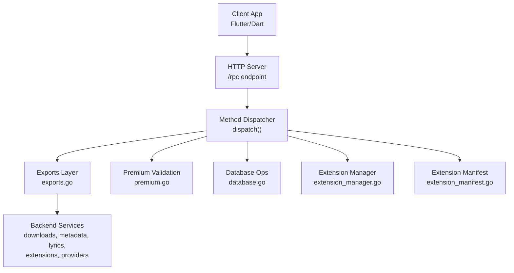
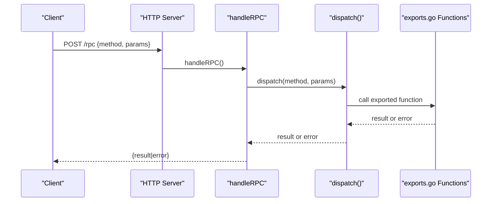
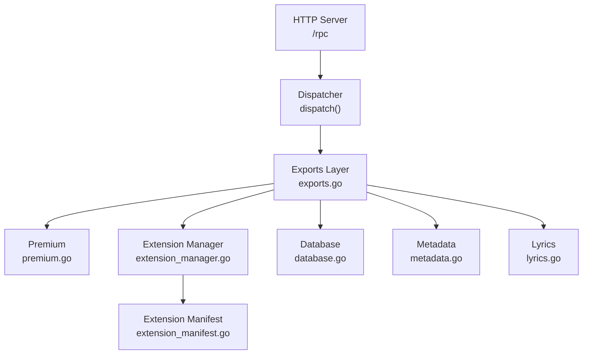

# RPC Interface

<cite>
**Referenced Files in This Document**
- [main.go](file://go_backend_spotiflac/cmd/server/main.go)
- [exports.go](file://go_backend_spotiflac/exports.go)
- [premium.go](file://go_backend_spotiflac/premium.go)
- [extension_manager.go](file://go_backend_spotiflac/extension_manager.go)
- [extension_manifest.go](file://go_backend_spotiflac/extension_manifest.go)
- [database.go](file://go_backend_spotiflac/database.go)
- [metadata.go](file://go_backend_spotiflac/metadata.go)
- [lyrics.go](file://go_backend_spotiflac/lyrics.go)
</cite>

## Table of Contents
1. [Introduction](#introduction)
2. [Project Structure](#project-structure)
3. [Core Components](#core-components)
4. [Architecture Overview](#architecture-overview)
5. [Detailed Component Analysis](#detailed-component-analysis)
6. [Dependency Analysis](#dependency-analysis)
7. [Performance Considerations](#performance-considerations)
8. [Troubleshooting Guide](#troubleshooting-guide)
9. [Conclusion](#conclusion)

## Introduction
This document describes Bitly's internal RPC interface used for cross-process communication between the Flutter frontend and the Go backend. The RPC server exposes a single POST endpoint /rpc that accepts JSON-RPC 2.0-compatible requests with method and params fields. It dispatches method calls to a wide variety of backend capabilities including database operations, availability checks, premium validation, downloads, metadata and lyrics management, extension system control, and provider management.

## Project Structure
The RPC server is implemented in the Go backend module under go_backend_spotiflac. The primary entry point registers HTTP handlers including the /rpc endpoint, which delegates to a dispatcher that maps method names to exported Go functions.

**Diagram sources**
- [main.go:107-134](file://go_backend_spotiflac/cmd/server/main.go#L107-L134)
- [main.go:359-385](file://go_backend_spotiflac/cmd/server/main.go#L359-L385)
- [exports.go:1-30](file://go_backend_spotiflac/exports.go#L1-L30)

**Section sources**
- [main.go:107-134](file://go_backend_spotiflac/cmd/server/main.go#L107-L134)
- [main.go:359-385](file://go_backend_spotiflac/cmd/server/main.go#L359-L385)

## Core Components
- HTTP Server: Registers the /rpc endpoint and other endpoints for search/play/download.
- RPC Handler: Validates HTTP method, reads and parses JSON, invokes dispatch, and returns JSON responses.
- Method Dispatcher: Switches on method name and calls the appropriate exported function with typed parameter extraction helpers.
- Exports Layer: Provides the actual implementation for all RPC methods, returning either raw JSON strings or structured results.
- Premium Module: Implements premium validation and verification logic.
- Extension Manager: Manages extension lifecycle, settings, and runtime.
- Database Module: Initializes and manages the master SQLite database.

**Section sources**
- [main.go:359-385](file://go_backend_spotiflac/cmd/server/main.go#L359-L385)
- [main.go:555-1456](file://go_backend_spotiflac/cmd/server/main.go#L555-L1456)
- [exports.go:1-80](file://go_backend_spotiflac/exports.go#L1-L80)
- [premium.go:1-126](file://go_backend_spotiflac/premium.go#L1-L126)
- [extension_manager.go:1-200](file://go_backend_spotiflac/extension_manager.go#L1-L200)
- [database.go:1-200](file://go_backend_spotiflac/database.go#L1-L200)

## Architecture Overview
The /rpc endpoint follows a simple request-response pattern:
- Request: POST /rpc with JSON body containing method and params.
- Response: JSON with either result or error.

**Diagram sources**
- [main.go:359-385](file://go_backend_spotiflac/cmd/server/main.go#L359-L385)
- [main.go:555-1456](file://go_backend_spotiflac/cmd/server/main.go#L555-L1456)

## Detailed Component Analysis

### Endpoint Definition
- Path: /rpc
- Method: POST
- Content-Type: application/json
- Body shape:
  - method: string (required)
  - params: object (optional)
- Response shape:
  - result: any (present when successful)
  - error: string (present when failed)

**Section sources**
- [main.go:349-385](file://go_backend_spotiflac/cmd/server/main.go#L349-L385)

### Method Categories and Signatures

#### Core Methods
- Method: ping
  - Purpose: Health check echo.
  - Params: none
  - Returns: string "pong"
  - Example: {"method":"ping","params":{}}

- Method: InitMasterDatabaseJSON
  - Purpose: Initialize the master SQLite database.
  - Params: path (string)
  - Returns: string "ok" or error
  - Example: {"method":"InitMasterDatabaseJSON","params":{"path":"/data/db.sqlite"}}

- Method: checkAvailability
  - Purpose: Check track availability via SongLink.
  - Params: spotify_id (string), isrc (string)
  - Returns: JSON string representing availability
  - Example: {"method":"checkAvailability","params":{"spotify_id":"...","isrc":"..."}} 

- Method: setNetworkCompatibilityOptions
  - Purpose: Configure network compatibility (allow HTTP, insecure TLS).
  - Params: allow_http (boolean), insecure_tls (boolean)
  - Returns: string "ok"
  - Example: {"method":"setNetworkCompatibilityOptions","params":{"allow_http":true,"insecure_tls":false}}

- Method: exitApp
  - Purpose: Terminate the backend process.
  - Params: none
  - Returns: string "ok"

- Method: cleanupConnections
  - Purpose: Close idle connections.
  - Params: none
  - Returns: string "ok"

**Section sources**
- [main.go:576-596](file://go_backend_spotiflac/cmd/server/main.go#L576-L596)
- [main.go:580-588](file://go_backend_spotiflac/cmd/server/main.go#L580-L588)
- [main.go:583-584](file://go_backend_spotiflac/cmd/server/main.go#L583-L584)
- [main.go:586-588](file://go_backend_spotiflac/cmd/server/main.go#L586-L588)
- [main.go:590-596](file://go_backend_spotiflac/cmd/server/main.go#L590-L596)

#### Premium Methods
- Method: validarCodigoPremium
  - Purpose: Validate a premium code.
  - Params: codigo (string)
  - Returns: object with valido (boolean), optional expiry (number)
  - Error: returns error string on invalid code
  - Example: {"method":"validarCodigoPremium","params":{"codigo":"..."}}

- Method: verificarPremium
  - Purpose: Verify premium status against timestamp.
  - Params: is_premium (number 0|1), premium_until (number epoch ms)
  - Returns: object {"valido":true}
  - Error: returns error if premium required or expired
  - Example: {"method":"verificarPremium","params":{"is_premium":1,"premium_until":1700000000000}}

**Section sources**
- [main.go:599-620](file://go_backend_spotiflac/cmd/server/main.go#L599-L620)
- [premium.go:27-92](file://go_backend_spotiflac/premium.go#L27-L92)
- [premium.go:112-126](file://go_backend_spotiflac/premium.go#L112-L126)

#### Download Methods
- Method: downloadByStrategy
  - Purpose: Download track via extension providers.
  - Params: request (string JSON)
  - Returns: JSON string response from DownloadWithExtensionsJSON
  - Example: {"method":"downloadByStrategy","params":{"request":"{...}"}} 

- Method: getDownloadProgress
  - Purpose: Get current download progress.
  - Params: none
  - Returns: JSON string progress object

- Method: getAllDownloadProgress
  - Purpose: Get all active download progress.
  - Params: none
  - Returns: JSON string array/object

- Method: initItemProgress
  - Purpose: Initialize progress for an item.
  - Params: item_id (string)
  - Returns: string "ok"

- Method: finishItemProgress
  - Purpose: Mark item progress as complete.
  - Params: item_id (string)
  - Returns: string "ok"

- Method: clearItemProgress
  - Purpose: Clear progress for an item.
  - Params: item_id (string)
  - Returns: string "ok"

- Method: cancelDownload
  - Purpose: Cancel a download by item ID.
  - Params: item_id (string)
  - Returns: string "ok"

- Method: setDownloadDirectory
  - Purpose: Set default download directory.
  - Params: path (string)
  - Returns: string "ok" or error

- Method: checkDuplicate
  - Purpose: Check if a file with matching ISRC exists.
  - Params: output_dir (string), isrc (string)
  - Returns: JSON string with exists (boolean) and filepath (string)

- Method: buildFilename
  - Purpose: Build filename from template and metadata.
  - Params: template (string), metadata (string JSON)
  - Returns: string filename

- Method: sanitizeFilename
  - Purpose: Sanitize a filename.
  - Params: filename (string)
  - Returns: string sanitized filename

**Section sources**
- [main.go:623-658](file://go_backend_spotiflac/cmd/server/main.go#L623-L658)
- [exports.go:934-956](file://go_backend_spotiflac/exports.go#L934-L956)
- [exports.go:958-982](file://go_backend_spotiflac/exports.go#L958-L982)
- [exports.go:1425-1434](file://go_backend_spotiflac/exports.go#L1425-L1434)
- [exports.go:1436-1450](file://go_backend_spotiflac/exports.go#L1436-L1450)
- [exports.go:1464-1476](file://go_backend_spotiflac/exports.go#L1464-L1476)

#### Metadata and Lyrics Methods
- Method: fetchLyrics
  - Purpose: Fetch synchronized lyrics from all providers.
  - Params: spotify_id (string), track_name (string), artist_name (string), duration_ms (number)
  - Returns: JSON string with success, source, sync_type, lines, instrumental

- Method: getLyricsLRC
  - Purpose: Get LRC content from embedded/sidecar or fetch from providers.
  - Params: spotify_id (string), track_name (string), artist_name (string), file_path (string), duration_ms (number)
  - Returns: JSON string LRC content or empty string

- Method: getLyricsLRCWithSource
  - Purpose: Get LRC with source metadata.
  - Params: spotify_id (string), track_name (string), artist_name (string), file_path (string), duration_ms (number)
  - Returns: JSON string with lyrics, source, sync_type, instrumental

- Method: embedLyricsToFile
  - Purpose: Embed lyrics into audio file.
  - Params: file_path (string), lyrics (string)
  - Returns: JSON string success response

- Method: getLyricsProviders
  - Purpose: Get current lyrics provider order.
  - Params: none
  - Returns: JSON string array of provider IDs

- Method: setLyricsProviders
  - Purpose: Set lyrics provider order.
  - Params: providers_json (string JSON array)
  - Returns: string "ok"

- Method: getAvailableLyricsProviders
  - Purpose: Get available lyrics providers.
  - Params: none
  - Returns: JSON string array of provider descriptors

- Method: setLyricsFetchOptions
  - Purpose: Set lyrics fetch options.
  - Params: options_json (string JSON)
  - Returns: string "ok"

- Method: getLyricsFetchOptions
  - Purpose: Get current lyrics fetch options.
  - Params: none
  - Returns: JSON string JSON options

- Method: downloadCoverToFile
  - Purpose: Download cover art to file.
  - Params: cover_url (string), output_path (string), max_quality (boolean)
  - Returns: string "ok" or error

- Method: extractCoverToFile
  - Purpose: Extract cover from audio file to file.
  - Params: audio_path (string), output_path (string)
  - Returns: string "ok" or error

- Method: fetchAndSaveLyrics
  - Purpose: Fetch and save lyrics to LRC file.
  - Params: track_name (string), artist_name (string), spotify_id (string), duration_ms (number), output_path (string), audio_file_path (string)
  - Returns: string "ok" or error

- Method: reEnrichFile
  - Purpose: Re-embed metadata, cover, and lyrics into existing file.
  - Params: request_json (string JSON)
  - Returns: JSON string result

- Method: readFileMetadata
  - Purpose: Read metadata from audio file.
  - Params: file_path (string)
  - Returns: JSON string metadata

- Method: editFileMetadata
  - Purpose: Edit metadata in audio file (native for FLAC/APE; FFmpeg for others).
  - Params: file_path (string), metadata_json (string JSON)
  - Returns: JSON string result

- Method: rewriteSplitArtistTags
  - Purpose: Rewrite split artist tags for FLAC.
  - Params: file_path (string), artist (string), album_artist (string)
  - Returns: JSON string success response

- Method: readAudioMetadata
  - Purpose: Read audio metadata.
  - Params: file_path (string)
  - Returns: JSON string metadata

- Method: runPostProcessing
  - Purpose: Run post-processing hooks.
  - Params: file_path (string), metadata (string JSON)
  - Returns: JSON string result

- Method: runPostProcessingV2
  - Purpose: Run post-processing hooks (v2).
  - Params: input (string JSON), metadata (string JSON)
  - Returns: JSON string result

- Method: getPostProcessingProviders
  - Purpose: List post-processing providers and hooks.
  - Params: none
  - Returns: JSON string array

**Section sources**
- [main.go:660-720](file://go_backend_spotiflac/cmd/server/main.go#L660-L720)
- [exports.go:1478-1597](file://go_backend_spotiflac/exports.go#L1478-L1597)
- [exports.go:1600-1617](file://go_backend_spotiflac/exports.go#L1600-L1617)
- [exports.go:1620-1636](file://go_backend_spotiflac/exports.go#L1620-L1636)
- [exports.go:1638-1671](file://go_backend_spotiflac/exports.go#L1638-L1671)
- [exports.go:1681-1699](file://go_backend_spotiflac/exports.go#L1681-L1699)
- [exports.go:1701-1732](file://go_backend_spotiflac/exports.go#L1701-L1732)
- [exports.go:1734-1791](file://go_backend_spotiflac/exports.go#L1734-L1791)
- [exports.go:1793-1972](file://go_backend_spotiflac/exports.go#L1793-L1972)
- [exports.go:1974-2035](file://go_backend_spotiflac/exports.go#L1974-L2035)
- [exports.go:2088-2134](file://go_backend_spotiflac/exports.go#L2088-L2134)
- [exports.go:2178-2224](file://go_backend_spotiflac/exports.go#L2178-L2224)
- [exports.go:2226-2263](file://go_backend_spotiflac/exports.go#L2226-L2263)
- [exports.go:2314-2578](file://go_backend_spotiflac/exports.go#L2314-L2578)
- [exports.go:2580-2592](file://go_backend_spotiflac/exports.go#L2580-L2592)
- [exports.go:2594-2613](file://go_backend_spotiflac/exports.go#L2594-L2613)
- [exports.go:2615-2636](file://go_backend_spotiflac/exports.go#L2615-L2636)
- [exports.go:2638-2647](file://go_backend_spotiflac/exports.go#L2638-L2647)
- [exports.go:2648-2668](file://go_backend_spotiflac/exports.go#L2648-L2668)
- [exports.go:2670-2678](file://go_backend_spotiflac/exports.go#L2670-L2678)
- [exports.go:2675-2678](file://go_backend_spotiflac/exports.go#L2675-L2678)
- [exports.go:2685-2702](file://go_backend_spotiflac/exports.go#L2685-L2702)
- [exports.go:2704-2722](file://go_backend_spotiflac/exports.go#L2704-L2722)
- [exports.go:2724-2741](file://go_backend_spotiflac/exports.go#L2724-L2741)
- [exports.go:2743-2753](file://go_backend_spotiflac/exports.go#L2743-L2753)
- [exports.go:2755-2768](file://go_backend_spotiflac/exports.go#L2755-L2768)
- [exports.go:2770-2783](file://go_backend_spotiflac/exports.go#L2770-L2783)
- [exports.go:2785-2827](file://go_backend_spotiflac/exports.go#L2785-L2827)
- [exports.go:2829-2832](file://go_backend_spotiflac/exports.go#L2829-L2832)
- [exports.go:2834-2847](file://go_backend_spotiflac/exports.go#L2834-L2847)
- [exports.go:2849-2867](file://go_backend_spotiflac/exports.go#L2849-L2867)
- [exports.go:2869-2883](file://go_backend_spotiflac/exports.go#L2869-L2883)
- [exports.go:2885-2899](file://go_backend_spotiflac/exports.go#L2885-L2899)
- [exports.go:2901-2920](file://go_backend_spotiflac/exports.go#L2901-L2920)
- [exports.go:2922-2942](file://go_backend_spotiflac/exports.go#L2922-L2942)
- [exports.go:2944-2946](file://go_backend_spotiflac/exports.go#L2944-L2946)
- [exports.go:2948-2969](file://go_backend_spotiflac/exports.go#L2948-L2969)
- [exports.go:2971-3030](file://go_backend_spotiflac/exports.go#L2971-L3030)
- [exports.go:3032-3053](file://go_backend_spotiflac/exports.go#L3032-L3053)
- [exports.go:3055-3223](file://go_backend_spotiflac/exports.go#L3055-L3223)
- [exports.go:3225-3232](file://go_backend_spotiflac/exports.go#L3225-L3232)
- [exports.go:3234-3253](file://go_backend_spotiflac/exports.go#L3234-L3253)
- [exports.go:3255-3275](file://go_backend_spotiflac/exports.go#L3255-L3275)
- [exports.go:3277-3304](file://go_backend_spotiflac/exports.go#L3277-L3304)
- [exports.go:3306-3336](file://go_backend_spotiflac/exports.go#L3306-L3336)
- [exports.go:3338-3341](file://go_backend_spotiflac/exports.go#L3338-L3341)
- [exports.go:3343-3371](file://go_backend_spotiflac/exports.go#L3343-L3371)
- [exports.go:3373-3380](file://go_backend_spotiflac/exports.go#L3373-L3380)
- [exports.go:3382-3399](file://go_backend_spotiflac/exports.go#L3382-L3399)
- [exports.go:3401-3418](file://go_backend_spotiflac/exports.go#L3401-L3418)
- [exports.go:3420-3433](file://go_backend_spotiflac/exports.go#L3420-L3433)
- [exports.go:3444-3460](file://go_backend_spotiflac/exports.go#L3444-L3460)
- [exports.go:3462-3470](file://go_backend_spotiflac/exports.go#L3462-L3470)
- [exports.go:3548-3562](file://go_backend_spotiflac/exports.go#L3548-L3562)
- [exports.go:3568-3570](file://go_backend_spotiflac/exports.go#L3568-L3570)
- [exports.go:3572-3582](file://go_backend_spotiflac/exports.go#L3572-L3582)
- [exports.go:3584-3594](file://go_backend_spotiflac/exports.go#L3584-L3594)
- [exports.go:3596-3598](file://go_backend_spotiflac/exports.go#L3596-L3598)
- [exports.go:3600-3602](file://go_backend_spotiflac/exports.go#L3600-L3602)
- [exports.go:3604-3610](file://go_backend_spotiflac/exports.go#L3604-L3610)
- [exports.go:3612-3614](file://go_backend_spotiflac/exports.go#L3612-L3614)
- [exports.go:3617-3631](file://go_backend_spotiflac/exports.go#L3617-L3631)

#### Extension System Methods
- Method: initExtensionSystem
  - Purpose: Initialize extension system directories.
  - Params: extensions_dir (string), data_dir (string)
  - Returns: string "ok"

- Method: loadExtensionsFromDir
  - Purpose: Load extensions from directory.
  - Params: dir_path (string)
  - Returns: JSON string with loaded count and errors

- Method: loadExtensionFromPath
  - Purpose: Load single extension from file.
  - Params: file_path (string)
  - Returns: JSON string with extension info

- Method: unloadExtension
  - Purpose: Unload extension by ID.
  - Params: extension_id (string)
  - Returns: string "ok"

- Method: removeExtension
  - Purpose: Remove extension by ID.
  - Params: extension_id (string)
  - Returns: string "ok"

- Method: upgradeExtension
  - Purpose: Upgrade extension from file.
  - Params: file_path (string)
  - Returns: JSON string with upgraded extension info

- Method: checkExtensionUpgrade
  - Purpose: Check if upgrade is available.
  - Params: file_path (string)
  - Returns: JSON string result

- Method: getInstalledExtensions
  - Purpose: List installed extensions.
  - Params: none
  - Returns: JSON string array

- Method: setExtensionEnabled
  - Purpose: Enable/disable extension.
  - Params: extension_id (string), enabled (boolean)
  - Returns: string "ok"

- Method: invokeExtensionAction
  - Purpose: Invoke extension action.
  - Params: extension_id (string), action (string)
  - Returns: JSON string result

- Method: cleanupExtensions
  - Purpose: Unload all extensions.
  - Params: none
  - Returns: string "ok"

- Method: searchTracksWithMetadataProviders
  - Purpose: Search tracks using metadata providers.
  - Params: query (string), limit (number), include_extensions (boolean)
  - Returns: JSON string array of tracks

- Method: getProviderPriority
  - Purpose: Get provider priority order.
  - Params: none
  - Returns: JSON string array

- Method: setProviderPriority
  - Purpose: Set provider priority order.
  - Params: priority (string JSON array)
  - Returns: string "ok"

- Method: setDownloadFallbackExtensionIds
  - Purpose: Set fallback extension IDs for downloads.
  - Params: extension_ids (string JSON array)
  - Returns: string "ok"

- Method: getMetadataProviderPriority
  - Purpose: Get metadata provider priority order.
  - Params: none
  - Returns: JSON string array

- Method: setMetadataProviderPriority
  - Purpose: Set metadata provider priority order.
  - Params: priority (string JSON array)
  - Returns: string "ok"

- Method: getExtensionSettings
  - Purpose: Get extension settings.
  - Params: extension_id (string)
  - Returns: JSON string settings

- Method: setExtensionSettings
  - Purpose: Set extension settings.
  - Params: extension_id (string), settings (string JSON)
  - Returns: string "ok"

- Method: checkExtensionHealth
  - Purpose: Check extension health.
  - Params: extension_id (string)
  - Returns: JSON string result

- Method: getExtensionPendingAuth
  - Purpose: Get pending auth request for extension.
  - Params: extension_id (string)
  - Returns: JSON string request or empty

- Method: setExtensionAuthCode
  - Purpose: Set extension auth code.
  - Params: extension_id (string), auth_code (string)
  - Returns: string "ok"

- Method: setExtensionTokens
  - Purpose: Set extension tokens.
  - Params: extension_id (string), access_token (string), refresh_token (string), expires_in (number)
  - Returns: string "ok"

- Method: clearExtensionPendingAuth
  - Purpose: Clear pending auth request.
  - Params: extension_id (string)
  - Returns: string "ok"

- Method: isExtensionAuthenticated
  - Purpose: Check if extension is authenticated.
  - Params: extension_id (string)
  - Returns: string "true"/"false"

- Method: getAllPendingAuthRequests
  - Purpose: Get all pending auth requests.
  - Params: none
  - Returns: JSON string array

- Method: getPendingFFmpegCommand
  - Purpose: Get pending FFmpeg command.
  - Params: command_id (string)
  - Returns: JSON string command or empty

- Method: setFFmpegCommandResult
  - Purpose: Set FFmpeg command result.
  - Params: command_id (string), success (boolean), output (string), error (string)
  - Returns: string "ok"

- Method: getAllPendingFFmpegCommands
  - Purpose: Get all pending FFmpeg commands.
  - Params: none
  - Returns: JSON string array

- Method: customSearchWithExtension
  - Purpose: Perform custom search with extension.
  - Params: extension_id (string), query (string), options (string JSON)
  - Returns: JSON string array of results

- Method: getSearchProviders
  - Purpose: Get search providers.
  - Params: none
  - Returns: JSON string array

- Method: handleURLWithExtension
  - Purpose: Handle URL with extension.
  - Params: url (string)
  - Returns: JSON string result

- Method: findURLHandler
  - Purpose: Find URL handler extension.
  - Params: url (string)
  - Returns: string extension_id or empty

- Method: getURLHandlers
  - Purpose: Get URL handlers.
  - Params: none
  - Returns: JSON string array

- Method: getExtensionHomeFeed
  - Purpose: Get extension home feed.
  - Params: extension_id (string)
  - Returns: JSON string result

- Method: getExtensionBrowseCategories
  - Purpose: Get extension browse categories.
  - Params: extension_id (string)
  - Returns: JSON string result

- Method: cancelExtensionRequest
  - Purpose: Cancel extension request.
  - Params: request_id (string)
  - Returns: string "ok"

#### Extension Store Methods
- Method: initExtensionStore
  - Purpose: Initialize extension store cache.
  - Params: cache_dir (string)
  - Returns: string "ok"

- Method: setStoreRegistryUrl
  - Purpose: Set store registry URL.
  - Params: registry_url (string)
  - Returns: string "ok"

- Method: getStoreRegistryUrl
  - Purpose: Get store registry URL.
  - Params: none
  - Returns: string URL

- Method: clearStoreRegistryUrl
  - Purpose: Clear store registry URL.
  - Params: none
  - Returns: string "ok"

- Method: getStoreExtensions
  - Purpose: Get store extensions.
  - Params: force_refresh (boolean)
  - Returns: JSON string array

- Method: searchStoreExtensions
  - Purpose: Search store extensions.
  - Params: query (string), category (string)
  - Returns: JSON string array

- Method: getStoreCategories
  - Purpose: Get store categories.
  - Params: none
  - Returns: JSON string array

- Method: downloadStoreExtension
  - Purpose: Download extension from store.
  - Params: extension_id (string), dest_dir (string)
  - Returns: string destination path

- Method: clearStoreCache
  - Purpose: Clear store cache.
  - Params: none
  - Returns: string "ok"

#### Provider Methods
- Method: getProviderMetadata
  - Purpose: Get provider metadata.
  - Params: provider_id (string), resource_type (string), resource_id (string)
  - Returns: JSON string metadata

- Method: searchDeezerByISRC
  - Purpose: Search Deezer by ISRC.
  - Params: isrc (string)
  - Returns: JSON string result

- Method: searchDeezerByISRCForItemID
  - Purpose: Search Deezer by ISRC with cancellation support.
  - Params: isrc (string), item_id (string)
  - Returns: JSON string result

- Method: getDeezerExtendedMetadata
  - Purpose: Get Deezer extended metadata.
  - Params: track_id (string)
  - Returns: JSON string metadata

- Method: convertSpotifyToDeezer
  - Purpose: Convert Spotify resource to Deezer.
  - Params: resource_type (string), spotify_id (string)
  - Returns: JSON string result

#### Cache Methods
- Method: preWarmTrackCache
  - Purpose: Pre-warm track cache.
  - Params: tracks (string JSON array)
  - Returns: JSON string result

- Method: getTrackCacheSize
  - Purpose: Get track cache size.
  - Params: none
  - Returns: string number

- Method: clearTrackCache
  - Purpose: Clear track cache.
  - Params: none
  - Returns: string "ok"

#### Library Scan Methods
- Method: setLibraryCoverCacheDir
  - Purpose: Set library cover cache directory.
  - Params: cache_dir (string)
  - Returns: string "ok"

- Method: scanLibraryFolder
  - Purpose: Scan library folder.
  - Params: folder_path (string)
  - Returns: JSON string result

- Method: scanLibraryFolderIncremental
  - Purpose: Incremental scan library folder.
  - Params: folder_path (string), existing_files (string JSON)
  - Returns: JSON string result

- Method: scanLibraryFolderIncrementalFromSnapshot
  - Purpose: Scan from snapshot.
  - Params: folder_path (string), snapshot_path (string)
  - Returns: JSON string result

- Method: getLibraryScanProgress
  - Purpose: Get library scan progress.
  - Params: none
  - Returns: string progress

- Method: cancelLibraryScan
  - Purpose: Cancel library scan.
  - Params: none
  - Returns: string "ok"

#### Download History Methods
- Method: upsertDownloadEntry
  - Purpose: Upsert download history entry.
  - Params: request (string JSON)
  - Returns: string "ok" or error

- Method: deleteDownloadEntriesByIDs
  - Purpose: Delete entries by IDs.
  - Params: request (string JSON array)
  - Returns: string "ok" or error

- Method: deleteDownloadEntriesByPaths
  - Purpose: Delete entries by paths.
  - Params: request (string JSON array)
  - Returns: string "ok" or error

- Method: deleteDownloadEntriesByTrackMatch
  - Purpose: Delete entries by track match.
  - Params: track_name (string), artist_name (string)
  - Returns: string "ok"

- Method: getDownloadHistory
  - Purpose: Get download history.
  - Params: limit (number), offset (number)
  - Returns: JSON string result

- Method: clearDownloadHistory
  - Purpose: Clear download history.
  - Params: none
  - Returns: string "ok"

- Method: getDownloadHistoryCount
  - Purpose: Get download history count.
  - Params: none
  - Returns: string count

- Method: getDownloadHistoryGroupedCounts
  - Purpose: Get grouped counts.
  - Params: none
  - Returns: JSON string result

- Method: getDownloadEntryByID
  - Purpose: Get entry by ID.
  - Params: request (string JSON)
  - Returns: JSON string result

- Method: getDownloadEntryBySpotifyID
  - Purpose: Get entry by Spotify ID.
  - Params: request (string JSON)
  - Returns: JSON string result

- Method: getDownloadEntryByISRC
  - Purpose: Get entry by ISRC.
  - Params: request (string JSON)
  - Returns: JSON string result

- Method: findDownloadEntryByTrackAndArtist
  - Purpose: Find entry by track and artist.
  - Params: track_name (string), artist_name (string)
  - Returns: JSON string result

- Method: updateDownloadFilePath
  - Purpose: Update download file path.
  - Params: id (string), file_path (string)
  - Returns: string "ok"

- Method: updateDownloadAudioMetadata
  - Purpose: Update download audio metadata.
  - Params: request (string JSON)
  - Returns: string "ok"

- Method: getDownloadHistoryFilePaths
  - Purpose: Get download history file paths.
  - Params: none
  - Returns: JSON string result

- Method: existingDownloadTrackKeys
  - Purpose: Get existing download track keys.
  - Params: request (string JSON)
  - Returns: JSON string result

- Method: getDownloadAlbumTracks
  - Purpose: Get album tracks.
  - Params: album (string), artist (string)
  - Returns: JSON string result

- Method: getDownloadArtistTracks
  - Purpose: Get artist tracks.
  - Params: artist (string)
  - Returns: JSON string result

#### Local Library Methods
- Method: upsertLocalLibraryEntry
  - Purpose: Upsert local library entry.
  - Params: request (string JSON)
  - Returns: string "ok" or error

- Method: clearLocalLibrary
  - Purpose: Clear local library.
  - Params: none
  - Returns: string "ok"

- Method: deleteLocalLibraryEntriesByPaths
  - Purpose: Delete entries by paths.
  - Params: request (string JSON array)
  - Returns: string "ok" or error

- Method: deleteLocalLibraryEntryByID
  - Purpose: Delete entry by ID.
  - Params: id (string)
  - Returns: string "ok"

- Method: getLocalLibraryPage
  - Purpose: Get library page.
  - Params: limit (number), offset (number), searchQuery (string), sortMode (string)
  - Returns: JSON string result

- Method: getLocalLibraryCount
  - Purpose: Get local library count.
  - Params: searchQuery (string)
  - Returns: string count

- Method: getLocalLibraryAlbumGroups
  - Purpose: Get album groups.
  - Params: limit (number), offset (number), searchQuery (string)
  - Returns: JSON string result

- Method: getLocalLibraryAlbumGroupCount
  - Purpose: Get album group count.
  - Params: searchQuery (string)
  - Returns: string count

- Method: getLocalLibraryEntryByID
  - Purpose: Get entry by ID.
  - Params: id (string)
  - Returns: JSON string result

- Method: getLocalLibraryEntryByIsrc
  - Purpose: Get entry by ISRC.
  - Params: isrc (string)
  - Returns: JSON string result

- Method: findLocalLibraryEntryByTrackAndArtist
  - Purpose: Find entry by track and artist.
  - Params: track_name (string), artist_name (string)
  - Returns: JSON string result

- Method: getLocalLibraryCoverPaths
  - Purpose: Get cover paths.
  - Params: none
  - Returns: JSON string result

- Method: getLocalLibraryEntriesWithPathsPage
  - Purpose: Get entries with paths page.
  - Params: limit (number), offset (number)
  - Returns: JSON string result

- Method: updateLocalLibraryFileModTimes
  - Purpose: Update file modification times.
  - Params: entries (string JSON)
  - Returns: string "ok"

- Method: updateLocalLibraryAudioMetadata
  - Purpose: Update audio metadata.
  - Params: request (string JSON)
  - Returns: string "ok"

- Method: getLocalLibraryArtistTracks
  - Purpose: Get artist tracks.
  - Params: artist (string)
  - Returns: JSON string result

- Method: getLocalLibraryAlbumTracks
  - Purpose: Get album tracks.
  - Params: album (string), artist (string)
  - Returns: JSON string result

#### Playback Control Methods
- Method: playbackPlayTrack
  - Purpose: Play track.
  - Params: track_json (string JSON)
  - Returns: JSON string result

- Method: playbackPause
  - Purpose: Pause playback.
  - Params: none
  - Returns: JSON string result

- Method: playbackResume
  - Purpose: Resume playback.
  - Params: none
  - Returns: JSON string result

- Method: playbackStop
  - Purpose: Stop playback.
  - Params: none
  - Returns: JSON string result

- Method: playbackSeek
  - Purpose: Seek playback.
  - Params: position_ms (number)
  - Returns: JSON string result

- Method: playbackNext
  - Purpose: Next track.
  - Params: none
  - Returns: JSON string result

- Method: playbackPrevious
  - Purpose: Previous track.
  - Params: none
  - Returns: JSON string result

- Method: playbackSetQueue
  - Purpose: Set queue.
  - Params: tracks_json (string JSON)
  - Returns: JSON string result

- Method: playbackAddToQueue
  - Purpose: Add to queue.
  - Params: tracks_json (string JSON)
  - Returns: JSON string result

- Method: playbackSetShuffle
  - Purpose: Set shuffle.
  - Params: enabled (boolean)
  - Returns: JSON string result

- Method: playbackSetRepeat
  - Purpose: Set repeat mode.
  - Params: mode (string)
  - Returns: JSON string result

- Method: playbackTrackCompleted
  - Purpose: Mark track completed.
  - Params: none
  - Returns: JSON string result

- Method: playbackGetState
  - Purpose: Get playback state.
  - Params: none
  - Returns: JSON string state

- Method: playbackGetHistory
  - Purpose: Get playback history.
  - Params: limit (number)
  - Returns: JSON string result

- Method: playbackGetQueue
  - Purpose: Get queue.
  - Params: none
  - Returns: JSON string result

- Method: playbackRemoveFromQueue
  - Purpose: Remove from queue.
  - Params: index (number)
  - Returns: JSON string result

- Method: playbackClearQueue
  - Purpose: Clear queue.
  - Params: none
  - Returns: JSON string result

- Method: playbackUpdatePosition
  - Purpose: Update position.
  - Params: position_ms (number)
  - Returns: string "ok"

#### Video Methods
- Method: searchYouTubeVideo
  - Purpose: Search YouTube video.
  - Params: track_name (string), artist_name (string)
  - Returns: JSON string URL

- Method: downloadYouTubeVideo
  - Purpose: Download YouTube video.
  - Params: track_name (string), artist_name (string), output_path (string)
  - Returns: JSON string path

#### Favorites and Collections Methods
- Method: upsertFavorite
  - Purpose: Upsert favorite.
  - Params: request (string JSON)
  - Returns: string "ok"

- Method: deleteFavorite
  - Purpose: Delete favorite.
  - Params: request (string JSON)
  - Returns: string "ok"

- Method: getAllFavorites
  - Purpose: Get all favorites.
  - Params: type (string)
  - Returns: JSON string result

- Method: upsertCollection
  - Purpose: Upsert collection.
  - Params: request (string JSON)
  - Returns: string "ok"

- Method: deleteCollection
  - Purpose: Delete collection.
  - Params: request (string JSON)
  - Returns: string "ok"

- Method: addToCollection
  - Purpose: Add to collection.
  - Params: collection_id (string), item_id (string), added_at (string), item_json (string JSON)
  - Returns: string "ok"

- Method: removeFromCollection
  - Purpose: Remove from collection.
  - Params: collection_id (string), request (string JSON)
  - Returns: string "ok"

- Method: getAllCollections
  - Purpose: Get all collections.
  - Params: none
  - Returns: JSON string result

- Method: getCollectionItems
  - Purpose: Get collection items.
  - Params: request (string JSON)
  - Returns: JSON string result

- Method: getAllCollectionItems
  - Purpose: Get all collection items.
  - Params: none
  - Returns: JSON string result

- Method: getCollectionItemIDsByItemID
  - Purpose: Get collection item IDs by item ID.
  - Params: item_id (string)
  - Returns: JSON string result

#### Play History Methods
- Method: logPlay
  - Purpose: Log play event.
  - Params: track_id (string), track_name (string), artist_name (string), album_name (string), played_at (string), duration_ms (number), percentage (number)
  - Returns: string "ok"

- Method: getRecentPlays
  - Purpose: Get recent plays.
  - Params: limit (number)
  - Returns: JSON string result

- Method: clearPlayHistory
  - Purpose: Clear play history.
  - Params: none
  - Returns: string "ok"

#### Play Aggregates Methods
- Method: incrementPlayCount
  - Purpose: Increment play count.
  - Params: request (string JSON), type (string)
  - Returns: string "ok"

- Method: getPlayAggregates
  - Purpose: Get play aggregates.
  - Params: type (string)
  - Returns: JSON string result

#### Stats Methods
- Method: getTotalStats
  - Purpose: Get total stats.
  - Params: none
  - Returns: JSON string result

- Method: getTopTracks
  - Purpose: Get top tracks.
  - Params: limit (number)
  - Returns: JSON string result

- Method: getTopAlbums
  - Purpose: Get top albums.
  - Params: limit (number)
  - Returns: JSON string result

- Method: getTopArtists
  - Purpose: Get top artists.
  - Params: limit (number)
  - Returns: JSON string result

- Method: getSecretCounter
  - Purpose: Get secret counter.
  - Params: key (string)
  - Returns: string value

- Method: incrementNightPlays
  - Purpose: Increment night plays.
  - Params: none
  - Returns: string "ok"

- Method: updateAlbumStreak
  - Purpose: Update album streak.
  - Params: streak (number)
  - Returns: string "ok"

- Method: isSecretUnlocked
  - Purpose: Check if secret unlocked.
  - Params: key (string)
  - Returns: string "true"/"false"

- Method: unlockSecret
  - Purpose: Unlock secret.
  - Params: key (string)
  - Returns: string "ok"

- Method: getUnlockedSecrets
  - Purpose: Get unlocked secrets.
  - Params: none
  - Returns: JSON string result

- Method: clearAllStats
  - Purpose: Clear all stats.
  - Params: none
  - Returns: string "ok"

#### Download Queue Methods
- Method: saveDownloadQueue
  - Purpose: Save download queue.
  - Params: items (string JSON)
  - Returns: string "ok"

- Method: loadDownloadQueue
  - Purpose: Load download queue.
  - Params: none
  - Returns: JSON string result

- Method: getPendingDownloadQueueRows
  - Purpose: Get pending download queue rows.
  - Params: none
  - Returns: JSON string result

- Method: replacePendingDownloadQueueRows
  - Purpose: Replace pending download queue rows.
  - Params: rows (string JSON)
  - Returns: string "ok"

#### Recent Access Methods
- Method: upsertRecentAccessRow
  - Purpose: Upsert recent access row.
  - Params: key (string), json (string JSON), accessed_at (string)
  - Returns: string "ok"

- Method: getRecentAccessRows
  - Purpose: Get recent access rows.
  - Params: limit (number)
  - Returns: JSON string result

- Method: deleteRecentAccessRow
  - Purpose: Delete recent access row.
  - Params: key (string)
  - Returns: string "ok"

- Method: clearRecentAccessRows
  - Purpose: Clear recent access rows.
  - Params: none
  - Returns: string "ok"

#### Hidden Download IDs Methods
- Method: getHiddenRecentDownloadIds
  - Purpose: Get hidden recent download IDs.
  - Params: none
  - Returns: JSON string result

- Method: addHiddenRecentDownloadId
  - Purpose: Add hidden recent download ID.
  - Params: download_id (string)
  - Returns: string "ok"

- Method: clearHiddenRecentDownloadIds
  - Purpose: Clear hidden recent download IDs.
  - Params: none
  - Returns: string "ok"

#### App Settings Methods
- Method: saveAppSettings
  - Purpose: Save app settings.
  - Params: value (string JSON)
  - Returns: string "ok"

- Method: loadAppSettings
  - Purpose: Load app settings.
  - Params: none
  - Returns: JSON string result

**Section sources**
- [main.go:575-1456](file://go_backend_spotiflac/cmd/server/main.go#L575-L1456)

### Parameter Type Conversions and Helpers
The dispatcher provides helper functions to safely extract typed parameters:
- sp(key): string
- sn(key): integer (float64/int conversion)
- bd(key): boolean

These helpers ensure robustness when converting from JSON numbers/booleans to Go types.

**Section sources**
- [main.go:555-574](file://go_backend_spotiflac/cmd/server/main.go#L555-L574)

### Error Handling Patterns
- JSON parsing failures return RPC error responses with descriptive messages.
- Unknown methods return "unknown method" errors.
- Many exported functions return (result, error) where error is propagated as an RPC error response.
- Some functions return JSON strings that encode errorType and message for client-side handling.

**Section sources**
- [main.go:367-384](file://go_backend_spotiflac/cmd/server/main.go#L367-L384)
- [main.go:1452-1454](file://go_backend_spotiflac/cmd/server/main.go#L1452-L1454)
- [exports.go:2136-2176](file://go_backend_spotiflac/exports.go#L2136-L2176)

### Practical Examples

#### Core Operations
- Ping: {"method":"ping","params":{}}
- Database Init: {"method":"InitMasterDatabaseJSON","params":{"path":"/data/db.sqlite"}}
- Availability Check: {"method":"checkAvailability","params":{"spotify_id":"...","isrc":"..."}}
- Network Options: {"method":"setNetworkCompatibilityOptions","params":{"allow_http":true,"insecure_tls":false}}

#### Premium Operations
- Validate Code: {"method":"validarCodigoPremium","params":{"codigo":"..."}}
- Verify Premium: {"method":"verificarPremium","params":{"is_premium":1,"premium_until":1700000000000}}

#### Download Operations
- Download By Strategy: {"method":"downloadByStrategy","params":{"request":"{...}"}}
- Progress: {"method":"getDownloadProgress","params":{}}
- Duplicate Check: {"method":"checkDuplicate","params":{"output_dir":"/music","isrc":"..."}}

#### Metadata/Lyrics Operations
- Fetch Lyrics: {"method":"fetchLyrics","params":{"spotify_id":"...","track_name":"...","artist_name":"...","duration_ms":240000}}
- Embed Lyrics: {"method":"embedLyricsToFile","params":{"file_path":"/track.flac","lyrics":"..."}}
- Read Metadata: {"method":"readFileMetadata","params":{"file_path":"/track.flac"}}

#### Extension System Operations
- Load Extensions: {"method":"loadExtensionsFromDir","params":{"dir_path":"/extensions"}}
- Set Priority: {"method":"setProviderPriority","params":{"priority":"[...]"}}
- Invoke Action: {"method":"invokeExtensionAction","params":{"extension_id":"ext1","action":"getHomeFeed"}}

#### Provider Management Operations
- Set Metadata Provider Priority: {"method":"setMetadataProviderPriority","params":{"priority":"[...]"}}
- Get Provider Metadata: {"method":"getProviderMetadata","params":{"provider_id":"deezer","resource_type":"track","resource_id":"..."}}

**Section sources**
- [main.go:575-1456](file://go_backend_spotiflac/cmd/server/main.go#L575-L1456)

## Dependency Analysis
The RPC system exhibits layered dependencies:
- HTTP layer depends on the dispatcher.
- The dispatcher depends on the exports layer for actual functionality.
- The exports layer depends on specialized modules (premium, extensions, database, metadata, lyrics).
- Extension management coordinates with extension manifests and runtime environments.

**Diagram sources**
- [main.go:359-385](file://go_backend_spotiflac/cmd/server/main.go#L359-L385)
- [main.go:555-1456](file://go_backend_spotiflac/cmd/server/main.go#L555-L1456)
- [exports.go:1-30](file://go_backend_spotiflac/exports.go#L1-L30)
- [extension_manager.go:1-200](file://go_backend_spotiflac/extension_manager.go#L1-L200)
- [extension_manifest.go:1-200](file://go_backend_spotiflac/extension_manifest.go#L1-L200)
- [database.go:1-200](file://go_backend_spotiflac/database.go#L1-L200)
- [metadata.go:1-200](file://go_backend_spotiflac/metadata.go#L1-L200)
- [lyrics.go:1-200](file://go_backend_spotiflac/lyrics.go#L1-L200)

**Section sources**
- [main.go:359-385](file://go_backend_spotiflac/cmd/server/main.go#L359-L385)
- [main.go:555-1456](file://go_backend_spotiflac/cmd/server/main.go#L555-L1456)

## Performance Considerations
- The dispatcher uses simple string switches and helper functions for parameter extraction, minimizing overhead.
- Many operations return JSON strings directly to avoid extra marshaling/unmarshaling.
- Some methods spawn background tasks (e.g., cache pre-warming) to keep the RPC response fast.
- Database operations leverage SQLite with WAL mode and tuned pragmas for concurrency and performance.

## Troubleshooting Guide
Common issues and resolutions:
- Invalid JSON body: The handler returns an error response indicating invalid JSON.
- Method not allowed: Only POST requests are accepted; other methods return an error.
- Unknown method: Returns "unknown method" error.
- Parameter type mismatches: Use the provided helpers to extract typed values; ensure numeric/boolean parameters are correctly formatted.
- Premium validation failures: Check code format, word validity, expiration, and signature.
- Extension runtime errors: Inspect extension logs and ensure proper initialization and permissions.
- Database not initialized: Ensure InitMasterDatabaseJSON is called before database-dependent operations.

**Section sources**
- [main.go:362-384](file://go_backend_spotiflac/cmd/server/main.go#L362-L384)
- [main.go:1452-1454](file://go_backend_spotiflac/cmd/server/main.go#L1452-L1454)
- [premium.go:27-92](file://go_backend_spotiflac/premium.go#L27-L92)

## Conclusion
Bitly's RPC interface provides a comprehensive, JSON-RPC 2.0-compatible mechanism for the Flutter frontend to control the Go backend. The design cleanly separates concerns across core, premium, download, metadata/lyrics, extension, provider, and utility domains, enabling flexible and maintainable internal communication.