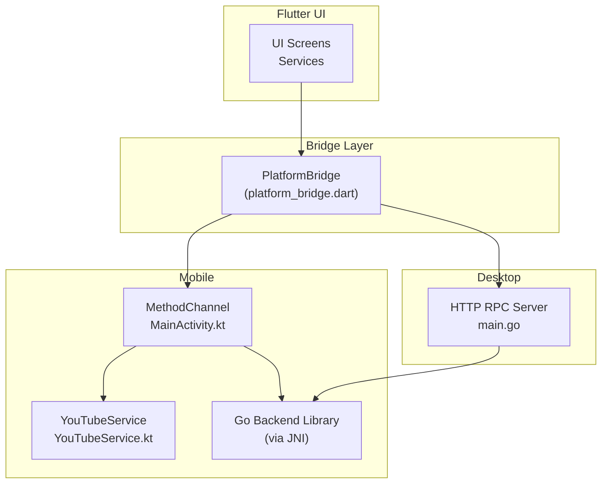
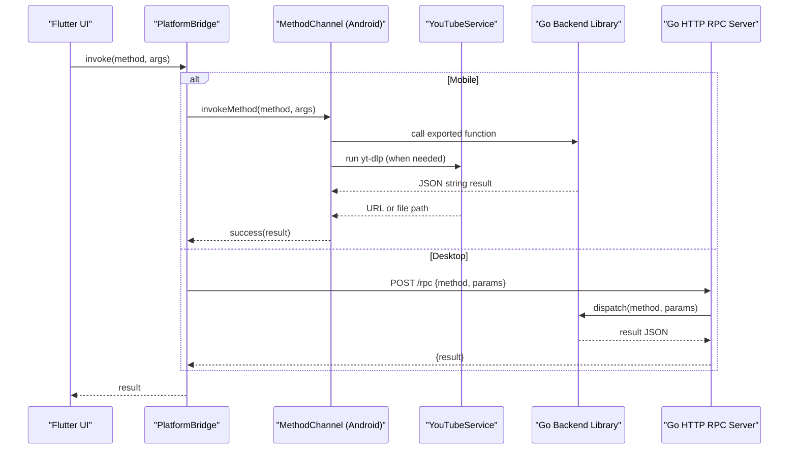
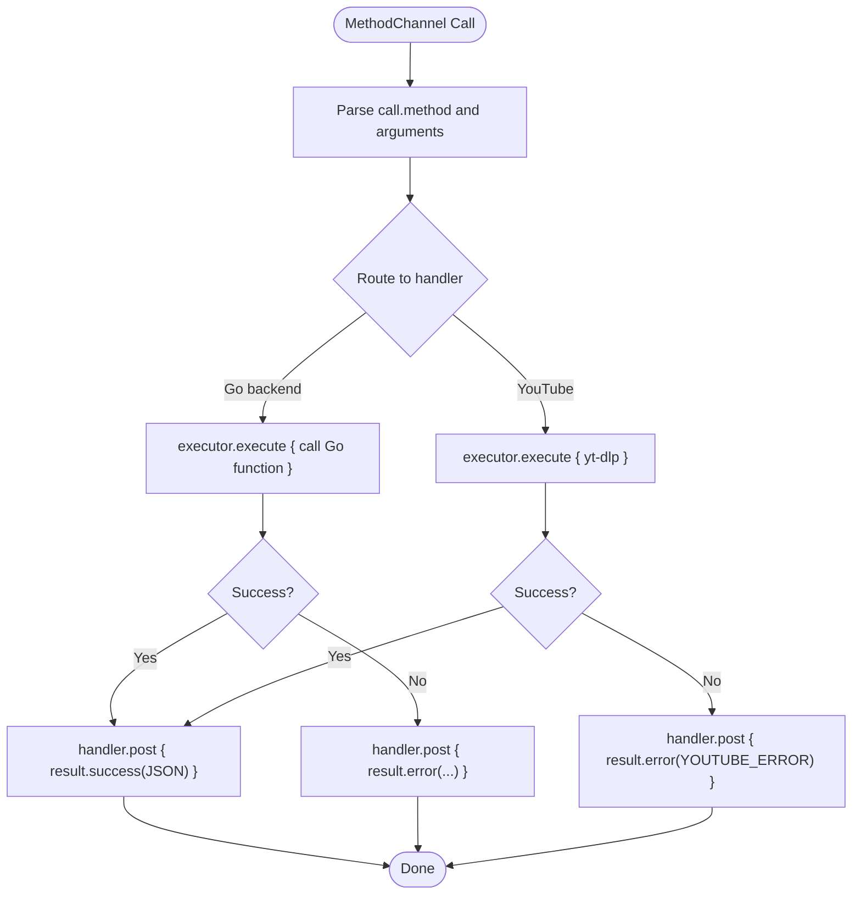
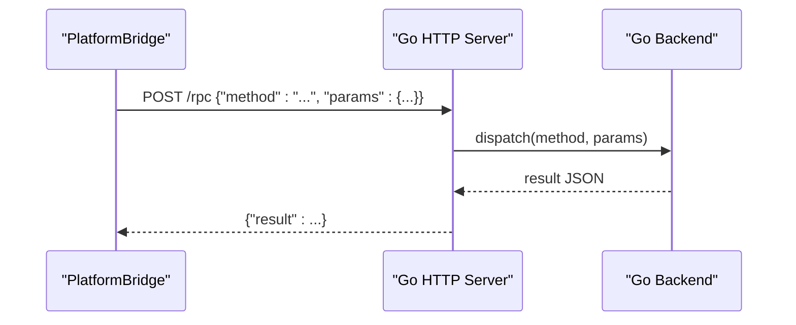
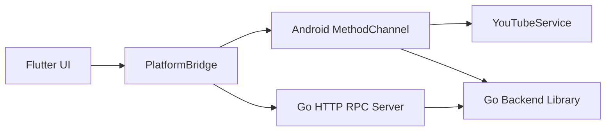

# MethodChannel API

<cite>
**Referenced Files in This Document**
- [MainActivity.kt](file://android/app/src/main/kotlin/com/example/bitly/MainActivity.kt)
- [YouTubeService.kt](file://android/app/src/main/kotlin/com/example/bitly/YouTubeService.kt)
- [platform_bridge.dart](file://lib/services/platform_bridge.dart)
- [main.go](file://go_backend_spotiflac/cmd/server/main.go)
- [AppDelegate.swift](file://ios/Runner/AppDelegate.swift)
- [GeneratedPluginRegistrant.java](file://android/app/src/main/java/io/flutter/plugins/GeneratedPluginRegistrant.java)
- [GeneratedPluginRegistrant.h](file://ios/Runner/GeneratedPluginRegistrant.h)
- [GeneratedPluginRegistrant.m](file://ios/Runner/GeneratedPluginRegistrant.m)
- [GeneratedPluginRegistrant.swift](file://macos/Flutter/GeneratedPluginRegistrant.swift)
</cite>

## Table of Contents
1. [Introduction](#introduction)
2. [Project Structure](#project-structure)
3. [Core Components](#core-components)
4. [Architecture Overview](#architecture-overview)
5. [Detailed Component Analysis](#detailed-component-analysis)
6. [Dependency Analysis](#dependency-analysis)
7. [Performance Considerations](#performance-considerations)
8. [Troubleshooting Guide](#troubleshooting-guide)
9. [Conclusion](#conclusion)

## Introduction
This document describes the MethodChannel-based API used to integrate Flutter UI with native Android/iOS and a Go-backed HTTP service. It covers:
- Platform bridge interface for Android and iOS
- Method signatures, parameter types, and return value formats
- Communication protocol between Flutter UI and the native Go backend via HTTP RPC
- Data serialization, error handling, and asynchronous operation patterns
- Examples of invocation patterns, parameter marshaling, and result processing
- Platform-specific considerations, threading models, and performance optimization techniques

## Project Structure
The integration spans three layers:
- Flutter UI invokes a unified bridge that routes calls to either a native MethodChannel on mobile or an HTTP RPC server on desktop.
- On Android, the MethodChannel routes to a Kotlin bridge that calls into a Go backend library and orchestrates native helpers (e.g., yt-dlp).
- On iOS, Flutter registers plugins; the MethodChannel bridge is configured in the Android layer, while iOS relies on plugin registration and platform-specific capabilities.

**Diagram sources**
- [platform_bridge.dart:44-87](file://lib/services/platform_bridge.dart#L44-L87)
- [MainActivity.kt:15-133](file://android/app/src/main/kotlin/com/example/bitly/MainActivity.kt#L15-L133)
- [YouTubeService.kt:10-92](file://android/app/src/main/kotlin/com/example/bitly/YouTubeService.kt#L10-L92)
- [main.go:107-134](file://go_backend_spotiflac/cmd/server/main.go#L107-L134)

**Section sources**
- [platform_bridge.dart:44-87](file://lib/services/platform_bridge.dart#L44-L87)
- [MainActivity.kt:15-133](file://android/app/src/main/kotlin/com/example/bitly/MainActivity.kt#L15-L133)
- [YouTubeService.kt:10-92](file://android/app/src/main/kotlin/com/example/bitly/YouTubeService.kt#L10-L92)
- [main.go:107-134](file://go_backend_spotiflac/cmd/server/main.go#L107-L134)

## Core Components
- PlatformBridge: Unified invocation layer that selects between mobile MethodChannel and desktop HTTP RPC.
- Android MethodChannel: Bridges Flutter calls to native Kotlin handlers and Go backend library.
- YouTubeService: Executes yt-dlp commands for YouTube search and download.
- Go HTTP RPC Server: Exposes a JSON-RPC-like endpoint for desktop and mobile HTTP fallback.

Key responsibilities:
- Parameter marshaling: Arguments passed as JSON strings or structured maps.
- Asynchronous execution: Background threads for long-running tasks; main thread updates for results.
- Error propagation: Structured error responses and exceptions surfaced to Flutter.

**Section sources**
- [platform_bridge.dart:44-87](file://lib/services/platform_bridge.dart#L44-L87)
- [MainActivity.kt:15-133](file://android/app/src/main/kotlin/com/example/bitly/MainActivity.kt#L15-L133)
- [YouTubeService.kt:10-92](file://android/app/src/main/kotlin/com/example/bitly/YouTubeService.kt#L10-L92)
- [main.go:349-385](file://go_backend_spotiflac/cmd/server/main.go#L349-L385)

## Architecture Overview
The Flutter UI invokes a method via the bridge. On mobile, the MethodChannel routes to Kotlin handlers that call into the Go backend library and/or native helpers. On desktop, the bridge posts JSON-RPC requests to the Go HTTP server.

**Diagram sources**
- [platform_bridge.dart:44-87](file://lib/services/platform_bridge.dart#L44-L87)
- [MainActivity.kt:26-133](file://android/app/src/main/kotlin/com/example/bitly/MainActivity.kt#L26-L133)
- [YouTubeService.kt:12-52](file://android/app/src/main/kotlin/com/example/bitly/YouTubeService.kt#L12-L52)
- [main.go:359-385](file://go_backend_spotiflac/cmd/server/main.go#L359-L385)

## Detailed Component Analysis

### Android MethodChannel Bridge
The Android activity sets up a MethodChannel with a fixed channel name and a method call handler. It delegates to a single-threaded executor for background work and posts results back to the main thread. Some methods call into the Go backend library; others call native helpers (yt-dlp).

- Channel name: com.zarz.spotiflac/backend
- Executor model: Single-threaded executor for serializing backend calls; main thread handler for result delivery.
- Supported methods include initialization, extension management, search, YouTube operations, history/collections queries, lyrics configuration, network compatibility, and SAF storage selection.

Parameter types and patterns:
- String arguments: Passed as-is or wrapped in a request map.
- Boolean and numeric arguments: Converted from call arguments to backend expectations.
- JSON strings: Passed as request bodies to backend functions.

Error handling:
- Exceptions caught during backend calls are reported as BACKEND_ERROR with message details.
- YouTube operations return YOUTUBE_ERROR with specific messages when no results or failures occur.

Asynchronous patterns:
- Long-running operations (downloads, searches) run on background threads; results posted to main thread via Handler.

**Diagram sources**
- [MainActivity.kt:26-145](file://android/app/src/main/kotlin/com/example/bitly/MainActivity.kt#L26-L145)

**Section sources**
- [MainActivity.kt:15-133](file://android/app/src/main/kotlin/com/example/bitly/MainActivity.kt#L15-L133)
- [MainActivity.kt:135-145](file://android/app/src/main/kotlin/com/example/bitly/MainActivity.kt#L135-L145)

### YouTubeService (yt-dlp)
The service runs yt-dlp commands to search for videos and download them. It captures stdout/stderr, checks exit codes, and returns URLs or file paths.

- Search: Returns the first discovered HTTP URL from yt-dlp output.
- Download: Uses a template output path and returns the absolute path of the downloaded file if successful.
- Error handling: Logs errors and returns null on failure.

Threading model:
- Executed on the background executor; results posted to main thread.

**Section sources**
- [YouTubeService.kt:10-92](file://android/app/src/main/kotlin/com/example/bitly/YouTubeService.kt#L10-L92)

### PlatformBridge (Unified Invocation)
The bridge abstracts platform differences:
- Mobile: Uses MethodChannel to invoke native methods.
- Desktop: Switches to HTTP RPC mode and posts JSON-RPC requests to the Go server.

Invocation logic:
- If using HTTP backend, encode method and params into a JSON body and POST to /rpc.
- Otherwise, route to the mobile MethodChannel.

Error handling:
- HTTP RPC: Throws on non-200 responses or when the response contains an error field.
- Mobile: Converts exceptions to structured error responses.

**Section sources**
- [platform_bridge.dart:44-87](file://lib/services/platform_bridge.dart#L44-L87)

### Go HTTP RPC Server
The Go server exposes a small HTTP API:
- Root: Returns service metadata.
- /rpc: JSON-RPC-like endpoint accepting POST with method and params; returns {result} or {error}.
- /buscar: Query-based search with pagination.
- /play/:key and /dl/:path: Playback and download endpoints for pre-fetched content.

Dispatch logic:
- The server parses the incoming JSON and dispatches to backend functions by method name.
- Many methods accept structured JSON strings or typed parameters and return JSON strings or booleans.

**Diagram sources**
- [main.go:359-385](file://go_backend_spotiflac/cmd/server/main.go#L359-L385)
- [main.go:555-1454](file://go_backend_spotiflac/cmd/server/main.go#L555-L1454)

**Section sources**
- [main.go:107-134](file://go_backend_spotiflac/cmd/server/main.go#L107-L134)
- [main.go:288-295](file://go_backend_spotiflac/cmd/server/main.go#L288-L295)
- [main.go:297-347](file://go_backend_spotiflac/cmd/server/main.go#L297-L347)
- [main.go:359-385](file://go_backend_spotiflac/cmd/server/main.go#L359-L385)
- [main.go:555-1454](file://go_backend_spotiflac/cmd/server/main.go#L555-L1454)

### iOS Integration Notes
- The iOS AppDelegate registers plugins and does not set up a MethodChannel bridge in the analyzed files.
- Plugin registration is handled via GeneratedPluginRegistrant files for iOS and macOS.

**Section sources**
- [AppDelegate.swift:1-14](file://ios/Runner/AppDelegate.swift#L1-L14)
- [GeneratedPluginRegistrant.h:14-16](file://ios/Runner/GeneratedPluginRegistrant.h#L14-L16)
- [GeneratedPluginRegistrant.m:119-138](file://ios/Runner/GeneratedPluginRegistrant.m#L119-L138)
- [GeneratedPluginRegistrant.swift:25-42](file://macos/Flutter/GeneratedPluginRegistrant.swift#L25-L42)

## Dependency Analysis
- Flutter UI depends on PlatformBridge for all native interactions.
- Android MethodChannel depends on:
  - MainActivity for routing and execution
  - YouTubeService for yt-dlp operations
  - Go backend library via JNI
- Desktop depends on the Go HTTP RPC server for native functionality.

**Diagram sources**
- [platform_bridge.dart:44-87](file://lib/services/platform_bridge.dart#L44-L87)
- [MainActivity.kt:15-133](file://android/app/src/main/kotlin/com/example/bitly/MainActivity.kt#L15-L133)
- [YouTubeService.kt:10-92](file://android/app/src/main/kotlin/com/example/bitly/YouTubeService.kt#L10-L92)
- [main.go:107-134](file://go_backend_spotiflac/cmd/server/main.go#L107-L134)

**Section sources**
- [platform_bridge.dart:44-87](file://lib/services/platform_bridge.dart#L44-L87)
- [MainActivity.kt:15-133](file://android/app/src/main/kotlin/com/example/bitly/MainActivity.kt#L15-L133)
- [YouTubeService.kt:10-92](file://android/app/src/main/kotlin/com/example/bitly/YouTubeService.kt#L10-L92)
- [main.go:107-134](file://go_backend_spotiflac/cmd/server/main.go#L107-L134)

## Performance Considerations
- Threading:
  - Android: Use a single-threaded executor for serialized backend calls; post results on the main thread to update UI safely.
  - iOS/macOS: Rely on plugin threading; ensure UI updates are dispatched to the main thread.
- HTTP RPC timeouts: The bridge enforces a 60-second timeout for RPC calls.
- JSON parsing: Prefer passing JSON strings for complex payloads; parse on the backend to reduce marshaling overhead.
- Background downloads: Offload heavy operations (yt-dlp, downloads) to background threads; return minimal identifiers to Flutter until completion.
- Caching: Reuse results where possible (e.g., extension store, provider metadata) to minimize repeated network calls.

[No sources needed since this section provides general guidance]

## Troubleshooting Guide
Common issues and resolutions:
- Method not implemented on Android:
  - Symptom: notImplemented responses.
  - Resolution: Verify the method name matches the handler in MainActivity.
- BACKEND_ERROR on Android:
  - Symptom: Error responses with a message.
  - Resolution: Check the backend function availability and argument types; ensure JSON strings are well-formed.
- YOUTUBE_ERROR:
  - Symptom: No video found or download failed.
  - Resolution: Confirm yt-dlp availability and permissions; verify output path existence.
- HTTP RPC failures:
  - Symptom: Non-200 responses or error fields in JSON.
  - Resolution: Inspect server logs and method dispatch; ensure method names and parameters match backend expectations.

**Section sources**
- [MainActivity.kt:135-145](file://android/app/src/main/kotlin/com/example/bitly/MainActivity.kt#L135-L145)
- [YouTubeService.kt:54-90](file://android/app/src/main/kotlin/com/example/bitly/YouTubeService.kt#L54-L90)
- [platform_bridge.dart:55-81](file://lib/services/platform_bridge.dart#L55-L81)

## Conclusion
The MethodChannel API provides a clean abstraction for Flutter-native communication across platforms. On Android, the bridge routes calls to Kotlin handlers and the Go backend, with yt-dlp for YouTube operations. On desktop, the bridge switches to HTTP RPC against the Go server. Proper parameter marshaling, asynchronous execution, and robust error handling ensure reliable integration. Adopt the recommended threading and performance practices to maintain responsiveness and reliability.