# Architecture

<cite>
**Referenced Files in This Document**
- [lib/main.dart](file://lib/main.dart)
- [lib/app.dart](file://lib/app.dart)
- [lib/services/platform_bridge.dart](file://lib/services/platform_bridge.dart)
- [lib/providers/extension_provider.dart](file://lib/providers/extension_provider.dart)
- [android/app/src/main/kotlin/com/example/bitly/MainActivity.kt](file://android/app/src/main/kotlin/com/example/bitly/MainActivity.kt)
- [android/app/src/main/kotlin/com/example/bitly/YouTubeService.kt](file://android/app/src/main/kotlin/com/example/bitly/YouTubeService.kt)
- [android/app/build.gradle.kts](file://android/app/build.gradle.kts)
- [ios/Runner/AppDelegate.swift](file://ios/Runner/AppDelegate.swift)
- [ios/Runner/Info.plist](file://ios/Runner/Info.plist)
- [go_backend_spotiflac/cmd/server/main.go](file://go_backend_spotiflac/cmd/server/main.go)
- [go_backend_spotiflac/extension_manager.go](file://go_backend_spotiflac/extension_manager.go)
- [go_backend_spotiflac/extension_runtime.go](file://go_backend_spotiflac/extension_runtime.go)
- [go_backend_spotiflac/mobile_deps.go](file://go_backend_spotiflac/mobile_deps.go)
- [pubspec.yaml](file://pubspec.yaml)
</cite>

## Table of Contents
1. [Introduction](#introduction)
2. [Project Structure](#project-structure)
3. [Core Components](#core-components)
4. [Architecture Overview](#architecture-overview)
5. [Detailed Component Analysis](#detailed-component-analysis)
6. [Dependency Analysis](#dependency-analysis)
7. [Performance Considerations](#performance-considerations)
8. [Troubleshooting Guide](#troubleshooting-guide)
9. [Conclusion](#conclusion)
10. [Appendices](#appendices)

## Introduction
This document describes the hybrid Flutter-Go architecture of Bitly. The system separates a Flutter-based cross-platform UI from a Go-based backend responsible for heavy audio processing, metadata enrichment, lyrics, extension management, and platform-specific integrations. Communication between Flutter and Go is achieved via two pathways:
- Mobile (Android/iOS): Flutter MethodChannel bridging to native Android and iOS code, which invokes Go-provided APIs.
- Desktop (Windows/Linux/macOS): An embedded HTTP RPC server hosted by the Go backend, accessed by Flutter over localhost.

The architecture emphasizes:
- Using Flutter for UI, navigation, state management, and cross-platform abstraction.
- Using Go for CPU-intensive tasks (audio processing, downloads, metadata), extension runtime, and platform-native integrations.

## Project Structure
High-level layout:
- Flutter application under lib/, with entry point main.dart and app shell in app.dart.
- Android and iOS native integration under android/ and ios/.
- Go backend under go_backend_spotiflac/, exposing HTTP RPC and managing extensions.
- Dependencies declared in pubspec.yaml.

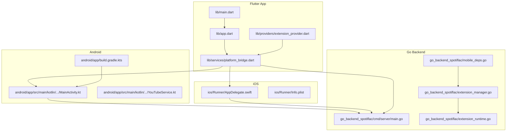

**Diagram sources**
- [lib/main.dart:22-44](file://lib/main.dart#L22-L44)
- [lib/app.dart:13-52](file://lib/app.dart#L13-L52)
- [lib/services/platform_bridge.dart:44-87](file://lib/services/platform_bridge.dart#L44-L87)
- [android/app/src/main/kotlin/com/example/bitly/MainActivity.kt:23-134](file://android/app/src/main/kotlin/com/example/bitly/MainActivity.kt#L23-L134)
- [android/app/src/main/kotlin/com/example/bitly/YouTubeService.kt:10-92](file://android/app/src/main/kotlin/com/example/bitly/YouTubeService.kt#L10-L92)
- [android/app/build.gradle.kts:47-50](file://android/app/build.gradle.kts#L47-L50)
- [ios/Runner/AppDelegate.swift:4-12](file://ios/Runner/AppDelegate.swift#L4-L12)
- [ios/Runner/Info.plist:1-50](file://ios/Runner/Info.plist#L1-L50)
- [go_backend_spotiflac/cmd/server/main.go:107-134](file://go_backend_spotiflac/cmd/server/main.go#L107-L134)
- [go_backend_spotiflac/extension_manager.go:120-156](file://go_backend_spotiflac/extension_manager.go#L120-L156)
- [go_backend_spotiflac/extension_runtime.go:84-147](file://go_backend_spotiflac/extension_runtime.go#L84-L147)
- [go_backend_spotiflac/mobile_deps.go:1-8](file://go_backend_spotiflac/mobile_deps.go#L1-L8)

**Section sources**
- [lib/main.dart:22-44](file://lib/main.dart#L22-L44)
- [lib/app.dart:13-52](file://lib/app.dart#L13-L52)
- [android/app/build.gradle.kts:47-50](file://android/app/build.gradle.kts#L47-L50)
- [ios/Runner/Info.plist:1-50](file://ios/Runner/Info.plist#L1-L50)
- [go_backend_spotiflac/cmd/server/main.go:107-134](file://go_backend_spotiflac/cmd/server/main.go#L107-L134)

## Core Components
- Flutter entrypoint initializes platform-specific runtime behavior and app shell.
- PlatformBridge abstracts invocation to either HTTP RPC (desktop) or MethodChannel (mobile).
- Android/iOS MethodChannel handlers forward requests to Go-backed APIs.
- Go backend exposes HTTP RPC endpoints and manages extensions via a JavaScript VM runtime.
- Extension system supports discovery, loading, enabling/disabling, and lifecycle management.

**Section sources**
- [lib/main.dart:22-44](file://lib/main.dart#L22-L44)
- [lib/services/platform_bridge.dart:44-87](file://lib/services/platform_bridge.dart#L44-L87)
- [android/app/src/main/kotlin/com/example/bitly/MainActivity.kt:27-134](file://android/app/src/main/kotlin/com/example/bitly/MainActivity.kt#L27-L134)
- [go_backend_spotiflac/cmd/server/main.go:107-134](file://go_backend_spotiflac/cmd/server/main.go#L107-L134)
- [go_backend_spotiflac/extension_manager.go:120-156](file://go_backend_spotiflac/extension_manager.go#L120-L156)

## Architecture Overview
The system uses a hybrid model:
- Flutter UI handles routing, state, and user interactions.
- On mobile, Flutter communicates with Go via MethodChannel through native Android/iOS code.
- On desktop, Flutter communicates with Go via an embedded HTTP RPC server bound to localhost.

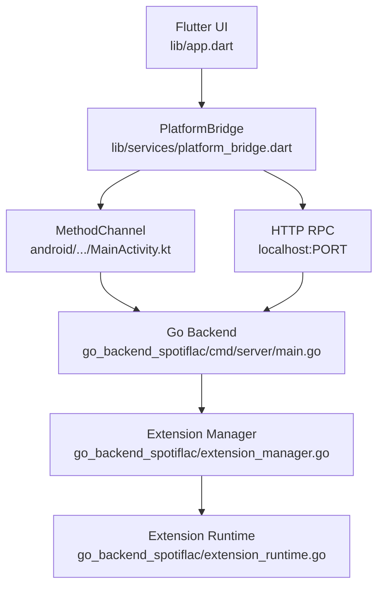

**Diagram sources**
- [lib/app.dart:54-97](file://lib/app.dart#L54-L97)
- [lib/services/platform_bridge.dart:44-87](file://lib/services/platform_bridge.dart#L44-L87)
- [android/app/src/main/kotlin/com/example/bitly/MainActivity.kt:27-134](file://android/app/src/main/kotlin/com/example/bitly/MainActivity.kt#L27-L134)
- [go_backend_spotiflac/cmd/server/main.go:107-134](file://go_backend_spotiflac/cmd/server/main.go#L107-L134)
- [go_backend_spotiflac/extension_manager.go:120-156](file://go_backend_spotiflac/extension_manager.go#L120-L156)
- [go_backend_spotiflac/extension_runtime.go:84-147](file://go_backend_spotiflac/extension_runtime.go#L84-L147)

## Detailed Component Analysis

### Flutter Entry and Initialization
- The app initializes platform-specific services, sets up Riverpod providers, and configures image caching.
- Desktop initialization triggers HTTP backend activation; mobile uses MethodChannel.

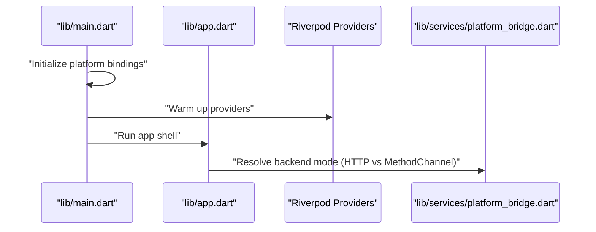

**Diagram sources**
- [lib/main.dart:22-44](file://lib/main.dart#L22-L44)
- [lib/app.dart:13-52](file://lib/app.dart#L13-L52)
- [lib/services/platform_bridge.dart:83-87](file://lib/services/platform_bridge.dart#L83-L87)

**Section sources**
- [lib/main.dart:22-44](file://lib/main.dart#L22-L44)
- [lib/app.dart:13-52](file://lib/app.dart#L13-L52)

### Platform Bridge: Invocation Path
- PlatformBridge selects HTTP RPC for desktop and MethodChannel for mobile.
- HTTP RPC sends JSON-RPC over localhost with a configurable port.

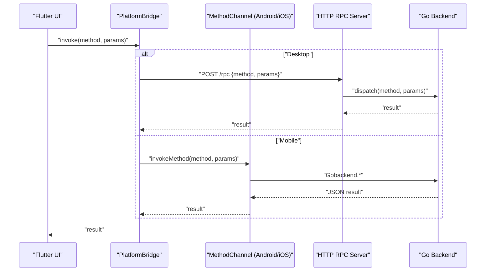

**Diagram sources**
- [lib/services/platform_bridge.dart:44-87](file://lib/services/platform_bridge.dart#L44-L87)
- [android/app/src/main/kotlin/com/example/bitly/MainActivity.kt:27-134](file://android/app/src/main/kotlin/com/example/bitly/MainActivity.kt#L27-L134)
- [go_backend_spotiflac/cmd/server/main.go:359-385](file://go_backend_spotiflac/cmd/server/main.go#L359-L385)

**Section sources**
- [lib/services/platform_bridge.dart:44-87](file://lib/services/platform_bridge.dart#L44-L87)

### Android MethodChannel Integration
- MainActivity registers a MethodChannel and forwards calls to Go-backed APIs.
- Includes SAF tree picker and yt-dlp orchestration for YouTube.

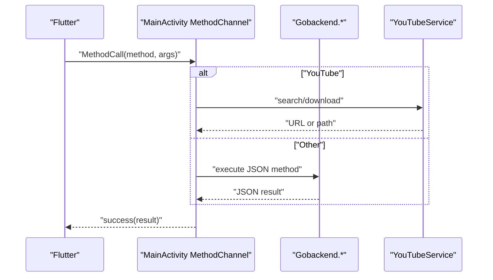

**Diagram sources**
- [android/app/src/main/kotlin/com/example/bitly/MainActivity.kt:27-134](file://android/app/src/main/kotlin/com/example/bitly/MainActivity.kt#L27-L134)
- [android/app/src/main/kotlin/com/example/bitly/YouTubeService.kt:12-52](file://android/app/src/main/kotlin/com/example/bitly/YouTubeService.kt#L12-L52)

**Section sources**
- [android/app/src/main/kotlin/com/example/bitly/MainActivity.kt:27-134](file://android/app/src/main/kotlin/com/example/bitly/MainActivity.kt#L27-L134)
- [android/app/src/main/kotlin/com/example/bitly/YouTubeService.kt:12-52](file://android/app/src/main/kotlin/com/example/bitly/YouTubeService.kt#L12-L52)

### iOS Integration
- AppDelegate registers plugins; iOS relies on the same MethodChannel pathway to reach Go.

**Section sources**
- [ios/Runner/AppDelegate.swift:4-12](file://ios/Runner/AppDelegate.swift#L4-L12)

### Go Backend HTTP RPC Server
- Embedded HTTP server exposes endpoints for search, download, and RPC dispatch.
- Maintains in-memory session state for streaming and downloads.

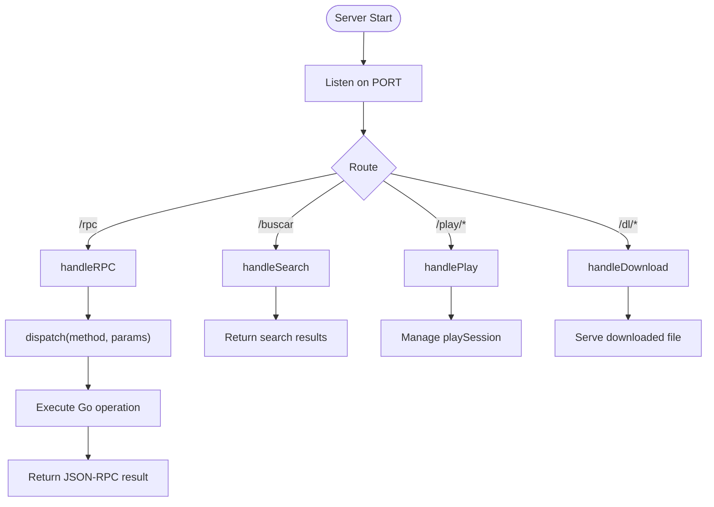

**Diagram sources**
- [go_backend_spotiflac/cmd/server/main.go:107-134](file://go_backend_spotiflac/cmd/server/main.go#L107-L134)
- [go_backend_spotiflac/cmd/server/main.go:359-385](file://go_backend_spotiflac/cmd/server/main.go#L359-L385)
- [go_backend_spotiflac/cmd/server/main.go:288-347](file://go_backend_spotiflac/cmd/server/main.go#L288-L347)
- [go_backend_spotiflac/cmd/server/main.go:136-286](file://go_backend_spotiflac/cmd/server/main.go#L136-L286)

**Section sources**
- [go_backend_spotiflac/cmd/server/main.go:107-134](file://go_backend_spotiflac/cmd/server/main.go#L107-L134)
- [go_backend_spotiflac/cmd/server/main.go:359-385](file://go_backend_spotiflac/cmd/server/main.go#L359-L385)

### Extension System
- Extension manager loads/unloads extensions, validates manifests, and orchestrates runtime.
- Extension runtime provides isolated JS VM, HTTP clients, storage, and auth state.

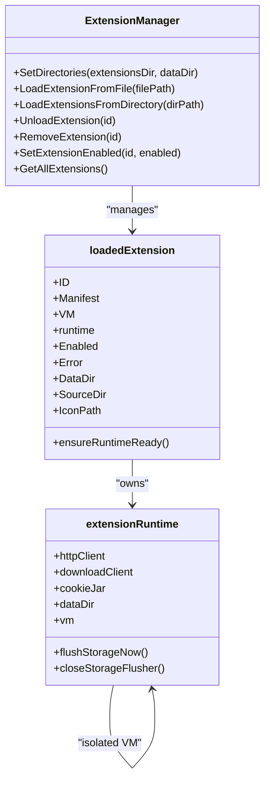

**Diagram sources**
- [go_backend_spotiflac/extension_manager.go:120-156](file://go_backend_spotiflac/extension_manager.go#L120-L156)
- [go_backend_spotiflac/extension_manager.go:47-59](file://go_backend_spotiflac/extension_manager.go#L47-L59)
- [go_backend_spotiflac/extension_runtime.go:84-147](file://go_backend_spotiflac/extension_runtime.go#L84-L147)

**Section sources**
- [go_backend_spotiflac/extension_manager.go:120-156](file://go_backend_spotiflac/extension_manager.go#L120-L156)
- [go_backend_spotiflac/extension_runtime.go:84-147](file://go_backend_spotiflac/extension_runtime.go#L84-L147)

### Extension Lifecycle and Authentication
- Extensions can expose capabilities, settings, and health checks.
- Authentication state is tracked per extension with pending auth URLs and token exchange.

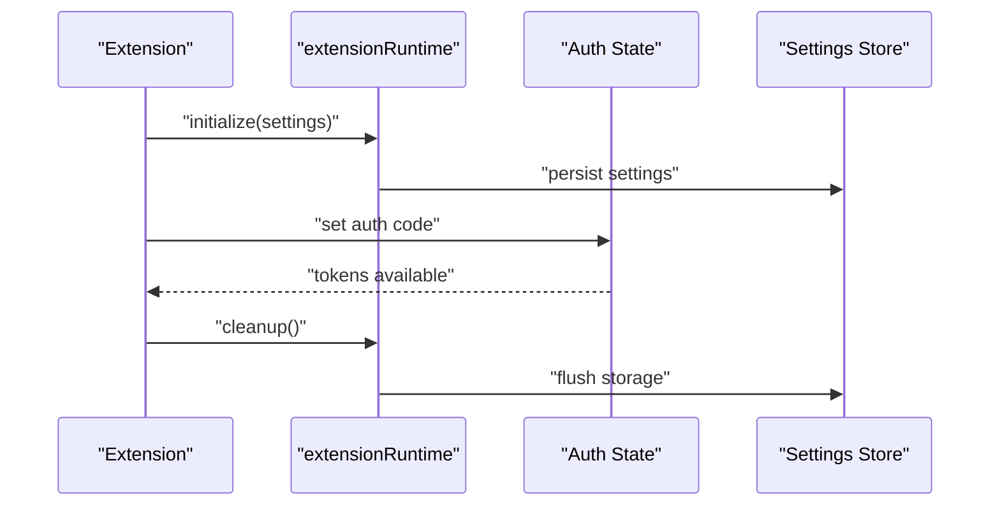

**Diagram sources**
- [go_backend_spotiflac/extension_runtime.go:69-82](file://go_backend_spotiflac/extension_runtime.go#L69-L82)
- [go_backend_spotiflac/extension_manager.go:470-487](file://go_backend_spotiflac/extension_manager.go#L470-L487)

**Section sources**
- [go_backend_spotiflac/extension_runtime.go:69-82](file://go_backend_spotiflac/extension_runtime.go#L69-L82)
- [go_backend_spotiflac/extension_manager.go:470-487](file://go_backend_spotiflac/extension_manager.go#L470-L487)

### Android YouTube Integration
- Uses yt-dlp via a native Kotlin service to search and download videos.

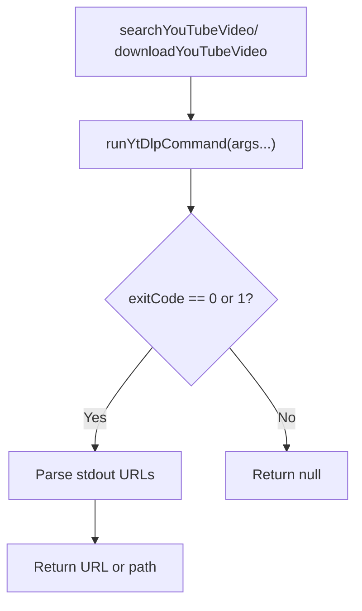

**Diagram sources**
- [android/app/src/main/kotlin/com/example/bitly/YouTubeService.kt:54-90](file://android/app/src/main/kotlin/com/example/bitly/YouTubeService.kt#L54-L90)

**Section sources**
- [android/app/src/main/kotlin/com/example/bitly/YouTubeService.kt:12-52](file://android/app/src/main/kotlin/com/example/bitly/YouTubeService.kt#L12-L52)

## Dependency Analysis
- Flutter depends on Riverpod, localization, media players, and platform bridges.
- Android build integrates a prebuilt AAR for Go-backed APIs.
- iOS relies on plugin registration and MethodChannel.

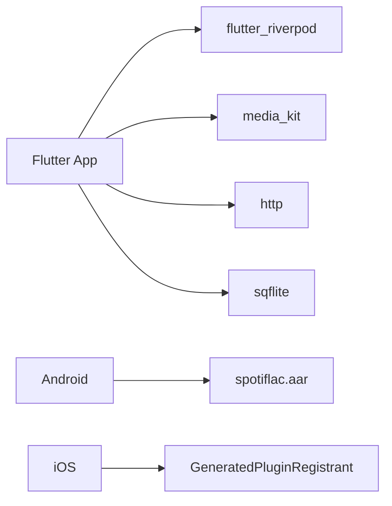

**Diagram sources**
- [pubspec.yaml:9-71](file://pubspec.yaml#L9-L71)
- [android/app/build.gradle.kts:47-50](file://android/app/build.gradle.kts#L47-L50)
- [ios/Runner/AppDelegate.swift:10-12](file://ios/Runner/AppDelegate.swift#L10-L12)

**Section sources**
- [pubspec.yaml:9-71](file://pubspec.yaml#L9-L71)
- [android/app/build.gradle.kts:47-50](file://android/app/build.gradle.kts#L47-L50)
- [ios/Runner/AppDelegate.swift:10-12](file://ios/Runner/AppDelegate.swift#L10-L12)

## Performance Considerations
- Image caching is tuned per-device to reduce memory pressure on low-RAM devices.
- HTTP RPC timeouts and Go-side extension timeouts are configured to balance responsiveness and reliability.
- Extension runtime isolates JS execution and defers storage writes to minimize overhead.
- Desktop backend uses an in-process HTTP server; ensure firewall and loopback routing are configured.

[No sources needed since this section provides general guidance]

## Troubleshooting Guide
Common issues and diagnostics:
- HTTP RPC failures: Verify backend port binding and network access on desktop.
- MethodChannel errors: Confirm channel registration and JSON serialization on Android/iOS.
- Extension load failures: Check manifest validity, presence of index.js, and storage permissions.
- yt-dlp availability: Ensure yt-dlp is installed or auto-installed on Android; verify PATH on desktop.

**Section sources**
- [lib/services/platform_bridge.dart:55-81](file://lib/services/platform_bridge.dart#L55-L81)
- [android/app/src/main/kotlin/com/example/bitly/MainActivity.kt:136-146](file://android/app/src/main/kotlin/com/example/bitly/MainActivity.kt#L136-L146)
- [go_backend_spotiflac/extension_manager.go:158-294](file://go_backend_spotiflac/extension_manager.go#L158-L294)
- [android/app/src/main/kotlin/com/example/bitly/YouTubeService.kt:54-90](file://android/app/src/main/kotlin/com/example/bitly/YouTubeService.kt#L54-L90)

## Conclusion
Bitly’s hybrid architecture leverages Flutter for a cohesive cross-platform UI while delegating compute-intensive work to a Go backend. The platform bridge cleanly abstracts mobile versus desktop integration, and the extension system enables modular, sandboxed functionality. This separation improves maintainability, scalability, and platform-specific optimization.

[No sources needed since this section summarizes without analyzing specific files]

## Appendices

### Deployment Topology
- Desktop: Flutter app runs alongside an embedded HTTP RPC server on localhost.
- Mobile: Flutter app communicates with Go via MethodChannel through native Android/iOS code.

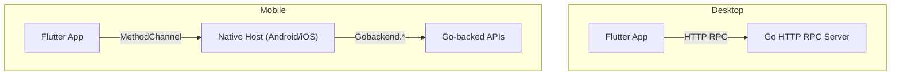

**Diagram sources**
- [lib/services/platform_bridge.dart:44-87](file://lib/services/platform_bridge.dart#L44-L87)
- [android/app/src/main/kotlin/com/example/bitly/MainActivity.kt:27-134](file://android/app/src/main/kotlin/com/example/bitly/MainActivity.kt#L27-L134)
- [go_backend_spotiflac/cmd/server/main.go:107-134](file://go_backend_spotiflac/cmd/server/main.go#L107-L134)

### Security Notes
- HTTP RPC server binds to localhost; ensure OS firewall rules restrict external access.
- Extension runtime maintains isolated storage and cookie jars; avoid exposing internal APIs.
- Authentication tokens are stored per extension; secure storage and token rotation should be enforced by extensions.

[No sources needed since this section provides general guidance]