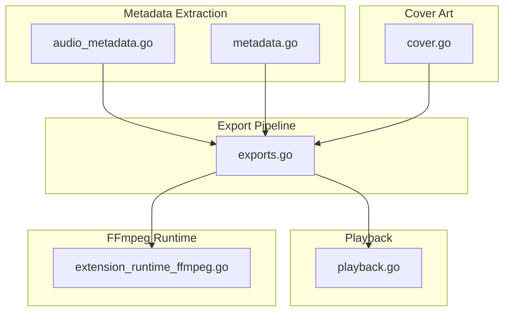
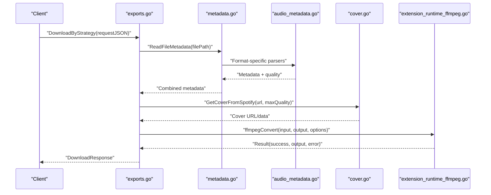
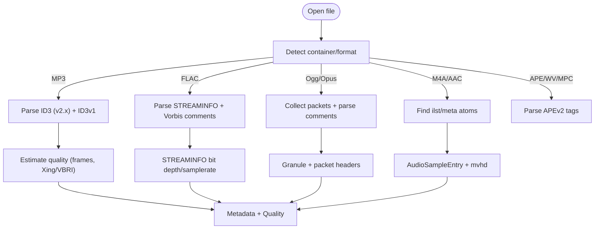
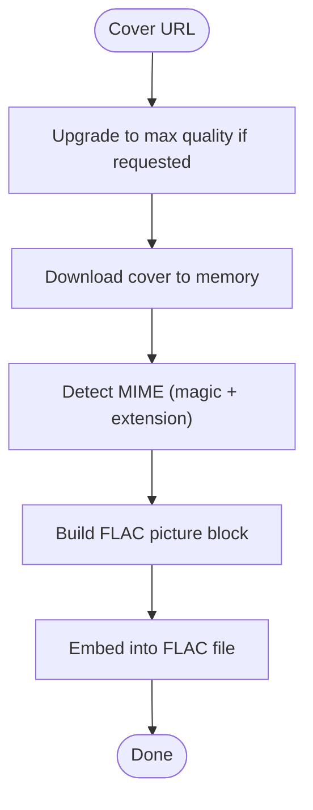
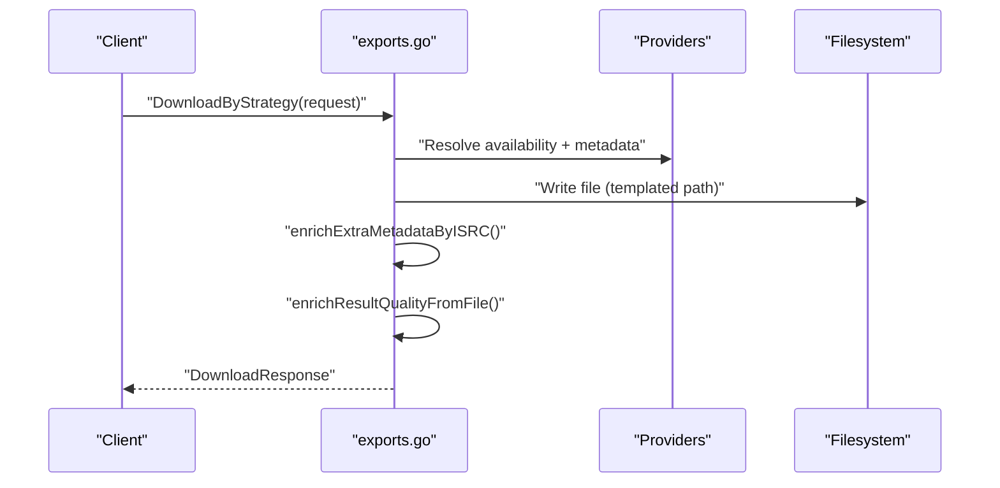
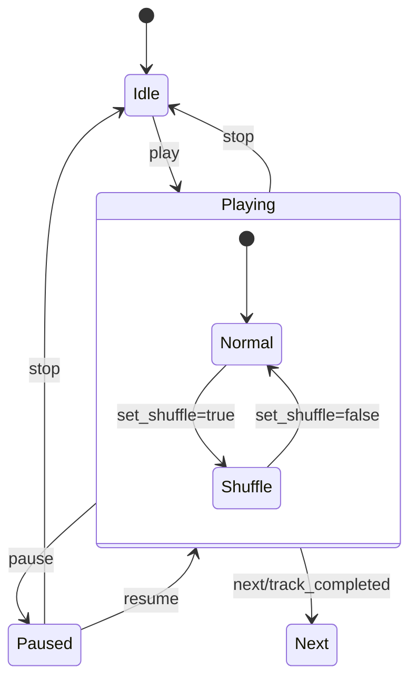
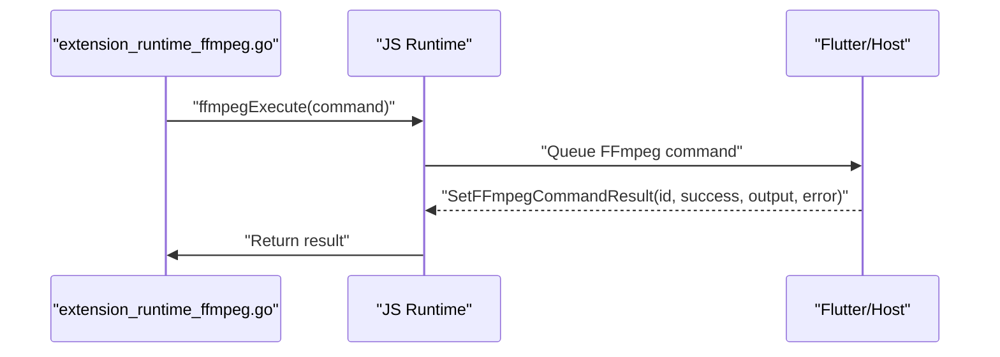
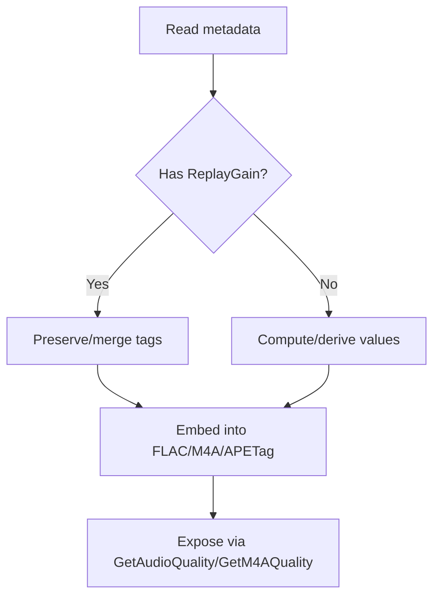
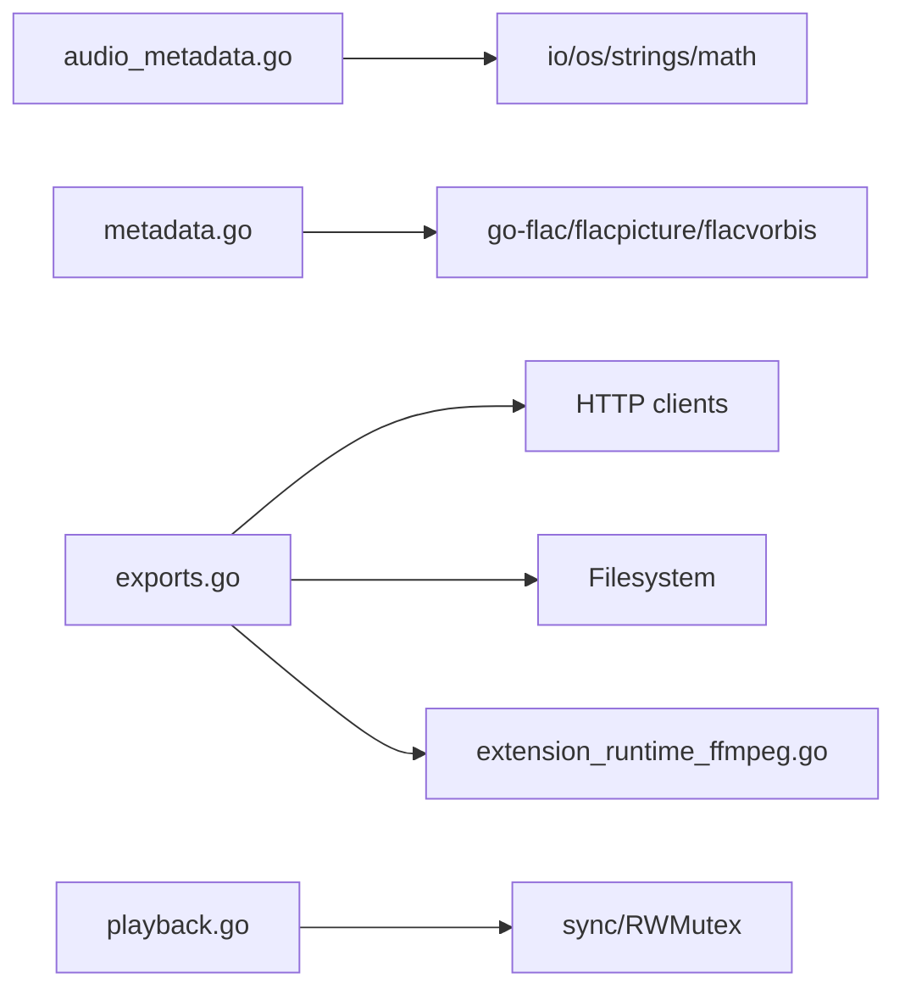

# Audio Processing Engine

<cite>
**Referenced Files in This Document**
- [audio_metadata.go](file://go_backend_spotiflac/audio_metadata.go)
- [metadata.go](file://go_backend_spotiflac/metadata.go)
- [exports.go](file://go_backend_spotiflac/exports.go)
- [playback.go](file://go_backend_spotiflac/playback.go)
- [extension_runtime_ffmpeg.go](file://go_backend_spotiflac/extension_runtime_ffmpeg.go)
- [cover.go](file://go_backend_spotiflac/cover.go)
</cite>

## Table of Contents
1. [Introduction](#introduction)
2. [Project Structure](#project-structure)
3. [Core Components](#core-components)
4. [Architecture Overview](#architecture-overview)
5. [Detailed Component Analysis](#detailed-component-analysis)
6. [Dependency Analysis](#dependency-analysis)
7. [Performance Considerations](#performance-considerations)
8. [Troubleshooting Guide](#troubleshooting-guide)
9. [Conclusion](#conclusion)
10. [Appendices](#appendices)

## Introduction
This document describes the audio processing engine responsible for extracting audio metadata, processing cover art, orchestrating export and format conversion, integrating playback sessions, and leveraging FFmpeg for advanced audio operations. It covers supported formats, quality analysis, ReplayGain handling, and practical workflows for real-world usage.

## Project Structure
The engine is implemented primarily in the Go backend module under go_backend_spotiflac. Key areas:
- Metadata extraction and format detection for MP3, FLAC, Ogg/Opus, AAC/M4A, APE, WavPack, and Musepack
- Cover art detection and retrieval across providers
- Export orchestration and post-processing (quality probing, metadata enrichment)
- Playback session management for streaming and local playback
- FFmpeg integration for conversion, probing, and batch operations

**Diagram sources**
- [audio_metadata.go:1-1689](file://go_backend_spotiflac/audio_metadata.go#L1-L1689)
- [metadata.go:1-1948](file://go_backend_spotiflac/metadata.go#L1-L1948)
- [exports.go:1-3632](file://go_backend_spotiflac/exports.go#L1-L3632)
- [playback.go:1-443](file://go_backend_spotiflac/playback.go#L1-L443)
- [extension_runtime_ffmpeg.go:1-183](file://go_backend_spotiflac/extension_runtime_ffmpeg.go#L1-L183)
- [cover.go:1-160](file://go_backend_spotiflac/cover.go#L1-L160)

**Section sources**
- [audio_metadata.go:1-1689](file://go_backend_spotiflac/audio_metadata.go#L1-L1689)
- [metadata.go:1-1948](file://go_backend_spotiflac/metadata.go#L1-L1948)
- [exports.go:1-3632](file://go_backend_spotiflac/exports.go#L1-L3632)
- [playback.go:1-443](file://go_backend_spotiflac/playback.go#L1-L443)
- [extension_runtime_ffmpeg.go:1-183](file://go_backend_spotiflac/extension_runtime_ffmpeg.go#L1-L183)
- [cover.go:1-160](file://go_backend_spotiflac/cover.go#L1-L160)

## Core Components
- Metadata extraction and format detection: ID3 (MP3), Vorbis comments (FLAC/Ogg/Opus), iTunes-style tags (M4A/AAC), APEv2 (APE/WV/MPC)
- Quality analysis: bit depth, sample rate, duration, bitrate estimation
- Cover art: embedded extraction, provider-specific upgrades, MIME detection, FLAC picture blocks
- Export pipeline: request routing, metadata enrichment, filename templating, duplicate checks, post-download quality probing
- Playback integration: session state machine, queue management, history, seek/pause/resume
- FFmpeg runtime: command queuing, result polling, info/probe, conversion with codec/bitrate/sample rate/channels options

**Section sources**
- [audio_metadata.go:15-1689](file://go_backend_spotiflac/audio_metadata.go#L15-L1689)
- [metadata.go:104-1948](file://go_backend_spotiflac/metadata.go#L104-L1948)
- [exports.go:158-3632](file://go_backend_spotiflac/exports.go#L158-L3632)
- [playback.go:10-443](file://go_backend_spotiflac/playback.go#L10-L443)
- [extension_runtime_ffmpeg.go:12-183](file://go_backend_spotiflac/extension_runtime_ffmpeg.go#L12-L183)
- [cover.go:11-160](file://go_backend_spotiflac/cover.go#L11-L160)

## Architecture Overview
The engine exposes a cohesive pipeline:
- Input: audio files and requests (download, metadata edit, lyrics, cover)
- Processing: format detection, metadata parsing, quality probing, cover retrieval
- Output: enriched metadata, converted files, playback state, FFmpeg commands

**Diagram sources**
- [exports.go:934-956](file://go_backend_spotiflac/exports.go#L934-L956)
- [metadata.go:988-1230](file://go_backend_spotiflac/metadata.go#L988-L1230)
- [audio_metadata.go:54-1689](file://go_backend_spotiflac/audio_metadata.go#L54-L1689)
- [cover.go:147-160](file://go_backend_spotiflac/cover.go#L147-L160)
- [extension_runtime_ffmpeg.go:137-183](file://go_backend_spotiflac/extension_runtime_ffmpeg.go#L137-L183)

## Detailed Component Analysis

### Metadata Extraction System
- ID3 tag parsing (v2.2, v2.3, v2.4) with unsync removal, grouping flags, and text encoding support
- Vorbis comments for FLAC/Ogg/Opus, including METADATA_BLOCK_PICTURE decoding
- iTunes-style tags for M4A/AAC, including freeform atoms and ReplayGain mapping
- APEv2 tags for APE/WV/MPC with binary cover embedding
- Quality probing for MP3, Ogg/Opus, FLAC, and M4A/AAC

**Diagram sources**
- [audio_metadata.go:54-1689](file://go_backend_spotiflac/audio_metadata.go#L54-L1689)
- [metadata.go:104-1948](file://go_backend_spotiflac/metadata.go#L104-L1948)

**Section sources**
- [audio_metadata.go:54-1689](file://go_backend_spotiflac/audio_metadata.go#L54-L1689)
- [metadata.go:104-1948](file://go_backend_spotiflac/metadata.go#L104-L1948)

### Cover Art Processing
- Provider-specific URL upgrades (Spotify, Deezer, Tidal, Qobuz) to higher resolutions
- MIME detection by magic bytes and extension fallback
- FLAC picture block creation and embedding
- Embedded extraction from MP3 APIC frames and Ogg METADATA_BLOCK_PICTURE

**Diagram sources**
- [cover.go:31-160](file://go_backend_spotiflac/cover.go#L31-L160)
- [metadata.go:74-102](file://go_backend_spotiflac/metadata.go#L74-L102)

**Section sources**
- [cover.go:31-160](file://go_backend_spotiflac/cover.go#L31-L160)
- [metadata.go:74-102](file://go_backend_spotiflac/metadata.go#L74-L102)

### Export Pipeline and File Organization
- Request routing through extension providers or legacy paths
- Metadata enrichment via ISRC-based lookups (Deezer, MusicBrainz)
- Duplicate detection by ISRC and batch scanning
- Filename templating and sanitization
- Post-download quality probing with format-specific readers

**Diagram sources**
- [exports.go:934-956](file://go_backend_spotiflac/exports.go#L934-L956)
- [exports.go:804-826](file://go_backend_spotiflac/exports.go#L804-L826)
- [exports.go:849-895](file://go_backend_spotiflac/exports.go#L849-L895)

**Section sources**
- [exports.go:804-826](file://go_backend_spotiflac/exports.go#L804-L826)
- [exports.go:849-895](file://go_backend_spotiflac/exports.go#L849-L895)
- [exports.go:934-956](file://go_backend_spotiflac/exports.go#L934-L956)

### Playback Integration System
- Centralized playback state with RWMutex for thread-safe updates
- Action-driven state transitions (play, pause, resume, stop, seek, queue ops)
- History tracking (last 50), shuffle/random, repeat modes
- JSON serialization for external consumption

**Diagram sources**
- [playback.go:10-443](file://go_backend_spotiflac/playback.go#L10-L443)

**Section sources**
- [playback.go:10-443](file://go_backend_spotiflac/playback.go#L10-L443)

### FFmpeg Integration
- Command queuing with unique IDs and result polling
- Info/probe via GetAudioQuality and GetM4AQuality
- Conversion with codec, bitrate, sample rate, channels options
- Timeout handling and cleanup

**Diagram sources**
- [extension_runtime_ffmpeg.go:53-108](file://go_backend_spotiflac/extension_runtime_ffmpeg.go#L53-L108)
- [extension_runtime_ffmpeg.go:137-183](file://go_backend_spotiflac/extension_runtime_ffmpeg.go#L137-L183)

**Section sources**
- [extension_runtime_ffmpeg.go:12-183](file://go_backend_spotiflac/extension_runtime_ffmpeg.go#L12-L183)

### Audio Enhancement Features
- ReplayGain: read/write Vorbis comments and iTunes-style tags; build iTunNORM values
- Lyrics: embedded LRC/unsynced lyrics, sidecar .lrc fallback, provider fetch
- Quality analysis: bit depth, sample rate, duration, bitrate for multiple containers

**Diagram sources**
- [metadata.go:1308-1379](file://go_backend_spotiflac/metadata.go#L1308-L1379)
- [metadata.go:1580-1716](file://go_backend_spotiflac/metadata.go#L1580-L1716)
- [audio_metadata.go:323-331](file://go_backend_spotiflac/audio_metadata.go#L323-L331)

**Section sources**
- [metadata.go:1308-1379](file://go_backend_spotiflac/metadata.go#L1308-L1379)
- [metadata.go:1580-1716](file://go_backend_spotiflac/metadata.go#L1580-L1716)
- [audio_metadata.go:323-331](file://go_backend_spotiflac/audio_metadata.go#L323-L331)

## Dependency Analysis
- audio_metadata.go depends on io, math, os, strings for low-level parsing
- metadata.go integrates go-flac libraries for native FLAC editing and picture blocks
- exports.go orchestrates network clients, filesystem operations, and FFmpeg runtime
- playback.go maintains a single global state guarded by mutex
- extension_runtime_ffmpeg.go bridges Go runtime to host-side FFmpeg execution

**Diagram sources**
- [audio_metadata.go:1-1689](file://go_backend_spotiflac/audio_metadata.go#L1-L1689)
- [metadata.go:1-1948](file://go_backend_spotiflac/metadata.go#L1-L1948)
- [exports.go:1-3632](file://go_backend_spotiflac/exports.go#L1-L3632)
- [playback.go:1-443](file://go_backend_spotiflac/playback.go#L1-L443)
- [extension_runtime_ffmpeg.go:1-183](file://go_backend_spotiflac/extension_runtime_ffmpeg.go#L1-L183)

**Section sources**
- [audio_metadata.go:1-1689](file://go_backend_spotiflac/audio_metadata.go#L1-L1689)
- [metadata.go:1-1948](file://go_backend_spotiflac/metadata.go#L1-L1948)
- [exports.go:1-3632](file://go_backend_spotiflac/exports.go#L1-L3632)
- [playback.go:1-443](file://go_backend_spotiflac/playback.go#L1-L443)
- [extension_runtime_ffmpeg.go:1-183](file://go_backend_spotiflac/extension_runtime_ffmpeg.go#L1-L183)

## Performance Considerations
- Streaming reads and minimal allocations: Ogg packet collection limits pages and packet sizes; MP3/Xing/VBRI probing avoids full scans
- Efficient FLAC editing: in-place updates of Vorbis comments and picture blocks
- Memory-conscious cover art: magic-byte detection avoids unnecessary decodes; optional cover embedding only when present
- Concurrency: playback state protected by RWMutex; FFmpeg command polling with bounded timeouts
- Quality probing: selective probing for ephemeral or non-file URIs; fallbacks to network-provided metadata

[No sources needed since this section provides general guidance]

## Troubleshooting Guide
- No ID3 tags found: ID3 tag parsers return explicit errors when headers missing; fall back to filename-based inference or provider APIs
- Unsupported file format: GetAudioQuality and GetM4AQuality return errors for non-FLAC/M4A; ensure container is supported
- FFmpeg command timeout: polling loop enforces a 5-minute timeout; verify host-side FFmpeg availability and permissions
- Cover art not embedded: verify MIME detection and picture block construction; ensure FLAC has correct metadata block indices
- Playback state inconsistencies: ensure actions are sent via SendPlaybackAction; check queue bounds and shuffle logic

**Section sources**
- [audio_metadata.go:54-94](file://go_backend_spotiflac/audio_metadata.go#L54-L94)
- [metadata.go:1587-1650](file://go_backend_spotiflac/metadata.go#L1587-L1650)
- [extension_runtime_ffmpeg.go:75-108](file://go_backend_spotiflac/extension_runtime_ffmpeg.go#L75-L108)
- [playback.go:309-376](file://go_backend_spotiflac/playback.go#L309-L376)

## Conclusion
The audio processing engine provides robust, format-agnostic metadata extraction, high-quality cover art handling, reliable export orchestration, and integrated playback/session management. FFmpeg integration enables flexible conversion and probing, while native FLAC editing ensures precise tag manipulation. The design balances performance, reliability, and extensibility for production-grade audio workflows.

[No sources needed since this section summarizes without analyzing specific files]

## Appendices

### Practical Workflows

- Format conversion scenario
  - Prepare FFmpeg options: codec, bitrate, sample rate, channels
  - Queue command via ffmpegConvert; poll until completion or timeout
  - Verify output via GetAudioQuality

- Metadata embedding process
  - For FLAC: EmbedMetadata or EditFlacFields
  - For M4A: EditM4AReplayGain for ReplayGain; otherwise delegate to FFmpeg
  - For APE/WV/MPC: Write APEv2 tags with merge semantics

- Playback session management
  - Initialize state, enqueue tracks, handle seek/pause/resume
  - Persist JSON snapshots for UI synchronization

**Section sources**
- [extension_runtime_ffmpeg.go:137-183](file://go_backend_spotiflac/extension_runtime_ffmpeg.go#L137-L183)
- [metadata.go:131-240](file://go_backend_spotiflac/metadata.go#L131-L240)
- [metadata.go:1403-1510](file://go_backend_spotiflac/metadata.go#L1403-L1510)
- [playback.go:56-172](file://go_backend_spotiflac/playback.go#L56-L172)