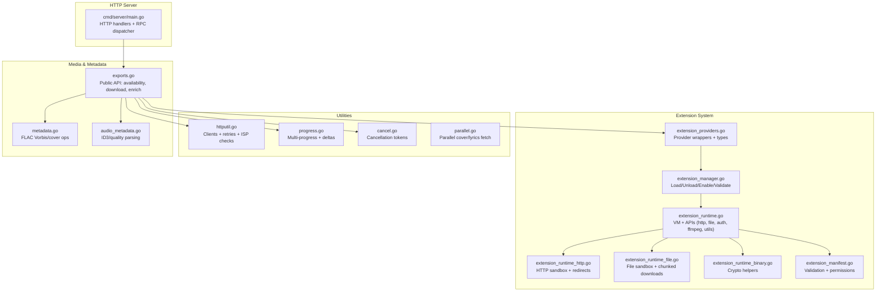
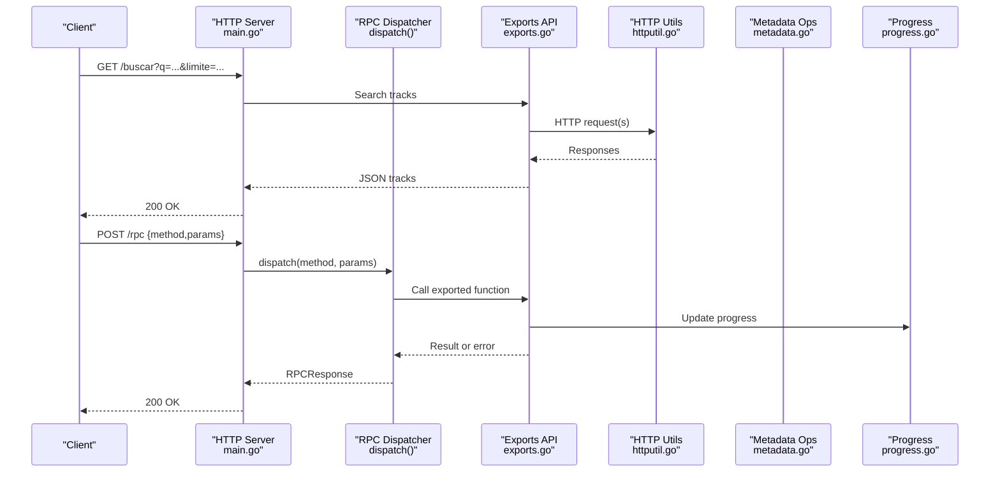
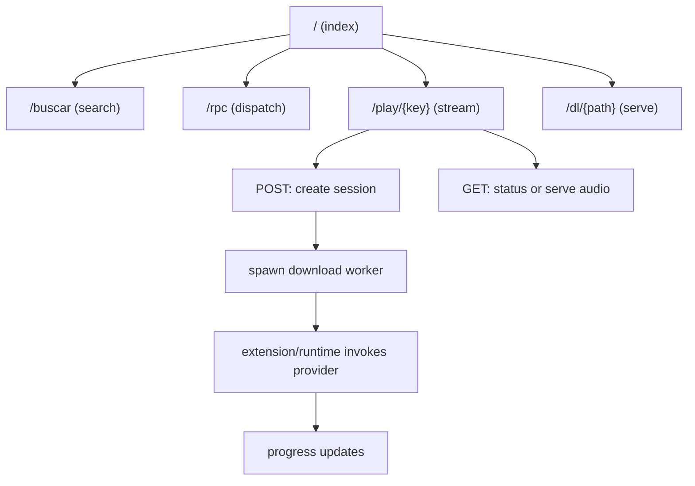
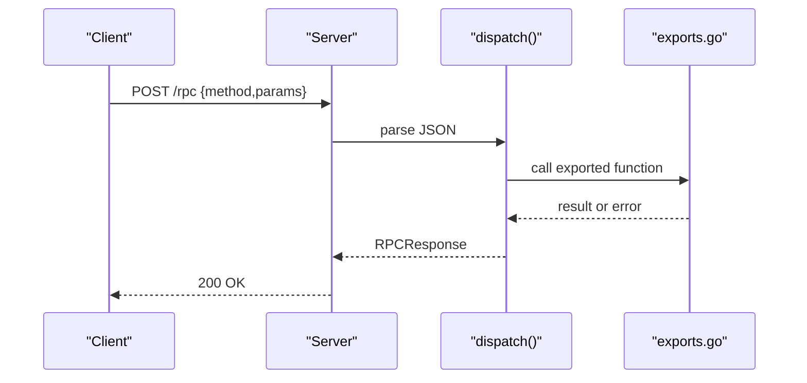
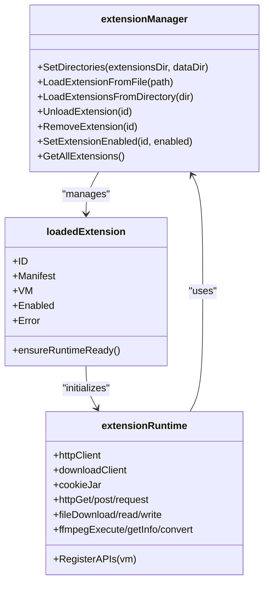
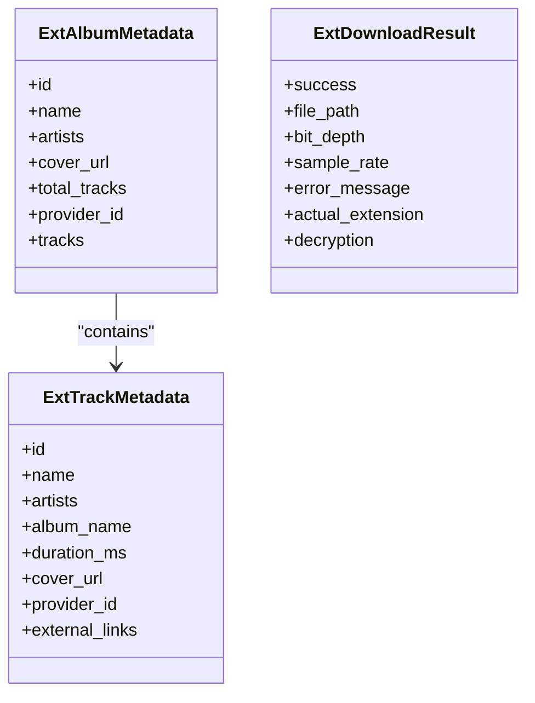
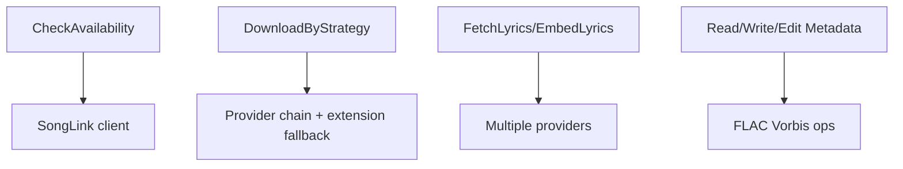
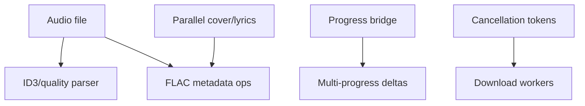
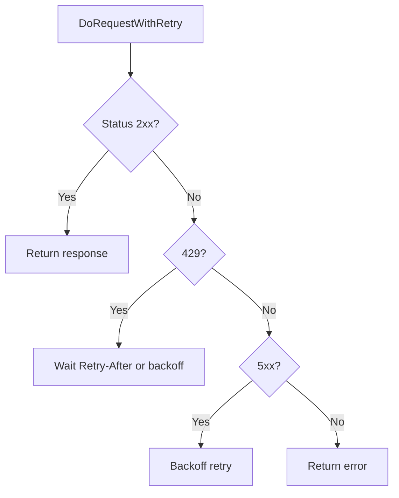
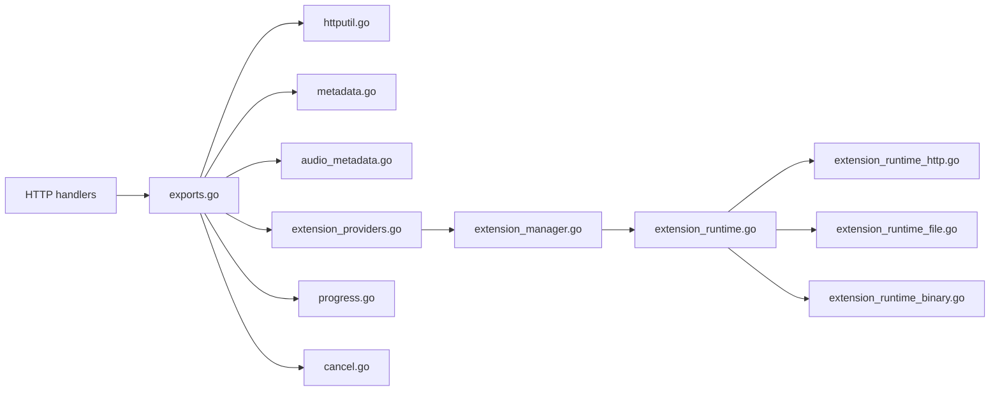

# Backend Architecture (Go)

<cite>
**Referenced Files in This Document**
- [main.go](file://go_backend_spotiflac/cmd/server/main.go)
- [extension_manager.go](file://go_backend_spotiflac/extension_manager.go)
- [extension_runtime.go](file://go_backend_spotiflac/extension_runtime.go)
- [extension_manifest.go](file://go_backend_spotiflac/extension_manifest.go)
- [extension_providers.go](file://go_backend_spotiflac/extension_providers.go)
- [exports.go](file://go_backend_spotiflac/exports.go)
- [metadata.go](file://go_backend_spotiflac/metadata.go)
- [audio_metadata.go](file://go_backend_spotiflac/audio_metadata.go)
- [parallel.go](file://go_backend_spotiflac/parallel.go)
- [progress.go](file://go_backend_spotiflac/progress.go)
- [cancel.go](file://go_backend_spotiflac/cancel.go)
- [httputil.go](file://go_backend_spotiflac/httputil.go)
- [extension_runtime_http.go](file://go_backend_spotiflac/extension_runtime_http.go)
- [extension_runtime_file.go](file://go_backend_spotiflac/extension_runtime_file.go)
- [extension_runtime_binary.go](file://go_backend_spotiflac/extension_runtime_binary.go)
</cite>

## Table of Contents
1. [Introduction](#introduction)
2. [Project Structure](#project-structure)
3. [Core Components](#core-components)
4. [Architecture Overview](#architecture-overview)
5. [Detailed Component Analysis](#detailed-component-analysis)
6. [Dependency Analysis](#dependency-analysis)
7. [Performance Considerations](#performance-considerations)
8. [Troubleshooting Guide](#troubleshooting-guide)
9. [Conclusion](#conclusion)

## Introduction
This document explains the Go backend architecture powering the Spotiflac project. It covers the HTTP server implementation, RPC-style API, extension system, audio processing pipeline, and metadata management. It also details concurrency handling, error strategies, and performance optimizations, while maintaining separation of concerns among audio processing, metadata extraction, and external API integrations.

## Project Structure
The backend is organized around a small HTTP server that exposes endpoints and an RPC dispatcher, backed by a robust extension system and a suite of utilities for HTTP, metadata, and progress tracking.

**Diagram sources**
- [main.go:107-134](file://go_backend_spotiflac/cmd/server/main.go#L107-L134)
- [extension_manager.go:120-139](file://go_backend_spotiflac/extension_manager.go#L120-L139)
- [extension_runtime.go:84-147](file://go_backend_spotiflac/extension_runtime.go#L84-L147)
- [extension_manifest.go:116-138](file://go_backend_spotiflac/extension_manifest.go#L116-L138)
- [extension_providers.go:19-83](file://go_backend_spotiflac/extension_providers.go#L19-L83)
- [exports.go:18-31](file://go_backend_spotiflac/exports.go#L18-L31)
- [metadata.go:104-129](file://go_backend_spotiflac/metadata.go#L104-L129)
- [audio_metadata.go:15-38](file://go_backend_spotiflac/audio_metadata.go#L15-L38)
- [parallel.go:35-85](file://go_backend_spotiflac/parallel.go#L35-L85)
- [progress.go:38-47](file://go_backend_spotiflac/progress.go#L38-L47)
- [cancel.go:16-29](file://go_backend_spotiflac/cancel.go#L16-L29)
- [httputil.go:45-57](file://go_backend_spotiflac/httputil.go#L45-L57)

**Section sources**
- [main.go:107-134](file://go_backend_spotiflac/cmd/server/main.go#L107-L134)
- [extension_manager.go:120-139](file://go_backend_spotiflac/extension_manager.go#L120-L139)
- [extension_runtime.go:84-147](file://go_backend_spotiflac/extension_runtime.go#L84-L147)
- [extension_manifest.go:116-138](file://go_backend_spotiflac/extension_manifest.go#L116-L138)
- [extension_providers.go:19-83](file://go_backend_spotiflac/extension_providers.go#L19-L83)
- [exports.go:18-31](file://go_backend_spotiflac/exports.go#L18-L31)
- [metadata.go:104-129](file://go_backend_spotiflac/metadata.go#L104-L129)
- [audio_metadata.go:15-38](file://go_backend_spotiflac/audio_metadata.go#L15-L38)
- [parallel.go:35-85](file://go_backend_spotiflac/parallel.go#L35-L85)
- [progress.go:38-47](file://go_backend_spotiflac/progress.go#L38-L47)
- [cancel.go:16-29](file://go_backend_spotiflac/cancel.go#L16-L29)
- [httputil.go:45-57](file://go_backend_spotiflac/httputil.go#L45-L57)

## Core Components
- HTTP server and endpoints:
  - Root index, search, RPC, streaming playback, and download endpoints.
- RPC dispatcher:
  - Centralized handler for internal commands (availability checks, downloads, metadata, lyrics, extension lifecycle).
- Extension system:
  - Extension manager, runtime sandbox, and provider wrappers.
- Media and metadata:
  - FLAC/Vorbis operations, ID3 parsing, parallel cover/lyrics fetching, and progress reporting.
- Networking:
  - Shared clients, retry/backoff, rate-limit handling, and ISP blocking detection.

**Section sources**
- [main.go:107-134](file://go_backend_spotiflac/cmd/server/main.go#L107-L134)
- [main.go:359-385](file://go_backend_spotiflac/cmd/server/main.go#L359-L385)
- [extension_manager.go:120-139](file://go_backend_spotiflac/extension_manager.go#L120-L139)
- [extension_runtime.go:84-147](file://go_backend_spotiflac/extension_runtime.go#L84-L147)
- [exports.go:18-31](file://go_backend_spotiflac/exports.go#L18-L31)
- [metadata.go:104-129](file://go_backend_spotiflac/metadata.go#L104-L129)
- [parallel.go:35-85](file://go_backend_spotiflac/parallel.go#L35-L85)
- [httputil.go:249-345](file://go_backend_spotiflac/httputil.go#L249-L345)

## Architecture Overview
The backend exposes a simple HTTP API and an RPC interface. Requests are routed to handlers or the RPC dispatcher, which delegates to internal services. The extension system runs inside isolated JavaScript VMs with strict sandboxing for HTTP, file, and crypto operations.

**Diagram sources**
- [main.go:297-347](file://go_backend_spotiflac/cmd/server/main.go#L297-L347)
- [main.go:359-385](file://go_backend_spotiflac/cmd/server/main.go#L359-L385)
- [exports.go:18-31](file://go_backend_spotiflac/exports.go#L18-L31)
- [httputil.go:249-345](file://go_backend_spotiflac/httputil.go#L249-L345)
- [progress.go:207-222](file://go_backend_spotiflac/progress.go#L207-L222)

## Detailed Component Analysis

### HTTP Server and Endpoints
- Root: returns service metadata.
- Search: queries external providers and returns normalized track list.
- RPC: centralized method dispatch for internal operations.
- Playback: session management with async download and streaming.
- Download: serves pre-downloaded files.

**Diagram sources**
- [main.go:124-134](file://go_backend_spotiflac/cmd/server/main.go#L124-L134)
- [main.go:136-270](file://go_backend_spotiflac/cmd/server/main.go#L136-L270)
- [main.go:272-286](file://go_backend_spotiflac/cmd/server/main.go#L272-L286)
- [main.go:288-295](file://go_backend_spotiflac/cmd/server/main.go#L288-L295)

**Section sources**
- [main.go:124-134](file://go_backend_spotiflac/cmd/server/main.go#L124-L134)
- [main.go:136-270](file://go_backend_spotiflac/cmd/server/main.go#L136-L270)
- [main.go:272-286](file://go_backend_spotiflac/cmd/server/main.go#L272-L286)
- [main.go:288-295](file://go_backend_spotiflac/cmd/server/main.go#L288-L295)

### RPC Dispatcher
- Parses JSON requests, validates method, and routes to exported functions.
- Returns structured results or errors.

**Diagram sources**
- [main.go:359-385](file://go_backend_spotiflac/cmd/server/main.go#L359-L385)
- [exports.go:18-31](file://go_backend_spotiflac/exports.go#L18-L31)

**Section sources**
- [main.go:359-385](file://go_backend_spotiflac/cmd/server/main.go#L359-L385)
- [exports.go:18-31](file://go_backend_spotiflac/exports.go#L18-L31)

### Extension Manager and Runtime
- Loads/unloads extensions, validates manifests, initializes VMs, and manages settings.
- Runtime exposes a sandboxed API surface to extensions (HTTP, file, auth, ffmpeg, matching, utils).

**Diagram sources**
- [extension_manager.go:120-139](file://go_backend_spotiflac/extension_manager.go#L120-L139)
- [extension_manager.go:158-294](file://go_backend_spotiflac/extension_manager.go#L158-L294)
- [extension_runtime.go:84-147](file://go_backend_spotiflac/extension_runtime.go#L84-L147)
- [extension_runtime_http.go:71-145](file://go_backend_spotiflac/extension_runtime_http.go#L71-L145)
- [extension_runtime_file.go:110-311](file://go_backend_spotiflac/extension_runtime_file.go#L110-L311)

**Section sources**
- [extension_manager.go:120-139](file://go_backend_spotiflac/extension_manager.go#L120-L139)
- [extension_manager.go:158-294](file://go_backend_spotiflac/extension_manager.go#L158-L294)
- [extension_runtime.go:84-147](file://go_backend_spotiflac/extension_runtime.go#L84-L147)
- [extension_runtime_http.go:71-145](file://go_backend_spotiflac/extension_runtime_http.go#L71-L145)
- [extension_runtime_file.go:110-311](file://go_backend_spotiflac/extension_runtime_file.go#L110-L311)

### Provider Wrappers and Types
- Defines standardized metadata and download result types for extensions.
- Normalizes results and overlays metadata from multiple sources.

**Diagram sources**
- [extension_providers.go:19-83](file://go_backend_spotiflac/extension_providers.go#L19-L83)
- [extension_providers.go:417-448](file://go_backend_spotiflac/extension_providers.go#L417-L448)

**Section sources**
- [extension_providers.go:19-83](file://go_backend_spotiflac/extension_providers.go#L19-L83)
- [extension_providers.go:417-448](file://go_backend_spotiflac/extension_providers.go#L417-L448)

### Public API Surface (Exports)
- Availability checks, download orchestration, metadata enrichment, lyrics, and post-processing.
- Bridges extension results into unified responses.

**Diagram sources**
- [exports.go:18-31](file://go_backend_spotiflac/exports.go#L18-L31)
- [exports.go:158-203](file://go_backend_spotiflac/exports.go#L158-L203)
- [exports.go:698-787](file://go_backend_spotiflac/exports.go#L698-L787)
- [metadata.go:131-189](file://go_backend_spotiflac/metadata.go#L131-L189)

**Section sources**
- [exports.go:18-31](file://go_backend_spotiflac/exports.go#L18-L31)
- [exports.go:158-203](file://go_backend_spotiflac/exports.go#L158-L203)
- [exports.go:698-787](file://go_backend_spotiflac/exports.go#L698-L787)
- [metadata.go:131-189](file://go_backend_spotiflac/metadata.go#L131-L189)

### Audio Processing Pipeline
- ID3/quality parsing, FLAC metadata embedding, parallel cover/lyrics retrieval, and progress tracking.
- Optional conversion helpers (e.g., M4A to FLAC) and cancellation support.

**Diagram sources**
- [audio_metadata.go:54-94](file://go_backend_spotiflac/audio_metadata.go#L54-L94)
- [metadata.go:131-189](file://go_backend_spotiflac/metadata.go#L131-L189)
- [parallel.go:35-85](file://go_backend_spotiflac/parallel.go#L35-L85)
- [progress.go:207-222](file://go_backend_spotiflac/progress.go#L207-L222)
- [cancel.go:31-60](file://go_backend_spotiflac/cancel.go#L31-L60)

**Section sources**
- [audio_metadata.go:54-94](file://go_backend_spotiflac/audio_metadata.go#L54-L94)
- [metadata.go:131-189](file://go_backend_spotiflac/metadata.go#L131-L189)
- [parallel.go:35-85](file://go_backend_spotiflac/parallel.go#L35-L85)
- [progress.go:207-222](file://go_backend_spotiflac/progress.go#L207-L222)
- [cancel.go:31-60](file://go_backend_spotiflac/cancel.go#L31-L60)

### HTTP Utilities and Network Resilience
- Shared and metadata-specific HTTP clients with connection pooling and timeouts.
- Retry/backoff, rate-limit handling, and ISP blocking detection.

**Diagram sources**
- [httputil.go:249-345](file://go_backend_spotiflac/httputil.go#L249-L345)

**Section sources**
- [httputil.go:64-103](file://go_backend_spotiflac/httputil.go#L64-L103)
- [httputil.go:249-345](file://go_backend_spotiflac/httputil.go#L249-L345)

## Dependency Analysis
- The HTTP server depends on exported functions for search, downloads, and metadata.
- Extensions depend on the runtime for sandboxed APIs and on the provider wrappers for consistent data exchange.
- Progress and cancellation are cross-cutting concerns used by downloads and playback.

**Diagram sources**
- [main.go:107-134](file://go_backend_spotiflac/cmd/server/main.go#L107-L134)
- [exports.go:158-203](file://go_backend_spotiflac/exports.go#L158-L203)
- [extension_providers.go:19-83](file://go_backend_spotiflac/extension_providers.go#L19-L83)
- [extension_manager.go:120-139](file://go_backend_spotiflac/extension_manager.go#L120-L139)
- [extension_runtime.go:84-147](file://go_backend_spotiflac/extension_runtime.go#L84-L147)
- [extension_runtime_http.go:71-145](file://go_backend_spotiflac/extension_runtime_http.go#L71-L145)
- [extension_runtime_file.go:110-311](file://go_backend_spotiflac/extension_runtime_file.go#L110-L311)
- [extension_runtime_binary.go:266-360](file://go_backend_spotiflac/extension_runtime_binary.go#L266-L360)
- [progress.go:207-222](file://go_backend_spotiflac/progress.go#L207-L222)
- [cancel.go:31-60](file://go_backend_spotiflac/cancel.go#L31-L60)

**Section sources**
- [main.go:107-134](file://go_backend_spotiflac/cmd/server/main.go#L107-L134)
- [exports.go:158-203](file://go_backend_spotiflac/exports.go#L158-L203)
- [extension_providers.go:19-83](file://go_backend_spotiflac/extension_providers.go#L19-L83)
- [extension_manager.go:120-139](file://go_backend_spotiflac/extension_manager.go#L120-L139)
- [extension_runtime.go:84-147](file://go_backend_spotiflac/extension_runtime.go#L84-L147)
- [extension_runtime_http.go:71-145](file://go_backend_spotiflac/extension_runtime_http.go#L71-L145)
- [extension_runtime_file.go:110-311](file://go_backend_spotiflac/extension_runtime_file.go#L110-L311)
- [extension_runtime_binary.go:266-360](file://go_backend_spotiflac/extension_runtime_binary.go#L266-L360)
- [progress.go:207-222](file://go_backend_spotiflac/progress.go#L207-L222)
- [cancel.go:31-60](file://go_backend_spotiflac/cancel.go#L31-L60)

## Performance Considerations
- HTTP client pooling and keep-alive reduce connection overhead.
- Retry/backoff mitigates transient provider failures.
- Chunked downloads and progress writers minimize memory footprint and enable responsive UI updates.
- Parallel cover/lyrics fetching reduces latency for metadata enrichment.
- Cancellation tokens prevent wasted work on abandoned downloads.

[No sources needed since this section provides general guidance]

## Troubleshooting Guide
- ISP blocking detection:
  - Automatic detection of DNS/transport/TLS issues and suggestions to switch DNS or use a VPN.
- HTTP error handling:
  - 429 handling with Retry-After or exponential backoff; 5xx retried with backoff.
- Extension sandbox violations:
  - Blocked domains, private IPs, and unauthorized HTTP methods are rejected.
- Cancellation:
  - Downloads and extension requests can be cancelled; progress is cleaned up.

**Section sources**
- [httputil.go:427-535](file://go_backend_spotiflac/httputil.go#L427-L535)
- [extension_runtime_http.go:38-69](file://go_backend_spotiflac/extension_runtime_http.go#L38-L69)
- [cancel.go:62-80](file://go_backend_spotiflac/cancel.go#L62-L80)

## Conclusion
The Go backend provides a modular, extensible architecture centered on a lightweight HTTP server and a robust RPC dispatcher. The extension system ensures safe, sandboxed customization, while utilities for networking, metadata, and progress tracking deliver reliability and responsiveness. Separation of concerns keeps audio processing, metadata extraction, and external integrations cohesive yet distinct.