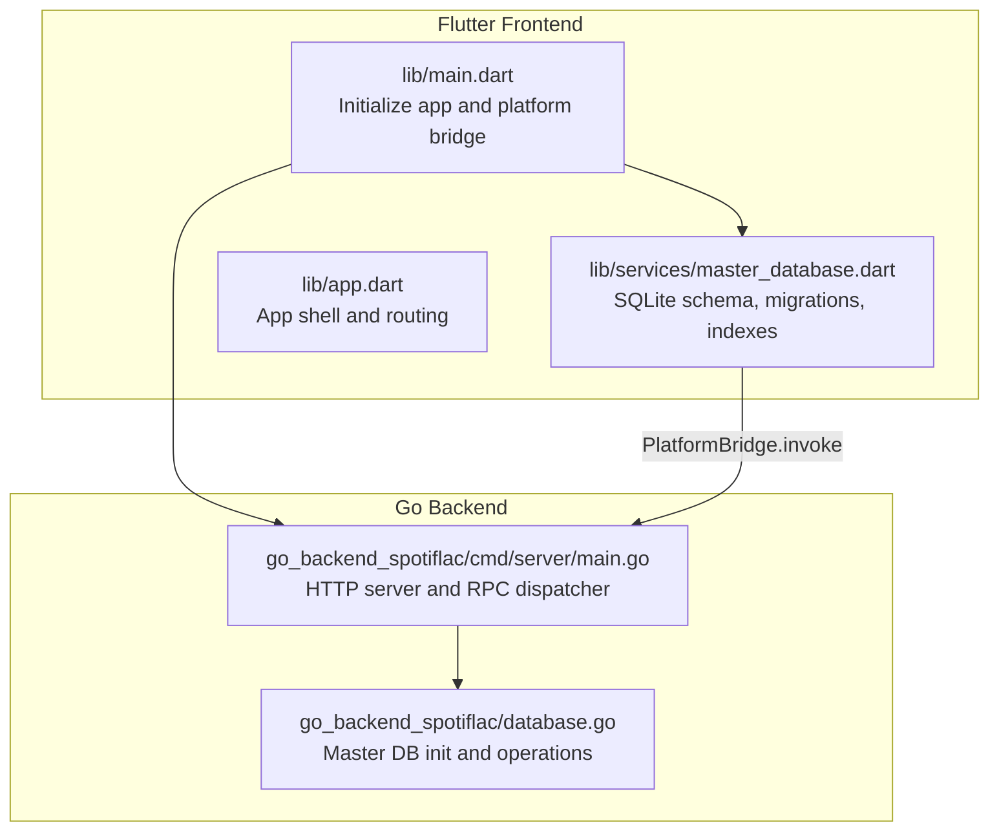
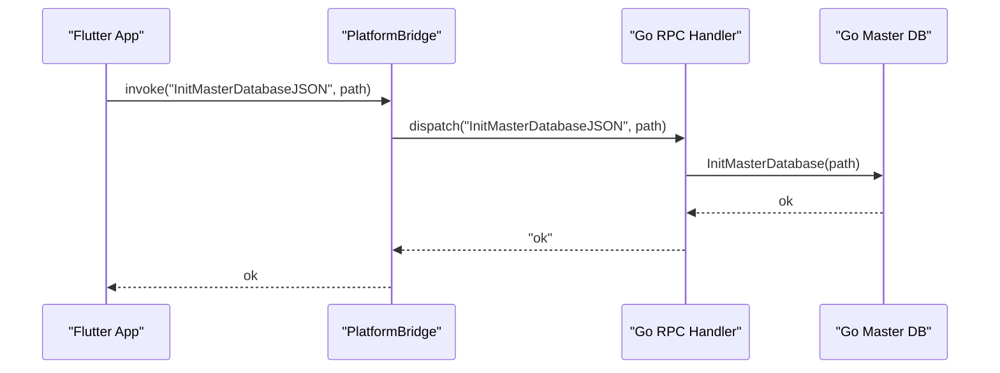
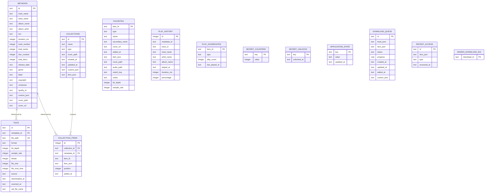
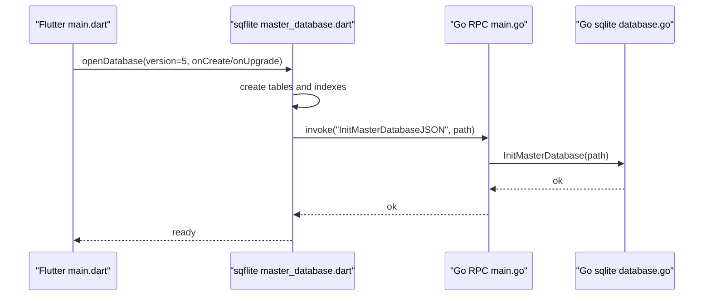
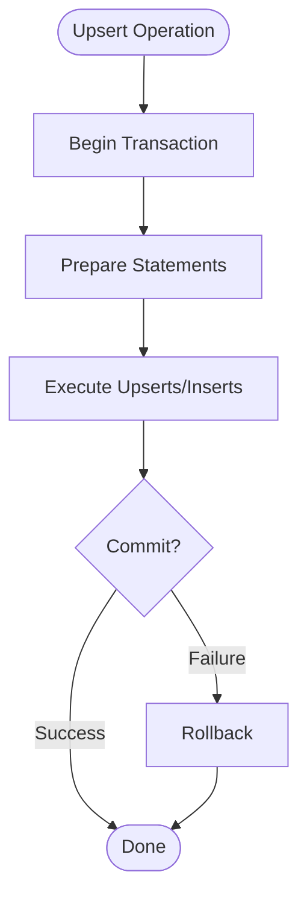
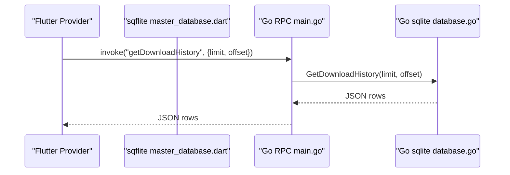
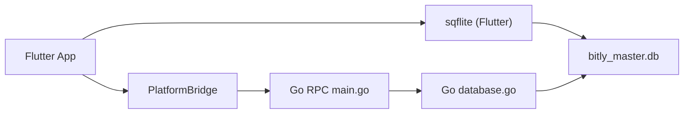

# Database Management

<cite>
**Referenced Files in This Document**
- [database.go](file://go_backend_spotiflac/database.go)
- [main.go](file://go_backend_spotiflac/cmd/server/main.go)
- [master_database.dart](file://lib/services/master_database.dart)
- [main.dart](file://lib/main.dart)
- [app.dart](file://lib/app.dart)
- [go.mod](file://go_backend_spotiflac/go.mod)
</cite>

## Table of Contents
1. [Introduction](#introduction)
2. [Project Structure](#project-structure)
3. [Core Components](#core-components)
4. [Architecture Overview](#architecture-overview)
5. [Detailed Component Analysis](#detailed-component-analysis)
6. [Dependency Analysis](#dependency-analysis)
7. [Performance Considerations](#performance-considerations)
8. [Troubleshooting Guide](#troubleshooting-guide)
9. [Conclusion](#conclusion)
10. [Appendices](#appendices)

## Introduction
This document describes the database management system for the application, focusing on the unified SQLite database shared between the Flutter frontend and the Go backend. It covers the schema, initialization, FFI integration via a platform bridge, data persistence strategies, concurrency and thread-safety, query patterns, transaction management, migration handling, and operational aspects such as backup, recovery, integrity checks, and maintenance. It also explains how the frontend integrates with the backend and synchronizes data.

## Project Structure
The database system is implemented as a single, unified SQLite database located under the application’s documents directory. The Flutter app creates and manages the database schema and indexes, while the Go backend initializes and configures the same database for optimized performance. A platform bridge enables the Flutter app to invoke Go-side database operations.

**Diagram sources**
- [main.dart:22-44](file://lib/main.dart#L22-L44)
- [master_database.dart:22-46](file://lib/services/master_database.dart#L22-L46)
- [main.go:107-134](file://go_backend_spotiflac/cmd/server/main.go#L107-L134)
- [database.go:19-41](file://go_backend_spotiflac/database.go#L19-L41)

**Section sources**
- [main.dart:22-44](file://lib/main.dart#L22-L44)
- [master_database.dart:22-46](file://lib/services/master_database.dart#L22-L46)
- [main.go:107-134](file://go_backend_spotiflac/cmd/server/main.go#L107-L134)
- [database.go:19-41](file://go_backend_spotiflac/database.go#L19-L41)

## Core Components
- Master database initialization and configuration:
  - Flutter initializes the database and applies schema and indexes.
  - Go backend initializes the same database with performance PRAGMAs and thread-safe access.
- Unified schema:
  - Shared tables for metadata, files, collections, collection_items, favorites, play_history, play_aggregates, secret counters/unlocks, application_state, download_queue, recent_access, and hidden_download_ids.
- FFI integration:
  - PlatformBridge.invoke bridges Flutter calls to Go RPC methods, enabling Go-side database operations.
- Data access patterns:
  - Transactions for atomic updates.
  - Prepared statements for batch operations.
  - JSON serialization for complex records returned to Flutter.
- Concurrency and thread-safety:
  - Read-write mutex around the master DB pointer.
  - Go backend uses SQLite with WAL mode and busy timeouts.
  - Flutter uses sqflite with foreign keys enabled.

**Section sources**
- [master_database.dart:48-222](file://lib/services/master_database.dart#L48-L222)
- [database.go:19-41](file://go_backend_spotiflac/database.go#L19-L41)
- [database.go:52-158](file://go_backend_spotiflac/database.go#L52-L158)
- [main.go:575-582](file://go_backend_spotiflac/cmd/server/main.go#L575-L582)

## Architecture Overview
The system uses a single SQLite database file shared by both Flutter and Go. The Flutter app owns schema creation and migrations, while the Go backend owns performance tuning and heavy operations. The platform bridge exposes a method surface to Flutter for Go-managed operations.

**Diagram sources**
- [main.dart:38-43](file://lib/main.dart#L38-L43)
- [master_database.dart:37-43](file://lib/services/master_database.dart#L37-L43)
- [main.go:580-582](file://go_backend_spotiflac/cmd/server/main.go#L580-L582)
- [database.go:19-41](file://go_backend_spotiflac/database.go#L19-L41)

## Detailed Component Analysis

### Database Schema and Migration
- Schema definition:
  - metadata: primary key id, track/album info, identifiers, timestamps, cover paths/urls.
  - files: primary key id, foreign key metadata_id, unique file_path, source, timestamps, audio specs.
  - collections and collection_items: playlists/collections with optional JSON payloads and foreign keys.
  - favorites: user favorites with audio/spec metadata.
  - play_history and play_aggregates: listening history and aggregates.
  - secret_counters and secret_unlocks: internal stats and unlocks.
  - application_state: key-value app state storage.
  - download_queue: queued downloads with status and timestamps.
  - recent_access: recently accessed items with typed entries.
  - hidden_download_ids: hidden download identifiers.
- Indexes:
  - Primary and composite indexes on frequently queried columns (e.g., isrc, spotify_id, source, types, dates).
- Migrations:
  - Versioned upgrades add missing columns and backfill types for recent_access.

**Diagram sources**
- [master_database.dart:48-222](file://lib/services/master_database.dart#L48-L222)

**Section sources**
- [master_database.dart:48-222](file://lib/services/master_database.dart#L48-L222)

### Database Initialization and FFI Integration
- Flutter initialization:
  - Opens the database with sqflite, sets foreign_keys ON, and defines schema and indexes.
  - Invokes the Go backend to initialize its own connection to the same file.
- Go initialization:
  - Opens the database via modernc.org/sqlite.
  - Sets PRAGMAs for WAL, NORMAL synchronous, 64MB cache, and 5s busy timeout.
  - Exposes thread-safe access via a read-write mutex.
- Platform bridge:
  - Flutter calls PlatformBridge.invoke with method names and parameters.
  - Go RPC handler dispatches to appropriate Go functions.

**Diagram sources**
- [main.dart:22-44](file://lib/main.dart#L22-L44)
- [master_database.dart:22-46](file://lib/services/master_database.dart#L22-L46)
- [main.go:575-582](file://go_backend_spotiflac/cmd/server/main.go#L575-L582)
- [database.go:19-41](file://go_backend_spotiflac/database.go#L19-L41)

**Section sources**
- [main.dart:22-44](file://lib/main.dart#L22-L44)
- [master_database.dart:22-46](file://lib/services/master_database.dart#L22-L46)
- [main.go:575-582](file://go_backend_spotiflac/cmd/server/main.go#L575-L582)
- [database.go:19-41](file://go_backend_spotiflac/database.go#L19-L41)

### Data Persistence Strategies
- Atomic updates:
  - Batch upserts use transactions to ensure consistency.
  - Prepared statements reduce overhead for repeated inserts/updates.
- Upserts:
  - SQLite ON CONFLICT clauses update existing rows when primary keys match.
- JSON payloads:
  - Complex records (e.g., favorites, collections) are stored as JSON for flexibility.
- Source tagging:
  - files.source distinguishes local scans versus downloads for separate workflows.

**Diagram sources**
- [database.go:52-158](file://go_backend_spotiflac/database.go#L52-L158)
- [master_database.dart:431-465](file://lib/services/master_database.dart#L431-L465)

**Section sources**
- [database.go:52-158](file://go_backend_spotiflac/database.go#L52-L158)
- [master_database.dart:431-465](file://lib/services/master_database.dart#L431-L465)

### Data Access Patterns and Query Optimization
- Queries:
  - JOINs between metadata and files for unified views.
  - LIKE queries with wildcards for search across track/artist/album names.
  - ORDER BY with indexes to optimize sorting (e.g., played_at DESC).
- Indexes:
  - Composite indexes on (album_name, artist_name) and (source) improve grouping and filtering.
  - Type-specific indexes (e.g., favorites.type) support filtered queries.
- Pagination:
  - LIMIT/OFFSET patterns for page-based retrieval.
- JSON serialization:
  - Rows are serialized to JSON for transport to Flutter.

**Diagram sources**
- [main.go:966-972](file://go_backend_spotiflac/cmd/server/main.go#L966-L972)
- [database.go:466-494](file://go_backend_spotiflac/database.go#L466-L494)

**Section sources**
- [master_database.dart:467-496](file://lib/services/master_database.dart#L467-L496)
- [database.go:466-494](file://go_backend_spotiflac/database.go#L466-L494)

### Transaction Management
- Transactions are used for:
  - Upserting metadata and files together to maintain referential integrity.
  - Batch operations to reduce round-trips.
- Rollback on error ensures partial failures do not corrupt state.
- Prepared statements inside transactions minimize parsing overhead.

**Section sources**
- [database.go:52-158](file://go_backend_spotiflac/database.go#L52-L158)
- [master_database.dart:431-465](file://lib/services/master_database.dart#L431-L465)

### Master Database Functionality
- Application state and user preferences:
  - application_state table stores key-value pairs with timestamps.
  - download_queue persists queued items with status and timestamps.
  - recent_access maintains typed recent entries.
  - hidden_download_ids supports hidden identifiers.
- Favorites and collections:
  - Upsert/delete operations for favorites and collection items.
- Play history and aggregates:
  - Logging plays and incrementing aggregates for analytics.
- Secret counters and unlocks:
  - Internal tracking for secrets and unlock events.

**Section sources**
- [master_database.dart:176-210](file://lib/services/master_database.dart#L176-L210)
- [database.go:886-963](file://go_backend_spotiflac/database.go#L886-L963)
- [database.go:1428-1593](file://go_backend_spotiflac/database.go#L1428-L1593)

### Database Connection Pooling and Concurrency
- Flutter:
  - sqflite manages a pool per database; foreign keys are enabled.
- Go:
  - Single sql.DB instance guarded by a read-write mutex.
  - WAL mode and busy_timeout reduce contention and deadlocks.
- Thread-safety:
  - GetMasterDB uses read lock; InitMasterDatabase uses write lock.
  - No explicit connection pool configuration; rely on SQLite’s built-in concurrency model.

**Section sources**
- [master_database.dart:31-35](file://lib/services/master_database.dart#L31-L35)
- [database.go:19-41](file://go_backend_spotiflac/database.go#L19-L41)
- [database.go:43-49](file://go_backend_spotiflac/database.go#L43-L49)

### Practical Examples and Data Modeling Decisions
- Example: Upsert local library entry
  - Inserts/updates metadata and files in a single transaction.
  - Uses ON CONFLICT to preserve existing cover_path when not provided.
- Example: Get local library page
  - JOIN metadata and files, filter by source, apply search and sorting, paginate.
- Example: Favorites upsert
  - Stores JSON payload and audio/spec metadata for flexible consumption.
- Example: Download queue
  - Queued items persisted with status and timestamps for UI and background processing.

**Section sources**
- [database.go:803-850](file://go_backend_spotiflac/database.go#L803-L850)
- [database.go:1019-1068](file://go_backend_spotiflac/database.go#L1019-L1068)
- [database.go:886-909](file://go_backend_spotiflac/database.go#L886-L909)
- [database.go:184-195](file://go_backend_spotiflac/database.go#L184-L195)

### Performance Tuning
- Go backend PRAGMAs:
  - journal_mode=WAL, synchronous=NORMAL, cache_size=-64000, busy_timeout=5000.
- Flutter:
  - Foreign keys enabled; indexes on hot columns.
- Recommendations:
  - Use prepared statements for repeated operations.
  - Batch inserts/updates to reduce commits.
  - Monitor WAL growth and consider periodic VACUUM if fragmentation becomes an issue.

**Section sources**
- [database.go:32-36](file://go_backend_spotiflac/database.go#L32-L36)
- [master_database.dart:212-222](file://lib/services/master_database.dart#L212-L222)

### Backup and Recovery Procedures
- Backup:
  - Copy the database file from the application documents directory.
  - For production, schedule periodic copies during idle periods.
- Recovery:
  - Replace the corrupted database file with a known-good backup copy.
  - Re-initialize the Go backend after replacing the file.
- Integrity checks:
  - Run PRAGMA integrity_check; analyze results and repair as needed.
  - Monitor for foreign key constraint violations and fix referential mismatches.

[No sources needed since this section provides general guidance]

### Data Synchronization Mechanisms
- Go-managed operations:
  - Certain operations (download history, local library, favorites, collections, play history/aggregates, download queue) are invoked via the platform bridge and executed in Go.
- Flutter-managed operations:
  - Local library and history CRUD are handled directly in Flutter using sqflite.
- Consistency:
  - Both sides write to the same database file; ensure exclusive access to avoid corruption.
  - Use transactions for multi-table writes.

**Section sources**
- [main.go:941-1147](file://go_backend_spotiflac/cmd/server/main.go#L941-L1147)
- [master_database.dart:317-390](file://lib/services/master_database.dart#L317-L390)

## Dependency Analysis
- External dependencies:
  - Go SQLite driver: modernc.org/sqlite.
  - Flutter SQLite: sqflite.
- Internal dependencies:
  - Platform bridge connects Flutter to Go RPC handlers.
  - Go RPC handlers depend on the master database module.

**Diagram sources**
- [go.mod:17](file://go_backend_spotiflac/go.mod#L17)
- [main.go:575-582](file://go_backend_spotiflac/cmd/server/main.go#L575-L582)
- [database.go:19-41](file://go_backend_spotiflac/database.go#L19-L41)

**Section sources**
- [go.mod:17](file://go_backend_spotiflac/go.mod#L17)
- [main.go:575-582](file://go_backend_spotiflac/cmd/server/main.go#L575-L582)
- [database.go:19-41](file://go_backend_spotiflac/database.go#L19-L41)

## Performance Considerations
- Use WAL mode and appropriate cache sizes in Go.
- Enable foreign keys and indexes in Flutter.
- Prefer batch operations and prepared statements.
- Avoid long-running transactions; keep them scoped to necessary workloads.
- Monitor busy_timeout behavior and adjust if contention increases.

[No sources needed since this section provides general guidance]

## Troubleshooting Guide
- Database not initialized:
  - Ensure PlatformBridge.invoke("InitMasterDatabaseJSON", path) succeeds before other operations.
- SQLITE_BUSY errors:
  - Adjust busy_timeout and avoid long transactions.
- Foreign key constraint failures:
  - Verify referential integrity; ensure metadata_id matches metadata.id.
- Slow queries:
  - Confirm indexes exist and are used; review query plans.
- Migration issues:
  - Check version upgrades and ensure column additions succeed.

**Section sources**
- [database.go:43-49](file://go_backend_spotiflac/database.go#L43-L49)
- [master_database.dart:243-275](file://lib/services/master_database.dart#L243-L275)

## Conclusion
The database management system employs a unified SQLite database shared by Flutter and Go. Flutter handles schema, migrations, and most UI-driven operations, while Go optimizes heavy operations and provides thread-safe access. The platform bridge enables seamless integration, and careful use of transactions, prepared statements, and indexes ensures performance and reliability. Operational hygiene—backup, integrity checks, and maintenance—protects data continuity.

[No sources needed since this section summarizes without analyzing specific files]

## Appendices
- Example method invocations:
  - Flutter invokes Go methods via PlatformBridge.invoke("method", params).
  - Go dispatches to functions in database.go implementing the business logic.

**Section sources**
- [main.go:575-1454](file://go_backend_spotiflac/cmd/server/main.go#L575-L1454)
- [database.go:52-1599](file://go_backend_spotiflac/database.go#L52-L1599)