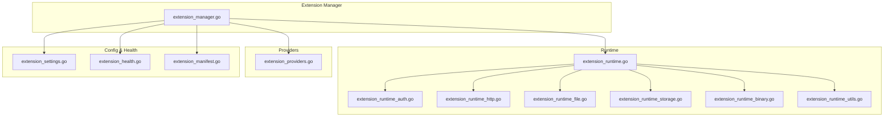
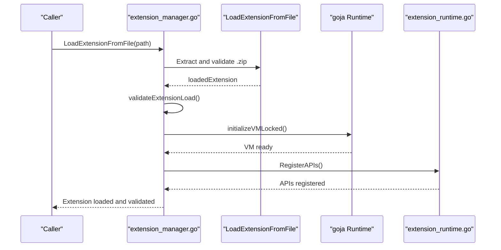
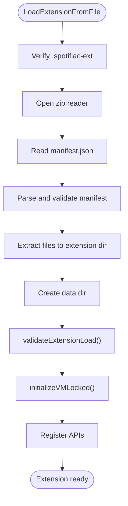
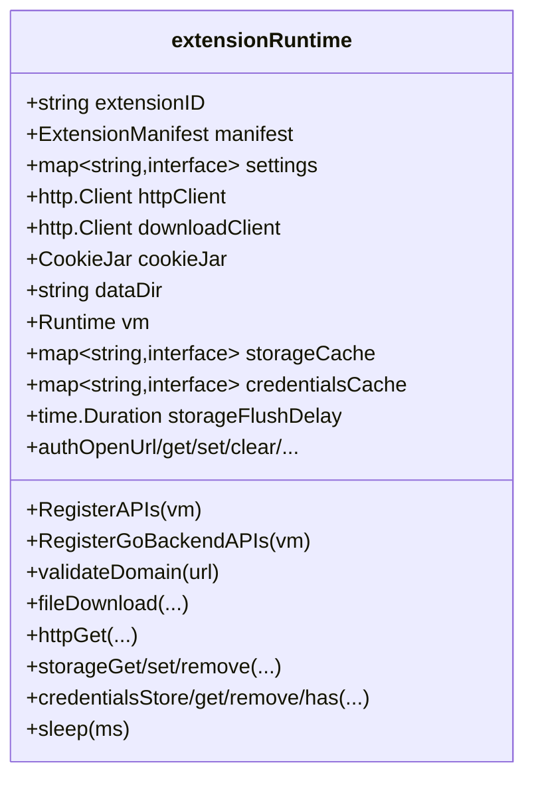
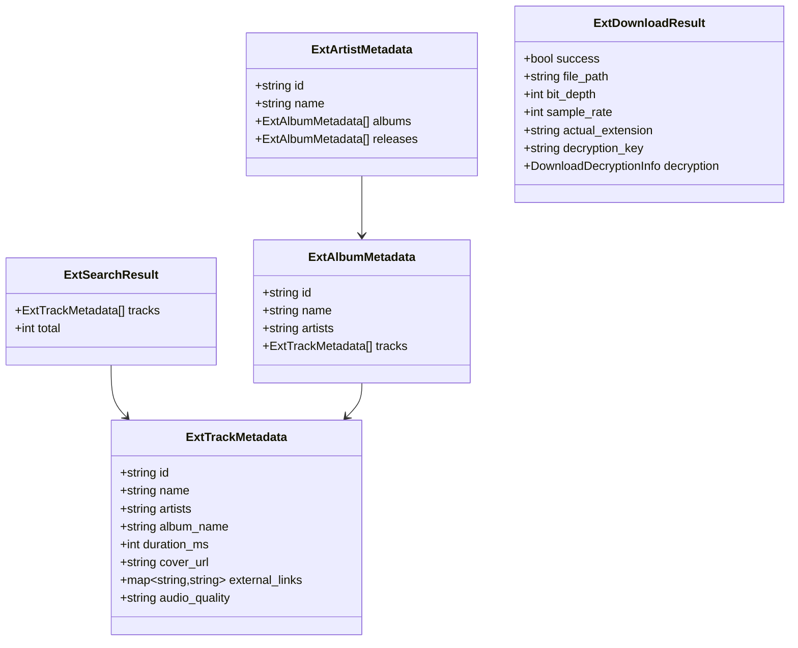
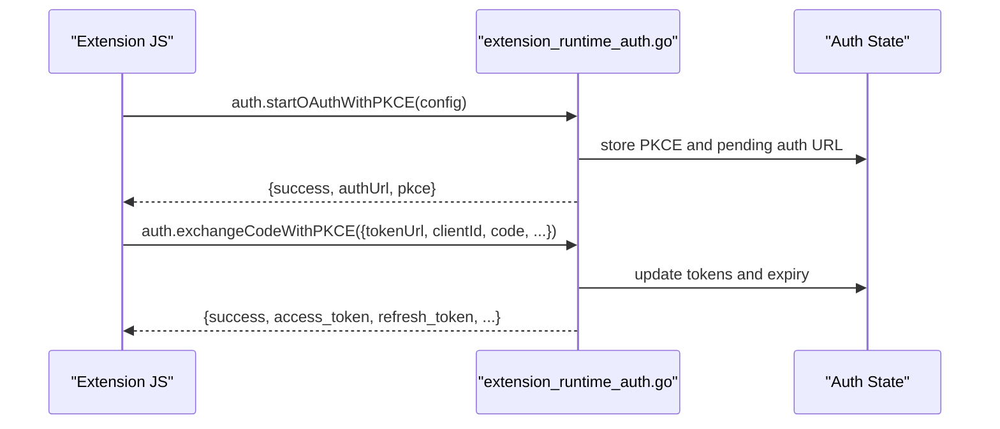
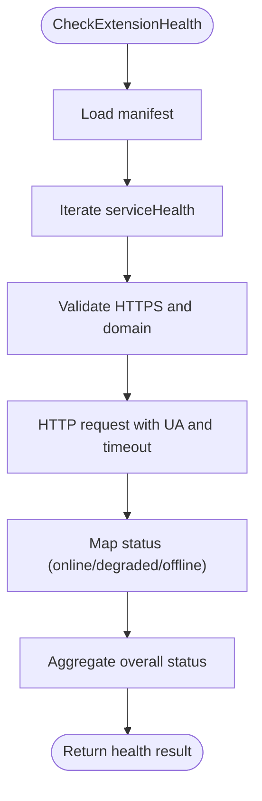
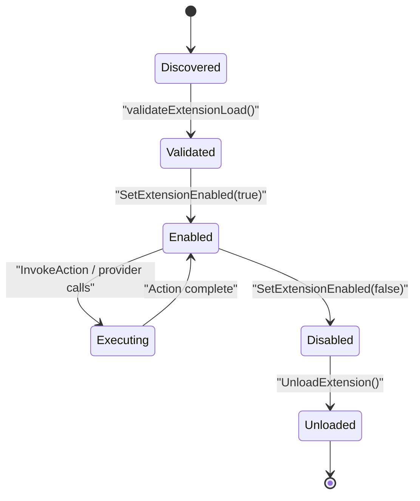
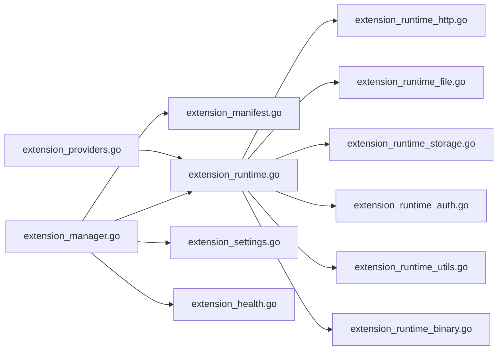

# Extension System

<cite>
**Referenced Files in This Document**
- [extension_manager.go](file://go_backend_spotiflac/extension_manager.go)
- [extension_runtime.go](file://go_backend_spotiflac/extension_runtime.go)
- [extension_runtime_auth.go](file://go_backend_spotiflac/extension_runtime_auth.go)
- [extension_runtime_http.go](file://go_backend_spotiflac/extension_runtime_http.go)
- [extension_runtime_file.go](file://go_backend_spotiflac/extension_runtime_file.go)
- [extension_runtime_storage.go](file://go_backend_spotiflac/extension_runtime_storage.go)
- [extension_runtime_binary.go](file://go_backend_spotiflac/extension_runtime_binary.go)
- [extension_runtime_utils.go](file://go_backend_spotiflac/extension_runtime_utils.go)
- [extension_providers.go](file://go_backend_spotiflac/extension_providers.go)
- [extension_settings.go](file://go_backend_spotiflac/extension_settings.go)
- [extension_health.go](file://go_backend_spotiflac/extension_health.go)
- [extension_manifest.go](file://go_backend_spotiflac/extension_manifest.go)
</cite>

## Table of Contents
1. [Introduction](#introduction)
2. [Project Structure](#project-structure)
3. [Core Components](#core-components)
4. [Architecture Overview](#architecture-overview)
5. [Detailed Component Analysis](#detailed-component-analysis)
6. [Dependency Analysis](#dependency-analysis)
7. [Performance Considerations](#performance-considerations)
8. [Troubleshooting Guide](#troubleshooting-guide)
9. [Conclusion](#conclusion)
10. [Appendices](#appendices)

## Introduction
This document describes the extension system architecture for the backend. It covers the extension manager, plugin loading mechanisms, JavaScript runtime integration, lifecycle management, sandboxing and security controls, provider system for custom audio providers and metadata sources, configuration and authentication handling, health monitoring, and practical guidance for development and troubleshooting.

## Project Structure
The extension system is implemented in the Go backend module under go_backend_spotiflac. Key areas:
- Extension lifecycle and packaging: extension_manager.go
- JavaScript runtime and sandbox: extension_runtime*.go
- Provider abstractions and conversion: extension_providers.go
- Settings and persistence: extension_settings.go
- Health monitoring: extension_health.go
- Manifest and validation: extension_manifest.go

**Diagram sources**
- [extension_manager.go:120-140](file://go_backend_spotiflac/extension_manager.go#L120-L140)
- [extension_runtime.go:84-147](file://go_backend_spotiflac/extension_runtime.go#L84-L147)
- [extension_runtime_auth.go:1-50](file://go_backend_spotiflac/extension_runtime_auth.go#L1-L50)
- [extension_runtime_http.go:38-69](file://go_backend_spotiflac/extension_runtime_http.go#L38-L69)
- [extension_runtime_file.go:75-108](file://go_backend_spotiflac/extension_runtime_file.go#L75-L108)
- [extension_runtime_storage.go:24-75](file://go_backend_spotiflac/extension_runtime_storage.go#L24-L75)
- [extension_runtime_binary.go:16-41](file://go_backend_spotiflac/extension_runtime_binary.go#L16-L41)
- [extension_runtime_utils.go:19-37](file://go_backend_spotiflac/extension_runtime_utils.go#L19-L37)
- [extension_providers.go:19-51](file://go_backend_spotiflac/extension_providers.go#L19-L51)
- [extension_settings.go:11-29](file://go_backend_spotiflac/extension_settings.go#L11-L29)
- [extension_health.go:41-54](file://go_backend_spotiflac/extension_health.go#L41-L54)
- [extension_manifest.go:116-138](file://go_backend_spotiflac/extension_manifest.go#L116-L138)

**Section sources**
- [extension_manager.go:120-140](file://go_backend_spotiflac/extension_manager.go#L120-L140)
- [extension_runtime.go:84-147](file://go_backend_spotiflac/extension_runtime.go#L84-L147)
- [extension_providers.go:19-51](file://go_backend_spotiflac/extension_providers.go#L19-L51)
- [extension_settings.go:11-29](file://go_backend_spotiflac/extension_settings.go#L11-L29)
- [extension_health.go:41-54](file://go_backend_spotiflac/extension_health.go#L41-L54)
- [extension_manifest.go:116-138](file://go_backend_spotiflac/extension_manifest.go#L116-L138)

## Core Components
- Extension Manager: Loads, validates, enables/disables, upgrades, and unloads extensions; orchestrates runtime initialization and cleanup.
- Extension Runtime: Provides a sandboxed JavaScript environment via goja, registers APIs, manages HTTP/file/storage/auth, and handles timeouts and cancellation.
- Providers: Abstractions for metadata, album/artist, and download results; conversion utilities between extension and internal types.
- Settings Store: Persists extension settings per extension ID.
- Health Monitor: Evaluates extension service health endpoints and aggregates statuses.
- Manifest: Defines extension capabilities, permissions, settings, and behaviors.

**Section sources**
- [extension_manager.go:120-140](file://go_backend_spotiflac/extension_manager.go#L120-L140)
- [extension_runtime.go:84-147](file://go_backend_spotiflac/extension_runtime.go#L84-L147)
- [extension_providers.go:19-51](file://go_backend_spotiflac/extension_providers.go#L19-L51)
- [extension_settings.go:11-29](file://go_backend_spotiflac/extension_settings.go#L11-L29)
- [extension_health.go:41-54](file://go_backend_spotiflac/extension_health.go#L41-L54)
- [extension_manifest.go:116-138](file://go_backend_spotiflac/extension_manifest.go#L116-L138)

## Architecture Overview
The system integrates a Go backend with a JavaScript runtime to execute extensions. Extensions are packaged as .spotiflac-ext archives containing manifest.json and index.js. The manager validates manifests, extracts packages, initializes VMs, registers APIs, and runs lifecycle hooks.

**Diagram sources**
- [extension_manager.go:158-294](file://go_backend_spotiflac/extension_manager.go#L158-L294)
- [extension_manager.go:296-344](file://go_backend_spotiflac/extension_manager.go#L296-L344)
- [extension_runtime.go:424-533](file://go_backend_spotiflac/extension_runtime.go#L424-L533)

**Section sources**
- [extension_manager.go:158-294](file://go_backend_spotiflac/extension_manager.go#L158-L294)
- [extension_manager.go:296-344](file://go_backend_spotiflac/extension_manager.go#L296-L344)
- [extension_runtime.go:424-533](file://go_backend_spotiflac/extension_runtime.go#L424-L533)

## Detailed Component Analysis

### Extension Manager
Responsibilities:
- Manage extension directories and data directories.
- Load extensions from .spotiflac-ext files or directories.
- Validate manifests and ensure safe extraction.
- Initialize and teardown JavaScript VMs.
- Enable/disable extensions and persist state.
- Upgrade existing extensions safely.
- Enumerate installed extensions and expose JSON metadata.

Key behaviors:
- Safe extraction: rejects paths outside the intended directories and cleans paths.
- Version comparison and upgrade policy: only newer versions are accepted.
- Initialization: creates VM, registers APIs, sets console and registerExtension hook.
- Cleanup: runs optional cleanup function in JS and flushes storage.

**Diagram sources**
- [extension_manager.go:158-294](file://go_backend_spotiflac/extension_manager.go#L158-L294)
- [extension_manager.go:296-344](file://go_backend_spotiflac/extension_manager.go#L296-L344)

**Section sources**
- [extension_manager.go:141-156](file://go_backend_spotiflac/extension_manager.go#L141-L156)
- [extension_manager.go:158-294](file://go_backend_spotiflac/extension_manager.go#L158-L294)
- [extension_manager.go:296-344](file://go_backend_spotiflac/extension_manager.go#L296-L344)
- [extension_manager.go:567-584](file://go_backend_spotiflac/extension_manager.go#L567-L584)
- [extension_manager.go:642-678](file://go_backend_spotiflac/extension_manager.go#L642-L678)
- [extension_manager.go:738-755](file://go_backend_spotiflac/extension_manager.go#L738-L755)
- [extension_manager.go:758-897](file://go_backend_spotiflac/extension_manager.go#L758-L897)
- [extension_manager.go:899-978](file://go_backend_spotiflac/extension_manager.go#L899-L978)
- [extension_manager.go:980-1077](file://go_backend_spotiflac/extension_manager.go#L980-L1077)
- [extension_manager.go:1079-1117](file://go_backend_spotiflac/extension_manager.go#L1079-L1117)
- [extension_manager.go:1119-1132](file://go_backend_spotiflac/extension_manager.go#L1119-L1132)
- [extension_manager.go:1134-1201](file://go_backend_spotiflac/extension_manager.go#L1134-L1201)

### Extension Runtime Environment
The runtime provides a sandboxed JavaScript environment with:
- HTTP APIs: get/post/put/delete/patch/request with strict domain allowlist and HTTPS enforcement.
- File APIs: download, read/write, copy/move, existence checks, with sandboxed paths and allowed directories.
- Storage APIs: key/value storage persisted to storage.json with async flushing.
- Credentials APIs: encrypted storage using AES-GCM keyed by extension ID and salt.
- Crypto APIs: hashing, HMAC, symmetric encryption/decryption, block cipher helpers.
- Utilities: JSON parsing/stringification, logging, sleep with cancellation, filename sanitization.
- Authentication helpers: OAuth/OpenID Connect PKCE flows, token storage, auth state.

Security and sandboxing:
- Network: HTTPS enforced; redirects allowed only to HTTPS; domain allowlist; private IP blocking; optional AllowHTTP.
- File: sandboxed to extension dataDir; absolute paths disallowed unless whitelisted; path traversal checks.
- Storage/Credentials: encrypted at rest; separate flush timers; atomic writes.
- Auth: strict URL validation; PKCE challenge generation; token exchange; expiration handling.

**Diagram sources**
- [extension_runtime.go:84-147](file://go_backend_spotiflac/extension_runtime.go#L84-L147)
- [extension_runtime_http.go:38-69](file://go_backend_spotiflac/extension_runtime_http.go#L38-L69)
- [extension_runtime_file.go:75-108](file://go_backend_spotiflac/extension_runtime_file.go#L75-L108)
- [extension_runtime_storage.go:24-75](file://go_backend_spotiflac/extension_runtime_storage.go#L24-L75)
- [extension_runtime_auth.go:55-100](file://go_backend_spotiflac/extension_runtime_auth.go#L55-L100)
- [extension_runtime_utils.go:19-37](file://go_backend_spotiflac/extension_runtime_utils.go#L19-L37)

**Section sources**
- [extension_runtime.go:424-533](file://go_backend_spotiflac/extension_runtime.go#L424-L533)
- [extension_runtime_http.go:38-69](file://go_backend_spotiflac/extension_runtime_http.go#L38-L69)
- [extension_runtime_file.go:75-108](file://go_backend_spotiflac/extension_runtime_file.go#L75-L108)
- [extension_runtime_storage.go:24-75](file://go_backend_spotiflac/extension_runtime_storage.go#L24-L75)
- [extension_runtime_auth.go:55-100](file://go_backend_spotiflac/extension_runtime_auth.go#L55-L100)
- [extension_runtime_utils.go:19-37](file://go_backend_spotiflac/extension_runtime_utils.go#L19-L37)

### Extension Provider System
The system supports metadata, album/artist, and download providers. It defines extension-side data models and converts them to internal types, including:
- ExtTrackMetadata, ExtAlbumMetadata, ExtArtistMetadata, ExtSearchResult
- ExtAvailabilityResult, ExtDownloadResult
- Helpers to normalize formats, enrich results, and handle decryption metadata

**Diagram sources**
- [extension_providers.go:19-83](file://go_backend_spotiflac/extension_providers.go#L19-L83)
- [extension_providers.go:417-448](file://go_backend_spotiflac/extension_providers.go#L417-L448)

**Section sources**
- [extension_providers.go:19-83](file://go_backend_spotiflac/extension_providers.go#L19-L83)
- [extension_providers.go:417-448](file://go_backend_spotiflac/extension_providers.go#L417-L448)
- [extension_providers.go:523-533](file://go_backend_spotiflac/extension_providers.go#L523-L533)

### Extension Configuration Management and Authentication
Settings:
- SettingsStore persists per-extension settings in JSON files under the data directory.
- Supports get/set/remove/all operations and loads on startup.

Authentication:
- Auth state tracked per extension with access/refresh tokens, expiration, and PKCE challenge.
- OAuth flows supported with PKCE: generate verifier/challenge, start OAuth, exchange code.
- Strict URL validation for auth endpoints; private/local network access blocked.

**Diagram sources**
- [extension_runtime_auth.go:284-386](file://go_backend_spotiflac/extension_runtime_auth.go#L284-L386)
- [extension_runtime_auth.go:388-549](file://go_backend_spotiflac/extension_runtime_auth.go#L388-L549)

**Section sources**
- [extension_settings.go:11-29](file://go_backend_spotiflac/extension_settings.go#L11-L29)
- [extension_settings.go:31-41](file://go_backend_spotiflac/extension_settings.go#L31-L41)
- [extension_settings.go:71-87](file://go_backend_spotiflac/extension_settings.go#L71-L87)
- [extension_settings.go:137-148](file://go_backend_spotiflac/extension_settings.go#L137-L148)
- [extension_runtime_auth.go:18-42](file://go_backend_spotiflac/extension_runtime_auth.go#L18-L42)
- [extension_runtime_auth.go:55-100](file://go_backend_spotiflac/extension_runtime_auth.go#L55-L100)
- [extension_runtime_auth.go:284-386](file://go_backend_spotiflac/extension_runtime_auth.go#L284-L386)
- [extension_runtime_auth.go:388-549](file://go_backend_spotiflac/extension_runtime_auth.go#L388-L549)

### Extension Health Monitoring
Health checks are defined in the manifest and executed by the health monitor:
- HTTPS-only checks; domain allowlist enforcement; private IP blocking.
- Optional service key to parse nested health payloads.
- Aggregates statuses: online/degraded/offline.

**Diagram sources**
- [extension_health.go:41-99](file://go_backend_spotiflac/extension_health.go#L41-L99)
- [extension_health.go:101-205](file://go_backend_spotiflac/extension_health.go#L101-L205)
- [extension_manifest.go:105-114](file://go_backend_spotiflac/extension_manifest.go#L105-L114)

**Section sources**
- [extension_health.go:41-99](file://go_backend_spotiflac/extension_health.go#L41-L99)
- [extension_health.go:101-205](file://go_backend_spotiflac/extension_health.go#L101-L205)
- [extension_manifest.go:105-114](file://go_backend_spotiflac/extension_manifest.go#L105-L114)

### Extension Lifecycle: Discovery, Validation, Execution, Cleanup
Discovery:
- From directory: scans for manifest.json and index.js.
- From archive: validates .spotiflac-ext, reads manifest.json and index.js, extracts files.

Validation:
- Manifest parsing and validation.
- Runtime validation by initializing VM and ensuring registerExtension is called.

Execution:
- Enable: initialize VM and settings, run initialize hook if present.
- Invoke actions: execute extension-provided functions with timeout and recovery.

Cleanup:
- Run cleanup hook if present, flush storage, close timers.

**Diagram sources**
- [extension_manager.go:586-595](file://go_backend_spotiflac/extension_manager.go#L586-L595)
- [extension_manager.go:608-640](file://go_backend_spotiflac/extension_manager.go#L608-L640)
- [extension_manager.go:1079-1117](file://go_backend_spotiflac/extension_manager.go#L1079-L1117)
- [extension_manager.go:1134-1201](file://go_backend_spotiflac/extension_manager.go#L1134-L1201)
- [extension_manager.go:567-584](file://go_backend_spotiflac/extension_manager.go#L567-L584)

**Section sources**
- [extension_manager.go:642-678](file://go_backend_spotiflac/extension_manager.go#L642-L678)
- [extension_manager.go:680-736](file://go_backend_spotiflac/extension_manager.go#L680-L736)
- [extension_manager.go:556-565](file://go_backend_spotiflac/extension_manager.go#L556-L565)
- [extension_manager.go:586-595](file://go_backend_spotiflac/extension_manager.go#L586-L595)
- [extension_manager.go:608-640](file://go_backend_spotiflac/extension_manager.go#L608-L640)
- [extension_manager.go:1079-1117](file://go_backend_spotiflac/extension_manager.go#L1079-L1117)
- [extension_manager.go:1134-1201](file://go_backend_spotiflac/extension_manager.go#L1134-L1201)

## Dependency Analysis
- Extension Manager depends on:
  - Manifest parsing/validation
  - Runtime initialization and API registration
  - Settings store for persistence
  - Health monitor for service checks
- Runtime depends on:
  - HTTP client with redirect policies and domain allowlists
  - File system with sandboxed paths
  - Storage and credentials persistence
  - Auth state and PKCE utilities
- Providers depend on:
  - Extension data models and conversion helpers

**Diagram sources**
- [extension_manager.go:120-140](file://go_backend_spotiflac/extension_manager.go#L120-L140)
- [extension_runtime.go:84-147](file://go_backend_spotiflac/extension_runtime.go#L84-L147)
- [extension_runtime_http.go:38-69](file://go_backend_spotiflac/extension_runtime_http.go#L38-L69)
- [extension_runtime_file.go:75-108](file://go_backend_spotiflac/extension_runtime_file.go#L75-L108)
- [extension_runtime_storage.go:24-75](file://go_backend_spotiflac/extension_runtime_storage.go#L24-L75)
- [extension_runtime_auth.go:55-100](file://go_backend_spotiflac/extension_runtime_auth.go#L55-L100)
- [extension_runtime_utils.go:19-37](file://go_backend_spotiflac/extension_runtime_utils.go#L19-L37)
- [extension_runtime_binary.go:16-41](file://go_backend_spotiflac/extension_runtime_binary.go#L16-L41)
- [extension_providers.go:19-51](file://go_backend_spotiflac/extension_providers.go#L19-L51)
- [extension_manifest.go:116-138](file://go_backend_spotiflac/extension_manifest.go#L116-L138)
- [extension_settings.go:11-29](file://go_backend_spotiflac/extension_settings.go#L11-L29)
- [extension_health.go:41-54](file://go_backend_spotiflac/extension_health.go#L41-L54)

**Section sources**
- [extension_manager.go:120-140](file://go_backend_spotiflac/extension_manager.go#L120-L140)
- [extension_runtime.go:84-147](file://go_backend_spotiflac/extension_runtime.go#L84-L147)
- [extension_runtime_http.go:38-69](file://go_backend_spotiflac/extension_runtime_http.go#L38-L69)
- [extension_runtime_file.go:75-108](file://go_backend_spotiflac/extension_runtime_file.go#L75-L108)
- [extension_runtime_storage.go:24-75](file://go_backend_spotiflac/extension_runtime_storage.go#L24-L75)
- [extension_runtime_auth.go:55-100](file://go_backend_spotiflac/extension_runtime_auth.go#L55-L100)
- [extension_runtime_utils.go:19-37](file://go_backend_spotiflac/extension_runtime_utils.go#L19-L37)
- [extension_runtime_binary.go:16-41](file://go_backend_spotiflac/extension_runtime_binary.go#L16-L41)
- [extension_providers.go:19-51](file://go_backend_spotiflac/extension_providers.go#L19-L51)
- [extension_manifest.go:116-138](file://go_backend_spotiflac/extension_manifest.go#L116-L138)
- [extension_settings.go:11-29](file://go_backend_spotiflac/extension_settings.go#L11-L29)
- [extension_health.go:41-54](file://go_backend_spotiflac/extension_health.go#L41-L54)

## Performance Considerations
- HTTP response size limits to prevent memory pressure.
- Async storage flush with debouncing and retry delays.
- Chunked downloads for CDNs requiring ranged requests.
- Timers and goroutines for storage flush; ensure cleanup on teardown.
- Timeout configuration via manifest capabilities and per-request clients.
- Private IP caching to reduce DNS overhead.

[No sources needed since this section provides general guidance]

## Troubleshooting Guide
Common issues and resolutions:
- Extension fails to load:
  - Verify .spotiflac-ext integrity and presence of manifest.json and index.js.
  - Check validation logs for missing files or invalid manifest.
- VM initialization failures:
  - Ensure extension calls registerExtension and returns a valid object.
  - Review console logs emitted by the extension.
- Network errors:
  - Confirm domain is in permissions.network allowlist.
  - Ensure HTTPS URLs; AllowHTTP only if explicitly permitted.
  - Check redirect policies and private IP restrictions.
- File access denials:
  - Use relative paths within extension dataDir; avoid absolute paths.
  - Ensure download directories are configured and allowed.
- Authentication failures:
  - Validate auth URLs and domains; ensure HTTPS and no embedded credentials.
  - Confirm PKCE verifier/challenge pairing and token exchange success.
- Storage/credentials issues:
  - Check storage.json and .credentials.enc permissions and corruption.
  - Verify flush timers and retry behavior.
- Health check failures:
  - Confirm HTTPS endpoints, allowed domains, and service payload structure.

**Section sources**
- [extension_manager.go:158-294](file://go_backend_spotiflac/extension_manager.go#L158-L294)
- [extension_runtime_http.go:38-69](file://go_backend_spotiflac/extension_runtime_http.go#L38-L69)
- [extension_runtime_file.go:75-108](file://go_backend_spotiflac/extension_runtime_file.go#L75-L108)
- [extension_runtime_auth.go:18-42](file://go_backend_spotiflac/extension_runtime_auth.go#L18-L42)
- [extension_runtime_storage.go:97-141](file://go_backend_spotiflac/extension_runtime_storage.go#L97-L141)
- [extension_health.go:101-205](file://go_backend_spotiflac/extension_health.go#L101-L205)

## Conclusion
The extension system combines a robust Go backend with a sandboxed JavaScript runtime to enable flexible, secure extension development. It enforces strong security boundaries while exposing a comprehensive API surface for HTTP, file operations, storage, credentials, cryptography, and authentication. Providers and health monitoring round out the platform, enabling rich integrations with metadata and download services.

[No sources needed since this section summarizes without analyzing specific files]

## Appendices

### Practical Examples and Procedures
- Installing an extension:
  - Place .spotiflac-ext in the extensions directory or load via file path.
  - Ensure manifest.json and index.js are present and valid.
- Enabling an extension:
  - Call SetExtensionEnabled(true); the manager initializes the VM and runs initialize if settings exist.
- Running actions:
  - Use InvokeAction to call extension-defined functions; results are merged into a flat JSON object.
- Upgrading an extension:
  - Use UpgradeExtension; only newer versions are accepted; preserves enabled state and data.
- Removing an extension:
  - Unload and remove source directory; data directory persists for future upgrades.

**Section sources**
- [extension_manager.go:642-678](file://go_backend_spotiflac/extension_manager.go#L642-L678)
- [extension_manager.go:758-897](file://go_backend_spotiflac/extension_manager.go#L758-L897)
- [extension_manager.go:1079-1117](file://go_backend_spotiflac/extension_manager.go#L1079-L1117)
- [extension_manager.go:1134-1201](file://go_backend_spotiflac/extension_manager.go#L1134-L1201)

### Security and Compatibility Notes
- Network security:
  - HTTPS enforced; redirect chain restricted; private IP domains blocked.
  - Optional AllowHTTP only if explicitly permitted by manifest.
- File security:
  - Sandboxed to extension dataDir; absolute paths disallowed; path traversal checks.
- Cryptography:
  - AES-GCM for credentials; SHA-256 for keys; PKCS7 padding support for block ciphers.
- Compatibility:
  - Fetch polyfill and basic DOM globals (URL, TextEncoder/Decoder) exposed.
  - JSON parsing/stringification helpers and logging utilities.

**Section sources**
- [extension_runtime_http.go:38-69](file://go_backend_spotiflac/extension_runtime_http.go#L38-L69)
- [extension_runtime_file.go:75-108](file://go_backend_spotiflac/extension_runtime_file.go#L75-L108)
- [extension_runtime_storage.go:257-368](file://go_backend_spotiflac/extension_runtime_storage.go#L257-L368)
- [extension_runtime_binary.go:194-224](file://go_backend_spotiflac/extension_runtime_binary.go#L194-L224)
- [extension_runtime_utils.go:382-530](file://go_backend_spotiflac/extension_runtime_utils.go#L382-L530)