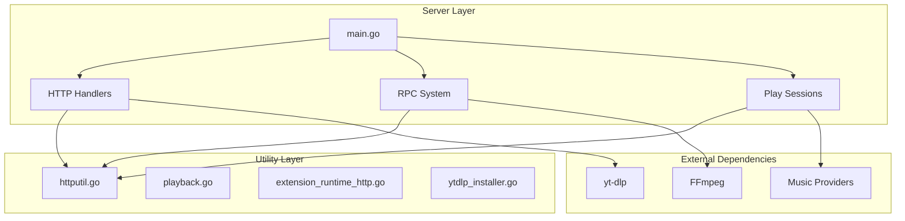
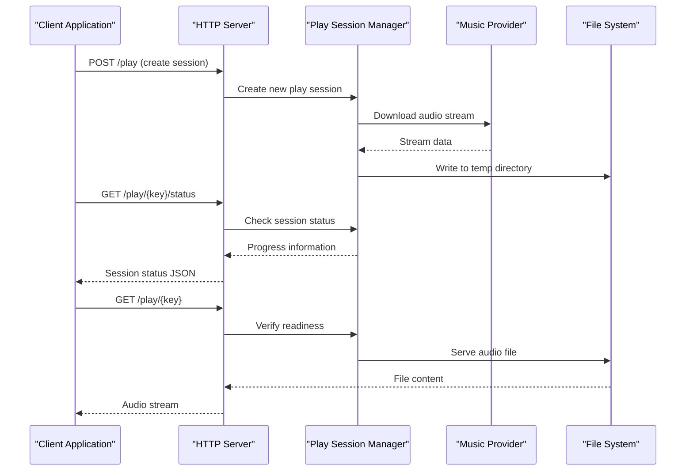
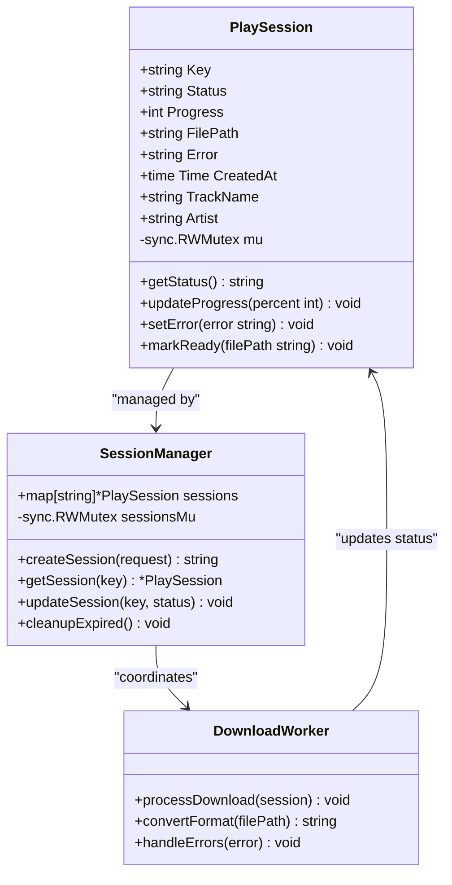
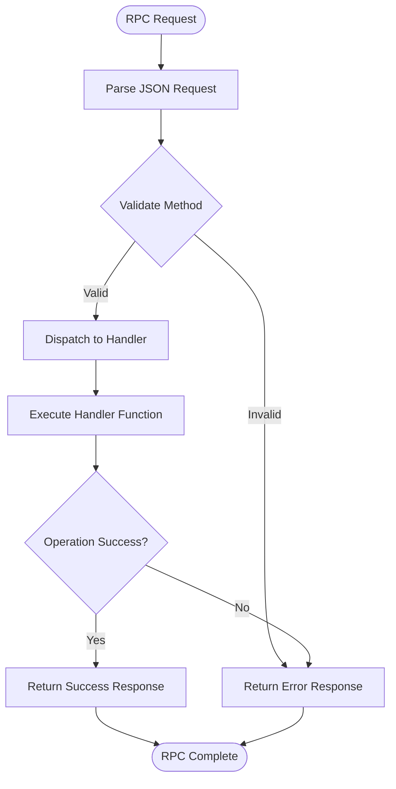
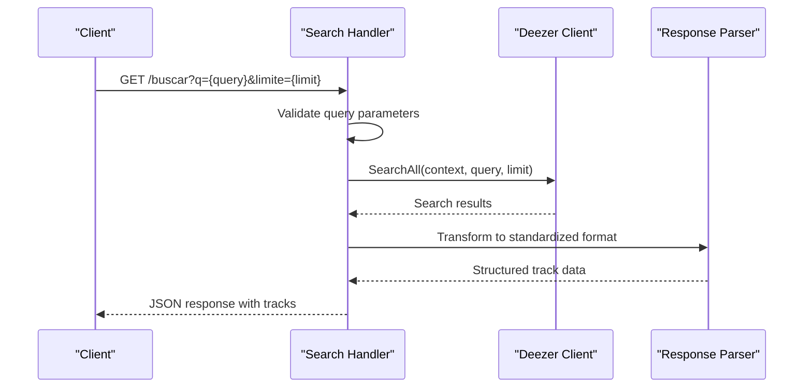
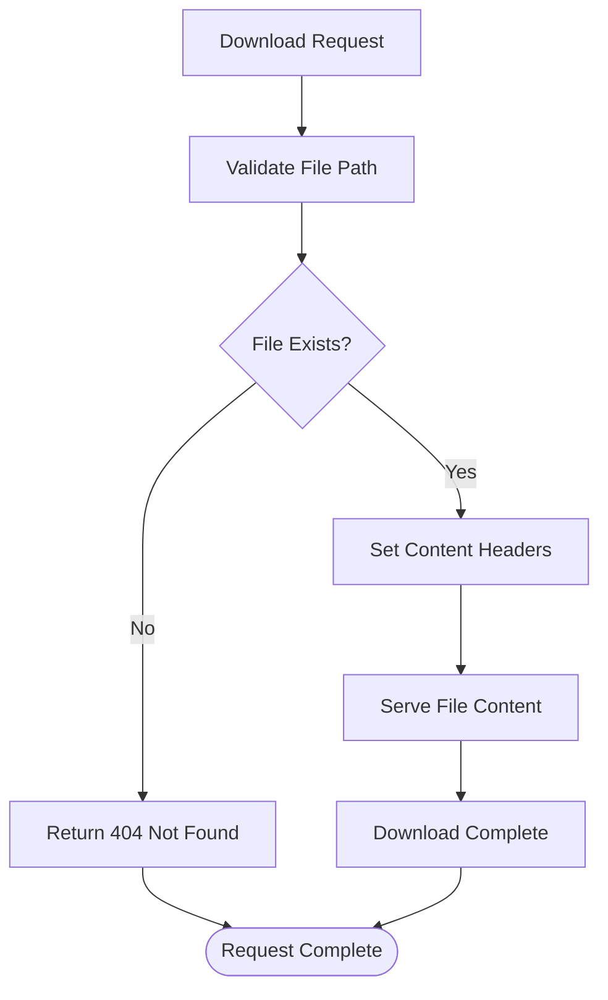
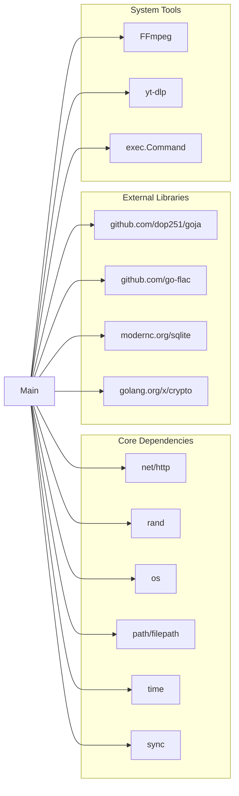

# HTTP Server Implementation

<cite>
**Referenced Files in This Document**
- [main.go](file://go_backend_spotiflac/cmd/server/main.go)
- [httputil.go](file://go_backend_spotiflac/httputil.go)
- [playback.go](file://go_backend_spotiflac/playback.go)
- [extension_runtime_http.go](file://go_backend_spotiflac/extension_runtime_http.go)
- [ytdlp_installer.go](file://go_backend_spotiflac/ytdlp_installer.go)
- [go.mod](file://go_backend_spotiflac/go.mod)
- [README_FINAL.md](file://README_FINAL.md)
</cite>

## Table of Contents
1. [Introduction](#introduction)
2. [Project Structure](#project-structure)
3. [Core Components](#core-components)
4. [Architecture Overview](#architecture-overview)
5. [Detailed Component Analysis](#detailed-component-analysis)
6. [Dependency Analysis](#dependency-analysis)
7. [Performance Considerations](#performance-considerations)
8. [Troubleshooting Guide](#troubleshooting-guide)
9. [Conclusion](#conclusion)

## Introduction
This document provides comprehensive documentation for the HTTP server implementation in the SpotiFLAC project. The server serves as a backend service for audio streaming, download management, and inter-process communication. It handles search requests, manages play sessions for streaming downloads, provides an HTTP RPC system for internal communication, and integrates with external tools like FFmpeg and yt-dlp.

## Project Structure
The HTTP server is implemented in the Go backend module with the following key components:

**Diagram sources**
- [main.go:107-134](file://go_backend_spotiflac/cmd/server/main.go#L107-L134)
- [httputil.go:64-103](file://go_backend_spotiflac/httputil.go#L64-L103)
- [playback.go:41-71](file://go_backend_spotiflac/playback.go#L41-L71)

**Section sources**
- [main.go:107-134](file://go_backend_spotiflac/cmd/server/main.go#L107-L134)
- [go.mod:1-39](file://go_backend_spotiflac/go.mod#L1-39)

## Core Components

### Server Startup and Initialization
The HTTP server initializes with automatic configuration of essential dependencies:

- **Port Configuration**: Reads from PORT environment variable with default fallback to 55009
- **Temporary Directory Setup**: Creates system temp directory for audio processing
- **FFmpeg Auto-installation**: Automatically downloads and configures FFmpeg on Windows
- **yt-dlp Integration**: Ensures yt-dlp availability for YouTube video processing

**Section sources**
- [main.go:107-134](file://go_backend_spotiflac/cmd/server/main.go#L107-L134)
- [main.go:42-49](file://go_backend_spotiflac/cmd/server/main.go#L42-L49)
- [main.go:59-105](file://go_backend_spotiflac/cmd/server/main.go#L59-L105)
- [ytdlp_installer.go:36-87](file://go_backend_spotiflac/ytdlp_installer.go#L36-L87)

### Endpoint Routing System
The server uses Go's built-in ServeMux with the following routes:

| Route | Method | Purpose |
|-------|--------|---------|
| `/` | GET | Server health check and status |
| `/buscar` | GET | Music search functionality |
| `/rpc` | POST | Inter-process communication |
| `/play/{key}` | POST/GET | Session creation and management |
| `/play/{key}/status` | GET | Session status monitoring |
| `/dl/{filename}` | GET | Audio file download |

**Section sources**
- [main.go:124-129](file://go_backend_spotiflac/cmd/server/main.go#L124-L129)
- [main.go:136-270](file://go_backend_spotiflac/cmd/server/main.go#L136-L270)
- [main.go:272-286](file://go_backend_spotiflac/cmd/server/main.go#L272-L286)

### HTTP Utility Layer
The HTTP utility module provides robust networking capabilities:

- **Connection Pooling**: Optimized transport configurations with configurable timeouts
- **Retry Mechanisms**: Intelligent retry logic with exponential backoff
- **ISP Blocking Detection**: Automatic detection and logging of network restrictions
- **User Agent Rotation**: Dynamic user agent generation to prevent blocking

**Section sources**
- [httputil.go:64-103](file://go_backend_spotiflac/httputil.go#L64-L103)
- [httputil.go:249-345](file://go_backend_spotiflac/httputil.go#L249-L345)
- [httputil.go:524-535](file://go_backend_spotiflac/httputil.go#L524-L535)

## Architecture Overview

**Diagram sources**
- [main.go:136-270](file://go_backend_spotiflac/cmd/server/main.go#L136-L270)
- [main.go:272-286](file://go_backend_spotiflac/cmd/server/main.go#L272-L286)

## Detailed Component Analysis

### Play Session Management System

The play session system provides real-time streaming with comprehensive lifecycle management:

**Diagram sources**
- [main.go:24-34](file://go_backend_spotiflac/cmd/server/main.go#L24-L34)
- [main.go:36-40](file://go_backend_spotiflac/cmd/server/main.go#L36-L40)
- [main.go:136-221](file://go_backend_spotiflac/cmd/server/main.go#L136-L221)

#### Session Lifecycle Operations

| Operation | Description | Status Changes |
|-----------|-------------|----------------|
| Creation | POST /play with track metadata | downloading → ready/error |
| Status Check | GET /play/{key}/status | Progress tracking |
| Streaming | GET /play/{key} | File serving |
| Cleanup | Automatic expiration | Memory cleanup |

**Section sources**
- [main.go:136-270](file://go_backend_spotiflac/cmd/server/main.go#L136-L270)
- [main.go:24-34](file://go_backend_spotiflac/cmd/server/main.go#L24-L34)

### HTTP RPC System

The RPC system provides a unified interface for internal operations:

**Diagram sources**
- [main.go:359-385](file://go_backend_spotiflac/cmd/server/main.go#L359-L385)
- [main.go:555-1455](file://go_backend_spotiflac/cmd/server/main.go#L555-L1455)

#### RPC Method Categories

The system supports extensive functionality organized into categories:

| Category | Methods | Purpose |
|----------|---------|---------|
| Core | ping, InitMasterDatabaseJSON, exitApp | Basic system operations |
| Premium | validarCodigoPremium, verificarPremium | Premium account management |
| Downloads | downloadByStrategy, getDownloadProgress | Audio download management |
| Metadata | fetchLyrics, getLyricsLRC, readAudioMetadata | Audio metadata operations |
| Extensions | initExtensionSystem, loadExtensionsFromDir | Extension management |
| Playback | playbackPlayTrack, playbackPause, playbackSeek | Audio playback control |
| Statistics | getTotalStats, getTopTracks, incrementPlayCount | Usage analytics |

**Section sources**
- [main.go:555-1455](file://go_backend_spotiflac/cmd/server/main.go#L555-L1455)

### Search Endpoint Implementation

The search endpoint provides music discovery with provider integration:

**Diagram sources**
- [main.go:297-347](file://go_backend_spotiflac/cmd/server/main.go#L297-L347)

**Section sources**
- [main.go:297-347](file://go_backend_spotiflac/cmd/server/main.go#L297-L347)

### Download Endpoint

The download endpoint serves pre-processed audio files:

**Diagram sources**
- [main.go:272-286](file://go_backend_spotiflac/cmd/server/main.go#L272-L286)

**Section sources**
- [main.go:272-286](file://go_backend_spotiflac/cmd/server/main.go#L272-L286)

## Dependency Analysis

**Diagram sources**
- [go.mod:7-18](file://go_backend_spotiflac/go.mod#L7-L18)
- [main.go:3-22](file://go_backend_spotiflac/cmd/server/main.go#L3-L22)

**Section sources**
- [go.mod:1-39](file://go_backend_spotiflac/go.mod#L1-L39)

## Performance Considerations

### Concurrency and Resource Management

The server implements several strategies for optimal concurrent request processing:

- **Connection Pooling**: Shared HTTP clients with configurable pool sizes
- **Memory Management**: Temporary directory cleanup and session expiration
- **Streaming Responses**: Direct file serving without loading entire files into memory
- **Background Processing**: Asynchronous download operations prevent blocking

### Network Optimization

- **Keep-Alive Connections**: Persistent connections reduce overhead
- **Timeout Configuration**: Separate timeouts for different operation types
- **Retry Logic**: Intelligent retry with exponential backoff for transient failures
- **ISP Detection**: Automatic detection and mitigation of network restrictions

### Storage and File Handling

- **Separate Temp Directories**: Isolated storage for active downloads vs. ready files
- **Atomic Operations**: File renaming prevents partial file access
- **Cleanup Mechanisms**: Automatic removal of expired sessions and temporary files

**Section sources**
- [httputil.go:64-103](file://go_backend_spotiflac/httputil.go#L64-L103)
- [main.go:217-220](file://go_backend_spotiflac/cmd/server/main.go#L217-L220)

## Troubleshooting Guide

### Common Issues and Solutions

#### FFmpeg Installation Problems
- **Issue**: FFmpeg not found during startup
- **Solution**: Server automatically attempts to download FFmpeg for Windows
- **Manual Fix**: Ensure ffmpeg.exe is in executable directory or PATH

#### yt-dlp Availability
- **Issue**: YouTube functionality unavailable
- **Solution**: Server checks PATH and local installation
- **Manual Fix**: Install yt-dlp globally or place in executable directory

#### Network Connectivity Issues
- **ISP Blocking**: Automatic detection logs blocking patterns
- **Rate Limiting**: Built-in retry logic with backoff
- **Timeouts**: Configurable client timeouts for different operation types

#### Session Management Issues
- **Expired Sessions**: Automatic cleanup of inactive sessions
- **File Access Errors**: Proper error handling for missing files
- **Memory Leaks**: RWMutex protection for concurrent access

**Section sources**
- [main.go:59-105](file://go_backend_spotiflac/cmd/server/main.go#L59-L105)
- [ytdlp_installer.go:36-87](file://go_backend_spotiflac/ytdlp_installer.go#L36-L87)
- [httputil.go:524-535](file://go_backend_spotiflac/httputil.go#L524-L535)

### Monitoring and Debugging

The server provides comprehensive logging for troubleshooting:

- **Startup Messages**: Port binding and dependency initialization
- **Request Logging**: Endpoint access with timing information
- **Error Tracking**: Detailed error messages with stack traces
- **Performance Metrics**: Response times and resource usage

**Section sources**
- [main.go:107-134](file://go_backend_spotiflac/cmd/server/main.go#L107-L134)
- [httputil.go:240-247](file://go_backend_spotiflac/httputil.go#L240-L247)

## Conclusion

The HTTP server implementation provides a robust foundation for audio streaming and download management. Its modular design supports extensibility through the RPC system and extension framework. The server's automatic dependency management, comprehensive error handling, and performance optimizations make it suitable for production deployment while maintaining flexibility for future enhancements.

Key strengths include:
- Comprehensive session management for streaming downloads
- Unified RPC system for internal operations
- Automatic dependency installation and configuration
- Robust error handling and network resilience
- Efficient resource management and cleanup

The architecture supports both development and production environments with minimal configuration requirements.