# Data Flow Architecture

<cite>
**Referenced Files in This Document**
- [main.dart](file://lib/main.dart)
- [app.dart](file://lib/app.dart)
- [platform_bridge.dart](file://lib/services/platform_bridge.dart)
- [download_queue_provider.dart](file://lib/providers/download_queue_provider.dart)
- [local_library_provider.dart](file://lib/providers/local_library_provider.dart)
- [extension_provider.dart](file://lib/providers/extension_provider.dart)
- [download_request_payload.dart](file://lib/services/download_request_payload.dart)
- [main.go](file://go_backend_spotiflac/cmd/server/main.go)
- [progress.go](file://go_backend_spotiflac/progress.go)
- [extension_runtime_http.go](file://go_backend_spotiflac/extension_runtime_http.go)
- [extension_timeout.go](file://go_backend_spotiflac/extension_timeout.go)
- [extension_perf.go](file://go_backend_spotiflac/extension_perf.go)
- [extension_providers.go](file://go_backend_spotiflac/extension_providers.go)
- [extension_runtime_binary.go](file://go_backend_spotiflac/extension_runtime_binary.go)
- [README_FINAL.md](file://README_FINAL.md)
- [FINAL_STATUS.md](file://FINAL_STATUS.md)
- [run_windows.bat](file://run_windows.bat)
</cite>

## Table of Contents
1. [Introduction](#introduction)
2. [Project Structure](#project-structure)
3. [Core Components](#core-components)
4. [Architecture Overview](#architecture-overview)
5. [Detailed Component Analysis](#detailed-component-analysis)
6. [Dependency Analysis](#dependency-analysis)
7. [Performance Considerations](#performance-considerations)
8. [Troubleshooting Guide](#troubleshooting-guide)
9. [Conclusion](#conclusion)
10. [Appendices](#appendices)

## Introduction
This document explains the data flow architecture of the hybrid system spanning Flutter UI, platform bridges, and the Go backend. It covers the end-to-end request/response cycles, event streaming for progress updates, state synchronization patterns, caching strategies, data transformations across layers, error propagation, and practical user workflows such as search, download, and library management. The system supports both mobile platforms (via MethodChannel) and desktop environments (via an embedded HTTP RPC server), enabling bidirectional asynchronous communication.

## Project Structure
The system is organized into three primary layers:
- Flutter frontend (Dart) with Riverpod state management
- Platform bridge abstraction handling mobile/desktop transport
- Go backend providing core services, extension runtime, and HTTP RPC

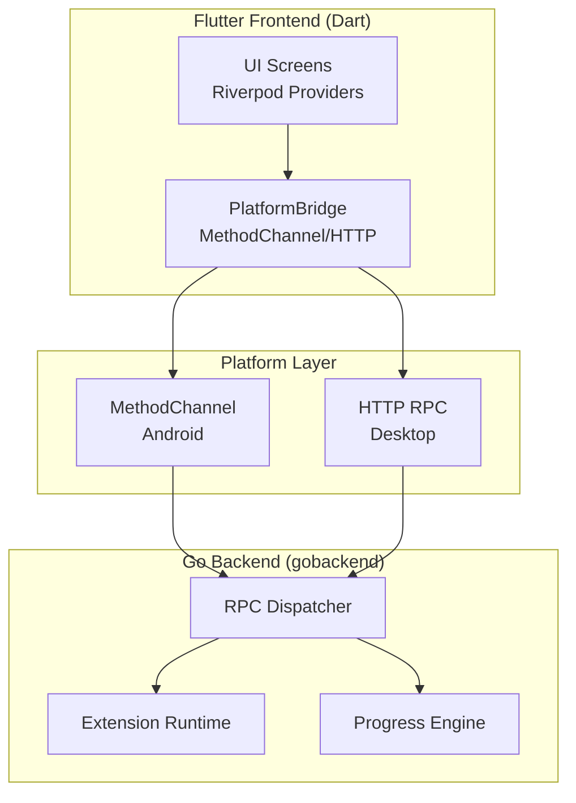

**Diagram sources**
- [platform_bridge.dart:44-81](file://lib/services/platform_bridge.dart#L44-L81)
- [main.go:124-134](file://go_backend_spotiflac/cmd/server/main.go#L124-L134)
- [progress.go:1-66](file://go_backend_spotiflac/progress.go#L1-L66)

**Section sources**
- [README_FINAL.md:75-126](file://README_FINAL.md#L75-L126)
- [FINAL_STATUS.md:79-126](file://FINAL_STATUS.md#L79-L126)

## Core Components
- PlatformBridge: Orchestrates invocation over MethodChannel (mobile) or HTTP RPC (desktop), with caching and in-flight request deduplication.
- RPC Server: Exposes a JSON-RPC endpoint for desktop environments and routes commands to the Go backend dispatcher.
- Progress Engine: Maintains multi-item progress deltas with sequence-based change tracking for efficient UI updates.
- Extension Runtime: Provides a sandboxed JavaScript execution environment with HTTP helpers and timeouts.
- Riverpod Providers: Manage UI state for downloads, library, and extensions, coordinating with PlatformBridge.

**Section sources**
- [platform_bridge.dart:44-81](file://lib/services/platform_bridge.dart#L44-L81)
- [main.go:359-385](file://go_backend_spotiflac/cmd/server/main.go#L359-L385)
- [progress.go:1-66](file://go_backend_spotiflac/progress.go#L1-L66)
- [extension_runtime_http.go:329-435](file://go_backend_spotiflac/extension_runtime_http.go#L329-L435)

## Architecture Overview
The hybrid architecture separates UI concerns from backend logic. On mobile, Flutter communicates with native Kotlin/Java via MethodChannel. On desktop, Flutter starts a local HTTP server and invokes RPC endpoints. The Go backend exposes a dispatcher that routes requests to specialized handlers for downloads, metadata, lyrics, and extension management. Progress updates are streamed to the UI either via EventChannels (mobile) or periodic polling (desktop).

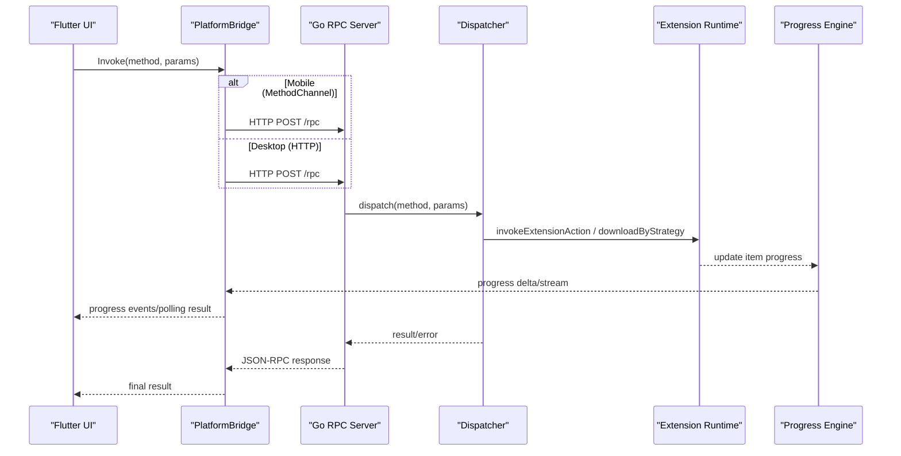

**Diagram sources**
- [platform_bridge.dart:44-81](file://lib/services/platform_bridge.dart#L44-L81)
- [main.go:359-385](file://go_backend_spotiflac/cmd/server/main.go#L359-L385)
- [progress.go:156-194](file://go_backend_spotiflac/progress.go#L156-L194)

## Detailed Component Analysis

### PlatformBridge: Transport Abstraction and Caching
- Transport selection: Uses MethodChannel on mobile; switches to HTTP RPC on desktop after initializing the backend process.
- HTTP RPC: Sends JSON-RPC requests to the local server and parses responses, propagating errors.
- Caching: Implements in-memory and persistent caches for availability/metadata lookups with TTL and canonicalization.
- In-flight deduplication: Prevents duplicate concurrent requests for the same cache key.
- Event streams: Exposes broadcast streams for download and library scan progress; falls back to polling on desktop.

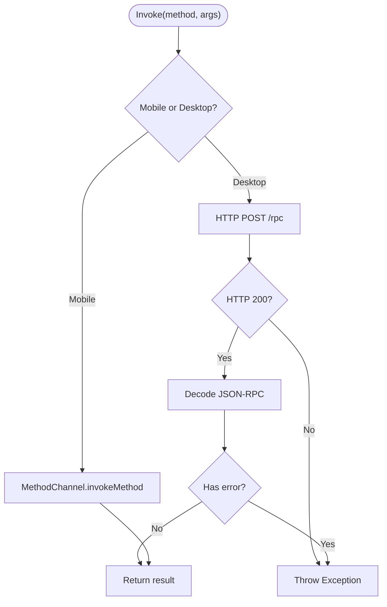

**Diagram sources**
- [platform_bridge.dart:44-81](file://lib/services/platform_bridge.dart#L44-L81)

**Section sources**
- [platform_bridge.dart:241-283](file://lib/services/platform_bridge.dart#L241-L283)
- [platform_bridge.dart:415-432](file://lib/services/platform_bridge.dart#L415-L432)
- [platform_bridge.dart:618-637](file://lib/services/platform_bridge.dart#L618-L637)

### RPC Server and Dispatcher
- Routes JSON-RPC requests to backend handlers for downloads, metadata, lyrics, extension management, and playback.
- Handles HTTP GET/POST semantics for search and streaming endpoints.
- Provides session-based playback with status checks and file serving.

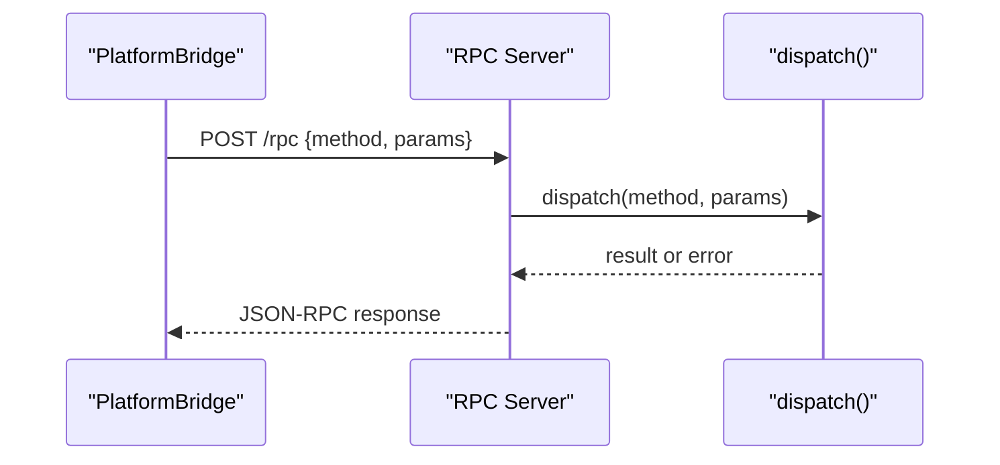

**Diagram sources**
- [main.go:359-385](file://go_backend_spotiflac/cmd/server/main.go#L359-L385)

**Section sources**
- [main.go:297-347](file://go_backend_spotiflac/cmd/server/main.go#L297-L347)
- [main.go:136-270](file://go_backend_spotiflac/cmd/server/main.go#L136-L270)

### Progress Engine and Streaming
- Tracks per-item progress with bytes total/received, speed, status, and revision sequencing.
- Emits deltas since last sequence number to minimize payload size and UI churn.
- Supports both real-time streams (EventChannel) and polling fallback.

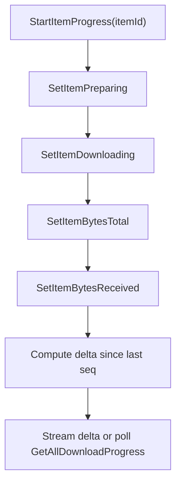

**Diagram sources**
- [progress.go:207-265](file://go_backend_spotiflac/progress.go#L207-L265)
- [progress.go:156-194](file://go_backend_spotiflac/progress.go#L156-L194)

**Section sources**
- [progress.go:1-66](file://go_backend_spotiflac/progress.go#L1-L66)
- [download_queue_provider.dart:2341-2384](file://lib/providers/download_queue_provider.dart#L2341-L2384)

### Extension Runtime and HTTP Helpers
- Sandboxed JavaScript execution with timeout recovery and performance metrics.
- HTTP helpers validate domains against extension permissions and enforce response size limits.
- Binary decoding utilities support various encodings for extension payloads.

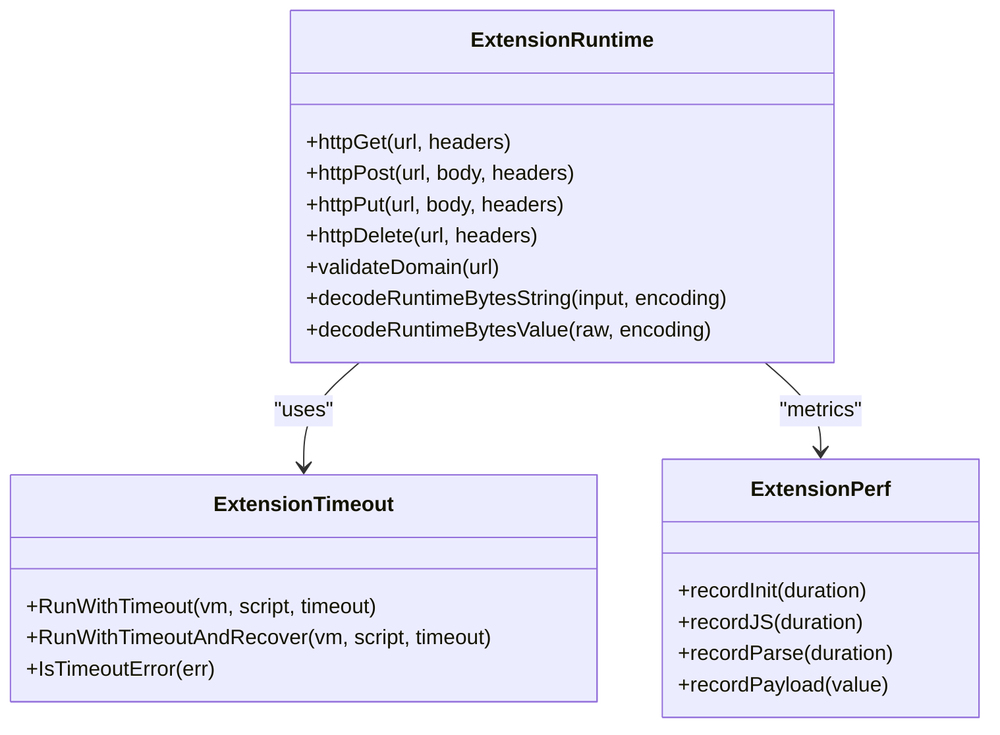

**Diagram sources**
- [extension_runtime_http.go:329-435](file://go_backend_spotiflac/extension_runtime_http.go#L329-L435)
- [extension_timeout.go:120-141](file://go_backend_spotiflac/extension_timeout.go#L120-L141)
- [extension_perf.go:1-71](file://go_backend_spotiflac/extension_perf.go#L1-L71)
- [extension_runtime_binary.go:132-179](file://go_backend_spotiflac/extension_runtime_binary.go#L132-L179)

**Section sources**
- [extension_providers.go:619-671](file://go_backend_spotiflac/extension_providers.go#L619-L671)

### Riverpod Providers: State Synchronization
- Download Queue Provider: Manages download lifecycle, progress polling/streaming, and UI state updates.
- Local Library Provider: Coordinates library scanning progress via streams and maintains state for UI rendering.
- Extension Provider: Loads and manages extension metadata, priorities, and capabilities.

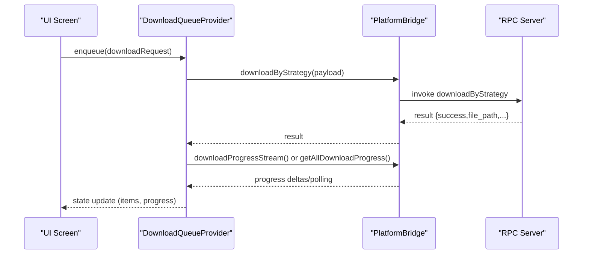

**Diagram sources**
- [download_queue_provider.dart:2341-2384](file://lib/providers/download_queue_provider.dart#L2341-L2384)
- [platform_bridge.dart:565-606](file://lib/services/platform_bridge.dart#L565-L606)

**Section sources**
- [download_queue_provider.dart:1-200](file://lib/providers/download_queue_provider.dart#L1-L200)
- [local_library_provider.dart:1-200](file://lib/providers/local_library_provider.dart#L1-L200)
- [extension_provider.dart:1-200](file://lib/providers/extension_provider.dart#L1-L200)

### Data Transformation Between Layers
- Payload normalization: DownloadRequestPayload encapsulates all metadata and preferences for consistent downstream processing.
- JSON serialization/deserialization: PlatformBridge converts Dart objects to JSON strings for transport; Go backend decodes and validates parameters.
- Metadata enrichment: Extensions can augment metadata and lyrics, with results integrated back into the UI.

**Section sources**
- [download_request_payload.dart:1-217](file://lib/services/download_request_payload.dart#L1-L217)
- [platform_bridge.dart:565-606](file://lib/services/platform_bridge.dart#L565-L606)

### Error Propagation Mechanisms
- HTTP RPC: Errors returned as JSON-RPC error fields propagate to Dart exceptions.
- MethodChannel: Errors are surfaced to Dart via platform exceptions.
- Extension runtime: Timeout detection and recovery prevent VM hangs; errors are captured and returned to callers.
- UI handling: Consumers surface user-friendly messages for rate limits and parsing failures.

**Section sources**
- [platform_bridge.dart:75-80](file://lib/services/platform_bridge.dart#L75-L80)
- [extension_timeout.go:120-141](file://go_backend_spotiflac/extension_timeout.go#L120-L141)
- [main_shell.dart:134-150](file://lib/screens/main_shell.dart#L134-L150)

## Dependency Analysis
The system exhibits loose coupling between UI and backend:
- UI depends on Riverpod providers and PlatformBridge.
- PlatformBridge abstracts transport details from UI.
- Go backend is self-contained and accessed via RPC or MethodChannel.
- Extensions depend on the extension runtime and permissions model.

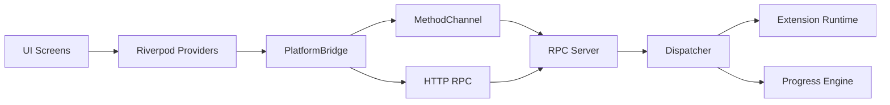

**Diagram sources**
- [platform_bridge.dart:44-81](file://lib/services/platform_bridge.dart#L44-L81)
- [main.go:124-134](file://go_backend_spotiflac/cmd/server/main.go#L124-L134)

**Section sources**
- [platform_bridge.dart:44-81](file://lib/services/platform_bridge.dart#L44-L81)
- [main.go:124-134](file://go_backend_spotiflac/cmd/server/main.go#L124-L134)

## Performance Considerations
- Progress batching: MultiProgress deltas reduce bandwidth and UI update frequency.
- Polling fallback: Download progress polling is optimized with idle thresholds and error caps.
- Extension timeouts: Controlled execution prevents long-running scripts from blocking the VM.
- Caching: TTL-based in-memory and persistent caches reduce redundant network calls.

[No sources needed since this section provides general guidance]

## Troubleshooting Guide
Common issues and remedies:
- Backend startup failures on desktop: Verify Go toolchain and build script; ensure port availability.
- MethodChannel errors on mobile: Confirm plugin registration and channel name consistency.
- Rate limiting and parsing errors: UI surfaces user-friendly messages; inspect logs for underlying causes.
- Progress stream timeouts: Provider automatically falls back to polling after a bootstrap timeout.

**Section sources**
- [run_windows.bat:1-14](file://run_windows.bat#L1-L14)
- [platform_bridge.dart:174-208](file://lib/services/platform_bridge.dart#L174-L208)
- [download_queue_provider.dart:2329-2339](file://lib/providers/download_queue_provider.dart#L2329-L2339)
- [main_shell.dart:134-150](file://lib/screens/main_shell.dart#L134-L150)

## Conclusion
The hybrid system cleanly separates UI, transport, and backend concerns. Flutter UI interacts with a unified PlatformBridge abstraction, which routes requests to either mobile MethodChannel or desktop HTTP RPC. The Go backend centralizes processing, extension management, and progress tracking, exposing a robust RPC interface. Caching, streaming, and polling ensure responsive UI updates, while error propagation and timeouts maintain reliability across asynchronous operations.

[No sources needed since this section summarizes without analyzing specific files]

## Appendices

### Typical Workflows

#### Search Workflow
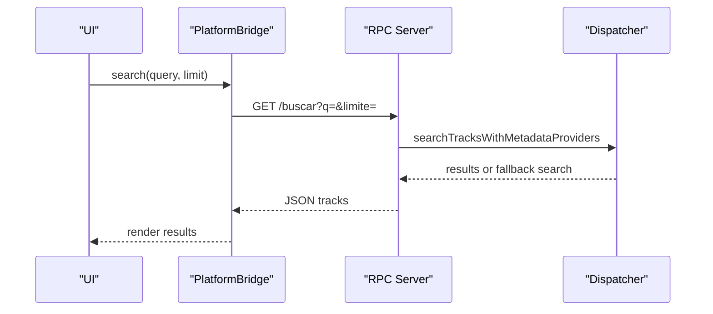

**Diagram sources**
- [main.go:297-347](file://go_backend_spotiflac/cmd/server/main.go#L297-L347)

#### Download Workflow
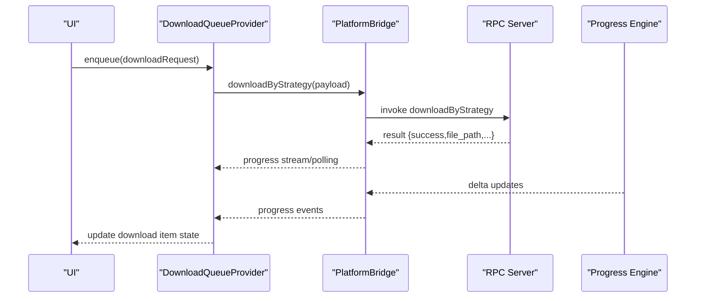

**Diagram sources**
- [platform_bridge.dart:565-606](file://lib/services/platform_bridge.dart#L565-L606)
- [download_queue_provider.dart:2341-2384](file://lib/providers/download_queue_provider.dart#L2341-L2384)
- [progress.go:156-194](file://go_backend_spotiflac/progress.go#L156-L194)

#### Library Management Workflow
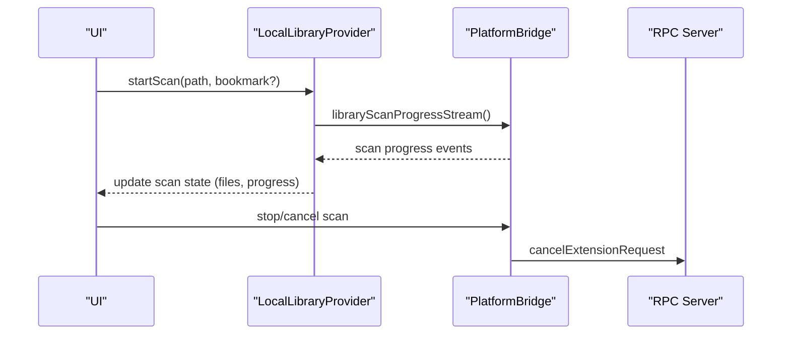

**Diagram sources**
- [local_library_provider.dart:172-200](file://lib/providers/local_library_provider.dart#L172-L200)
- [platform_bridge.dart:618-637](file://lib/services/platform_bridge.dart#L618-L637)