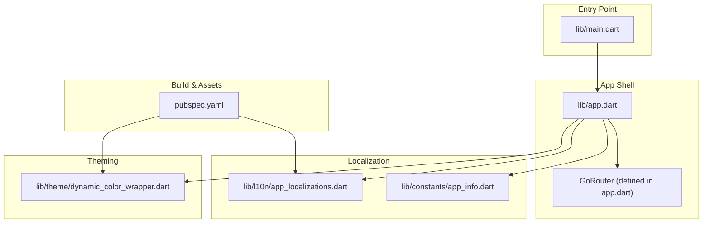
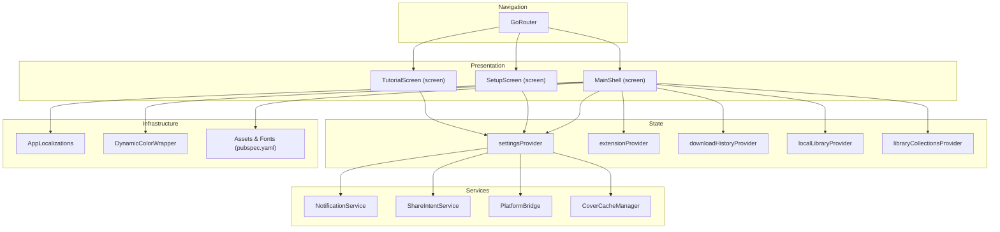
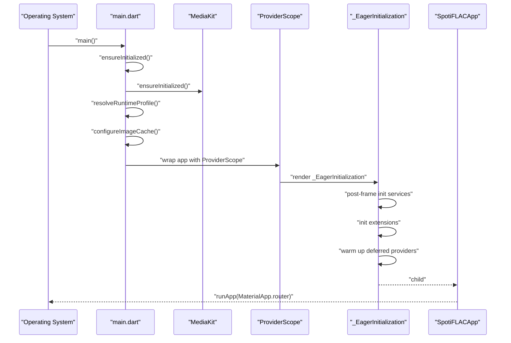
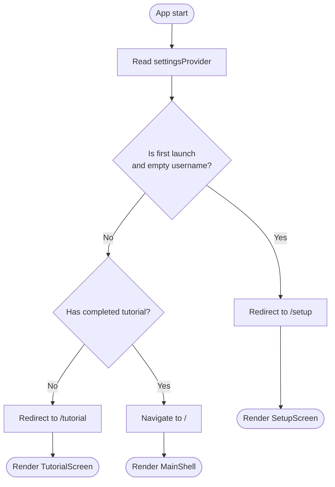
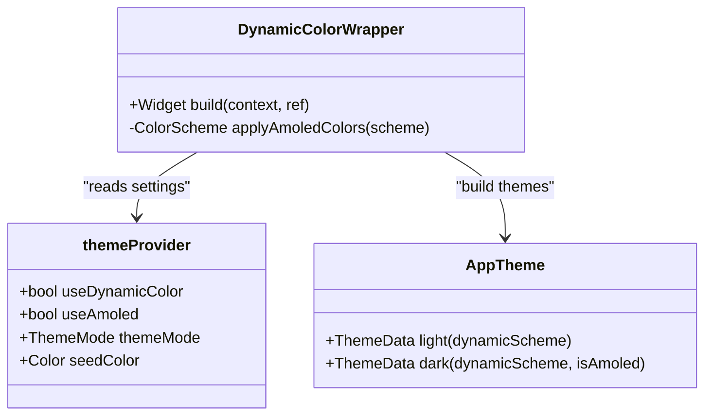
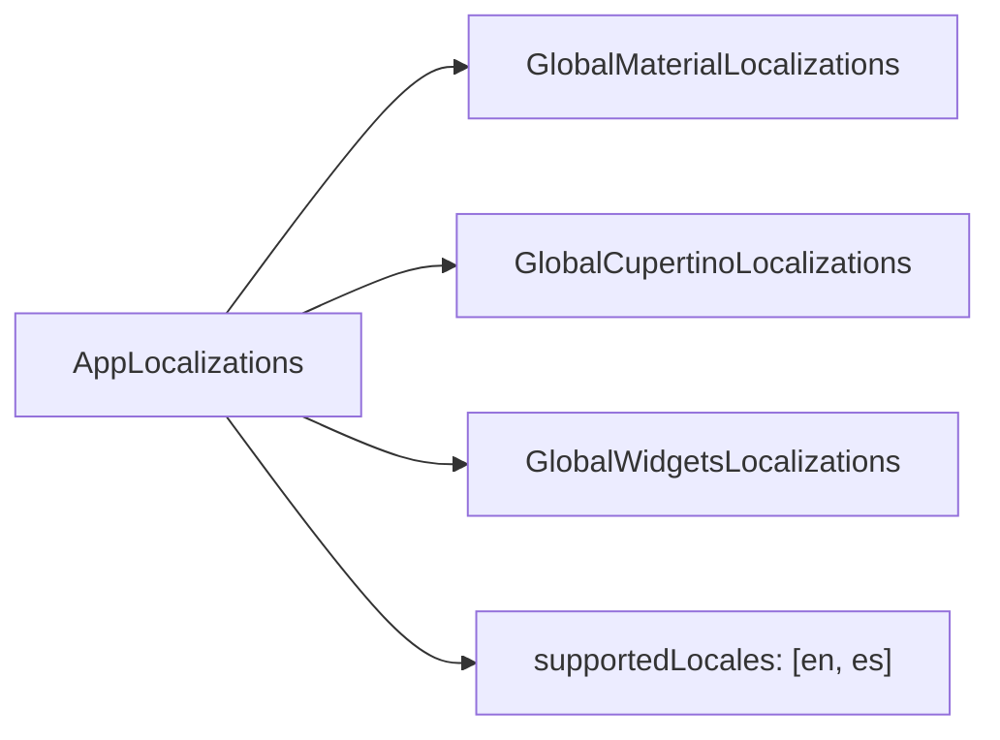
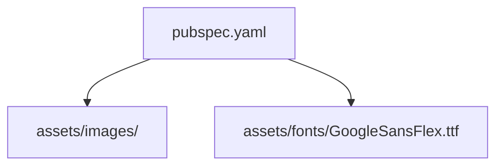
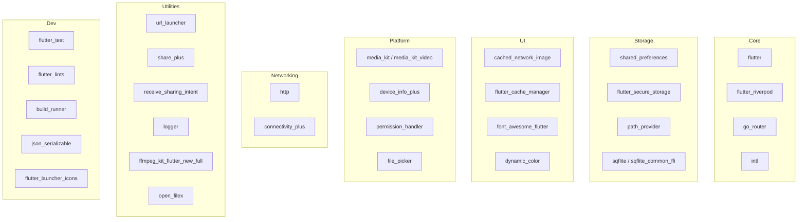

# Flutter Application Structure

<cite>
**Referenced Files in This Document**
- [main.dart](file://lib/main.dart)
- [app.dart](file://lib/app.dart)
- [pubspec.yaml](file://pubspec.yaml)
- [app_info.dart](file://lib/constants/app_info.dart)
- [dynamic_color_wrapper.dart](file://lib/theme/dynamic_color_wrapper.dart)
- [app_localizations.dart](file://lib/l10n/app_localizations.dart)
</cite>

## Table of Contents
1. [Introduction](#introduction)
2. [Project Structure](#project-structure)
3. [Core Components](#core-components)
4. [Architecture Overview](#architecture-overview)
5. [Detailed Component Analysis](#detailed-component-analysis)
6. [Dependency Analysis](#dependency-analysis)
7. [Performance Considerations](#performance-considerations)
8. [Troubleshooting Guide](#troubleshooting-guide)
9. [Conclusion](#conclusion)

## Introduction
This document explains the Flutter application structure of the Bitly project, focusing on how the codebase is organized, how initialization and bootstrapping work, and how different modules are separated. It covers the main entry point, the application shell, routing, localization, theming, and asset management. The goal is to help developers understand the rationale behind the chosen directory structure and how to maintain and extend the application effectively.

## Project Structure
The Bitly Flutter application follows a conventional Flutter project layout with a dedicated lib directory containing feature-oriented modules. The structure emphasizes separation of concerns and scalability.

Key directories and their roles:
- lib/main.dart: Application entry point that initializes platform-specific services, Riverpod providers, and the app shell.
- lib/app.dart: Defines the application shell, routing, and global configuration such as localization and theme.
- lib/constants/: Holds immutable application metadata (e.g., app name, version).
- lib/l10n/: Localization delegates and generated translation files for internationalization.
- lib/theme/: Theming utilities and dynamic color wrapper for Material You support.
- lib/providers/: State management providers (Riverpod) for app-wide state.
- lib/screens/: Feature screens and navigation targets.
- lib/services/: Platform bridges, notifications, and other service integrations.
- lib/models/: Data models and serialization definitions.
- lib/widgets/: Reusable UI components.
- lib/utils/: Utility helpers and cross-cutting concerns.
- pubspec.yaml: Build configuration, dependencies, and asset declarations.

**Diagram sources**
- [main.dart](file://lib/main.dart)
- [app.dart](file://lib/app.dart)
- [app_localizations.dart](file://lib/l10n/app_localizations.dart)
- [app_info.dart](file://lib/constants/app_info.dart)
- [dynamic_color_wrapper.dart](file://lib/theme/dynamic_color_wrapper.dart)
- [pubspec.yaml](file://pubspec.yaml)

**Section sources**
- [main.dart](file://lib/main.dart)
- [app.dart](file://lib/app.dart)
- [pubspec.yaml](file://pubspec.yaml)

## Core Components
This section documents the main building blocks of the application and how they fit together during initialization and runtime.

- Application entry point (main.dart):
  - Initializes Flutter binding and ensures platform-specific libraries are ready.
  - Configures image caching based on runtime profile (device capabilities).
  - Bootstraps Riverpod providers and the app shell.
  - Eagerly initializes services and extensions after the first frame.

- Application shell (app.dart):
  - Provides a Riverpod provider for GoRouter with redirect logic based on settings and first-launch state.
  - Wraps the app with localization delegates and supported locales.
  - Applies dynamic color theming and theme mode selection.
  - Exposes navigation routes for the main shell, setup, and tutorial screens.

- Localization (l10n):
  - Declares supported locales and localization delegates.
  - Integrates with Material and Cupertino localizations for a complete internationalization setup.

- Theming (theme):
  - Uses a dynamic color wrapper to compute light/dark themes from either dynamic color schemes or a seed color.
  - Supports AMOLED adjustments and theme mode persistence.

- Build configuration (pubspec.yaml):
  - Declares SDK version, dependencies, dev dependencies, and asset/font paths.
  - Configures launcher icons and enables code generation.

**Section sources**
- [main.dart](file://lib/main.dart)
- [app.dart](file://lib/app.dart)
- [app_localizations.dart](file://lib/l10n/app_localizations.dart)
- [dynamic_color_wrapper.dart](file://lib/theme/dynamic_color_wrapper.dart)
- [pubspec.yaml](file://pubspec.yaml)

## Architecture Overview
The application uses a layered architecture:
- Presentation layer: Screens and widgets, orchestrated by the app shell and router.
- Navigation layer: GoRouter manages routes and redirects based on app state.
- State layer: Riverpod providers manage app-wide state and deferred initialization.
- Services layer: Platform bridges, notifications, and extension management.
- Infrastructure layer: Localization, theming, and asset management.

**Diagram sources**
- [app.dart](file://lib/app.dart)
- [main.dart](file://lib/main.dart)
- [app_localizations.dart](file://lib/l10n/app_localizations.dart)
- [dynamic_color_wrapper.dart](file://lib/theme/dynamic_color_wrapper.dart)
- [pubspec.yaml](file://pubspec.yaml)

## Detailed Component Analysis

### Entry Point Initialization Flow
The entry point performs platform detection, image cache tuning, eager initialization of services and providers, and app bootstrap.

**Diagram sources**
- [main.dart](file://lib/main.dart)

**Section sources**
- [main.dart](file://lib/main.dart)

### Routing and Navigation
The app defines a router with redirect logic based on settings and first-launch state. Routes include the main shell, setup, and tutorial screens.

**Diagram sources**
- [app.dart](file://lib/app.dart)

**Section sources**
- [app.dart](file://lib/app.dart)

### Theming and Dynamic Color
The dynamic color wrapper computes light/dark themes from dynamic color schemes or a seed color, with optional AMOLED adjustments.

**Diagram sources**
- [dynamic_color_wrapper.dart](file://lib/theme/dynamic_color_wrapper.dart)

**Section sources**
- [dynamic_color_wrapper.dart](file://lib/theme/dynamic_color_wrapper.dart)

### Localization Setup
Localization integrates with Material and Cupertino localizations and supports multiple locales.

**Diagram sources**
- [app_localizations.dart](file://lib/l10n/app_localizations.dart)

**Section sources**
- [app_localizations.dart](file://lib/l10n/app_localizations.dart)

### Asset and Font Management
Assets and fonts are declared in pubspec.yaml. The app loads images and custom fonts via Flutter’s asset system.

**Diagram sources**
- [pubspec.yaml](file://pubspec.yaml)

**Section sources**
- [pubspec.yaml](file://pubspec.yaml)

## Dependency Analysis
The application relies on a set of core dependencies for state management, routing, localization, theming, media playback, and platform integration. Dependencies are declared in pubspec.yaml, including development dependencies for code generation.

**Diagram sources**
- [pubspec.yaml](file://pubspec.yaml)

**Section sources**
- [pubspec.yaml](file://pubspec.yaml)

## Performance Considerations
- Image cache sizing: The entry point configures image cache limits based on runtime profile to prevent memory pressure on lower-end devices.
- Deferred provider warmup: Certain providers are warmed up after the first frame with staggered delays to improve perceived performance.
- Desktop backend: On non-mobile platforms, the app initializes FFI-based SQLite and a desktop bridge to enable native-like behavior.
- Theme computation: Dynamic color and AMOLED adjustments are computed lazily and reused via Riverpod providers.

[No sources needed since this section provides general guidance]

## Troubleshooting Guide
- Localization not applied:
  - Ensure supported locales and localization delegates are correctly configured in the app shell.
  - Verify that the app declares supported locales and includes the localization delegates in MaterialApp.

- Theme not updating:
  - Confirm that the dynamic color wrapper reads theme settings and recomputes themes when settings change.
  - Check that theme mode and seed color settings are persisted and observed by the UI.

- Assets not loading:
  - Confirm asset paths in pubspec.yaml match the actual locations.
  - Re-run asset generation if using code-generated assets.

- Router redirect loops:
  - Review redirect logic in the router provider and ensure settingsProvider values are consistent with expected states.

**Section sources**
- [app.dart](file://lib/app.dart)
- [dynamic_color_wrapper.dart](file://lib/theme/dynamic_color_wrapper.dart)
- [pubspec.yaml](file://pubspec.yaml)

## Conclusion
The Bitly Flutter application employs a clean, modular structure that separates presentation, navigation, state, services, and infrastructure concerns. The entry point handles platform-specific initialization and eager setup, while the app shell orchestrates routing, localization, and theming. The pubspec.yaml centralizes build configuration, dependencies, and asset declarations. This organization promotes maintainability, scalability, and ease of testing across platforms.