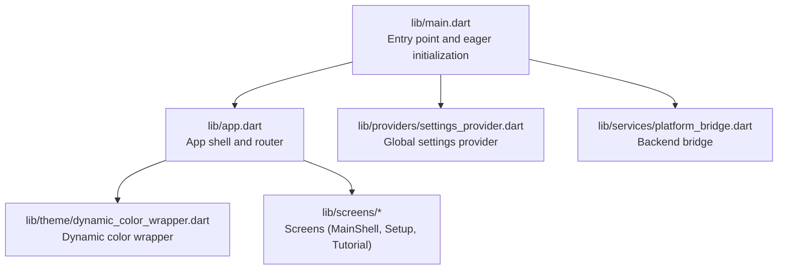
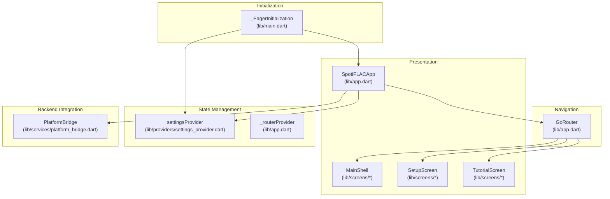
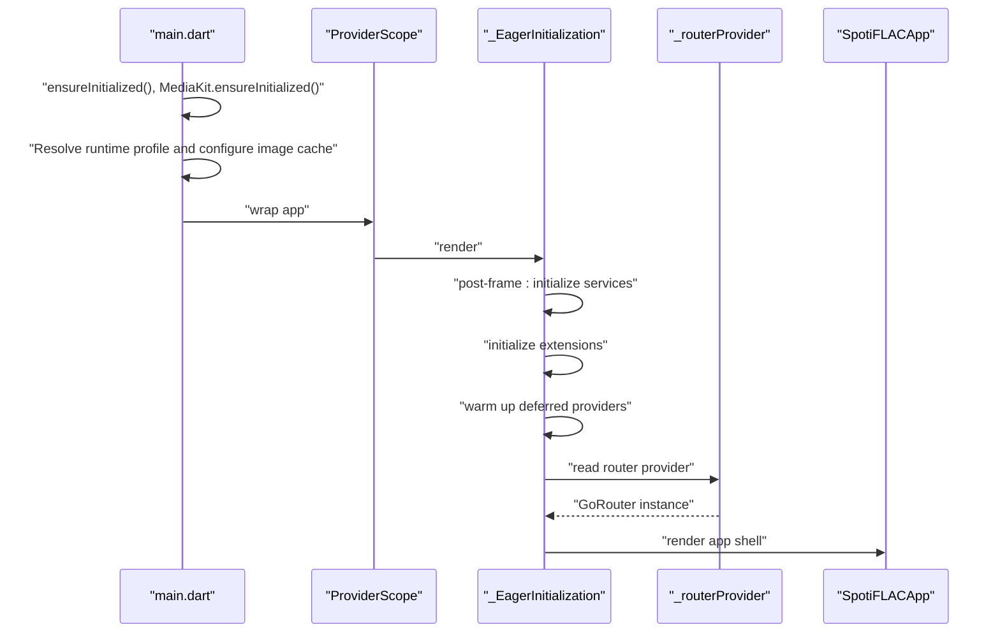
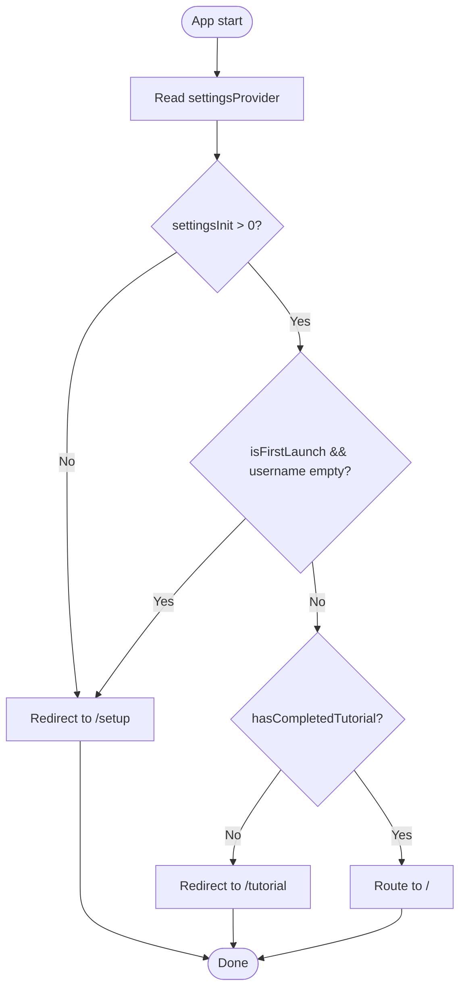
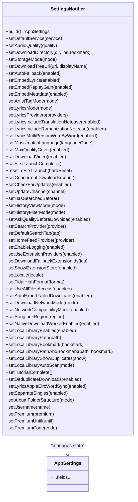
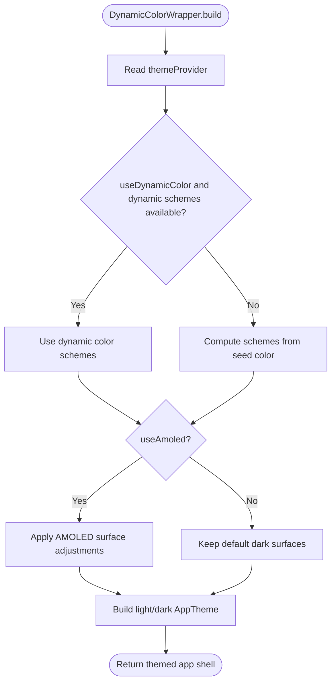
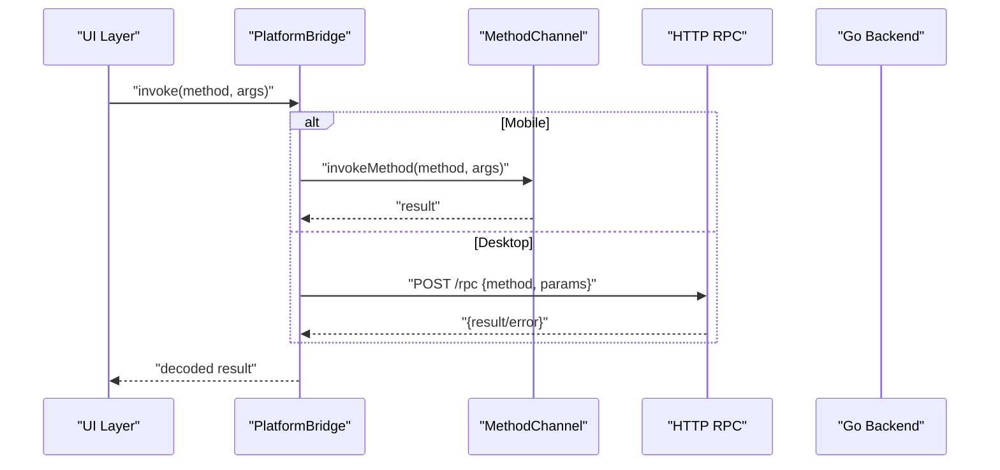
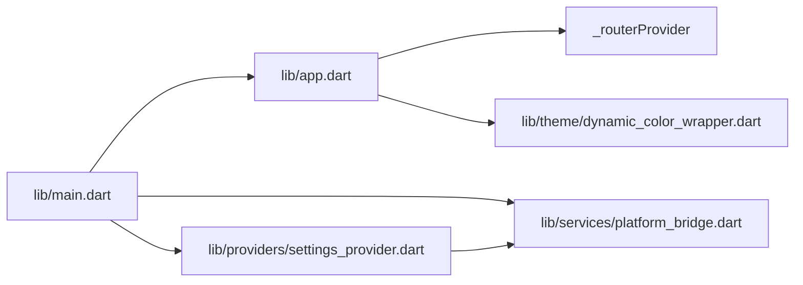

# Frontend Architecture (Flutter)

<cite>
**Referenced Files in This Document**
- [main.dart](file://lib/main.dart)
- [app.dart](file://lib/app.dart)
- [platform_bridge.dart](file://lib/services/platform_bridge.dart)
- [settings_provider.dart](file://lib/providers/settings_provider.dart)
- [dynamic_color_wrapper.dart](file://lib/theme/dynamic_color_wrapper.dart)
</cite>

## Table of Contents
1. [Introduction](#introduction)
2. [Project Structure](#project-structure)
3. [Core Components](#core-components)
4. [Architecture Overview](#architecture-overview)
5. [Detailed Component Analysis](#detailed-component-analysis)
6. [Dependency Analysis](#dependency-analysis)
7. [Performance Considerations](#performance-considerations)
8. [Troubleshooting Guide](#troubleshooting-guide)
9. [Conclusion](#conclusion)

## Introduction
This document explains the Flutter frontend architecture of the application, focusing on the application entry point, routing and navigation, Riverpod state management, reusable component architecture, app initialization and dependency injection, and the communication model with the backend via a platform bridge. It also covers cross-platform UI considerations and responsive design patterns used in the codebase.

## Project Structure
The Flutter application is organized around a small set of core files that bootstrap the app, define routing, manage global state, and integrate with the native backend. The most relevant parts for frontend architecture are:
- Application entry point and initialization
- Routing and navigation
- Global state providers
- Theme and color system
- Platform bridge for backend communication

**Diagram sources**
- [main.dart:22-44](file://lib/main.dart#L22-L44)
- [app.dart:13-52](file://lib/app.dart#L13-L52)
- [dynamic_color_wrapper.dart:7-49](file://lib/theme/dynamic_color_wrapper.dart#L7-L49)
- [settings_provider.dart:27-49](file://lib/providers/settings_provider.dart#L27-L49)
- [platform_bridge.dart:37-53](file://lib/services/platform_bridge.dart#L37-L53)

**Section sources**
- [main.dart:22-44](file://lib/main.dart#L22-L44)
- [app.dart:13-52](file://lib/app.dart#L13-L52)

## Core Components
- Application entry point and initialization:
  - Ensures Flutter binding is initialized, initializes media playback, configures desktop backend, resolves runtime profile for image caching and overscroll behavior, and wraps the app in Riverpod’s ProviderScope and an eager initializer widget.
- App shell and router:
  - Defines a Provider-backed GoRouter with redirect logic based on settings and first-launch state, and registers top-level routes for the main shell, setup, and tutorial screens.
- Global settings provider:
  - A Riverpod Notifier that loads, migrates, validates, and persists application settings, synchronizing certain preferences to the backend via the platform bridge.
- Theme and dynamic color:
  - A ConsumerWidget that computes light/dark themes using dynamic color or a seed color, optionally applying AMOLED adjustments, and passes them to the app shell.
- Platform bridge:
  - A centralized facade for invoking backend methods on mobile (MethodChannel) or HTTP on desktop, with caching, event streams, and lifecycle-aware cleanup.

**Section sources**
- [main.dart:22-44](file://lib/main.dart#L22-L44)
- [app.dart:13-52](file://lib/app.dart#L13-L52)
- [settings_provider.dart:27-49](file://lib/providers/settings_provider.dart#L27-L49)
- [dynamic_color_wrapper.dart:7-49](file://lib/theme/dynamic_color_wrapper.dart#L7-L49)
- [platform_bridge.dart:37-53](file://lib/services/platform_bridge.dart#L37-L53)

## Architecture Overview
The frontend follows a layered pattern:
- Presentation layer: App shell, screens, and reusable widgets
- Navigation layer: Riverpod-backed GoRouter with redirect logic
- State management layer: Riverpod providers for settings, UI state, and derived data
- Backend integration layer: PlatformBridge encapsulating mobile MethodChannel and desktop HTTP RPC
- Initialization layer: Eager initialization widget to warm up providers and services

**Diagram sources**
- [app.dart:13-52](file://lib/app.dart#L13-L52)
- [main.dart:35-43](file://lib/main.dart#L35-L43)
- [settings_provider.dart:672-675](file://lib/providers/settings_provider.dart#L672-L675)
- [platform_bridge.dart:37-53](file://lib/services/platform_bridge.dart#L37-L53)

## Detailed Component Analysis

### Application Entry Point and Initialization
Responsibilities:
- Initialize Flutter and media subsystems
- Configure desktop backend and runtime profile (image cache sizing and overscroll behavior)
- Wrap the app in Riverpod’s ProviderScope and an eager initialization widget
- Warm up Riverpod providers and services post-frame

Key behaviors:
- Runtime profile resolution selects lower image cache limits and disables overscroll effects on low-end Android devices
- EagerInitialization subscribes to settings, schedules provider warmups, auto-scans local library on resume, and initializes services (covers, notifications, share intents)

**Diagram sources**
- [main.dart:22-44](file://lib/main.dart#L22-L44)
- [main.dart:96-286](file://lib/main.dart#L96-L286)
- [app.dart:13-52](file://lib/app.dart#L13-L52)

**Section sources**
- [main.dart:22-44](file://lib/main.dart#L22-L44)
- [main.dart:96-286](file://lib/main.dart#L96-L286)

### Navigation and Routing
Routing model:
- Uses Riverpod-backed GoRouter with redirect logic based on settings (first launch, completion of tutorial, and setup route presence)
- Top-level routes include the main shell, setup, and tutorial
- Router is configured as the app’s routerConfig

**Diagram sources**
- [app.dart:13-52](file://lib/app.dart#L13-L52)

**Section sources**
- [app.dart:13-52](file://lib/app.dart#L13-L52)

### Riverpod State Management
Provider system highlights:
- settingsProvider: A Notifier-based provider that loads settings from the backend or SharedPreferences, applies migrations, normalizes values, and persists changes. It also synchronizes specific settings to the backend.
- _routerProvider: A Provider that constructs and returns a GoRouter instance for navigation.
- Other providers are imported at the entry point for eager initialization.

State management patterns:
- Separation of concerns: Notifier handles state transitions and persistence; Provider exposes derived data to consumers.
- Reactive UI: Consumers watch providers and rebuild when state changes.
- Eager warming: Certain providers are accessed shortly after startup to reduce perceived latency.

**Diagram sources**
- [settings_provider.dart:27-670](file://lib/providers/settings_provider.dart#L27-L670)

**Section sources**
- [settings_provider.dart:27-49](file://lib/providers/settings_provider.dart#L27-L49)
- [settings_provider.dart:219-249](file://lib/providers/settings_provider.dart#L219-L249)
- [settings_provider.dart:672-675](file://lib/providers/settings_provider.dart#L672-L675)

### Theme and Dynamic Color
The theme system:
- Wraps the app with a ConsumerWidget that reads theme settings and computes light/dark color schemes
- Supports dynamic color when available or falls back to a seed color
- Applies AMOLED adjustments to dark theme surfaces for improved contrast and battery life

**Diagram sources**
- [dynamic_color_wrapper.dart:7-49](file://lib/theme/dynamic_color_wrapper.dart#L7-L49)

**Section sources**
- [dynamic_color_wrapper.dart:7-49](file://lib/theme/dynamic_color_wrapper.dart#L7-L49)

### Platform Bridge: Backend Communication
Communication model:
- Mobile: MethodChannel invocations to a native backend
- Desktop: HTTP RPC to a locally spawned Go backend server
- Caching: Lookup caches for availability and metadata with TTL and persistence
- Streams: EventChannels for download and library scan progress
- Lifecycle: Automatic backend discovery/build, port selection, and cleanup

**Diagram sources**
- [platform_bridge.dart:37-81](file://lib/services/platform_bridge.dart#L37-L81)

**Section sources**
- [platform_bridge.dart:37-81](file://lib/services/platform_bridge.dart#L37-L81)
- [platform_bridge.dart:83-141](file://lib/services/platform_bridge.dart#L83-L141)
- [platform_bridge.dart:241-283](file://lib/services/platform_bridge.dart#L241-L283)

### Practical Examples

- State management pattern: Updating settings
  - Use a SettingsNotifier setter to update a field and persist to backend and SharedPreferences
  - Example path: [settings_provider.dart:318-323](file://lib/providers/settings_provider.dart#L318-L323)
- Navigation pattern: Conditional routing
  - Router redirect logic ensures setup and tutorial flows are respected
  - Example path: [app.dart:17-31](file://lib/app.dart#L17-L31)
- Widget composition: Themed app shell
  - DynamicColorWrapper composes light/dark themes and passes them to the app shell
  - Example path: [dynamic_color_wrapper.dart:19-46](file://lib/theme/dynamic_color_wrapper.dart#L19-L46)
- Cross-platform UI: Overscroll behavior
  - Overscroll disabled on low-end devices via runtime profile
  - Example path: [main.dart:61-65](file://lib/main.dart#L61-L65)
- Backend integration: Download progress stream
  - EventChannel or polling-based stream depending on platform
  - Example path: [platform_bridge.dart:618-637](file://lib/services/platform_bridge.dart#L618-L637)

**Section sources**
- [settings_provider.dart:318-323](file://lib/providers/settings_provider.dart#L318-L323)
- [app.dart:17-31](file://lib/app.dart#L17-L31)
- [dynamic_color_wrapper.dart:19-46](file://lib/theme/dynamic_color_wrapper.dart#L19-L46)
- [main.dart:61-65](file://lib/main.dart#L61-L65)
- [platform_bridge.dart:618-637](file://lib/services/platform_bridge.dart#L618-L637)

## Dependency Analysis
- Entry point depends on:
  - Riverpod for state and routing
  - MediaKit for playback
  - Platform-specific initialization for desktop backend
- App shell depends on:
  - Router provider and settings provider for navigation and theme
- Providers depend on:
  - SharedPreferences for persistence
  - PlatformBridge for backend synchronization
- Theme depends on:
  - Riverpod and dynamic color package
- PlatformBridge depends on:
  - MethodChannel on mobile and HTTP client on desktop
  - Shared preferences for cache persistence

**Diagram sources**
- [main.dart:22-44](file://lib/main.dart#L22-L44)
- [app.dart:13-52](file://lib/app.dart#L13-L52)
- [settings_provider.dart:10-15](file://lib/providers/settings_provider.dart#L10-L15)

**Section sources**
- [main.dart:22-44](file://lib/main.dart#L22-L44)
- [app.dart:13-52](file://lib/app.dart#L13-L52)
- [settings_provider.dart:10-15](file://lib/providers/settings_provider.dart#L10-L15)

## Performance Considerations
- Image cache sizing:
  - Runtime profile reduces image cache limits on low RAM or 32-bit ARM devices to prevent memory pressure
  - Reference: [main.dart:65-82](file://lib/main.dart#L65-L82)
- Deferred provider warming:
  - Post-frame timers warm up heavy providers (download history, library collections, local library) to improve perceived performance
  - Reference: [main.dart:143-191](file://lib/main.dart#L143-L191)
- Network compatibility:
  - Settings synchronize to backend to enable HTTP/TLS compatibility modes on demand
  - Reference: [settings_provider.dart:165-175](file://lib/providers/settings_provider.dart#L165-L175)
- AMOLED theme:
  - Dark theme surfaces optimized for OLED displays to reduce power consumption
  - Reference: [dynamic_color_wrapper.dart:52-64](file://lib/theme/dynamic_color_wrapper.dart#L52-L64)

[No sources needed since this section provides general guidance]

## Troubleshooting Guide
- Router redirect loops:
  - Verify settingsInitNotifier and settings state (first launch, username, tutorial completion)
  - Reference: [app.dart:17-31](file://lib/app.dart#L17-L31)
- Settings not persisting:
  - Confirm backend save/load path and SharedPreferences fallback
  - Reference: [settings_provider.dart:52-67](file://lib/providers/settings_provider.dart#L52-L67), [settings_provider.dart:222-249](file://lib/providers/settings_provider.dart#L222-L249)
- Desktop backend not starting:
  - Check port availability, executable discovery, and build logs
  - Reference: [platform_bridge.dart:83-141](file://lib/services/platform_bridge.dart#L83-L141)
- Download progress not received:
  - On desktop, progress is polled; on mobile, verify EventChannel registration
  - Reference: [platform_bridge.dart:618-637](file://lib/services/platform_bridge.dart#L618-L637)

**Section sources**
- [app.dart:17-31](file://lib/app.dart#L17-L31)
- [settings_provider.dart:52-67](file://lib/providers/settings_provider.dart#L52-L67)
- [settings_provider.dart:222-249](file://lib/providers/settings_provider.dart#L222-L249)
- [platform_bridge.dart:83-141](file://lib/services/platform_bridge.dart#L83-L141)
- [platform_bridge.dart:618-637](file://lib/services/platform_bridge.dart#L618-L637)

## Conclusion
The Flutter frontend is structured around a clean separation of concerns: a robust entry point and initialization pipeline, a Riverpod-driven navigation layer, a resilient settings provider with backend synchronization, a flexible theme system, and a unified platform bridge for backend integration. These components work together to deliver a responsive, cross-platform UI with efficient state management and reliable backend communication.