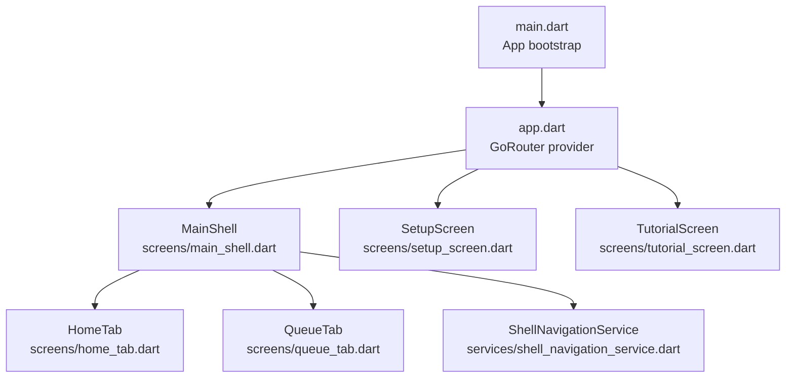
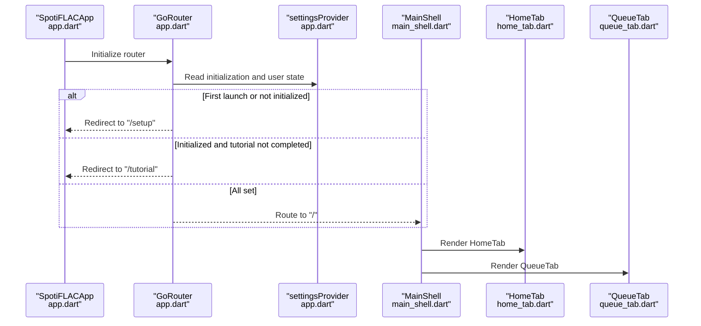
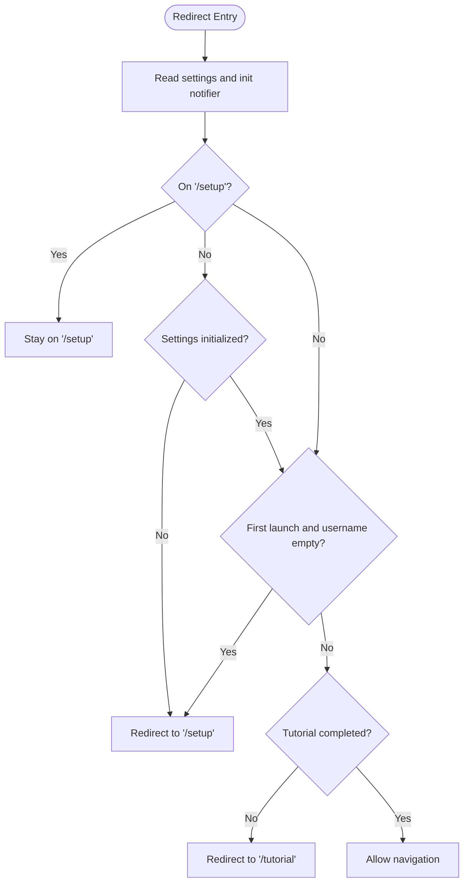
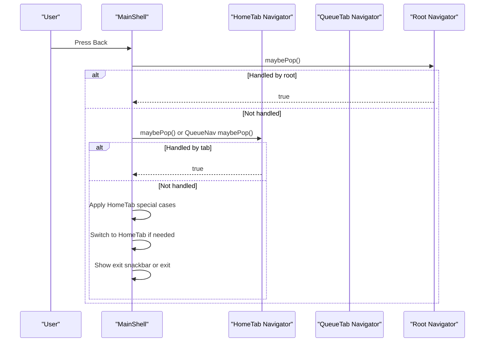
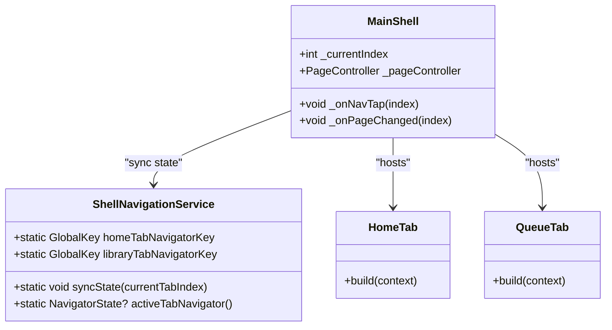
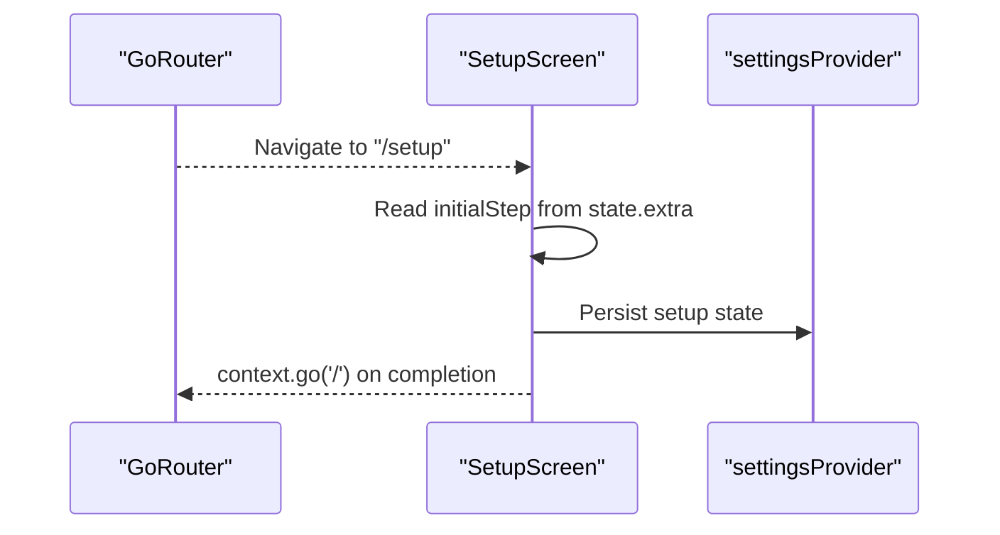
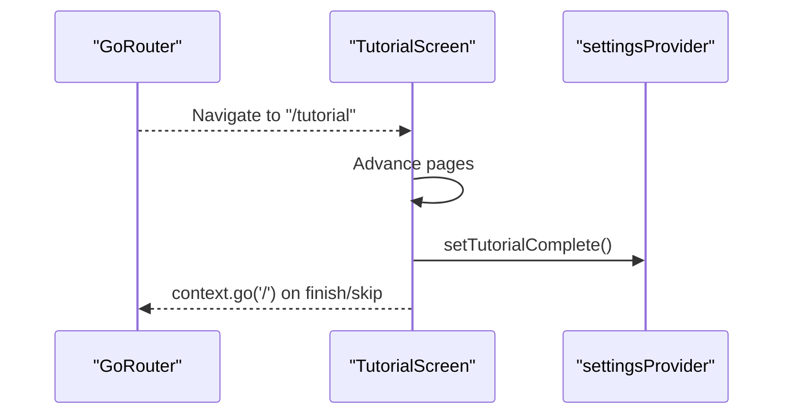
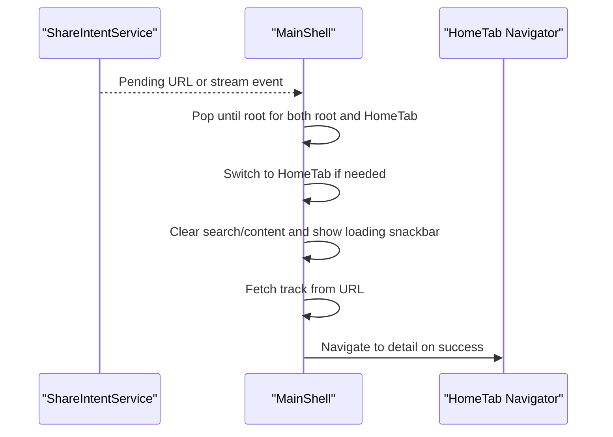
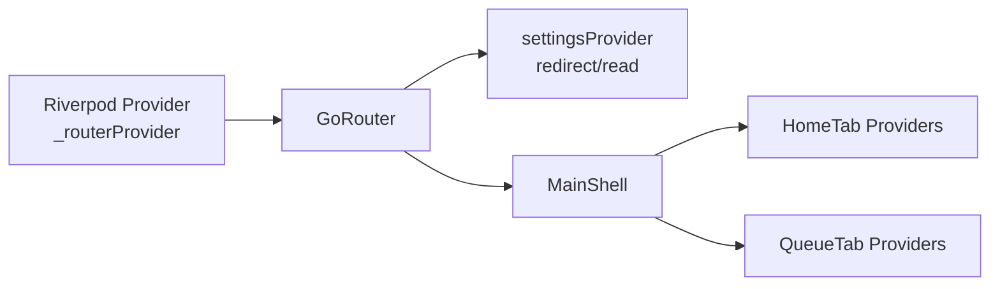
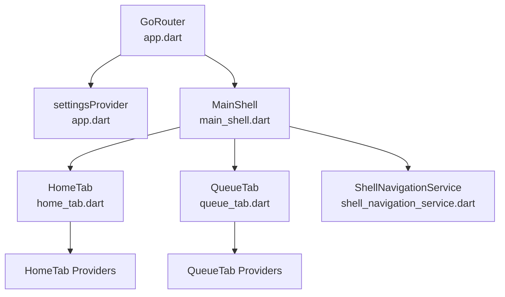

# Navigation and Routing System

<cite>
**Referenced Files in This Document**
- [main.dart](file://lib/main.dart)
- [app.dart](file://lib/app.dart)
- [main_shell.dart](file://lib/screens/main_shell.dart)
- [shell_navigation_service.dart](file://lib/services/shell_navigation_service.dart)
- [home_tab.dart](file://lib/screens/home_tab.dart)
- [queue_tab.dart](file://lib/screens/queue_tab.dart)
- [setup_screen.dart](file://lib/screens/setup_screen.dart)
- [tutorial_screen.dart](file://lib/screens/tutorial_screen.dart)
</cite>

## Table of Contents
1. [Introduction](#introduction)
2. [Project Structure](#project-structure)
3. [Core Components](#core-components)
4. [Architecture Overview](#architecture-overview)
5. [Detailed Component Analysis](#detailed-component-analysis)
6. [Dependency Analysis](#dependency-analysis)
7. [Performance Considerations](#performance-considerations)
8. [Troubleshooting Guide](#troubleshooting-guide)
9. [Conclusion](#conclusion)

## Introduction
This document explains the navigation and routing system built with GoRouter. It covers route configuration, redirect logic, and how the application orchestrates different navigation flows: setup flow, tutorial flow, and main application navigation. It also documents the MainShell architecture, tab navigation patterns, route structure for screens, and how Riverpod integrates with routing for state-aware navigation. Practical guidance is included for programmatic navigation, route parameters, deep linking, best practices, performance optimization, and edge-case handling.

## Project Structure
The navigation system centers around a single-router configuration in the application shell, with tab-based shells for the main app and dedicated screens for setup and tutorial. The router is configured in the application entrypoint and wired into the MaterialApp via a Riverpod provider. Tab navigation is implemented using a shell with two tab navigators and a shared navigation service to coordinate state.

**Diagram sources**
- [main.dart:22-44](file://lib/main.dart#L22-L44)
- [app.dart:13-52](file://lib/app.dart#L13-L52)
- [main_shell.dart:29-603](file://lib/screens/main_shell.dart#L29-L603)
- [shell_navigation_service.dart:3-33](file://lib/services/shell_navigation_service.dart#L3-L33)
- [home_tab.dart:52-56](file://lib/screens/home_tab.dart#L52-L56)
- [queue_tab.dart:51-65](file://lib/screens/queue_tab.dart#L51-L65)
- [setup_screen.dart:20-26](file://lib/screens/setup_screen.dart#L20-L26)
- [tutorial_screen.dart:7-12](file://lib/screens/tutorial_screen.dart#L7-L12)

**Section sources**
- [main.dart:22-44](file://lib/main.dart#L22-L44)
- [app.dart:13-52](file://lib/app.dart#L13-L52)

## Core Components
- Router provider: A Riverpod provider creates and configures the GoRouter with initial location, redirect logic, and routes.
- Redirect logic: Redirects between setup, tutorial, and main shell based on settings and initialization state.
- Routes: Root shell, setup, and tutorial routes; error fallback to the main shell.
- MainShell: The shell that hosts tabbed navigation, manages back handling, and coordinates tab switching.
- Tab navigators: Two tab navigators under MainShell, one for Home and one for Queue/Library.
- ShellNavigationService: A lightweight service to keep track of the active tab and synchronize state with the shell.
- Screens: SetupScreen and TutorialScreen manage onboarding flows; HomeTab and QueueTab implement tab content.

**Section sources**
- [app.dart:13-52](file://lib/app.dart#L13-L52)
- [main_shell.dart:29-603](file://lib/screens/main_shell.dart#L29-L603)
- [shell_navigation_service.dart:3-33](file://lib/services/shell_navigation_service.dart#L3-L33)
- [home_tab.dart:52-56](file://lib/screens/home_tab.dart#L52-L56)
- [queue_tab.dart:51-65](file://lib/screens/queue_tab.dart#L51-L65)
- [setup_screen.dart:20-26](file://lib/screens/setup_screen.dart#L20-L26)
- [tutorial_screen.dart:7-12](file://lib/screens/tutorial_screen.dart#L7-L12)

## Architecture Overview
The routing architecture uses a single GoRouter instance scoped by a Riverpod provider. The router redirects to setup or tutorial depending on initialization and user state, then routes to the MainShell for the main app. MainShell uses a PageView with two tab navigators to host HomeTab and QueueTab. A shared ShellNavigationService keeps track of the active tab and supports programmatic navigation between tabs.

**Diagram sources**
- [app.dart:13-52](file://lib/app.dart#L13-L52)
- [main_shell.dart:29-603](file://lib/screens/main_shell.dart#L29-L603)
- [home_tab.dart:52-56](file://lib/screens/home_tab.dart#L52-L56)
- [queue_tab.dart:51-65](file://lib/screens/queue_tab.dart#L51-L65)

## Detailed Component Analysis

### Router Configuration and Redirect Logic
- Initial location is the root path "/".
- Redirect logic evaluates:
  - Whether settings initialization has occurred.
  - Whether the user is on the setup or tutorial route.
  - Whether the app is first launch and username empty.
  - Whether tutorial completion is required.
- Routes:
  - "/" → MainShell
  - "/setup" → SetupScreen with optional initial step via state.extra.
  - "/tutorial" → TutorialScreen
- Error fallback: On route errors, the router falls back to MainShell.

**Diagram sources**
- [app.dart:17-31](file://lib/app.dart#L17-L31)

**Section sources**
- [app.dart:13-52](file://lib/app.dart#L13-L52)

### MainShell: Tab Navigation and Back Handling
- Maintains current tab index and a PageController for smooth tab transitions.
- Two tab navigators:
  - HomeTab navigator key
  - QueueTab navigator key
- Back button handling prioritizes:
  - Root navigator maybePop
  - Current tab navigator maybePop
  - Special cases for HomeTab (recent access, search, content, keyboard)
  - Double-tap exit behavior
- Navigation bar uses a glassmorphic design with animated badges for queue counts.

**Diagram sources**
- [main_shell.dart:302-405](file://lib/screens/main_shell.dart#L302-L405)

**Section sources**
- [main_shell.dart:29-603](file://lib/screens/main_shell.dart#L29-L603)
- [shell_navigation_service.dart:3-33](file://lib/services/shell_navigation_service.dart#L3-L33)

### Tab Navigation Patterns
- Each tab is wrapped in a Navigator with a tab-specific GlobalKey.
- The shell builds a PageView with two pages: HomeTab and QueueTab.
- Tab switching uses PageController animate/jump with haptics and transitions.
- KeepAlive is used to preserve tab state across switches.

**Diagram sources**
- [main_shell.dart:29-603](file://lib/screens/main_shell.dart#L29-L603)
- [shell_navigation_service.dart:3-33](file://lib/services/shell_navigation_service.dart#L3-L33)
- [home_tab.dart:52-56](file://lib/screens/home_tab.dart#L52-L56)
- [queue_tab.dart:51-65](file://lib/screens/queue_tab.dart#L51-L65)

**Section sources**
- [main_shell.dart:407-411](file://lib/screens/main_shell.dart#L407-L411)
- [main_shell.dart:419-430](file://lib/screens/main_shell.dart#L419-L430)
- [main_shell.dart:605-628](file://lib/screens/main_shell.dart#L605-L628)

### Setup Flow
- SetupScreen is rendered at "/setup".
- Accepts an initial step via state.extra and supports auto-restoring saved state.
- Handles premium activation and directory selection on supported platforms.
- Completes setup by updating settings and navigating to the main shell.

**Diagram sources**
- [app.dart:34-43](file://lib/app.dart#L34-L43)
- [setup_screen.dart:20-26](file://lib/screens/setup_screen.dart#L20-L26)
- [setup_screen.dart:63-93](file://lib/screens/setup_screen.dart#L63-L93)

**Section sources**
- [app.dart:34-43](file://lib/app.dart#L34-L43)
- [setup_screen.dart:20-26](file://lib/screens/setup_screen.dart#L20-L26)
- [setup_screen.dart:63-93](file://lib/screens/setup_screen.dart#L63-L93)

### Tutorial Flow
- TutorialScreen is rendered at "/tutorial".
- Uses a PageController to move through tutorial pages.
- On completion or skip, marks tutorial as complete and navigates to "/".
- Integrates with settings to persist completion state.

**Diagram sources**
- [app.dart:45-48](file://lib/app.dart#L45-L48)
- [tutorial_screen.dart:7-12](file://lib/screens/tutorial_screen.dart#L7-L12)
- [tutorial_screen.dart:63-71](file://lib/screens/tutorial_screen.dart#L63-L71)

**Section sources**
- [app.dart:45-48](file://lib/app.dart#L45-L48)
- [tutorial_screen.dart:7-12](file://lib/screens/tutorial_screen.dart#L7-L12)
- [tutorial_screen.dart:63-71](file://lib/screens/tutorial_screen.dart#L63-L71)

### Programmatic Navigation, Route Parameters, and Deep Linking
- Programmatic navigation:
  - Use context.go(...) to navigate to named routes (e.g., "/setup", "/tutorial", "/").
  - Use context.pop() and maybePop() for back navigation within navigators.
- Route parameters:
  - The setup route reads state.extra to pass initialStep.
  - Other routes are static; parameters are not used in the current implementation.
- Deep linking:
  - The shell listens for shared URLs and navigates to the HomeTab, clearing stacks and fetching track data.
  - The shell resets HomeTab to the main state and clears focus/search when switching tabs.

**Diagram sources**
- [main_shell.dart:99-151](file://lib/screens/main_shell.dart#L99-L151)
- [main_shell.dart:264-290](file://lib/screens/main_shell.dart#L264-L290)

**Section sources**
- [app.dart:34-43](file://lib/app.dart#L34-L43)
- [main_shell.dart:99-151](file://lib/screens/main_shell.dart#L99-L151)
- [main_shell.dart:264-290](file://lib/screens/main_shell.dart#L264-L290)

### Integration with Riverpod for State-Aware Routing
- Router is provided via a Riverpod Provider and injected into MaterialApp.router.
- Redirect logic reads settingsProvider to decide navigation targets.
- The shell updates settings (e.g., tutorial completion) and triggers navigation.
- Tab content uses Riverpod providers to drive UI state and trigger navigation decisions.

**Diagram sources**
- [app.dart:13-16](file://lib/app.dart#L13-L16)
- [app.dart:17-31](file://lib/app.dart#L17-L31)
- [main_shell.dart:29-603](file://lib/screens/main_shell.dart#L29-L603)

**Section sources**
- [app.dart:13-16](file://lib/app.dart#L13-L16)
- [app.dart:17-31](file://lib/app.dart#L17-L31)
- [main_shell.dart:29-603](file://lib/screens/main_shell.dart#L29-L603)

## Dependency Analysis
- Router depends on settingsInitNotifier and settingsProvider for redirect decisions.
- MainShell depends on ShellNavigationService for active tab state and tab navigators for content.
- Screens depend on providers for state and on context.go for navigation.
- No circular dependencies are evident; navigation is primarily unidirectional from router to screens.

**Diagram sources**
- [app.dart:13-52](file://lib/app.dart#L13-L52)
- [main_shell.dart:29-603](file://lib/screens/main_shell.dart#L29-L603)
- [shell_navigation_service.dart:3-33](file://lib/services/shell_navigation_service.dart#L3-L33)
- [home_tab.dart:52-56](file://lib/screens/home_tab.dart#L52-L56)
- [queue_tab.dart:51-65](file://lib/screens/queue_tab.dart#L51-L65)

**Section sources**
- [app.dart:13-52](file://lib/app.dart#L13-L52)
- [main_shell.dart:29-603](file://lib/screens/main_shell.dart#L29-L603)
- [shell_navigation_service.dart:3-33](file://lib/services/shell_navigation_service.dart#L3-L33)

## Performance Considerations
- KeepAlive for tabs prevents rebuilding content on tab switches.
- Debounced live search in HomeTab reduces network calls during typing.
- Image cache sizing is tuned at startup to balance memory and performance.
- PageController animate/jump avoids unnecessary rebuilds during tab transitions.
- Back handling short-circuits expensive operations when loading or keyboard is visible.

[No sources needed since this section provides general guidance]

## Troubleshooting Guide
- Redirect loops:
  - Verify settings initialization and tutorial completion flags.
  - Ensure settingsInitNotifier increments to unlock normal routing.
- Tab back navigation not working:
  - Confirm active tab navigator is returned by ShellNavigationService.
  - Check maybePop() is called on the correct navigator.
- Deep link handling:
  - Ensure ShareIntentService emits events and pending URLs are consumed.
  - Verify HomeTab reset logic clears search/content and unfocuses input.
- Setup or tutorial stuck:
  - Confirm settingsProvider updates on completion and context.go("/") is invoked.

**Section sources**
- [app.dart:17-31](file://lib/app.dart#L17-L31)
- [main_shell.dart:99-151](file://lib/screens/main_shell.dart#L99-L151)
- [main_shell.dart:302-405](file://lib/screens/main_shell.dart#L302-L405)
- [tutorial_screen.dart:63-71](file://lib/screens/tutorial_screen.dart#L63-L71)

## Conclusion
The navigation system uses a clean, state-driven approach with GoRouter and Riverpod. Redirect logic ensures users complete setup and tutorial before entering the main app. MainShell coordinates tabbed navigation with robust back handling and deep-link integration. The design balances performance and usability while keeping navigation predictable and maintainable.