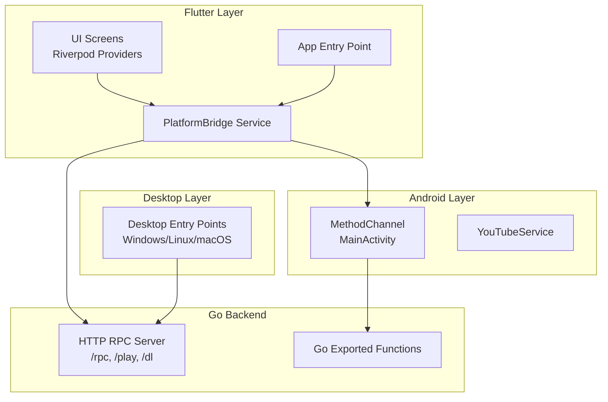
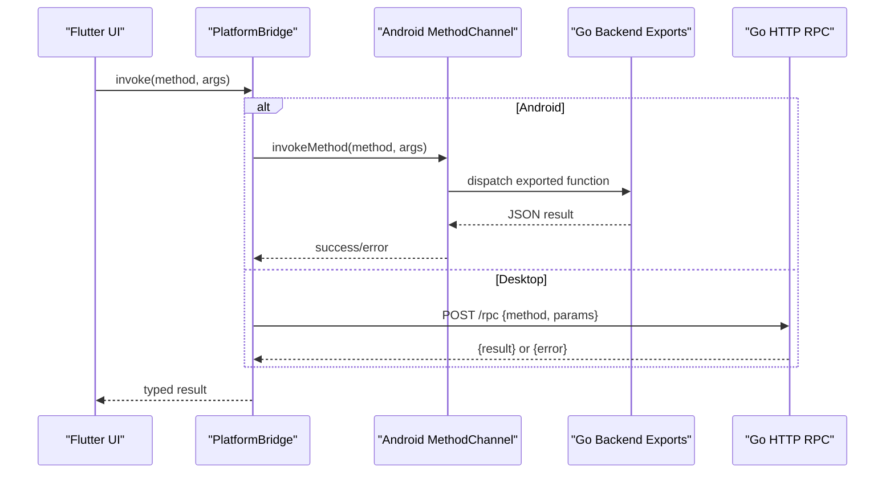
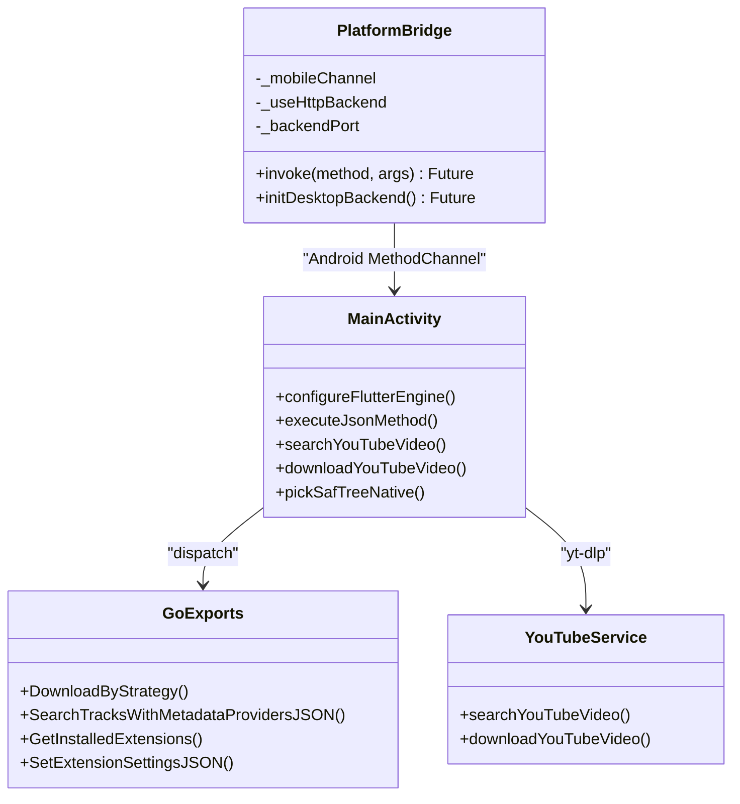
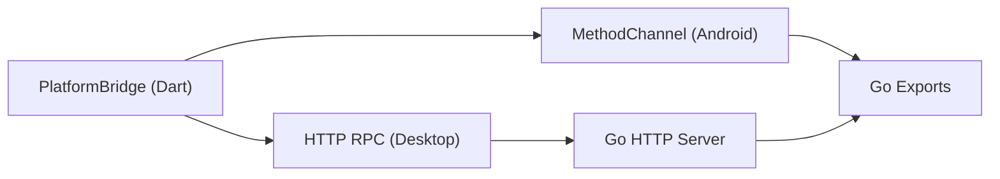

# Platform Bridge Integration

<cite>
**Referenced Files in This Document**
- [lib/main.dart](file://lib/main.dart)
- [lib/services/platform_bridge.dart](file://lib/services/platform_bridge.dart)
- [android/app/src/main/kotlin/com/example/bitly/MainActivity.kt](file://android/app/src/main/kotlin/com/example/bitly/MainActivity.kt)
- [android/app/src/main/kotlin/com/example/bitly/YouTubeService.kt](file://android/app/src/main/kotlin/com/example/bitly/YouTubeService.kt)
- [ios/Runner/AppDelegate.swift](file://ios/Runner/AppDelegate.swift)
- [linux/runner/main.cc](file://linux/runner/main.cc)
- [windows/runner/main.cpp](file://windows/runner/main.cpp)
- [go_backend_spotiflac/cmd/server/main.go](file://go_backend_spotiflac/cmd/server/main.go)
- [go_backend_spotiflac/exports.go](file://go_backend_spotiflac/exports.go)
- [go_backend_spotiflac/mobile_deps.go](file://go_backend_spotiflac/mobile_deps.go)
</cite>

## Table of Contents
1. [Introduction](#introduction)
2. [Project Structure](#project-structure)
3. [Core Components](#core-components)
4. [Architecture Overview](#architecture-overview)
5. [Detailed Component Analysis](#detailed-component-analysis)
6. [Dependency Analysis](#dependency-analysis)
7. [Performance Considerations](#performance-considerations)
8. [Troubleshooting Guide](#troubleshooting-guide)
9. [Conclusion](#conclusion)

## Introduction
This document explains the platform bridge integration between Flutter and native platforms in this project. It details how Flutter UI communicates with Go backend services across Android (MethodChannel), iOS (via plugin registration), and desktop (HTTP RPC server). The bridge supports bidirectional communication, robust data serialization via JSON, and platform-specific integration patterns. Security, performance, and debugging considerations are addressed to help maintain a reliable cross-platform experience.

## Project Structure
The platform bridge spans three layers:
- Flutter UI and services: Orchestrates initialization, platform detection, and bridge invocation.
- Android native: Exposes a MethodChannel for Flutter-Dart to Kotlin/Go interop.
- Go backend: Provides HTTP RPC endpoints and exported functions for native integration.

**Diagram sources**
- [lib/main.dart:22-44](file://lib/main.dart#L22-L44)
- [lib/services/platform_bridge.dart:44-87](file://lib/services/platform_bridge.dart#L44-L87)
- [android/app/src/main/kotlin/com/example/bitly/MainActivity.kt:15-133](file://android/app/src/main/kotlin/com/example/bitly/MainActivity.kt#L15-L133)
- [android/app/src/main/kotlin/com/example/bitly/YouTubeService.kt:10-92](file://android/app/src/main/kotlin/com/example/bitly/YouTubeService.kt#L10-L92)
- [go_backend_spotiflac/cmd/server/main.go:107-134](file://go_backend_spotiflac/cmd/server/main.go#L107-L134)
- [go_backend_spotiflac/exports.go:934-956](file://go_backend_spotiflac/exports.go#L934-L956)
- [windows/runner/main.cpp:8-44](file://windows/runner/main.cpp#L8-L44)
- [linux/runner/main.cc:1-7](file://linux/runner/main.cc#L1-L7)

**Section sources**
- [lib/main.dart:22-44](file://lib/main.dart#L22-L44)
- [lib/services/platform_bridge.dart:44-87](file://lib/services/platform_bridge.dart#L44-L87)
- [android/app/src/main/kotlin/com/example/bitly/MainActivity.kt:15-133](file://android/app/src/main/kotlin/com/example/bitly/MainActivity.kt#L15-L133)
- [go_backend_spotiflac/cmd/server/main.go:107-134](file://go_backend_spotiflac/cmd/server/main.go#L107-L134)

## Core Components
- PlatformBridge service: Detects platform and routes calls either to Android MethodChannel or desktop HTTP RPC.
- Android MethodChannel: Registers a named channel and dispatches method calls to Go-backed functions and Android utilities.
- Go backend HTTP server: Serves RPC endpoints and media playback/download endpoints.
- Desktop entry points: Windows, Linux, macOS applications initialize the HTTP backend and run the Flutter engine.

Key responsibilities:
- Cross-platform invocation abstraction
- JSON-based serialization for arguments and results
- Error propagation across boundaries
- Platform-specific integrations (Android SAF, yt-dlp)

**Section sources**
- [lib/services/platform_bridge.dart:44-87](file://lib/services/platform_bridge.dart#L44-L87)
- [android/app/src/main/kotlin/com/example/bitly/MainActivity.kt:15-133](file://android/app/src/main/kotlin/com/example/bitly/MainActivity.kt#L15-L133)
- [go_backend_spotiflac/cmd/server/main.go:107-134](file://go_backend_spotiflac/cmd/server/main.go#L107-L134)

## Architecture Overview
The bridge architecture separates concerns across platforms while maintaining a unified Dart API surface.

**Diagram sources**
- [lib/services/platform_bridge.dart:44-87](file://lib/services/platform_bridge.dart#L44-L87)
- [android/app/src/main/kotlin/com/example/bitly/MainActivity.kt:26-133](file://android/app/src/main/kotlin/com/example/bitly/MainActivity.kt#L26-L133)
- [go_backend_spotiflac/cmd/server/main.go:359-385](file://go_backend_spotiflac/cmd/server/main.go#L359-L385)

## Detailed Component Analysis

### PlatformBridge Service (Flutter)
- Purpose: Centralized invocation routing based on platform.
- Behavior:
  - Uses MethodChannel on Android/iOS.
  - Uses HTTP RPC on desktop (Windows/Linux/macOS).
  - Encodes arguments as JSON maps and decodes results.
  - Propagates errors with structured messages.

Implementation highlights:
- Invocation routing: [lib/services/platform_bridge.dart:44-53](file://lib/services/platform_bridge.dart#L44-L53)
- HTTP RPC transport: [lib/services/platform_bridge.dart:55-81](file://lib/services/platform_bridge.dart#L55-L81)
- Desktop initialization: [lib/services/platform_bridge.dart:83-87](file://lib/services/platform_bridge.dart#L83-L87)

**Section sources**
- [lib/services/platform_bridge.dart:44-87](file://lib/services/platform_bridge.dart#L44-L87)

### Android MethodChannel Integration
- Channel registration: [android/app/src/main/kotlin/com/example/bitly/MainActivity.kt:23-133](file://android/app/src/main/kotlin/com/example/bitly/MainActivity.kt#L23-L133)
- Supported operations:
  - Database and settings: initMasterDatabase, loadAppSettings, saveAppSettings
  - Extension system: initExtensionSystem, getInstalledExtensions, initExtensionStore, getStoreExtensions, setDownloadFallbackExtensionIds
  - Search and YouTube: searchTracksWithMetadataProviders, searchYouTubeVideo, downloadYouTubeVideo, downloadByStrategy
  - History and collections: getDownloadHistory, getDownloadHistoryCount, getAllCollections, getPendingDownloadQueueRows
  - Lyrics and sync: setLyricsProviders, setLyricsFetchOptions, setNetworkCompatibilityOptions
  - Storage utilities: pickSafTree, ensureYtDlp, checkAvailability
- Execution model:
  - Background execution via single-thread executor.
  - Main-thread result delivery.
  - Error handling with structured error codes/messages.

YouTube integration:
- Native yt-dlp commands invoked from Kotlin: [android/app/src/main/kotlin/com/example/bitly/YouTubeService.kt:10-92](file://android/app/src/main/kotlin/com/example/bitly/YouTubeService.kt#L10-L92)

**Section sources**
- [android/app/src/main/kotlin/com/example/bitly/MainActivity.kt:23-133](file://android/app/src/main/kotlin/com/example/bitly/MainActivity.kt#L23-L133)
- [android/app/src/main/kotlin/com/example/bitly/YouTubeService.kt:10-92](file://android/app/src/main/kotlin/com/example/bitly/YouTubeService.kt#L10-L92)

### Go Backend HTTP RPC Server
- Entry point and routing: [go_backend_spotiflac/cmd/server/main.go:107-134](file://go_backend_spotiflac/cmd/server/main.go#L107-L134)
- RPC endpoint: [go_backend_spotiflac/cmd/server/main.go:359-385](file://go_backend_spotiflac/cmd/server/main.go#L359-L385)
- Dispatch to exported functions: [go_backend_spotiflac/cmd/server/main.go:555-800](file://go_backend_spotiflac/cmd/server/main.go#L555-L800)
- Exported functions for Dart bindings: [go_backend_spotiflac/exports.go:934-956](file://go_backend_spotiflac/exports.go#L934-L956)

Example flows:
- Download orchestration via DownloadByStrategy: [go_backend_spotiflac/exports.go:934-956](file://go_backend_spotiflac/exports.go#L934-L956)
- Metadata enrichment and lyrics: [go_backend_spotiflac/exports.go:2317-2578](file://go_backend_spotiflac/exports.go#L2317-L2578)

**Section sources**
- [go_backend_spotiflac/cmd/server/main.go:107-134](file://go_backend_spotiflac/cmd/server/main.go#L107-L134)
- [go_backend_spotiflac/cmd/server/main.go:359-385](file://go_backend_spotiflac/cmd/server/main.go#L359-L385)
- [go_backend_spotiflac/exports.go:934-956](file://go_backend_spotiflac/exports.go#L934-L956)

### iOS Integration
- Minimal native integration: AppDelegate registers plugins and launches the Flutter engine.
- PlatformBridge automatically falls back to MethodChannel on iOS (no explicit HTTP backend).
- Reference: [ios/Runner/AppDelegate.swift:5-13](file://ios/Runner/AppDelegate.swift#L5-L13)

**Section sources**
- [ios/Runner/AppDelegate.swift:5-13](file://ios/Runner/AppDelegate.swift#L5-L13)

### Desktop Entry Points
- Windows: Initializes COM, creates Flutter window, runs event loop. [windows/runner/main.cpp:8-44](file://windows/runner/main.cpp#L8-L44)
- Linux: Bootstraps application via MyApplication. [linux/runner/main.cc:1-7](file://linux/runner/main.cc#L1-L7)
- macOS: Uses GeneratedPluginRegistrant for plugin registration. [ios/Runner/AppDelegate.swift:10-12](file://ios/Runner/AppDelegate.swift#L10-L12)

**Section sources**
- [windows/runner/main.cpp:8-44](file://windows/runner/main.cpp#L8-L44)
- [linux/runner/main.cc:1-7](file://linux/runner/main.cc#L1-L7)
- [ios/Runner/AppDelegate.swift:10-12](file://ios/Runner/AppDelegate.swift#L10-L12)

### Class Relationships (Code-Level)

**Diagram sources**
- [lib/services/platform_bridge.dart:44-87](file://lib/services/platform_bridge.dart#L44-L87)
- [android/app/src/main/kotlin/com/example/bitly/MainActivity.kt:23-133](file://android/app/src/main/kotlin/com/example/bitly/MainActivity.kt#L23-L133)
- [android/app/src/main/kotlin/com/example/bitly/YouTubeService.kt:10-92](file://android/app/src/main/kotlin/com/example/bitly/YouTubeService.kt#L10-L92)
- [go_backend_spotiflac/exports.go:934-956](file://go_backend_spotiflac/exports.go#L934-L956)

## Dependency Analysis
- Dart-to-native dependencies:
  - Android: MethodChannel registered in MainActivity.
  - iOS: Plugin registration via GeneratedPluginRegistrant.
  - Desktop: HTTP RPC to localhost server.
- Go backend dependencies:
  - HTTP mux for endpoints.
  - Exported functions for Dart bindings.
  - Optional gomobile bind dependency marker.

**Diagram sources**
- [lib/services/platform_bridge.dart:44-87](file://lib/services/platform_bridge.dart#L44-L87)
- [android/app/src/main/kotlin/com/example/bitly/MainActivity.kt:23-133](file://android/app/src/main/kotlin/com/example/bitly/MainActivity.kt#L23-L133)
- [go_backend_spotiflac/cmd/server/main.go:107-134](file://go_backend_spotiflac/cmd/server/main.go#L107-L134)
- [go_backend_spotiflac/exports.go:934-956](file://go_backend_spotiflac/exports.go#L934-L956)

**Section sources**
- [go_backend_spotiflac/mobile_deps.go:1-8](file://go_backend_spotiflac/mobile_deps.go#L1-L8)

## Performance Considerations
- Threading:
  - Android: MethodChannel handlers execute on a single-thread executor; results posted back on main thread to avoid UI thread violations.
- Serialization overhead:
  - JSON marshalling/unmarshalling for arguments and results adds CPU cost; keep payloads minimal and avoid large binary transfers.
- Network latency (desktop):
  - HTTP RPC introduces loopback network overhead; consider batching or caching frequent queries.
- I/O and external tools:
  - yt-dlp and FFmpeg calls are synchronous; offload to background threads and avoid blocking the UI.
- Memory and caching:
  - Flutter image cache sizing is tuned at startup for Android; similar considerations should apply to large asset handling.

[No sources needed since this section provides general guidance]

## Troubleshooting Guide
Common issues and resolutions:
- Android MethodChannel errors:
  - Verify channel name and method names match between Flutter and Kotlin.
  - Check executor exceptions and ensure proper error mapping to Flutter.
  - Example handlers: [android/app/src/main/kotlin/com/example/bitly/MainActivity.kt:135-145](file://android/app/src/main/kotlin/com/example/bitly/MainActivity.kt#L135-L145)
- Desktop HTTP RPC failures:
  - Confirm backend is listening on the expected port and endpoint.
  - Inspect HTTP status codes and error payloads.
  - Example HTTP invocation: [lib/services/platform_bridge.dart:55-81](file://lib/services/platform_bridge.dart#L55-L81)
- YouTube operations:
  - Ensure yt-dlp is installed and executable; handle non-zero exit codes and stderr logs.
  - Example yt-dlp wrapper: [android/app/src/main/kotlin/com/example/bitly/YouTubeService.kt:54-90](file://android/app/src/main/kotlin/com/example/bitly/YouTubeService.kt#L54-L90)
- Go backend dispatch errors:
  - Validate JSON request shape and parameter types.
  - Review error classification and return structured error responses.
  - Example dispatch: [go_backend_spotiflac/cmd/server/main.go:555-800](file://go_backend_spotiflac/cmd/server/main.go#L555-L800)

**Section sources**
- [android/app/src/main/kotlin/com/example/bitly/MainActivity.kt:135-145](file://android/app/src/main/kotlin/com/example/bitly/MainActivity.kt#L135-L145)
- [lib/services/platform_bridge.dart:55-81](file://lib/services/platform_bridge.dart#L55-L81)
- [android/app/src/main/kotlin/com/example/bitly/YouTubeService.kt:54-90](file://android/app/src/main/kotlin/com/example/bitly/YouTubeService.kt#L54-L90)
- [go_backend_spotiflac/cmd/server/main.go:555-800](file://go_backend_spotiflac/cmd/server/main.go#L555-L800)

## Conclusion
The platform bridge integrates Flutter UI with native capabilities through a unified abstraction. Android leverages MethodChannel for fast, synchronous calls, while desktop relies on a lightweight HTTP RPC server. JSON-based serialization ensures consistent data exchange, and platform-specific integrations (yt-dlp, SAF) are encapsulated behind clean APIs. By following the documented patterns, developers can extend functionality safely, monitor performance, and troubleshoot effectively across platforms.