# State Management with Riverpod

<cite>
**Referenced Files in This Document**
- [main.dart](file://lib/main.dart)
- [app.dart](file://lib/app.dart)
- [settings_provider.dart](file://lib/providers/settings_provider.dart)
- [download_queue_provider.dart](file://lib/providers/download_queue_provider.dart)
- [local_library_provider.dart](file://lib/providers/local_library_provider.dart)
- [extension_provider.dart](file://lib/providers/extension_provider.dart)
- [library_collections_provider.dart](file://lib/providers/library_collections_provider.dart)
- [playback_provider.dart](file://lib/providers/playback_provider.dart)
- [audio_player_provider.dart](file://lib/providers/audio_player_provider.dart)
- [playback_queue_provider.dart](file://lib/providers/playback_queue_provider.dart)
- [stats_provider.dart](file://lib/providers/stats_provider.dart)
- [theme_provider.dart](file://lib/providers/theme_provider.dart)
</cite>

## Table of Contents
1. [Introduction](#introduction)
2. [Project Structure](#project-structure)
3. [Core Components](#core-components)
4. [Architecture Overview](#architecture-overview)
5. [Detailed Component Analysis](#detailed-component-analysis)
6. [Dependency Analysis](#dependency-analysis)
7. [Performance Considerations](#performance-considerations)
8. [Troubleshooting Guide](#troubleshooting-guide)
9. [Conclusion](#conclusion)

## Introduction
This document explains the Riverpod-based state management in the Bitly application. It focuses on how Riverpod replaces traditional setState with a reactive, composable provider model, and how providers coordinate across features such as settings, downloads, local library, extensions, playback, and statistics. It also documents the different provider types used (NotifierProvider, StateNotifierProvider, FutureProvider), their implementation patterns, and best practices for performance, debugging, and maintainability.

## Project Structure
The application initializes Riverpod at the root and wires providers for settings, downloads, local library, extensions, playback, and UI themes. Providers are organized under lib/providers and consumed by widgets and services.

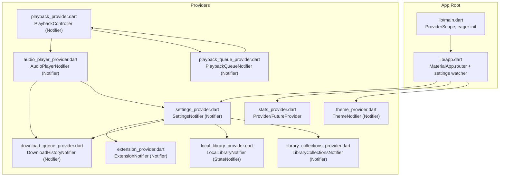

**Diagram sources**
- [main.dart:22-44](file://lib/main.dart#L22-L44)
- [app.dart:54-98](file://lib/app.dart#L54-L98)
- [settings_provider.dart:27-675](file://lib/providers/settings_provider.dart#L27-L675)
- [download_queue_provider.dart:486-800](file://lib/providers/download_queue_provider.dart#L486-L800)
- [local_library_provider.dart:95-339](file://lib/providers/local_library_provider.dart#L95-L339)
- [extension_provider.dart:797-1599](file://lib/providers/extension_provider.dart#L797-L1599)
- [library_collections_provider.dart:666-800](file://lib/providers/library_collections_provider.dart#L666-L800)
- [playback_provider.dart:16-203](file://lib/providers/playback_provider.dart#L16-L203)
- [audio_player_provider.dart:89-651](file://lib/providers/audio_player_provider.dart#L89-L651)
- [playback_queue_provider.dart:94-237](file://lib/providers/playback_queue_provider.dart#L94-L237)
- [stats_provider.dart:4-35](file://lib/providers/stats_provider.dart#L4-L35)
- [theme_provider.dart:6-83](file://lib/providers/theme_provider.dart#L6-L83)

**Section sources**
- [main.dart:22-44](file://lib/main.dart#L22-L44)
- [app.dart:54-98](file://lib/app.dart#L54-L98)

## Core Components
This section summarizes the provider types and their roles.

- NotifierProvider
  - Used for stateful logic that mutates state and exposes methods to mutate it.
  - Examples:
    - SettingsNotifier (settings_provider.dart)
    - ExtensionNotifier (extension_provider.dart)
    - LibraryCollectionsNotifier (library_collections_provider.dart)
    - PlaybackController (playback_provider.dart)
    - AudioPlayerNotifier (audio_player_provider.dart)
    - PlaybackQueueNotifier (playback_queue_provider.dart)

- StateNotifierProvider
  - Used for stateful logic with a dedicated state class and imperative updates.
  - Example:
    - LocalLibraryNotifier (local_library_provider.dart)

- FutureProvider
  - Used for asynchronous reads or derived data.
  - Examples:
    - localLibraryCoverProvider (local_library_provider.dart)
    - localLibraryFirstCoverProvider (local_library_provider.dart)
    - totalStatsProvider, topTracksProvider, topAlbumsProvider, topArtistsProvider, recentPlaysProvider, achievementProgressProvider, unlockedSecretsProvider (stats_provider.dart)

- Provider
  - Used for lightweight, synchronous factories or singletons.
  - Example:
    - statsProvider (stats_provider.dart)

Benefits of Riverpod over setState:
- Predictable, testable state updates
- Fine-grained reactivity (only dependent widgets rebuild)
- Clear separation of concerns (state vs UI)
- Easy composition and dependency injection via ref.read/ref.watch
- Built-in debugging and devtools support

**Section sources**
- [settings_provider.dart:27-675](file://lib/providers/settings_provider.dart#L27-L675)
- [extension_provider.dart:797-1599](file://lib/providers/extension_provider.dart#L797-L1599)
- [library_collections_provider.dart:666-800](file://lib/providers/library_collections_provider.dart#L666-L800)
- [playback_provider.dart:16-203](file://lib/providers/playback_provider.dart#L16-L203)
- [audio_player_provider.dart:89-651](file://lib/providers/audio_player_provider.dart#L89-L651)
- [playback_queue_provider.dart:94-237](file://lib/providers/playback_queue_provider.dart#L94-L237)
- [local_library_provider.dart:95-339](file://lib/providers/local_library_provider.dart#L95-L339)
- [stats_provider.dart:4-35](file://lib/providers/stats_provider.dart#L4-L35)

## Architecture Overview
The app initializes providers early and orchestrates startup tasks. Settings drive extension loading, provider priorities, and feature toggles. Downloads and local library are coordinated via settings and background services. Playback composes queue, player, and history/collections.

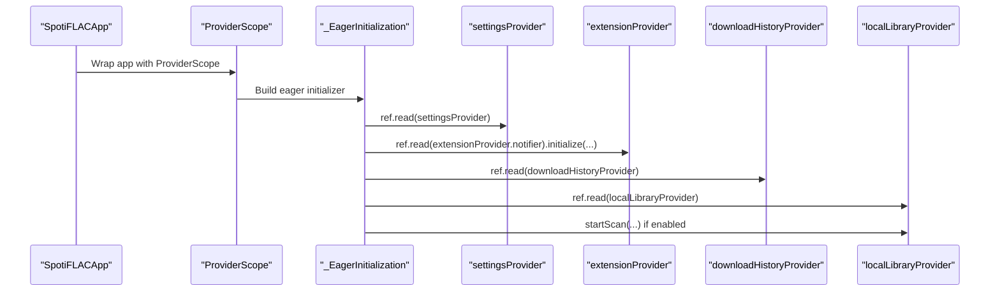

**Diagram sources**
- [main.dart:22-44](file://lib/main.dart#L22-L44)
- [main.dart:96-287](file://lib/main.dart#L96-L287)
- [settings_provider.dart:27-675](file://lib/providers/settings_provider.dart#L27-L675)
- [extension_provider.dart:841-884](file://lib/providers/extension_provider.dart#L841-L884)
- [download_queue_provider.dart:486-552](file://lib/providers/download_queue_provider.dart#L486-L552)
- [local_library_provider.dart:172-227](file://lib/providers/local_library_provider.dart#L172-L227)

## Detailed Component Analysis

### Settings Provider (NotifierProvider)
- Purpose: Centralized app settings with persistence, migrations, and synchronization with native backend.
- Pattern: Notifier<AppSettings> with extensive setters that update state and persist to storage.
- Key behaviors:
  - Loads settings from native backend or SharedPreferences with fallback
  - Runs migrations and normalizations
  - Synchronizes settings to native backend (lyrics, network compatibility, extension fallbacks)
  - Exposes methods to update preferences and trigger downstream effects (e.g., migrating download directory paths)

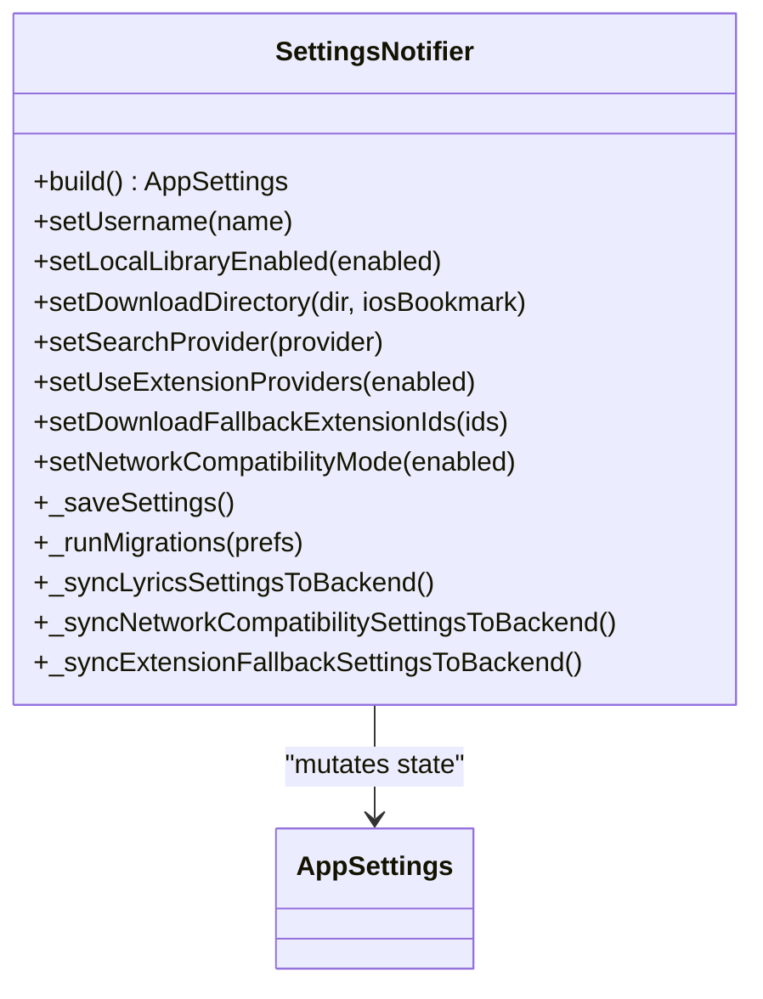

**Diagram sources**
- [settings_provider.dart:27-675](file://lib/providers/settings_provider.dart#L27-L675)

**Section sources**
- [settings_provider.dart:27-675](file://lib/providers/settings_provider.dart#L27-L675)

### Local Library Provider (StateNotifierProvider + FutureProvider)
- Purpose: Manage local music library state, scanning, and cover resolution.
- Pattern:
  - LocalLibraryNotifier (StateNotifier) manages state transitions and imperative actions (refresh, startScan, cancelScan, search).
  - localLibraryCoverProvider (FutureProvider.family) resolves cover paths from the library database.
  - localLibraryFirstCoverProvider (FutureProvider.family) returns the first available cover from a batch of requests.

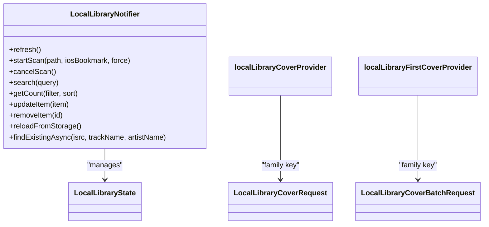

**Diagram sources**
- [local_library_provider.dart:95-339](file://lib/providers/local_library_provider.dart#L95-L339)

**Section sources**
- [local_library_provider.dart:95-339](file://lib/providers/local_library_provider.dart#L95-L339)

### Download History Provider (Notifier)
- Purpose: Load, deduplicate, and maintain a history of downloaded tracks with lookup helpers.
- Pattern: Notifier<DownloadHistoryState> with background loading and maintenance tasks (SAP repair, orphan cleanup, metadata backfill).

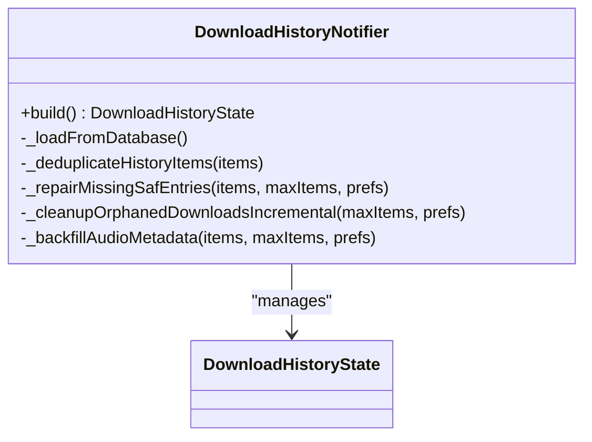

**Diagram sources**
- [download_queue_provider.dart:486-800](file://lib/providers/download_queue_provider.dart#L486-L800)

**Section sources**
- [download_queue_provider.dart:486-800](file://lib/providers/download_queue_provider.dart#L486-L800)

### Extension Provider (Notifier)
- Purpose: Manage installed extensions, health checks, provider priorities, and migration of retired built-in providers.
- Pattern: Notifier<ExtensionState> with lifecycle-aware initialization, health caching, and reconciliation logic.

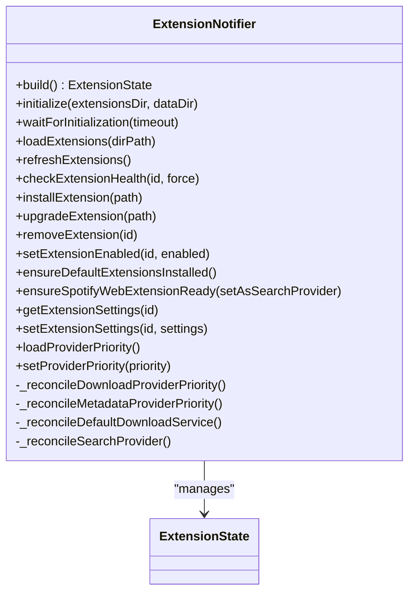

**Diagram sources**
- [extension_provider.dart:797-1599](file://lib/providers/extension_provider.dart#L797-L1599)

**Section sources**
- [extension_provider.dart:797-1599](file://lib/providers/extension_provider.dart#L797-L1599)

### Library Collections Provider (Notifier)
- Purpose: Persist and query user collections (wishlist, loved tracks, playlists, favorites).
- Pattern: Notifier<LibraryCollectionsState> with snapshot loading, normalization, and migration of legacy keys.

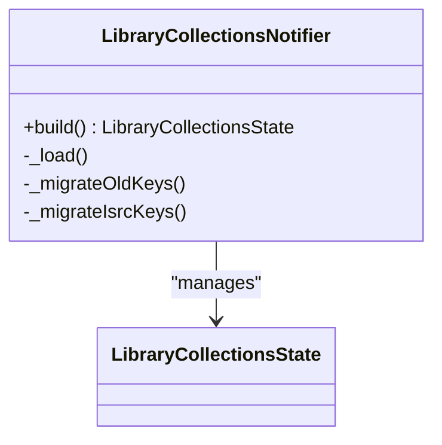

**Diagram sources**
- [library_collections_provider.dart:666-800](file://lib/providers/library_collections_provider.dart#L666-L800)

**Section sources**
- [library_collections_provider.dart:666-800](file://lib/providers/library_collections_provider.dart#L666-L800)

### Playback Stack (Notifier + NotifierProvider + StateNotifierProvider)
- Purpose: Coordinate playback of local and remote tracks, queue management, and video/lyrics prefetch.
- Pattern:
  - PlaybackController (Notifier) orchestrates playback decisions and delegates to audio player.
  - AudioPlayerNotifier (Notifier) manages MediaKit player lifecycle, downloads, and stats logging.
  - PlaybackQueueNotifier (Notifier) maintains queue state and repeat/shuffle modes.

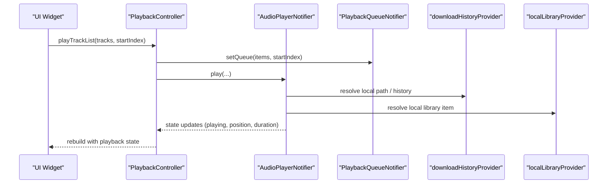

**Diagram sources**
- [playback_provider.dart:16-203](file://lib/providers/playback_provider.dart#L16-L203)
- [audio_player_provider.dart:89-651](file://lib/providers/audio_player_provider.dart#L89-L651)
- [playback_queue_provider.dart:94-237](file://lib/providers/playback_queue_provider.dart#L94-L237)

**Section sources**
- [playback_provider.dart:16-203](file://lib/providers/playback_provider.dart#L16-L203)
- [audio_player_provider.dart:89-651](file://lib/providers/audio_player_provider.dart#L89-L651)
- [playback_queue_provider.dart:94-237](file://lib/providers/playback_queue_provider.dart#L94-L237)

### Statistics Provider (Provider + FutureProvider)
- Purpose: Provide access to stats database and derived analytics.
- Pattern: Provider for the database singleton and FutureProvider for queries.

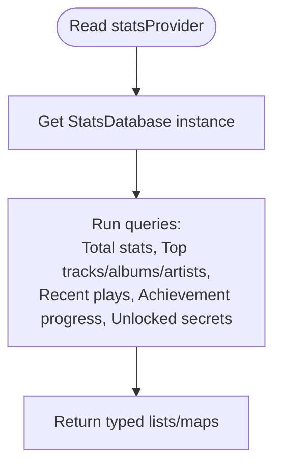

**Diagram sources**
- [stats_provider.dart:4-35](file://lib/providers/stats_provider.dart#L4-L35)

**Section sources**
- [stats_provider.dart:4-35](file://lib/providers/stats_provider.dart#L4-L35)

### Theme Provider (NotifierProvider)
- Purpose: Manage theme settings with persistence to SharedPreferences.
- Pattern: Notifier<ThemeSettings> with setters that update state and persist.

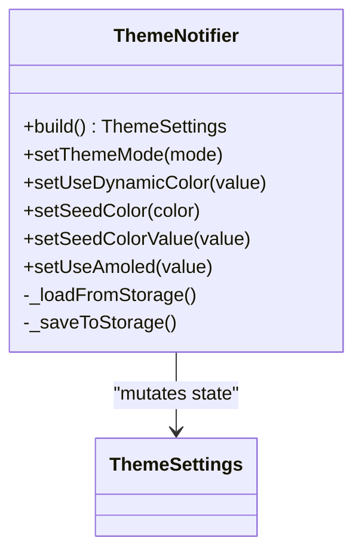

**Diagram sources**
- [theme_provider.dart:6-83](file://lib/providers/theme_provider.dart#L6-L83)

**Section sources**
- [theme_provider.dart:6-83](file://lib/providers/theme_provider.dart#L6-L83)

## Dependency Analysis
Providers depend on each other to coordinate features. The diagram below highlights key dependencies.

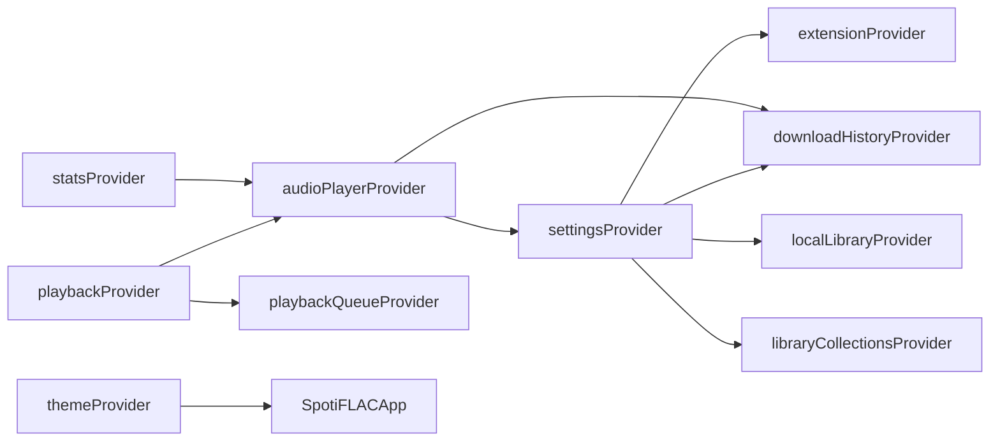

**Diagram sources**
- [settings_provider.dart:27-675](file://lib/providers/settings_provider.dart#L27-L675)
- [extension_provider.dart:797-1599](file://lib/providers/extension_provider.dart#L797-L1599)
- [download_queue_provider.dart:486-800](file://lib/providers/download_queue_provider.dart#L486-L800)
- [local_library_provider.dart:95-339](file://lib/providers/local_library_provider.dart#L95-L339)
- [library_collections_provider.dart:666-800](file://lib/providers/library_collections_provider.dart#L666-L800)
- [playback_provider.dart:16-203](file://lib/providers/playback_provider.dart#L16-L203)
- [audio_player_provider.dart:89-651](file://lib/providers/audio_player_provider.dart#L89-L651)
- [playback_queue_provider.dart:94-237](file://lib/providers/playback_queue_provider.dart#L94-L237)
- [stats_provider.dart:4-35](file://lib/providers/stats_provider.dart#L4-L35)
- [theme_provider.dart:6-83](file://lib/providers/theme_provider.dart#L6-L83)
- [app.dart:54-98](file://lib/app.dart#L54-L98)

**Section sources**
- [settings_provider.dart:27-675](file://lib/providers/settings_provider.dart#L27-L675)
- [extension_provider.dart:797-1599](file://lib/providers/extension_provider.dart#L797-L1599)
- [download_queue_provider.dart:486-800](file://lib/providers/download_queue_provider.dart#L486-L800)
- [local_library_provider.dart:95-339](file://lib/providers/local_library_provider.dart#L95-L339)
- [library_collections_provider.dart:666-800](file://lib/providers/library_collections_provider.dart#L666-L800)
- [playback_provider.dart:16-203](file://lib/providers/playback_provider.dart#L16-L203)
- [audio_player_provider.dart:89-651](file://lib/providers/audio_player_provider.dart#L89-L651)
- [playback_queue_provider.dart:94-237](file://lib/providers/playback_queue_provider.dart#L94-L237)
- [stats_provider.dart:4-35](file://lib/providers/stats_provider.dart#L4-L35)
- [theme_provider.dart:6-83](file://lib/providers/theme_provider.dart#L6-L83)
- [app.dart:54-98](file://lib/app.dart#L54-L98)

## Performance Considerations
- Use NotifierProvider for imperative state machines (e.g., player, playback controller) to minimize rebuild scope.
- Prefer StateNotifierProvider for stateful UI logic with explicit state classes to reduce accidental rebuilds.
- Use FutureProvider for derived async data to avoid recomputation and leverage caching semantics.
- Avoid unnecessary writes: batch updates and debounce frequent writes (e.g., settings save queue).
- Leverage selective watching: watch only the parts of state needed by a widget (e.g., settings.select(...)).
- Warm-up providers during startup to reduce jank (as seen in eager initialization).
- Use invalidate judiciously to trigger targeted recomputations (e.g., stats after playback completion).

[No sources needed since this section provides general guidance]

## Troubleshooting Guide
Common issues and techniques:
- Provider not updating UI
  - Ensure you are watching the correct provider and not holding onto stale refs.
  - Verify that state mutations occur via notifier methods and not external state changes.
- Frequent rebuilds
  - Split providers to narrow scope; avoid watching global state in small widgets.
  - Use select to watch only the fields you need.
- Async provider stalls
  - Confirm FutureProvider is awaited properly and errors are handled.
  - Add fallback UI and loading indicators.
- Settings not persisted
  - Check save routines and error logs; confirm SharedPreferences availability.
- Extension health flapping
  - Health checks are cached; verify TTL and force refresh when needed.
- Playback not starting
  - Verify local path existence and player readiness; inspect player streams for errors.

**Section sources**
- [audio_player_provider.dart:107-188](file://lib/providers/audio_player_provider.dart#L107-L188)
- [extension_provider.dart:955-1015](file://lib/providers/extension_provider.dart#L955-L1015)
- [settings_provider.dart:219-249](file://lib/providers/settings_provider.dart#L219-L249)

## Conclusion
Riverpod enables a scalable, maintainable state architecture in Bitly. By choosing the right provider type for each concern—NotifierProvider for imperative logic, StateNotifierProvider for UI state, FutureProvider for async reads—the app achieves fine-grained reactivity, clear dependencies, and robust integration with native services. Following the best practices and patterns outlined here ensures predictable behavior, strong performance, and easier debugging.