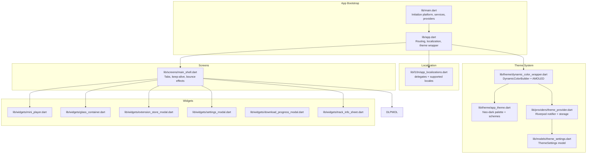
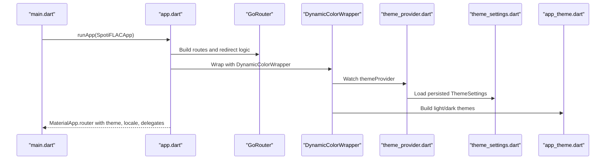
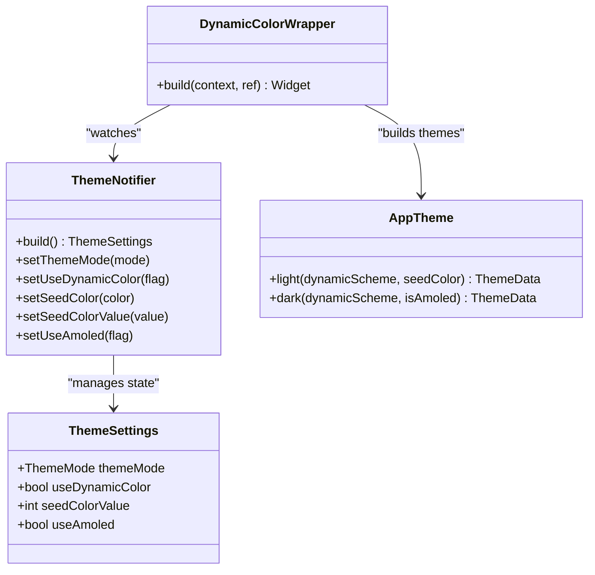
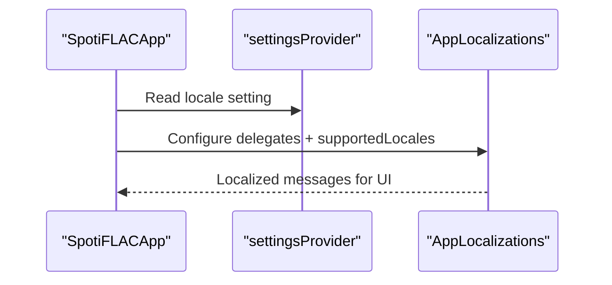
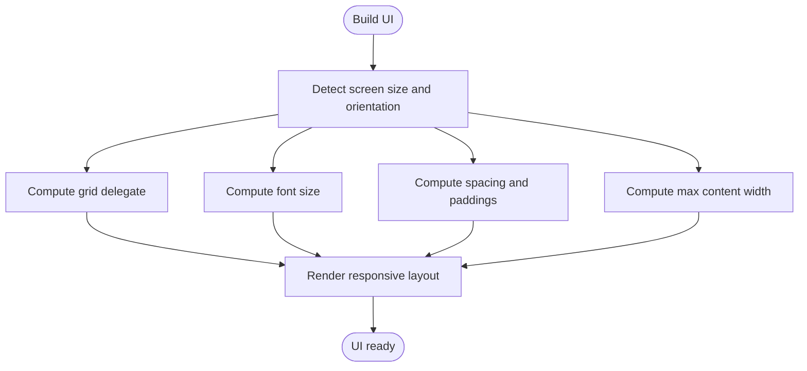
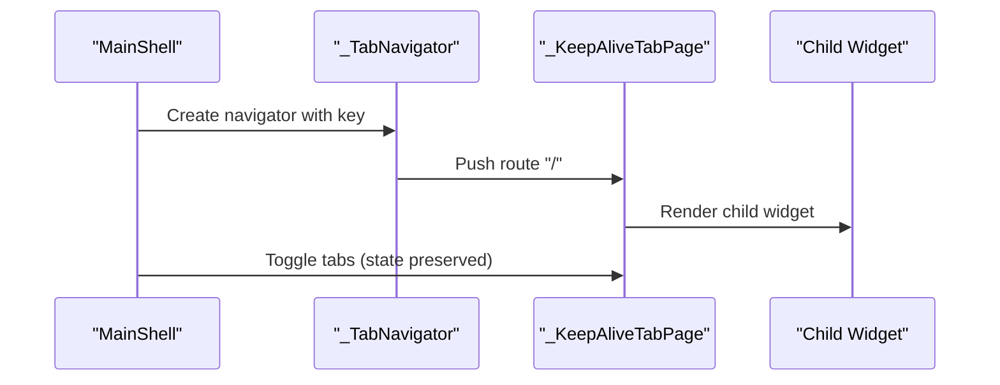
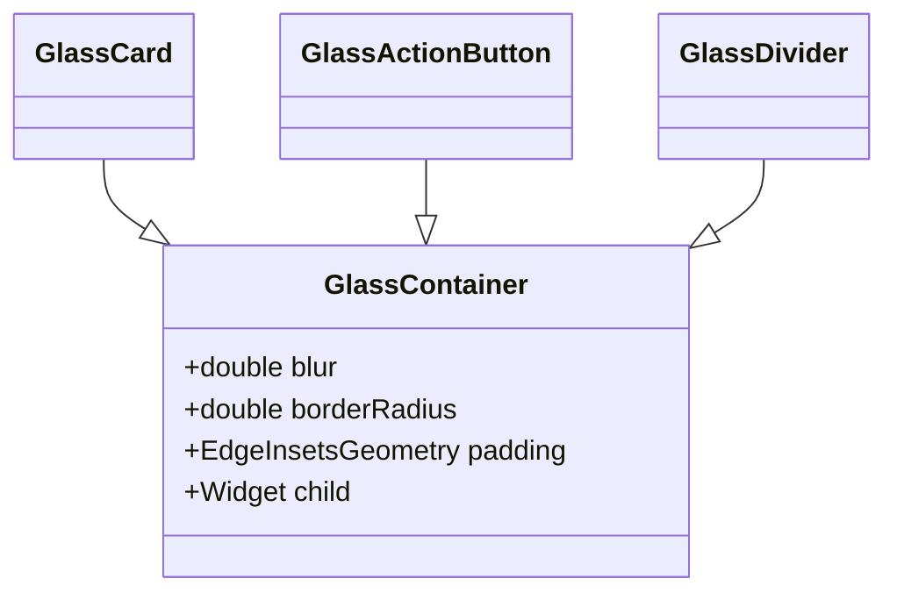
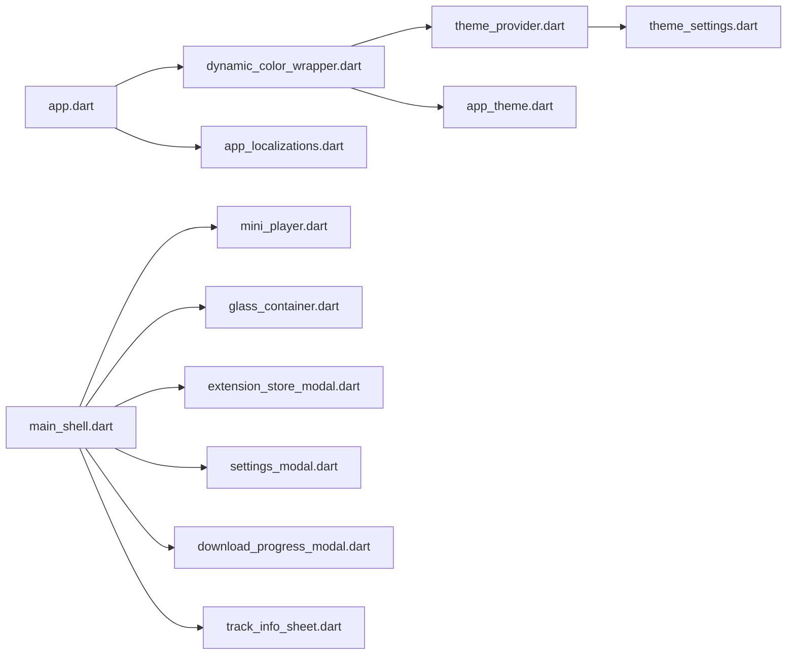

# UI Components and Widgets

<cite>
**Referenced Files in This Document**
- [main.dart](file://lib/main.dart)
- [app.dart](file://lib/app.dart)
- [dynamic_color_wrapper.dart](file://lib/theme/dynamic_color_wrapper.dart)
- [app_theme.dart](file://lib/theme/app_theme.dart)
- [theme_provider.dart](file://lib/providers/theme_provider.dart)
- [theme_settings.dart](file://lib/models/theme_settings.dart)
- [responsive_helper.dart](file://lib/utils/responsive_helper.dart)
- [app_localizations.dart](file://lib/l10n/app_localizations.dart)
- [appearance_settings_page.dart](file://lib/screens/settings/appearance_settings_page.dart)
- [main_shell.dart](file://lib/screens/main_shell.dart)
- [track_info_sheet.dart](file://lib/widgets/track_info_sheet.dart)
- [mini_player.dart](file://lib/widgets/mini_player.dart)
- [glass_container.dart](file://lib/widgets/glass_container.dart)
- [extension_store_modal.dart](file://lib/widgets/extension_store_modal.dart)
- [settings_modal.dart](file://lib/widgets/settings_modal.dart)
- [download_progress_modal.dart](file://lib/widgets/download_progress_modal.dart)
</cite>

## Table of Contents
1. [Introduction](#introduction)
2. [Project Structure](#project-structure)
3. [Core Components](#core-components)
4. [Architecture Overview](#architecture-overview)
5. [Detailed Component Analysis](#detailed-component-analysis)
6. [Dependency Analysis](#dependency-analysis)
7. [Performance Considerations](#performance-considerations)
8. [Troubleshooting Guide](#troubleshooting-guide)
9. [Conclusion](#conclusion)
10. [Appendices](#appendices)

## Introduction
This document explains the UI components and widget architecture of the Flutter application. It covers reusable widget patterns, custom widget implementations, widget hierarchy organization, the theme system (including dynamic color, light/dark mode, and AMOLED adjustments), responsive design patterns, localization and internationalization, common UI patterns, widget composition strategies, accessibility features, screen-widget-state relationships, and performance considerations for rendering and memory management.

## Project Structure
The UI stack is organized around:
- Application bootstrap and routing in [app.dart](file://lib/app.dart) and [main.dart](file://lib/main.dart)
- Theme system in [dynamic_color_wrapper.dart](file://lib/theme/dynamic_color_wrapper.dart), [app_theme.dart](file://lib/theme/app_theme.dart), [theme_provider.dart](file://lib/providers/theme_provider.dart), and [theme_settings.dart](file://lib/models/theme_settings.dart)
- Localization in [app_localizations.dart](file://lib/l10n/app_localizations.dart)
- Responsive helpers in [responsive_helper.dart](file://lib/utils/responsive_helper.dart)
- Screens and navigation in [main_shell.dart](file://lib/screens/main_shell.dart)
- Reusable widgets and modals in [mini_player.dart](file://lib/widgets/mini_player.dart), [glass_container.dart](file://lib/widgets/glass_container.dart), [extension_store_modal.dart](file://lib/widgets/extension_store_modal.dart), [settings_modal.dart](file://lib/widgets/settings_modal.dart), [download_progress_modal.dart](file://lib/widgets/download_progress_modal.dart), and [track_info_sheet.dart](file://lib/widgets/track_info_sheet.dart)

**Diagram sources**
- [main.dart:22-44](file://lib/main.dart#L22-L44)
- [app.dart:13-97](file://lib/app.dart#L13-L97)
- [dynamic_color_wrapper.dart:7-49](file://lib/theme/dynamic_color_wrapper.dart#L7-L49)
- [app_theme.dart:5-28](file://lib/theme/app_theme.dart#L5-L28)
- [theme_provider.dart:6-82](file://lib/providers/theme_provider.dart#L6-L82)
- [theme_settings.dart:47-77](file://lib/models/theme_settings.dart#L47-L77)
- [app_localizations.dart:6423-6436](file://lib/l10n/app_localizations.dart#L6423-L6436)
- [main_shell.dart:605-662](file://lib/screens/main_shell.dart#L605-L662)
- [mini_player.dart](file://lib/widgets/mini_player.dart)
- [glass_container.dart](file://lib/widgets/glass_container.dart)
- [extension_store_modal.dart](file://lib/widgets/extension_store_modal.dart)
- [settings_modal.dart](file://lib/widgets/settings_modal.dart)
- [download_progress_modal.dart](file://lib/widgets/download_progress_modal.dart)
- [track_info_sheet.dart:398-428](file://lib/widgets/track_info_sheet.dart#L398-L428)

**Section sources**
- [main.dart:22-44](file://lib/main.dart#L22-L44)
- [app.dart:13-97](file://lib/app.dart#L13-L97)

## Core Components
- Theme system: DynamicColorBuilder integrates system dynamic color or seed-based schemes, with optional AMOLED adjustments and theme mode selection. See [dynamic_color_wrapper.dart:19-48](file://lib/theme/dynamic_color_wrapper.dart#L19-L48) and [app_theme.dart:22-28](file://lib/theme/app_theme.dart#L22-L28).
- Theme provider: Riverpod notifier persists and updates theme settings to storage. See [theme_provider.dart:10-82](file://lib/providers/theme_provider.dart#L10-L82) and [theme_settings.dart:47-77](file://lib/models/theme_settings.dart#L47-L77).
- Localization: AppLocalizations delegates and supported locales configured in the app shell. See [app_localizations.dart:6423-6436](file://lib/l10n/app_localizations.dart#L6423-L6436) and [app.dart:86-92](file://lib/app.dart#L86-L92).
- Responsive helpers: Utilities for adaptive grids, typography, spacing, and max content widths. See [responsive_helper.dart](file://lib/utils/responsive_helper.dart).
- Screens and navigation: Tabbed shell with keep-alive pages and animated effects. See [main_shell.dart:605-662](file://lib/screens/main_shell.dart#L605-L662).
- Reusable widgets: Mini player, glass containers, and modal components. See [mini_player.dart](file://lib/widgets/mini_player.dart), [glass_container.dart](file://lib/widgets/glass_container.dart), [extension_store_modal.dart](file://lib/widgets/extension_store_modal.dart), [settings_modal.dart](file://lib/widgets/settings_modal.dart), [download_progress_modal.dart](file://lib/widgets/download_progress_modal.dart), [track_info_sheet.dart:398-428](file://lib/widgets/track_info_sheet.dart#L398-L428).

**Section sources**
- [dynamic_color_wrapper.dart:7-49](file://lib/theme/dynamic_color_wrapper.dart#L7-L49)
- [app_theme.dart:5-28](file://lib/theme/app_theme.dart#L5-L28)
- [theme_provider.dart:6-82](file://lib/providers/theme_provider.dart#L6-L82)
- [theme_settings.dart:47-77](file://lib/models/theme_settings.dart#L47-L77)
- [app_localizations.dart:6423-6436](file://lib/l10n/app_localizations.dart#L6423-L6436)
- [app.dart:67-92](file://lib/app.dart#L67-L92)
- [responsive_helper.dart](file://lib/utils/responsive_helper.dart)
- [main_shell.dart:605-662](file://lib/screens/main_shell.dart#L605-L662)
- [mini_player.dart](file://lib/widgets/mini_player.dart)
- [glass_container.dart](file://lib/widgets/glass_container.dart)
- [extension_store_modal.dart](file://lib/widgets/extension_store_modal.dart)
- [settings_modal.dart](file://lib/widgets/settings_modal.dart)
- [download_progress_modal.dart](file://lib/widgets/download_progress_modal.dart)
- [track_info_sheet.dart:398-428](file://lib/widgets/track_info_sheet.dart#L398-L428)

## Architecture Overview
The UI architecture centers on a Riverpod-driven theme pipeline, dynamic color integration, and a modular widget library. Routing and localization are configured at the app level, while screens orchestrate navigation and lifecycle-aware page caching.

**Diagram sources**
- [main.dart:22-44](file://lib/main.dart#L22-L44)
- [app.dart:13-97](file://lib/app.dart#L13-L97)
- [dynamic_color_wrapper.dart:15-48](file://lib/theme/dynamic_color_wrapper.dart#L15-L48)
- [theme_provider.dart:14-36](file://lib/providers/theme_provider.dart#L14-L36)
- [theme_settings.dart:47-77](file://lib/models/theme_settings.dart#L47-L77)
- [app_theme.dart:22-28](file://lib/theme/app_theme.dart#L22-L28)

## Detailed Component Analysis

### Theme System: Dynamic Color, Light/Dark Mode, AMOLED
- DynamicColorBuilder selects system dynamic color when enabled and available; otherwise, seed-based schemes are used. See [dynamic_color_wrapper.dart:19-37](file://lib/theme/dynamic_color_wrapper.dart#L19-L37).
- AMOLED mode adjusts dark surface tones to pure black and related surfaces. See [dynamic_color_wrapper.dart:39-64](file://lib/theme/dynamic_color_wrapper.dart#L39-L64).
- ThemeProvider persists and updates ThemeSettings to shared preferences. See [theme_provider.dart:19-48](file://lib/providers/theme_provider.dart#L19-L48).
- ThemeSettings encapsulates theme mode, dynamic color flag, seed color, and AMOLED toggle. See [theme_settings.dart:47-77](file://lib/models/theme_settings.dart#L47-L77).
- AppTheme defines a cohesive neo-dark palette and builds light/dark themes. See [app_theme.dart:5-28](file://lib/theme/app_theme.dart#L5-L28).
- Appearance settings UI toggles dynamic color, seed color picker, and AMOLED option. See [appearance_settings_page.dart:53-83](file://lib/screens/settings/appearance_settings_page.dart#L53-L83).

**Diagram sources**
- [theme_settings.dart:47-77](file://lib/models/theme_settings.dart#L47-L77)
- [theme_provider.dart:10-82](file://lib/providers/theme_provider.dart#L10-L82)
- [dynamic_color_wrapper.dart:7-49](file://lib/theme/dynamic_color_wrapper.dart#L7-L49)
- [app_theme.dart:22-28](file://lib/theme/app_theme.dart#L22-L28)

**Section sources**
- [dynamic_color_wrapper.dart:19-64](file://lib/theme/dynamic_color_wrapper.dart#L19-L64)
- [theme_provider.dart:19-82](file://lib/providers/theme_provider.dart#L19-L82)
- [theme_settings.dart:47-77](file://lib/models/theme_settings.dart#L47-L77)
- [app_theme.dart:5-28](file://lib/theme/app_theme.dart#L5-L28)
- [appearance_settings_page.dart:53-83](file://lib/screens/settings/appearance_settings_page.dart#L53-L83)

### Localization and Internationalization
- AppLocalizations delegates include material, widgets, and cupertino localizations plus the app-specific delegate. See [app_localizations.dart:6423-6436](file://lib/l10n/app_localizations.dart#L6423-L6436).
- Supported locales are limited to English and Spanish. See [app_localizations.dart](file://lib/l10n/app_localizations.dart#L6432).
- The app shell configures locale resolution from settings and sets localizations delegates and supported locales. See [app.dart:67-92](file://lib/app.dart#L67-L92).

**Diagram sources**
- [app.dart:67-92](file://lib/app.dart#L67-L92)
- [app_localizations.dart:6423-6436](file://lib/l10n/app_localizations.dart#L6423-L6436)

**Section sources**
- [app_localizations.dart:6423-6436](file://lib/l10n/app_localizations.dart#L6423-L6436)
- [app.dart:67-92](file://lib/app.dart#L67-L92)

### Responsive Design Patterns
- ResponsiveHelper provides adaptive grid delegates, font sizing, spacing, card sizes, and max content widths. See [responsive_helper.dart](file://lib/utils/responsive_helper.dart).
- Usage patterns include responsive grid views and text sizing across breakpoints. See [responsive_helper.dart](file://lib/utils/responsive_helper.dart).

**Diagram sources**
- [responsive_helper.dart](file://lib/utils/responsive_helper.dart)

**Section sources**
- [responsive_helper.dart](file://lib/utils/responsive_helper.dart)

### Screen Navigation and Page Lifecycle
- MainShell composes tabs with Navigator and keeps pages alive across tab switches. See [main_shell.dart:605-628](file://lib/screens/main_shell.dart#L605-L628).
- KeepAliveTabPage uses AutomaticKeepAliveClientMixin to preserve state. See [main_shell.dart:630-649](file://lib/screens/main_shell.dart#L630-L649).
- Animated effects (e.g., bouncing icons) demonstrate interactive feedback. See [main_shell.dart:651-662](file://lib/screens/main_shell.dart#L651-L662).

**Diagram sources**
- [main_shell.dart:605-649](file://lib/screens/main_shell.dart#L605-L649)

**Section sources**
- [main_shell.dart:605-662](file://lib/screens/main_shell.dart#L605-L662)

### Reusable Widgets and Modals
- MiniPlayer: Floating pill-shaped player component. See [mini_player.dart](file://lib/widgets/mini_player.dart).
- GlassContainer: Base container with blur and rounded corners; used to build GlassCard, GlassActionButton, and GlassDivider. See [glass_container.dart](file://lib/widgets/glass_container.dart).
- Modals: ExtensionStoreModal, SettingsModal, DownloadProgressModal provide focused workflows. See [extension_store_modal.dart](file://lib/widgets/extension_store_modal.dart), [settings_modal.dart](file://lib/widgets/settings_modal.dart), [download_progress_modal.dart](file://lib/widgets/download_progress_modal.dart).
- TrackInfoSheet: Details panel with label-value rows using colorScheme tokens. See [track_info_sheet.dart:398-428](file://lib/widgets/track_info_sheet.dart#L398-L428).

**Diagram sources**
- [glass_container.dart](file://lib/widgets/glass_container.dart)
- [mini_player.dart](file://lib/widgets/mini_player.dart)
- [extension_store_modal.dart](file://lib/widgets/extension_store_modal.dart)
- [settings_modal.dart](file://lib/widgets/settings_modal.dart)
- [download_progress_modal.dart](file://lib/widgets/download_progress_modal.dart)
- [track_info_sheet.dart:398-428](file://lib/widgets/track_info_sheet.dart#L398-L428)

**Section sources**
- [mini_player.dart](file://lib/widgets/mini_player.dart)
- [glass_container.dart](file://lib/widgets/glass_container.dart)
- [extension_store_modal.dart](file://lib/widgets/extension_store_modal.dart)
- [settings_modal.dart](file://lib/widgets/settings_modal.dart)
- [download_progress_modal.dart](file://lib/widgets/download_progress_modal.dart)
- [track_info_sheet.dart:398-428](file://lib/widgets/track_info_sheet.dart#L398-L428)

### Common UI Patterns and Composition Strategies
- Adaptive theming: Components read Theme.of(context).colorScheme and apply alpha-blended variants for surfaces and outlines. See [track_info_sheet.dart:398-428](file://lib/widgets/track_info_sheet.dart#L398-L428).
- Chip-based selection: View mode chips adapt to dark/light with alpha-blended backgrounds. See [appearance_settings_page.dart:643-668](file://lib/screens/settings/appearance_settings_page.dart#L643-L668).
- Interactive examples: Animated cards and search examples demonstrate motion and feedback. See [main_shell.dart:651-662](file://lib/screens/main_shell.dart#L651-L662) and [main_shell.dart:332-385](file://lib/screens/main_shell.dart#L332-L385).

**Section sources**
- [track_info_sheet.dart:398-428](file://lib/widgets/track_info_sheet.dart#L398-L428)
- [appearance_settings_page.dart:643-668](file://lib/screens/settings/appearance_settings_page.dart#L643-L668)
- [main_shell.dart:332-385](file://lib/screens/main_shell.dart#L332-L385)

### Accessibility Features
- Semantic contrast: Components rely on colorScheme tokens and outlineVariant for sufficient contrast.
- Motion controls: Overscroll effects can be disabled via settings for devices that require reduced motion. See [app.dart:63-65](file://lib/app.dart#L63-L65) and [main.dart:46-74](file://lib/main.dart#L46-L74).
- Focus and gestures: Standard Flutter widgets (buttons, chips, modals) follow platform accessibility guidelines.

**Section sources**
- [app.dart:63-65](file://lib/app.dart#L63-L65)
- [main.dart:46-74](file://lib/main.dart#L46-L74)

## Dependency Analysis
The theme pipeline depends on Riverpod for state, shared preferences for persistence, and dynamic color packages for system integration. Localization depends on generated delegates and supported locales. Screens depend on widgets and modals for composition.

**Diagram sources**
- [theme_provider.dart:6-82](file://lib/providers/theme_provider.dart#L6-L82)
- [theme_settings.dart:47-77](file://lib/models/theme_settings.dart#L47-L77)
- [dynamic_color_wrapper.dart:7-49](file://lib/theme/dynamic_color_wrapper.dart#L7-L49)
- [app_theme.dart:22-28](file://lib/theme/app_theme.dart#L22-L28)
- [app.dart:13-97](file://lib/app.dart#L13-L97)
- [app_localizations.dart:6423-6436](file://lib/l10n/app_localizations.dart#L6423-L6436)
- [main_shell.dart:605-662](file://lib/screens/main_shell.dart#L605-L662)
- [mini_player.dart](file://lib/widgets/mini_player.dart)
- [glass_container.dart](file://lib/widgets/glass_container.dart)
- [extension_store_modal.dart](file://lib/widgets/extension_store_modal.dart)
- [settings_modal.dart](file://lib/widgets/settings_modal.dart)
- [download_progress_modal.dart](file://lib/widgets/download_progress_modal.dart)
- [track_info_sheet.dart:398-428](file://lib/widgets/track_info_sheet.dart#L398-L428)

**Section sources**
- [theme_provider.dart:6-82](file://lib/providers/theme_provider.dart#L6-L82)
- [dynamic_color_wrapper.dart:7-49](file://lib/theme/dynamic_color_wrapper.dart#L7-L49)
- [app.dart:13-97](file://lib/app.dart#L13-L97)
- [main_shell.dart:605-662](file://lib/screens/main_shell.dart#L605-L662)

## Performance Considerations
- Image cache sizing: The app configures PaintingBinding.imageCache maximumSize and maximumSizeBytes to bound memory usage on non-mobile platforms and low-RAM devices. See [main.dart:76-82](file://lib/main.dart#L76-L82).
- Deferred provider warmup: EagerInitialization schedules warmups for providers to reduce jank during first interactions. See [main.dart:143-174](file://lib/main.dart#L143-L174).
- Keep-alive pages: AutomaticKeepAliveClientMixin preserves state across tab switches, reducing rebuild costs. See [main_shell.dart:639-648](file://lib/screens/main_shell.dart#L639-L648).
- Scroll behavior: Overscroll effects can be disabled to reduce unnecessary animations on constrained devices. See [app.dart:63-65](file://lib/app.dart#L63-L65).

**Section sources**
- [main.dart:76-82](file://lib/main.dart#L76-L82)
- [main.dart:143-174](file://lib/main.dart#L143-L174)
- [main_shell.dart:639-648](file://lib/screens/main_shell.dart#L639-L648)
- [app.dart:63-65](file://lib/app.dart#L63-L65)

## Troubleshooting Guide
- Theme not updating: Verify ThemeProvider saves to SharedPreferences and rebuilds dependents. See [theme_provider.dart:38-48](file://lib/providers/theme_provider.dart#L38-L48).
- Dynamic color not applied: Confirm device supports dynamic color and useDynamicColor is enabled. See [dynamic_color_wrapper.dart:24-37](file://lib/theme/dynamic_color_wrapper.dart#L24-L37).
- Localization missing: Ensure supportedLocales match the delegate list and locale is resolved from settings. See [app_localizations.dart](file://lib/l10n/app_localizations.dart#L6432) and [app.dart:67-92](file://lib/app.dart#L67-L92).
- Excessive memory usage: Adjust image cache limits and avoid retaining large lists unnecessarily. See [main.dart:76-82](file://lib/main.dart#L76-L82).

**Section sources**
- [theme_provider.dart:38-48](file://lib/providers/theme_provider.dart#L38-L48)
- [dynamic_color_wrapper.dart:24-37](file://lib/theme/dynamic_color_wrapper.dart#L24-L37)
- [app_localizations.dart](file://lib/l10n/app_localizations.dart#L6432)
- [app.dart:67-92](file://lib/app.dart#L67-L92)
- [main.dart:76-82](file://lib/main.dart#L76-L82)

## Conclusion
The application employs a clean separation of concerns: Riverpod manages theme state, DynamicColorBuilder integrates system and seed-based palettes, and AppTheme defines a cohesive visual language. Localization and responsive helpers ensure global reach and adaptability. Screens compose reusable widgets and modals, while lifecycle-aware keep-alive pages optimize performance. Together, these patterns deliver a scalable, maintainable, and accessible UI architecture.

## Appendices
- Example widget composition: Use GlassContainer as a base for GlassCard and GlassActionButton; apply colorScheme tokens for consistent theming. See [glass_container.dart](file://lib/widgets/glass_container.dart).
- Adaptive layouts: Use ResponsiveHelper for grids and typography; enforce max content widths on large screens. See [responsive_helper.dart](file://lib/utils/responsive_helper.dart).
- State and navigation: Combine Riverpod providers with GoRouter and Navigator keys for robust navigation and state synchronization. See [app.dart:13-52](file://lib/app.dart#L13-L52) and [main_shell.dart:605-628](file://lib/screens/main_shell.dart#L605-L628).