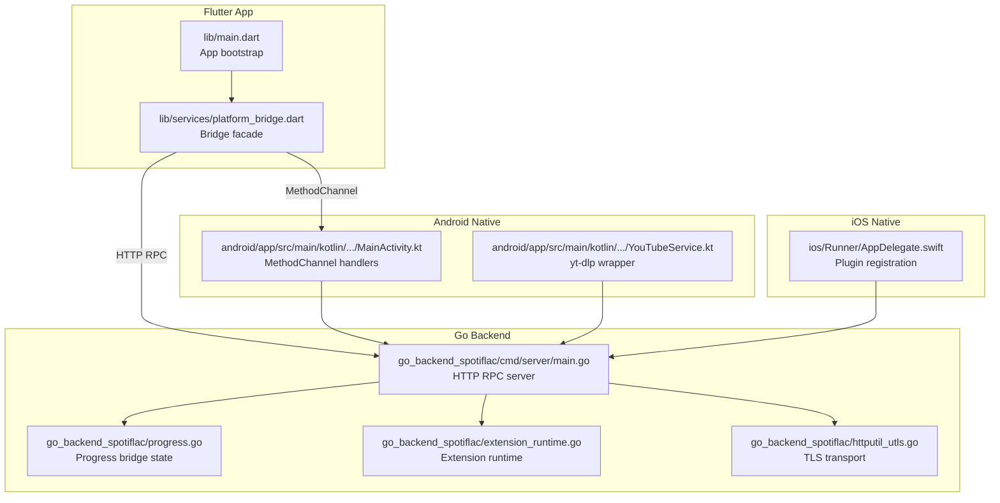
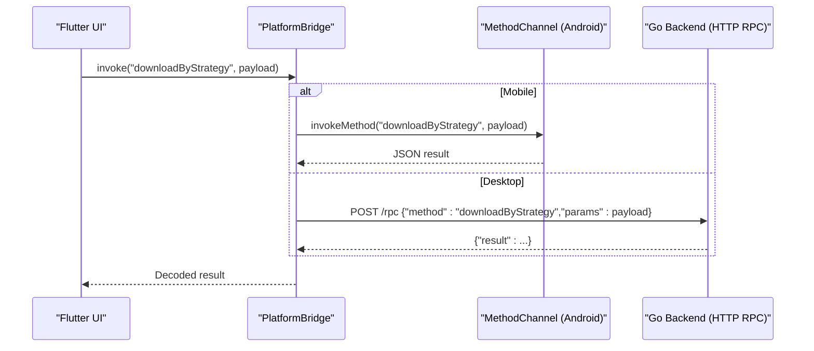
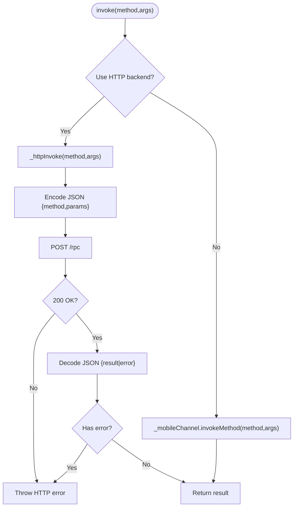
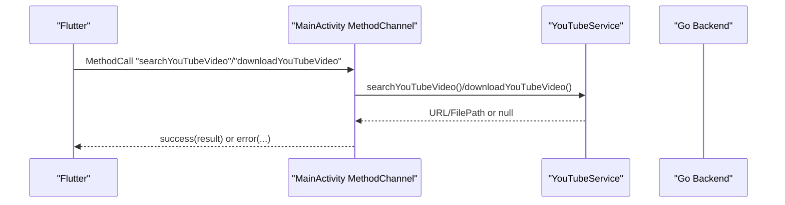
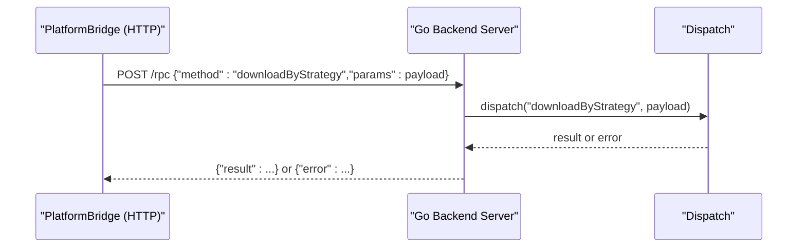
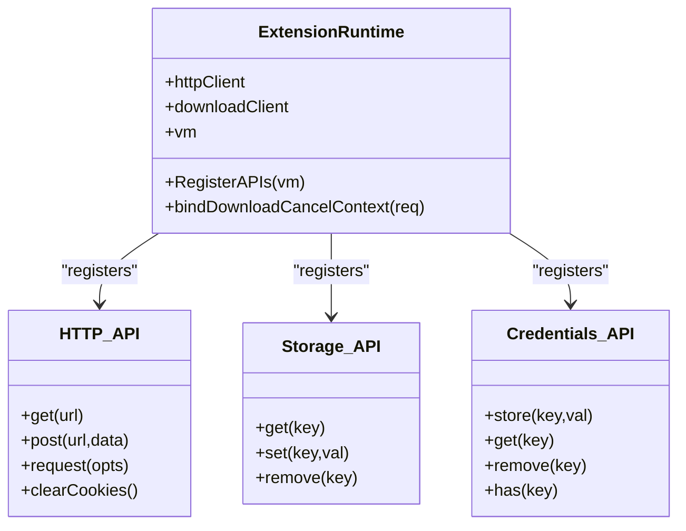
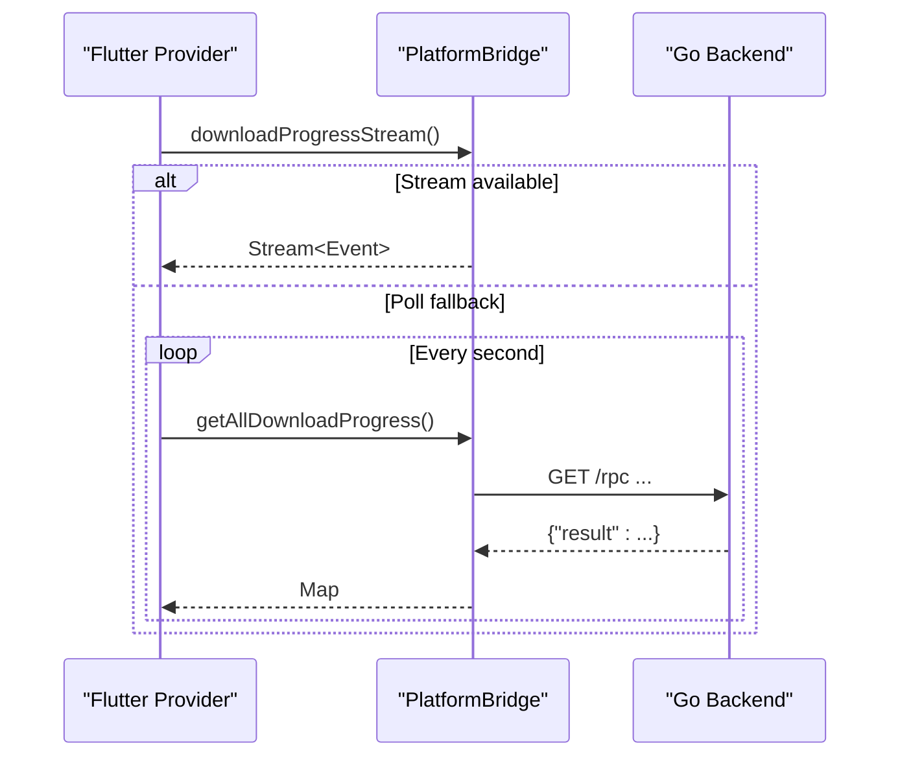
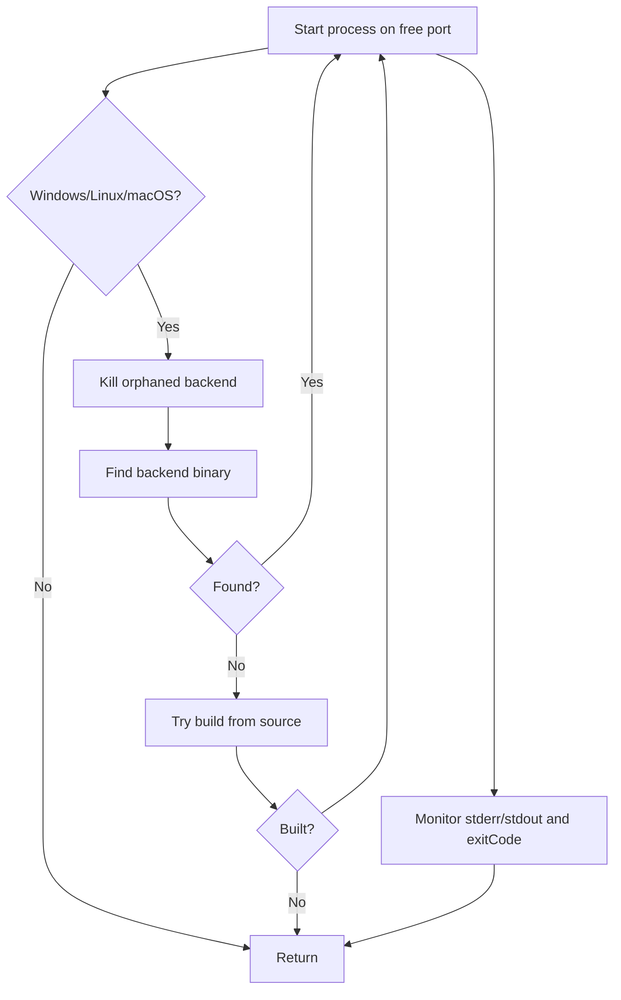
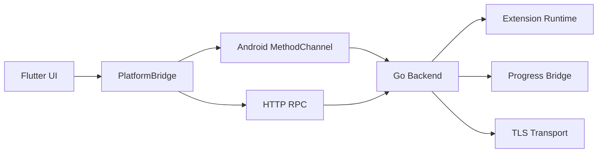

# Platform Bridge

<cite>
**Referenced Files in This Document**
- [lib/main.dart](file://lib/main.dart)
- [lib/services/platform_bridge.dart](file://lib/services/platform_bridge.dart)
- [android/app/src/main/kotlin/com/example/bitly/MainActivity.kt](file://android/app/src/main/kotlin/com/example/bitly/MainActivity.kt)
- [android/app/src/main/kotlin/com/example/bitly/YouTubeService.kt](file://android/app/src/main/kotlin/com/example/bitly/YouTubeService.kt)
- [ios/Runner/AppDelegate.swift](file://ios/Runner/AppDelegate.swift)
- [go_backend_spotiflac/cmd/server/main.go](file://go_backend_spotiflac/cmd/server/main.go)
- [go_backend_spotiflac/progress.go](file://go_backend_spotiflac/progress.go)
- [go_backend_spotiflac/extension_runtime.go](file://go_backend_spotiflac/extension_runtime.go)
- [go_backend_spotiflac/httputil_utls.go](file://go_backend_spotiflac/httputil_utls.go)
- [go_backend_spotiflac/mobile_deps.go](file://go_backend_spotiflac/mobile_deps.go)
- [lib/providers/download_queue_provider.dart](file://lib/providers/download_queue_provider.dart)
- [lib/utils/logger.dart](file://lib/utils/logger.dart)
</cite>

## Table of Contents
1. [Introduction](#introduction)
2. [Project Structure](#project-structure)
3. [Core Components](#core-components)
4. [Architecture Overview](#architecture-overview)
5. [Detailed Component Analysis](#detailed-component-analysis)
6. [Dependency Analysis](#dependency-analysis)
7. [Performance Considerations](#performance-considerations)
8. [Troubleshooting Guide](#troubleshooting-guide)
9. [Conclusion](#conclusion)

## Introduction
This document explains the platform bridge architecture that connects the Flutter frontend to native platforms and a Go-based backend. It covers:
- Dual communication modes: MethodChannel (mobile) and HTTP RPC (desktop)
- Cross-platform abstraction layer and platform-specific implementations
- Backend process management and lifecycle
- Request routing, caching, and event streaming
- Practical examples of method invocation, event streaming, and error handling
- Performance optimization strategies

## Project Structure
The bridge spans three layers:
- Flutter app layer: entrypoint, initialization, and bridge facade
- Native layer: Android/iOS plugin registration and channel handlers
- Go backend: HTTP server exposing RPC methods and extension runtime

**Diagram sources**
- [lib/main.dart:22-44](file://lib/main.dart#L22-L44)
- [lib/services/platform_bridge.dart:37-53](file://lib/services/platform_bridge.dart#L37-L53)
- [android/app/src/main/kotlin/com/example/bitly/MainActivity.kt:23-133](file://android/app/src/main/kotlin/com/example/bitly/MainActivity.kt#L23-L133)
- [android/app/src/main/kotlin/com/example/bitly/YouTubeService.kt:10-92](file://android/app/src/main/kotlin/com/example/bitly/YouTubeService.kt#L10-L92)
- [ios/Runner/AppDelegate.swift:4-13](file://ios/Runner/AppDelegate.swift#L4-L13)
- [go_backend_spotiflac/cmd/server/main.go:107-134](file://go_backend_spotiflac/cmd/server/main.go#L107-L134)
- [go_backend_spotiflac/progress.go:107-146](file://go_backend_spotiflac/progress.go#L107-L146)
- [go_backend_spotiflac/extension_runtime.go:84-147](file://go_backend_spotiflac/extension_runtime.go#L84-L147)
- [go_backend_spotiflac/httputil_utls.go:18-66](file://go_backend_spotiflac/httputil_utls.go#L18-L66)

**Section sources**
- [lib/main.dart:22-44](file://lib/main.dart#L22-L44)
- [lib/services/platform_bridge.dart:37-53](file://lib/services/platform_bridge.dart#L37-L53)
- [android/app/src/main/kotlin/com/example/bitly/MainActivity.kt:23-133](file://android/app/src/main/kotlin/com/example/bitly/MainActivity.kt#L23-L133)
- [ios/Runner/AppDelegate.swift:4-13](file://ios/Runner/AppDelegate.swift#L4-L13)
- [go_backend_spotiflac/cmd/server/main.go:107-134](file://go_backend_spotiflac/cmd/server/main.go#L107-L134)

## Core Components
- PlatformBridge: Central facade that selects the communication mode and routes calls to either MethodChannel or HTTP RPC. It also manages caches, in-flight requests, and event streams.
- Android MainActivity: Registers MethodChannel handlers and delegates to the Go backend via exported functions.
- Go backend server: Exposes an HTTP RPC endpoint and a set of routes for media playback and downloads.
- Extension runtime: Provides a JavaScript sandbox for extensions with HTTP, storage, credentials, and utility APIs.
- Progress bridge: Maintains multi-item progress state and provides delta updates for efficient UI refresh.

Key responsibilities:
- Dual-mode invocation: invoke(method, args) chooses between MethodChannel and HTTP RPC depending on platform and backend availability.
- Desktop backend lifecycle: initDesktopBackend starts the Go backend process on Windows/Linux/macOS and manages ports.
- Streaming: downloadProgressStream and libraryScanProgressStream provide real-time updates; falls back to polling when streams are unavailable.
- Caching: per-method caches for metadata and availability lookups with persistence and TTL.

**Section sources**
- [lib/services/platform_bridge.dart:37-53](file://lib/services/platform_bridge.dart#L37-L53)
- [lib/services/platform_bridge.dart:83-141](file://lib/services/platform_bridge.dart#L83-L141)
- [lib/services/platform_bridge.dart:218-236](file://lib/services/platform_bridge.dart#L218-L236)
- [android/app/src/main/kotlin/com/example/bitly/MainActivity.kt:23-133](file://android/app/src/main/kotlin/com/example/bitly/MainActivity.kt#L23-L133)
- [go_backend_spotiflac/cmd/server/main.go:124-134](file://go_backend_spotiflac/cmd/server/main.go#L124-L134)
- [go_backend_spotiflac/progress.go:107-146](file://go_backend_spotiflac/progress.go#L107-L146)

## Architecture Overview
The bridge architecture supports two primary paths:
- Mobile (Android/iOS): Flutter invokes native plugins via MethodChannel; the native side calls into the Go backend and returns JSON responses.
- Desktop (Windows/Linux/macOS): Flutter starts and manages a local Go backend process and communicates via HTTP RPC on localhost.

**Diagram sources**
- [lib/services/platform_bridge.dart:44-53](file://lib/services/platform_bridge.dart#L44-L53)
- [android/app/src/main/kotlin/com/example/bitly/MainActivity.kt:26-133](file://android/app/src/main/kotlin/com/example/bitly/MainActivity.kt#L26-L133)
- [go_backend_spotiflac/cmd/server/main.go:359-385](file://go_backend_spotiflac/cmd/server/main.go#L359-L385)

## Detailed Component Analysis

### PlatformBridge: Dual Communication Mode and Caching
- Invocation mode selection: _invoke checks _useHttpBackend and routes to either MethodChannel or HTTP RPC.
- HTTP RPC: _httpInvoke encodes method and params, posts to http://127.0.0.1:PORT/rpc, decodes result, and throws on errors.
- Desktop backend startup: initDesktopBackend kills orphans, finds or builds the backend binary, starts it on a free port, and logs stderr/stdout.
- Caching and in-flight requests: Metadata and availability lookups use in-memory caches with TTL and persistence. In-flight requests avoid duplicate work.
- Event streams: downloadProgressStream and libraryScanProgressStream prefer native streams; otherwise poll via getAllDownloadProgress and getLibraryScanProgress.

**Diagram sources**
- [lib/services/platform_bridge.dart:44-81](file://lib/services/platform_bridge.dart#L44-L81)
- [lib/services/platform_bridge.dart:83-141](file://lib/services/platform_bridge.dart#L83-L141)

**Section sources**
- [lib/services/platform_bridge.dart:44-81](file://lib/services/platform_bridge.dart#L44-L81)
- [lib/services/platform_bridge.dart:83-141](file://lib/services/platform_bridge.dart#L83-L141)
- [lib/services/platform_bridge.dart:218-236](file://lib/services/platform_bridge.dart#L218-L236)

### Android MethodChannel Handlers
- MainActivity registers a MethodChannel with a fixed name and implements handlers for database, settings, extension system, search/youtube, history/collections, lyrics/sync, and SAF utilities.
- Background execution: Uses a single-thread executor to run Go backend calls and posts results back to the main thread.
- YouTube integration: Delegates to YouTubeService for search and download using yt-dlp.

**Diagram sources**
- [android/app/src/main/kotlin/com/example/bitly/MainActivity.kt:26-173](file://android/app/src/main/kotlin/com/example/bitly/MainActivity.kt#L26-L173)
- [android/app/src/main/kotlin/com/example/bitly/YouTubeService.kt:12-52](file://android/app/src/main/kotlin/com/example/bitly/YouTubeService.kt#L12-L52)

**Section sources**
- [android/app/src/main/kotlin/com/example/bitly/MainActivity.kt:26-173](file://android/app/src/main/kotlin/com/example/bitly/MainActivity.kt#L26-L173)
- [android/app/src/main/kotlin/com/example/bitly/YouTubeService.kt:12-52](file://android/app/src/main/kotlin/com/example/bitly/YouTubeService.kt#L12-L52)

### Go Backend HTTP RPC and Playback Routes
- RPC endpoint: handleRPC accepts POST with JSON {method,params} and dispatches to backend functions.
- Playback routes: handlePlay creates or queries download sessions; handleDownload serves completed files.
- Dispatch table: extensive mapping of method names to backend functions, including downloads, metadata, lyrics, extension management, and library scanning.

**Diagram sources**
- [go_backend_spotiflac/cmd/server/main.go:359-385](file://go_backend_spotiflac/cmd/server/main.go#L359-L385)
- [go_backend_spotiflac/cmd/server/main.go:555-800](file://go_backend_spotiflac/cmd/server/main.go#L555-L800)

**Section sources**
- [go_backend_spotiflac/cmd/server/main.go:359-385](file://go_backend_spotiflac/cmd/server/main.go#L359-L385)
- [go_backend_spotiflac/cmd/server/main.go:555-800](file://go_backend_spotiflac/cmd/server/main.go#L555-L800)

### Extension Runtime and Security
- Extension runtime exposes a JavaScript API surface to extensions, including HTTP, storage, credentials, file ops, FFmpeg, matching, and utilities.
- Security: Redirects are restricted to HTTPS unless explicitly allowed; private/local network access is blocked; timeouts configurable per extension.
- Authentication: Pending OAuth flows and token management are tracked centrally.

**Diagram sources**
- [go_backend_spotiflac/extension_runtime.go:424-533](file://go_backend_spotiflac/extension_runtime.go#L424-L533)

**Section sources**
- [go_backend_spotiflac/extension_runtime.go:250-286](file://go_backend_spotiflac/extension_runtime.go#L250-L286)
- [go_backend_spotiflac/extension_runtime.go:300-394](file://go_backend_spotiflac/extension_runtime.go#L300-L394)
- [go_backend_spotiflac/extension_runtime.go:424-533](file://go_backend_spotiflac/extension_runtime.go#L424-L533)

### Progress Bridge and Event Streaming
- Progress bridge maintains multi-item progress with deltas and cached snapshots to minimize serialization overhead.
- Flutter consumers subscribe to streams; if unavailable, they fall back to periodic polling.

**Diagram sources**
- [lib/services/platform_bridge.dart:618-637](file://lib/services/platform_bridge.dart#L618-L637)
- [go_backend_spotiflac/progress.go:125-146](file://go_backend_spotiflac/progress.go#L125-L146)

**Section sources**
- [lib/providers/download_queue_provider.dart:2289-2384](file://lib/providers/download_queue_provider.dart#L2289-L2384)
- [lib/services/platform_bridge.dart:618-637](file://lib/services/platform_bridge.dart#L618-L637)
- [go_backend_spotiflac/progress.go:125-146](file://go_backend_spotiflac/progress.go#L125-L146)

### Desktop Backend Lifecycle Management
- initDesktopBackend detects desktop platforms, kills orphaned processes, locates or builds the backend, and starts it on a free port.
- Port scanning and process monitoring ensure robust startup and logging of stderr/stdout.

**Diagram sources**
- [lib/services/platform_bridge.dart:83-141](file://lib/services/platform_bridge.dart#L83-L141)

**Section sources**
- [lib/services/platform_bridge.dart:83-141](file://lib/services/platform_bridge.dart#L83-L141)

## Dependency Analysis
- Flutter depends on PlatformBridge for all backend interactions.
- Android relies on MethodChannel handlers to call into the Go backend and yt-dlp for YouTube operations.
- iOS integrates via GeneratedPluginRegistrant and delegates heavy tasks to the Go backend.
- Go backend depends on extension runtime, progress bridge, and TLS utilities for secure HTTP.

**Diagram sources**
- [lib/services/platform_bridge.dart:37-53](file://lib/services/platform_bridge.dart#L37-L53)
- [android/app/src/main/kotlin/com/example/bitly/MainActivity.kt:23-133](file://android/app/src/main/kotlin/com/example/bitly/MainActivity.kt#L23-L133)
- [go_backend_spotiflac/cmd/server/main.go:107-134](file://go_backend_spotiflac/cmd/server/main.go#L107-L134)
- [go_backend_spotiflac/extension_runtime.go:84-147](file://go_backend_spotiflac/extension_runtime.go#L84-L147)
- [go_backend_spotiflac/progress.go:107-146](file://go_backend_spotiflac/progress.go#L107-L146)
- [go_backend_spotiflac/httputil_utls.go:18-66](file://go_backend_spotiflac/httputil_utls.go#L18-L66)

**Section sources**
- [lib/services/platform_bridge.dart:37-53](file://lib/services/platform_bridge.dart#L37-L53)
- [android/app/src/main/kotlin/com/example/bitly/MainActivity.kt:23-133](file://android/app/src/main/kotlin/com/example/bitly/MainActivity.kt#L23-L133)
- [go_backend_spotiflac/cmd/server/main.go:107-134](file://go_backend_spotiflac/cmd/server/main.go#L107-L134)
- [go_backend_spotiflac/extension_runtime.go:84-147](file://go_backend_spotiflac/extension_runtime.go#L84-L147)
- [go_backend_spotiflac/httputil_utls.go:18-66](file://go_backend_spotiflac/httputil_utls.go#L18-L66)

## Performance Considerations
- Streaming vs polling: Prefer native streams for progress and library scan events; fall back to polling to avoid blocking UI.
- Background JSON decoding: Large JSON results are decoded off the UI thread when exceeding a threshold.
- Caching: Metadata and availability lookups use TTL and persisted caches to reduce redundant calls.
- Progress delta updates: The Go backend computes deltas and caches snapshots to minimize payload sizes.
- TLS and HTTP transport: Shared transports and HTTP/2 support improve connection reuse and throughput.
- Extension timeouts: Per-extension timeouts prevent runaway scripts and allow VM recovery.

[No sources needed since this section provides general guidance]

## Troubleshooting Guide
Common issues and remedies:
- Backend not reachable on desktop: Verify initDesktopBackend succeeded, port is free, and process stderr/stdout logs are checked.
- MethodChannel failures: Ensure the channel name matches and handlers are registered; verify executor and main-thread result posting.
- HTTP RPC errors: Inspect response status and error field; confirm method name and params are correct.
- Stream timeouts: The provider falls back to polling automatically; check logs for repeated fallback messages.
- Logging: Enable Go-side logging via setGoLoggingEnabled and inspect buffered logs.

**Section sources**
- [lib/services/platform_bridge.dart:83-141](file://lib/services/platform_bridge.dart#L83-L141)
- [android/app/src/main/kotlin/com/example/bitly/MainActivity.kt:135-145](file://android/app/src/main/kotlin/com/example/bitly/MainActivity.kt#L135-L145)
- [lib/providers/download_queue_provider.dart:2289-2384](file://lib/providers/download_queue_provider.dart#L2289-L2384)
- [lib/utils/logger.dart:110-133](file://lib/utils/logger.dart#L110-L133)

## Conclusion
The platform bridge cleanly separates concerns across Flutter, native, and Go layers. It offers a unified API for the app while adapting to platform capabilities. The dual-mode design ensures seamless operation on mobile and desktop, with robust caching, streaming, and error handling. The Go backend’s extension runtime and progress bridge further enhance extensibility and responsiveness.