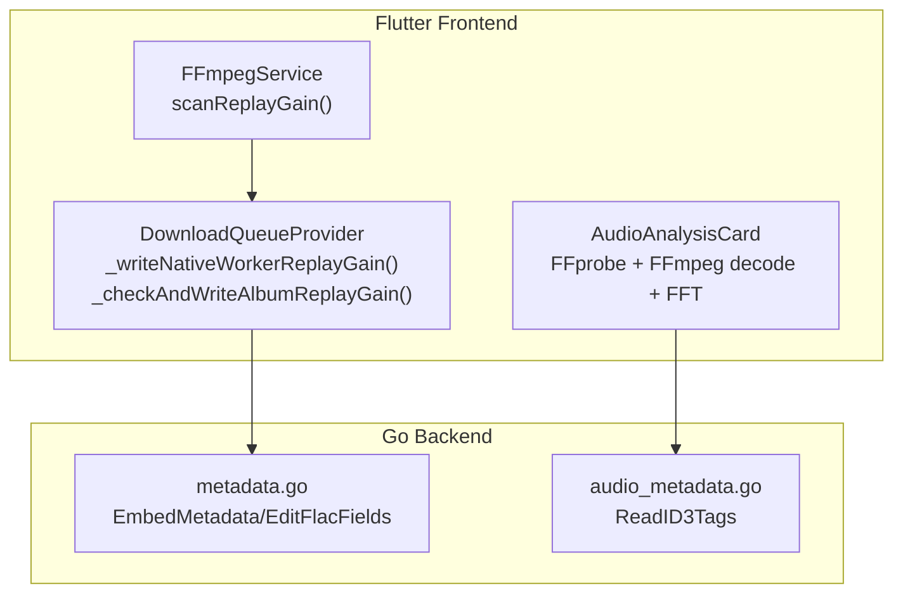
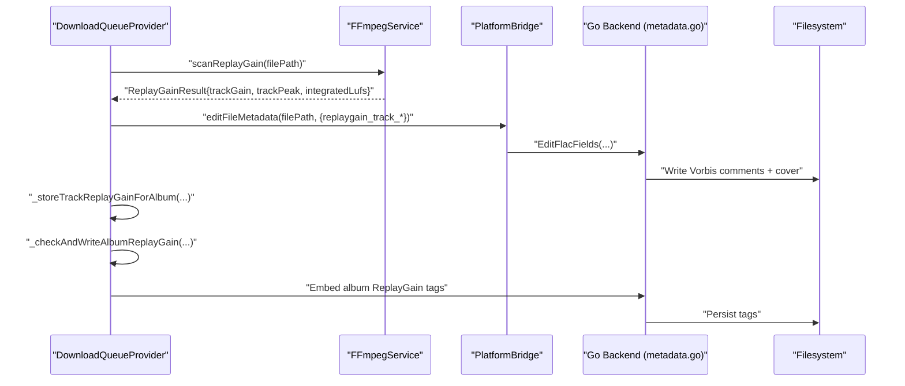
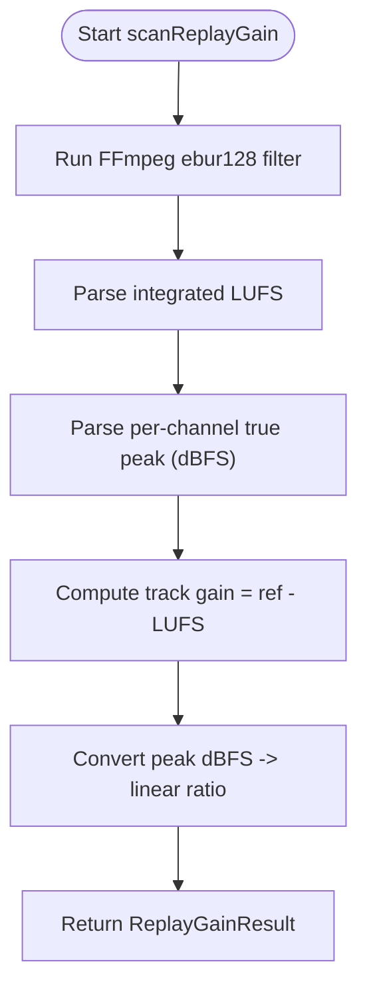
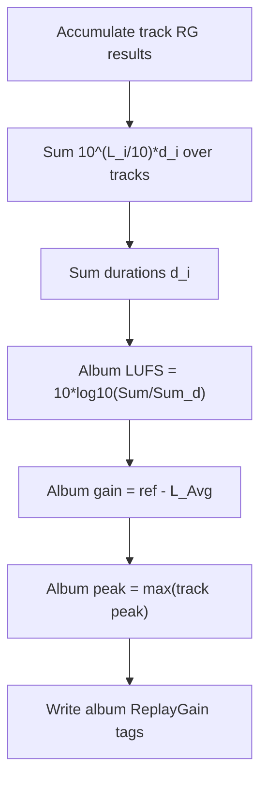
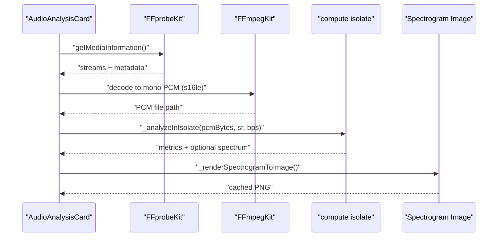
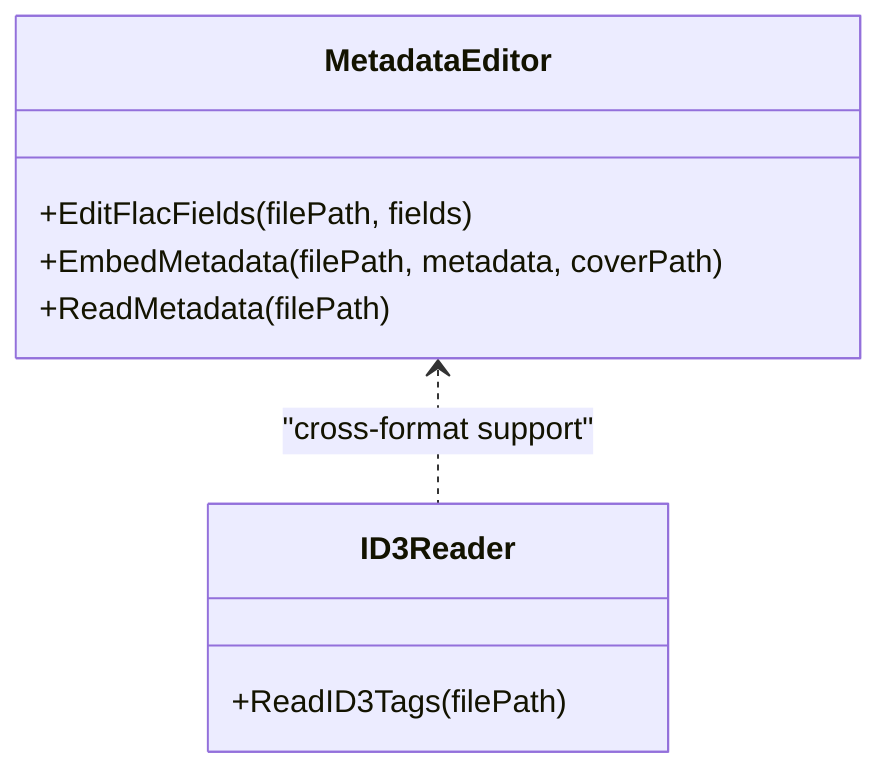
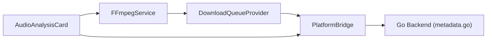

# Audio Enhancement

<cite>
**Referenced Files in This Document**
- [ffmpeg_service.dart](file://lib/services/ffmpeg_service.dart)
- [download_queue_provider.dart](file://lib/providers/download_queue_provider.dart)
- [audio_analysis_widget.dart](file://lib/widgets/audio_analysis_widget.dart)
- [settings.dart](file://lib/models/settings.dart)
- [metadata.go](file://go_backend_spotiflac/metadata.go)
- [audio_metadata.go](file://go_backend_spotiflac/audio_metadata.go)
</cite>

## Table of Contents
1. [Introduction](#introduction)
2. [Project Structure](#project-structure)
3. [Core Components](#core-components)
4. [Architecture Overview](#architecture-overview)
5. [Detailed Component Analysis](#detailed-component-analysis)
6. [Dependency Analysis](#dependency-analysis)
7. [Performance Considerations](#performance-considerations)
8. [Troubleshooting Guide](#troubleshooting-guide)
9. [Conclusion](#conclusion)
10. [Appendices](#appendices)

## Introduction
This document explains the audio enhancement capabilities implemented in the project, focusing on ReplayGain calculation (track and album), loudness-based normalization, and quality analysis. It covers how the system measures integrated loudness and true peaks, computes ReplayGain values, embeds them into audio files, and performs offline quality checks via spectrum analysis. Practical workflows, parameter tuning, and cross-format compatibility are also documented.

## Project Structure
The audio enhancement features span three primary areas:
- Track-level ReplayGain scanning and embedding using FFmpeg’s EBU R128 filter
- Album-level ReplayGain computation and embedding
- Offline quality analysis with PCM extraction, RMS/peak metrics, and spectrogram generation

**Diagram sources**
- [ffmpeg_service.dart:1068-1147](file://lib/services/ffmpeg_service.dart#L1068-L1147)
- [download_queue_provider.dart:6188-6219](file://lib/providers/download_queue_provider.dart#L6188-L6219)
- [download_queue_provider.dart:4207-4242](file://lib/providers/download_queue_provider.dart#L4207-L4242)
- [audio_analysis_widget.dart:318-483](file://lib/widgets/audio_analysis_widget.dart#L318-L483)
- [metadata.go:131-189](file://go_backend_spotiflac/metadata.go#L131-L189)
- [audio_metadata.go:54-94](file://go_backend_spotiflac/audio_metadata.go#L54-L94)

**Section sources**
- [ffmpeg_service.dart:1068-1147](file://lib/services/ffmpeg_service.dart#L1068-L1147)
- [download_queue_provider.dart:6188-6219](file://lib/providers/download_queue_provider.dart#L6188-L6219)
- [download_queue_provider.dart:4207-4242](file://lib/providers/download_queue_provider.dart#L4207-L4242)
- [audio_analysis_widget.dart:318-483](file://lib/widgets/audio_analysis_widget.dart#L318-L483)
- [metadata.go:131-189](file://go_backend_spotiflac/metadata.go#L131-L189)
- [audio_metadata.go:54-94](file://go_backend_spotiflac/audio_metadata.go#L54-L94)

## Core Components
- ReplayGain scanning and embedding (track and album)
- Loudness normalization via ReplayGain
- Quality analysis: dynamic range, peak/RMS levels, spectrogram
- Cross-format support: FLAC, MP3, AAC, OPUS, WAV, and others

Key implementation highlights:
- Track ReplayGain: integrated loudness (LUFS) and true peak measurement using FFmpeg ebur128 filter; gain computed against a reference level
- Album ReplayGain: duration-weighted power mean of LUFS across tracks; peak derived as the maximum across tracks
- Quality analysis: FFprobe for metadata, FFmpeg decode to mono PCM, CPU-intensive metrics and FFT spectrogram

**Section sources**
- [ffmpeg_service.dart:1068-1147](file://lib/services/ffmpeg_service.dart#L1068-L1147)
- [download_queue_provider.dart:4207-4242](file://lib/providers/download_queue_provider.dart#L4207-L4242)
- [audio_analysis_widget.dart:318-483](file://lib/widgets/audio_analysis_widget.dart#L318-L483)

## Architecture Overview
The enhancement pipeline integrates FFmpeg-based scanning, album aggregation, and metadata embedding.

**Diagram sources**
- [download_queue_provider.dart:6188-6219](file://lib/providers/download_queue_provider.dart#L6188-L6219)
- [download_queue_provider.dart:4207-4242](file://lib/providers/download_queue_provider.dart#L4207-L4242)
- [ffmpeg_service.dart:1068-1147](file://lib/services/ffmpeg_service.dart#L1068-L1147)
- [metadata.go:331-482](file://go_backend_spotiflac/metadata.go#L331-L482)

## Detailed Component Analysis

### ReplayGain Implementation (Track)
- Scans audio using FFmpeg ebur128 with peak=true to obtain integrated loudness (LUFS) and per-channel true peak
- Computes track gain as reference level minus integrated loudness
- Converts true peak from dBFS to linear ratio for album peak aggregation
- Emits structured result for downstream use

**Diagram sources**
- [ffmpeg_service.dart:1068-1147](file://lib/services/ffmpeg_service.dart#L1068-L1147)

**Section sources**
- [ffmpeg_service.dart:1068-1147](file://lib/services/ffmpeg_service.dart#L1068-L1147)

### ReplayGain Implementation (Album)
- Accumulates track-level results keyed by album identifier
- Computes album loudness as a duration-weighted power mean of LUFS values
- Album gain equals reference level minus album loudness
- Album peak equals the maximum of individual track peaks
- Writes album ReplayGain tags to all tracks in the album

**Diagram sources**
- [download_queue_provider.dart:4207-4242](file://lib/providers/download_queue_provider.dart#L4207-L4242)

**Section sources**
- [download_queue_provider.dart:4207-4242](file://lib/providers/download_queue_provider.dart#L4207-L4242)

### Quality Analysis Workflow
- Detects supported audio formats and loads cached analysis when available
- Uses FFprobe to extract sample rate, channels, duration, bitrate, and bit depth
- Decodes up to a maximum duration to mono 16-bit PCM using FFmpeg
- Computes dynamic range (peak-RMS), peak amplitude, RMS level, and optional spectrogram
- Renders spectrogram via Cooley–Tukey FFT with Hann windowing and caches results

**Diagram sources**
- [audio_analysis_widget.dart:318-483](file://lib/widgets/audio_analysis_widget.dart#L318-L483)
- [audio_analysis_widget.dart:672-706](file://lib/widgets/audio_analysis_widget.dart#L672-L706)
- [audio_analysis_widget.dart:708-812](file://lib/widgets/audio_analysis_widget.dart#L708-L812)

**Section sources**
- [audio_analysis_widget.dart:318-483](file://lib/widgets/audio_analysis_widget.dart#L318-L483)
- [audio_analysis_widget.dart:672-706](file://lib/widgets/audio_analysis_widget.dart#L672-L706)
- [audio_analysis_widget.dart:708-812](file://lib/widgets/audio_analysis_widget.dart#L708-L812)

### Metadata Embedding and Parsing
- Embeds ReplayGain tags into FLAC via Vorbis comments using Go backend
- Supports partial edits and artist splitting modes
- Reads ID3 tags for MP3/Ogg formats and extracts ReplayGain fields

**Diagram sources**
- [metadata.go:331-482](file://go_backend_spotiflac/metadata.go#L331-L482)
- [audio_metadata.go:54-94](file://go_backend_spotiflac/audio_metadata.go#L54-L94)

**Section sources**
- [metadata.go:331-482](file://go_backend_spotiflac/metadata.go#L331-L482)
- [audio_metadata.go:54-94](file://go_backend_spotiflac/audio_metadata.go#L54-L94)

## Dependency Analysis
- FFmpegService depends on FFmpeg/FFprobe binaries for loudness scanning and PCM decoding
- DownloadQueueProvider orchestrates track and album ReplayGain lifecycle and delegates metadata editing to PlatformBridge
- PlatformBridge invokes Go backend for precise FLAC metadata edits
- AudioAnalysisCard depends on FFprobe and FFmpeg decoding, plus Dart compute isolates for CPU-bound metrics and FFT

**Diagram sources**
- [ffmpeg_service.dart:1068-1147](file://lib/services/ffmpeg_service.dart#L1068-L1147)
- [download_queue_provider.dart:6188-6219](file://lib/providers/download_queue_provider.dart#L6188-L6219)
- [audio_analysis_widget.dart:318-483](file://lib/widgets/audio_analysis_widget.dart#L318-L483)
- [metadata.go:131-189](file://go_backend_spotiflac/metadata.go#L131-L189)

**Section sources**
- [ffmpeg_service.dart:1068-1147](file://lib/services/ffmpeg_service.dart#L1068-L1147)
- [download_queue_provider.dart:6188-6219](file://lib/providers/download_queue_provider.dart#L6188-L6219)
- [audio_analysis_widget.dart:318-483](file://lib/widgets/audio_analysis_widget.dart#L318-L483)
- [metadata.go:131-189](file://go_backend_spotiflac/metadata.go#L131-L189)

## Performance Considerations
- Loudness scanning: EBU R128 filter runs on entire audio; keep input durations reasonable to avoid long scans
- PCM decoding: limit maximum decode duration to reduce memory and CPU usage
- FFT spectrogram: window size and slice count trade-off between resolution and compute cost
- Album ReplayGain aggregation: duration weighting avoids bias toward shorter tracks; consider batching large albums
- Caching: reuse FFprobe results and rendered spectrograms to minimize repeated work

[No sources needed since this section provides general guidance]

## Troubleshooting Guide
Common issues and resolutions:
- Integrated loudness parsing failures: verify FFmpeg stderr parsing and ensure ebur128 output is present
- True peak missing: fallback to 0 dBFS (linear 1.0) when no peak detected
- FFmpeg decode failures: confirm codec support and adjust maximum decode duration
- Metadata embedding errors: validate FLAC file integrity and Vorbis comment keys
- SAF file access: ensure temporary copies are created before analysis on Android

**Section sources**
- [ffmpeg_service.dart:1091-1103](file://lib/services/ffmpeg_service.dart#L1091-L1103)
- [ffmpeg_service.dart:1127-1131](file://lib/services/ffmpeg_service.dart#L1127-L1131)
- [audio_analysis_widget.dart:452-483](file://lib/widgets/audio_analysis_widget.dart#L452-L483)
- [metadata.go:131-189](file://go_backend_spotiflac/metadata.go#L131-L189)

## Conclusion
The project implements robust audio enhancement through standardized loudness measurement, ReplayGain embedding, and comprehensive quality analysis. Track and album ReplayGain leverage EBU R128 and duration-weighted aggregation, while quality analysis provides dynamic range, peak/RMS metrics, and spectrograms. These features are designed to be efficient, accurate, and compatible across common audio formats.

[No sources needed since this section summarizes without analyzing specific files]

## Appendices

### Parameter Tuning Options
- Track ReplayGain reference level: fixed at a standard LUFS value during scan
- Album ReplayGain weighting: duration-weighted power mean applied automatically
- PCM decode: adjustable maximum duration to balance accuracy and performance
- Spectrogram: FFT size and slice count influence resolution and speed

**Section sources**
- [ffmpeg_service.dart:1121-1122](file://lib/services/ffmpeg_service.dart#L1121-L1122)
- [download_queue_provider.dart:4214-4216](file://lib/providers/download_queue_provider.dart#L4214-L4216)
- [audio_analysis_widget.dart:457-466](file://lib/widgets/audio_analysis_widget.dart#L457-L466)
- [audio_analysis_widget.dart:708-719](file://lib/widgets/audio_analysis_widget.dart#L708-L719)

### Compatibility Across Formats
- FLAC: native Vorbis comment embedding for ReplayGain tags
- MP3: ID3 tag parsing supports ReplayGain fields
- Other formats: analyzed via FFprobe/FFmpeg decoding; ReplayGain tags embedded where applicable

**Section sources**
- [metadata.go:331-482](file://go_backend_spotiflac/metadata.go#L331-L482)
- [audio_metadata.go:54-94](file://go_backend_spotiflac/audio_metadata.go#L54-L94)
- [audio_analysis_widget.dart:115-124](file://lib/widgets/audio_analysis_widget.dart#L115-L124)