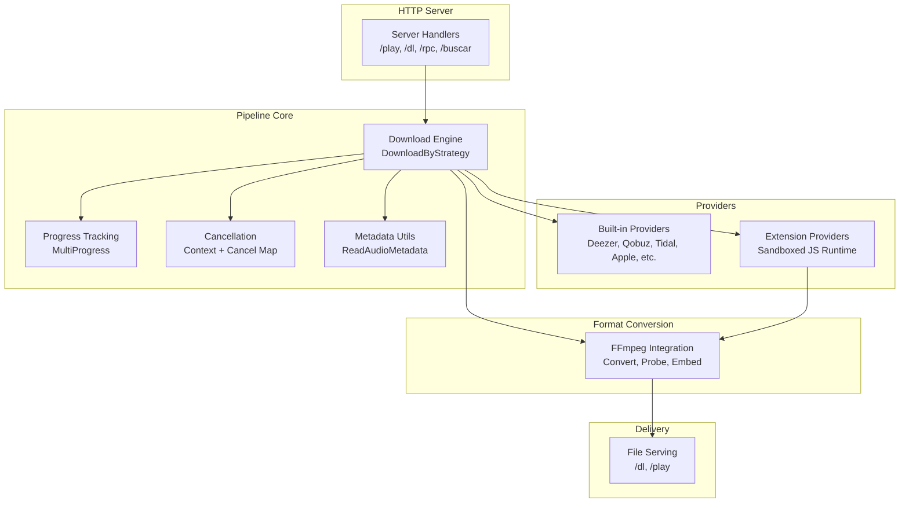
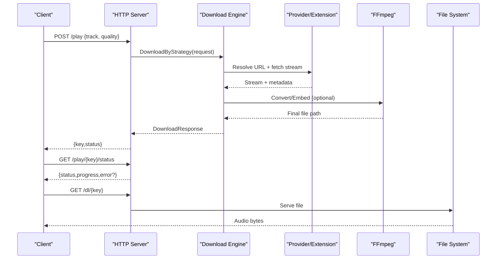
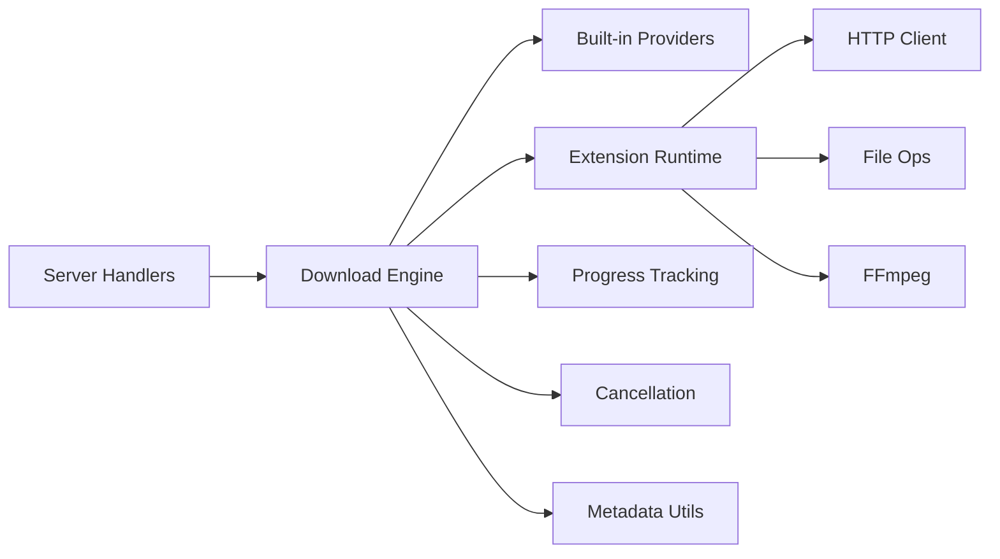

# Audio Pipeline

<cite>
**Referenced Files in This Document**
- [main.go](file://go_backend_spotiflac/cmd/server/main.go)
- [exports.go](file://go_backend_spotiflac/exports.go)
- [parallel.go](file://go_backend_spotiflac/parallel.go)
- [cancel.go](file://go_backend_spotiflac/cancel.go)
- [progress.go](file://go_backend_spotiflac/progress.go)
- [playback.go](file://go_backend_spotiflac/playback.go)
- [extension_runtime.go](file://go_backend_spotiflac/extension_runtime.go)
- [extension_runtime_ffmpeg.go](file://go_backend_spotiflac/extension_runtime_ffmpeg.go)
- [extension_runtime_http.go](file://go_backend_spotiflac/extension_runtime_http.go)
- [extension_runtime_file.go](file://go_backend_spotiflac/extension_runtime_file.go)
- [extension_providers.go](file://go_backend_spotiflac/extension_providers.go)
- [audio_metadata.go](file://go_backend_spotiflac/audio_metadata.go)
- [youtube.go](file://go_backend_spotiflac/youtube.go)
</cite>

## Table of Contents
1. [Introduction](#introduction)
2. [Project Structure](#project-structure)
3. [Core Components](#core-components)
4. [Architecture Overview](#architecture-overview)
5. [Detailed Component Analysis](#detailed-component-analysis)
6. [Dependency Analysis](#dependency-analysis)
7. [Performance Considerations](#performance-considerations)
8. [Troubleshooting Guide](#troubleshooting-guide)
9. [Conclusion](#conclusion)

## Introduction
This document describes the audio pipeline subsystem responsible for end-to-end audio processing: discovery, acquisition, format conversion, metadata enrichment, and delivery. It covers the complete workflow from initiating a download to serving the final output format, including concurrency, memory management, quality optimization, cancellation, and integration with external providers and streaming services.

## Project Structure
The audio pipeline spans a Go backend with:
- An HTTP server exposing endpoints for search, playback, and download orchestration
- A download engine supporting built-in providers and an extension system
- Progress tracking, cancellation, and parallel operations
- Extension runtime for sandboxed provider integrations and FFmpeg commands
- Utilities for metadata parsing and YouTube integration

**Diagram sources**
- [main.go:107-134](file://go_backend_spotiflac/cmd/server/main.go#L107-L134)
- [exports.go:158-263](file://go_backend_spotiflac/exports.go#L158-L263)
- [progress.go:38-66](file://go_backend_spotiflac/progress.go#L38-L66)
- [cancel.go:31-92](file://go_backend_spotiflac/cancel.go#L31-L92)
- [extension_runtime.go:130-147](file://go_backend_spotiflac/extension_runtime.go#L130-L147)
- [extension_runtime_ffmpeg.go:12-52](file://go_backend_spotiflac/extension_runtime_ffmpeg.go#L12-L52)

**Section sources**
- [main.go:107-134](file://go_backend_spotiflac/cmd/server/main.go#L107-L134)
- [exports.go:158-263](file://go_backend_spotiflac/exports.go#L158-L263)

## Core Components
- HTTP server and handlers for orchestration and delivery
- Download engine with request/response models and provider selection
- Progress tracking and cancellation infrastructure
- Extension runtime for sandboxed providers and FFmpeg commands
- Metadata utilities and format conversion helpers
- Parallel operations for cover and lyrics fetching

**Section sources**
- [main.go:136-286](file://go_backend_spotiflac/cmd/server/main.go#L136-L286)
- [exports.go:158-263](file://go_backend_spotiflac/exports.go#L158-L263)
- [parallel.go:35-85](file://go_backend_spotiflac/parallel.go#L35-L85)
- [progress.go:10-66](file://go_backend_spotiflac/progress.go#L10-L66)
- [cancel.go:31-92](file://go_backend_spotiflac/cancel.go#L31-L92)
- [extension_runtime.go:130-147](file://go_backend_spotiflac/extension_runtime.go#L130-L147)
- [extension_runtime_ffmpeg.go:12-52](file://go_backend_spotiflac/extension_runtime_ffmpeg.go#L12-L52)
- [audio_metadata.go:15-45](file://go_backend_spotiflac/audio_metadata.go#L15-L45)

## Architecture Overview
The pipeline is driven by an HTTP server that accepts requests to play/download tracks. The server delegates to the download engine, which coordinates built-in providers and optional extensions. Progress and cancellation are managed centrally, while FFmpeg handles format conversion and metadata embedding. The final audio file is served via dedicated endpoints.

**Diagram sources**
- [main.go:136-286](file://go_backend_spotiflac/cmd/server/main.go#L136-L286)
- [exports.go:158-263](file://go_backend_spotiflac/exports.go#L158-L263)
- [extension_runtime_ffmpeg.go:137-182](file://go_backend_spotiflac/extension_runtime_ffmpeg.go#L137-L182)

## Detailed Component Analysis

### HTTP Server and Orchestration
- Handles endpoints for index, search, RPC, play, and download
- Play endpoint supports initiating downloads and checking status
- Download endpoint serves pre-converted files
- Ensures FFmpeg availability on Windows

Practical example paths:
- [Play handler:136-270](file://go_backend_spotiflac/cmd/server/main.go#L136-L270)
- [Download handler:272-286](file://go_backend_spotiflac/cmd/server/main.go#L272-L286)
- [FFmpeg auto-install:59-105](file://go_backend_spotiflac/cmd/server/main.go#L59-L105)

**Section sources**
- [main.go:136-286](file://go_backend_spotiflac/cmd/server/main.go#L136-L286)
- [main.go:59-105](file://go_backend_spotiflac/cmd/server/main.go#L59-L105)

### Download Engine and Request Model
- DownloadRequest encapsulates all inputs (IDs, metadata, quality, output preferences)
- DownloadResponse carries success/error plus actual quality/container info
- Strategies include provider selection, fallback, and container conversion
- Error classification for UI and retry logic

Key model definitions:
- [DownloadRequest:158-203](file://go_backend_spotiflac/exports.go#L158-L203)
- [DownloadResponse:205-237](file://go_backend_spotiflac/exports.go#L205-L237)

**Section sources**
- [exports.go:158-263](file://go_backend_spotiflac/exports.go#L158-L263)

### Provider Integration and Extensions
- Built-in providers (Deezer, Qobuz, Tidal, Apple, etc.) are integrated
- Extension system exposes a sandboxed JavaScript runtime with HTTP/file/FFmpeg APIs
- Extensions can override built-in providers and supply URLs
- Decryption info normalization for MOV/MP4 key strategies

Provider wrapper and extension runtime:
- [extensionProviderWrapper:523-533](file://go_backend_spotiflac/extension_providers.go#L523-L533)
- [extensionRuntime:84-112](file://go_backend_spotiflac/extension_runtime.go#L84-L112)

FFmpeg integration for extensions:
- [FFmpegCommand lifecycle:12-52](file://go_backend_spotiflac/extension_runtime_ffmpeg.go#L12-L52)
- [ffmpegConvert:137-182](file://go_backend_spotiflac/extension_runtime_ffmpeg.go#L137-L182)

**Section sources**
- [extension_providers.go:523-533](file://go_backend_spotiflac/extension_providers.go#L523-L533)
- [extension_runtime.go:84-112](file://go_backend_spotiflac/extension_runtime.go#L84-L112)
- [extension_runtime_ffmpeg.go:12-52](file://go_backend_spotiflac/extension_runtime_ffmpeg.go#L12-L52)
- [extension_runtime_ffmpeg.go:137-182](file://go_backend_spotiflac/extension_runtime_ffmpeg.go#L137-L182)

### Progress Tracking and Concurrency
- MultiProgress maintains per-item progress, speed, and status
- Delta updates support efficient client synchronization
- Parallel operations for cover and lyrics fetching reduce latency

Progress primitives:
- [MultiProgress and deltas:38-194](file://go_backend_spotiflac/progress.go#L38-L194)
- [ItemProgressWriter:376-427](file://go_backend_spotiflac/progress.go#L376-L427)

Parallel cover and lyrics:
- [FetchCoverAndLyricsParallel:35-85](file://go_backend_spotiflac/parallel.go#L35-L85)

**Section sources**
- [progress.go:38-194](file://go_backend_spotiflac/progress.go#L38-L194)
- [progress.go:376-427](file://go_backend_spotiflac/progress.go#L376-L427)
- [parallel.go:35-85](file://go_backend_spotiflac/parallel.go#L35-L85)

### Cancellation and Error Handling
- Centralized cancellation via context keyed by itemID
- Extension request cancellation for UI-driven flows
- Error classification for rate limits, ISP blocks, permissions, not found, network, and cancellations

Cancellation primitives:
- [init/cancel/isDownloadCancelled:31-92](file://go_backend_spotiflac/cancel.go#L31-L92)
- [cancelExtensionRequest/isExtensionRequestCancelled:140-167](file://go_backend_spotiflac/cancel.go#L140-L167)

Error classification:
- [errorResponse:2136-2176](file://go_backend_spotiflac/exports.go#L2136-L2176)

**Section sources**
- [cancel.go:31-92](file://go_backend_spotiflac/cancel.go#L31-L92)
- [cancel.go:140-167](file://go_backend_spotiflac/cancel.go#L140-L167)
- [exports.go:2136-2176](file://go_backend_spotiflac/exports.go#L2136-L2176)

### Format Conversion and Quality Optimization
- FFmpeg integration for decoding, converting, probing, and embedding metadata
- Container conversion decisions and normalization of decryption info
- Quality probing and bitrate estimation helpers

FFmpeg operations:
- [GetPendingFFmpegCommand/SetFFmpegCommandResult:30-51](file://go_backend_spotiflac/extension_runtime_ffmpeg.go#L30-L51)
- [ffmpegGetInfo:110-135](file://go_backend_spotiflac/extension_runtime_ffmpeg.go#L110-L135)
- [ffmpegConvert:137-182](file://go_backend_spotiflac/extension_runtime_ffmpeg.go#L137-L182)

Quality helpers:
- [shouldSkipQualityProbe:789-800](file://go_backend_spotiflac/exports.go#L789-L800)
- [MP3/Ogg quality structs:40-52](file://go_backend_spotiflac/audio_metadata.go#L40-L52)

**Section sources**
- [extension_runtime_ffmpeg.go:30-51](file://go_backend_spotiflac/extension_runtime_ffmpeg.go#L30-L51)
- [extension_runtime_ffmpeg.go:110-135](file://go_backend_spotiflac/extension_runtime_ffmpeg.go#L110-L135)
- [extension_runtime_ffmpeg.go:137-182](file://go_backend_spotiflac/extension_runtime_ffmpeg.go#L137-L182)
- [exports.go:789-800](file://go_backend_spotiflac/exports.go#L789-L800)
- [audio_metadata.go:40-52](file://go_backend_spotiflac/audio_metadata.go#L40-L52)

### Metadata Enrichment and Embedding
- Reads and writes metadata for various formats
- Builds enriched metadata maps for embedding
- Optional cover extraction/embedding and lyrics embedding

Metadata utilities:
- [ReadAudioMetadataJSON:3604-3610](file://go_backend_spotiflac/exports.go#L3604-L3610)
- [AudioMetadata struct:15-38](file://go_backend_spotiflac/audio_metadata.go#L15-L38)

**Section sources**
- [exports.go:3604-3610](file://go_backend_spotiflac/exports.go#L3604-L3610)
- [audio_metadata.go:15-38](file://go_backend_spotiflac/audio_metadata.go#L15-L38)

### Streaming Service Integrations
- Built-in provider conversions (e.g., Spotify to Deezer)
- YouTube integration via yt-dlp for video search and download

Examples:
- [ConvertSpotifyToDeezer:2088-2134](file://go_backend_spotiflac/exports.go#L2088-L2134)
- [SearchYouTubeVideo:13-45](file://go_backend_spotiflac/youtube.go#L13-L45)
- [DownloadYouTubeVideo:47-83](file://go_backend_spotiflac/youtube.go#L47-L83)

**Section sources**
- [exports.go:2088-2134](file://go_backend_spotiflac/exports.go#L2088-L2134)
- [youtube.go:13-45](file://go_backend_spotiflac/youtube.go#L13-L45)
- [youtube.go:47-83](file://go_backend_spotiflac/youtube.go#L47-L83)

### Playback State Management
- Central playback state with queue/history and actions
- Thread-safe updates and JSON serialization

Playback state:
- [PlaybackState and actions:10-71](file://go_backend_spotiflac/playback.go#L10-L71)
- [playbackActionProcessor:74-172](file://go_backend_spotiflac/playback.go#L74-L172)

**Section sources**
- [playback.go:10-71](file://go_backend_spotiflac/playback.go#L10-L71)
- [playback.go:74-172](file://go_backend_spotiflac/playback.go#L74-L172)

## Dependency Analysis
The pipeline exhibits layered dependencies:
- HTTP server depends on the download engine and file system
- Download engine depends on providers and extensions
- Extensions depend on the runtime for HTTP/file/FFmpeg
- Progress and cancellation are cross-cutting concerns

**Diagram sources**
- [main.go:136-286](file://go_backend_spotiflac/cmd/server/main.go#L136-L286)
- [exports.go:158-263](file://go_backend_spotiflac/exports.go#L158-L263)
- [extension_runtime.go:130-147](file://go_backend_spotiflac/extension_runtime.go#L130-L147)
- [extension_runtime_http.go:71-145](file://go_backend_spotiflac/extension_runtime_http.go#L71-L145)
- [extension_runtime_file.go:110-311](file://go_backend_spotiflac/extension_runtime_file.go#L110-L311)
- [extension_runtime_ffmpeg.go:12-52](file://go_backend_spotiflac/extension_runtime_ffmpeg.go#L12-L52)
- [progress.go:38-66](file://go_backend_spotiflac/progress.go#L38-L66)
- [cancel.go:31-92](file://go_backend_spotiflac/cancel.go#L31-L92)
- [audio_metadata.go:15-45](file://go_backend_spotiflac/audio_metadata.go#L15-L45)

**Section sources**
- [main.go:136-286](file://go_backend_spotiflac/cmd/server/main.go#L136-L286)
- [exports.go:158-263](file://go_backend_spotiflac/exports.go#L158-L263)
- [extension_runtime.go:130-147](file://go_backend_spotiflac/extension_runtime.go#L130-L147)
- [extension_runtime_http.go:71-145](file://go_backend_spotiflac/extension_runtime_http.go#L71-L145)
- [extension_runtime_file.go:110-311](file://go_backend_spotiflac/extension_runtime_file.go#L110-L311)
- [extension_runtime_ffmpeg.go:12-52](file://go_backend_spotiflac/extension_runtime_ffmpeg.go#L12-L52)
- [progress.go:38-66](file://go_backend_spotiflac/progress.go#L38-L66)
- [cancel.go:31-92](file://go_backend_spotiflac/cancel.go#L31-L92)
- [audio_metadata.go:15-45](file://go_backend_spotiflac/audio_metadata.go#L15-L45)

## Performance Considerations
- Concurrency
  - Use parallel cover and lyrics fetching to overlap I/O-bound tasks
  - Chunked downloads for CDNs requiring ranged requests
- Memory management
  - Limit extension HTTP response sizes; use file.download for large media
  - Avoid buffering entire large files in memory; stream to disk
- Quality optimization
  - Probe quality only when necessary; skip for streams or non-file paths
  - Prefer container conversion only when required by downstream consumers
- Network and timeouts
  - Respect provider timeouts and extension capabilities
  - Use chunked downloads with retry/backoff for flakey CDNs
- Cancellation
  - Propagate cancellation contexts to all long-running operations
  - Ensure cleanup on cancellation to free resources

[No sources needed since this section provides general guidance]

## Troubleshooting Guide
Common issues and remedies:
- FFmpeg not found
  - On Windows, the server attempts to download FFmpeg automatically; verify the executable path and permissions
  - References: [ensureFFmpeg:59-105](file://go_backend_spotiflac/cmd/server/main.go#L59-L105)
- Download failures
  - Inspect error classification to distinguish ISP blocks, rate limits, permissions, not found, and network errors
  - References: [errorResponse:2136-2176](file://go_backend_spotiflac/exports.go#L2136-L2176)
- Cancellation
  - Use itemID-based cancellation; verify ErrDownloadCancelled is handled gracefully
  - References: [initDownloadCancel/cancelDownload:31-80](file://go_backend_spotiflac/cancel.go#L31-L80)
- Extension sandbox restrictions
  - Only HTTPS allowed unless explicitly permitted; validate domains and private IPs
  - References: [validateDomain:38-69](file://go_backend_spotiflac/extension_runtime_http.go#L38-L69)
- Large responses
  - Extension HTTP responses are limited; use file.download for large media
  - References: [readExtensionHTTPResponseBody:22-36](file://go_backend_spotiflac/extension_runtime_http.go#L22-L36)

**Section sources**
- [main.go:59-105](file://go_backend_spotiflac/cmd/server/main.go#L59-L105)
- [exports.go:2136-2176](file://go_backend_spotiflac/exports.go#L2136-L2176)
- [cancel.go:31-80](file://go_backend_spotiflac/cancel.go#L31-L80)
- [extension_runtime_http.go:38-69](file://go_backend_spotiflac/extension_runtime_http.go#L38-L69)
- [extension_runtime_http.go:22-36](file://go_backend_spotiflac/extension_runtime_http.go#L22-L36)

## Conclusion
The audio pipeline integrates HTTP orchestration, robust download engines, sandboxed extensions, and FFmpeg-based conversion to deliver high-quality audio efficiently. With structured progress tracking, cancellation, and parallelism, it scales across multiple providers and streaming services while maintaining reliability and performance.

[No sources needed since this section summarizes without analyzing specific files]