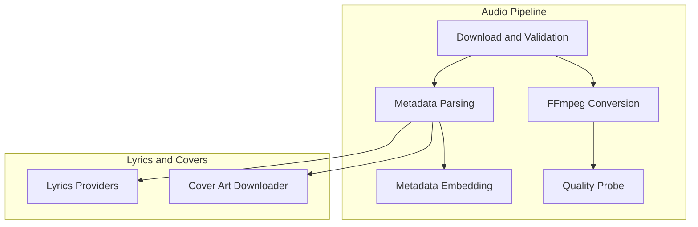
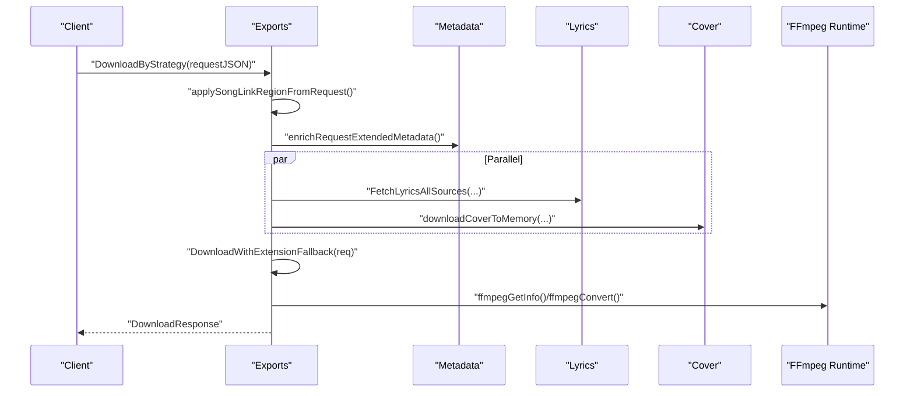
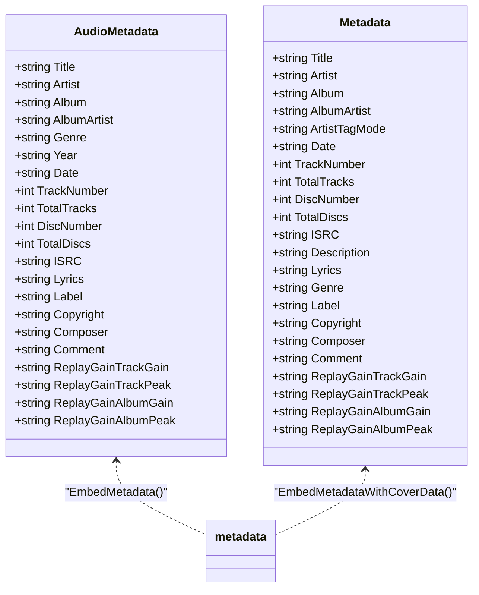
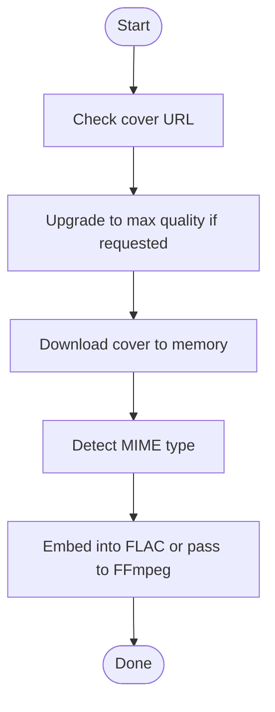
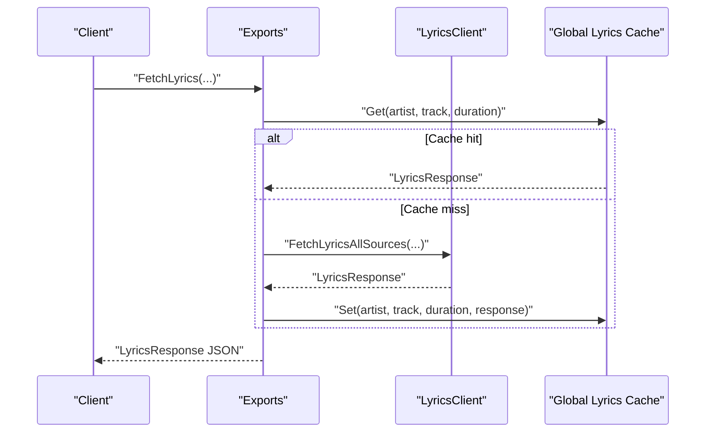
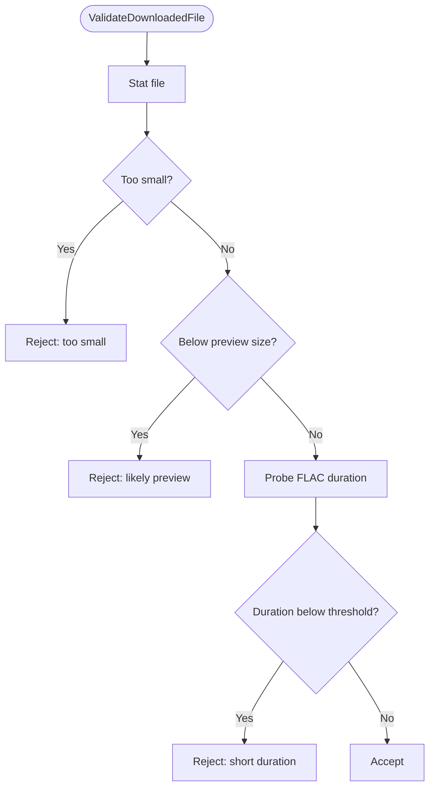
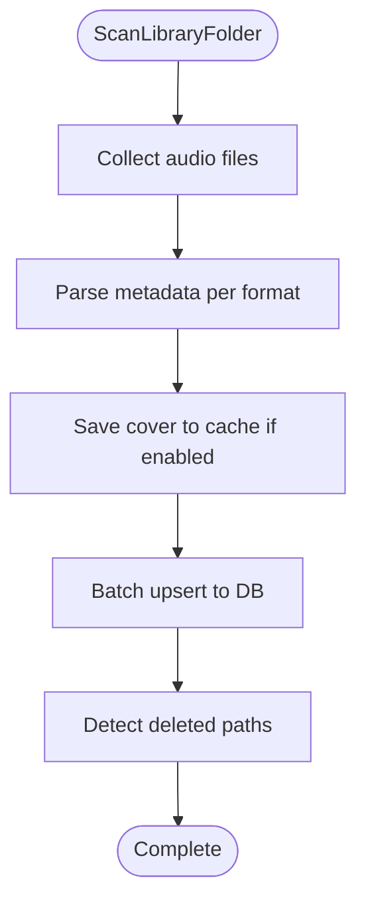
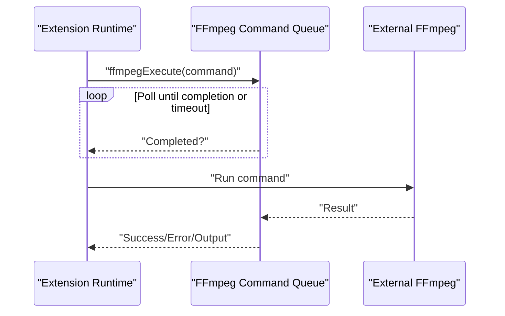
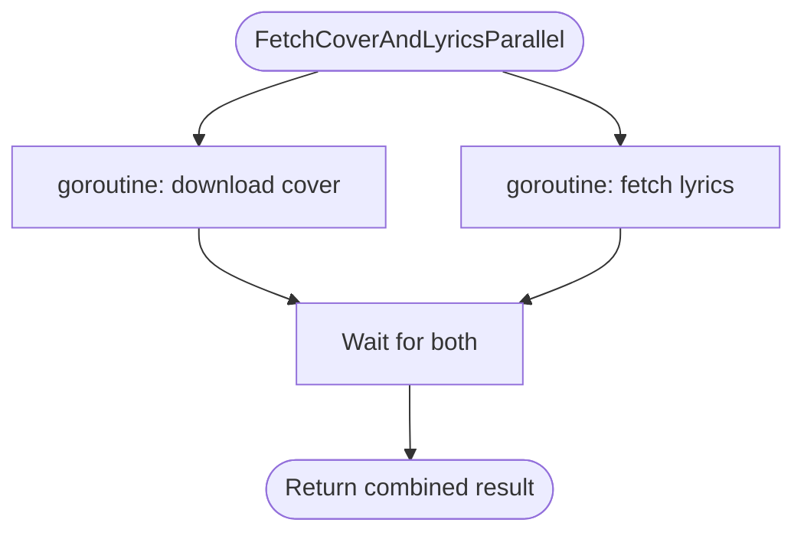
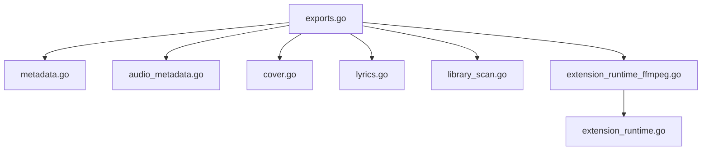

# Audio Processing

<cite>
**Referenced Files in This Document**
- [audio_metadata.go](file://go_backend_spotiflac/audio_metadata.go)
- [metadata.go](file://go_backend_spotiflac/metadata.go)
- [cover.go](file://go_backend_spotiflac/cover.go)
- [lyrics.go](file://go_backend_spotiflac/lyrics.go)
- [exports.go](file://go_backend_spotiflac/exports.go)
- [parallel.go](file://go_backend_spotiflac/parallel.go)
- [download_validation.go](file://go_backend_spotiflac/download_validation.go)
- [library_scan.go](file://go_backend_spotiflac/library_scan.go)
- [extension_runtime.go](file://go_backend_spotiflac/extension_runtime.go)
- [extension_runtime_ffmpeg.go](file://go_backend_spotiflac/extension_runtime_ffmpeg.go)
</cite>

## Table of Contents
1. [Introduction](#introduction)
2. [Project Structure](#project-structure)
3. [Core Components](#core-components)
4. [Architecture Overview](#architecture-overview)
5. [Detailed Component Analysis](#detailed-component-analysis)
6. [Dependency Analysis](#dependency-analysis)
7. [Performance Considerations](#performance-considerations)
8. [Troubleshooting Guide](#troubleshooting-guide)
9. [Conclusion](#conclusion)
10. [Appendices](#appendices)

## Introduction
This document explains the audio processing capabilities centered on the Go backend used by the Bitly project. It covers the audio pipeline from download to post-processing, format conversion, and quality optimization. It also documents metadata processing (tag extraction, cover art handling, lyrics integration), audio enhancement features (ReplayGain, normalization, quality analysis), and practical workflows. Performance optimization, memory management, and concurrent processing are addressed alongside FFmpeg integration and audio quality management systems.

## Project Structure
The audio processing logic resides primarily under the Go backend module. Key areas include:
- Metadata parsing and embedding for multiple container formats
- Cover art retrieval and quality upgrades
- Lyrics fetching from multiple providers with caching
- Download validation and library scanning
- FFmpeg integration for format conversion and quality probing
- Concurrency helpers for parallel operations

[No sources needed since this diagram shows conceptual workflow, not actual code structure]

## Core Components
- Metadata parsing and embedding: Supports FLAC, MP3 (ID3), AAC/M4A, Ogg/Opus, APE/WV/MPC, and filename-based fallback.
- Cover art handling: Downloads, upgrades quality, and embeds cover art into audio files.
- Lyrics integration: Multi-provider lyrics fetching with caching and LRC generation.
- Download validation: Ensures full-length, non-preview audio files.
- Library scanning: Bulk scanning and incremental updates with cover cache.
- FFmpeg integration: Queuing commands, retrieving info, and converting audio with configurable options.
- Concurrency: Parallel lyrics and cover retrieval.

**Section sources**
- [audio_metadata.go:15-94](file://go_backend_spotiflac/audio_metadata.go#L15-L94)
- [metadata.go:104-189](file://go_backend_spotiflac/metadata.go#L104-L189)
- [cover.go:31-89](file://go_backend_spotiflac/cover.go#L31-L89)
- [lyrics.go:18-86](file://go_backend_spotiflac/lyrics.go#L18-L86)
- [exports.go:804-826](file://go_backend_spotiflac/exports.go#L804-L826)
- [parallel.go:35-85](file://go_backend_spotiflac/parallel.go#L35-L85)
- [download_validation.go:23-54](file://go_backend_spotiflac/download_validation.go#L23-L54)
- [library_scan.go:68-78](file://go_backend_spotiflac/library_scan.go#L68-L78)
- [extension_runtime_ffmpeg.go:12-183](file://go_backend_spotiflac/extension_runtime_ffmpeg.go#L12-L183)

## Architecture Overview
The system orchestrates audio processing through a series of exportable functions and extension runtime. The flow typically involves:
- Request normalization and optional extension provider routing
- Metadata enrichment (including ISRC-based fallbacks)
- Optional parallel lyrics and cover retrieval
- Download completion and validation
- Optional post-processing and FFmpeg conversion
- Quality probing and response assembly

**Diagram sources**
- [exports.go:934-956](file://go_backend_spotiflac/exports.go#L934-L956)
- [exports.go:2785-2827](file://go_backend_spotiflac/exports.go#L2785-L2827)
- [parallel.go:35-85](file://go_backend_spotiflac/parallel.go#L35-L85)
- [extension_runtime_ffmpeg.go:110-183](file://go_backend_spotiflac/extension_runtime_ffmpeg.go#L110-L183)

## Detailed Component Analysis

### Audio Metadata Parsing and Embedding
- FLAC: Native parsing and embedding via Vorbis comments; supports artist splitting modes and preservation of existing tags.
- MP3: ID3v2/ID1 parsing; extracts text frames, comments, and lyrics; supports ReplayGain tags.
- AAC/M4A: Tag reading/writing tailored to M4A containers.
- Ogg/Opus: Vorbis comment parsing and embedding.
- APE/WV/MPC: APEv2 tag parsing and merging with new values.
- Filename fallback: Parses common patterns for title/artist/album when tags are missing.

**Diagram sources**
- [audio_metadata.go:15-38](file://go_backend_spotiflac/audio_metadata.go#L15-L38)
- [metadata.go:104-129](file://go_backend_spotiflac/metadata.go#L104-L129)

**Section sources**
- [audio_metadata.go:54-94](file://go_backend_spotiflac/audio_metadata.go#L54-L94)
- [metadata.go:131-189](file://go_backend_spotiflac/metadata.go#L131-L189)
- [metadata.go:242-324](file://go_backend_spotiflac/metadata.go#L242-L324)
- [metadata.go:406-439](file://go_backend_spotiflac/metadata.go#L406-L439)
- [metadata.go:441-476](file://go_backend_spotiflac/metadata.go#L441-L476)
- [metadata.go:478-517](file://go_backend_spotiflac/metadata.go#L478-L517)
- [metadata.go:519-554](file://go_backend_spotiflac/metadata.go#L519-L554)
- [metadata.go:556-590](file://go_backend_spotiflac/metadata.go#L556-L590)
- [metadata.go:592-623](file://go_backend_spotiflac/metadata.go#L592-L623)

### Cover Art Handling
- Upgrades small cover URLs to higher resolutions for major providers.
- Downloads cover art to memory and detects MIME type heuristically.
- Embeds cover art into FLAC files as a Picture block; for other formats, passes cover data to FFmpeg.

**Diagram sources**
- [cover.go:31-89](file://go_backend_spotiflac/cover.go#L31-L89)
- [metadata.go:74-102](file://go_backend_spotiflac/metadata.go#L74-L102)

**Section sources**
- [cover.go:31-89](file://go_backend_spotiflac/cover.go#L31-L89)
- [metadata.go:74-102](file://go_backend_spotiflac/metadata.go#L74-L102)
- [exports.go:2178-2194](file://go_backend_spotiflac/exports.go#L2178-L2194)
- [exports.go:2196-2224](file://go_backend_spotiflac/exports.go#L2196-L2224)

### Lyrics Integration
- Multi-provider support with ordered fallback and caching.
- Options for translations, multi-person word-by-word, and Apple ELRC word sync.
- Generates LRC content with metadata and validates instrumental tracks.

**Diagram sources**
- [exports.go:1478-1500](file://go_backend_spotiflac/exports.go#L1478-L1500)
- [lyrics.go:198-271](file://go_backend_spotiflac/lyrics.go#L198-L271)
- [lyrics.go:432-492](file://go_backend_spotiflac/lyrics.go#L432-L492)

**Section sources**
- [lyrics.go:18-86](file://go_backend_spotiflac/lyrics.go#L18-L86)
- [lyrics.go:198-271](file://go_backend_spotiflac/lyrics.go#L198-L271)
- [lyrics.go:432-492](file://go_backend_spotiflac/lyrics.go#L432-L492)
- [exports.go:1502-1524](file://go_backend_spotiflac/exports.go#L1502-L1524)
- [exports.go:1526-1582](file://go_backend_spotiflac/exports.go#L1526-L1582)

### Download Validation and Quality Management
- Validates file size and duration thresholds to reject previews.
- Probes actual audio quality from files when possible.
- Skips probes for ephemeral or non-filesystem paths.

**Diagram sources**
- [download_validation.go:23-54](file://go_backend_spotiflac/download_validation.go#L23-L54)
- [exports.go:804-826](file://go_backend_spotiflac/exports.go#L804-L826)

**Section sources**
- [download_validation.go:23-54](file://go_backend_spotiflac/download_validation.go#L23-L54)
- [exports.go:804-826](file://go_backend_spotiflac/exports.go#L804-L826)

### Library Scanning and Metadata Enrichment
- Scans folders for supported audio formats and builds library entries.
- Uses format-specific parsers and filename fallback.
- Supports incremental scans, cover cache, and batched database updates.

**Diagram sources**
- [library_scan.go:138-325](file://go_backend_spotiflac/library_scan.go#L138-L325)
- [library_scan.go:406-439](file://go_backend_spotiflac/library_scan.go#L406-L439)
- [library_scan.go:441-476](file://go_backend_spotiflac/library_scan.go#L441-L476)
- [library_scan.go:478-517](file://go_backend_spotiflac/library_scan.go#L478-L517)
- [library_scan.go:519-554](file://go_backend_spotiflac/library_scan.go#L519-L554)
- [library_scan.go:556-590](file://go_backend_spotiflac/library_scan.go#L556-L590)
- [library_scan.go:592-623](file://go_backend_spotiflac/library_scan.go#L592-L623)

**Section sources**
- [library_scan.go:68-78](file://go_backend_spotiflac/library_scan.go#L68-L78)
- [library_scan.go:138-325](file://go_backend_spotiflac/library_scan.go#L138-L325)
- [library_scan.go:406-439](file://go_backend_spotiflac/library_scan.go#L406-L439)
- [library_scan.go:441-476](file://go_backend_spotiflac/library_scan.go#L441-L476)
- [library_scan.go:478-517](file://go_backend_spotiflac/library_scan.go#L478-L517)
- [library_scan.go:519-554](file://go_backend_spotiflac/library_scan.go#L519-L554)
- [library_scan.go:556-590](file://go_backend_spotiflac/library_scan.go#L556-L590)
- [library_scan.go:592-623](file://go_backend_spotiflac/library_scan.go#L592-L623)

### FFmpeg Integration and Audio Enhancement
- Queues FFmpeg commands from extension runtime and waits for completion with timeouts.
- Provides getInfo to probe audio quality and convert audio with configurable options.
- Supports embedding metadata and cover art via FFmpeg for non-FLAC formats.

**Diagram sources**
- [extension_runtime_ffmpeg.go:53-108](file://go_backend_spotiflac/extension_runtime_ffmpeg.go#L53-L108)
- [extension_runtime_ffmpeg.go:110-183](file://go_backend_spotiflac/extension_runtime_ffmpeg.go#L110-L183)

**Section sources**
- [extension_runtime_ffmpeg.go:12-183](file://go_backend_spotiflac/extension_runtime_ffmpeg.go#L12-L183)
- [exports.go:2566-2578](file://go_backend_spotiflac/exports.go#L2566-L2578)

### Concurrent Processing and Parallel Workflows
- Parallel retrieval of cover art and lyrics to reduce latency.
- Thread-safe caches and synchronization for FFmpeg command results.

**Diagram sources**
- [parallel.go:35-85](file://go_backend_spotiflac/parallel.go#L35-L85)

**Section sources**
- [parallel.go:35-85](file://go_backend_spotiflac/parallel.go#L35-L85)

## Dependency Analysis
The system exhibits clear separation of concerns:
- Export functions orchestrate the end-to-end process.
- Format-specific parsers live in dedicated modules.
- Extension runtime manages FFmpeg and external integrations.
- Shared concurrency primitives protect mutable state.

**Diagram sources**
- [exports.go:934-956](file://go_backend_spotiflac/exports.go#L934-L956)
- [metadata.go:104-189](file://go_backend_spotiflac/metadata.go#L104-L189)
- [audio_metadata.go:54-94](file://go_backend_spotiflac/audio_metadata.go#L54-L94)
- [cover.go:31-89](file://go_backend_spotiflac/cover.go#L31-L89)
- [lyrics.go:198-271](file://go_backend_spotiflac/lyrics.go#L198-L271)
- [library_scan.go:138-325](file://go_backend_spotiflac/library_scan.go#L138-L325)
- [extension_runtime_ffmpeg.go:53-108](file://go_backend_spotiflac/extension_runtime_ffmpeg.go#L53-L108)
- [extension_runtime.go:424-534](file://go_backend_spotiflac/extension_runtime.go#L424-L534)

**Section sources**
- [exports.go:934-956](file://go_backend_spotiflac/exports.go#L934-L956)
- [extension_runtime.go:424-534](file://go_backend_spotiflac/extension_runtime.go#L424-L534)

## Performance Considerations
- Concurrency: Use parallel retrieval for cover art and lyrics to minimize latency.
- Memory: Prefer in-memory cover art for FLAC embedding; defer to file-based embedding for other formats.
- Caching: Leverage lyrics cache TTL and pre-warming for repeated queries.
- Validation: Early rejection of preview files avoids unnecessary processing.
- FFmpeg: Use getInfo to avoid redundant decoding; configure options carefully to balance quality and speed.
- Library scanning: Batch upserts and incremental scans reduce I/O overhead.

[No sources needed since this section provides general guidance]

## Troubleshooting Guide
- Preview detection: If a file is rejected as a preview, verify duration and size thresholds.
- Metadata parsing failures: Fall back to filename parsing; check supported formats and extensions.
- Lyrics not found: Verify provider order and options; confirm network connectivity and rate limits.
- FFmpeg timeouts: Increase timeout or reduce conversion complexity; ensure external binaries are available.
- Cover art issues: Validate URLs and MIME detection; ensure sufficient disk space for temporary files.

**Section sources**
- [download_validation.go:23-54](file://go_backend_spotiflac/download_validation.go#L23-L54)
- [library_scan.go:592-623](file://go_backend_spotiflac/library_scan.go#L592-L623)
- [lyrics.go:198-271](file://go_backend_spotiflac/lyrics.go#L198-L271)
- [extension_runtime_ffmpeg.go:75-108](file://go_backend_spotiflac/extension_runtime_ffmpeg.go#L75-L108)
- [cover.go:31-89](file://go_backend_spotiflac/cover.go#L31-L89)

## Conclusion
The audio processing subsystem integrates robust metadata handling, cover art management, lyrics fetching, and FFmpeg-based conversion. It emphasizes reliability through validation, caching, and concurrency while maintaining flexibility via extension-driven workflows. The documented APIs enable practical workflows for downloading, converting, enriching, and validating audio content efficiently.

## Appendices

### Practical Workflows and Examples
- Download and enrich: Use the download strategy export to route requests, optionally enabling extensions and parallel lyrics/cover retrieval.
- Embed metadata and cover: For FLAC, use native embedding; for other formats, pass cover data to FFmpeg via the provided metadata export.
- Generate LRC: Fetch lyrics and convert to LRC with metadata; optionally embed into files.
- Validate downloads: Apply preview checks and quality probes post-download.

**Section sources**
- [exports.go:934-956](file://go_backend_spotiflac/exports.go#L934-L956)
- [exports.go:2317-2578](file://go_backend_spotiflac/exports.go#L2317-L2578)
- [exports.go:1478-1500](file://go_backend_spotiflac/exports.go#L1478-L1500)
- [exports.go:1502-1524](file://go_backend_spotiflac/exports.go#L1502-L1524)
- [exports.go:2178-2194](file://go_backend_spotiflac/exports.go#L2178-L2194)
- [exports.go:2196-2224](file://go_backend_spotiflac/exports.go#L2196-L2224)