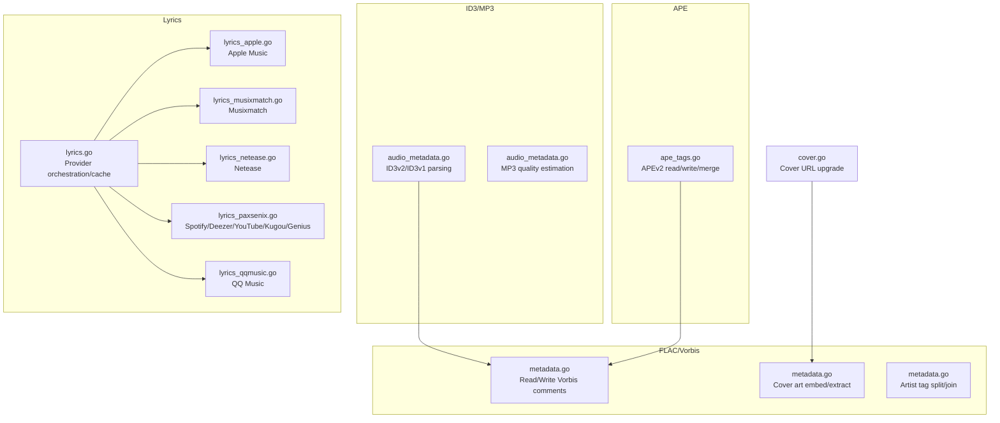
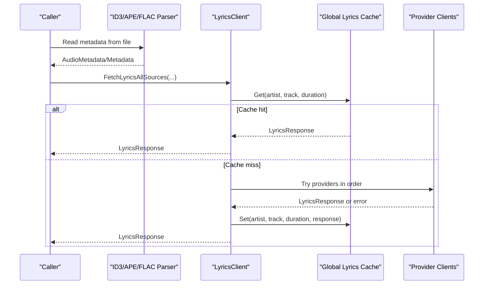
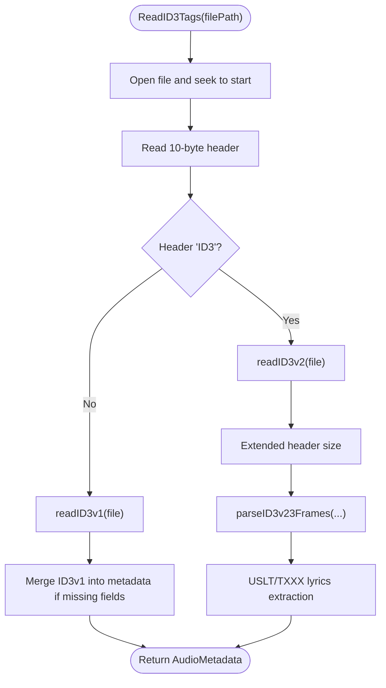
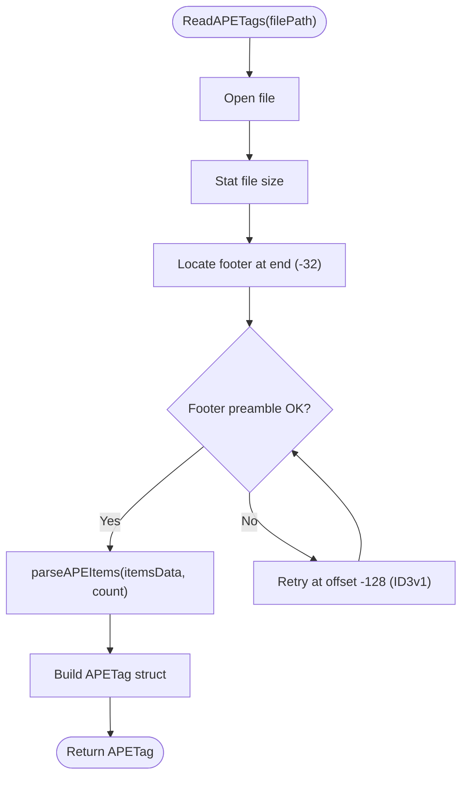
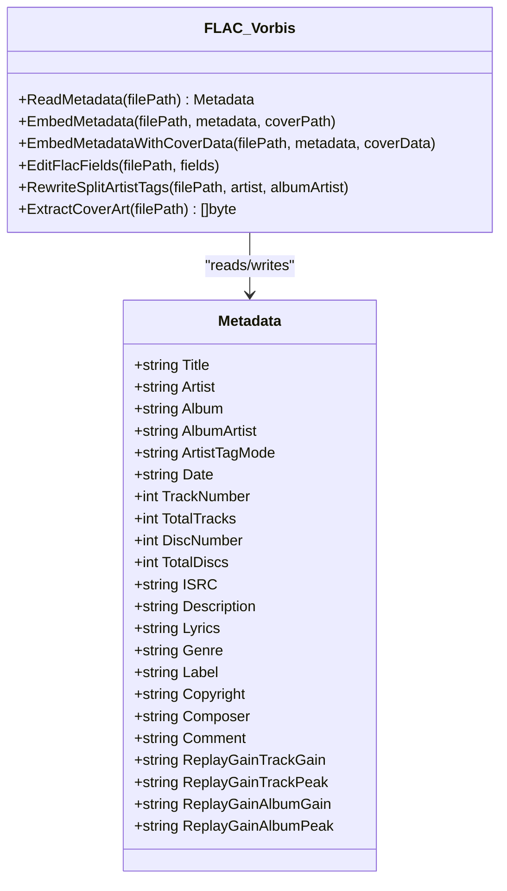
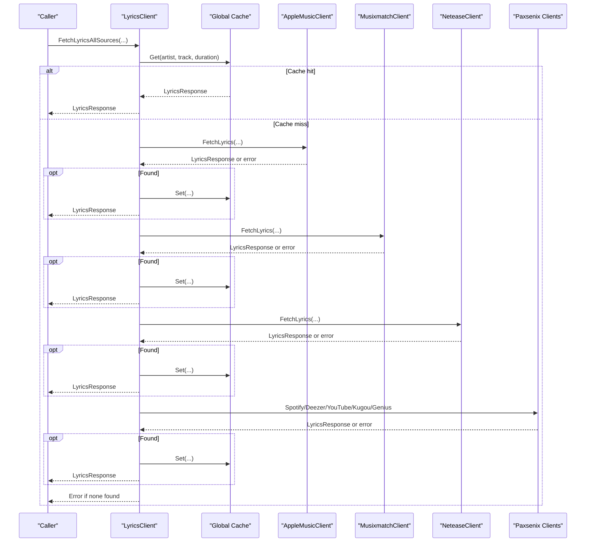
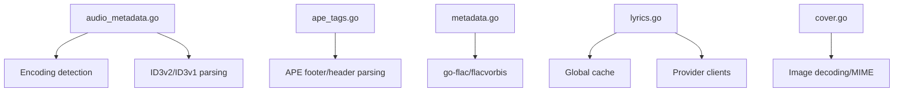

# Metadata Processing

<cite>
**Referenced Files in This Document**
- [audio_metadata.go](file://go_backend_spotiflac/audio_metadata.go)
- [ape_tags.go](file://go_backend_spotiflac/ape_tags.go)
- [metadata.go](file://go_backend_spotiflac/metadata.go)
- [metadata_types.go](file://go_backend_spotiflac/metadata_types.go)
- [cover.go](file://go_backend_spotiflac/cover.go)
- [lyrics.go](file://go_backend_spotiflac/lyrics.go)
- [lyrics_apple.go](file://go_backend_spotiflac/lyrics_apple.go)
- [lyrics_musixmatch.go](file://go_backend_spotiflac/lyrics_musixmatch.go)
- [lyrics_netease.go](file://go_backend_spotiflac/lyrics_netease.go)
- [lyrics_paxsenix.go](file://go_backend_spotiflac/lyrics_paxsenix.go)
- [lyrics_qqmusic.go](file://go_backend_spotiflac/lyrics_qqmusic.go)
- [audio_metadata_mp3_test.go](file://go_backend_spotiflac/audio_metadata_mp3_test.go)
- [metadata_artist_tags_test.go](file://go_backend_spotiflac/metadata_artist_tags_test.go)
</cite>

## Table of Contents
1. [Introduction](#introduction)
2. [Project Structure](#project-structure)
3. [Core Components](#core-components)
4. [Architecture Overview](#architecture-overview)
5. [Detailed Component Analysis](#detailed-component-analysis)
6. [Dependency Analysis](#dependency-analysis)
7. [Performance Considerations](#performance-considerations)
8. [Troubleshooting Guide](#troubleshooting-guide)
9. [Conclusion](#conclusion)
10. [Appendices](#appendices)

## Introduction
This document explains the metadata processing subsystem responsible for extracting and enriching audio metadata, handling cover art, and integrating lyrics across multiple audio formats. It covers:
- ID3 tag parsing for MP3 files (including ID3v2.2, ID3v2.3/4 frames, and ID3v1 fallback)
- APE tag support for non-MP3 formats
- Vorbis comment handling for FLAC (including artist splitting and cover art embedding)
- Lyrics integration via multiple providers (LRCLIB, Apple Music, Musixmatch, Netease, Spotify, Deezer, YouTube, QQ Music, Genius)
- Quality validation, encoding detection, conflict resolution, and cross-format compatibility

## Project Structure
The metadata processing logic is primarily implemented in Go under the go_backend_spotiflac package. Key modules include:
- ID3/MP3 metadata parsing and MP3 quality estimation
- APE tag reading/writing and merging
- FLAC Vorbis comment reading/writing and cover art handling
- Lyrics fetching pipeline with caching and provider selection
- Utilities for MIME detection, cover art upgrades, and artist tag normalization

**Diagram sources**
- [audio_metadata.go:54-94](file://go_backend_spotiflac/audio_metadata.go#L54-L94)
- [ape_tags.go:41-73](file://go_backend_spotiflac/ape_tags.go#L41-L73)
- [metadata.go:242-324](file://go_backend_spotiflac/metadata.go#L242-L324)
- [lyrics.go:432-632](file://go_backend_spotiflac/lyrics.go#L432-L632)
- [lyrics_apple.go:251-299](file://go_backend_spotiflac/lyrics_apple.go#L251-L299)
- [lyrics_musixmatch.go:125-163](file://go_backend_spotiflac/lyrics_musixmatch.go#L125-L163)
- [lyrics_netease.go:146-196](file://go_backend_spotiflac/lyrics_netease.go#L146-L196)
- [lyrics_paxsenix.go:288-299](file://go_backend_spotiflac/lyrics_paxsenix.go#L288-L299)
- [lyrics_qqmusic.go:93-139](file://go_backend_spotiflac/lyrics_qqmusic.go#L93-L139)
- [cover.go:31-89](file://go_backend_spotiflac/cover.go#L31-L89)

**Section sources**
- [audio_metadata.go:54-94](file://go_backend_spotiflac/audio_metadata.go#L54-L94)
- [ape_tags.go:41-73](file://go_backend_spotiflac/ape_tags.go#L41-L73)
- [metadata.go:242-324](file://go_backend_spotiflac/metadata.go#L242-L324)
- [lyrics.go:432-632](file://go_backend_spotiflac/lyrics.go#L432-L632)
- [cover.go:31-89](file://go_backend_spotiflac/cover.go#L31-L89)

## Core Components
- AudioMetadata: Unified metadata model for ID3/MP3 and APE fields
- MP3Quality/OggQuality: Lightweight quality descriptors for MP3/Ogg
- Metadata: FLAC/Vorbis-centric metadata model with cover art and artist splitting
- LyricsResponse/LyricsLine: Structured lyrics representation with sync type and timing
- Provider clients: Apple Music, Musixmatch, Netease, Spotify, Deezer, YouTube, QQ Music, Genius

Key responsibilities:
- Tag extraction: ID3v2/ID3v1, APEv2, Vorbis comments
- Encoding detection: ISO-8859-1, UTF-16, UTF-16BE, UTF-8
- Cover art: MIME detection, decoding image config, embedding/extraction
- Lyrics: provider orchestration, caching, conflict resolution, word-by-word formatting
- Cross-format compatibility: ID3 for MP3, APE for non-MP3, Vorbis for FLAC

**Section sources**
- [audio_metadata.go:15-45](file://go_backend_spotiflac/audio_metadata.go#L15-L45)
- [metadata.go:104-129](file://go_backend_spotiflac/metadata.go#L104-L129)
- [lyrics.go:284-297](file://go_backend_spotiflac/lyrics.go#L284-L297)
- [metadata_types.go:14-33](file://go_backend_spotiflac/metadata_types.go#L14-L33)

## Architecture Overview
The system orchestrates metadata extraction and enrichment through layered components:
- File format parsers (ID3/MP3, APE, FLAC/Vorbis)
- Provider clients for lyrics retrieval
- Central cache for lyrics results
- Utility functions for encoding detection, MIME detection, and artist tag normalization

**Diagram sources**
- [lyrics.go:432-632](file://go_backend_spotiflac/lyrics.go#L432-L632)
- [lyrics.go:214-240](file://go_backend_spotiflac/lyrics.go#L214-L240)

## Detailed Component Analysis

### ID3 Tag Parsing for MP3
- Reads ID3v2 headers, supports ID3v2.2 and ID3v2.3/4 frames, extended headers, footers, and unsynchronization
- Parses ID3v1 tag as fallback when ID3v2 is missing
- Extracts text frames, comments, and user text frames; detects lyrics via multiple descriptors
- Handles encoding detection for Latin-1, UTF-16 (with/without BOM), UTF-16BE, and UTF-8
- Removes unsync artifacts and cleans genre strings

**Diagram sources**
- [audio_metadata.go:54-94](file://go_backend_spotiflac/audio_metadata.go#L54-L94)
- [audio_metadata.go:96-143](file://go_backend_spotiflac/audio_metadata.go#L96-L143)
- [audio_metadata.go:202-336](file://go_backend_spotiflac/audio_metadata.go#L202-L336)
- [audio_metadata.go:338-369](file://go_backend_spotiflac/audio_metadata.go#L338-L369)

**Section sources**
- [audio_metadata.go:54-94](file://go_backend_spotiflac/audio_metadata.go#L54-L94)
- [audio_metadata.go:96-143](file://go_backend_spotiflac/audio_metadata.go#L96-L143)
- [audio_metadata.go:202-336](file://go_backend_spotiflac/audio_metadata.go#L202-L336)
- [audio_metadata.go:338-369](file://go_backend_spotiflac/audio_metadata.go#L338-L369)

### APE Tag Support for Other Formats
- Reads APEv2 tags from file footer, optionally accounting for ID3v1 tail
- Parses items with UTF-8 text, binary, or link content types
- Converts APE tags to unified AudioMetadata and vice versa
- Merges new items onto existing ones while preserving non-conflicting keys

**Diagram sources**
- [ape_tags.go:41-73](file://go_backend_spotiflac/ape_tags.go#L41-L73)
- [ape_tags.go:75-136](file://go_backend_spotiflac/ape_tags.go#L75-L136)
- [ape_tags.go:138-177](file://go_backend_spotiflac/ape_tags.go#L138-L177)

**Section sources**
- [ape_tags.go:41-73](file://go_backend_spotiflac/ape_tags.go#L41-L73)
- [ape_tags.go:138-177](file://go_backend_spotiflac/ape_tags.go#L138-L177)
- [ape_tags.go:336-395](file://go_backend_spotiflac/ape_tags.go#L336-L395)

### FLAC/Vorbis Metadata and Cover Art
- Reads Vorbis comments and maps to Metadata struct, including aliases for date, track/disc numbers, label, and lyrics
- Writes Vorbis comments with set-or-clear semantics; supports artist splitting modes
- Embeds cover art by detecting MIME type and decoding image config; replaces existing picture blocks
- Extracts cover art from picture blocks

**Diagram sources**
- [metadata.go:104-129](file://go_backend_spotiflac/metadata.go#L104-L129)
- [metadata.go:242-324](file://go_backend_spotiflac/metadata.go#L242-L324)
- [metadata.go:326-482](file://go_backend_spotiflac/metadata.go#L326-L482)
- [metadata.go:484-540](file://go_backend_spotiflac/metadata.go#L484-L540)
- [metadata.go:605-649](file://go_backend_spotiflac/metadata.go#L605-L649)
- [metadata.go:749-780](file://go_backend_spotiflac/metadata.go#L749-L780)

**Section sources**
- [metadata.go:104-129](file://go_backend_spotiflac/metadata.go#L104-L129)
- [metadata.go:242-324](file://go_backend_spotiflac/metadata.go#L242-L324)
- [metadata.go:326-482](file://go_backend_spotiflac/metadata.go#L326-L482)
- [metadata.go:484-540](file://go_backend_spotiflac/metadata.go#L484-L540)
- [metadata.go:605-649](file://go_backend_spotiflac/metadata.go#L605-L649)
- [metadata.go:749-780](file://go_backend_spotiflac/metadata.go#L749-L780)

### Lyrics Integration Pipeline
- Provider orchestration with configurable order and options (translation, romanization, language)
- Global cache keyed by artist, track, and rounded duration; TTL-based eviction
- Instrumental detection heuristics; extension provider support
- Provider-specific clients for Apple Music, Musixmatch, Netease, Spotify, Deezer, YouTube, QQ Music, Genius
- LRC/line-synced lyrics parsing and plain-text fallback

**Diagram sources**
- [lyrics.go:432-632](file://go_backend_spotiflac/lyrics.go#L432-L632)
- [lyrics.go:214-240](file://go_backend_spotiflac/lyrics.go#L214-L240)
- [lyrics_apple.go:251-299](file://go_backend_spotiflac/lyrics_apple.go#L251-L299)
- [lyrics_musixmatch.go:125-163](file://go_backend_spotiflac/lyrics_musixmatch.go#L125-L163)
- [lyrics_netease.go:146-196](file://go_backend_spotiflac/lyrics_netease.go#L146-L196)
- [lyrics_paxsenix.go:288-299](file://go_backend_spotiflac/lyrics_paxsenix.go#L288-L299)
- [lyrics_qqmusic.go:93-139](file://go_backend_spotiflac/lyrics_qqmusic.go#L93-L139)

**Section sources**
- [lyrics.go:432-632](file://go_backend_spotiflac/lyrics.go#L432-L632)
- [lyrics.go:214-240](file://go_backend_spotiflac/lyrics.go#L214-L240)
- [lyrics_apple.go:251-299](file://go_backend_spotiflac/lyrics_apple.go#L251-L299)
- [lyrics_musixmatch.go:125-163](file://go_backend_spotiflac/lyrics_musixmatch.go#L125-L163)
- [lyrics_netease.go:146-196](file://go_backend_spotiflac/lyrics_netease.go#L146-L196)
- [lyrics_paxsenix.go:288-299](file://go_backend_spotiflac/lyrics_paxsenix.go#L288-L299)
- [lyrics_qqmusic.go:93-139](file://go_backend_spotiflac/lyrics_qqmusic.go#L93-L139)

### Practical Workflows and Examples
- MP3 tag extraction and lyrics verification:
  - Convert FLAC to MP3 with embedded lyrics and cover art
  - Verify ID3v2 tag extraction and embedded lyrics presence
  - See [audio_metadata_mp3_test.go:111-133](file://go_backend_spotiflac/audio_metadata_mp3_test.go#L111-L133)

- Artist tag splitting and Vorbis comment editing:
  - Split multi-artist tags into separate Vorbis comments
  - Edit specific fields while clearing others and removing aliases
  - See [metadata_artist_tags_test.go:12-29](file://go_backend_spotiflac/metadata_artist_tags_test.go#L12-L29) and [metadata.go:326-482](file://go_backend_spotiflac/metadata.go#L326-L482)

- Batch metadata processing:
  - Iterate over a collection of files, extract metadata, embed cover art, and write lyrics
  - Use FLAC edit APIs to update only specified fields and preserve others

**Section sources**
- [audio_metadata_mp3_test.go:111-133](file://go_backend_spotiflac/audio_metadata_mp3_test.go#L111-L133)
- [metadata_artist_tags_test.go:12-29](file://go_backend_spotiflac/metadata_artist_tags_test.go#L12-L29)
- [metadata.go:326-482](file://go_backend_spotiflac/metadata.go#L326-L482)

## Dependency Analysis
- ID3 parsing depends on file I/O and binary parsing; encoding detection influences text extraction
- APE parsing depends on footer/header detection and item flags
- FLAC/Vorbis depends on go-flac and flacvorbis libraries for parsing and marshalling
- Lyrics pipeline depends on HTTP clients and JSON parsing; global cache coordinates provider results
- Cover art utilities depend on image decoding and MIME detection

**Diagram sources**
- [audio_metadata.go:371-391](file://go_backend_spotiflac/audio_metadata.go#L371-L391)
- [ape_tags.go:75-136](file://go_backend_spotiflac/ape_tags.go#L75-L136)
- [metadata.go:132-189](file://go_backend_spotiflac/metadata.go#L132-L189)
- [lyrics.go:203-270](file://go_backend_spotiflac/lyrics.go#L203-L270)
- [cover.go:28-72](file://go_backend_spotiflac/cover.go#L28-L72)

**Section sources**
- [audio_metadata.go:371-391](file://go_backend_spotiflac/audio_metadata.go#L371-L391)
- [ape_tags.go:75-136](file://go_backend_spotiflac/ape_tags.go#L75-L136)
- [metadata.go:132-189](file://go_backend_spotiflac/metadata.go#L132-L189)
- [lyrics.go:203-270](file://go_backend_spotiflac/lyrics.go#L203-L270)
- [cover.go:28-72](file://go_backend_spotiflac/cover.go#L28-L72)

## Performance Considerations
- ID3 parsing: Early exit on missing headers; minimal allocations for frame scanning
- APE parsing: Single pass over items; footer/header detection avoids full-file scans
- FLAC/Vorbis: Efficient marshalling/unmarshalling; replace-only operations minimize disk writes
- Lyrics caching: TTL-based cache reduces repeated network calls; provider order prioritizes fast sources
- Cover art: MIME detection avoids unnecessary decoding; image config used to infer dimensions/depth

[No sources needed since this section provides general guidance]

## Troubleshooting Guide
Common issues and resolutions:
- No ID3 tags found: Ensure file has ID3v2 or ID3v1; fallback logic merges ID3v1 into metadata when keys are missing
  - See [audio_metadata.go:88-94](file://go_backend_spotiflac/audio_metadata.go#L88-L94)
- Embedded lyrics not extracted: Verify USLT/TXXX frames and lyrics descriptors; ID3v2.2 vs v2.3/4 differences
  - See [audio_metadata.go:188-196](file://go_backend_spotiflac/audio_metadata.go#L188-L196)
- APE tag not found: Confirm footer presence and correct offsets; retry with ID3v1 tail
  - See [ape_tags.go:58-72](file://go_backend_spotiflac/ape_tags.go#L58-L72)
- Vorbis comments not readable: Validate Vorbis comment block; handle aliases for date, track/disc, label, and lyrics
  - See [metadata.go:248-321](file://go_backend_spotiflac/metadata.go#L248-L321)
- Lyrics not found: Adjust provider order; enable/disable translation/romanization; instrumentals are skipped heuristically
  - See [lyrics.go:436-444](file://go_backend_spotiflac/lyrics.go#L436-L444), [lyrics.go:494-632](file://go_backend_spotiflac/lyrics.go#L494-L632)
- Cover art issues: Validate MIME detection and image decoding; ensure front cover picture block exists
  - See [metadata.go:749-780](file://go_backend_spotiflac/metadata.go#L749-L780), [cover.go:28-72](file://go_backend_spotiflac/cover.go#L28-L72)

**Section sources**
- [audio_metadata.go:88-94](file://go_backend_spotiflac/audio_metadata.go#L88-L94)
- [audio_metadata.go:188-196](file://go_backend_spotiflac/audio_metadata.go#L188-L196)
- [ape_tags.go:58-72](file://go_backend_spotiflac/ape_tags.go#L58-L72)
- [metadata.go:248-321](file://go_backend_spotiflac/metadata.go#L248-L321)
- [lyrics.go:436-444](file://go_backend_spotiflac/lyrics.go#L436-L444)
- [lyrics.go:494-632](file://go_backend_spotiflac/lyrics.go#L494-L632)
- [metadata.go:749-780](file://go_backend_spotiflac/metadata.go#L749-L780)
- [cover.go:28-72](file://go_backend_spotiflac/cover.go#L28-L72)

## Conclusion
The metadata processing system provides robust, cross-format support for audio metadata, cover art, and lyrics. It combines efficient parsers for ID3/MP3, APE, and FLAC/Vorbis with a flexible lyrics pipeline that integrates multiple providers and caches results. The design emphasizes encoding detection, conflict resolution, and cross-format compatibility to deliver reliable metadata enrichment across diverse audio ecosystems.

[No sources needed since this section summarizes without analyzing specific files]

## Appendices

### Data Structures and Tag Mapping
- AudioMetadata: ID3/MP3 and APE unified fields
- Metadata: FLAC/Vorbis-centric with artist splitting and cover art
- LyricsResponse/LyricsLine: Sync type and timing for line-synced lyrics

**Section sources**
- [audio_metadata.go:15-38](file://go_backend_spotiflac/audio_metadata.go#L15-L38)
- [metadata.go:104-129](file://go_backend_spotiflac/metadata.go#L104-L129)
- [lyrics.go:284-297](file://go_backend_spotiflac/lyrics.go#L284-L297)

### Encoding Detection and Text Extraction
- ID3 text frames: ISO-8859-1, UTF-16 (with/without BOM), UTF-16BE, UTF-8
- APE items: UTF-8 text, binary, or link content types
- Vorbis comments: ASCII-like key=value pairs

**Section sources**
- [audio_metadata.go:371-391](file://go_backend_spotiflac/audio_metadata.go#L371-L391)
- [ape_tags.go:18-21](file://go_backend_spotiflac/ape_tags.go#L18-L21)

### Conflict Resolution and Aliases
- FLAC/Vorbis: Canonical keys with alias cleanup (e.g., DATE vs YEAR, LABEL vs PUBLISHER)
- Artist tags: Split mode to avoid duplicates; join mode for display
- APE merge: Overwrite by key (case-insensitive), preserve non-conflicting items

**Section sources**
- [metadata.go:383-395](file://go_backend_spotiflac/metadata.go#L383-L395)
- [metadata.go:447-456](file://go_backend_spotiflac/metadata.go#L447-L456)
- [ape_tags.go:501-529](file://go_backend_spotiflac/ape_tags.go#L501-L529)