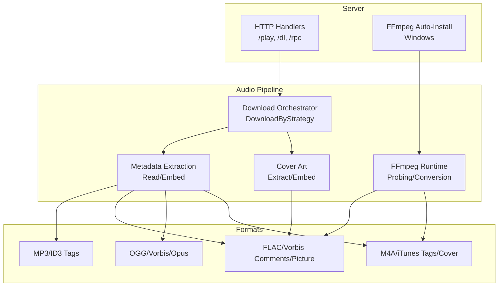
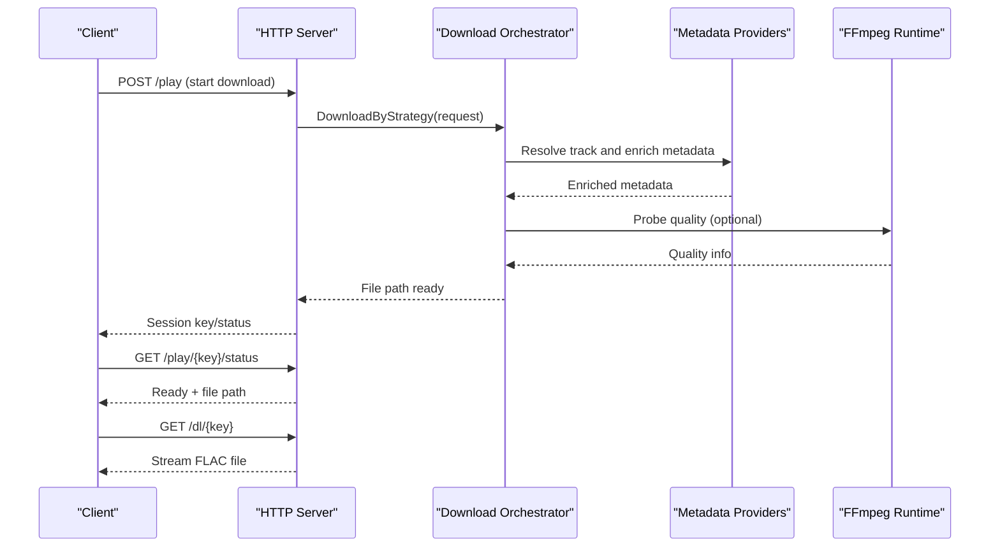
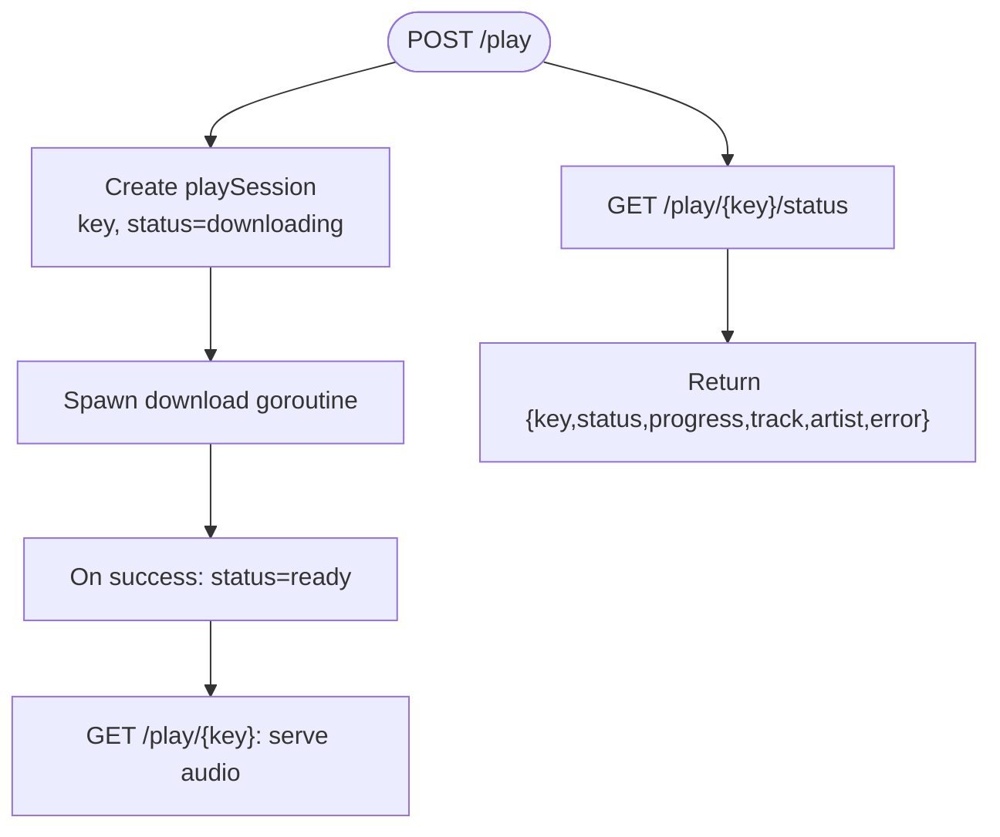
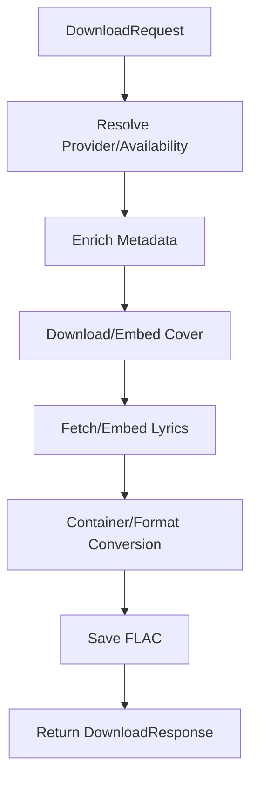
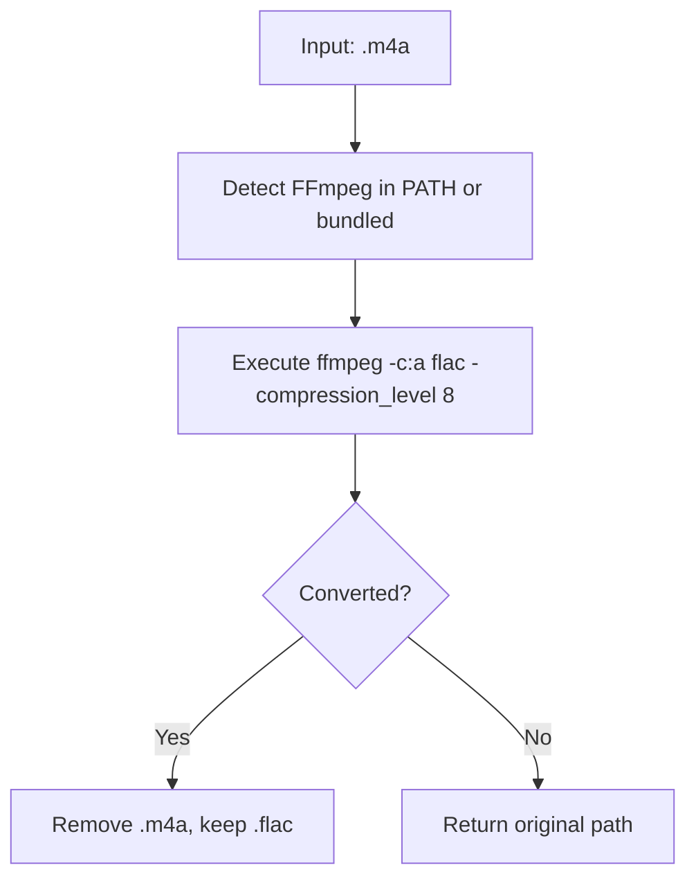
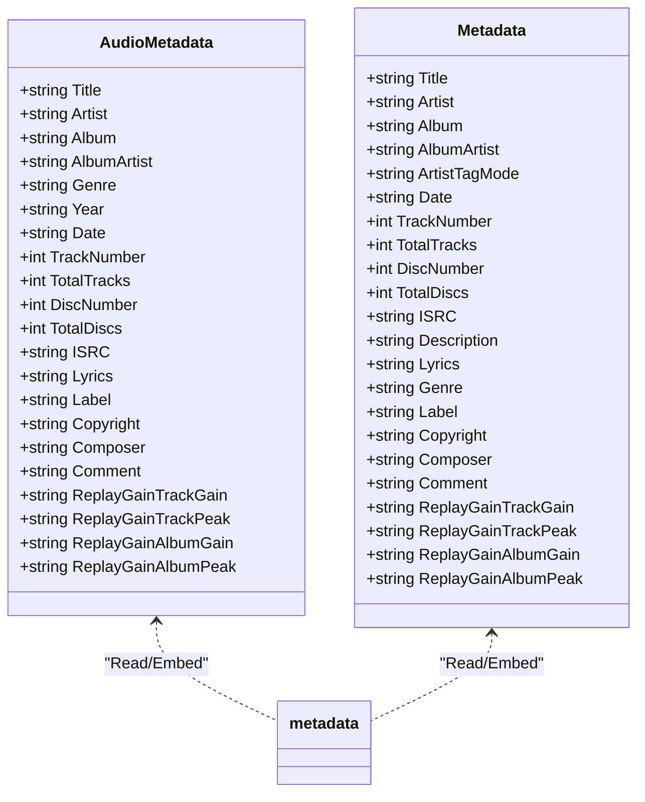
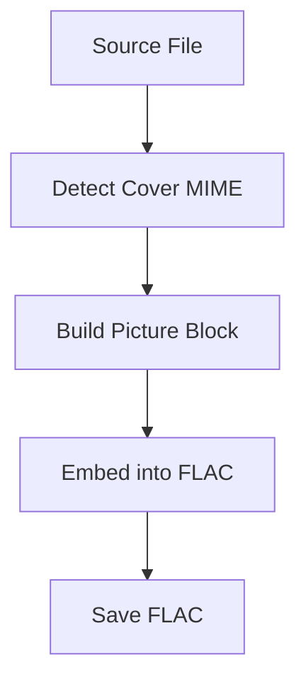
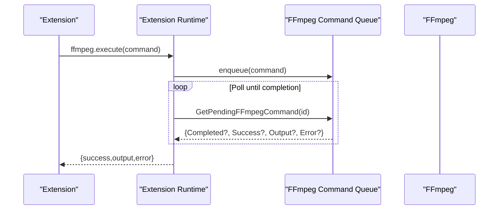
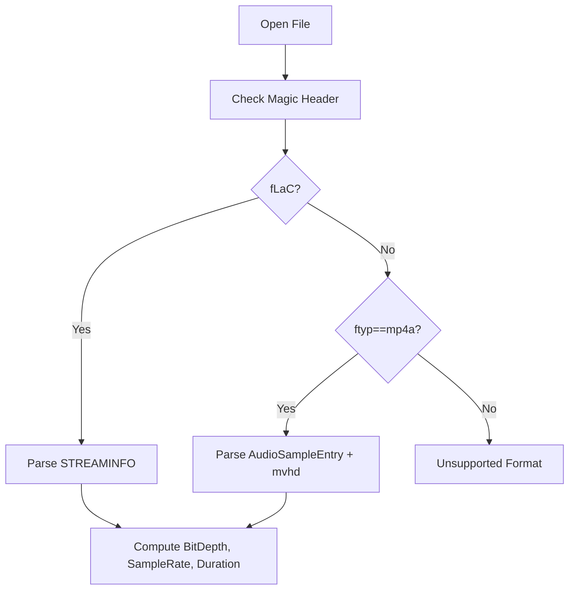
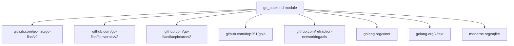

# Audio Processing Engine

<cite>
**Referenced Files in This Document**
- [main.go](file://go_backend_spotiflac/cmd/server/main.go)
- [audio_metadata.go](file://go_backend_spotiflac/audio_metadata.go)
- [metadata.go](file://go_backend_spotiflac/metadata.go)
- [cover.go](file://go_backend_spotiflac/cover.go)
- [extension_runtime_ffmpeg.go](file://go_backend_spotiflac/extension_runtime_ffmpeg.go)
- [exports.go](file://go_backend_spotiflac/exports.go)
- [extension_runtime.go](file://go_backend_spotiflac/extension_runtime.go)
- [extension_runtime_binary.go](file://go_backend_spotiflac/extension_runtime_binary.go)
- [go.mod](file://go_backend_spotiflac/go.mod)
- [youtube.go](file://go_backend_spotiflac/youtube.go)
</cite>

## Table of Contents
1. [Introduction](#introduction)
2. [Project Structure](#project-structure)
3. [Core Components](#core-components)
4. [Architecture Overview](#architecture-overview)
5. [Detailed Component Analysis](#detailed-component-analysis)
6. [Dependency Analysis](#dependency-analysis)
7. [Performance Considerations](#performance-considerations)
8. [Troubleshooting Guide](#troubleshooting-guide)
9. [Conclusion](#conclusion)

## Introduction
This document describes the audio processing engine with a focus on FFmpeg integration and format conversion. It explains the audio pipeline architecture covering download processing, format transformation, and quality optimization. It documents the M4A to FLAC conversion process, compression levels, and file handling. It also details metadata extraction and embedding systems, cover art processing, and audio enhancement features. Practical examples of audio processing workflows, quality selection algorithms, and performance optimization techniques are included, along with FFmpeg dependency management, fallback mechanisms, and cross-platform compatibility considerations.

## Project Structure
The audio processing engine is implemented in Go and exposes a server with HTTP endpoints and an extension runtime that integrates FFmpeg for audio processing. Key areas:
- HTTP server and endpoints for streaming, downloading, and RPC orchestration
- Audio metadata extraction and embedding for multiple formats (MP3, FLAC, OGG, M4A)
- Cover art extraction and embedding with provider-specific upgrades
- FFmpeg integration via extension runtime for probing and conversion
- Exported download orchestration and post-processing hooks

**Diagram sources**
- [main.go:107-134](file://go_backend_spotiflac/cmd/server/main.go#L107-L134)
- [exports.go:158-203](file://go_backend_spotiflac/exports.go#L158-L203)
- [audio_metadata.go:15-38](file://go_backend_spotiflac/audio_metadata.go#L15-L38)
- [metadata.go:104-129](file://go_backend_spotiflac/metadata.go#L104-L129)
- [extension_runtime_ffmpeg.go:12-22](file://go_backend_spotiflac/extension_runtime_ffmpeg.go#L12-L22)

**Section sources**
- [main.go:107-134](file://go_backend_spotiflac/cmd/server/main.go#L107-L134)
- [exports.go:158-203](file://go_backend_spotiflac/exports.go#L158-L203)

## Core Components
- HTTP server and session management for streaming and downloads
- Download orchestrator with provider selection and fallback
- Metadata extraction and embedding for multiple container formats
- Cover art extraction and embedding with provider-specific upgrades
- FFmpeg runtime for probing and conversion
- Exported APIs for external consumers

**Section sources**
- [main.go:24-40](file://go_backend_spotiflac/cmd/server/main.go#L24-L40)
- [exports.go:158-203](file://go_backend_spotiflac/exports.go#L158-L203)
- [audio_metadata.go:15-38](file://go_backend_spotiflac/audio_metadata.go#L15-L38)
- [metadata.go:104-129](file://go_backend_spotiflac/metadata.go#L104-L129)
- [extension_runtime_ffmpeg.go:12-22](file://go_backend_spotiflac/extension_runtime_ffmpeg.go#L12-L22)

## Architecture Overview
The engine exposes an HTTP server with endpoints for search, streaming, and downloads. The download pipeline uses a strategy-driven orchestrator that coordinates provider lookups, metadata enrichment, cover art retrieval, and format conversion. FFmpeg is integrated via an extension runtime that can probe audio quality and perform conversions.

**Diagram sources**
- [main.go:136-270](file://go_backend_spotiflac/cmd/server/main.go#L136-L270)
- [exports.go:158-203](file://go_backend_spotiflac/exports.go#L158-L203)
- [extension_runtime_ffmpeg.go:110-135](file://go_backend_spotiflac/extension_runtime_ffmpeg.go#L110-L135)

## Detailed Component Analysis

### HTTP Server and Session Management
- Maintains in-memory play sessions keyed by random identifiers
- Supports POST to start a download and GET to poll status or serve the file
- On Windows, auto-installs FFmpeg if not found

**Diagram sources**
- [main.go:136-270](file://go_backend_spotiflac/cmd/server/main.go#L136-L270)

**Section sources**
- [main.go:24-40](file://go_backend_spotiflac/cmd/server/main.go#L24-L40)
- [main.go:136-270](file://go_backend_spotiflac/cmd/server/main.go#L136-L270)

### Download Orchestration and Strategy
- The orchestrator accepts a structured request with metadata, quality preferences, and flags for embedding
- It resolves availability, enriches metadata, embeds lyrics and cover art, and performs container conversion if needed
- Uses extension and fallback mechanisms for robustness

**Diagram sources**
- [exports.go:158-203](file://go_backend_spotiflac/exports.go#L158-L203)
- [exports.go:698-787](file://go_backend_spotiflac/exports.go#L698-L787)

**Section sources**
- [exports.go:158-203](file://go_backend_spotiflac/exports.go#L158-L203)
- [exports.go:698-787](file://go_backend_spotiflac/exports.go#L698-L787)

### M4A to FLAC Conversion and Compression
- Converts M4A to FLAC using FFmpeg with a fixed compression level suitable for archival quality
- Falls back to bundled FFmpeg executable on Windows if system FFmpeg is unavailable
- Removes original M4A after successful conversion

**Diagram sources**
- [main.go:516-553](file://go_backend_spotiflac/cmd/server/main.go#L516-L553)

**Section sources**
- [main.go:516-553](file://go_backend_spotiflac/cmd/server/main.go#L516-L553)

### Metadata Extraction and Embedding
- Supports extracting and embedding metadata for MP3 (ID3v2/v1), FLAC (Vorbis comments/pictures), OGG (Vorbis/Opus), and M4A (iTunes-style tags)
- Embedding preserves existing tags and adds new ones; supports splitting artist tags and rewriting multi-value artist entries
- Provides helpers to read/write audio quality and format-specific metadata

**Diagram sources**
- [audio_metadata.go:15-38](file://go_backend_spotiflac/audio_metadata.go#L15-L38)
- [metadata.go:104-129](file://go_backend_spotiflac/metadata.go#L104-L129)

**Section sources**
- [audio_metadata.go:54-94](file://go_backend_spotiflac/audio_metadata.go#L54-L94)
- [metadata.go:131-189](file://go_backend_spotiflac/metadata.go#L131-L189)
- [metadata.go:242-324](file://go_backend_spotiflac/metadata.go#L242-L324)
- [metadata.go:800-862](file://go_backend_spotiflac/metadata.go#L800-L862)
- [metadata.go:912-1020](file://go_backend_spotiflac/metadata.go#L912-L1020)
- [metadata.go:1600-1650](file://go_backend_spotiflac/metadata.go#L1600-L1650)

### Cover Art Processing
- Extracts cover art from supported containers and embeds it into FLAC as a picture block
- Upgrades cover URLs to higher resolutions for popular providers
- Detects MIME type heuristically and validates image headers

**Diagram sources**
- [cover.go:24-89](file://go_backend_spotiflac/cover.go#L24-L89)
- [metadata.go:74-102](file://go_backend_spotiflac/metadata.go#L74-L102)
- [metadata.go:749-780](file://go_backend_spotiflac/metadata.go#L749-L780)

**Section sources**
- [cover.go:24-89](file://go_backend_spotiflac/cover.go#L24-L89)
- [metadata.go:74-102](file://go_backend_spotiflac/metadata.go#L74-L102)
- [metadata.go:749-780](file://go_backend_spotiflac/metadata.go#L749-L780)

### FFmpeg Integration and Extension Runtime
- Exposes FFmpeg commands to extensions via a queue with completion callbacks
- Probes audio quality for FLAC and M4A containers
- Converts audio with configurable codec/bitrate/sample rate/channels

**Diagram sources**
- [extension_runtime_ffmpeg.go:53-108](file://go_backend_spotiflac/extension_runtime_ffmpeg.go#L53-L108)
- [extension_runtime_ffmpeg.go:110-135](file://go_backend_spotiflac/extension_runtime_ffmpeg.go#L110-L135)
- [extension_runtime_ffmpeg.go:137-182](file://go_backend_spotiflac/extension_runtime_ffmpeg.go#L137-L182)

**Section sources**
- [extension_runtime_ffmpeg.go:12-22](file://go_backend_spotiflac/extension_runtime_ffmpeg.go#L12-L22)
- [extension_runtime_ffmpeg.go:53-108](file://go_backend_spotiflac/extension_runtime_ffmpeg.go#L53-L108)
- [extension_runtime_ffmpeg.go:110-135](file://go_backend_spotiflac/extension_runtime_ffmpeg.go#L110-L135)
- [extension_runtime_ffmpeg.go:137-182](file://go_backend_spotiflac/extension_runtime_ffmpeg.go#L137-L182)

### Audio Quality Probing
- Reads FLAC STREAMINFO for bit depth, sample rate, and duration
- Parses M4A atoms to derive sample rate and bit depth
- Returns total samples and duration derived from sample rate and total samples

**Diagram sources**
- [metadata.go:1580-1650](file://go_backend_spotiflac/metadata.go#L1580-L1650)
- [metadata.go:1652-1716](file://go_backend_spotiflac/metadata.go#L1652-L1716)

**Section sources**
- [metadata.go:1580-1650](file://go_backend_spotiflac/metadata.go#L1580-L1650)
- [metadata.go:1652-1716](file://go_backend_spotiflac/metadata.go#L1652-L1716)

### Additional Audio Utilities
- MP3 quality estimation from frame headers and Xing/VBRI headers
- OGG/Vorbis/Opus comment parsing and quality estimation
- YouTube search and download helpers for non-embedded sources

**Section sources**
- [audio_metadata.go:662-814](file://go_backend_spotiflac/audio_metadata.go#L662-L814)
- [audio_metadata.go:1092-1176](file://go_backend_spotiflac/audio_metadata.go#L1092-L1176)
- [youtube.go:13-83](file://go_backend_spotiflac/youtube.go#L13-L83)

## Dependency Analysis
External dependencies include FFmpeg binaries and libraries for FLAC/Vorbis metadata manipulation and JavaScript VM integration for extensions.

**Diagram sources**
- [go.mod:7-18](file://go_backend_spotiflac/go.mod#L7-L18)

**Section sources**
- [go.mod:7-18](file://go_backend_spotiflac/go.mod#L7-L18)

## Performance Considerations
- Prefer FLAC for archival quality; M4A to FLAC conversion uses a high compression level suitable for lossless preservation
- Use batch operations where possible to minimize disk I/O and FFmpeg invocations
- Leverage embedded metadata and cover art to avoid redundant network requests
- For large-scale downloads, consider parallel processing with controlled concurrency and temporary directory placement

## Troubleshooting Guide
Common issues and remedies:
- FFmpeg not found on Windows: The server attempts to auto-download and install FFmpeg; verify the executable is placed alongside the server binary
- Conversion failures: Ensure the input file is a valid M4A; confirm FFmpeg is accessible in PATH or bundled
- Metadata not embedded: Verify the target container supports the metadata format (e.g., Vorbis comments for FLAC)
- Cover art not embedded: Confirm the cover data is valid and MIME type is detected; ensure the FLAC file is writable

**Section sources**
- [main.go:59-105](file://go_backend_spotiflac/cmd/server/main.go#L59-L105)
- [main.go:516-553](file://go_backend_spotiflac/cmd/server/main.go#L516-L553)
- [metadata.go:131-189](file://go_backend_spotiflac/metadata.go#L131-L189)

## Conclusion
The audio processing engine provides a robust pipeline for downloading, converting, and enriching audio with high-quality metadata and cover art. FFmpeg integration is centralized through an extension runtime, enabling reliable probing and conversion. The system supports multiple formats and includes fallback mechanisms and cross-platform considerations for broad compatibility.