# Backend Services (Go)

<cite>
**Referenced Files in This Document**
- [main.go](file://go_backend_spotiflac/cmd/server/main.go)
- [go.mod](file://go_backend_spotiflac/go.mod)
- [extension_manager.go](file://go_backend_spotiflac/extension_manager.go)
- [extension_runtime.go](file://go_backend_spotiflac/extension_runtime.go)
- [extension_runtime_ffmpeg.go](file://go_backend_spotiflac/extension_runtime_ffmpeg.go)
- [extension_manifest.go](file://go_backend_spotiflac/extension_manifest.go)
- [extension_runtime_auth.go](file://go_backend_spotiflac/extension_runtime_auth.go)
- [exports.go](file://go_backend_spotiflac/exports.go)
- [deezer.go](file://go_backend_spotiflac/deezer.go)
- [audio_metadata.go](file://go_backend_spotiflac/audio_metadata.go)
- [lyrics.go](file://go_backend_spotiflac/lyrics.go)
- [qobuz_api.go](file://go_backend_spotiflac/qobuz_api.go)
- [tidal_monochrome.go](file://go_backend_spotiflac/tidal_monochrome.go)
- [youtube.go](file://go_backend_spotiflac/youtube.go)
- [premium.go](file://go_backend_spotiflac/premium.go)
</cite>

## Table of Contents
1. [Introduction](#introduction)
2. [Project Structure](#project-structure)
3. [Core Components](#core-components)
4. [Architecture Overview](#architecture-overview)
5. [Detailed Component Analysis](#detailed-component-analysis)
6. [Dependency Analysis](#dependency-analysis)
7. [Performance Considerations](#performance-considerations)
8. [Troubleshooting Guide](#troubleshooting-guide)
9. [Conclusion](#conclusion)
10. [Appendices](#appendices)

## Introduction
This document describes the Go backend services that power the server-side audio processing engine. It covers the HTTP server implementation, API endpoints, request/response handling, the audio processing pipeline (including FFmpeg integration), metadata extraction and embedding, external API integrations with streaming services, authentication mechanisms, and the extension system. Practical examples demonstrate server operations, audio processing workflows, and API usage. Guidance is also provided on performance optimization, error handling, scalability, and extension development.

## Project Structure
The backend is organized around a small HTTP server that exposes endpoints for search, playback, downloads, and a JSON-RPC interface. Core functionality is implemented in dedicated packages for metadata, lyrics, streaming providers, and extension management. The module declares Go toolchain and third-party dependencies.

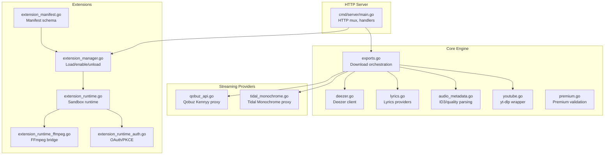

**Diagram sources**
- [main.go:107-134](file://go_backend_spotiflac/cmd/server/main.go#L107-L134)
- [exports.go:158-263](file://go_backend_spotiflac/exports.go#L158-L263)
- [deezer.go:40-68](file://go_backend_spotiflac/deezer.go#L40-L68)
- [lyrics.go:299-307](file://go_backend_spotiflac/lyrics.go#L299-L307)
- [audio_metadata.go:15-38](file://go_backend_spotiflac/audio_metadata.go#L15-L38)
- [youtube.go:13-45](file://go_backend_spotiflac/youtube.go#L13-L45)
- [qobuz_api.go:32-58](file://go_backend_spotiflac/qobuz_api.go#L32-L58)
- [tidal_monochrome.go:34-64](file://go_backend_spotiflac/tidal_monochrome.go#L34-L64)
- [extension_manager.go:120-139](file://go_backend_spotiflac/extension_manager.go#L120-L139)
- [extension_runtime.go:84-112](file://go_backend_spotiflac/extension_runtime.go#L84-L112)
- [extension_runtime_ffmpeg.go:12-28](file://go_backend_spotiflac/extension_runtime_ffmpeg.go#L12-L28)
- [extension_runtime_auth.go:18-42](file://go_backend_spotiflac/extension_runtime_auth.go#L18-L42)
- [extension_manifest.go:116-138](file://go_backend_spotiflac/extension_manifest.go#L116-L138)

**Section sources**
- [go.mod:1-39](file://go_backend_spotiflac/go.mod#L1-L39)
- [main.go:107-134](file://go_backend_spotiflac/cmd/server/main.go#L107-L134)

## Core Components
- HTTP server and routing: single-process HTTP server with handlers for index, search, RPC, playback, and download endpoints.
- JSON-RPC dispatcher: generic handler that routes named methods to backend functions.
- Playback session management: in-memory keyed sessions with status and progress tracking.
- Download orchestration: unified request model, provider selection, and post-processing.
- Metadata extraction and embedding: ID3 parsing, quality probing, cover extraction/embedding, and replay gain support.
- Lyrics fetching: prioritized provider chain with caching and fallback.
- Streaming provider clients: Deezer, Qobuz Kennyy, Tidal Monochrome proxies.
- Extension system: sandboxed JavaScript runtime, permissions, auth helpers, and FFmpeg bridge.

**Section sources**
- [main.go:136-270](file://go_backend_spotiflac/cmd/server/main.go#L136-L270)
- [main.go:359-385](file://go_backend_spotiflac/cmd/server/main.go#L359-L385)
- [exports.go:158-263](file://go_backend_spotiflac/exports.go#L158-L263)
- [audio_metadata.go:15-38](file://go_backend_spotiflac/audio_metadata.go#L15-L38)
- [lyrics.go:299-307](file://go_backend_spotiflac/lyrics.go#L299-L307)
- [deezer.go:40-68](file://go_backend_spotiflac/deezer.go#L40-L68)
- [qobuz_api.go:32-58](file://go_backend_spotiflac/qobuz_api.go#L32-L58)
- [tidal_monochrome.go:34-64](file://go_backend_spotiflac/tidal_monochrome.go#L34-L64)
- [extension_manager.go:120-139](file://go_backend_spotiflac/extension_manager.go#L120-L139)
- [extension_runtime.go:84-112](file://go_backend_spotiflac/extension_runtime.go#L84-L112)
- [extension_runtime_ffmpeg.go:12-28](file://go_backend_spotiflac/extension_runtime_ffmpeg.go#L12-L28)
- [extension_runtime_auth.go:18-42](file://go_backend_spotiflac/extension_runtime_auth.go#L18-L42)

## Architecture Overview
The backend exposes a simple HTTP API and a JSON-RPC interface. Requests are routed to specialized handlers or the dispatcher. The download pipeline coordinates metadata enrichment, provider selection, optional lyrics embedding, and post-processing. Extensions augment capabilities with a sandboxed JavaScript runtime and permission model.

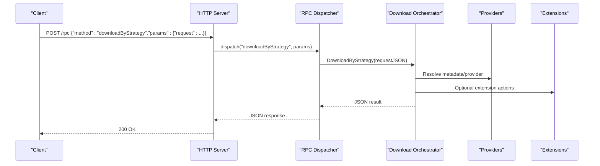

**Diagram sources**
- [main.go:359-385](file://go_backend_spotiflac/cmd/server/main.go#L359-L385)
- [exports.go:158-263](file://go_backend_spotiflac/exports.go#L158-L263)

## Detailed Component Analysis

### HTTP Server and Endpoints
- Root: returns service metadata.
- Search: queries Deezer with limits and returns mapped tracks.
- RPC: generic method dispatcher for backend operations.
- Play: starts a download session and serves audio when ready.
- Download: serves pre-downloaded files.

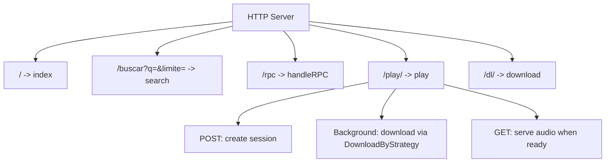

**Diagram sources**
- [main.go:124-134](file://go_backend_spotiflac/cmd/server/main.go#L124-L134)
- [main.go:288-295](file://go_backend_spotiflac/cmd/server/main.go#L288-L295)
- [main.go:297-347](file://go_backend_spotiflac/cmd/server/main.go#L297-L347)
- [main.go:359-385](file://go_backend_spotiflac/cmd/server/main.go#L359-L385)
- [main.go:136-270](file://go_backend_spotiflac/cmd/server/main.go#L136-L270)
- [main.go:272-286](file://go_backend_spotiflac/cmd/server/main.go#L272-L286)

**Section sources**
- [main.go:124-134](file://go_backend_spotiflac/cmd/server/main.go#L124-L134)
- [main.go:288-295](file://go_backend_spotiflac/cmd/server/main.go#L288-L295)
- [main.go:297-347](file://go_backend_spotiflac/cmd/server/main.go#L297-L347)
- [main.go:359-385](file://go_backend_spotiflac/cmd/server/main.go#L359-L385)
- [main.go:136-270](file://go_backend_spotiflac/cmd/server/main.go#L136-L270)
- [main.go:272-286](file://go_backend_spotiflac/cmd/server/main.go#L272-L286)

### JSON-RPC Dispatcher
- Validates method names and parameters.
- Routes to backend functions returning structured results or errors.

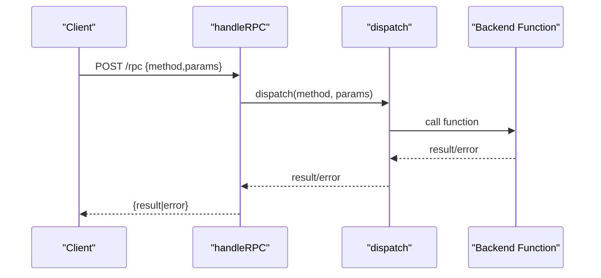

**Diagram sources**
- [main.go:359-385](file://go_backend_spotiflac/cmd/server/main.go#L359-L385)
- [main.go:555-800](file://go_backend_spotiflac/cmd/server/main.go#L555-L800)

**Section sources**
- [main.go:359-385](file://go_backend_spotiflac/cmd/server/main.go#L359-L385)
- [main.go:555-800](file://go_backend_spotiflac/cmd/server/main.go#L555-L800)

### Playback Session Management
- Sessions are keyed and tracked in-memory with status, progress, and file path.
- POST creates a session and starts background download.
- GET checks status or serves audio when ready.

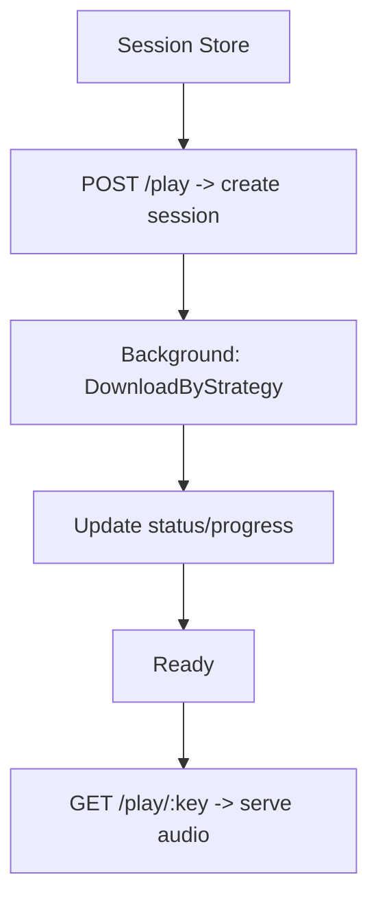

**Diagram sources**
- [main.go:24-40](file://go_backend_spotiflac/cmd/server/main.go#L24-L40)
- [main.go:136-270](file://go_backend_spotiflac/cmd/server/main.go#L136-L270)

**Section sources**
- [main.go:24-40](file://go_backend_spotiflac/cmd/server/main.go#L24-L40)
- [main.go:136-270](file://go_backend_spotiflac/cmd/server/main.go#L136-L270)

### Audio Processing Pipeline and FFmpeg Integration
- Download orchestration uses a unified request model with provider selection and post-processing hooks.
- FFmpeg commands are queued and executed asynchronously; extension runtime exposes ffmpeg.execute and ffmpeg.convert.
- Quality probing and conversion utilities are available.

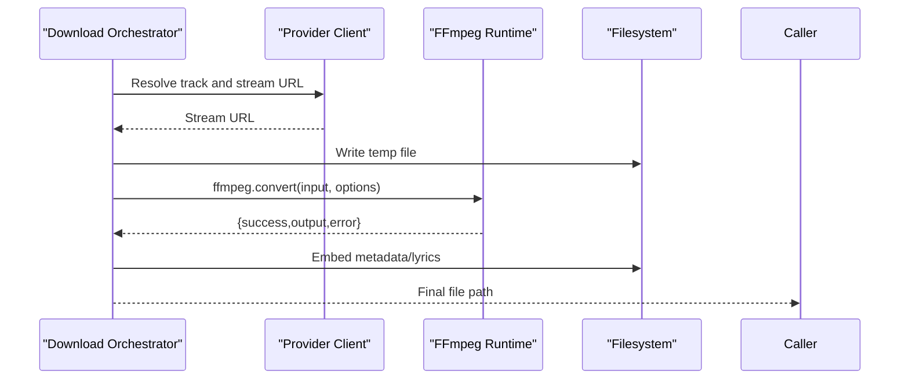

**Diagram sources**
- [exports.go:158-263](file://go_backend_spotiflac/exports.go#L158-L263)
- [extension_runtime_ffmpeg.go:53-182](file://go_backend_spotiflac/extension_runtime_ffmpeg.go#L53-L182)

**Section sources**
- [exports.go:158-263](file://go_backend_spotiflac/exports.go#L158-L263)
- [extension_runtime_ffmpeg.go:53-182](file://go_backend_spotiflac/extension_runtime_ffmpeg.go#L53-L182)

### Metadata Extraction and Embedding
- ID3 parsing supports ID3v2.x and ID3v1 with genre normalization and lyrics extraction.
- Quality probing reads MP3/Ogg headers to derive sample rate, bitrate, and duration.
- Cover extraction/embedding and replay gain metadata are supported.

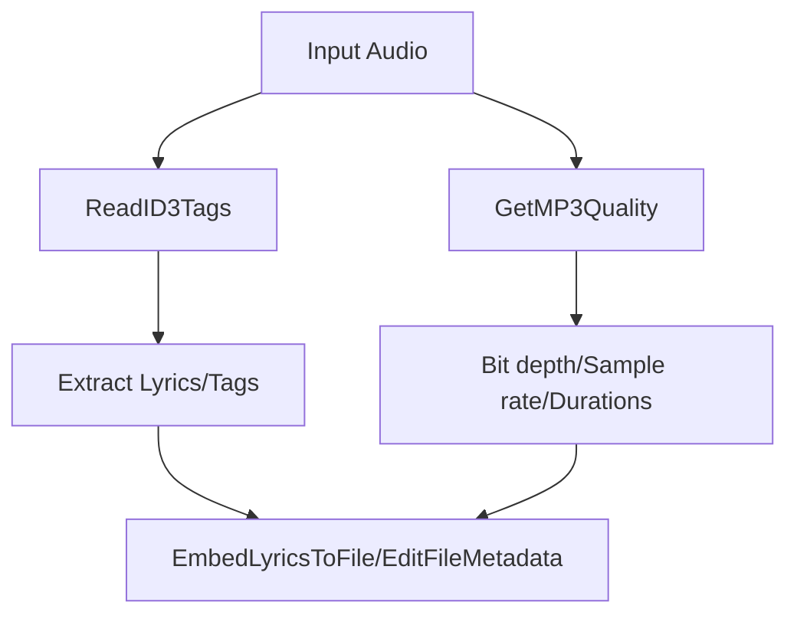

**Diagram sources**
- [audio_metadata.go:54-94](file://go_backend_spotiflac/audio_metadata.go#L54-L94)
- [audio_metadata.go:662-800](file://go_backend_spotiflac/audio_metadata.go#L662-L800)

**Section sources**
- [audio_metadata.go:54-94](file://go_backend_spotiflac/audio_metadata.go#L54-L94)
- [audio_metadata.go:662-800](file://go_backend_spotiflac/audio_metadata.go#L662-L800)

### Lyrics Fetching and Providers
- Provider order is configurable; built-in providers include LRCLIB, Apple Music, Musixmatch, Netease, QQ, Spotify, Deezer, YouTube, Kugou, Genius.
- Caching reduces repeated lookups; extension-provided providers can override built-in results.

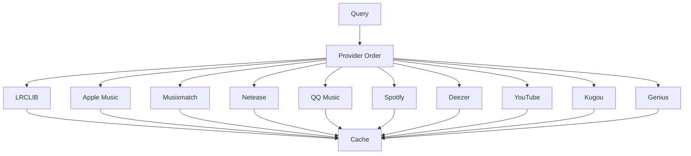

**Diagram sources**
- [lyrics.go:95-140](file://go_backend_spotiflac/lyrics.go#L95-L140)
- [lyrics.go:432-632](file://go_backend_spotiflac/lyrics.go#L432-L632)

**Section sources**
- [lyrics.go:95-140](file://go_backend_spotiflac/lyrics.go#L95-L140)
- [lyrics.go:432-632](file://go_backend_spotiflac/lyrics.go#L432-L632)

### External API Integrations
- Deezer client: search, album, artist, and ISRC resolution with caches.
- Qobuz Kennyy proxy: search, album/artist metadata, and download URL resolution.
- Tidal Monochrome proxy: search by ISRC/name, album info, and stream URL retrieval.
- YouTube: yt-dlp wrapper for video search and download.

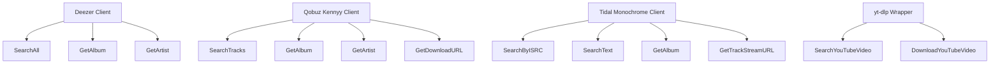

**Diagram sources**
- [deezer.go:304-540](file://go_backend_spotiflac/deezer.go#L304-L540)
- [qobuz_api.go:202-242](file://go_backend_spotiflac/qobuz_api.go#L202-L242)
- [qobuz_api.go:296-348](file://go_backend_spotiflac/qobuz_api.go#L296-L348)
- [tidal_monochrome.go:180-223](file://go_backend_spotiflac/tidal_monochrome.go#L180-L223)
- [tidal_monochrome.go:494-537](file://go_backend_spotiflac/tidal_monochrome.go#L494-L537)
- [tidal_monochrome.go:467-492](file://go_backend_spotiflac/tidal_monochrome.go#L467-L492)
- [youtube.go:13-45](file://go_backend_spotiflac/youtube.go#L13-L45)
- [youtube.go:47-83](file://go_backend_spotiflac/youtube.go#L47-L83)

**Section sources**
- [deezer.go:304-540](file://go_backend_spotiflac/deezer.go#L304-L540)
- [qobuz_api.go:202-242](file://go_backend_spotiflac/qobuz_api.go#L202-L242)
- [qobuz_api.go:296-348](file://go_backend_spotiflac/qobuz_api.go#L296-L348)
- [tidal_monochrome.go:180-223](file://go_backend_spotiflac/tidal_monochrome.go#L180-L223)
- [tidal_monochrome.go:494-537](file://go_backend_spotiflac/tidal_monochrome.go#L494-L537)
- [tidal_monochrome.go:467-492](file://go_backend_spotiflac/tidal_monochrome.go#L467-L492)
- [youtube.go:13-45](file://go_backend_spotiflac/youtube.go#L13-L45)
- [youtube.go:47-83](file://go_backend_spotiflac/youtube.go#L47-L83)

### Authentication Mechanisms
- OAuth/PKCE helpers for extension-managed authentication.
- Validation of redirect domains and private IP restrictions.
- Token storage and expiration handling.

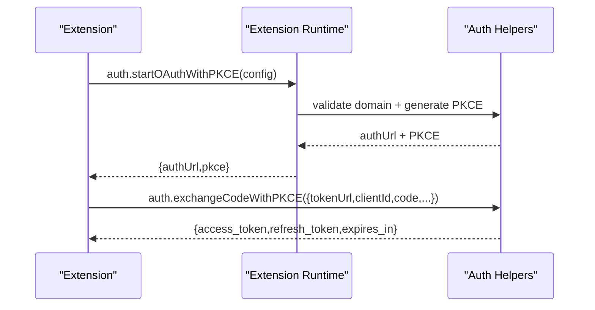

**Diagram sources**
- [extension_runtime_auth.go:284-386](file://go_backend_spotiflac/extension_runtime_auth.go#L284-L386)
- [extension_runtime_auth.go:388-549](file://go_backend_spotiflac/extension_runtime_auth.go#L388-L549)

**Section sources**
- [extension_runtime_auth.go:18-42](file://go_backend_spotiflac/extension_runtime_auth.go#L18-L42)
- [extension_runtime_auth.go:284-386](file://go_backend_spotiflac/extension_runtime_auth.go#L284-L386)
- [extension_runtime_auth.go:388-549](file://go_backend_spotiflac/extension_runtime_auth.go#L388-L549)

### Extension System and Plugin Architecture
- Extension manager loads/unloads ZIP packages, validates manifests, and manages runtime instances.
- Extension runtime provides sandboxed APIs: HTTP, storage, credentials, file IO, FFmpeg, matching/utils, logging, and gobackend helpers.
- Manifest defines type, permissions, settings, health checks, and capabilities.

```mermaid
classDiagram
class ExtensionManager {
+SetDirectories(extensionsDir, dataDir) error
+LoadExtensionFromFile(filePath) *loadedExtension,error
+LoadExtensionsFromDirectory(dirPath) []string,error
+UnloadExtension(id) error
+GetAllExtensions() []*loadedExtension
+SetExtensionEnabled(id, enabled) error
}
class loadedExtension {
+ID string
+Manifest *ExtensionManifest
+VM *goja.Runtime
+Enabled bool
+Error string
+ensureRuntimeReady() error
}
class extensionRuntime {
+httpClient *http.Client
+dataDir string
+vm *goja.Runtime
+RegisterAPIs(vm)
+ffmpegExecute(...)
+authStartOAuthWithPKCE(...)
}
ExtensionManager --> loadedExtension : "manages"
loadedExtension --> extensionRuntime : "owns"
extensionRuntime --> "goja VM" : "executes"
```

**Diagram sources**
- [extension_manager.go:120-139](file://go_backend_spotiflac/extension_manager.go#L120-L139)
- [extension_manager.go:158-294](file://go_backend_spotiflac/extension_manager.go#L158-L294)
- [extension_runtime.go:84-112](file://go_backend_spotiflac/extension_runtime.go#L84-L112)
- [extension_runtime.go:424-533](file://go_backend_spotiflac/extension_runtime.go#L424-L533)
- [extension_manifest.go:116-138](file://go_backend_spotiflac/extension_manifest.go#L116-L138)

**Section sources**
- [extension_manager.go:120-139](file://go_backend_spotiflac/extension_manager.go#L120-L139)
- [extension_manager.go:158-294](file://go_backend_spotiflac/extension_manager.go#L158-L294)
- [extension_runtime.go:84-112](file://go_backend_spotiflac/extension_runtime.go#L84-L112)
- [extension_runtime.go:424-533](file://go_backend_spotiflac/extension_runtime.go#L424-L533)
- [extension_manifest.go:116-138](file://go_backend_spotiflac/extension_manifest.go#L116-L138)

### Premium and Authorization Utilities
- Premium code validation and verification routines.
- Network compatibility options for provider clients.

**Section sources**
- [premium.go:27-92](file://go_backend_spotiflac/premium.go#L27-L92)
- [premium.go:112-126](file://go_backend_spotiflac/premium.go#L112-L126)

## Dependency Analysis
The backend module declares Go toolchain and SQLite, plus several libraries for scripting, FLAC metadata, compression, and networking. These underpin the extension runtime (Goja), audio metadata parsing, and HTTP transport.

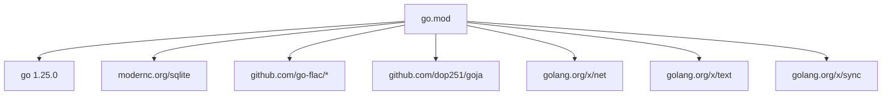

**Diagram sources**
- [go.mod:1-39](file://go_backend_spotiflac/go.mod#L1-L39)

**Section sources**
- [go.mod:1-39](file://go_backend_spotiflac/go.mod#L1-L39)

## Performance Considerations
- Caching: Provider clients maintain caches for search, album, artist, and ISRC lookups with TTL trimming.
- Concurrency: Provider lookups and downloads are performed concurrently where safe; consider rate limiting and timeouts.
- Streaming: yt-dlp and provider proxies are used to avoid direct client-side media handling.
- Memory: In-memory playback sessions keep minimal state; ensure proper cleanup after completion.
- Disk I/O: Prefer streaming writes during downloads and temporary directories for intermediate files.

[No sources needed since this section provides general guidance]

## Troubleshooting Guide
Common issues and remedies:
- FFmpeg not found: The server attempts to locate ffmpeg in PATH or bundled executable; ensure availability or install manually.
- Provider failures: Verify network connectivity and provider health; check logs for detailed errors.
- Authentication failures: Confirm domain allowlist and private IP restrictions; ensure PKCE verifier is present before token exchange.
- Lyrics not found: Adjust provider order or enable extension-provided providers; confirm cache state.
- Premium validation: Ensure codes meet format and expiration requirements.

**Section sources**
- [main.go:59-105](file://go_backend_spotiflac/cmd/server/main.go#L59-L105)
- [extension_runtime_auth.go:18-42](file://go_backend_spotiflac/extension_runtime_auth.go#L18-L42)
- [extension_runtime_auth.go:432-437](file://go_backend_spotiflac/extension_runtime_auth.go#L432-L437)
- [lyrics.go:432-632](file://go_backend_spotiflac/lyrics.go#L432-L632)
- [premium.go:27-92](file://go_backend_spotiflac/premium.go#L27-L92)

## Conclusion
The Go backend provides a robust, modular foundation for audio processing and delivery. Its HTTP and RPC interfaces integrate tightly with provider clients, metadata engines, and an extensible JavaScript runtime. With caching, sandboxed extensions, and FFmpeg integration, it scales across multiple streaming services while maintaining performance and reliability.

[No sources needed since this section summarizes without analyzing specific files]

## Appendices

### API Usage Examples
- Start a playback session and poll status:
  - POST /play with JSON body containing provider, track_id, track_name, artist_name, isrc, quality.
  - GET /play/:key/status to check status and progress.
  - GET /play/:key to stream audio when ready.
- Download a file:
  - GET /dl/:filename to retrieve a previously downloaded file.
- Search:
  - GET /buscar?q=query&limite=limit to search tracks via Deezer.
- RPC:
  - POST /rpc with JSON body containing method and params (e.g., downloadByStrategy).

**Section sources**
- [main.go:136-270](file://go_backend_spotiflac/cmd/server/main.go#L136-L270)
- [main.go:272-286](file://go_backend_spotiflac/cmd/server/main.go#L272-L286)
- [main.go:297-347](file://go_backend_spotiflac/cmd/server/main.go#L297-L347)
- [main.go:359-385](file://go_backend_spotiflac/cmd/server/main.go#L359-L385)

### Extension Development Checklist
- Define manifest with type, permissions, and settings.
- Implement extension actions and optional initialization.
- Use runtime APIs for HTTP requests, storage, credentials, file IO, FFmpeg, and logging.
- Test authentication flows with PKCE and token exchange.
- Validate health checks and capability declarations.

**Section sources**
- [extension_manifest.go:116-138](file://go_backend_spotiflac/extension_manifest.go#L116-L138)
- [extension_runtime.go:424-533](file://go_backend_spotiflac/extension_runtime.go#L424-L533)
- [extension_runtime_auth.go:284-386](file://go_backend_spotiflac/extension_runtime_auth.go#L284-L386)
- [extension_runtime_ffmpeg.go:53-182](file://go_backend_spotiflac/extension_runtime_ffmpeg.go#L53-L182)