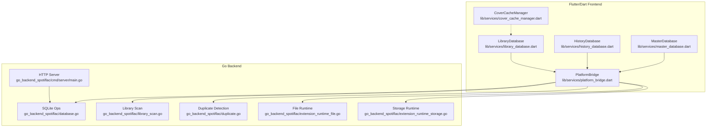
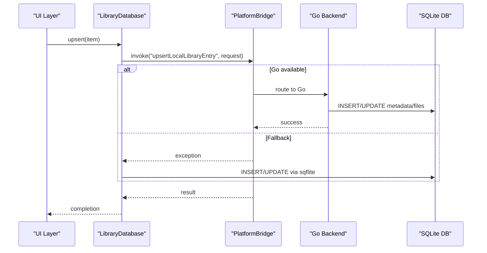
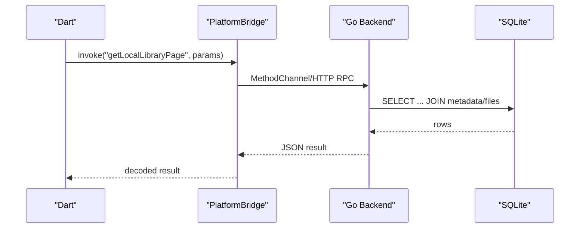
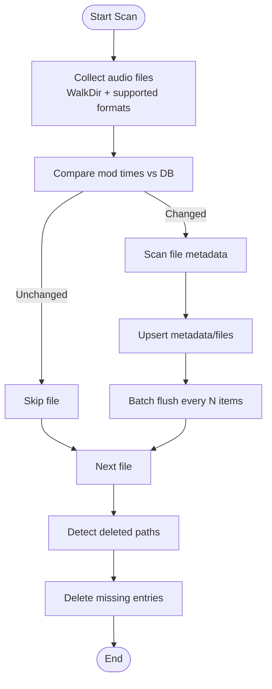
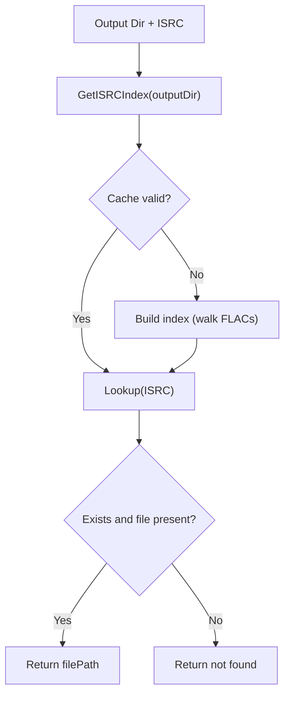
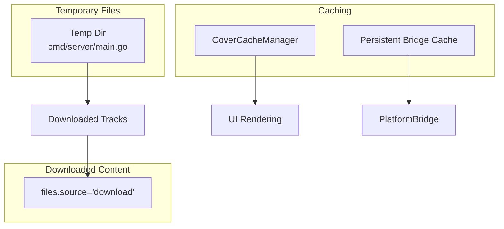
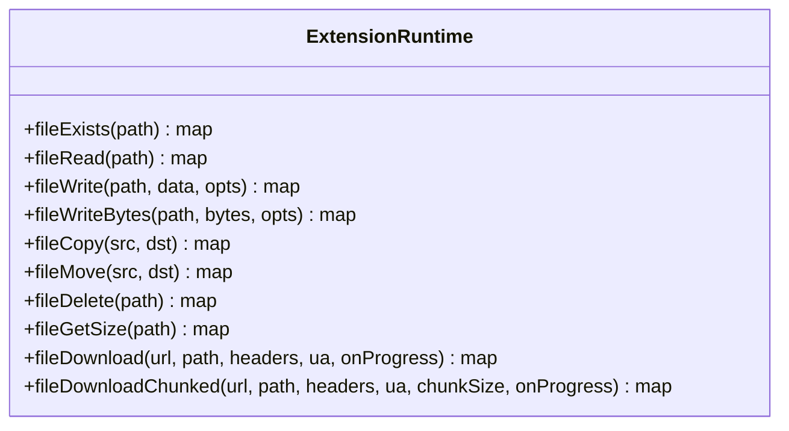
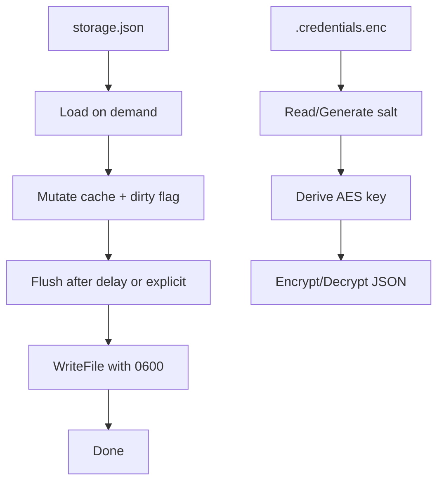
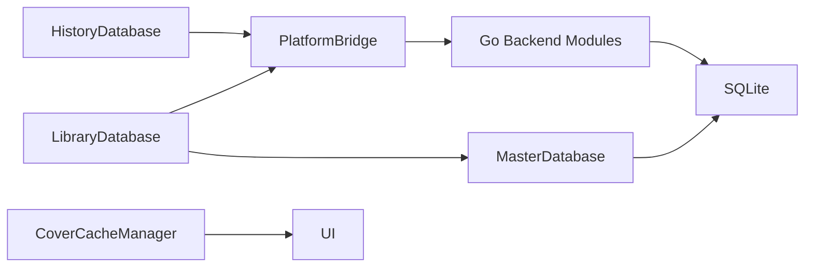

# Database and Storage

<cite>
**Referenced Files in This Document**
- [library_database.dart](file://lib/services/library_database.dart)
- [master_database.dart](file://lib/services/master_database.dart)
- [history_database.dart](file://lib/services/history_database.dart)
- [platform_bridge.dart](file://lib/services/platform_bridge.dart)
- [database.go](file://go_backend_spotiflac/database.go)
- [library_scan.go](file://go_backend_spotiflac/library_scan.go)
- [duplicate.go](file://go_backend_spotiflac/duplicate.go)
- [extension_runtime_file.go](file://go_backend_spotiflac/extension_runtime_file.go)
- [extension_runtime_storage.go](file://go_backend_spotiflac/extension_runtime_storage.go)
- [cover_cache_manager.dart](file://lib/services/cover_cache_manager.dart)
- [download_queue_provider.dart](file://lib/providers/download_queue_provider.dart)
- [main.go](file://go_backend_spotiflac/cmd/server/main.go)
</cite>

## Table of Contents
1. [Introduction](#introduction)
2. [Project Structure](#project-structure)
3. [Core Components](#core-components)
4. [Architecture Overview](#architecture-overview)
5. [Detailed Component Analysis](#detailed-component-analysis)
6. [Dependency Analysis](#dependency-analysis)
7. [Performance Considerations](#performance-considerations)
8. [Troubleshooting Guide](#troubleshooting-guide)
9. [Conclusion](#conclusion)

## Introduction
This document explains the database and storage management subsystems with a focus on SQLite integration and file system operations. It covers the database schema design, FFI integration via a platform bridge, data persistence strategies, local library scanning algorithms, duplicate detection, and file organization patterns. It also documents storage management for temporary files, downloaded content, and caches, along with practical examples of database operations, migration strategies, and performance optimization techniques. Cross-platform file handling, path management, and storage cleanup procedures are addressed to ensure robust operation across platforms.

## Project Structure
The system comprises:
- A Flutter/Dart frontend that orchestrates database operations and file management.
- A Go backend that performs heavy lifting for scanning, metadata extraction, duplicate detection, and file I/O.
- A unified SQLite database managed by Dart’s sqflite and exposed to Go for efficient persistence and concurrency-safe operations.
- A platform bridge that routes operations to the Go backend when available, with graceful fallback to local SQLite.



**Diagram sources**
- [library_database.dart](file://lib/services/library_database.dart)
- [history_database.dart](file://lib/services/history_database.dart)
- [master_database.dart](file://lib/services/master_database.dart)
- [platform_bridge.dart](file://lib/services/platform_bridge.dart)
- [database.go](file://go_backend_spotiflac/database.go)
- [library_scan.go](file://go_backend_spotiflac/library_scan.go)
- [duplicate.go](file://go_backend_spotiflac/duplicate.go)
- [extension_runtime_file.go](file://go_backend_spotiflac/extension_runtime_file.go)
- [extension_runtime_storage.go](file://go_backend_spotiflac/extension_runtime_storage.go)
- [main.go](file://go_backend_spotiflac/cmd/server/main.go)

**Section sources**
- [library_database.dart](file://lib/services/library_database.dart)
- [master_database.dart](file://lib/services/master_database.dart)
- [platform_bridge.dart](file://lib/services/platform_bridge.dart)

## Core Components
- MasterDatabase: Initializes and manages the unified SQLite database using sqflite, sets PRAGMA configurations, and exposes creation/upgrades for tables.
- LibraryDatabase: Provides high-level APIs for local library operations, delegating to the Go backend via PlatformBridge when available, with fallback to local SQLite.
- HistoryDatabase: Manages persisted download history with similar delegation and fallback patterns.
- PlatformBridge: Routes method invocations to the Go backend (via MethodChannel or HTTP RPC) and handles caching and event streams.
- Go backend modules: Implement SQLite operations, library scanning, duplicate detection, and file/runtime operations.

Key responsibilities:
- Database schema design and migrations.
- FFI integration and fallback mechanisms.
- Local library scanning with incremental updates and deletion detection.
- Duplicate detection via ISRC indexing.
- File system operations for downloads, temp files, and cache management.
- Cross-platform path handling and storage cleanup.

**Section sources**
- [master_database.dart](file://lib/services/master_database.dart)
- [library_database.dart](file://lib/services/library_database.dart)
- [history_database.dart](file://lib/services/history_database.dart)
- [platform_bridge.dart](file://lib/services/platform_bridge.dart)

## Architecture Overview
The architecture leverages a hybrid model:
- Dart frontends call PlatformBridge to invoke Go backend functions for heavy tasks.
- Go backend uses modernc.org/sqlite driver to operate on the same SQLite database, ensuring consistency and avoiding contention.
- Temporary files and downloaded content are managed by Go runtime APIs and stored under controlled directories.
- Caching is handled by Flutter’s cache manager and persisted caches for bridge lookups.



**Diagram sources**
- [library_database.dart](file://lib/services/library_database.dart)
- [platform_bridge.dart](file://lib/services/platform_bridge.dart)
- [database.go](file://go_backend_spotiflac/database.go)

**Section sources**
- [platform_bridge.dart](file://lib/services/platform_bridge.dart)
- [database.go](file://go_backend_spotiflac/database.go)

## Detailed Component Analysis

### Database Schema Design and Migrations
- Unified schema: metadata and files tables define the core domain model for local library and download history.
- Foreign keys and constraints ensure referential integrity.
- Migrations add new columns safely across versions, preserving existing data.

```mermaid
erDiagram
METADATA {
text id PK
text track_name
text artist_name
text album_name
text album_artist
text isrc
integer duration_ms
integer track_number
integer total_tracks
integer disc_number
integer total_discs
text release_date
text genre
text label
text copyright
text composer
text spotify_id
text custom_json
text cover_path
text cover_url
}
FILES {
text id PK
text metadata_id FK
text file_path UNQ
text format
integer bit_depth
integer sample_rate
integer bitrate
integer file_size
integer file_mod_time
text source
text downloaded_at
text scanned_at
text saf_file_name
}
COLLECTIONS {
text id PK
text name
text type
text cover_path
text created_at
text updated_at
text custom_json
text item_json
}
METADATA ||--o{ FILES : "references"
```

**Diagram sources**
- [master_database.dart](file://lib/services/master_database.dart)

**Section sources**
- [master_database.dart](file://lib/services/master_database.dart)

### FFI Integration and Platform Bridge
- PlatformBridge encapsulates MethodChannel and HTTP RPC invocation, with caching and in-flight request management.
- Desktop mode auto-starts the Go backend server and communicates via HTTP.
- Methods include library operations, history operations, duplicate checks, filename building, and SAF operations.



**Diagram sources**
- [platform_bridge.dart](file://lib/services/platform_bridge.dart)
- [database.go](file://go_backend_spotiflac/database.go)

**Section sources**
- [platform_bridge.dart](file://lib/services/platform_bridge.dart)
- [main.go](file://go_backend_spotiflac/cmd/server/main.go)

### Local Library Scanning and Incremental Updates
- Scans a folder recursively for supported audio formats.
- Uses modification time comparisons to skip unchanged files.
- Supports CUE sheets and referenced audio files.
- Detects deletions by comparing current filesystem paths against database records.
- Batches writes to improve performance.



**Diagram sources**
- [library_scan.go](file://go_backend_spotiflac/library_scan.go)
- [database.go](file://go_backend_spotiflac/database.go)

**Section sources**
- [library_scan.go](file://go_backend_spotiflac/library_scan.go)
- [database.go](file://go_backend_spotiflac/database.go)

### Duplicate Detection and File Organization
- ISRC-based duplicate detection maintains an in-memory index per output directory with TTL and concurrency guards.
- Index is built by walking FLAC files and extracting ISRC metadata.
- Parallel existence checks accelerate batch validations.



**Diagram sources**
- [duplicate.go](file://go_backend_spotiflac/duplicate.go)

**Section sources**
- [duplicate.go](file://go_backend_spotiflac/duplicate.go)

### Storage Management for Temporary Files, Downloads, and Cache
- Temporary files: managed by the Go backend server’s temp directory for streaming/playback.
- Downloaded content: persisted in the files table with source='download'; paths are tracked and updated.
- Cache handling: Flutter cache manager tracks stats and supports wipe/refresh; covers are cached separately.



**Diagram sources**
- [main.go](file://go_backend_spotiflac/cmd/server/main.go)
- [history_database.dart](file://lib/services/history_database.dart)
- [cover_cache_manager.dart](file://lib/services/cover_cache_manager.dart)
- [platform_bridge.dart](file://lib/services/platform_bridge.dart)

**Section sources**
- [main.go](file://go_backend_spotiflac/cmd/server/main.go)
- [history_database.dart](file://lib/services/history_database.dart)
- [cover_cache_manager.dart](file://lib/services/cover_cache_manager.dart)
- [platform_bridge.dart](file://lib/services/platform_bridge.dart)

### File System Operations and Path Management
- Go extension runtime provides file operations: exists, read, write, copy, move, delete, and size queries.
- Validates paths against extension data directory and enforces permissions.
- Downloads support chunked retrieval for servers rejecting ranged requests.



**Diagram sources**
- [extension_runtime_file.go](file://go_backend_spotiflac/extension_runtime_file.go)

**Section sources**
- [extension_runtime_file.go](file://go_backend_spotiflac/extension_runtime_file.go)

### Storage Runtime and Credentials Encryption
- Extension storage persists key-value pairs in a JSON file with asynchronous flushing and retry delays.
- Credentials are encrypted using AES-GCM with a salt derived from extension ID and a per-extension salt file.



**Diagram sources**
- [extension_runtime_storage.go](file://go_backend_spotiflac/extension_runtime_storage.go)

**Section sources**
- [extension_runtime_storage.go](file://go_backend_spotiflac/extension_runtime_storage.go)

### Practical Examples of Database Operations
- Upsert local library entry: LibraryDatabase delegates to PlatformBridge, which invokes Go backend to INSERT/UPDATE metadata and files.
- Get library page: PlatformBridge calls Go to fetch paginated joined data; falls back to local query if unavailable.
- Update file modification times: LibraryDatabase batches updates via transaction or Go backend.
- Cleanup missing files: Compares DB paths with current filesystem and deletes missing entries.

**Section sources**
- [library_database.dart](file://lib/services/library_database.dart)
- [database.go](file://go_backend_spotiflac/database.go)

### Migration Strategies
- MasterDatabase.onCreate and onUpgrade add columns and create tables as needed.
- Version increments enable adding new fields without breaking existing installations.
- Backward-compatible fallback ensures operations continue even if Go backend is unavailable.

**Section sources**
- [master_database.dart](file://lib/services/master_database.dart)

### Performance Optimization Techniques
- SQLite tuning in Go backend: WAL mode, NORMAL sync, cache size, busy timeout.
- Batching inserts/updates for library scanning and history operations.
- Incremental scans using modification times and CUE-aware logic.
- Parallel duplicate existence checks and storage flush debouncing.

**Section sources**
- [database.go](file://go_backend_spotiflac/database.go)
- [library_scan.go](file://go_backend_spotiflac/library_scan.go)
- [duplicate.go](file://go_backend_spotiflac/duplicate.go)
- [extension_runtime_storage.go](file://go_backend_spotiflac/extension_runtime_storage.go)

### Cross-Platform File Handling and Storage Cleanup
- Path resolution and validation enforced by extension runtime.
- SAF (Scoped Storage) operations for Android via PlatformBridge (pick, resolve, copy, replace, share).
- Startup orphan cleanup iterates pages of history entries to detect and repair or remove missing files.
- Cover cache statistics and wipe operations support maintenance.

**Section sources**
- [platform_bridge.dart](file://lib/services/platform_bridge.dart)
- [download_queue_provider.dart](file://lib/providers/download_queue_provider.dart)
- [cover_cache_manager.dart](file://lib/services/cover_cache_manager.dart)

## Dependency Analysis
- LibraryDatabase depends on PlatformBridge and MasterDatabase for fallback.
- HistoryDatabase mirrors LibraryDatabase patterns for download history.
- PlatformBridge depends on MethodChannel/HTTP RPC and SharedPreferences for caching.
- Go backend modules depend on the shared SQLite database and modernc.org/sqlite driver.
- Frontend cache managers integrate with Flutter’s image cache and HTTP file service.



**Diagram sources**
- [library_database.dart](file://lib/services/library_database.dart)
- [history_database.dart](file://lib/services/history_database.dart)
- [platform_bridge.dart](file://lib/services/platform_bridge.dart)
- [master_database.dart](file://lib/services/master_database.dart)
- [database.go](file://go_backend_spotiflac/database.go)

**Section sources**
- [library_database.dart](file://lib/services/library_database.dart)
- [history_database.dart](file://lib/services/history_database.dart)
- [platform_bridge.dart](file://lib/services/platform_bridge.dart)
- [master_database.dart](file://lib/services/master_database.dart)
- [database.go](file://go_backend_spotiflac/database.go)

## Performance Considerations
- Use WAL and appropriate cache sizes for SQLite in Go backend.
- Prefer batched operations for scanning and history updates.
- Leverage incremental scans and modification-time checks to minimize work.
- Debounce storage flushes in extension runtime to reduce I/O.
- Use parallel checks for duplicates and cache stats collection.

## Troubleshooting Guide
- If Go backend is unavailable, operations fall back to local sqflite; verify logs for exceptions.
- For duplicate detection failures, ensure output directory is set and index TTL is acceptable.
- For file operations, confirm extension permissions and validated paths.
- For cache issues, refresh stats or wipe cache directories as needed.
- For orphaned downloads, trigger startup cleanup to repair or remove missing entries.

**Section sources**
- [library_database.dart](file://lib/services/library_database.dart)
- [history_database.dart](file://lib/services/history_database.dart)
- [platform_bridge.dart](file://lib/services/platform_bridge.dart)
- [download_queue_provider.dart](file://lib/providers/download_queue_provider.dart)
- [cover_cache_manager.dart](file://lib/services/cover_cache_manager.dart)

## Conclusion
The system combines a Dart frontend with a Go backend to deliver robust database and storage capabilities. SQLite serves as the single source of truth, with careful attention to performance, reliability, and cross-platform compatibility. The platform bridge enables seamless delegation of heavy tasks to Go while maintaining fallbacks for resilience. Scanning, duplication detection, and file management are optimized for real-world usage, with clear patterns for migrations, caching, and cleanup.