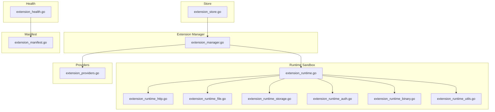
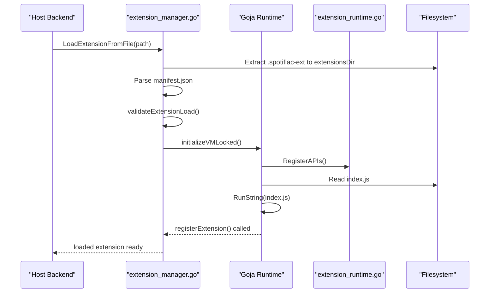
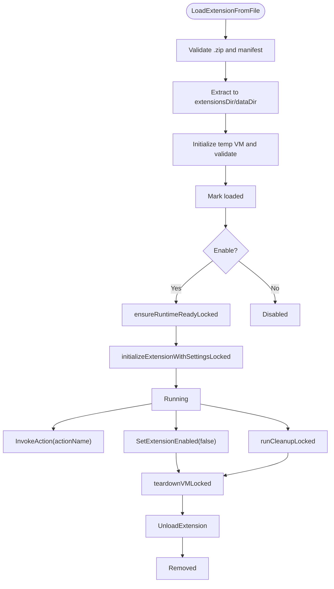
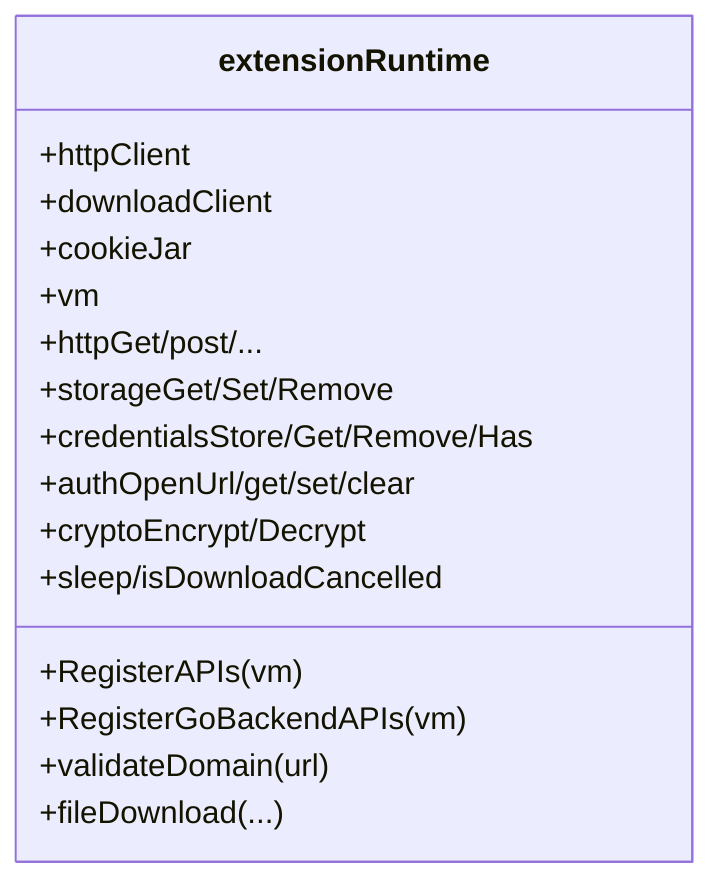
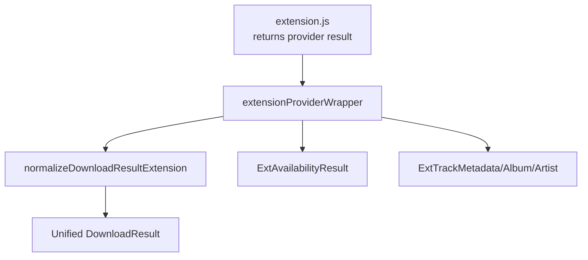
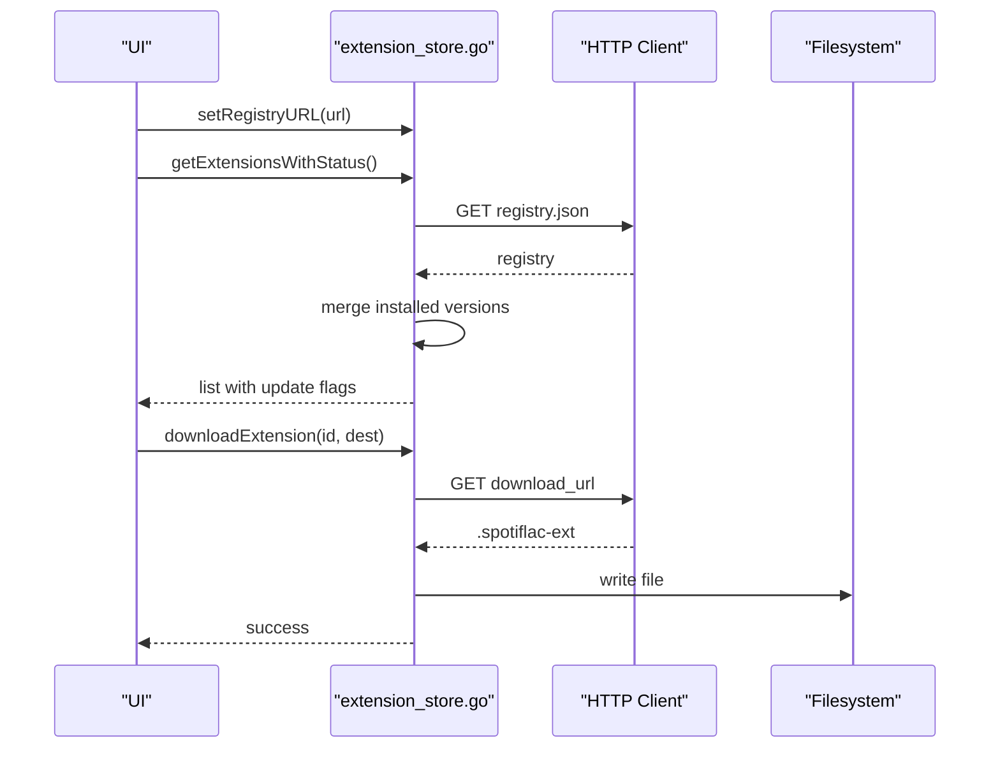
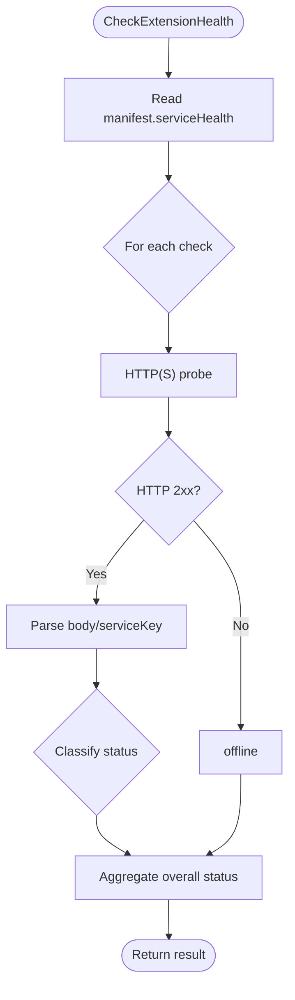
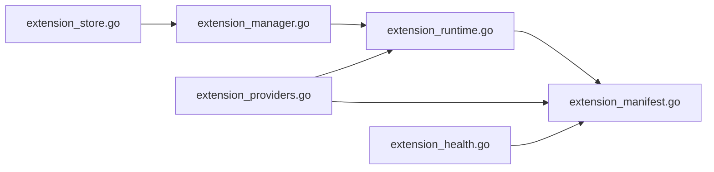

# Extension System

<cite>
**Referenced Files in This Document**
- [extension_manager.go](file://go_backend_spotiflac/extension_manager.go)
- [extension_runtime.go](file://go_backend_spotiflac/extension_runtime.go)
- [extension_providers.go](file://go_backend_spotiflac/extension_providers.go)
- [extension_store.go](file://go_backend_spotiflac/extension_store.go)
- [extension_health.go](file://go_backend_spotiflac/extension_health.go)
- [extension_manifest.go](file://go_backend_spotiflac/extension_manifest.go)
- [extension_runtime_auth.go](file://go_backend_spotiflac/extension_runtime_auth.go)
- [extension_runtime_binary.go](file://go_backend_spotiflac/extension_runtime_binary.go)
- [extension_runtime_file.go](file://go_backend_spotiflac/extension_runtime_file.go)
- [extension_runtime_http.go](file://go_backend_spotiflac/extension_runtime_http.go)
- [extension_runtime_storage.go](file://go_backend_spotiflac/extension_runtime_storage.go)
- [extension_runtime_utils.go](file://go_backend_spotiflac/extension_runtime_utils.go)
</cite>

## Table of Contents
1. [Introduction](#introduction)
2. [Project Structure](#project-structure)
3. [Core Components](#core-components)
4. [Architecture Overview](#architecture-overview)
5. [Detailed Component Analysis](#detailed-component-analysis)
6. [Dependency Analysis](#dependency-analysis)
7. [Performance Considerations](#performance-considerations)
8. [Troubleshooting Guide](#troubleshooting-guide)
9. [Conclusion](#conclusion)
10. [Appendices](#appendices)

## Introduction
This document explains the extension system that powers plugin-style functionality in the backend. It covers the extension lifecycle (loading, enabling, initialization, invoking actions, cleanup, unloading), JavaScript VM integration via the Goja runtime, provider registration for metadata, download, and lyrics capabilities, the extension store and update mechanism, and health checking. It also includes security and sandboxing considerations, performance characteristics, and practical development guidance.

## Project Structure
The extension system is implemented primarily in the Go backend module under go_backend_spotiflac. Key areas:
- Lifecycle and manager: extension lifecycle orchestration, loading/unloading, enable/disable, and invocation
- Runtime and sandbox: JavaScript VM integration, sandboxed APIs, HTTP, file, storage, credentials, crypto, and logging
- Providers: typed extension capabilities (metadata/download/lyrics) and result normalization
- Store and updates: registry-driven discovery, installation, upgrades, and caching
- Health: service health checks per extension manifest

**Diagram sources**
- [extension_manager.go:120-1202](file://go_backend_spotiflac/extension_manager.go#L120-L1202)
- [extension_runtime.go:84-534](file://go_backend_spotiflac/extension_runtime.go#L84-L534)
- [extension_runtime_http.go:1-491](file://go_backend_spotiflac/extension_runtime_http.go#L1-L491)
- [extension_runtime_file.go:1-1003](file://go_backend_spotiflac/extension_runtime_file.go#L1-L1003)
- [extension_runtime_storage.go:1-518](file://go_backend_spotiflac/extension_runtime_storage.go#L1-L518)
- [extension_runtime_auth.go:1-550](file://go_backend_spotiflac/extension_runtime_auth.go#L1-L550)
- [extension_runtime_binary.go:1-361](file://go_backend_spotiflac/extension_runtime_binary.go#L1-L361)
- [extension_runtime_utils.go:1-531](file://go_backend_spotiflac/extension_runtime_utils.go#L1-L531)
- [extension_providers.go:1-3389](file://go_backend_spotiflac/extension_providers.go#L1-L3389)
- [extension_store.go:1-560](file://go_backend_spotiflac/extension_store.go#L1-L560)
- [extension_health.go:1-333](file://go_backend_spotiflac/extension_health.go#L1-L333)
- [extension_manifest.go:1-331](file://go_backend_spotiflac/extension_manifest.go#L1-L331)

**Section sources**
- [extension_manager.go:120-1202](file://go_backend_spotiflac/extension_manager.go#L120-L1202)
- [extension_runtime.go:84-534](file://go_backend_spotiflac/extension_runtime.go#L84-L534)
- [extension_providers.go:1-3389](file://go_backend_spotiflac/extension_providers.go#L1-L3389)
- [extension_store.go:1-560](file://go_backend_spotiflac/extension_store.go#L1-L560)
- [extension_health.go:1-333](file://go_backend_spotiflac/extension_health.go#L1-L333)
- [extension_manifest.go:1-331](file://go_backend_spotiflac/extension_manifest.go#L1-L331)

## Core Components
- Extension manager: central controller for loading, enabling/disabling, upgrading, removing, and invoking extension actions
- Extension runtime: sandboxed JavaScript environment with APIs for HTTP, file, storage, credentials, crypto, auth, and logging
- Provider wrappers: typed adapters that translate extension-provided results into unified backend structures
- Extension store: registry-backed discovery, caching, and download of extensions
- Health checker: evaluates extension-defined health endpoints and aggregates statuses
- Manifest: validates and interprets extension capabilities, permissions, and behaviors

**Section sources**
- [extension_manager.go:120-1202](file://go_backend_spotiflac/extension_manager.go#L120-L1202)
- [extension_runtime.go:84-534](file://go_backend_spotiflac/extension_runtime.go#L84-L534)
- [extension_providers.go:523-780](file://go_backend_spotiflac/extension_providers.go#L523-L780)
- [extension_store.go:120-560](file://go_backend_spotiflac/extension_store.go#L120-L560)
- [extension_health.go:56-99](file://go_backend_spotiflac/extension_health.go#L56-L99)
- [extension_manifest.go:116-288](file://go_backend_spotiflac/extension_manifest.go#L116-L288)

## Architecture Overview
The system integrates a Go backend with a JavaScript runtime to execute extensions safely. Extensions are packaged as .spotiflac-ext archives containing a manifest.json and index.js. The manager loads and validates the extension, initializes a VM, registers sandboxed APIs, and optionally runs initialization with stored settings. Providers are invoked through wrapper functions that convert extension outputs to backend types.

**Diagram sources**
- [extension_manager.go:158-294](file://go_backend_spotiflac/extension_manager.go#L158-L294)
- [extension_runtime.go:424-533](file://go_backend_spotiflac/extension_runtime.go#L424-L533)
- [extension_runtime_file.go:75-108](file://go_backend_spotiflac/extension_runtime_file.go#L75-L108)

**Section sources**
- [extension_manager.go:158-294](file://go_backend_spotiflac/extension_manager.go#L158-L294)
- [extension_runtime.go:296-414](file://go_backend_spotiflac/extension_runtime.go#L296-L414)

## Detailed Component Analysis

### Extension Lifecycle Management
- Loading: Validates .spotiflac-ext, extracts files, parses manifest, ensures directories, and stores metadata
- Validation: Initializes a temporary VM to verify the extension can be loaded and calls registerExtension
- Enabling/Disabling: Creates or tears down the VM, persists enabled state, and applies stored settings on enable
- Initialization: Runs extension.initialize(settings) with stored settings when present
- Invocation: Executes extension.actionName() with timeouts and returns merged results
- Cleanup: Calls extension.cleanup() and flushes storage
- Unloading/Removal: Tears down VM, clears state, and optionally removes source directory

**Diagram sources**
- [extension_manager.go:158-294](file://go_backend_spotiflac/extension_manager.go#L158-L294)
- [extension_manager.go:416-554](file://go_backend_spotiflac/extension_manager.go#L416-L554)
- [extension_manager.go:1134-1201](file://go_backend_spotiflac/extension_manager.go#L1134-L1201)

**Section sources**
- [extension_manager.go:158-294](file://go_backend_spotiflac/extension_manager.go#L158-L294)
- [extension_manager.go:416-554](file://go_backend_spotiflac/extension_manager.go#L416-L554)
- [extension_manager.go:1134-1201](file://go_backend_spotiflac/extension_manager.go#L1134-L1201)

### JavaScript VM Integration and Sandbox
- VM creation: Each extension gets its own goja.Runtime instance
- API registration: Exposes http, storage, credentials, auth, file, ffmpeg, matching, utils, log, gobackend, plus polyfills
- Sandboxing: Strict domain allowlist, HTTPS enforcement (with optional AllowHTTP), private IP blocking, cookie jar isolation, file path sandboxing, and cancellation binding for downloads/requests
- Console and logging: Redirects console.log to backend logs with extension context

**Diagram sources**
- [extension_runtime.go:84-147](file://go_backend_spotiflac/extension_runtime.go#L84-L147)
- [extension_runtime_http.go:38-69](file://go_backend_spotiflac/extension_runtime_http.go#L38-L69)
- [extension_runtime_file.go:75-108](file://go_backend_spotiflac/extension_runtime_file.go#L75-L108)
- [extension_runtime_storage.go:171-255](file://go_backend_spotiflac/extension_runtime_storage.go#L171-L255)
- [extension_runtime_auth.go:55-163](file://go_backend_spotiflac/extension_runtime_auth.go#L55-L163)
- [extension_runtime_binary.go:266-360](file://go_backend_spotiflac/extension_runtime_binary.go#L266-L360)
- [extension_runtime_utils.go:163-246](file://go_backend_spotiflac/extension_runtime_utils.go#L163-L246)

**Section sources**
- [extension_runtime.go:424-533](file://go_backend_spotiflac/extension_runtime.go#L424-L533)
- [extension_runtime_http.go:38-69](file://go_backend_spotiflac/extension_runtime_http.go#L38-L69)
- [extension_runtime_file.go:75-108](file://go_backend_spotiflac/extension_runtime_file.go#L75-L108)
- [extension_runtime_storage.go:171-255](file://go_backend_spotiflac/extension_runtime_storage.go#L171-L255)
- [extension_runtime_auth.go:55-163](file://go_backend_spotiflac/extension_runtime_auth.go#L55-L163)
- [extension_runtime_binary.go:266-360](file://go_backend_spotiflac/extension_runtime_binary.go#L266-L360)
- [extension_runtime_utils.go:163-246](file://go_backend_spotiflac/extension_runtime_utils.go#L163-L246)

### Provider Registration System
Extensions declare capabilities via manifest types (metadata_provider, download_provider, lyrics_provider). The system wraps extension calls and normalizes results into backend structures:
- Metadata: ExtTrackMetadata, ExtAlbumMetadata, ExtArtistMetadata
- Availability: ExtAvailabilityResult
- Downloads: ExtDownloadResult mapped to DownloadResult
- Lyrics: via dedicated runtime helpers

**Diagram sources**
- [extension_providers.go:19-83](file://go_backend_spotiflac/extension_providers.go#L19-L83)
- [extension_providers.go:230-269](file://go_backend_spotiflac/extension_providers.go#L230-L269)
- [extension_providers.go:417-448](file://go_backend_spotiflac/extension_providers.go#L417-L448)
- [extension_providers.go:523-542](file://go_backend_spotiflac/extension_providers.go#L523-L542)

**Section sources**
- [extension_providers.go:19-83](file://go_backend_spotiflac/extension_providers.go#L19-L83)
- [extension_providers.go:230-269](file://go_backend_spotiflac/extension_providers.go#L230-L269)
- [extension_providers.go:417-448](file://go_backend_spotiflac/extension_providers.go#L417-L448)
- [extension_providers.go:523-542](file://go_backend_spotiflac/extension_providers.go#L523-L542)

### Extension Store Functionality and Updates
- Registry: JSON registry served over HTTPS; supports resolving GitHub URLs to raw registry.json
- Discovery: Fetches registry with caching (TTL), merges with installed extensions, computes update availability
- Download: Downloads .spotiflac-ext packages to a destination path
- Upgrade: Compares versions; replaces files atomically while preserving enabled state and data directory

**Diagram sources**
- [extension_store.go:154-172](file://go_backend_spotiflac/extension_store.go#L154-L172)
- [extension_store.go:299-331](file://go_backend_spotiflac/extension_store.go#L299-L331)
- [extension_store.go:333-388](file://go_backend_spotiflac/extension_store.go#L333-L388)
- [extension_store.go:390-450](file://go_backend_spotiflac/extension_store.go#L390-L450)

**Section sources**
- [extension_store.go:120-560](file://go_backend_spotiflac/extension_store.go#L120-L560)

### Health Checking
- Reads serviceHealth from manifest and probes configured endpoints
- Enforces HTTPS-only, domain allowlist, and private IP restrictions
- Classifies status as online/degraded/offline based on HTTP status and optional JSON payload

**Diagram sources**
- [extension_health.go:56-99](file://go_backend_spotiflac/extension_health.go#L56-L99)
- [extension_health.go:101-205](file://go_backend_spotiflac/extension_health.go#L101-L205)

**Section sources**
- [extension_health.go:56-99](file://go_backend_spotiflac/extension_health.go#L56-L99)
- [extension_health.go:101-205](file://go_backend_spotiflac/extension_health.go#L101-L205)

### Practical Examples and Integration Patterns
- Extension development checklist:
  - Create manifest.json with required fields and appropriate types
  - Implement index.js exporting extension object with lifecycle hooks (initialize, cleanup) and capability handlers
  - Use runtime APIs for HTTP, file IO, storage, credentials, and crypto
  - Declare permissions (network domains, storage, file, allowHttp)
- Custom provider creation:
  - Implement metadata/download/lyrics provider functions returning standardized structures
  - Use provider wrappers to integrate with backend workflows
- Integration patterns:
  - Use auth APIs for OAuth flows with PKCE
  - Use file.download with chunked mode for problematic CDNs
  - Persist state with storage API; keep secrets in credentials with automatic encryption

[No sources needed since this section provides general guidance]

## Dependency Analysis
- Manager depends on runtime for VM lifecycle and API registration
- Runtime depends on manifest for permissions and timeouts
- Providers depend on runtime for HTTP/file/storage and on manifest for capabilities
- Store depends on manager to compute installed versions and on HTTP for registry and downloads
- Health depends on manifest and runtime’s domain validation

**Diagram sources**
- [extension_manager.go:120-1202](file://go_backend_spotiflac/extension_manager.go#L120-L1202)
- [extension_runtime.go:84-534](file://go_backend_spotiflac/extension_runtime.go#L84-L534)
- [extension_providers.go:1-3389](file://go_backend_spotiflac/extension_providers.go#L1-L3389)
- [extension_store.go:1-560](file://go_backend_spotiflac/extension_store.go#L1-L560)
- [extension_health.go:1-333](file://go_backend_spotiflac/extension_health.go#L1-L333)
- [extension_manifest.go:1-331](file://go_backend_spotiflac/extension_manifest.go#L1-L331)

**Section sources**
- [extension_manager.go:120-1202](file://go_backend_spotiflac/extension_manager.go#L120-L1202)
- [extension_runtime.go:84-534](file://go_backend_spotiflac/extension_runtime.go#L84-L534)
- [extension_providers.go:1-3389](file://go_backend_spotiflac/extension_providers.go#L1-L3389)
- [extension_store.go:1-560](file://go_backend_spotiflac/extension_store.go#L1-L560)
- [extension_health.go:1-333](file://go_backend_spotiflac/extension_health.go#L1-L333)
- [extension_manifest.go:1-331](file://go_backend_spotiflac/extension_manifest.go#L1-L331)

## Performance Considerations
- VM isolation: Each extension has its own VM; avoid excessive concurrent VM creation
- Network timeouts: Per-extension networkTimeoutSeconds and default timeouts applied to HTTP clients
- File IO: Prefer streaming writes and chunked downloads for large media
- Storage flushing: Batched async flush with retry to reduce disk I/O overhead
- Caching: Store registry TTL reduces network usage; private IP cache improves DNS resolution performance

[No sources needed since this section provides general guidance]

## Troubleshooting Guide
Common issues and remedies:
- Extension fails to load: Verify manifest validity and presence of index.js; check error messages from validation and VM initialization
- Network blocked: Ensure domain is in manifest permissions and URL uses HTTPS (or allowHttp is set)
- Private IP or redirect blocked: Redirects to private/local networks are disallowed; adjust domains or use allowed public endpoints
- File path errors: Only relative paths within extension dataDir are allowed; use validatePath to diagnose
- Storage/credentials not persisting: Confirm flush timers and encryption key derivation; check storage.json/.credentials.enc locations
- Auth failures: Validate auth URLs, PKCE verifier/challenge pairing, and token exchange responses

**Section sources**
- [extension_runtime_http.go:38-69](file://go_backend_spotiflac/extension_runtime_http.go#L38-L69)
- [extension_runtime_file.go:75-108](file://go_backend_spotiflac/extension_runtime_file.go#L75-L108)
- [extension_runtime_storage.go:39-75](file://go_backend_spotiflac/extension_runtime_storage.go#L39-L75)
- [extension_runtime_auth.go:18-42](file://go_backend_spotiflac/extension_runtime_auth.go#L18-L42)

## Conclusion
The extension system provides a robust, sandboxed environment for third-party plugins with strong security controls, flexible provider integrations, and operational tooling for discovery, updates, and health monitoring. By adhering to manifest permissions, using the runtime APIs responsibly, and following the lifecycle patterns outlined, developers can build reliable extensions that integrate seamlessly with the backend.

## Appendices

### Security and Sandboxing
- Domain allowlist and HTTPS enforcement
- Private IP and redirect restrictions
- Cookie jar isolation per extension
- File path sandboxing and allowed directories
- Credentials encryption with per-extension derived keys
- Auth state and PKCE support with strict URL validation

**Section sources**
- [extension_runtime_http.go:38-69](file://go_backend_spotiflac/extension_runtime_http.go#L38-L69)
- [extension_runtime.go:250-286](file://go_backend_spotiflac/extension_runtime.go#L250-L286)
- [extension_runtime_file.go:75-108](file://go_backend_spotiflac/extension_runtime_file.go#L75-L108)
- [extension_runtime_auth.go:18-42](file://go_backend_spotiflac/extension_runtime_auth.go#L18-L42)
- [extension_runtime_storage.go:257-368](file://go_backend_spotiflac/extension_runtime_storage.go#L257-L368)

### Example Manifest Fields and Capabilities
- Types: metadata_provider, download_provider, lyrics_provider
- Permissions: network domains, storage, file, allowHttp
- Settings: typed settings with defaults and options
- Capabilities: custom timeouts, replacements for built-in providers, post-processing hooks

**Section sources**
- [extension_manifest.go:116-288](file://go_backend_spotiflac/extension_manifest.go#L116-L288)