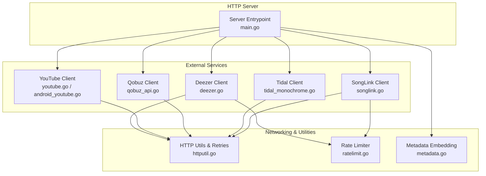
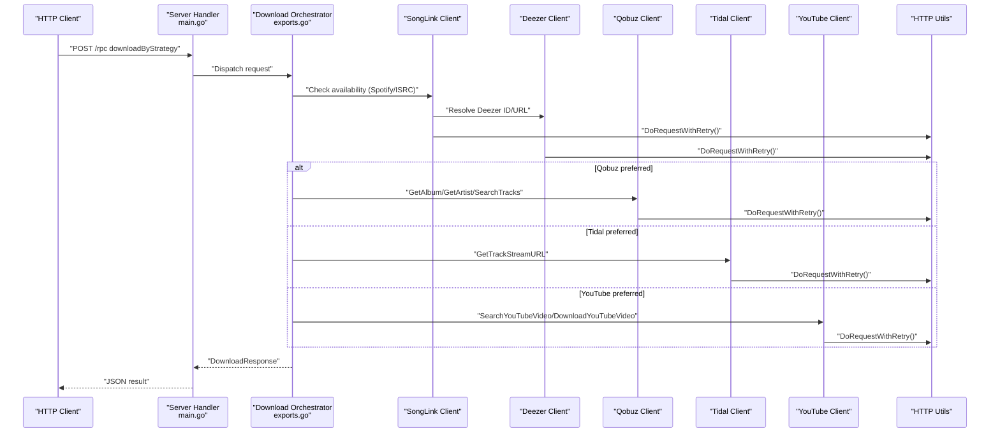
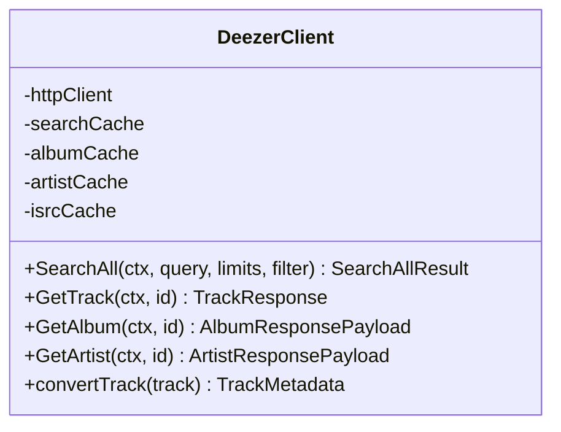
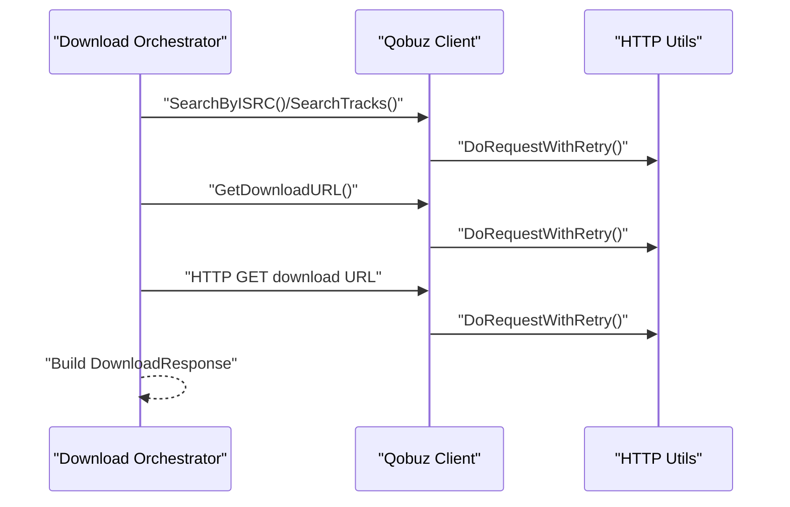
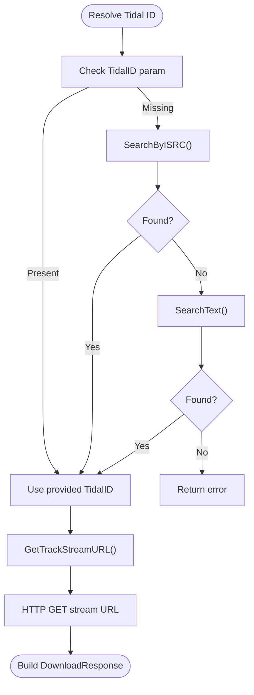
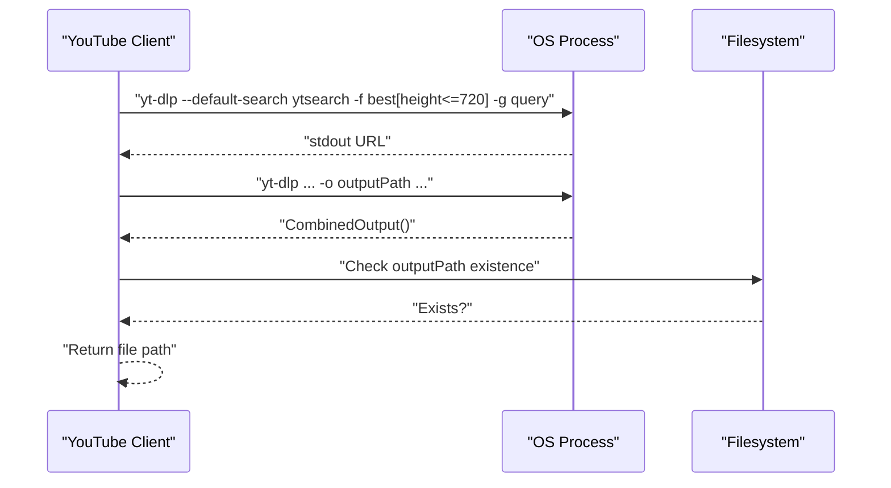
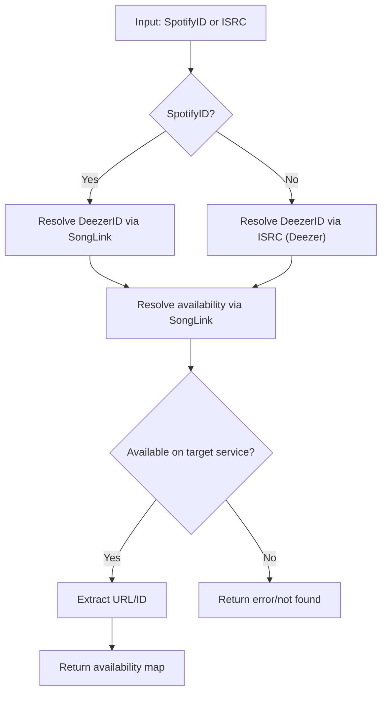
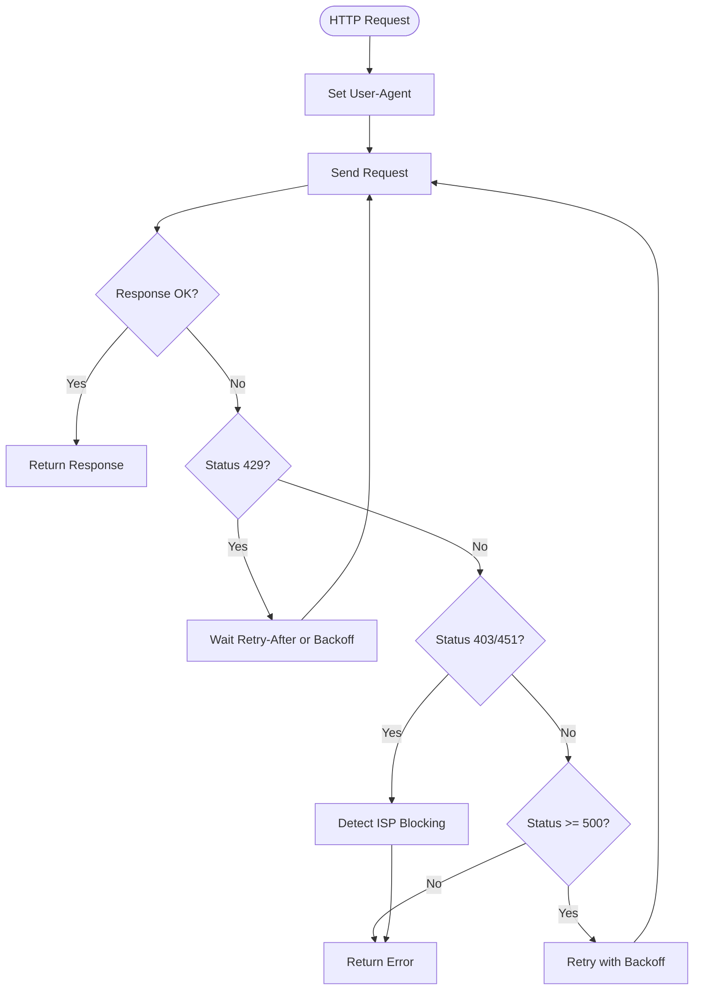
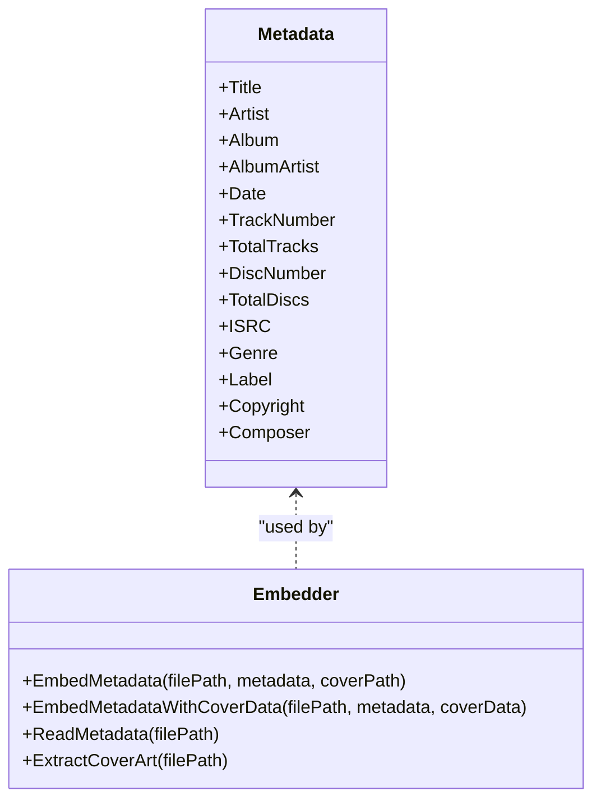
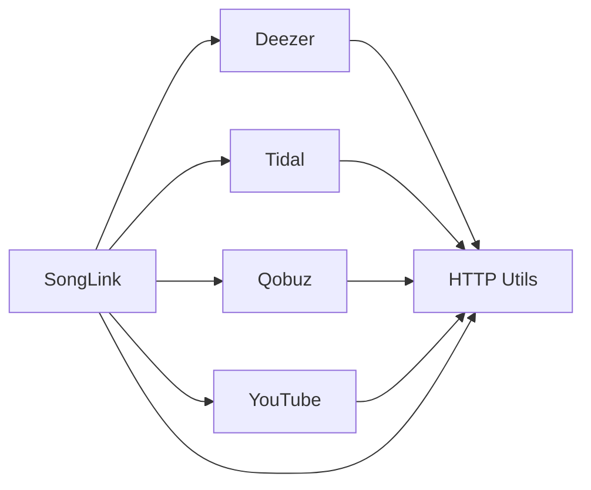

# External API Integration

<cite>
**Referenced Files in This Document**
- [deezer.go](file://go_backend_spotiflac/deezer.go)
- [qobuz_api.go](file://go_backend_spotiflac/qobuz_api.go)
- [tidal_monochrome.go](file://go_backend_spotiflac/tidal_monochrome.go)
- [youtube.go](file://go_backend_spotiflac/youtube.go)
- [android_youtube.go](file://go_backend_spotiflac/android_youtube.go)
- [httputil.go](file://go_backend_spotiflac/httputil.go)
- [ratelimit.go](file://go_backend_spotiflac/ratelimit.go)
- [songlink.go](file://go_backend_spotiflac/songlink.go)
- [exports.go](file://go_backend_spotiflac/exports.go)
- [metadata.go](file://go_backend_spotiflac/metadata.go)
- [main.go](file://go_backend_spotiflac/cmd/server/main.go)
</cite>

## Table of Contents
1. [Introduction](#introduction)
2. [Project Structure](#project-structure)
3. [Core Components](#core-components)
4. [Architecture Overview](#architecture-overview)
5. [Detailed Component Analysis](#detailed-component-analysis)
6. [Dependency Analysis](#dependency-analysis)
7. [Performance Considerations](#performance-considerations)
8. [Troubleshooting Guide](#troubleshooting-guide)
9. [Conclusion](#conclusion)

## Introduction
This document explains the external API integration architecture for streaming service connections and authentication within the backend. It covers Deezer, YouTube (via yt-dlp), Qobuz, and Tidal implementations, detailing authentication mechanisms, rate limiting, error handling, URL parsing, metadata retrieval, and download workflow orchestration. Practical examples demonstrate API usage, authentication flows, and service-specific optimizations, alongside network compatibility options, proxy support, and fallback mechanisms for service failures.

## Project Structure
The backend is implemented in Go and exposes HTTP endpoints for search, playback, and downloads. External service integrations are encapsulated in dedicated clients with caching, retry, and rate-limiting strategies. Shared HTTP utilities provide network compatibility, TLS options, and robust request handling.

**Diagram sources**
- [main.go:107-134](file://go_backend_spotiflac/cmd/server/main.go#L107-L134)
- [deezer.go:40-68](file://go_backend_spotiflac/deezer.go#L40-L68)
- [youtube.go:13-45](file://go_backend_spotiflac/youtube.go#L13-L45)
- [android_youtube.go:13-45](file://go_backend_spotiflac/android_youtube.go#L13-L45)
- [qobuz_api.go:32-58](file://go_backend_spotiflac/qobuz_api.go#L32-L58)
- [tidal_monochrome.go:34-64](file://go_backend_spotiflac/tidal_monochrome.go#L34-L64)
- [songlink.go:14-61](file://go_backend_spotiflac/songlink.go#L14-L61)
- [httputil.go:54-150](file://go_backend_spotiflac/httputil.go#L54-L150)
- [ratelimit.go:8-21](file://go_backend_spotiflac/ratelimit.go#L8-L21)
- [metadata.go:104-129](file://go_backend_spotiflac/metadata.go#L104-L129)

**Section sources**
- [main.go:107-134](file://go_backend_spotiflac/cmd/server/main.go#L107-L134)
- [httputil.go:54-150](file://go_backend_spotiflac/httputil.go#L54-L150)

## Core Components
- Deezer Client: Implements search, album/artist metadata retrieval, caching, and ISRC-based lookups with mobile-optimized timeouts and parallelism.
- Qobuz Client: Provides search, album/artist metadata, and download URL resolution via a third-party proxy with caching and quality mapping.
- Tidal Client: Resolves track/album/stream URLs using multiple regional endpoints with uptime monitoring and caching.
- YouTube Client: Uses yt-dlp to search and download videos with platform-specific builds for desktop and Android.
- HTTP Utilities: Centralized retry logic, rate limiting, network compatibility, and ISP blocking detection.
- SongLink Client: Cross-service availability resolution and URL extraction for Deezer, Tidal, Qobuz, and YouTube.
- Metadata Embedding: FLAC metadata and cover art embedding utilities.

**Section sources**
- [deezer.go:40-68](file://go_backend_spotiflac/deezer.go#L40-L68)
- [qobuz_api.go:32-58](file://go_backend_spotiflac/qobuz_api.go#L32-L58)
- [tidal_monochrome.go:34-64](file://go_backend_spotiflac/tidal_monochrome.go#L34-L64)
- [youtube.go:13-45](file://go_backend_spotiflac/youtube.go#L13-L45)
- [android_youtube.go:13-45](file://go_backend_spotiflac/android_youtube.go#L13-L45)
- [httputil.go:249-345](file://go_backend_spotiflac/httputil.go#L249-L345)
- [songlink.go:14-61](file://go_backend_spotiflac/songlink.go#L14-L61)
- [metadata.go:104-129](file://go_backend_spotiflac/metadata.go#L104-L129)

## Architecture Overview
The backend orchestrates external API calls through service-specific clients, applying shared networking utilities for reliability and resilience. Requests are retried with exponential backoff, rate-limited where applicable, and cached to reduce latency and provider load. URL parsing and cross-service mapping are handled centrally to support fallback strategies.

**Diagram sources**
- [main.go:555-800](file://go_backend_spotiflac/cmd/server/main.go#L555-L800)
- [exports.go:158-203](file://go_backend_spotiflac/exports.go#L158-L203)
- [songlink.go:297-340](file://go_backend_spotiflac/songlink.go#L297-L340)
- [deezer.go:542-553](file://go_backend_spotiflac/deezer.go#L542-L553)
- [qobuz_api.go:296-348](file://go_backend_spotiflac/qobuz_api.go#L296-L348)
- [tidal_monochrome.go:467-492](file://go_backend_spotiflac/tidal_monochrome.go#L467-L492)
- [youtube.go:13-45](file://go_backend_spotiflac/youtube.go#L13-L45)
- [httputil.go:265-345](file://go_backend_spotiflac/httputil.go#L265-L345)

## Detailed Component Analysis

### Deezer Integration
- Authentication: None required for public endpoints; uses standard HTTP client with retries and caching.
- Rate Limiting: Built-in cache TTL and eviction policies; no explicit API rate limiter.
- URL Parsing: Extracts Deezer IDs from URLs and Spotify IDs prefixed with "deezer:".
- Metadata Retrieval: Converts provider responses to unified TrackMetadata with cover art, release dates, and ISRC.
- Download Workflow: Uses resolved Deezer track/album metadata to orchestrate downstream providers.

**Diagram sources**
- [deezer.go:40-68](file://go_backend_spotiflac/deezer.go#L40-L68)
- [deezer.go:213-248](file://go_backend_spotiflac/deezer.go#L213-L248)

**Section sources**
- [deezer.go:15-38](file://go_backend_spotiflac/deezer.go#L15-L38)
- [deezer.go:304-540](file://go_backend_spotiflac/deezer.go#L304-L540)
- [deezer.go:542-690](file://go_backend_spotiflac/deezer.go#L542-L690)
- [deezer.go:692-779](file://go_backend_spotiflac/deezer.go#L692-L779)

### Qobuz Integration (Proxy-based)
- Authentication: Uses a third-party proxy endpoint; no direct OAuth required.
- Rate Limiting: Internal cache with TTL and max entry trimming; quality mapping to provider parameters.
- URL Parsing: Extracts Qobuz IDs from URLs and supports fallback search by ISRC or track+artist.
- Metadata Retrieval: Converts album/artist responses to unified ExtAlbumMetadata/ExtArtistMetadata.
- Download Workflow: Resolves download URL via proxy, streams content to file, and reports results.

**Diagram sources**
- [qobuz_api.go:447-510](file://go_backend_spotiflac/qobuz_api.go#L447-L510)
- [qobuz_api.go:583-612](file://go_backend_spotiflac/qobuz_api.go#L583-L612)
- [httputil.go:265-345](file://go_backend_spotiflac/httputil.go#L265-L345)

**Section sources**
- [qobuz_api.go:15-25](file://go_backend_spotiflac/qobuz_api.go#L15-L25)
- [qobuz_api.go:202-242](file://go_backend_spotiflac/qobuz_api.go#L202-L242)
- [qobuz_api.go:296-348](file://go_backend_spotiflac/qobuz_api.go#L296-L348)
- [qobuz_api.go:447-581](file://go_backend_spotiflac/qobuz_api.go#L447-L581)

### Tidal Integration (Proxy-based)
- Authentication: Uses a proxy service with uptime monitoring and multiple base URLs.
- Rate Limiting: Local cache with TTL; periodic server refresh to maintain endpoints.
- URL Parsing: Extracts Tidal IDs from URLs and supports enrichment via Tidal metadata.
- Metadata Retrieval: Converts track/album responses to unified ExtTrackMetadata/ExtAlbumMetadata.
- Download Workflow: Resolves stream URL via proxy and streams content to file.

**Diagram sources**
- [tidal_monochrome.go:422-454](file://go_backend_spotiflac/tidal_monochrome.go#L422-L454)
- [tidal_monochrome.go:467-492](file://go_backend_spotiflac/tidal_monochrome.go#L467-L492)

**Section sources**
- [tidal_monochrome.go:15-18](file://go_backend_spotiflac/tidal_monochrome.go#L15-L18)
- [tidal_monochrome.go:180-223](file://go_backend_spotiflac/tidal_monochrome.go#L180-L223)
- [tidal_monochrome.go:319-378](file://go_backend_spotiflac/tidal_monochrome.go#L319-L378)
- [tidal_monochrome.go:422-634](file://go_backend_spotiflac/tidal_monochrome.go#L422-L634)

### YouTube Integration (yt-dlp)
- Authentication: None required; relies on yt-dlp for search and extraction.
- Platform Builds: Desktop and Android builds use platform-specific executables.
- URL Parsing: Extracts YouTube video IDs from various URL formats.
- Download Workflow: Searches for best matching video, downloads to output path, and validates file presence.

**Diagram sources**
- [youtube.go:13-45](file://go_backend_spotiflac/youtube.go#L13-L45)
- [android_youtube.go:13-45](file://go_backend_spotiflac/android_youtube.go#L13-L45)

**Section sources**
- [youtube.go:13-84](file://go_backend_spotiflac/youtube.go#L13-L84)
- [android_youtube.go:13-84](file://go_backend_spotiflac/android_youtube.go#L13-L84)

### SongLink Integration (Cross-service Resolution)
- Purpose: Resolve availability and platform URLs for tracks and albums across Deezer, Tidal, Qobuz, and YouTube.
- Rate Limiting: Global rate limiter to avoid SongLink throttling.
- URL Parsing: Extracts IDs from URLs and supports enrichment via Deezer metadata.
- Fallback: Uses IDHS as a fallback when SongLink fails.

**Diagram sources**
- [songlink.go:297-340](file://go_backend_spotiflac/songlink.go#L297-L340)
- [songlink.go:578-613](file://go_backend_spotiflac/songlink.go#L578-L613)

**Section sources**
- [songlink.go:14-61](file://go_backend_spotiflac/songlink.go#L14-L61)
- [songlink.go:297-340](file://go_backend_spotiflac/songlink.go#L297-L340)
- [songlink.go:390-510](file://go_backend_spotiflac/songlink.go#L390-L510)

### HTTP Networking, Rate Limiting, and Error Handling
- Network Compatibility: Allows HTTP fallback for GET/HEAD/DELETE when HTTPS fails; TLS verification can be disabled for compatibility.
- Retry Logic: Exponential backoff with configurable max retries; handles 429 (rate limit) with Retry-After parsing.
- ISP Blocking Detection: Detects DNS, connection, and TLS interception errors; logs suggestions for VPN/DNS changes.
- Rate Limiter: Token bucket-style limiter to constrain request bursts.

**Diagram sources**
- [httputil.go:265-345](file://go_backend_spotiflac/httputil.go#L265-L345)
- [httputil.go:524-535](file://go_backend_spotiflac/httputil.go#L524-L535)
- [ratelimit.go:23-49](file://go_backend_spotiflac/ratelimit.go#L23-L49)

**Section sources**
- [httputil.go:137-150](file://go_backend_spotiflac/httputil.go#L137-L150)
- [httputil.go:249-345](file://go_backend_spotiflac/httputil.go#L249-L345)
- [ratelimit.go:8-21](file://go_backend_spotiflac/ratelimit.go#L8-L21)

### Metadata Embedding and Post-processing
- FLAC Metadata: Embeds tags (artist, album, date, ISRC, genre, label, composer, etc.) and cover art into FLAC files.
- Cover Art Handling: Detects MIME type and embeds picture blocks; supports extracting cover from audio files.
- Post-processing: Supports re-enrichment workflows and lyrics embedding.

**Diagram sources**
- [metadata.go:104-129](file://go_backend_spotiflac/metadata.go#L104-L129)
- [metadata.go:131-189](file://go_backend_spotiflac/metadata.go#L131-L189)
- [metadata.go:242-324](file://go_backend_spotiflac/metadata.go#L242-L324)
- [metadata.go:749-780](file://go_backend_spotiflac/metadata.go#L749-L780)

**Section sources**
- [metadata.go:104-129](file://go_backend_spotiflac/metadata.go#L104-L129)
- [metadata.go:131-240](file://go_backend_spotiflac/metadata.go#L131-L240)
- [metadata.go:242-324](file://go_backend_spotiflac/metadata.go#L242-L324)
- [metadata.go:749-780](file://go_backend_spotiflac/metadata.go#L749-L780)

## Dependency Analysis
- Service Clients depend on shared HTTP utilities for retries, rate limiting, and error classification.
- SongLink acts as a coordinator for cross-service availability and URL extraction.
- Deezer provides authoritative metadata and ISRC resolution for fallbacks.
- Qobuz and Tidal clients encapsulate proxy endpoints and caching strategies.
- YouTube integration relies on external binaries (yt-dlp) with platform-specific builds.

**Diagram sources**
- [songlink.go:297-340](file://go_backend_spotiflac/songlink.go#L297-L340)
- [deezer.go:542-553](file://go_backend_spotiflac/deezer.go#L542-L553)
- [tidal_monochrome.go:467-492](file://go_backend_spotiflac/tidal_monochrome.go#L467-L492)
- [qobuz_api.go:583-612](file://go_backend_spotiflac/qobuz_api.go#L583-L612)
- [youtube.go:13-45](file://go_backend_spotiflac/youtube.go#L13-L45)
- [httputil.go:265-345](file://go_backend_spotiflac/httputil.go#L265-L345)

**Section sources**
- [songlink.go:297-340](file://go_backend_spotiflac/songlink.go#L297-L340)
- [deezer.go:542-553](file://go_backend_spotiflac/deezer.go#L542-L553)
- [tidal_monochrome.go:467-492](file://go_backend_spotiflac/tidal_monochrome.go#L467-L492)
- [qobuz_api.go:583-612](file://go_backend_spotiflac/qobuz_api.go#L583-L612)
- [youtube.go:13-45](file://go_backend_spotiflac/youtube.go#L13-L45)
- [httputil.go:265-345](file://go_backend_spotiflac/httputil.go#L265-L345)

## Performance Considerations
- Caching: Deezer and Qobuz/Tidal clients implement TTL-based caches and eviction to minimize repeated requests.
- Parallelism: Deezer fetches album tracks in parallel and uses parallel ISRC resolution for albums.
- Timeouts: Mobile-optimized timeouts and aggressive retries reduce hanging requests on constrained networks.
- Container Conversion: Avoid unnecessary conversions; mark requires_container_conversion when needed.

[No sources needed since this section provides general guidance]

## Troubleshooting Guide
- ISP Blocking: Automatic detection of DNS failures, connection resets, and TLS interception; suggests VPN/DNS changes.
- Rate Limits: 429 handling with Retry-After parsing; SongLink global rate limiter prevents throttling.
- Permission Errors: Detects file creation/access issues and maps to appropriate error types.
- Not Found/Unavailable: Maps to "not_found" error type for missing tracks or services.
- Network/Timeout Issues: Detects dial, timeout, and connection errors; suggests retry or network checks.

**Section sources**
- [httputil.go:524-535](file://go_backend_spotiflac/httputil.go#L524-L535)
- [httputil.go:294-307](file://go_backend_spotiflac/httputil.go#L294-L307)
- [exports.go:2136-2176](file://go_backend_spotiflac/exports.go#L2136-L2176)

## Conclusion
The backend integrates multiple streaming services through specialized clients, unified networking utilities, and robust error handling. Deezer serves as the authoritative metadata source with caching and parallelism; Qobuz and Tidal leverage proxy endpoints with uptime monitoring; YouTube uses yt-dlp for reliable downloads. SongLink coordinates cross-service availability and URL extraction. Shared HTTP utilities provide retries, rate limiting, and ISP blocking detection, ensuring resilient and efficient downloads across diverse environments.