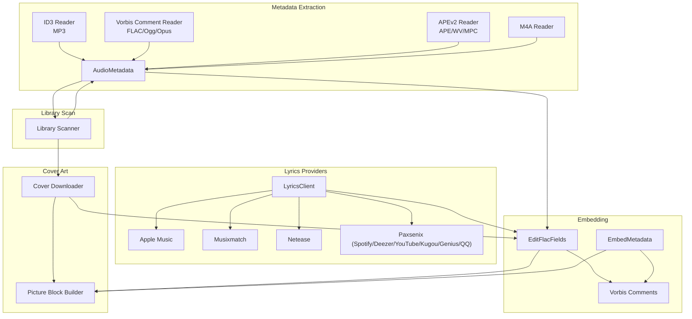
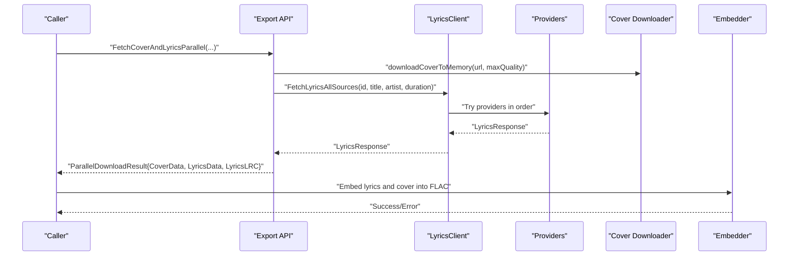
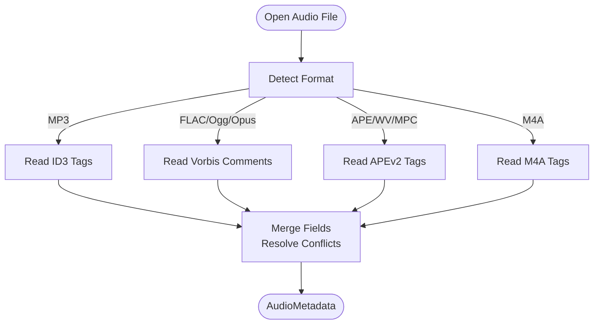
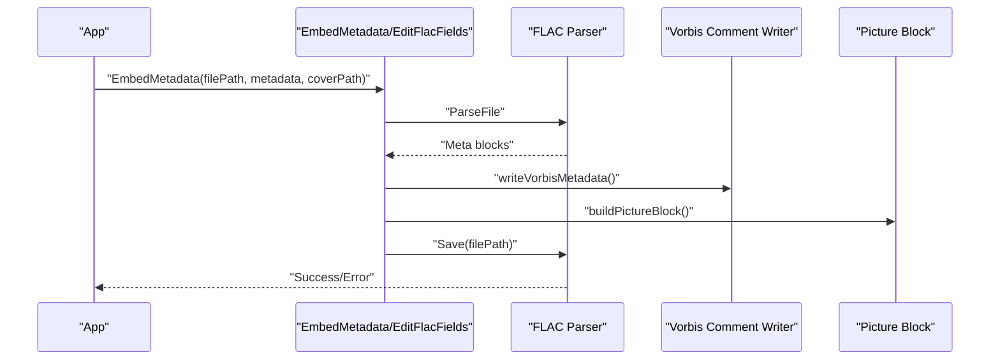
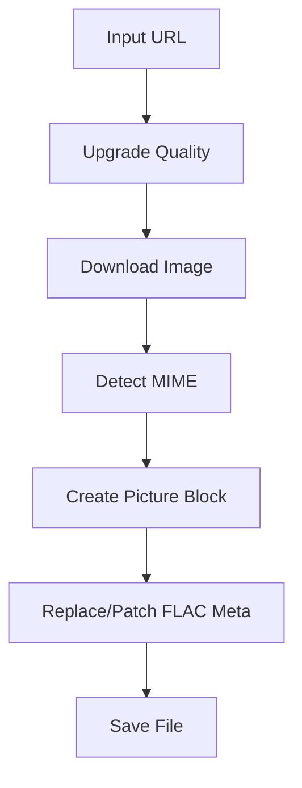
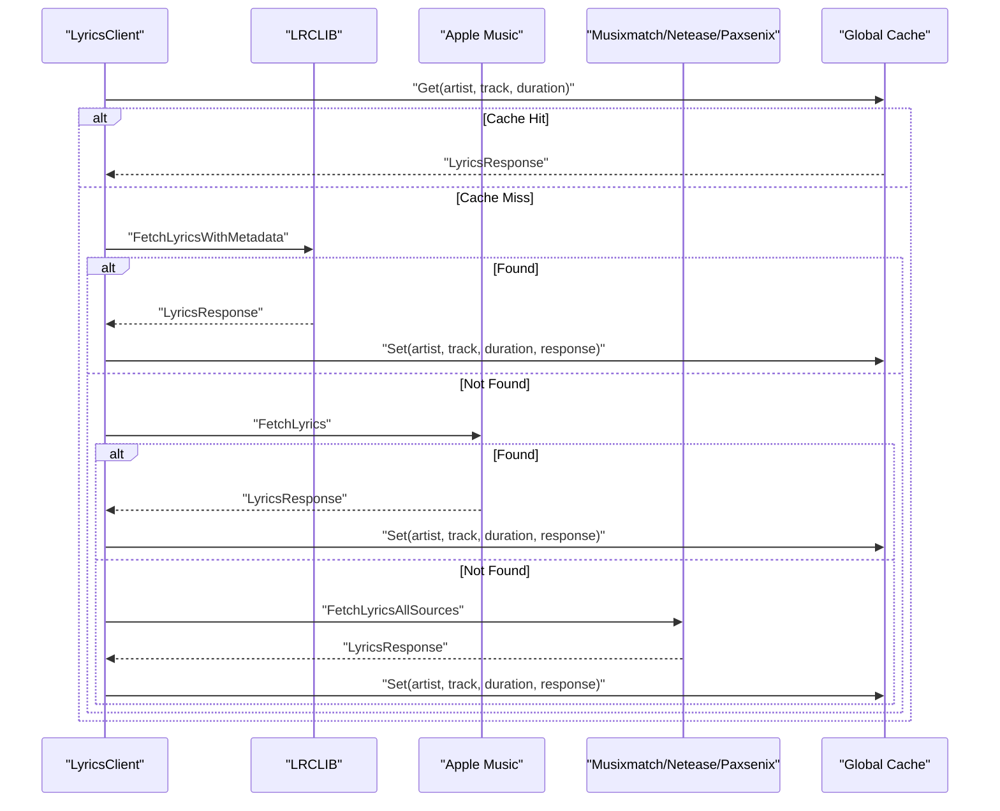
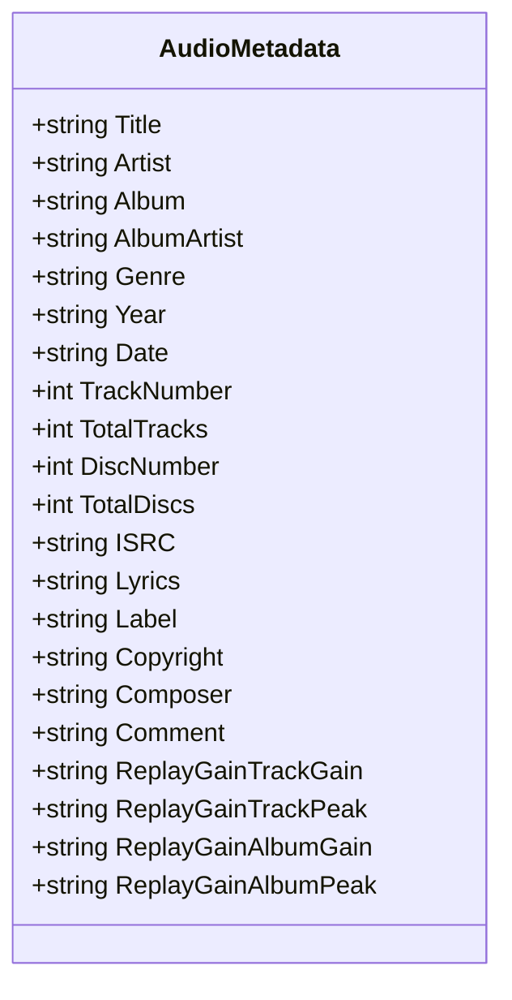
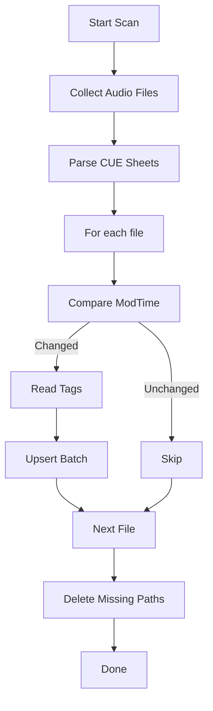
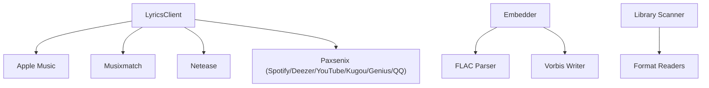

# Metadata Management

<cite>
**Referenced Files in This Document**
- [audio_metadata.go](file://go_backend_spotiflac/audio_metadata.go)
- [metadata.go](file://go_backend_spotiflac/metadata.go)
- [cover.go](file://go_backend_spotiflac/cover.go)
- [lyrics.go](file://go_backend_spotiflac/lyrics.go)
- [lyrics_apple.go](file://go_backend_spotiflac/lyrics_apple.go)
- [lyrics_musixmatch.go](file://go_backend_spotiflac/lyrics_musixmatch.go)
- [lyrics_netease.go](file://go_backend_spotiflac/lyrics_netease.go)
- [lyrics_paxsenix.go](file://go_backend_spotiflac/lyrics_paxsenix.go)
- [lyrics_qqmusic.go](file://go_backend_spotiflac/lyrics_qqmusic.go)
- [metadata_types.go](file://go_backend_spotiflac/metadata_types.go)
- [library_scan.go](file://go_backend_spotiflac/library_scan.go)
- [parallel.go](file://go_backend_spotiflac/parallel.go)
- [exports.go](file://go_backend_spotiflac/exports.go)
</cite>

## Table of Contents
1. [Introduction](#introduction)
2. [Project Structure](#project-structure)
3. [Core Components](#core-components)
4. [Architecture Overview](#architecture-overview)
5. [Detailed Component Analysis](#detailed-component-analysis)
6. [Dependency Analysis](#dependency-analysis)
7. [Performance Considerations](#performance-considerations)
8. [Troubleshooting Guide](#troubleshooting-guide)
9. [Conclusion](#conclusion)

## Introduction
This document describes the metadata management system responsible for extracting, validating, enriching, and embedding audio file tags across multiple formats. It covers:
- Metadata extraction from ID3 (MP3), Vorbis comments (FLAC/Ogg/Opus), APEv2, and M4A
- Tag embedding algorithms for FLAC (Vorbis comments) and other formats
- Cover art handling and quality upgrades
- Lyrics integration with multiple providers (Apple, Musixmatch, Netease, Paxsenix/Spotify/Deezer/YouTube/Kugou/Genius/QQ Music)
- Lyric formatting and LRC generation
- ID3 tag management and ReplayGain handling
- Practical workflows, validation, conflict resolution, fallback strategies, and performance optimization for large libraries

## Project Structure
The metadata system is implemented primarily in the Go backend module (`go_backend_spotiflac/`) with clear separation of concerns:
- Audio format parsers and writers for ID3, Vorbis comments, APEv2, and M4A
- Lyrics providers and caching infrastructure
- Cover art retrieval and embedding
- Library scanning and batch metadata enrichment
- Export APIs for external consumption

**Diagram sources**
- [audio_metadata.go:54-94](file://go_backend_spotiflac/audio_metadata.go#L54-L94)
- [metadata.go:131-189](file://go_backend_spotiflac/metadata.go#L131-L189)
- [lyrics.go:432-632](file://go_backend_spotiflac/lyrics.go#L432-L632)
- [lyrics_apple.go:251-299](file://go_backend_spotiflac/lyrics_apple.go#L251-L299)
- [lyrics_musixmatch.go:125-163](file://go_backend_spotiflac/lyrics_musixmatch.go#L125-L163)
- [lyrics_netease.go:146-196](file://go_backend_spotiflac/lyrics_netease.go#L146-L196)
- [lyrics_paxsenix.go:141-213](file://go_backend_spotiflac/lyrics_paxsenix.go#L141-L213)
- [lyrics_qqmusic.go:93-139](file://go_backend_spotiflac/lyrics_qqmusic.go#L93-L139)
- [cover.go:31-89](file://go_backend_spotiflac/cover.go#L31-L89)
- [library_scan.go:138-325](file://go_backend_spotiflac/library_scan.go#L138-L325)

**Section sources**
- [audio_metadata.go:54-94](file://go_backend_spotiflac/audio_metadata.go#L54-L94)
- [metadata.go:131-189](file://go_backend_spotiflac/metadata.go#L131-L189)
- [lyrics.go:432-632](file://go_backend_spotiflac/lyrics.go#L432-L632)
- [cover.go:31-89](file://go_backend_spotiflac/cover.go#L31-L89)
- [library_scan.go:138-325](file://go_backend_spotiflac/library_scan.go#L138-L325)

## Core Components
- Audio metadata extraction:
  - ID3 parsing for MP3 (v2.2, v2.3, v2.4) with unsync removal, text decoding, and legacy ID3v1 fallback
  - Vorbis comment parsing for FLAC/Ogg/Opus
  - APEv2 parsing for APE/WV/MPC
  - M4A tag reading
- Metadata embedding:
  - FLAC embedding via native Vorbis comment writer
  - Partial edits with field-level set-or-clear semantics
  - Artist splitting and normalization for Vorbis comments
- Cover art:
  - Quality upgrade and MIME detection
  - Picture block creation and embedding
- Lyrics:
  - Multi-provider selection with caching and fallback
  - Parsing and formatting into synchronized/un-synced lines
  - LRC generation with metadata
- Library scanning:
  - Incremental scanning with change detection
  - Batch upsert and deletion cleanup
  - Fallback to filename-based metadata

**Section sources**
- [audio_metadata.go:54-94](file://go_backend_spotiflac/audio_metadata.go#L54-L94)
- [metadata.go:131-189](file://go_backend_spotiflac/metadata.go#L131-L189)
- [metadata.go:242-324](file://go_backend_spotiflac/metadata.go#L242-L324)
- [cover.go:31-89](file://go_backend_spotiflac/cover.go#L31-L89)
- [lyrics.go:187-191](file://go_backend_spotiflac/lyrics.go#L187-L191)
- [library_scan.go:138-325](file://go_backend_spotiflac/library_scan.go#L138-L325)

## Architecture Overview
The system orchestrates extraction, enrichment, and embedding across formats and providers. The central orchestration occurs in the lyrics client and export APIs, while format-specific readers/writers handle low-level tag manipulation.

**Diagram sources**
- [parallel.go:35-85](file://go_backend_spotiflac/parallel.go#L35-L85)
- [lyrics.go:432-632](file://go_backend_spotiflac/lyrics.go#L432-L632)
- [cover.go:31-89](file://go_backend_spotiflac/cover.go#L31-L89)
- [metadata.go:131-189](file://go_backend_spotiflac/metadata.go#L131-L189)

## Detailed Component Analysis

### Audio Metadata Extraction (ID3, Vorbis, APE, M4A)
- ID3 reader:
  - Validates headers, reads frames, applies unsync removal, decodes encodings (ISO-8859-1/UTF-16/UTF-8), and extracts text/comment/lyrics frames
  - Falls back to ID3v1 when needed
- Vorbis comment reader:
  - Parses Vorbis comments and maps to unified metadata fields
- APEv2 reader:
  - Converts APE items to AudioMetadata for downstream processing
- M4A reader:
  - Reads iTunes-style tags and normalizes dates

**Diagram sources**
- [audio_metadata.go:54-94](file://go_backend_spotiflac/audio_metadata.go#L54-L94)
- [metadata.go:242-324](file://go_backend_spotiflac/metadata.go#L242-L324)
- [library_scan.go:406-590](file://go_backend_spotiflac/library_scan.go#L406-L590)

**Section sources**
- [audio_metadata.go:54-94](file://go_backend_spotiflac/audio_metadata.go#L54-L94)
- [audio_metadata.go:96-143](file://go_backend_spotiflac/audio_metadata.go#L96-L143)
- [audio_metadata.go:202-336](file://go_backend_spotiflac/audio_metadata.go#L202-L336)
- [audio_metadata.go:338-369](file://go_backend_spotiflac/audio_metadata.go#L338-L369)
- [metadata.go:242-324](file://go_backend_spotiflac/metadata.go#L242-L324)
- [library_scan.go:406-590](file://go_backend_spotiflac/library_scan.go#L406-L590)

### Tag Embedding (FLAC/Vorbis Comments, Partial Edits)
- Native FLAC embedding:
  - Builds Vorbis comment block and picture block, replaces existing blocks, and saves file
- Partial edits:
  - Field-by-field set-or-clear semantics with alias cleanup (e.g., label/organization, date/year)
  - Artist splitting and deduplication for multi-value artists
- Artist tag modes:
  - Split mode converts multi-artist entries into separate Vorbis comment keys

**Diagram sources**
- [metadata.go:131-189](file://go_backend_spotiflac/metadata.go#L131-L189)
- [metadata.go:331-482](file://go_backend_spotiflac/metadata.go#L331-L482)
- [metadata.go:484-540](file://go_backend_spotiflac/metadata.go#L484-L540)
- [metadata.go:610-649](file://go_backend_spotiflac/metadata.go#L610-L649)

**Section sources**
- [metadata.go:131-189](file://go_backend_spotiflac/metadata.go#L131-L189)
- [metadata.go:331-482](file://go_backend_spotiflac/metadata.go#L331-L482)
- [metadata.go:484-540](file://go_backend_spotiflac/metadata.go#L484-L540)
- [metadata.go:610-649](file://go_backend_spotiflac/metadata.go#L610-L649)

### Cover Art Handling
- Quality upgrade:
  - Converts small thumbnails to medium/high resolutions for Spotify/Deezer/Tidal/Qobuz
- MIME detection:
  - Determines image type from magic bytes and extension
- Embedding:
  - Removes existing picture blocks, creates new picture block, and saves

**Diagram sources**
- [cover.go:31-89](file://go_backend_spotiflac/cover.go#L31-L89)
- [metadata.go:74-102](file://go_backend_spotiflac/metadata.go#L74-L102)

**Section sources**
- [cover.go:31-89](file://go_backend_spotiflac/cover.go#L31-L89)
- [metadata.go:74-102](file://go_backend_spotiflac/metadata.go#L74-L102)

### Lyrics Integration and LRC Generation
- Provider orchestration:
  - Ordered providers (LRCLIB, Apple Music, others) with extension-aware fallback
  - Caching with TTL and duration tolerance
- Parsing and formatting:
  - Synced lyrics parsed from LRC-like formats; unsynced lyrics converted to timed lines
  - Apple/QQ multi-person word-by-word and background vocals preserved
- LRC generation:
  - Adds metadata (title/artist) and formats timestamps

**Diagram sources**
- [lyrics.go:187-271](file://go_backend_spotiflac/lyrics.go#L187-L271)
- [lyrics.go:432-632](file://go_backend_spotiflac/lyrics.go#L432-L632)
- [lyrics_apple.go:251-299](file://go_backend_spotiflac/lyrics_apple.go#L251-L299)
- [lyrics_musixmatch.go:125-163](file://go_backend_spotiflac/lyrics_musixmatch.go#L125-L163)
- [lyrics_netease.go:146-196](file://go_backend_spotiflac/lyrics_netease.go#L146-L196)
- [lyrics_paxsenix.go:141-213](file://go_backend_spotiflac/lyrics_paxsenix.go#L141-L213)
- [lyrics_qqmusic.go:93-139](file://go_backend_spotiflac/lyrics_qqmusic.go#L93-L139)

**Section sources**
- [lyrics.go:187-271](file://go_backend_spotiflac/lyrics.go#L187-L271)
- [lyrics.go:432-632](file://go_backend_spotiflac/lyrics.go#L432-L632)
- [lyrics_apple.go:251-299](file://go_backend_spotiflac/lyrics_apple.go#L251-L299)
- [lyrics_musixmatch.go:125-163](file://go_backend_spotiflac/lyrics_musixmatch.go#L125-L163)
- [lyrics_netease.go:146-196](file://go_backend_spotiflac/lyrics_netease.go#L146-L196)
- [lyrics_paxsenix.go:141-213](file://go_backend_spotiflac/lyrics_paxsenix.go#L141-L213)
- [lyrics_qqmusic.go:93-139](file://go_backend_spotiflac/lyrics_qqmusic.go#L93-L139)

### ID3 Tag Management and ReplayGain
- ID3 parsing:
  - Supports ID3v2.2/2.3/2.4 with unsync handling and text decoding
  - Extracts frames for title, artist, album, year/date, genre, track/disc numbers, ISRC, composer, label, copyright, comments, and lyrics
- ReplayGain:
  - Reads/writes ReplayGain fields via TXXX frames (ID3) and Vorbis comments (FLAC)
  - Stored as numeric values and peaks for track/album

**Diagram sources**
- [audio_metadata.go:15-38](file://go_backend_spotiflac/audio_metadata.go#L15-L38)
- [audio_metadata.go:322-331](file://go_backend_spotiflac/audio_metadata.go#L322-L331)

**Section sources**
- [audio_metadata.go:54-94](file://go_backend_spotiflac/audio_metadata.go#L54-L94)
- [audio_metadata.go:202-336](file://go_backend_spotiflac/audio_metadata.go#L202-L336)
- [metadata.go:124-129](file://go_backend_spotiflac/metadata.go#L124-L129)

### Library Scanning and Enrichment
- Incremental scanning:
  - Compares modification times and skips unchanged files
  - Handles CUE sheets and referenced audio files
  - Batch upserts and deletion cleanup
- Metadata enrichment:
  - Reads format-specific tags and falls back to filename parsing
  - Applies defaults for unknown artist/album/title

**Diagram sources**
- [library_scan.go:90-130](file://go_backend_spotiflac/library_scan.go#L90-L130)
- [library_scan.go:186-325](file://go_backend_spotiflac/library_scan.go#L186-L325)
- [library_scan.go:327-376](file://go_backend_spotiflac/library_scan.go#L327-L376)

**Section sources**
- [library_scan.go:90-130](file://go_backend_spotiflac/library_scan.go#L90-L130)
- [library_scan.go:186-325](file://go_backend_spotiflac/library_scan.go#L186-L325)
- [library_scan.go:327-376](file://go_backend_spotiflac/library_scan.go#L327-L376)

### Export APIs and Cross-Platform Compatibility
- File metadata reading:
  - Unified JSON response across formats with fallbacks (e.g., FLAC fallback to Ogg)
- Metadata editing:
  - Native FLAC editing, APE/WV/MPC native editing, and FFmpeg-based editing for other formats
- Lyrics retrieval and LRC generation:
  - Provider-agnostic lyrics fetch and LRC formatting with metadata

**Section sources**
- [exports.go:988-1230](file://go_backend_spotiflac/exports.go#L988-L1230)
- [exports.go:1258-1400](file://go_backend_spotiflac/exports.go#L1258-L1400)
- [exports.go:1478-1582](file://go_backend_spotiflac/exports.go#L1478-L1582)

## Dependency Analysis
- Internal dependencies:
  - Lyrics client depends on provider clients (Apple, Musixmatch, Netease, Paxsenix variants)
  - Embedder depends on FLAC parser and Vorbis comment writer
  - Library scanner depends on format readers and filesystem utilities
- External dependencies:
  - HTTP clients for provider APIs
  - FLAC/Vorbis libraries for native parsing/writing
  - Optional extension providers for advanced capabilities

**Diagram sources**
- [lyrics.go:432-632](file://go_backend_spotiflac/lyrics.go#L432-L632)
- [metadata.go:131-189](file://go_backend_spotiflac/metadata.go#L131-L189)
- [library_scan.go:406-590](file://go_backend_spotiflac/library_scan.go#L406-L590)

**Section sources**
- [lyrics.go:432-632](file://go_backend_spotiflac/lyrics.go#L432-L632)
- [metadata.go:131-189](file://go_backend_spotiflac/metadata.go#L131-L189)
- [library_scan.go:406-590](file://go_backend_spotiflac/library_scan.go#L406-L590)

## Performance Considerations
- Parallelism:
  - Parallel cover and lyrics fetching reduces latency for enrichment
- Caching:
  - Global lyrics cache with TTL and duration tolerance avoids redundant network calls
- Incremental scanning:
  - Skips unchanged files and batches database operations
- Format-specific optimizations:
  - Early exit on unsupported formats and fallbacks
- Memory:
  - Streaming downloads and minimal allocations for image data

**Section sources**
- [parallel.go:35-85](file://go_backend_spotiflac/parallel.go#L35-L85)
- [lyrics.go:187-271](file://go_backend_spotiflac/lyrics.go#L187-L271)
- [library_scan.go:186-325](file://go_backend_spotiflac/library_scan.go#L186-L325)

## Troubleshooting Guide
- No ID3 tags found:
  - Ensure file has valid ID3 header; the reader returns an error if none is detected
- Empty lyrics after provider fetch:
  - Verify provider order and options; check cache and fallback behavior
- Cover art not embedded:
  - Confirm MIME detection and that the file contains a picture block
- Artist tags not splitting:
  - Ensure artist tag mode is set to split and verify input format
- Library scan errors:
  - Check file permissions and ensure supported extensions

**Section sources**
- [audio_metadata.go:54-94](file://go_backend_spotiflac/audio_metadata.go#L54-L94)
- [lyrics.go:432-632](file://go_backend_spotiflac/lyrics.go#L432-L632)
- [metadata.go:74-102](file://go_backend_spotiflac/metadata.go#L74-L102)
- [metadata.go:610-649](file://go_backend_spotiflac/metadata.go#L610-L649)
- [library_scan.go:186-325](file://go_backend_spotiflac/library_scan.go#L186-L325)

## Conclusion
The metadata management system provides robust, cross-format support for audio tagging, cover art, and lyrics. Its modular design enables easy addition of providers, efficient caching, and scalable library scanning. By leveraging native format writers and parallel processing, it achieves high throughput while maintaining compatibility across platforms and file types.