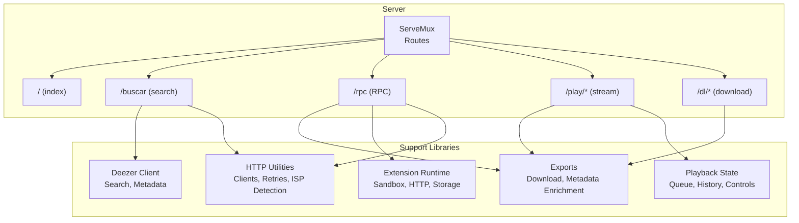
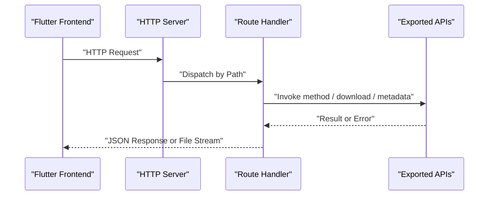
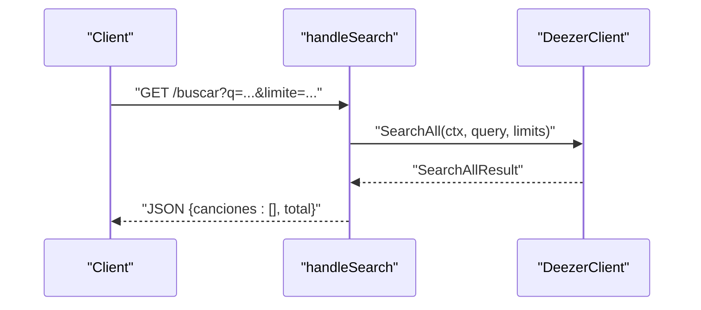
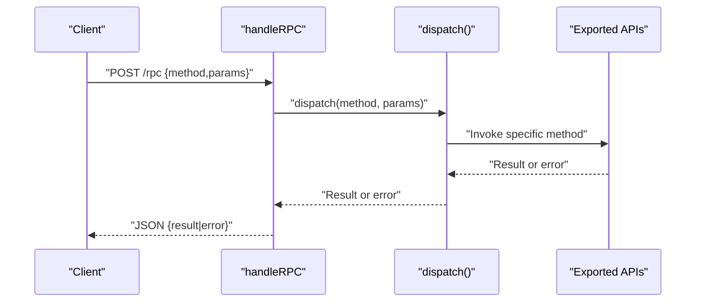
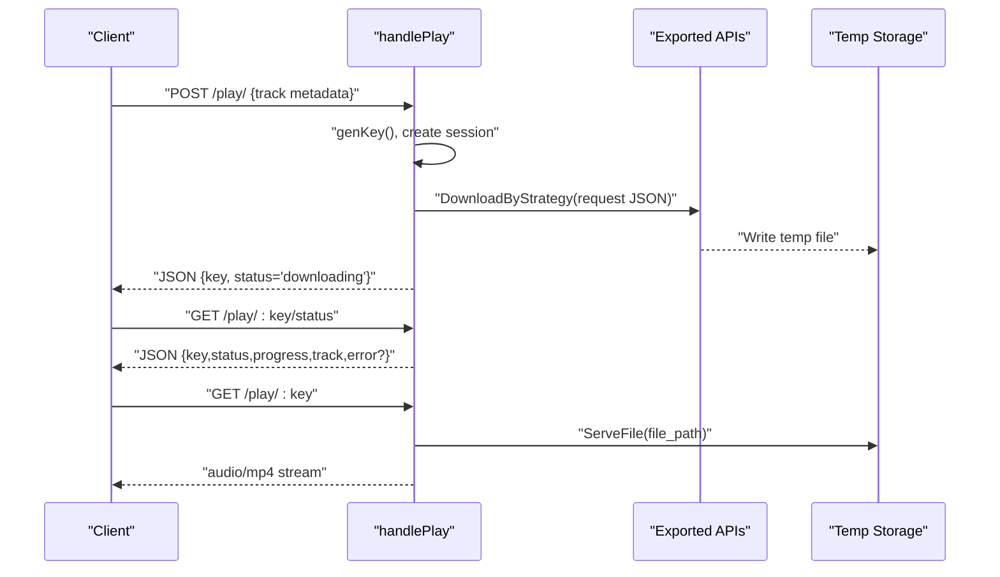
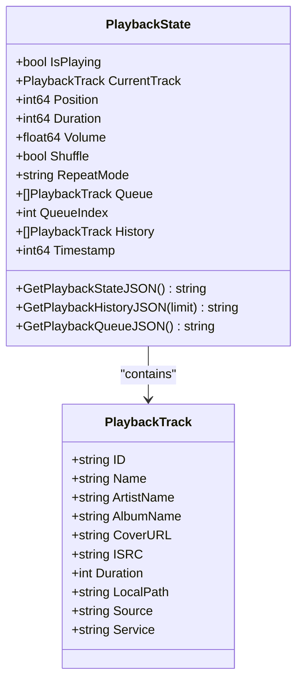
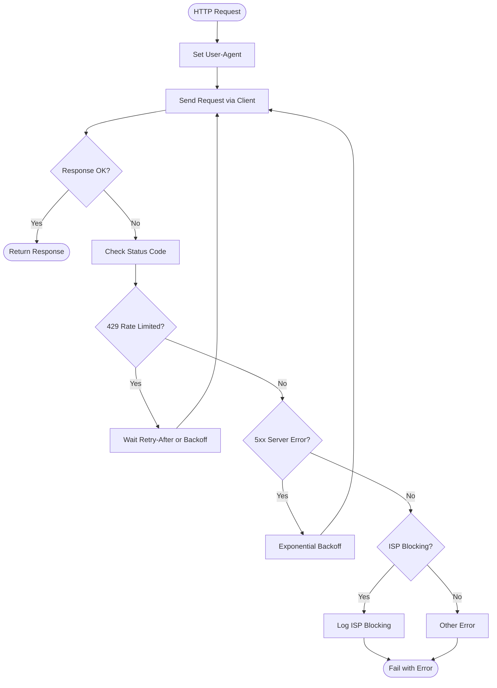
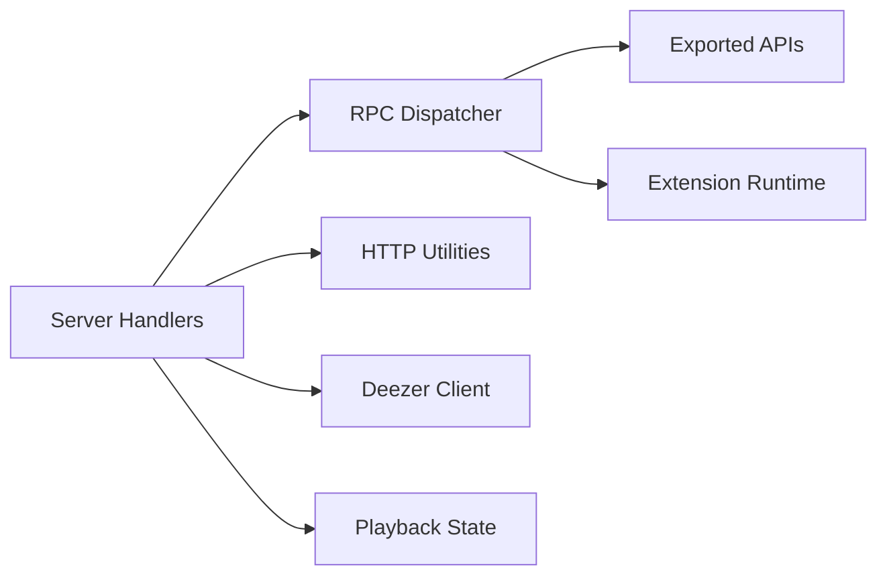

# Server Architecture

<cite>
**Referenced Files in This Document**
- [main.go](file://go_backend_spotiflac/cmd/server/main.go)
- [httputil.go](file://go_backend_spotiflac/httputil.go)
- [playback.go](file://go_backend_spotiflac/playback.go)
- [exports.go](file://go_backend_spotiflac/exports.go)
- [deezer.go](file://go_backend_spotiflac/deezer.go)
- [extension_runtime.go](file://go_backend_spotiflac/extension_runtime.go)
- [go.mod](file://go_backend_spotiflac/go.mod)
</cite>

## Table of Contents
1. [Introduction](#introduction)
2. [Project Structure](#project-structure)
3. [Core Components](#core-components)
4. [Architecture Overview](#architecture-overview)
5. [Detailed Component Analysis](#detailed-component-analysis)
6. [Dependency Analysis](#dependency-analysis)
7. [Performance Considerations](#performance-considerations)
8. [Troubleshooting Guide](#troubleshooting-guide)
9. [Conclusion](#conclusion)

## Introduction
This document describes the Go backend server architecture for the SpotiFLAC project, focusing on the HTTP server implementation and request routing. It explains server initialization, port configuration, middleware-free design, and the HTTP endpoint handlers for search (/buscar), remote procedure calls (/rpc), streaming (/play), and download (/dl). It also covers request/response handling patterns, JSON serialization/deserialization, error handling strategies, concurrency and session management, and temporary file handling. Practical examples illustrate typical server operations and integration patterns with a Flutter frontend.

## Project Structure
The server is implemented as a single Go binary under cmd/server. It registers routes with net/http ServeMux and delegates to handler functions. Supporting libraries provide HTTP clients, playback state, and exportable APIs consumed by the server handlers.

**Diagram sources**
- [main.go:124-134](file://go_backend_spotiflac/cmd/server/main.go#L124-L134)
- [httputil.go:100-130](file://go_backend_spotiflac/httputil.go#L100-L130)
- [deezer.go:56-68](file://go_backend_spotiflac/deezer.go#L56-L68)
- [playback.go:56-71](file://go_backend_spotiflac/playback.go#L56-L71)
- [exports.go:18-31](file://go_backend_spotiflac/exports.go#L18-L31)
- [extension_runtime.go:130-147](file://go_backend_spotiflac/extension_runtime.go#L130-L147)

**Section sources**
- [main.go:107-134](file://go_backend_spotiflac/cmd/server/main.go#L107-L134)
- [go.mod:1-39](file://go_backend_spotiflac/go.mod#L1-L39)

## Core Components
- HTTP server and router: Initializes net/http server with a ServeMux and registers routes for index, search, RPC, stream, and download.
- Session management: In-memory map keyed by a generated session key for streaming requests, with read/write locks for thread safety.
- Temporary file handling: Uses OS temp directory to stage downloads and exposes a ready folder for serving.
- HTTP utilities: Shared and metadata clients with timeouts, connection pooling, retry logic, and ISP blocking detection.
- Playback state: Centralized playback state with queue, history, and controls, exposed via JSON.
- Exported APIs: A large RPC-like dispatcher exposing methods for availability checks, downloads, metadata enrichment, extension management, playback controls, and more.

**Section sources**
- [main.go:24-49](file://go_backend_spotiflac/cmd/server/main.go#L24-L49)
- [main.go:136-286](file://go_backend_spotiflac/cmd/server/main.go#L136-L286)
- [httputil.go:64-130](file://go_backend_spotiflac/httputil.go#L64-L130)
- [playback.go:10-71](file://go_backend_spotiflac/playback.go#L10-L71)
- [exports.go:18-31](file://go_backend_spotiflac/exports.go#L18-L31)

## Architecture Overview
The server runs a local HTTP listener bound to 127.0.0.1 with a configurable port. Handlers implement JSON-based request/response contracts and delegate to exported APIs or internal subsystems. There is no explicit middleware; CORS and content-type headers are set per-handler. Streaming relies on an in-memory session map and temporary files moved to a “ready” directory upon completion.

**Diagram sources**
- [main.go:124-134](file://go_backend_spotiflac/cmd/server/main.go#L124-L134)
- [main.go:297-347](file://go_backend_spotiflac/cmd/server/main.go#L297-L347)
- [main.go:359-385](file://go_backend_spotiflac/cmd/server/main.go#L359-L385)
- [main.go:136-286](file://go_backend_spotiflac/cmd/server/main.go#L136-L286)
- [exports.go:18-31](file://go_backend_spotiflac/exports.go#L18-L31)

## Detailed Component Analysis

### HTTP Server Initialization and Routing
- Port configuration: Reads PORT environment variable; defaults to 55009 if unset. Binds to 127.0.0.1.
- Routes registered:
  - GET / → returns service metadata as JSON
  - GET /buscar?q=...&limite=N → search endpoint
  - POST /rpc → RPC endpoint
  - POST /play/ → starts a streaming session; GET /play/:key/status → session status; GET /play/:key → serve audio
  - GET /dl/:key → download previously prepared file
- No middleware is configured; handlers set Content-Type and status codes directly.

**Section sources**
- [main.go:107-134](file://go_backend_spotiflac/cmd/server/main.go#L107-L134)
- [main.go:124-129](file://go_backend_spotiflac/cmd/server/main.go#L124-L129)
- [main.go:288-295](file://go_backend_spotiflac/cmd/server/main.go#L288-L295)

### Index Endpoint (/)
- Returns a JSON object containing service name, version, and status.

**Section sources**
- [main.go:288-295](file://go_backend_spotiflac/cmd/server/main.go#L288-L295)

### Search Endpoint (/buscar)
- Accepts query string parameter q and optional limite (default 10, capped at 50).
- Calls a Deezer client to search across tracks, artists, albums, and playlists.
- Returns a JSON object with songs array and total count.

**Diagram sources**
- [main.go:297-347](file://go_backend_spotiflac/cmd/server/main.go#L297-L347)
- [deezer.go:304-540](file://go_backend_spotiflac/deezer.go#L304-L540)

**Section sources**
- [main.go:297-347](file://go_backend_spotiflac/cmd/server/main.go#L297-L347)
- [deezer.go:56-68](file://go_backend_spotiflac/deezer.go#L56-L68)

### RPC Endpoint (/rpc)
- Expects a JSON body with method and params.
- Reads and decodes the request body.
- Dispatches to a large switch of methods implemented in exported APIs.
- Returns a JSON response with either result or error.

**Diagram sources**
- [main.go:359-385](file://go_backend_spotiflac/cmd/server/main.go#L359-L385)
- [main.go:555-1454](file://go_backend_spotiflac/cmd/server/main.go#L555-L1454)
- [exports.go:18-31](file://go_backend_spotiflac/exports.go#L18-L31)

**Section sources**
- [main.go:359-385](file://go_backend_spotiflac/cmd/server/main.go#L359-L385)
- [main.go:555-1454](file://go_backend_spotiflac/cmd/server/main.go#L555-L1454)

### Streaming Endpoint (/play)
- POST /play/ creates a new session:
  - Generates a random key.
  - Starts a background goroutine to download and convert the track using exported APIs.
  - Responds immediately with JSON {key,status}.
- GET /play/:key/status returns session status, progress, track, and optional error.
- GET /play/:key serves the audio file when status is “ready”.

**Diagram sources**
- [main.go:136-270](file://go_backend_spotiflac/cmd/server/main.go#L136-L270)
- [main.go:272-286](file://go_backend_spotiflac/cmd/server/main.go#L272-L286)
- [exports.go:18-31](file://go_backend_spotiflac/exports.go#L18-L31)

**Section sources**
- [main.go:136-270](file://go_backend_spotiflac/cmd/server/main.go#L136-L270)
- [main.go:272-286](file://go_backend_spotiflac/cmd/server/main.go#L272-L286)

### Download Endpoint (/dl)
- GET /dl/:key serves a previously prepared file from the “ready” directory.
- Validates existence and responds with octet-stream content type.

**Section sources**
- [main.go:272-286](file://go_backend_spotiflac/cmd/server/main.go#L272-L286)

### Playback State Management
- Central playback state with mutex protection.
- Methods to update state (play, pause, resume, seek, set queue, etc.) and expose JSON snapshots.
- Used by streaming handlers to manage playback lifecycle.

**Diagram sources**
- [playback.go:10-71](file://go_backend_spotiflac/playback.go#L10-L71)
- [playback.go:27-40](file://go_backend_spotiflac/playback.go#L27-L40)

**Section sources**
- [playback.go:56-71](file://go_backend_spotiflac/playback.go#L56-L71)
- [playback.go:378-443](file://go_backend_spotiflac/playback.go#L378-L443)

### HTTP Utilities and Networking
- Shared and metadata HTTP clients with connection pooling, timeouts, and compression disabled.
- Retry logic with exponential backoff and rate-limit handling.
- ISP blocking detection and logging for diagnostics.
- Network compatibility options to allow HTTP fallback and insecure TLS.

**Diagram sources**
- [httputil.go:265-345](file://go_backend_spotiflac/httputil.go#L265-L345)
- [httputil.go:524-535](file://go_backend_spotiflac/httputil.go#L524-L535)

**Section sources**
- [httputil.go:64-130](file://go_backend_spotiflac/httputil.go#L64-L130)
- [httputil.go:265-345](file://go_backend_spotiflac/httputil.go#L265-L345)
- [httputil.go:524-535](file://go_backend_spotiflac/httputil.go#L524-L535)

### Extension Runtime and Sandbox
- Provides a sandboxed JavaScript runtime for extensions with HTTP client, storage, credentials, and file operations.
- Enforces HTTPS-only redirects and restricts private IP access.
- Integrates with the RPC dispatcher for extension actions.

**Section sources**
- [extension_runtime.go:130-147](file://go_backend_spotiflac/extension_runtime.go#L130-L147)
- [extension_runtime.go:250-286](file://go_backend_spotiflac/extension_runtime.go#L250-L286)

## Dependency Analysis
The server depends on exported APIs for core functionality and uses HTTP utilities for networking. The RPC dispatcher routes to various subsystems including Deezer client, playback state, and extension runtime.

**Diagram sources**
- [main.go:124-134](file://go_backend_spotiflac/cmd/server/main.go#L124-L134)
- [main.go:555-1454](file://go_backend_spotiflac/cmd/server/main.go#L555-L1454)
- [exports.go:18-31](file://go_backend_spotiflac/exports.go#L18-L31)
- [httputil.go:100-130](file://go_backend_spotiflac/httputil.go#L100-L130)
- [deezer.go:56-68](file://go_backend_spotiflac/deezer.go#L56-L68)
- [playback.go:56-71](file://go_backend_spotiflac/playback.go#L56-L71)
- [extension_runtime.go:130-147](file://go_backend_spotiflac/extension_runtime.go#L130-L147)

**Section sources**
- [main.go:124-134](file://go_backend_spotiflac/cmd/server/main.go#L124-L134)
- [main.go:555-1454](file://go_backend_spotiflac/cmd/server/main.go#L555-L1454)
- [exports.go:18-31](file://go_backend_spotiflac/exports.go#L18-L31)
- [httputil.go:100-130](file://go_backend_spotiflac/httputil.go#L100-L130)
- [deezer.go:56-68](file://go_backend_spotiflac/deezer.go#L56-L68)
- [playback.go:56-71](file://go_backend_spotiflac/playback.go#L56-L71)
- [extension_runtime.go:130-147](file://go_backend_spotiflac/extension_runtime.go#L130-L147)

## Performance Considerations
- Concurrency model:
  - Streaming handler spawns a goroutine per session to download and convert media, avoiding blocking the HTTP response.
  - Session map guarded by RWMutex to support concurrent reads/writes.
- Temporary file handling:
  - Uses OS temp directory for staging; completed files are moved to a “ready” subdirectory for efficient serving.
- HTTP client tuning:
  - Shared transports with connection pooling and keep-alive reduce overhead.
  - Compression disabled to avoid CPU overhead for streaming.
- Retry and backoff:
  - Automatic retries with exponential backoff mitigate transient network issues.
- Playback state:
  - Centralized state with mutex ensures safe concurrent updates and fast JSON serialization.

[No sources needed since this section provides general guidance]

## Troubleshooting Guide
- Streaming returns “not ready”:
  - Verify the session key exists and status is “ready”. Poll /play/:key/status until conversion completes.
- Download returns “not found”:
  - Ensure the requested key exists in the “ready” directory and the file path is correct.
- RPC returns method not allowed:
  - Confirm the request method is POST and the body is valid JSON with method and params.
- ISP blocking detected:
  - The HTTP utilities detect and log ISP blocking scenarios. Consider using a VPN or changing DNS.
- FFmpeg not found:
  - On Windows, the server attempts to download FFmpeg automatically. If it fails, install FFmpeg manually.

**Section sources**
- [main.go:236-269](file://go_backend_spotiflac/cmd/server/main.go#L236-L269)
- [main.go:272-286](file://go_backend_spotiflac/cmd/server/main.go#L272-L286)
- [main.go:359-385](file://go_backend_spotiflac/cmd/server/main.go#L359-L385)
- [httputil.go:524-535](file://go_backend_spotiflac/httputil.go#L524-L535)
- [main.go:59-105](file://go_backend_spotiflac/cmd/server/main.go#L59-L105)

## Conclusion
The server architecture is a compact, single-binary HTTP server with straightforward routing and minimal middleware. It leverages exported APIs for search, downloads, metadata enrichment, and playback control, while providing robust HTTP utilities for reliability and diagnostics. Streaming and download endpoints use temporary files and in-memory sessions to deliver responsive user experiences. The RPC dispatcher centralizes functionality and enables extension integration. Together, these components form a cohesive backend suitable for Flutter frontends and scalable extension ecosystems.