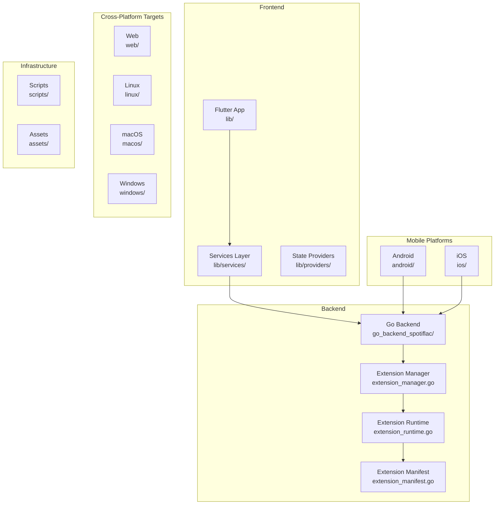
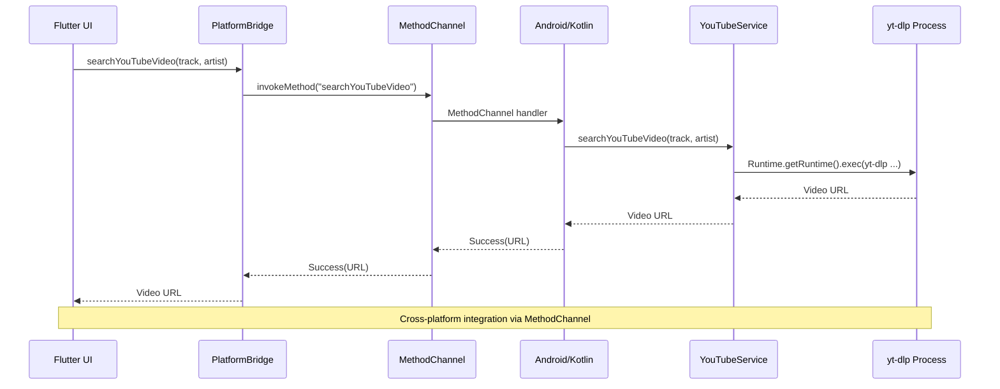
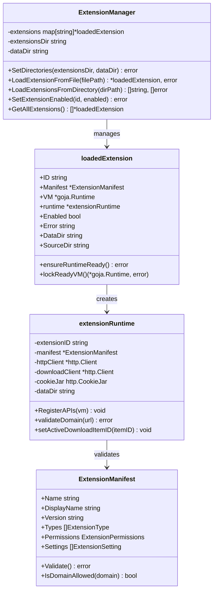
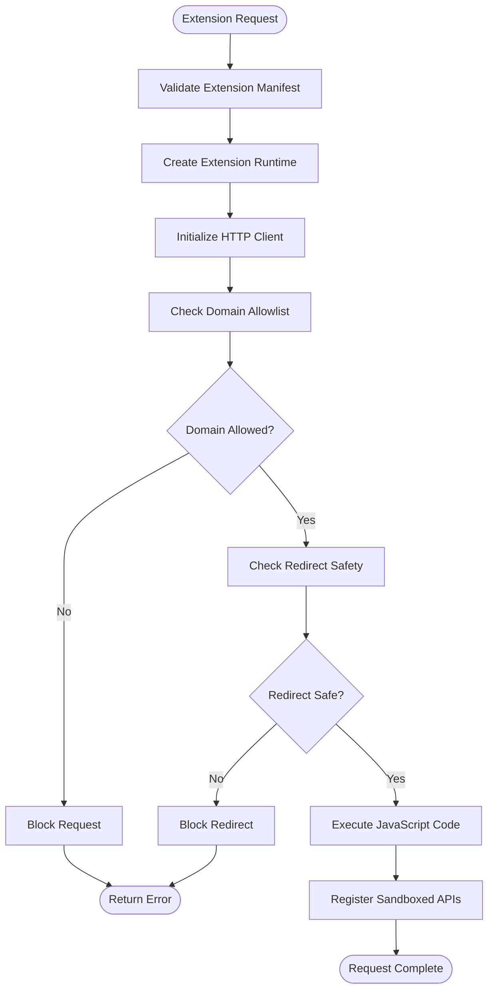
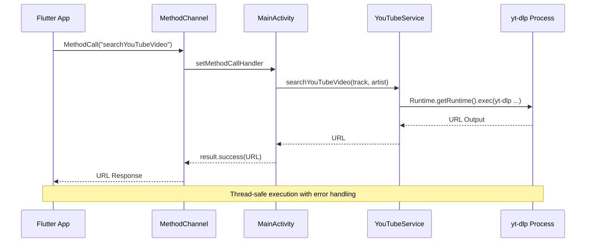
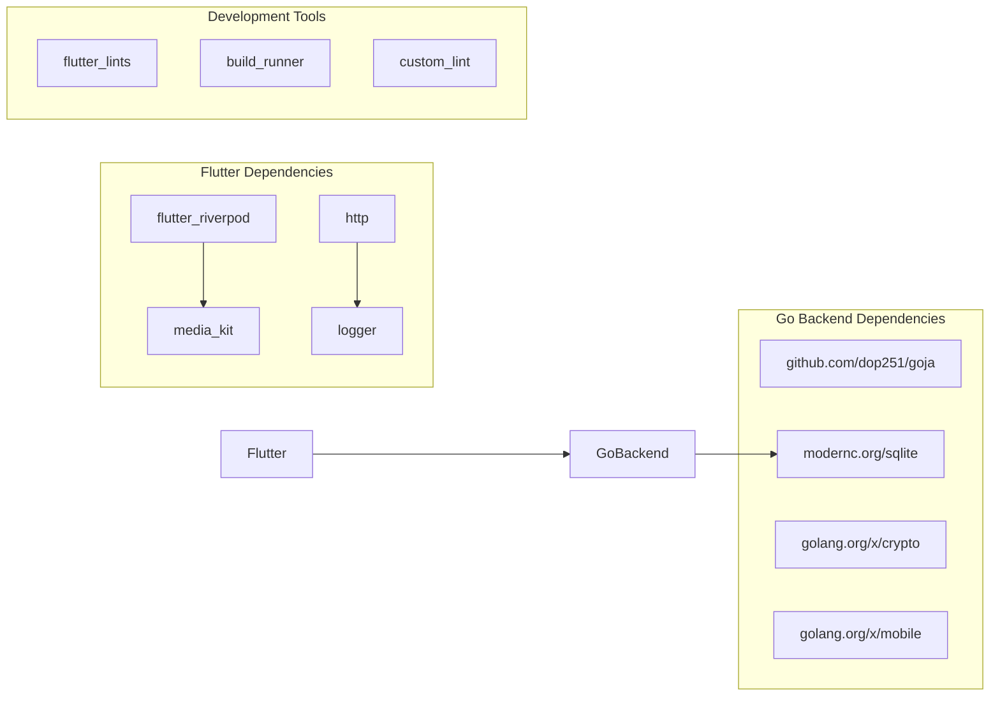

# Contributing Guide

<cite>
**Referenced Files in This Document**
- [README_FINAL.md](file://README_FINAL.md)
- [pubspec.yaml](file://pubspec.yaml)
- [analysis_options.yaml](file://analysis_options.yaml)
- [go.mod](file://go_backend_spotiflac/go.mod)
- [main.dart](file://lib/main.dart)
- [extension_manager.go](file://go_backend_spotiflac/extension_manager.go)
- [extension_runtime.go](file://go_backend_spotiflac/extension_runtime.go)
- [extension_manifest.go](file://go_backend_spotiflac/extension_manifest.go)
- [extension_test.go](file://go_backend_spotiflac/extension_test.go)
- [MainActivity.kt](file://android/app/src/main/kotlin/com/example/bitly/MainActivity.kt)
- [YouTubeService.kt](file://android/app/src/main/kotlin/com/example/bitly/YouTubeService.kt)
- [platform_bridge.dart](file://lib/services/platform_bridge.dart)
- [generate_keys.py](file://scripts/generate_keys.py)
</cite>

## Table of Contents
1. [Introduction](#introduction)
2. [Project Structure](#project-structure)
3. [Core Components](#core-components)
4. [Architecture Overview](#architecture-overview)
5. [Detailed Component Analysis](#detailed-component-analysis)
6. [Dependency Analysis](#dependency-analysis)
7. [Performance Considerations](#performance-considerations)
8. [Troubleshooting Guide](#troubleshooting-guide)
9. [Contribution Workflow](#contribution-workflow)
10. [Testing Requirements](#testing-requirements)
11. [Code Quality Standards](#code-quality-standards)
12. [Documentation Standards](#documentation-standards)
13. [Community Guidelines](#community-guidelines)
14. [Extension Development Guide](#extension-development-guide)
15. [Onboarding Information](#onboarding-information)
16. [Maintainer Responsibilities](#maintainer-responsibilities)
17. [Conclusion](#conclusion)

## Introduction
This contributing guide provides comprehensive development guidelines, code standards, and contribution processes for the Bitly project. It explains the development workflow, coding standards, review procedures, project structure, coding conventions, architectural principles, testing requirements, submission guidelines, code quality expectations, documentation standards, community guidelines, extension development process, plugin submission procedures, and onboarding information for new contributors and maintainer responsibilities.

## Project Structure
Bitly follows a multi-platform architecture with a Flutter frontend and a Go backend. The project is organized into distinct modules:

- Flutter application (lib/)
- Go backend (go_backend_spotiflac/)
- Android integration (android/)
- iOS integration (ios/)
- Web deployment (web/)
- Linux, macOS, and Windows targets (linux/, macos/, windows/)
- Scripts and assets (scripts/, assets/)

**Diagram sources**
- [main.dart:22-44](file://lib/main.dart#L22-L44)
- [extension_manager.go:120-140](file://go_backend_spotiflac/extension_manager.go#L120-L140)
- [extension_runtime.go:84-112](file://go_backend_spotiflac/extension_runtime.go#L84-L112)
- [extension_manifest.go:116-138](file://go_backend_spotiflac/extension_manifest.go#L116-L138)

**Section sources**
- [README_FINAL.md:101-113](file://README_FINAL.md#L101-L113)
- [pubspec.yaml:1-108](file://pubspec.yaml#L1-L108)

## Core Components
The core components of Bitly include:

### Flutter Application Entry Point
The main application initializes platform-specific services and providers, sets up image caching, and manages extension initialization.

### Go Backend Extension System
The Go backend provides a robust extension management system with JavaScript sandboxing, HTTP client isolation, and secure storage mechanisms.

### Android Integration
Android integration handles MethodChannel communication, YouTube video search and download, and SAF (Storage Access Framework) operations.

### Cross-Platform Build System
The project supports multiple platforms with platform-specific configurations and build targets.

**Section sources**
- [main.dart:22-287](file://lib/main.dart#L22-L287)
- [extension_manager.go:120-140](file://go_backend_spotiflac/extension_manager.go#L120-L140)
- [MainActivity.kt:15-133](file://android/app/src/main/kotlin/com/example/bitly/MainActivity.kt#L15-L133)

## Architecture Overview
Bitly employs a layered architecture with clear separation between frontend and backend:

**Diagram sources**
- [platform_bridge.dart:44-53](file://lib/services/platform_bridge.dart#L44-L53)
- [MainActivity.kt:68-78](file://android/app/src/main/kotlin/com/example/bitly/MainActivity.kt#L68-L78)
- [YouTubeService.kt:12-23](file://android/app/src/main/kotlin/com/example/bitly/YouTubeService.kt#L12-L23)

The architecture ensures:
- Clean separation between UI and backend logic
- Platform-specific implementations through MethodChannel
- Secure extension sandboxing with JavaScript runtime isolation
- HTTP client security with domain allowlists and redirect restrictions

**Section sources**
- [README_FINAL.md:114-133](file://README_FINAL.md#L114-L133)
- [extension_runtime.go:250-286](file://go_backend_spotiflac/extension_runtime.go#L250-L286)

## Detailed Component Analysis

### Extension Management System
The extension system provides a comprehensive framework for plugin development and management:

**Diagram sources**
- [extension_manager.go:120-140](file://go_backend_spotiflac/extension_manager.go#L120-L140)
- [extension_manager.go:47-59](file://go_backend_spotiflac/extension_manager.go#L47-L59)
- [extension_runtime.go:84-112](file://go_backend_spotiflac/extension_runtime.go#L84-L112)
- [extension_manifest.go:116-138](file://go_backend_spotiflac/extension_manifest.go#L116-L138)

### Security and Sandboxing Features
The extension runtime implements multiple security layers:

**Diagram sources**
- [extension_runtime.go:250-286](file://go_backend_spotiflac/extension_runtime.go#L250-L286)
- [extension_runtime.go:43-55](file://go_backend_spotiflac/extension_runtime.go#L43-L55)

**Section sources**
- [extension_manager.go:158-294](file://go_backend_spotiflac/extension_manager.go#L158-L294)
- [extension_runtime.go:424-533](file://go_backend_spotiflac/extension_runtime.go#L424-L533)
- [extension_manifest.go:162-242](file://go_backend_spotiflac/extension_manifest.go#L162-L242)

### Android Integration Components
The Android integration provides seamless bridge between Flutter and native Android capabilities:

**Diagram sources**
- [MainActivity.kt:26-145](file://android/app/src/main/kotlin/com/example/bitly/MainActivity.kt#L26-L145)
- [YouTubeService.kt:54-90](file://android/app/src/main/kotlin/com/example/bitly/YouTubeService.kt#L54-L90)

**Section sources**
- [MainActivity.kt:147-173](file://android/app/src/main/kotlin/com/example/bitly/MainActivity.kt#L147-L173)
- [YouTubeService.kt:10-92](file://android/app/src/main/kotlin/com/example/bitly/YouTubeService.kt#L10-L92)

## Dependency Analysis
The project maintains clear dependency boundaries and follows modern development practices:

**Diagram sources**
- [pubspec.yaml:9-82](file://pubspec.yaml#L9-L82)
- [go.mod:7-18](file://go_backend_spotiflac/go.mod#L7-L18)

**Section sources**
- [pubspec.yaml:1-108](file://pubspec.yaml#L1-L108)
- [go.mod:1-39](file://go_backend_spotiflac/go.mod#L1-L39)

## Performance Considerations
The project implements several performance optimization strategies:

- **Lazy Initialization**: Extensions are initialized on-demand with proper lifecycle management
- **Caching Mechanisms**: Persistent and in-memory caches for metadata and availability checks
- **Background Processing**: Non-blocking operations using thread pools and asynchronous execution
- **Resource Management**: Proper cleanup and resource deallocation in extension runtime
- **Platform Optimization**: Platform-specific optimizations for Android and desktop environments

## Troubleshooting Guide
Common issues and their solutions:

### Extension Loading Issues
- Verify extension manifest validity using the validation API
- Check extension permissions and domain allowlists
- Review extension error logs for specific failure reasons

### Android Integration Problems
- Ensure yt-dlp is properly installed and accessible
- Verify MethodChannel communication is established
- Check Android permissions for storage access

### Build and Compilation Issues
- Confirm Go version compatibility (1.25+)
- Verify platform-specific dependencies are installed
- Check cross-compilation settings for target platforms

**Section sources**
- [extension_test.go:14-47](file://go_backend_spotiflac/extension_test.go#L14-L47)
- [extension_test.go:118-156](file://go_backend_spotiflac/extension_test.go#L118-L156)

## Contribution Workflow
Follow these steps to contribute to Bitly:

### 1. Fork and Clone the Repository
1. Fork the repository on GitHub
2. Clone your fork locally
3. Create a feature branch for your changes

### 2. Development Environment Setup
1. Install required dependencies:
   - Flutter SDK (^3.10.0)
   - Go 1.25+
   - Android Studio (for Android development)
   - Platform-specific tools for target platforms

2. Configure development tools:
   - Install Flutter plugins
   - Set up IDE with Dart and Go support
   - Configure linters and formatters

### 3. Code Changes
1. Follow existing code patterns and conventions
2. Write comprehensive tests for new functionality
3. Update documentation for significant changes
4. Ensure code passes all linting and formatting checks

### 4. Testing Requirements
1. Unit tests for Go backend components
2. Integration tests for Flutter components
3. Platform-specific tests for Android/iOS
4. Performance regression tests

### 5. Submission Process
1. Push changes to your feature branch
2. Create a pull request with detailed description
3. Address reviewer feedback promptly
4. Ensure all CI checks pass

## Testing Requirements
The project maintains high testing standards:

### Go Backend Testing
- Comprehensive unit tests for extension management
- Integration tests for HTTP client behavior
- Security tests for sandbox validation
- Performance tests for concurrent operations

### Flutter Frontend Testing
- Widget tests for UI components
- Integration tests for platform bridges
- State management tests for providers
- Platform-specific tests for Android/iOS

### Test Coverage Requirements
- Minimum 80% code coverage for new features
- Critical paths must have dedicated tests
- Security-sensitive code requires additional scrutiny

**Section sources**
- [extension_test.go:14-503](file://go_backend_spotiflac/extension_test.go#L14-L503)

## Code Quality Standards
Maintain these quality standards:

### Dart/Flutter Coding Standards
- Follow Flutter best practices and naming conventions
- Use Riverpod for state management
- Implement proper error handling and logging
- Write clear, descriptive comments

### Go Backend Standards
- Use idiomatic Go with proper error handling
- Implement proper concurrency patterns
- Follow Go module best practices
- Write comprehensive documentation

### Code Review Guidelines
- All changes require at least one review
- Focus on correctness, performance, and maintainability
- Ensure backward compatibility
- Verify security implications

**Section sources**
- [analysis_options.yaml:8-33](file://analysis_options.yaml#L8-L33)
- [pubspec.yaml:72-82](file://pubspec.yaml#L72-L82)

## Documentation Standards
Maintain comprehensive documentation:

### Code Documentation
- Document all public APIs with clear descriptions
- Include parameter and return value documentation
- Add usage examples where appropriate
- Keep documentation synchronized with code changes

### Project Documentation
- Update README files for significant changes
- Maintain changelog entries
- Document breaking changes clearly
- Provide migration guides when necessary

### Technical Documentation
- Architecture diagrams for major components
- API specification documents
- Deployment and build instructions
- Troubleshooting guides

## Community Guidelines
Foster a welcoming and inclusive community:

### Communication Standards
- Be respectful and professional in all interactions
- Provide constructive feedback during reviews
- Help new contributors get started
- Celebrate successful contributions

### Inclusive Environment
- Welcome diverse perspectives and experiences
- Avoid discriminatory language or behavior
- Provide equal opportunities for participation
- Address conflicts constructively

### Contribution Recognition
- Acknowledge contributors fairly
- Provide mentorship opportunities
- Recognize both code and non-code contributions
- Maintain transparent decision-making processes

## Extension Development Guide
Create extensions following these guidelines:

### Extension Structure
1. Create a manifest.json file with required metadata
2. Implement index.js with extension logic
3. Package files in .spotiflac-ext format
4. Test extension functionality thoroughly

### Manifest Requirements
- Define extension type (metadata_provider, download_provider, lyrics_provider)
- Specify permissions and capabilities
- Include version information and compatibility
- Document settings and configuration options

### Development Best Practices
- Implement proper error handling
- Use extension APIs safely and securely
- Follow performance optimization guidelines
- Test across supported platforms

### Submission Process
1. Test extension in development environment
2. Document usage and configuration
3. Provide installation instructions
4. Include contact information for support

**Section sources**
- [extension_manifest.go:116-138](file://go_backend_spotiflac/extension_manifest.go#L116-L138)
- [extension_manager.go:158-294](file://go_backend_spotiflac/extension_manager.go#L158-L294)

## Onboarding Information
New contributor onboarding process:

### Getting Started
1. Review project documentation and architecture
2. Set up development environment
3. Run basic tests to verify setup
4. Explore codebase structure and patterns

### First Contributions
1. Start with small, focused issues
2. Follow established coding patterns
3. Write tests for new functionality
4. Submit clear, well-documented pull requests

### Learning Resources
- Study existing extension examples
- Review testing patterns and approaches
- Understand platform integration points
- Learn from code review feedback

### Mentorship Opportunities
- Experienced contributors provide guidance
- Regular code review sessions
- Pair programming opportunities
- Knowledge sharing sessions

## Maintainer Responsibilities
Maintainers ensure project quality and direction:

### Code Quality
- Review pull requests thoroughly
- Enforce coding standards consistently
- Provide constructive feedback
- Ensure test coverage requirements

### Community Management
- Respond to issues and questions promptly
- Facilitate discussions and decisions
- Mentor new contributors
- Maintain inclusive environment

### Technical Oversight
- Approve major architectural changes
- Monitor performance and stability
- Ensure security best practices
- Guide long-term project direction

### Release Management
- Coordinate release cycles
- Manage versioning and tagging
- Communicate changes to users
- Handle post-release issues

## Conclusion
This contributing guide establishes the foundation for collaborative development in the Bitly project. By following these guidelines, contributors can effectively participate in building a high-quality, secure, and maintainable application. The clear separation between frontend and backend, comprehensive testing requirements, and strong community guidelines ensure sustainable growth and development of the project.