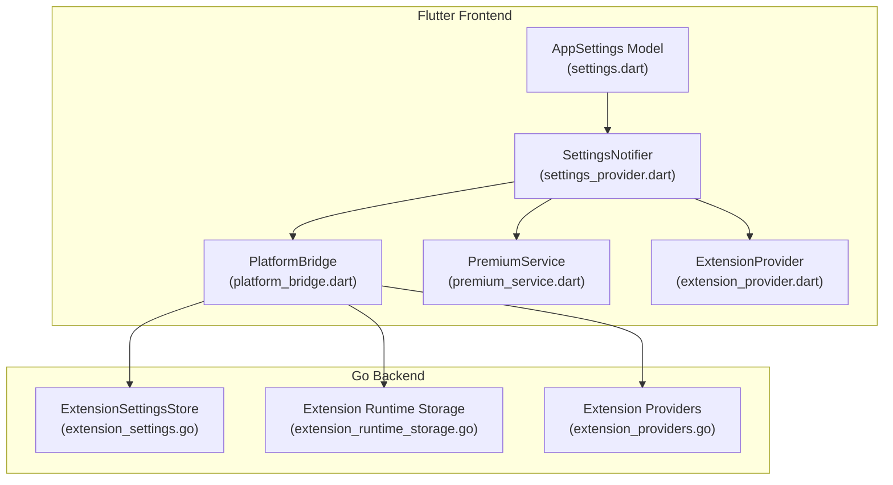
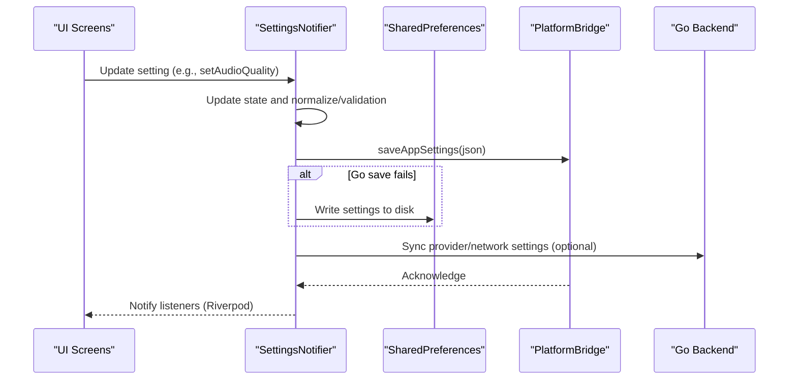
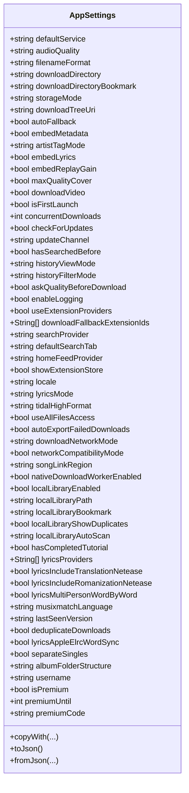
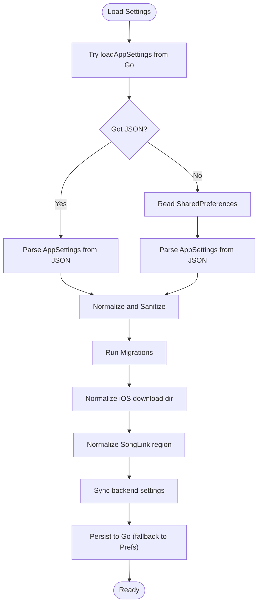
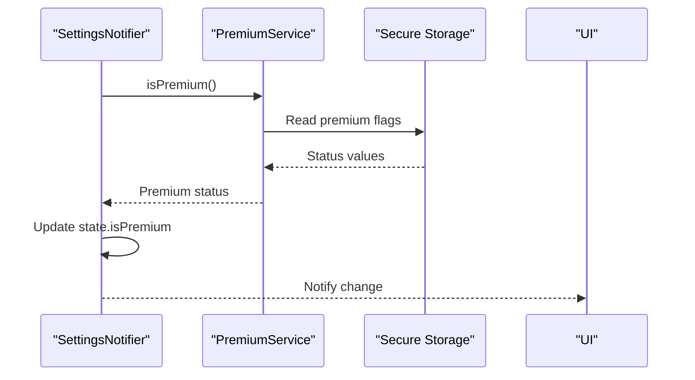
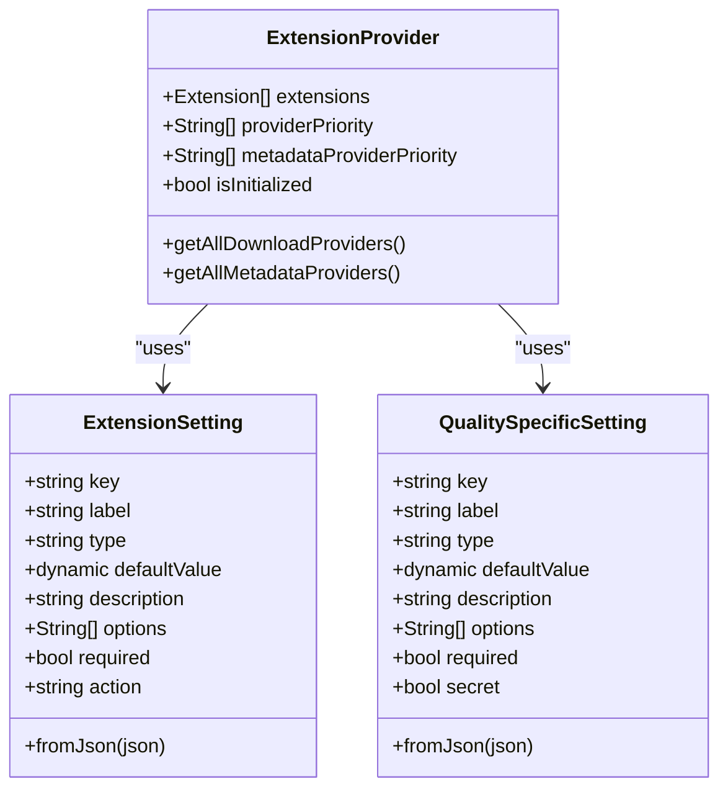
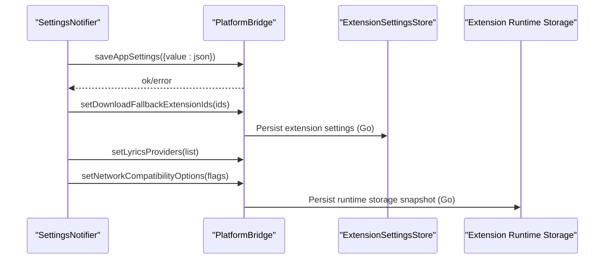
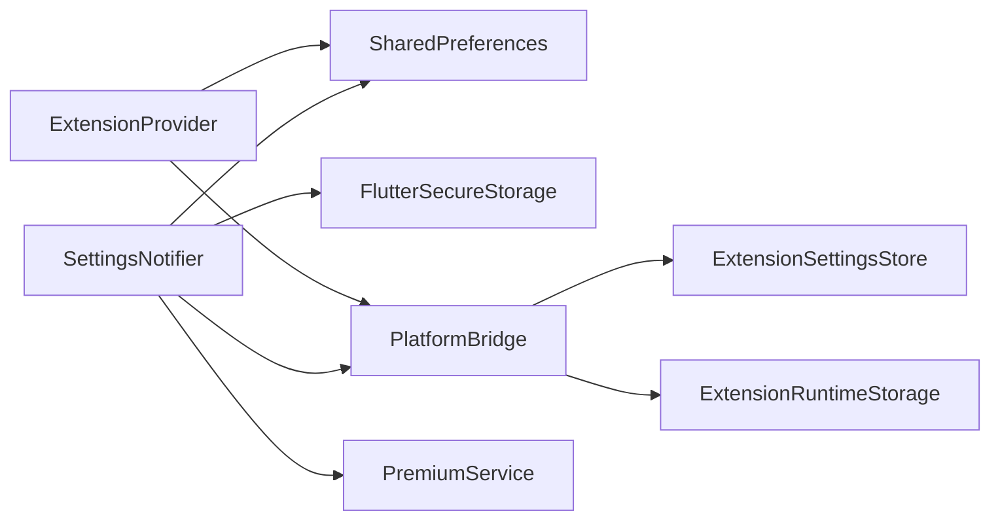

# Configuration Management

<cite>
**Referenced Files in This Document**
- [settings.dart](file://lib/models/settings.dart)
- [settings.g.dart](file://lib/models/settings.g.dart)
- [settings_provider.dart](file://lib/providers/settings_provider.dart)
- [extension_provider.dart](file://lib/providers/extension_provider.dart)
- [extension_detail_page.dart](file://lib/screens/settings/extension_detail_page.dart)
- [download_settings_page.dart](file://lib/screens/settings/download_settings_page.dart)
- [platform_bridge.dart](file://lib/services/platform_bridge.dart)
- [premium_service.dart](file://lib/services/premium_service.dart)
- [extension_settings.go](file://go_backend_spotiflac/extension_settings.go)
- [extension_runtime_storage.go](file://go_backend_spotiflac/extension_runtime_storage.go)
- [extension_providers.go](file://go_backend_spotiflac/extension_providers.go)
- [extension_manifest.go](file://go_backend_spotiflac/extension_manifest.go)
- [premium_keys.dart](file://premium_keys.dart)
</cite>

## Table of Contents
1. [Introduction](#introduction)
2. [Project Structure](#project-structure)
3. [Core Components](#core-components)
4. [Architecture Overview](#architecture-overview)
5. [Detailed Component Analysis](#detailed-component-analysis)
6. [Dependency Analysis](#dependency-analysis)
7. [Performance Considerations](#performance-considerations)
8. [Troubleshooting Guide](#troubleshooting-guide)
9. [Conclusion](#conclusion)

## Introduction
This document explains the configuration management system centered around the AppSettings model and the settings persistence layer. It covers:
- Settings architecture and the AppSettings model
- Reactive state management via Riverpod’s NotifierProvider
- Settings persistence across Flutter and the Go backend
- Validation, normalization, and migrations
- Premium settings and secure storage
- Extension provider settings and synchronization
- Practical examples for initialization, validation, persistence, and cross-platform differences

## Project Structure
The configuration system spans Dart (Flutter) and Go:
- Dart models and providers define the settings contract and state management
- PlatformBridge bridges Flutter and the Go backend
- Go backend manages extension settings and runtime storage

**Diagram sources**
- [settings.dart:6-317](file://lib/models/settings.dart#L6-L317)
- [settings_provider.dart:27-675](file://lib/providers/settings_provider.dart#L27-L675)
- [platform_bridge.dart:37-800](file://lib/services/platform_bridge.dart#L37-L800)
- [premium_service.dart:6-92](file://lib/services/premium_service.dart#L6-L92)
- [extension_provider.dart:1-200](file://lib/providers/extension_provider.dart#L1-L200)
- [extension_settings.go:11-197](file://go_backend_spotiflac/extension_settings.go#L11-L197)
- [extension_runtime_storage.go:72-130](file://go_backend_spotiflac/extension_runtime_storage.go#L72-L130)
- [extension_providers.go:1841-1892](file://go_backend_spotiflac/extension_providers.go#L1841-L1892)

**Section sources**
- [settings.dart:6-317](file://lib/models/settings.dart#L6-L317)
- [settings_provider.dart:27-675](file://lib/providers/settings_provider.dart#L27-L675)
- [platform_bridge.dart:37-800](file://lib/services/platform_bridge.dart#L37-L800)
- [extension_provider.dart:1-200](file://lib/providers/extension_provider.dart#L1-L200)

## Core Components
- AppSettings: Immutable settings model with default values and a comprehensive set of preferences for download behavior, metadata, lyrics, local library, premium, and extension-related options.
- SettingsNotifier: Riverpod Notifier that loads, validates, normalizes, migrates, and persists settings. It also synchronizes specific settings to the Go backend.
- PlatformBridge: Channel-based bridge to the Go backend for saving/loading settings and syncing provider/network options.
- PremiumService: Secure storage for premium state and code, plus auto-validation and restoration.
- ExtensionProvider: Manages extension discovery, priorities, and per-extension settings.
- Go ExtensionSettingsStore: Persistent JSON-backed store for extension settings.

**Section sources**
- [settings.dart:6-317](file://lib/models/settings.dart#L6-L317)
- [settings_provider.dart:27-675](file://lib/providers/settings_provider.dart#L27-L675)
- [platform_bridge.dart:37-800](file://lib/services/platform_bridge.dart#L37-L800)
- [premium_service.dart:6-92](file://lib/services/premium_service.dart#L6-L92)
- [extension_provider.dart:1-200](file://lib/providers/extension_provider.dart#L1-L200)
- [extension_settings.go:11-197](file://go_backend_spotiflac/extension_settings.go#L11-L197)

## Architecture Overview
The settings lifecycle integrates Flutter state, persistence, and the Go backend:

**Diagram sources**
- [settings_provider.dart:219-249](file://lib/providers/settings_provider.dart#L219-L249)
- [platform_bridge.dart:44-53](file://lib/services/platform_bridge.dart#L44-L53)

## Detailed Component Analysis

### AppSettings Model
- Defines all user preferences, defaults, and optional extension-related fields.
- Uses code-generated serialization/deserialization for robust parsing and JSON shape enforcement.
- Provides a rich set of toggles and lists (e.g., lyrics providers, fallback extension IDs).

**Diagram sources**
- [settings.dart:6-317](file://lib/models/settings.dart#L6-L317)
- [settings.g.dart:83-112](file://lib/models/settings.g.dart#L83-L112)

**Section sources**
- [settings.dart:6-317](file://lib/models/settings.dart#L6-L317)
- [settings.g.dart:83-112](file://lib/models/settings.g.dart#L83-L112)

### Settings Persistence and Synchronization
- Initialization: Attempts to load settings from the Go backend first; falls back to SharedPreferences if unavailable.
- Validation and normalization: Ensures JSON shape, sanitizes lists, normalizes regions and tabs, and cleans up legacy values.
- Migrations: Runs once per app version to update defaults and reconcile retired built-in providers.
- Persistence: Writes to the Go backend via PlatformBridge; on failure, writes to SharedPreferences. Debounces concurrent writes.
- Backend sync: Synchronizes lyrics providers/options, network compatibility, and extension fallback IDs to the Go backend.

**Diagram sources**
- [settings_provider.dart:51-127](file://lib/providers/settings_provider.dart#L51-L127)
- [settings_provider.dart:187-217](file://lib/providers/settings_provider.dart#L187-L217)
- [settings_provider.dart:251-291](file://lib/providers/settings_provider.dart#L251-L291)
- [settings_provider.dart:219-249](file://lib/providers/settings_provider.dart#L219-L249)

**Section sources**
- [settings_provider.dart:51-127](file://lib/providers/settings_provider.dart#L51-L127)
- [settings_provider.dart:187-217](file://lib/providers/settings_provider.dart#L187-L217)
- [settings_provider.dart:251-291](file://lib/providers/settings_provider.dart#L251-L291)
- [settings_provider.dart:219-249](file://lib/providers/settings_provider.dart#L219-L249)

### Premium Settings System
- PremiumService stores premium state and code securely and determines current status (premium, free trial, expired).
- SettingsNotifier periodically checks premium validity and updates state accordingly.
- Premium keys are defined separately for cryptographic operations.

**Diagram sources**
- [settings_provider.dart:129-143](file://lib/providers/settings_provider.dart#L129-L143)
- [premium_service.dart:15-32](file://lib/services/premium_service.dart#L15-L32)
- [premium_keys.dart:1-3](file://premium_keys.dart#L1-L3)

**Section sources**
- [settings_provider.dart:129-143](file://lib/providers/settings_provider.dart#L129-L143)
- [premium_service.dart:15-32](file://lib/services/premium_service.dart#L15-L32)
- [premium_keys.dart:1-3](file://premium_keys.dart#L1-L3)

### Extension Provider Settings
- ExtensionSetting and QualitySpecificSetting define per-extension configuration schemas validated by the extension manifest.
- ExtensionProvider manages installed extensions, priorities, and exposes UI pages to configure them.
- SettingsNotifier syncs extension fallback IDs to the Go backend.

**Diagram sources**
- [extension_provider.dart:681-739](file://lib/providers/extension_provider.dart#L681-L739)
- [extension_detail_page.dart:1064-1095](file://lib/screens/settings/extension_detail_page.dart#L1064-L1095)

**Section sources**
- [extension_provider.dart:681-739](file://lib/providers/extension_provider.dart#L681-L739)
- [extension_detail_page.dart:1064-1095](file://lib/screens/settings/extension_detail_page.dart#L1064-L1095)

### Settings Synchronization with Go Backend
- PlatformBridge exposes methods to save/load settings and synchronize provider/network options.
- SettingsNotifier invokes these methods and handles failures gracefully by falling back to SharedPreferences.
- Extension fallback IDs and lyrics/network options are pushed to the Go backend.

**Diagram sources**
- [settings_provider.dart:219-249](file://lib/providers/settings_provider.dart#L219-L249)
- [settings_provider.dart:177-185](file://lib/providers/settings_provider.dart#L177-L185)
- [platform_bridge.dart:659-671](file://lib/services/platform_bridge.dart#L659-L671)
- [extension_settings.go:105-157](file://go_backend_spotiflac/extension_settings.go#L105-L157)
- [extension_runtime_storage.go:97-130](file://go_backend_spotiflac/extension_runtime_storage.go#L97-L130)

**Section sources**
- [settings_provider.dart:219-249](file://lib/providers/settings_provider.dart#L219-L249)
- [settings_provider.dart:177-185](file://lib/providers/settings_provider.dart#L177-L185)
- [platform_bridge.dart:659-671](file://lib/services/platform_bridge.dart#L659-L671)
- [extension_settings.go:105-157](file://go_backend_spotiflac/extension_settings.go#L105-L157)
- [extension_runtime_storage.go:97-130](file://go_backend_spotiflac/extension_runtime_storage.go#L97-L130)

## Dependency Analysis
- SettingsNotifier depends on SharedPreferences, FlutterSecureStorage, PlatformBridge, PremiumService, and logging utilities.
- PlatformBridge depends on MethodChannel/HTTP transport and SharedPreferences for caches.
- ExtensionProvider depends on PlatformBridge and SharedPreferences for priorities and extension manifests.
- Go backend depends on ExtensionSettingsStore and runtime storage for extension settings persistence.

**Diagram sources**
- [settings_provider.dart:37-38](file://lib/providers/settings_provider.dart#L37-L38)
- [platform_bridge.dart:37-800](file://lib/services/platform_bridge.dart#L37-L800)
- [extension_provider.dart:1-12](file://lib/providers/extension_provider.dart#L1-L12)

**Section sources**
- [settings_provider.dart:37-38](file://lib/providers/settings_provider.dart#L37-L38)
- [platform_bridge.dart:37-800](file://lib/services/platform_bridge.dart#L37-L800)
- [extension_provider.dart:1-12](file://lib/providers/extension_provider.dart#L1-L12)

## Performance Considerations
- Debounced writes: SettingsNotifier queues subsequent saves while a write is in progress to avoid contention.
- Background JSON decode: Large payloads are decoded off the main thread when appropriate.
- Lookup caching: PlatformBridge caches metadata and availability results with TTL and persistence.
- Network compatibility: Optional HTTP and relaxed TLS modes are synchronized to the backend to reduce retries and failures.

[No sources needed since this section provides general guidance]

## Troubleshooting Guide
Common issues and remedies:
- Corrupted settings: On parse failure, settings are reset to defaults and the corrupted JSON is backed up.
- Go backend unavailable: Settings save/load fall back to SharedPreferences automatically.
- Premium state drift: A periodic timer re-validates premium status against secure storage.
- iOS path normalization: Download directory is normalized and bookmarks cleared when path changes.
- Legacy provider cleanup: Built-in provider IDs are sanitized to prevent invalid selections.

**Section sources**
- [settings_provider.dart:78-86](file://lib/providers/settings_provider.dart#L78-L86)
- [settings_provider.dart:219-249](file://lib/providers/settings_provider.dart#L219-L249)
- [settings_provider.dart:131-143](file://lib/providers/settings_provider.dart#L131-L143)
- [settings_provider.dart:251-266](file://lib/providers/settings_provider.dart#L251-L266)
- [settings_provider.dart:280-284](file://lib/providers/settings_provider.dart#L280-L284)

## Conclusion
The configuration management system combines a strongly-typed AppSettings model with reactive Riverpod state, robust validation and migrations, and seamless synchronization with a Go backend. It ensures reliability across platforms, supports premium and extension settings, and maintains backward compatibility through careful migrations and normalization.