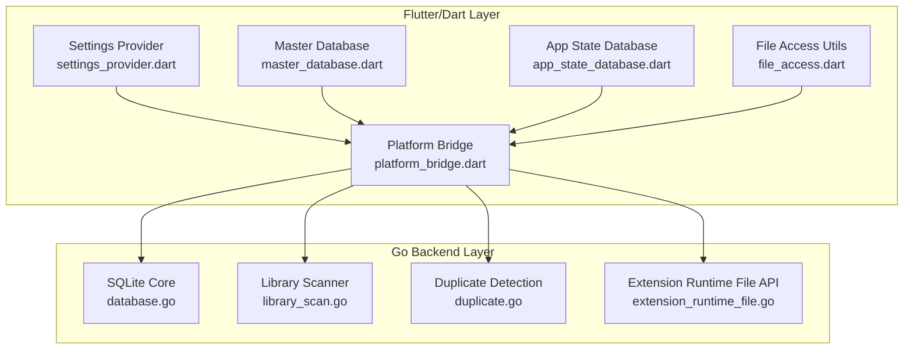
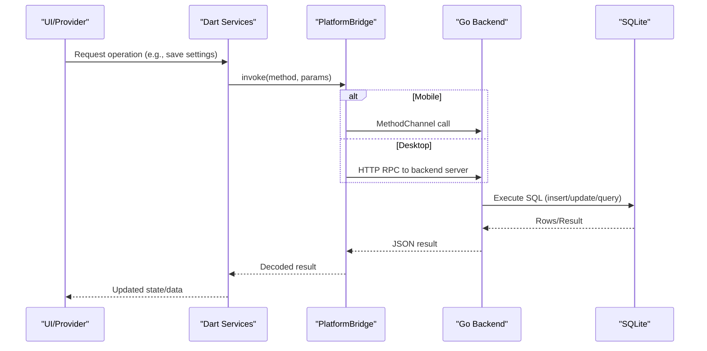
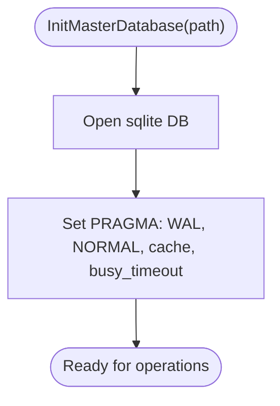
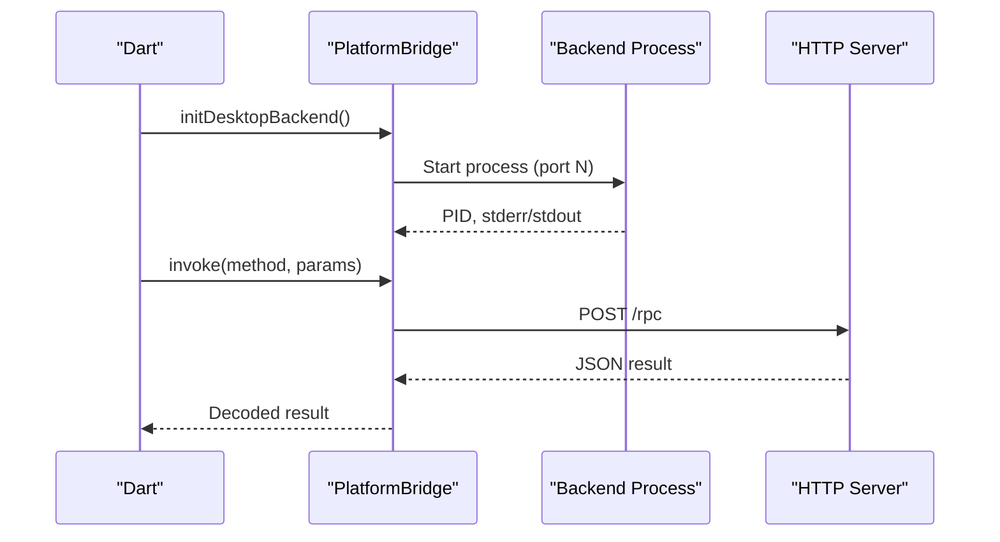
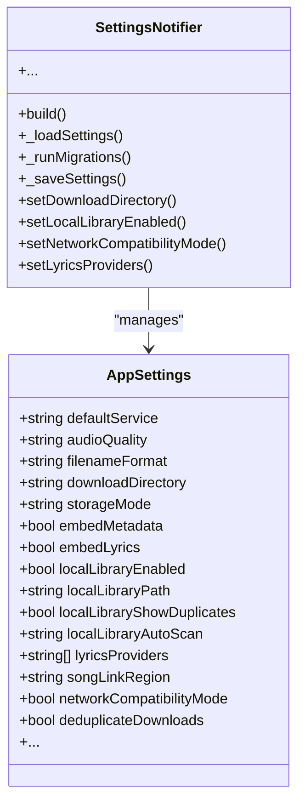
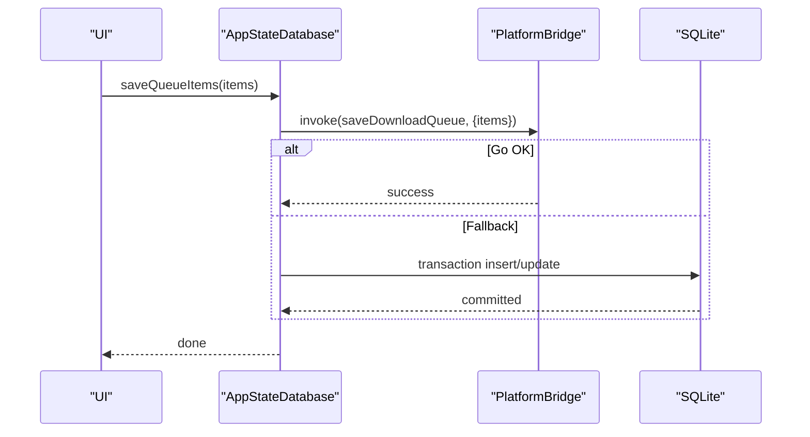
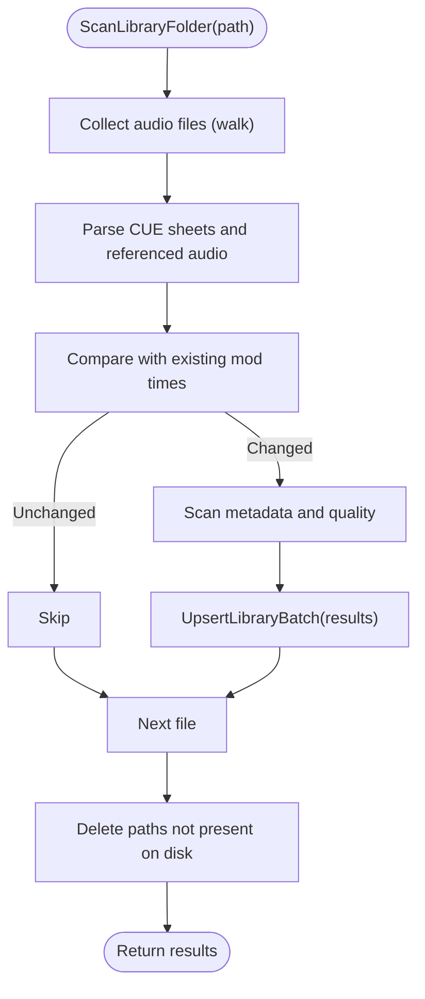
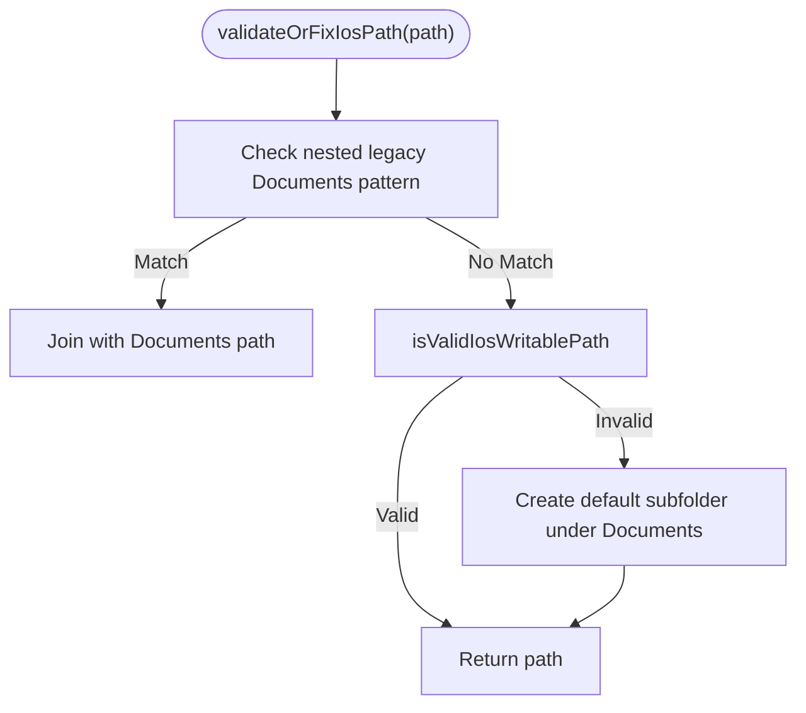
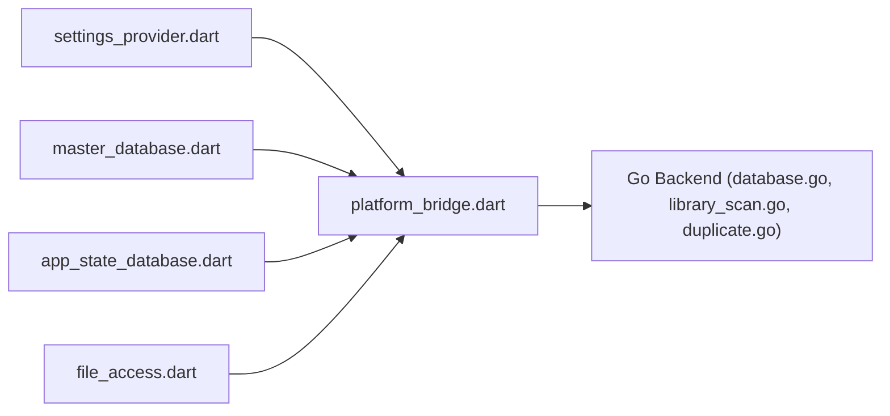

# Data Management

<cite>
**Referenced Files in This Document**
- [main.dart](file://go_backend_spotiflac/cmd/server/main.go)
- [database.go](file://go_backend_spotiflac/database.go)
- [duplicate.go](file://go_backend_spotiflac/duplicate.go)
- [library_scan.go](file://go_backend_spotiflac/library_scan.go)
- [extension_runtime.go](file://go_backend_spotiflac/extension_runtime.go)
- [extension_runtime_file.go](file://go_backend_spotiflac/extension_runtime_file.go)
- [master_database.dart](file://lib/services/master_database.dart)
- [app_state_database.dart](file://lib/services/app_state_database.dart)
- [platform_bridge.dart](file://lib/services/platform_bridge.dart)
- [settings.dart](file://lib/models/settings.dart)
- [settings_provider.dart](file://lib/providers/settings_provider.dart)
- [file_access.dart](file://lib/utils/file_access.dart)
</cite>

## Table of Contents
1. [Introduction](#introduction)
2. [Project Structure](#project-structure)
3. [Core Components](#core-components)
4. [Architecture Overview](#architecture-overview)
5. [Detailed Component Analysis](#detailed-component-analysis)
6. [Dependency Analysis](#dependency-analysis)
7. [Performance Considerations](#performance-considerations)
8. [Troubleshooting Guide](#troubleshooting-guide)
9. [Conclusion](#conclusion)

## Introduction
This document explains the data management subsystems powering the application’s storage, persistence, and cross-platform file handling. It covers:
- SQLite database schema and migrations
- FFI-style integration with a Go backend via a platform bridge
- Settings architecture and configuration persistence
- Local library management and duplicate detection algorithms
- File system operations and SAF (Scoped Storage Access Framework) support
- Practical patterns for database operations, configuration persistence, and data access
- Validation, backup strategies, and performance optimization

## Project Structure
The data management system spans two primary layers:
- Flutter/Dart frontend services and providers managing settings, queues, and UI state
- Go backend providing robust database operations, file scanning, duplicate detection, and extension runtime file APIs

**Diagram sources**
- [settings_provider.dart](file://lib/providers/settings_provider.dart)
- [master_database.dart](file://lib/services/master_database.dart)
- [app_state_database.dart](file://lib/services/app_state_database.dart)
- [platform_bridge.dart](file://lib/services/platform_bridge.dart)
- [file_access.dart](file://lib/utils/file_access.dart)
- [database.go](file://go_backend_spotiflac/database.go)
- [library_scan.go](file://go_backend_spotiflac/library_scan.go)
- [duplicate.go](file://go_backend_spotiflac/duplicate.go)
- [extension_runtime_file.go](file://go_backend_spotiflac/extension_runtime_file.go)

**Section sources**
- [settings_provider.dart](file://lib/providers/settings_provider.dart)
- [master_database.dart](file://lib/services/master_database.dart)
- [app_state_database.dart](file://lib/services/app_state_database.dart)
- [platform_bridge.dart](file://lib/services/platform_bridge.dart)
- [file_access.dart](file://lib/utils/file_access.dart)
- [database.go](file://go_backend_spotiflac/database.go)
- [library_scan.go](file://go_backend_spotiflac/library_scan.go)
- [duplicate.go](file://go_backend_spotiflac/duplicate.go)
- [extension_runtime_file.go](file://go_backend_spotiflac/extension_runtime_file.go)

## Core Components
- Master database: centralized SQLite for metadata, files, collections, favorites, history, counters, unlocks, application state, download queue, recent access, and hidden download IDs.
- Go backend: manages the unified SQLite database, performs library scans, duplicate checks, and exposes file operations via extension runtime.
- Platform bridge: routes Dart calls to the Go backend and handles HTTP/desktop fallbacks.
- Settings provider: persists user preferences to shared preferences and synchronizes backend-specific settings.
- App state database: persists download queue and recent access records, delegating to the Go backend when available.
- File access utilities: validate and operate on iOS paths, SAF URIs, and CUE virtual paths.

**Section sources**
- [master_database.dart](file://lib/services/master_database.dart)
- [database.go](file://go_backend_spotiflac/database.go)
- [platform_bridge.dart](file://lib/services/platform_bridge.dart)
- [settings_provider.dart](file://lib/providers/settings_provider.dart)
- [app_state_database.dart](file://lib/services/app_state_database.dart)
- [file_access.dart](file://lib/utils/file_access.dart)

## Architecture Overview
The system uses a hybrid architecture:
- Dart services define the schema and expose CRUD-like methods
- The Go backend initializes and optimizes the SQLite database and executes heavy operations
- The platform bridge mediates between Dart and Go, with an HTTP fallback for desktop environments
- Settings and app state are persisted locally with graceful fallbacks

**Diagram sources**
- [platform_bridge.dart](file://lib/services/platform_bridge.dart)
- [main.dart](file://go_backend_spotiflac/cmd/server/main.go)
- [database.go](file://go_backend_spotiflac/database.go)

## Detailed Component Analysis

### SQLite Schema and Migrations
The master database defines a unified schema with tables for metadata, files, collections, favorites, play history, application state, and more. Indexes optimize frequent queries. Migrations add columns and ensure backward compatibility.

Key schema highlights:
- metadata: track, artist, album, ISRC, duration, genres, labels, composers, Spotify IDs, cover URLs/paths
- files: file_path uniqueness, format, bit depth, sample rate, bitrate, sizes, timestamps, source markers
- collections and collection_items: hierarchical grouping with foreign keys
- favorites: quick-access items with optional audio/cover paths
- play_history and play_aggregates: listening history and aggregates
- application_state: key/value store for app state
- download_queue: pending downloads with JSON payloads
- recent_access and hidden_download_ids: recency and suppression lists

Migration strategy:
- Versioned upgrades add missing columns and backfill defaults
- Recent access type normalization ensures consistent queries
- New tables introduced in later versions (e.g., hidden_download_ids)

Practical usage patterns:
- Upsert metadata and files in transactions to maintain referential integrity
- Use indexes for ISRC and Spotify ID lookups
- Normalize identifiers (ISRC, Spotify ID) before queries

**Section sources**
- [master_database.dart](file://lib/services/master_database.dart)
- [database.go](file://go_backend_spotiflac/database.go)

### Go Backend Database Initialization and Optimization
The Go backend initializes the SQLite connection with performance-oriented pragmas:
- WAL journaling for concurrency
- NORMAL synchronous mode for balance
- Large page cache and busy timeout for responsiveness

It exposes:
- Upsert routines for library and download history
- Batch operations for efficient ingestion
- Queries for grouped counts, album/artist tracks, and existence checks
- Duplicate detection via ISRC index with caching and TTL

**Diagram sources**
- [database.go](file://go_backend_spotiflac/database.go)

**Section sources**
- [database.go](file://go_backend_spotiflac/database.go)

### Platform Bridge and FFI Integration
The bridge supports:
- MethodChannel on mobile
- HTTP RPC on desktop with automatic backend startup and port selection
- Caching and in-flight request management for metadata and availability
- Persistent caches backed by SharedPreferences
- Event channels for progress streams

Desktop backend lifecycle:
- Detects orphaned processes and kills them
- Locates or builds the Go backend binary
- Starts the backend on an available port and logs stderr/stdout

**Diagram sources**
- [platform_bridge.dart](file://lib/services/platform_bridge.dart)
- [main.dart](file://go_backend_spotiflac/cmd/server/main.go)

**Section sources**
- [platform_bridge.dart](file://lib/services/platform_bridge.dart)
- [main.dart](file://go_backend_spotiflac/cmd/server/main.go)

### Settings Architecture and Configuration Management
Settings are modeled as a strongly-typed class with sensible defaults. Persistence:
- Primary: Go backend (via RPC) for unified storage
- Fallback: SharedPreferences for legacy or unsupported scenarios
- Secure storage used for sensitive keys (e.g., client secrets)

Synchronization:
- Lyrics providers and fetch options are mirrored to the backend
- Network compatibility and extension fallback settings are forwarded
- Migrations normalize values (e.g., ISO region codes, retired provider IDs)

**Diagram sources**
- [settings.dart](file://lib/models/settings.dart)
- [settings_provider.dart](file://lib/providers/settings_provider.dart)

**Section sources**
- [settings.dart](file://lib/models/settings.dart)
- [settings_provider.dart](file://lib/providers/settings_provider.dart)

### Application State Persistence (Download Queue and Recent Access)
The app state database persists:
- Download queue items with JSON payloads and statuses
- Recent access entries keyed by unique identifiers
- Hidden download IDs to suppress noisy entries

It delegates to the Go backend when available, falling back to local SQLite otherwise.

**Diagram sources**
- [app_state_database.dart](file://lib/services/app_state_database.dart)
- [platform_bridge.dart](file://lib/services/platform_bridge.dart)

**Section sources**
- [app_state_database.dart](file://lib/services/app_state_database.dart)
- [platform_bridge.dart](file://lib/services/platform_bridge.dart)

### Local Library Management and Duplicate Detection
Library scanning:
- Walks folders, filters supported formats, and skips unchanged files using modification times
- Handles CUE sheets by parsing and resolving referenced audio
- Performs batch upserts and cleans up deleted paths
- Emits progress events and supports cancellation

Duplicate detection:
- Builds an ISRC-to-file path index per output directory with TTL
- Parallel checks for multiple tracks
- Stale entries invalidated by file existence checks

**Diagram sources**
- [library_scan.go](file://go_backend_spotiflac/library_scan.go)

**Section sources**
- [library_scan.go](file://go_backend_spotiflac/library_scan.go)
- [duplicate.go](file://go_backend_spotiflac/duplicate.go)

### Cross-Platform File Handling and SAF Support
File access utilities:
- Validate and normalize iOS paths, avoiding iCloud and app container roots
- Detect and handle CUE virtual paths and Content URIs
- Provide safe file operations (exists, stat, open, delete) via the platform bridge for SAF

Extension runtime file API:
- Provides download, read/write, copy/move, and size operations
- Enforces path validation and supports encoding options

**Diagram sources**
- [file_access.dart](file://lib/utils/file_access.dart)

**Section sources**
- [file_access.dart](file://lib/utils/file_access.dart)
- [extension_runtime_file.go](file://go_backend_spotiflac/extension_runtime_file.go)

### Practical Examples

- Database operations
  - Upsert library track: [database.go](file://go_backend_spotiflac/database.go)
  - Get download history with joins: [database.go](file://go_backend_spotiflac/database.go)
  - Update audio metadata: [database.go](file://go_backend_spotiflac/database.go)

- Configuration persistence
  - Save settings to backend and SharedPreferences: [settings_provider.dart](file://lib/providers/settings_provider.dart)
  - Normalize iOS download directory: [settings_provider.dart](file://lib/providers/settings_provider.dart)

- Data access patterns
  - Retrieve recent access entries: [app_state_database.dart](file://lib/services/app_state_database.dart)
  - Check duplicates by ISRC: [duplicate.go](file://go_backend_spotiflac/duplicate.go)

- File operations
  - Validate iOS path: [file_access.dart](file://lib/utils/file_access.dart)
  - SAF stat/existence: [file_access.dart](file://lib/utils/file_access.dart)
  - Extension file write/read: [extension_runtime_file.go](file://go_backend_spotiflac/extension_runtime_file.go)

**Section sources**
- [database.go](file://go_backend_spotiflac/database.go)
- [settings_provider.dart](file://lib/providers/settings_provider.dart)
- [app_state_database.dart](file://lib/services/app_state_database.dart)
- [duplicate.go](file://go_backend_spotiflac/duplicate.go)
- [file_access.dart](file://lib/utils/file_access.dart)
- [extension_runtime_file.go](file://go_backend_spotiflac/extension_runtime_file.go)

## Dependency Analysis
- Dart services depend on sqflite for local storage and on the platform bridge for backend operations
- The platform bridge depends on MethodChannel on mobile and HTTP on desktop
- The Go backend depends on modernc.org/sqlite for database operations and implements file scanning and duplicate detection
- Settings synchronization ensures backend parity for lyrics, network, and extension fallbacks

**Diagram sources**
- [settings_provider.dart](file://lib/providers/settings_provider.dart)
- [master_database.dart](file://lib/services/master_database.dart)
- [app_state_database.dart](file://lib/services/app_state_database.dart)
- [platform_bridge.dart](file://lib/services/platform_bridge.dart)
- [database.go](file://go_backend_spotiflac/database.go)
- [library_scan.go](file://go_backend_spotiflac/library_scan.go)
- [duplicate.go](file://go_backend_spotiflac/duplicate.go)
- [file_access.dart](file://lib/utils/file_access.dart)

**Section sources**
- [settings_provider.dart](file://lib/providers/settings_provider.dart)
- [master_database.dart](file://lib/services/master_database.dart)
- [app_state_database.dart](file://lib/services/app_state_database.dart)
- [platform_bridge.dart](file://lib/services/platform_bridge.dart)
- [database.go](file://go_backend_spotiflac/database.go)
- [library_scan.go](file://go_backend_spotiflac/library_scan.go)
- [duplicate.go](file://go_backend_spotiflac/duplicate.go)
- [file_access.dart](file://lib/utils/file_access.dart)

## Performance Considerations
- SQLite optimization in the Go backend: WAL, NORMAL synchronous, cache tuning, and busy timeouts
- Batch operations for library ingestion and download history upserts
- Indexes on frequently queried columns (ISRC, Spotify ID, source markers)
- Caching and TTL for ISRC index and metadata/availability lookups
- Incremental library scans using modification times to avoid redundant work
- Transactional writes to minimize overhead and maintain consistency

[No sources needed since this section provides general guidance]

## Troubleshooting Guide
- Backend startup failures on desktop: verify Go toolchain presence and build output; the bridge attempts to locate or build the backend and logs stderr/stdout
- Settings corruption: the settings provider backs up corrupted settings to a backup key and resets to defaults
- iOS path issues: use validation utilities to detect and fix invalid or iCloud paths
- Duplicate detection stale entries: rely on file existence checks; stale entries are removed automatically
- Download queue persistence: if backend RPC fails, the app falls back to local SQLite storage

**Section sources**
- [platform_bridge.dart](file://lib/services/platform_bridge.dart)
- [settings_provider.dart](file://lib/providers/settings_provider.dart)
- [file_access.dart](file://lib/utils/file_access.dart)
- [duplicate.go](file://go_backend_spotiflac/duplicate.go)
- [app_state_database.dart](file://lib/services/app_state_database.dart)

## Conclusion
The data management system combines a robust Dart frontend with a high-performance Go backend to deliver reliable storage, persistence, and cross-platform file handling. The unified SQLite schema, careful migrations, and backend-driven operations ensure scalability and resilience. The platform bridge enables seamless integration across platforms, while settings and app-state persistence provide a consistent user experience.