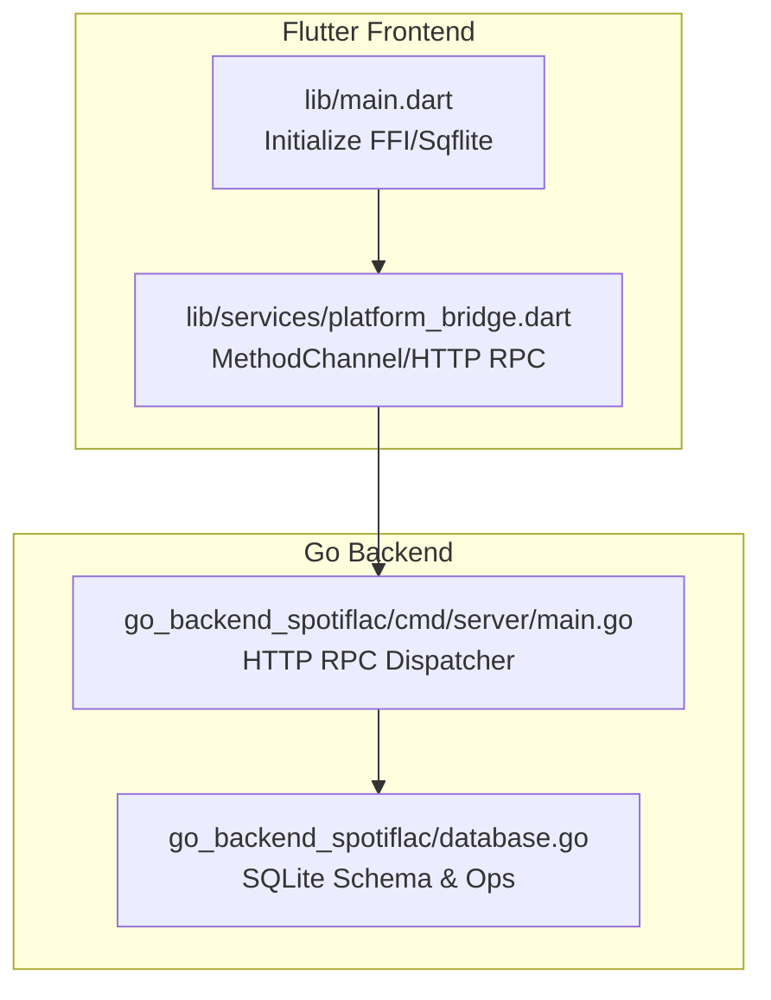
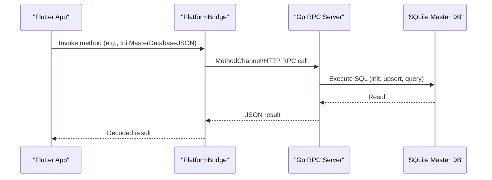
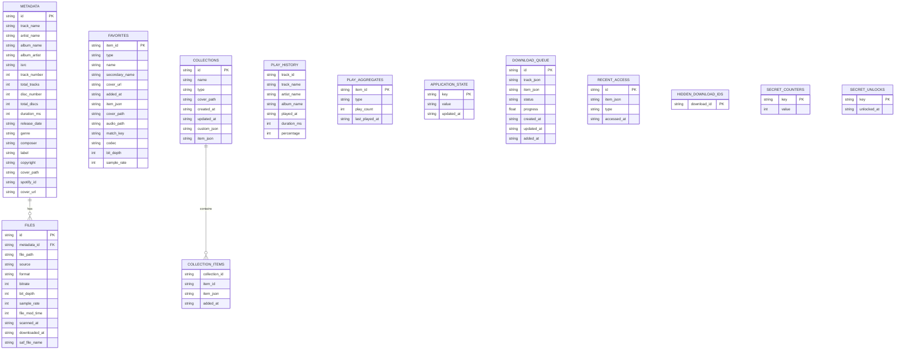
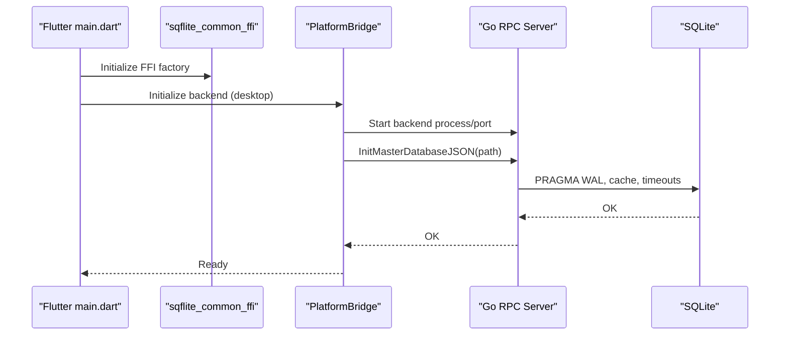
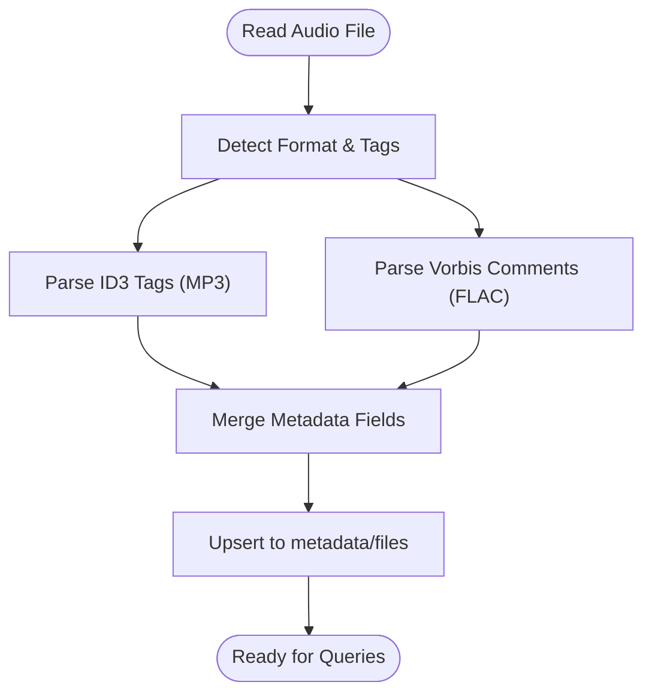
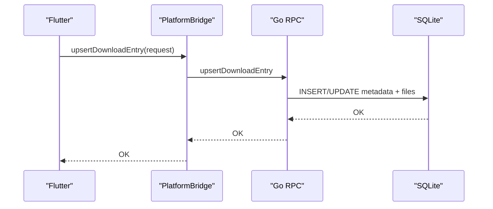
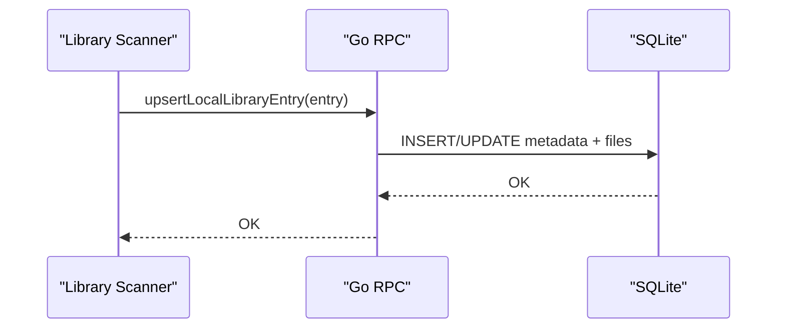
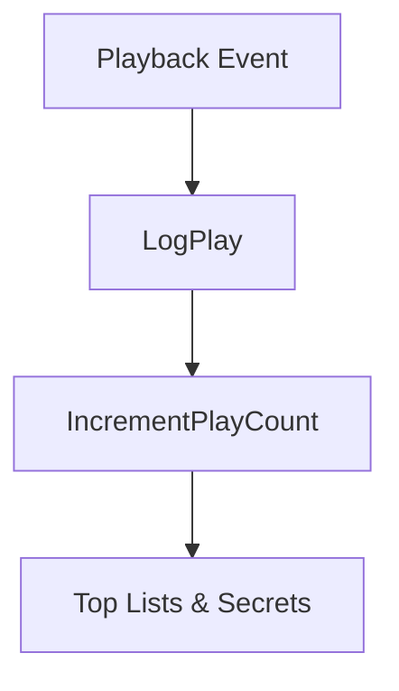
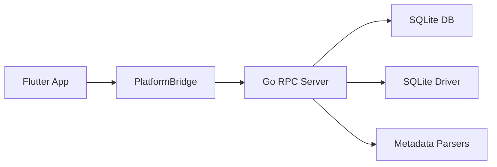

# Database Design

<cite>
**Referenced Files in This Document**
- [database.go](file://go_backend_spotiflac/database.go)
- [audio_metadata.go](file://go_backend_spotiflac/audio_metadata.go)
- [metadata.go](file://go_backend_spotiflac/metadata.go)
- [metadata_types.go](file://go_backend_spotiflac/metadata_types.go)
- [exports.go](file://go_backend_spotiflac/exports.go)
- [main.go](file://go_backend_spotiflac/cmd/server/main.go)
- [platform_bridge.dart](file://lib/services/platform_bridge.dart)
- [main.dart](file://lib/main.dart)
</cite>

## Table of Contents
1. [Introduction](#introduction)
2. [Project Structure](#project-structure)
3. [Core Components](#core-components)
4. [Architecture Overview](#architecture-overview)
5. [Detailed Component Analysis](#detailed-component-analysis)
6. [Dependency Analysis](#dependency-analysis)
7. [Performance Considerations](#performance-considerations)
8. [Troubleshooting Guide](#troubleshooting-guide)
9. [Conclusion](#conclusion)

## Introduction
This document describes the database design and FFI integration for the SpotiFLAC project. It focuses on the SQLite schema used to store audio metadata, download history, user preferences, and related analytics. It also explains how the Go backend exposes database operations to the Flutter frontend via a Foreign Function Interface (FFI) bridge, enabling cross-platform database operations on desktop and mobile.

## Project Structure
The database logic resides primarily in the Go backend under go_backend_spotiflac, with the Flutter frontend using sqflite_common_ffi on desktop and communicating with the Go backend over a method channel or HTTP RPC on desktop. The key files are:
- go_backend_spotiflac/database.go: Core database operations, schema, and queries
- go_backend_spotiflac/cmd/server/main.go: HTTP RPC dispatcher exposing database operations
- lib/services/platform_bridge.dart: Flutter bridge to invoke backend methods
- lib/main.dart: Desktop initialization and FFI setup

**Diagram sources**
- [main.dart:22-44](file://lib/main.dart#L22-L44)
- [platform_bridge.dart:37-81](file://lib/services/platform_bridge.dart#L37-L81)
- [main.go:107-134](file://go_backend_spotiflac/cmd/server/main.go#L107-L134)
- [database.go:19-50](file://go_backend_spotiflac/database.go#L19-L50)

**Section sources**
- [main.dart:22-44](file://lib/main.dart#L22-L44)
- [platform_bridge.dart:37-81](file://lib/services/platform_bridge.dart#L37-L81)
- [main.go:107-134](file://go_backend_spotiflac/cmd/server/main.go#L107-L134)

## Core Components
- SQLite master database managed by the Go backend with WAL mode and tuned pragmas for performance
- Two primary entity tables:
  - metadata: stores canonical audio metadata (track, album, artist, genre, ISRC, cover path, etc.)
  - files: stores file records linked to metadata via foreign key, including file path, source, quality, timestamps
- Additional tables and features:
  - favorites, collections, collection_items
  - play_history, play_aggregates
  - application_state (settings)
  - download_queue, recent_access, hidden_download_ids
  - secret_counters, secret_unlocks

Key operations include:
- Upsert metadata and file records
- Batch upserts for library scans
- Search and paginated queries
- Download history management
- Local library management
- Analytics and stats

**Section sources**
- [database.go:52-158](file://go_backend_spotiflac/database.go#L52-L158)
- [database.go:803-850](file://go_backend_spotiflac/database.go#L803-L850)
- [database.go:920-963](file://go_backend_spotiflac/database.go#L920-L963)
- [database.go:1430-1450](file://go_backend_spotiflac/database.go#L1430-L1450)
- [database.go:1541-1576](file://go_backend_spotiflac/database.go#L1541-L1576)
- [database.go:1615-1635](file://go_backend_spotiflac/database.go#L1615-L1635)

## Architecture Overview
The Flutter app initializes FFI on desktop and uses a method channel or HTTP RPC to communicate with the Go backend. The Go backend exposes a wide range of database operations via HTTP RPC methods, which the Flutter bridge invokes.

**Diagram sources**
- [platform_bridge.dart:44-53](file://lib/services/platform_bridge.dart#L44-L53)
- [main.go:575-582](file://go_backend_spotiflac/cmd/server/main.go#L575-L582)
- [database.go:19-50](file://go_backend_spotiflac/database.go#L19-L50)

**Section sources**
- [platform_bridge.dart:44-81](file://lib/services/platform_bridge.dart#L44-L81)
- [main.go:575-582](file://go_backend_spotiflac/cmd/server/main.go#L575-L582)

## Detailed Component Analysis

### SQLite Schema and Relationships
The schema centers around two core tables:
- metadata: canonical audio metadata keyed by id
- files: file entries linked to metadata by metadata_id

Additional tables support favorites, collections, play history, application settings, and download queue.

**Diagram sources**
- [database.go:52-158](file://go_backend_spotiflac/database.go#L52-L158)
- [database.go:803-850](file://go_backend_spotiflac/database.go#L803-L850)
- [database.go:886-909](file://go_backend_spotiflac/database.go#L886-L909)
- [database.go:1430-1450](file://go_backend_spotiflac/database.go#L1430-L1450)
- [database.go:1541-1576](file://go_backend_spotiflac/database.go#L1541-L1576)
- [database.go:1615-1635](file://go_backend_spotiflac/database.go#L1615-L1635)
- [database.go:1767-1805](file://go_backend_spotiflac/database.go#L1767-L1805)
- [database.go:1872-1886](file://go_backend_spotiflac/database.go#L1872-L1886)
- [database.go:1921-1944](file://go_backend_spotiflac/database.go#L1921-L1944)
- [database.go:1965-1987](file://go_backend_spotiflac/database.go#L1965-L1987)

**Section sources**
- [database.go:52-158](file://go_backend_spotiflac/database.go#L52-L158)
- [database.go:803-850](file://go_backend_spotiflac/database.go#L803-L850)
- [database.go:886-909](file://go_backend_spotiflac/database.go#L886-L909)
- [database.go:1430-1450](file://go_backend_spotiflac/database.go#L1430-L1450)
- [database.go:1541-1576](file://go_backend_spotiflac/database.go#L1541-L1576)
- [database.go:1615-1635](file://go_backend_spotiflac/database.go#L1615-L1635)
- [database.go:1767-1805](file://go_backend_spotiflac/database.go#L1767-L1805)
- [database.go:1872-1886](file://go_backend_spotiflac/database.go#L1872-L1886)
- [database.go:1921-1944](file://go_backend_spotiflac/database.go#L1921-L1944)
- [database.go:1965-1987](file://go_backend_spotiflac/database.go#L1965-L1987)

### Database Initialization and FFI Integration
- Flutter initializes FFI on non-Android platforms and starts the Go backend process on desktop
- The Flutter bridge sends RPC requests to the Go server, which dispatches to database operations
- The Go backend exposes an HTTP RPC endpoint and a method channel for mobile

**Diagram sources**
- [main.dart:26-30](file://lib/main.dart#L26-L30)
- [platform_bridge.dart:83-141](file://lib/services/platform_bridge.dart#L83-L141)
- [main.go:580-582](file://go_backend_spotiflac/cmd/server/main.go#L580-L582)
- [database.go:19-50](file://go_backend_spotiflac/database.go#L19-L50)

**Section sources**
- [main.dart:26-30](file://lib/main.dart#L26-L30)
- [platform_bridge.dart:83-141](file://lib/services/platform_bridge.dart#L83-L141)
- [main.go:580-582](file://go_backend_spotiflac/cmd/server/main.go#L580-L582)
- [database.go:19-50](file://go_backend_spotiflac/database.go#L19-L50)

### Audio Metadata Storage and Retrieval
- Audio metadata parsing (ID3, Vorbis comments) is handled in dedicated modules
- FLAC metadata embedding and extraction use Vorbis comments and picture blocks
- The database stores cover paths and URLs for quick retrieval

**Diagram sources**
- [audio_metadata.go:54-94](file://go_backend_spotiflac/audio_metadata.go#L54-L94)
- [metadata.go:242-324](file://go_backend_spotiflac/metadata.go#L242-L324)
- [database.go:52-158](file://go_backend_spotiflac/database.go#L52-L158)

**Section sources**
- [audio_metadata.go:54-94](file://go_backend_spotiflac/audio_metadata.go#L54-L94)
- [metadata.go:242-324](file://go_backend_spotiflac/metadata.go#L242-L324)
- [database.go:52-158](file://go_backend_spotiflac/database.go#L52-L158)

### Download History Management
- Download history is stored in the files table with source='download'
- Upsert operations update metadata and file records atomically
- Queries support pagination, filtering, and grouped counts

**Diagram sources**
- [main.go:942-948](file://go_backend_spotiflac/cmd/server/main.go#L942-L948)
- [database.go:343-394](file://go_backend_spotiflac/database.go#L343-L394)

**Section sources**
- [main.go:942-948](file://go_backend_spotiflac/cmd/server/main.go#L942-L948)
- [database.go:343-394](file://go_backend_spotiflac/database.go#L343-L394)

### Local Library Management
- Local library entries are stored with source='local_scan'
- Batch upserts optimize library scanning performance
- Queries support search, sorting, grouping, and cover paths

**Diagram sources**
- [main.go:1053-1059](file://go_backend_spotiflac/cmd/server/main.go#L1053-L1059)
- [database.go:803-850](file://go_backend_spotiflac/database.go#L803-L850)

**Section sources**
- [main.go:1053-1059](file://go_backend_spotiflac/cmd/server/main.go#L1053-L1059)
- [database.go:803-850](file://go_backend_spotiflac/database.go#L803-L850)

### Analytics and Stats
- Play history and aggregates are maintained for top lists and secrets
- Stats include total plays, unique tracks, albums, artists, and counters

**Diagram sources**
- [database.go:1541-1576](file://go_backend_spotiflac/database.go#L1541-L1576)
- [database.go:1580-1593](file://go_backend_spotiflac/database.go#L1580-L1593)
- [database.go:1637-1674](file://go_backend_spotiflac/database.go#L1637-L1674)
- [database.go:1676-1706](file://go_backend_spotiflac/database.go#L1676-L1706)

**Section sources**
- [database.go:1541-1576](file://go_backend_spotiflac/database.go#L1541-L1576)
- [database.go:1580-1593](file://go_backend_spotiflac/database.go#L1580-L1593)
- [database.go:1637-1674](file://go_backend_spotiflac/database.go#L1637-L1674)
- [database.go:1676-1706](file://go_backend_spotiflac/database.go#L1676-L1706)

## Dependency Analysis
- Flutter depends on sqflite_common_ffi on desktop and communicates with the Go backend
- The Go backend uses modernc.org/sqlite driver and exposes a rich RPC surface
- Metadata parsing relies on external libraries for FLAC/Vorbis and ID3

**Diagram sources**
- [platform_bridge.dart:37-81](file://lib/services/platform_bridge.dart#L37-L81)
- [main.go:107-134](file://go_backend_spotiflac/cmd/server/main.go#L107-L134)
- [database.go:3-11](file://go_backend_spotiflac/database.go#L3-L11)

**Section sources**
- [platform_bridge.dart:37-81](file://lib/services/platform_bridge.dart#L37-L81)
- [main.go:107-134](file://go_backend_spotiflac/cmd/server/main.go#L107-L134)
- [database.go:3-11](file://go_backend_spotiflac/database.go#L3-L11)

## Performance Considerations
- SQLite tuning:
  - WAL mode for concurrency
  - NORMAL synchronous mode for speed
  - 64 MB cache size
  - 5-second busy timeout to reduce SQLITE_BUSY
- Batch operations:
  - Batch upserts for library scans reduce round trips
- Prepared statements:
  - Prepared statements in batch routines minimize overhead
- Indexing strategy:
  - Suggested indexes for frequent filters (e.g., file_path, source, metadata_id)
  - Consider indexes on metadata fields used in WHERE clauses (track_name, artist_name, album_name)
- Query optimization:
  - Use LIMIT/OFFSET for pagination
  - Select only needed columns to reduce I/O
  - Use EXPLAIN QUERY PLAN to analyze slow queries

[No sources needed since this section provides general guidance]

## Troubleshooting Guide
- Database not initialized:
  - Ensure InitMasterDatabaseJSON is called before other operations
- SQLITE_BUSY errors:
  - Increase busy_timeout or reduce concurrent writes
- Slow queries:
  - Add appropriate indexes
  - Review query plans
- Metadata parsing failures:
  - Verify file integrity and supported formats
- FFI/desktop startup:
  - Confirm backend process is running and listening on the configured port

**Section sources**
- [database.go:19-50](file://go_backend_spotiflac/database.go#L19-L50)
- [main.go:580-582](file://go_backend_spotiflac/cmd/server/main.go#L580-L582)
- [platform_bridge.dart:83-141](file://lib/services/platform_bridge.dart#L83-L141)

## Conclusion
The database design leverages a normalized schema with a focus on metadata and file records, complemented by specialized tables for favorites, collections, analytics, and download management. The FFI integration via sqflite_common_ffi and an HTTP RPC bridge enables robust cross-platform operation, while SQLite tuning and batch operations ensure performance. Proper indexing and query planning further enhance scalability for large libraries and active download histories.