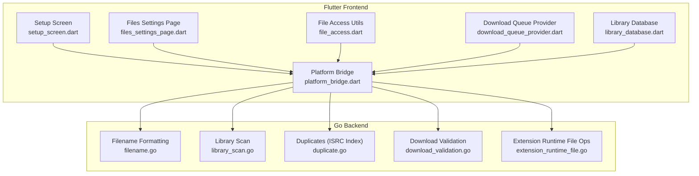
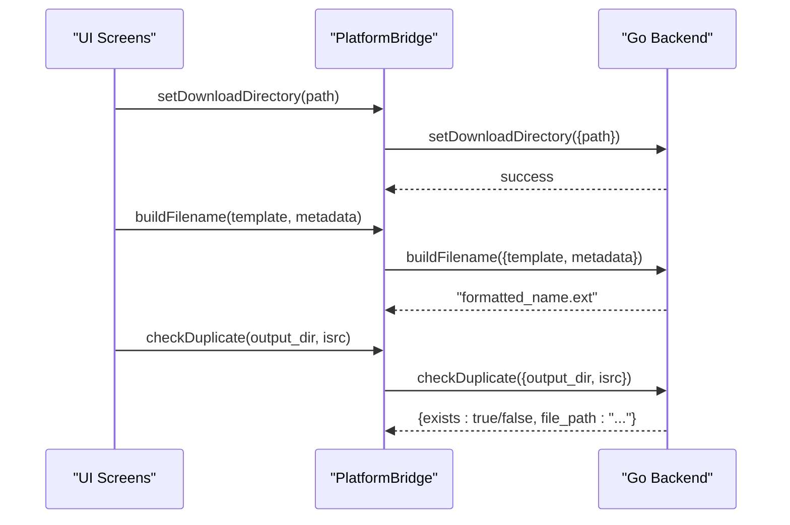
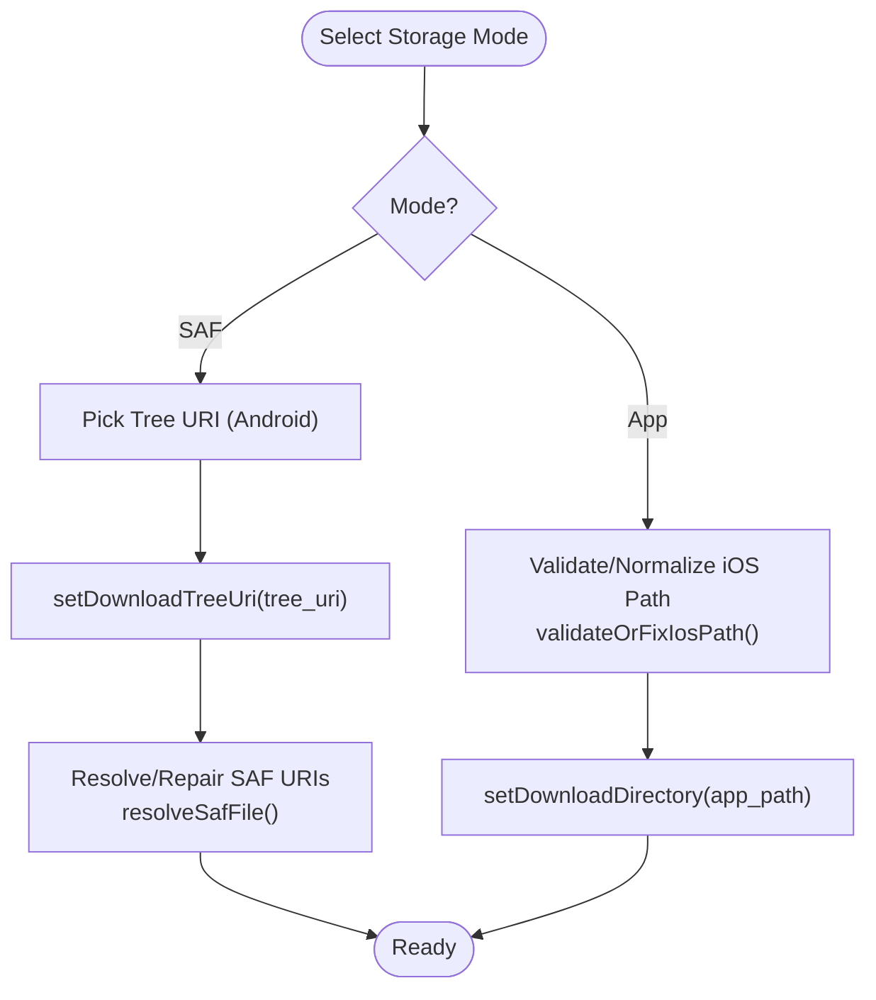
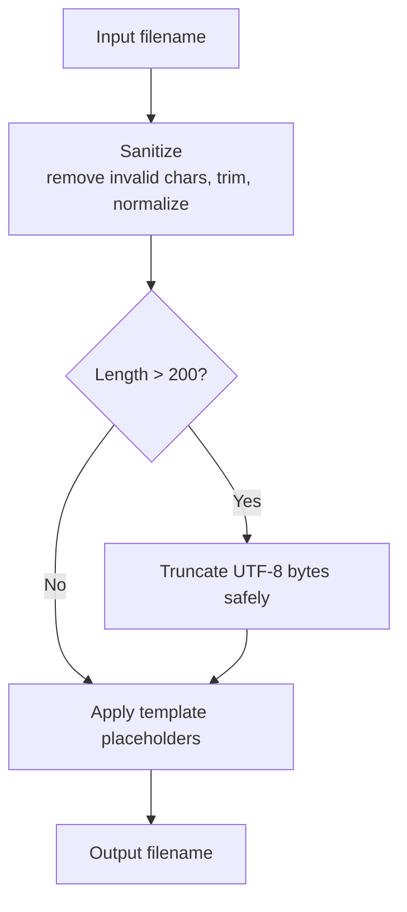
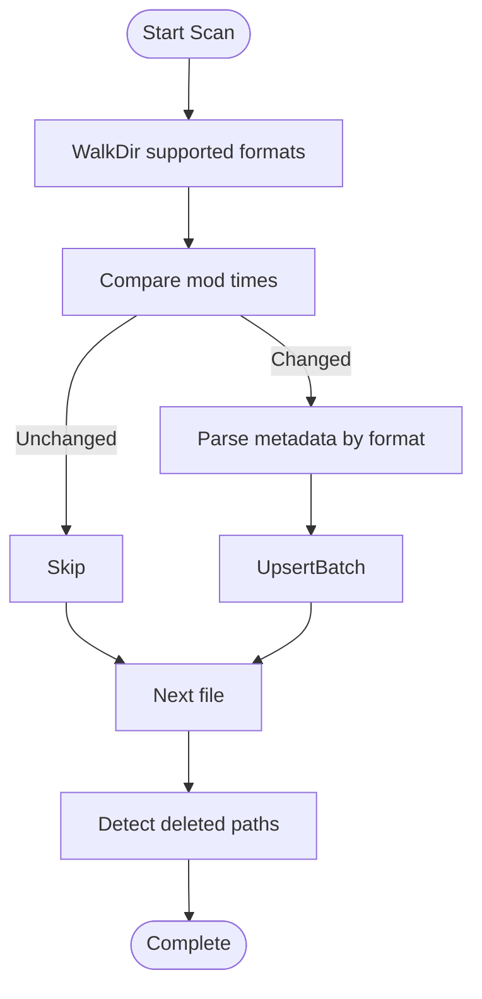
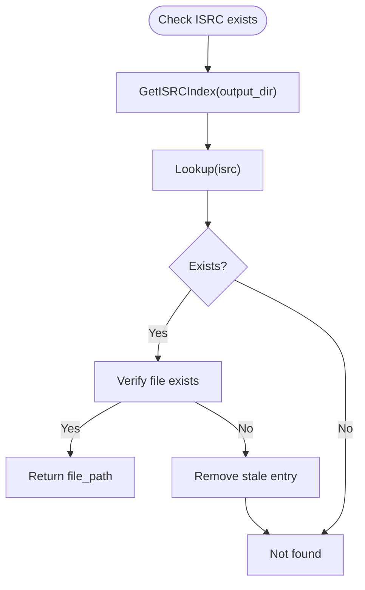
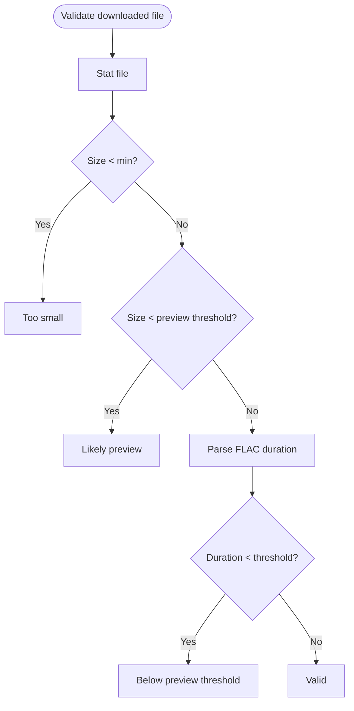
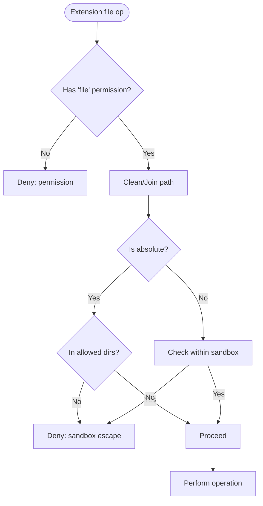
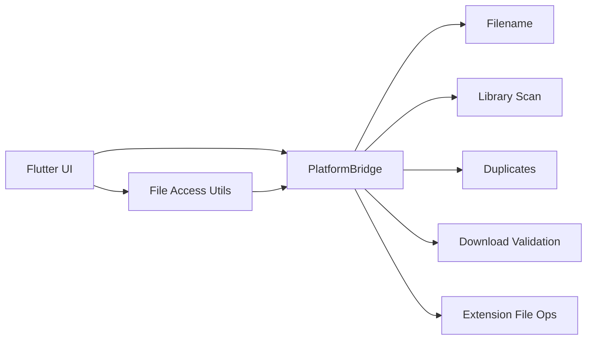

# File System Operations

<cite>
**Referenced Files in This Document**
- [filename.go](file://go_backend_spotiflac/filename.go)
- [library_scan.go](file://go_backend_spotiflac/library_scan.go)
- [duplicate.go](file://go_backend_spotiflac/duplicate.go)
- [download_validation.go](file://go_backend_spotiflac/download_validation.go)
- [extension_runtime_file.go](file://go_backend_spotiflac/extension_runtime_file.go)
- [file_access.dart](file://lib/utils/file_access.dart)
- [platform_bridge.dart](file://lib/services/platform_bridge.dart)
- [setup_screen.dart](file://lib/screens/setup_screen.dart)
- [files_settings_page.dart](file://lib/screens/settings/files_settings_page.dart)
- [download_queue_provider.dart](file://lib/providers/download_queue_provider.dart)
- [library_database.dart](file://lib/services/library_database.dart)
</cite>

## Table of Contents
1. [Introduction](#introduction)
2. [Project Structure](#project-structure)
3. [Core Components](#core-components)
4. [Architecture Overview](#architecture-overview)
5. [Detailed Component Analysis](#detailed-component-analysis)
6. [Dependency Analysis](#dependency-analysis)
7. [Performance Considerations](#performance-considerations)
8. [Troubleshooting Guide](#troubleshooting-guide)
9. [Conclusion](#conclusion)

## Introduction
This document explains file system operations across the application, focusing on storage management, file organization, cross-platform access, and robustness. It covers:
- Download directory structure and filename formatting
- Storage modes (app storage vs Storage Access Framework)
- Cross-platform path handling and permissions
- Local library scanning, duplicate detection, and integrity validation
- Backup and restore considerations, error recovery, and best practices

## Project Structure
The file system logic spans two layers:
- Flutter/Dart frontend: UI, settings, SAF integration, and platform bridges
- Go backend: filesystem operations, library scanning, duplicates, and validation



**Diagram sources**
- [setup_screen.dart:448-704](file://lib/screens/setup_screen.dart#L448-L704)
- [files_settings_page.dart:329-412](file://lib/screens/settings/files_settings_page.dart#L329-L412)
- [file_access.dart:1-309](file://lib/utils/file_access.dart#L1-L309)
- [platform_bridge.dart:1-800](file://lib/services/platform_bridge.dart#L1-L800)
- [download_queue_provider.dart:732-1747](file://lib/providers/download_queue_provider.dart#L732-L1747)
- [library_database.dart:477-512](file://lib/services/library_database.dart#L477-L512)
- [filename.go:1-346](file://go_backend_spotiflac/filename.go#L1-L346)
- [library_scan.go:1-955](file://go_backend_spotiflac/library_scan.go#L1-L955)
- [duplicate.go:1-256](file://go_backend_spotiflac/duplicate.go#L1-L256)
- [download_validation.go:1-75](file://go_backend_spotiflac/download_validation.go#L1-L75)
- [extension_runtime_file.go:68-894](file://go_backend_spotiflac/extension_runtime_file.go#L68-L894)

**Section sources**
- [platform_bridge.dart:1-800](file://lib/services/platform_bridge.dart#L1-L800)
- [file_access.dart:1-309](file://lib/utils/file_access.dart#L1-L309)

## Core Components
- Filename formatting and sanitization: constructs safe filenames and templates, truncates long names, and normalizes Unicode.
- Library scanning: discovers audio files, extracts metadata, detects deletions, and batches updates.
- Duplicate detection: maintains an ISRC index to avoid redundant downloads.
- Download validation: verifies file size and duration thresholds for authenticity.
- Cross-platform file access: SAF integration, iOS path normalization, and unified file operations.
- Extension sandboxed file operations: controlled access with path validation and permissions.

**Section sources**
- [filename.go:1-346](file://go_backend_spotiflac/filename.go#L1-L346)
- [library_scan.go:138-325](file://go_backend_spotiflac/library_scan.go#L138-L325)
- [duplicate.go:1-256](file://go_backend_spotiflac/duplicate.go#L1-L256)
- [download_validation.go:1-75](file://go_backend_spotiflac/download_validation.go#L1-L75)
- [file_access.dart:1-309](file://lib/utils/file_access.dart#L1-L309)
- [extension_runtime_file.go:68-894](file://go_backend_spotiflac/extension_runtime_file.go#L68-L894)

## Architecture Overview
The system routes high-level operations through the Platform Bridge to the Go backend for heavy lifting, while Flutter handles UI, SAF, and platform-specific validations.



**Diagram sources**
- [platform_bridge.dart:659-700](file://lib/services/platform_bridge.dart#L659-L700)
- [filename.go:82-113](file://go_backend_spotiflac/filename.go#L82-L113)
- [duplicate.go:161-164](file://go_backend_spotiflac/duplicate.go#L161-L164)

## Detailed Component Analysis

### Storage Modes and Cross-Platform Access
- App storage mode: writes directly to a local path. On iOS, the path is validated and normalized to Documents subfolders.
- SAF (Storage Access Framework) mode: uses Android’s tree URIs. Flutter resolves and repairs SAF URIs, and Go backend delegates SAF operations to native Android code.



**Diagram sources**
- [setup_screen.dart:448-704](file://lib/screens/setup_screen.dart#L448-L704)
- [files_settings_page.dart:329-412](file://lib/screens/settings/files_settings_page.dart#L329-L412)
- [file_access.dart:79-140](file://lib/utils/file_access.dart#L79-L140)
- [platform_bridge.dart:702-733](file://lib/services/platform_bridge.dart#L702-L733)

**Section sources**
- [setup_screen.dart:448-704](file://lib/screens/setup_screen.dart#L448-L704)
- [files_settings_page.dart:329-412](file://lib/screens/settings/files_settings_page.dart#L329-L412)
- [file_access.dart:40-140](file://lib/utils/file_access.dart#L40-L140)
- [platform_bridge.dart:702-733](file://lib/services/platform_bridge.dart#L702-L733)

### Filename Formatting and Naming Conventions
- Sanitization removes invalid characters and controls, trims whitespace, and enforces a maximum length.
- Template engine supports placeholders for title, artist, album, track/disc numbers, dates, and numeric formatting.
- Fallbacks ensure a default name when inputs are empty.



**Diagram sources**
- [filename.go:21-61](file://go_backend_spotiflac/filename.go#L21-L61)
- [filename.go:82-113](file://go_backend_spotiflac/filename.go#L82-L113)

**Section sources**
- [filename.go:1-346](file://go_backend_spotiflac/filename.go#L1-L346)

### Local Library Scanning and Metadata Extraction
- Walks the configured folder, filters supported formats, and compares modification times for incremental scans.
- Parses tags per format (FLAC, MP3, M4A, OGG/Opus, APE/WV/MPC) and falls back to filename parsing.
- Detects deletions by comparing current filesystem against stored records.
- Batches database upserts and emits progress events.



**Diagram sources**
- [library_scan.go:90-130](file://go_backend_spotiflac/library_scan.go#L90-L130)
- [library_scan.go:186-325](file://go_backend_spotiflac/library_scan.go#L186-L325)
- [library_scan.go:288-325](file://go_backend_spotiflac/library_scan.go#L288-L325)

**Section sources**
- [library_scan.go:138-325](file://go_backend_spotiflac/library_scan.go#L138-L325)
- [library_database.dart:477-512](file://lib/services/library_database.dart#L477-L512)

### Duplicate Detection and Handling
- Builds an ISRC index over FLAC files under the output directory with caching and TTL.
- Parallel existence checks across multiple tracks.
- Removes stale index entries if referenced files no longer exist.



**Diagram sources**
- [duplicate.go:27-50](file://go_backend_spotiflac/duplicate.go#L27-L50)
- [duplicate.go:141-159](file://go_backend_spotiflac/duplicate.go#L141-L159)

**Section sources**
- [duplicate.go:1-256](file://go_backend_spotiflac/duplicate.go#L1-L256)

### Download Validation and Integrity
- Validates minimum file size, likely-preview thresholds, and FLAC duration to ensure full-length content.
- Provides structured results with reasons and durations.



**Diagram sources**
- [download_validation.go:23-54](file://go_backend_spotiflac/download_validation.go#L23-L54)

**Section sources**
- [download_validation.go:1-75](file://go_backend_spotiflac/download_validation.go#L1-L75)

### SAF and iOS Path Handling
- SAF operations are delegated to native Android code via PlatformBridge methods (exists, stat, delete, create, copy, open).
- iOS path validation ensures only writable Documents subdirectories are accepted and recovers legacy paths.
- Flutter utilities detect CUE virtual tracks and strip suffixes for safe operations.

```mermaid
sequenceDiagram
participant UI as "Flutter UI"
participant FA as "FileAccess"
participant PB as "PlatformBridge"
participant AND as "Android SAF"
UI->>FA : fileExists(uri)
FA->>PB : safExists(uri)
PB->>AND : exists
AND-->>PB : true/false
PB-->>FA : true/false
FA-->>UI : result
```

**Diagram sources**
- [file_access.dart:249-271](file://lib/utils/file_access.dart#L249-L271)
- [platform_bridge.dart:707-720](file://lib/services/platform_bridge.dart#L707-L720)

**Section sources**
- [file_access.dart:1-309](file://lib/utils/file_access.dart#L1-L309)
- [platform_bridge.dart:702-781](file://lib/services/platform_bridge.dart#L702-L781)

### Extension Sandboxed File Operations
- Extensions operate within a sandbox with explicit file permissions.
- Paths are validated: relative paths allowed, absolute paths rejected, and sandbox escape attempts blocked.
- Supported operations: read, write, write bytes, copy, move, delete, get size, download.



**Diagram sources**
- [extension_runtime_file.go:75-108](file://go_backend_spotiflac/extension_runtime_file.go#L75-L108)

**Section sources**
- [extension_runtime_file.go:68-894](file://go_backend_spotiflac/extension_runtime_file.go#L68-L894)

### Practical Examples
- Create a filename from template:
  - Use the filename formatter to transform placeholders into a safe filename.
  - Reference: [filename.go:82-113](file://go_backend_spotiflac/filename.go#L82-L113)
- Traverse a directory and scan for audio:
  - Walk the directory, filter supported formats, and collect metadata.
  - Reference: [library_scan.go:90-130](file://go_backend_spotiflac/library_scan.go#L90-L130)
- Validate a downloaded file:
  - Check size and duration thresholds; interpret results.
  - Reference: [download_validation.go:23-54](file://go_backend_spotiflac/download_validation.go#L23-L54)
- Repair SAF URIs:
  - Resolve or verify SAF paths during startup repair passes.
  - Reference: [download_queue_provider.dart:732-845](file://lib/providers/download_queue_provider.dart#L732-L845)

**Section sources**
- [filename.go:82-113](file://go_backend_spotiflac/filename.go#L82-L113)
- [library_scan.go:90-130](file://go_backend_spotiflac/library_scan.go#L90-L130)
- [download_validation.go:23-54](file://go_backend_spotiflac/download_validation.go#L23-L54)
- [download_queue_provider.dart:732-845](file://lib/providers/download_queue_provider.dart#L732-L845)

## Dependency Analysis
- PlatformBridge is the central dispatcher to Go backend for file operations, library scanning, duplicates, and filename formatting.
- Flutter utilities depend on PlatformBridge for SAF operations and on path validators for iOS.
- Go backend components are cohesive around filesystem operations and metadata extraction.



**Diagram sources**
- [platform_bridge.dart:44-700](file://lib/services/platform_bridge.dart#L44-L700)
- [filename.go:1-346](file://go_backend_spotiflac/filename.go#L1-L346)
- [library_scan.go:1-955](file://go_backend_spotiflac/library_scan.go#L1-L955)
- [duplicate.go:1-256](file://go_backend_spotiflac/duplicate.go#L1-L256)
- [download_validation.go:1-75](file://go_backend_spotiflac/download_validation.go#L1-L75)
- [extension_runtime_file.go:68-894](file://go_backend_spotiflac/extension_runtime_file.go#L68-L894)
- [file_access.dart:1-309](file://lib/utils/file_access.dart#L1-L309)

**Section sources**
- [platform_bridge.dart:1-800](file://lib/services/platform_bridge.dart#L1-L800)

## Performance Considerations
- Library scanning batches database upserts and tracks progress to reduce overhead.
- ISRC index caches are TTL-limited and built under locks to avoid redundant work.
- Parallel duplicate checks improve throughput for bulk queries.
- SAF operations are asynchronous and rely on native Android APIs; batch operations where possible.

[No sources needed since this section provides general guidance]

## Troubleshooting Guide
- SAF URI repair:
  - The system iterates startup entries, verifies or resolves SAF URIs, and persists updates.
  - References: [download_queue_provider.dart:732-845](file://lib/providers/download_queue_provider.dart#L732-L845)
- Orphaned entries cleanup:
  - Scans for missing files and optionally replaces with converted siblings.
  - References: [download_queue_provider.dart:1614-1747](file://lib/providers/download_queue_provider.dart#L1614-L1747)
- iOS path validation failures:
  - Ensure the path is a writable Documents subdirectory and not iCloud Drive.
  - References: [file_access.dart:156-219](file://lib/utils/file_access.dart#L156-L219)
- Extension sandbox errors:
  - Confirm the extension has file permissions and uses relative paths within the sandbox.
  - References: [extension_runtime_file.go:75-108](file://go_backend_spotiflac/extension_runtime_file.go#L75-L108)

**Section sources**
- [download_queue_provider.dart:732-845](file://lib/providers/download_queue_provider.dart#L732-L845)
- [download_queue_provider.dart:1614-1747](file://lib/providers/download_queue_provider.dart#L1614-L1747)
- [file_access.dart:156-219](file://lib/utils/file_access.dart#L156-L219)
- [extension_runtime_file.go:75-108](file://go_backend_spotiflac/extension_runtime_file.go#L75-L108)

## Conclusion
The application implements robust, cross-platform file system operations by combining Flutter UI and SAF integration with a Go backend optimized for scanning, duplication checks, and validation. The design emphasizes safety (sandboxed extensions), correctness (incremental scans and ISRC indexing), and resilience (SAF repair and orphan cleanup).