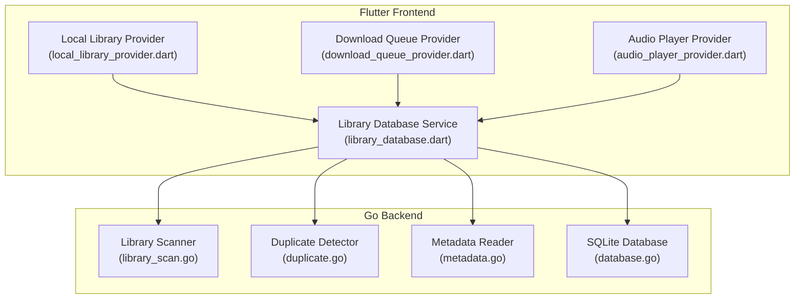
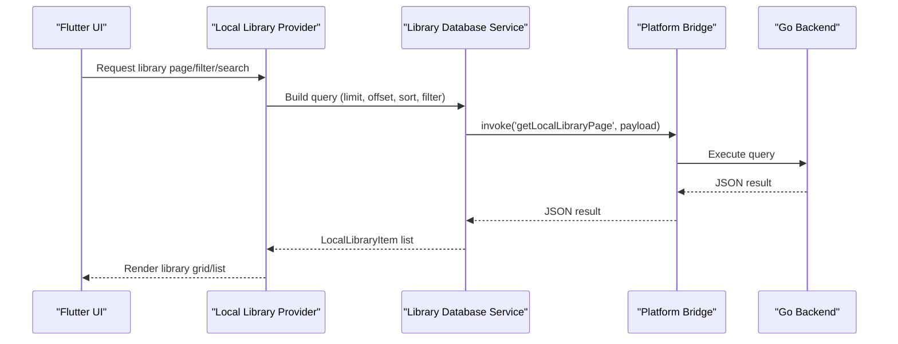
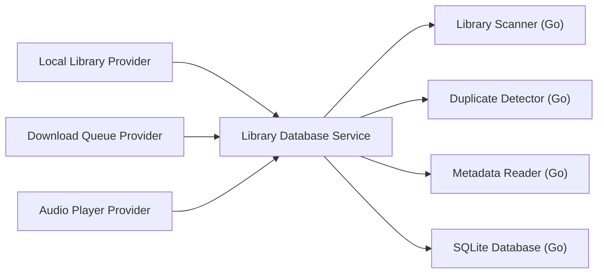

# Local Library Management

<cite>
**Referenced Files in This Document**
- [library_scan.go](file://go_backend_spotiflac/library_scan.go)
- [duplicate.go](file://go_backend_spotiflac/duplicate.go)
- [metadata.go](file://go_backend_spotiflac/metadata.go)
- [database.go](file://go_backend_spotiflac/database.go)
- [local_library_provider.dart](file://lib/providers/local_library_provider.dart)
- [library_database.dart](file://lib/services/library_database.dart)
- [download_queue_provider.dart](file://lib/providers/download_queue_provider.dart)
- [audio_player_provider.dart](file://lib/providers/audio_player_provider.dart)
</cite>

## Table of Contents
1. [Introduction](#introduction)
2. [Project Structure](#project-structure)
3. [Core Components](#core-components)
4. [Architecture Overview](#architecture-overview)
5. [Detailed Component Analysis](#detailed-component-analysis)
6. [Dependency Analysis](#dependency-analysis)
7. [Performance Considerations](#performance-considerations)
8. [Troubleshooting Guide](#troubleshooting-guide)
9. [Conclusion](#conclusion)

## Introduction
This document explains the local library management system, focusing on library scanning, duplicate detection, and library organization. It covers the backend scanning pipeline implemented in Go, the reactive state management in Flutter Riverpod, and the integration points between local audio files and the application's library database. Practical examples demonstrate library initialization, background scanning, real-time updates, duplicate detection strategies, playlist support, filtering, search, and export capabilities.

## Project Structure
The local library management spans three primary areas:
- Backend scanning and metadata extraction in Go
- Reactive state management in Flutter Riverpod providers
- Database abstraction and query orchestration in Flutter services

**Diagram sources**
- [local_library_provider.dart](file://lib/providers/local_library_provider.dart)
- [library_database.dart](file://lib/services/library_database.dart)
- [download_queue_provider.dart](file://lib/providers/download_queue_provider.dart)
- [audio_player_provider.dart](file://lib/providers/audio_player_provider.dart)
- [library_scan.go](file://go_backend_spotiflac/library_scan.go)
- [duplicate.go](file://go_backend_spotiflac/duplicate.go)
- [metadata.go](file://go_backend_spotiflac/metadata.go)
- [database.go](file://go_backend_spotiflac/database.go)

**Section sources**
- [local_library_provider.dart](file://lib/providers/local_library_provider.dart)
- [library_database.dart](file://lib/services/library_database.dart)
- [download_queue_provider.dart](file://lib/providers/download_queue_provider.dart)
- [audio_player_provider.dart](file://lib/providers/audio_player_provider.dart)
- [library_scan.go](file://go_backend_spotiflac/library_scan.go)
- [duplicate.go](file://go_backend_spotiflac/duplicate.go)
- [metadata.go](file://go_backend_spotiflac/metadata.go)
- [database.go](file://go_backend_spotiflac/database.go)

## Core Components
- Local Library Provider: Manages reactive state for the local library, exposing pages, counts, filters, and search. It coordinates with the Library Database Service to fetch and update library data.
- Library Database Service: Orchestrates calls to the Go backend for efficient queries and falls back to the master SQLite database when necessary. It supports pagination, filtering, sorting, and indexing.
- Library Scanner (Go): Scans folders for supported audio formats, extracts metadata from tags and filenames, performs incremental scans, and cleans up deleted files.
- Duplicate Detector (Go): Builds and maintains an ISRC index to detect duplicate tracks across the library.
- Metadata Reader (Go): Reads and writes metadata for various audio formats, embeds cover art, and probes audio specs.
- Database Layer (Go): Provides upsert, search, deletion, and aggregation operations for local library entries.

**Section sources**
- [local_library_provider.dart](file://lib/providers/local_library_provider.dart)
- [library_database.dart](file://lib/services/library_database.dart)
- [library_scan.go](file://go_backend_spotiflac/library_scan.go)
- [duplicate.go](file://go_backend_spotiflac/duplicate.go)
- [metadata.go](file://go_backend_spotiflac/metadata.go)
- [database.go](file://go_backend_spotiflac/database.go)

## Architecture Overview
The system uses a hybrid architecture:
- Flutter Riverpod providers maintain UI state and trigger operations.
- The Library Database Service bridges Flutter and Go via platform bridge calls.
- The Go backend performs heavy lifting for scanning, metadata extraction, and database operations.
- SQLite serves as the persistent store with WAL mode for concurrency and performance.

**Diagram sources**
- [local_library_provider.dart](file://lib/providers/local_library_provider.dart)
- [library_database.dart](file://lib/services/library_database.dart)
- [database.go](file://go_backend_spotiflac/database.go)

**Section sources**
- [local_library_provider.dart](file://lib/providers/local_library_provider.dart)
- [library_database.dart](file://lib/services/library_database.dart)
- [database.go](file://go_backend_spotiflac/database.go)

## Detailed Component Analysis

### Local Library Provider
Responsibilities:
- Expose library pages, counts, and album groups
- Apply filters (all, albums, singles), search, and sorting
- React to library updates and invalidate caches
- Integrate with collections and playback providers

Key behaviors:
- Delegates queries to Library Database Service
- Maintains reactive state for UI rendering
- Coordinates with download queue and collections for consistency

**Section sources**
- [local_library_provider.dart](file://lib/providers/local_library_provider.dart)

### Library Database Service
Responsibilities:
- Upstream to Go backend for performance-critical operations
- Fallback to master SQLite database when Go calls fail
- Provide typed models for library items and album groups
- Support pagination, search, filtering, and indexing

Important APIs:
- upsert/update: Persist library entries
- getLibraryRaw/getAll: Fetch paginated library data
- getCount/getAlbumCount: Count tracks and albums
- delete/deleteByPaths/clearAll: Manage library lifecycle
- getLookupIndex/getFileModTimes: Index and sync file timestamps
- getCoverPaths/getEntriesWithPathsPage: Exportable paths and cover references
- getById/getByIsrc/findExisting: Lookup helpers

**Section sources**
- [library_database.dart](file://lib/services/library_database.dart)

### Library Scanner (Go)
Responsibilities:
- Discover supported audio files recursively
- Extract metadata from tags and filenames
- Perform incremental scans using modification times
- Detect and clean up deleted files
- Batch insert into the database

Supported formats:
- FLAC, M4A, MP3, OPUS, OGG, APE, WAV, MPC, and CUE

Scanning pipeline:
1. Collect files with supported extensions
2. Parse CUE sheets and resolve referenced audio
3. For each file, extract metadata and quality
4. Upsert results in batches
5. Compare with existing mod times to skip unchanged files
6. Detect deletions and remove stale entries

Cancellation and progress:
- Supports cancellation via channel
- Tracks progress with total/scanned/current file/error count

**Section sources**
- [library_scan.go](file://go_backend_spotiflac/library_scan.go)

### Duplicate Detection (Go)
Responsibilities:
- Build an ISRC index for the library
- Parallel existence checks for tracks
- Cache and TTL management for indices
- Invalidate stale entries when files disappear

Algorithms:
- Index building walks the output directory and reads FLAC metadata
- Parallel lookups use goroutines per track
- Stale entries are removed automatically when files no longer exist

Conflict resolution:
- When duplicates exist, prefer higher quality or more recent entries during history deduplication
- For local library, rely on ISRC-based uniqueness and file path verification

**Section sources**
- [duplicate.go](file://go_backend_spotiflac/duplicate.go)

### Metadata Extraction (Go)
Responsibilities:
- Read/write metadata for multiple formats (FLAC, M4A, MP3, OGG, APE)
- Probe audio quality (bit depth, sample rate, duration)
- Embed cover art and lyrics
- Normalize artist tags and handle multi-value entries

Key operations:
- ReadMetadata: Extract Vorbis comments and picture blocks
- EmbedMetadata/EmbedMetadataWithCoverData: Write metadata and cover art
- ReadM4ATags: Parse iTunes-style atoms
- GetAudioQuality: Compute bit depth, sample rate, duration
- ExtractCoverArt/EmbedLyrics: Manage artwork and lyrics

**Section sources**
- [metadata.go](file://go_backend_spotiflac/metadata.go)

### Database Layer (Go)
Responsibilities:
- Initialize and configure SQLite with performance settings
- Provide upsert, search, and aggregation operations
- Manage local library CRUD operations
- Support download history operations for cross-reference

Operations:
- InitMasterDatabase: Configure WAL, cache, and timeouts
- UpsertLibraryTrack/UpsertLibraryBatch: Insert or update metadata and file records
- SearchLibrary: Full-text search across tracks
- GetExistingModTimes/DeleteLibraryPaths/ClearLocalLibrary: Maintenance tasks
- GetLocalLibraryPage/GetLocalLibraryCount/GetLocalLibraryAlbumGroups: Library queries

**Section sources**
- [database.go](file://go_backend_spotiflac/database.go)

### Reactive State Management for Library Data
The Flutter providers coordinate UI state and library operations:
- Local Library Provider: Exposes library pages, counts, and filters; reacts to updates
- Download Queue Provider: Manages downloads, repairs SAF entries, backfills metadata, and notifies library updates
- Audio Player Provider: Resolves local tracks for playback and integrates with library data

Integration points:
- Download Queue Provider triggers library updates after deletes and metadata backfills
- Audio Player Provider resolves local cover art and audio paths for offline playback

**Section sources**
- [download_queue_provider.dart](file://lib/providers/download_queue_provider.dart)
- [audio_player_provider.dart](file://lib/providers/audio_player_provider.dart)

### Practical Examples

#### Library Initialization
- Initialize the master database and set up the local library schema
- Trigger a full scan of the configured library folder
- Populate the library database with extracted metadata and file paths

Implementation pointers:
- Use the scanning pipeline to discover and process audio files
- Upsert entries into the database using batch operations

**Section sources**
- [library_scan.go](file://go_backend_spotiflac/library_scan.go)
- [database.go](file://go_backend_spotiflac/database.go)

#### Background Scanning
- Start a scan with cancellation support
- Monitor progress via the scanning progress endpoint
- Handle cancellations gracefully and resume later

Implementation pointers:
- Use the scanning function with a cancel channel
- Poll progress and update UI accordingly

**Section sources**
- [library_scan.go](file://go_backend_spotiflac/library_scan.go)

#### Real-Time Updates
- After scanning, update file modification times in the database
- Rebuild lookup indexes and invalidate caches
- Notify dependent providers (collections, playback queue)

Implementation pointers:
- Use file mod time updates and index rebuilds
- Invalidate provider state to reflect changes

**Section sources**
- [library_database.dart](file://lib/services/library_database.dart)
- [download_queue_provider.dart](file://lib/providers/download_queue_provider.dart)

#### Duplicate Detection and Conflict Resolution
- Build an ISRC index for the library
- Check for existing files using parallel lookups
- Resolve conflicts by preferring higher quality or more recent entries

Implementation pointers:
- Use the ISRC index builder and lookup functions
- Apply selection criteria during history deduplication

**Section sources**
- [duplicate.go](file://go_backend_spotiflac/duplicate.go)
- [download_queue_provider.dart](file://lib/providers/download_queue_provider.dart)

#### Playlist Support and Integration
- Retrieve library tracks and albums for queue construction
- Combine local library with other sources (e.g., download history)
- Update collections and playlists when library state changes

Implementation pointers:
- Use album and track page queries
- Merge with other providers for unified queues

**Section sources**
- [library_database.dart](file://lib/services/library_database.dart)
- [download_queue_provider.dart](file://lib/providers/download_queue_provider.dart)

#### Library Filtering and Search
- Filter by album vs. singles, format, and search terms
- Sort by album, title, artist, latest, or quality
- Paginate results efficiently

Implementation pointers:
- Use page requests with filter and sort modes
- Apply search queries to metadata fields

**Section sources**
- [library_database.dart](file://lib/services/library_database.dart)

#### Export Capabilities
- Export cover paths and file paths for external applications
- Provide album groups and track lists for integrations

Implementation pointers:
- Use cover path and entries-with-paths endpoints
- Aggregate album groups for album-centric exports

**Section sources**
- [library_database.dart](file://lib/services/library_database.dart)

## Dependency Analysis
The system exhibits clear separation of concerns:
- Flutter providers depend on the Library Database Service
- The Library Database Service depends on the Go backend for heavy operations
- The Go backend manages SQLite and exposes operations via platform bridge
- Providers coordinate updates and invalidate caches to keep UI synchronized

**Diagram sources**
- [local_library_provider.dart](file://lib/providers/local_library_provider.dart)
- [library_database.dart](file://lib/services/library_database.dart)
- [download_queue_provider.dart](file://lib/providers/download_queue_provider.dart)
- [audio_player_provider.dart](file://lib/providers/audio_player_provider.dart)
- [library_scan.go](file://go_backend_spotiflac/library_scan.go)
- [duplicate.go](file://go_backend_spotiflac/duplicate.go)
- [metadata.go](file://go_backend_spotiflac/metadata.go)
- [database.go](file://go_backend_spotiflac/database.go)

**Section sources**
- [local_library_provider.dart](file://lib/providers/local_library_provider.dart)
- [library_database.dart](file://lib/services/library_database.dart)
- [download_queue_provider.dart](file://lib/providers/download_queue_provider.dart)
- [audio_player_provider.dart](file://lib/providers/audio_player_provider.dart)
- [library_scan.go](file://go_backend_spotiflac/library_scan.go)
- [duplicate.go](file://go_backend_spotiflac/duplicate.go)
- [metadata.go](file://go_backend_spotiflac/metadata.go)
- [database.go](file://go_backend_spotiflac/database.go)

## Performance Considerations
- Use batch upserts during scanning to minimize database overhead
- Enable WAL mode and tune cache size for SQLite
- Parallelize duplicate existence checks and metadata backfills
- Cache ISRC indices with TTL to reduce repeated scans
- Use pagination and server-side filtering to limit UI payload sizes

## Troubleshooting Guide
Common issues and resolutions:
- Scanning stuck or slow: Verify folder permissions and supported formats; ensure cancellation channels are respected
- Missing metadata: Confirm tag presence or rely on filename parsing; probe audio specs if needed
- Duplicate entries: Rebuild ISRC index and deduplicate history entries
- Playback failures: Verify local file paths and cover art availability; fallback to online sources when necessary
- Database contention: Use batch operations and avoid frequent UI polling; leverage provider invalidation

**Section sources**
- [library_scan.go](file://go_backend_spotiflac/library_scan.go)
- [duplicate.go](file://go_backend_spotiflac/duplicate.go)
- [metadata.go](file://go_backend_spotiflac/metadata.go)
- [download_queue_provider.dart](file://lib/providers/download_queue_provider.dart)
- [audio_player_provider.dart](file://lib/providers/audio_player_provider.dart)

## Conclusion
The local library management system combines a robust Go backend for scanning and metadata extraction with reactive Flutter providers for UI state and integration. The design emphasizes incremental scans, duplicate detection via ISRC indexing, and efficient database operations. Together, these components provide a scalable foundation for organizing, searching, and exporting local audio libraries while maintaining real-time synchronization across providers.