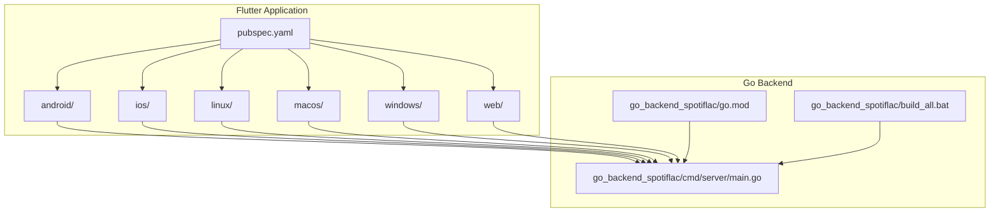
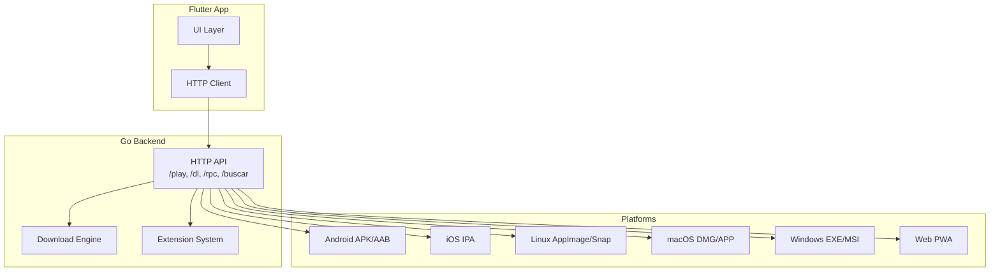
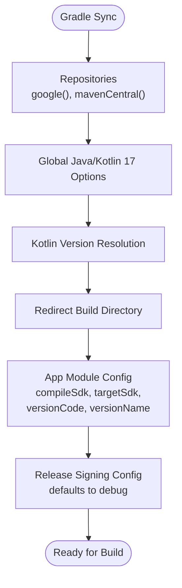
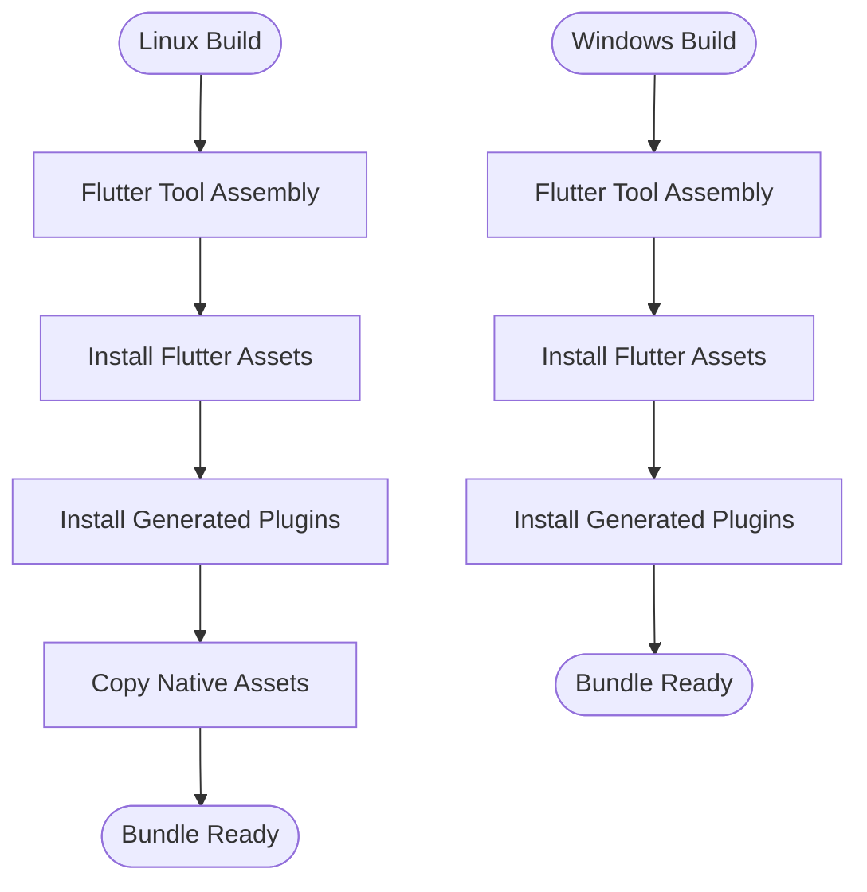
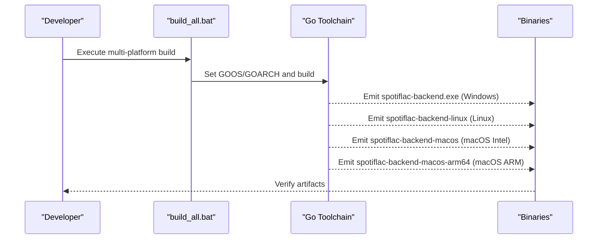
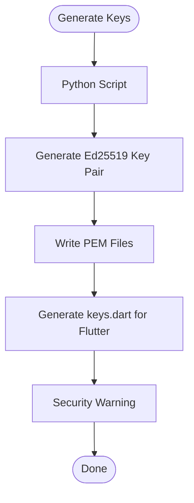
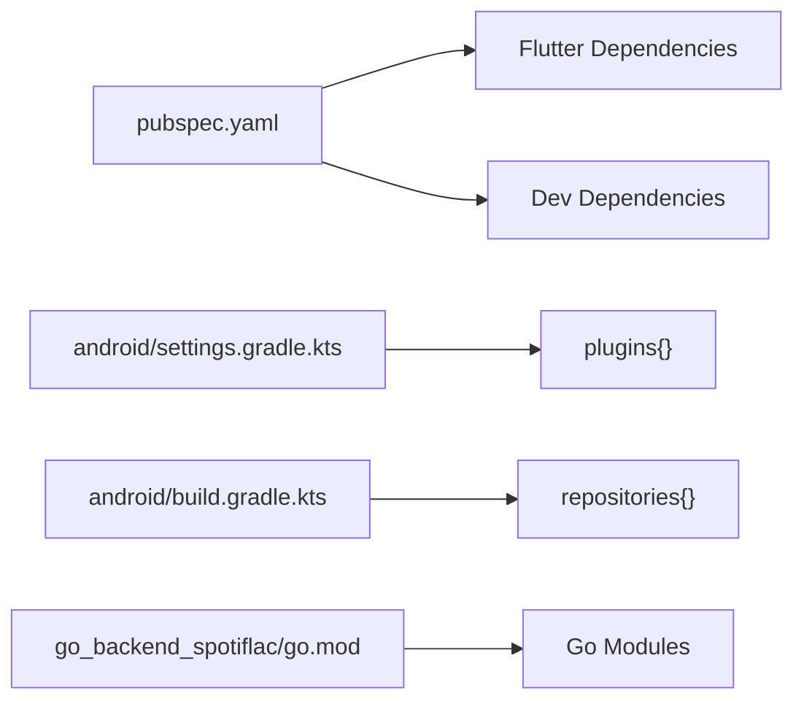

# Deployment and Distribution

<cite>
**Referenced Files in This Document**
- [pubspec.yaml](file://pubspec.yaml)
- [android/build.gradle.kts](file://android/build.gradle.kts)
- [android/app/build.gradle.kts](file://android/app/build.gradle.kts)
- [android/settings.gradle.kts](file://android/settings.gradle.kts)
- [android/local.properties](file://android/local.properties)
- [android/gradle.properties](file://android/gradle.properties)
- [ios/Runner/Info.plist](file://ios/Runner/Info.plist)
- [macos/Runner/Info.plist](file://macos/Runner/Info.plist)
- [linux/CMakeLists.txt](file://linux/CMakeLists.txt)
- [windows/CMakeLists.txt](file://windows/CMakeLists.txt)
- [web/index.html](file://web/index.html)
- [go_backend_spotiflac/go.mod](file://go_backend_spotiflac/go.mod)
- [go_backend_spotiflac/cmd/server/main.go](file://go_backend_spotiflac/cmd/server/main.go)
- [go_backend_spotiflac/build_all.bat](file://go_backend_spotiflac/build_all.bat)
- [run_windows.bat](file://run_windows.bat)
- [scripts/generate_keys.py](file://scripts/generate_keys.py)
</cite>

## Table of Contents
1. [Introduction](#introduction)
2. [Project Structure](#project-structure)
3. [Core Components](#core-components)
4. [Architecture Overview](#architecture-overview)
5. [Detailed Component Analysis](#detailed-component-analysis)
6. [Dependency Analysis](#dependency-analysis)
7. [Performance Considerations](#performance-considerations)
8. [Troubleshooting Guide](#troubleshooting-guide)
9. [Conclusion](#conclusion)
10. [Appendices](#appendices)

## Introduction
This document explains the multi-platform build and release processes for the project, covering build automation systems, asset management, distribution strategies, CI/CD pipeline integration, automated testing, deployment procedures, platform-specific requirements, signing procedures, distribution channels, extension store deployment, update mechanisms, and version management strategies. It synthesizes the existing build configuration files and backend automation scripts to provide practical guidance for repeatable, secure, and scalable releases across Android, iOS, Linux, macOS, Windows, and Web targets.

## Project Structure
The project is a Flutter application with a companion Go backend service that powers audio download and metadata operations. Platform-specific build configurations are provided under android/, ios/, linux/, macos/, windows/, and web/. The Go backend is located under go_backend_spotiflac/ and includes a batch script to produce binaries for multiple platforms.

**Diagram sources**
- [pubspec.yaml:1-108](file://pubspec.yaml#L1-L108)
- [android/build.gradle.kts:1-65](file://android/build.gradle.kts#L1-L65)
- [ios/Runner/Info.plist:1-50](file://ios/Runner/Info.plist#L1-L50)
- [linux/CMakeLists.txt:1-129](file://linux/CMakeLists.txt#L1-L129)
- [macos/Runner/Info.plist:1-33](file://macos/Runner/Info.plist#L1-L33)
- [windows/CMakeLists.txt:1-109](file://windows/CMakeLists.txt#L1-L109)
- [web/index.html:1-39](file://web/index.html#L1-L39)
- [go_backend_spotiflac/go.mod:1-39](file://go_backend_spotiflac/go.mod#L1-L39)
- [go_backend_spotiflac/cmd/server/main.go:1-800](file://go_backend_spotiflac/cmd/server/main.go#L1-L800)
- [go_backend_spotiflac/build_all.bat:1-39](file://go_backend_spotiflac/build_all.bat#L1-L39)

**Section sources**
- [pubspec.yaml:1-108](file://pubspec.yaml#L1-L108)
- [android/build.gradle.kts:1-65](file://android/build.gradle.kts#L1-L65)
- [ios/Runner/Info.plist:1-50](file://ios/Runner/Info.plist#L1-L50)
- [linux/CMakeLists.txt:1-129](file://linux/CMakeLists.txt#L1-L129)
- [macos/Runner/Info.plist:1-33](file://macos/Runner/Info.plist#L1-L33)
- [windows/CMakeLists.txt:1-109](file://windows/CMakeLists.txt#L1-L109)
- [web/index.html:1-39](file://web/index.html#L1-L39)
- [go_backend_spotiflac/go.mod:1-39](file://go_backend_spotiflac/go.mod#L1-L39)
- [go_backend_spotiflac/cmd/server/main.go:1-800](file://go_backend_spotiflac/cmd/server/main.go#L1-L800)
- [go_backend_spotiflac/build_all.bat:1-39](file://go_backend_spotiflac/build_all.bat#L1-L39)

## Core Components
- Flutter application configuration and assets:
  - Versioning and dependencies are defined in pubspec.yaml.
  - Asset and font declarations support multi-language and UI resources.
- Android build system:
  - Centralized Gradle configuration sets Java/Kotlin compatibility and build directory layout.
  - App-level Gradle defines compile/target SDK, versioning, and release signing defaults.
  - Settings and local properties define SDK paths and Flutter versioning.
- iOS/macOS build systems:
  - Info.plist files define bundle identifiers, display names, and version fields mapped to Flutter build variables.
- Linux/macOS/Windows build systems:
  - CMakeLists.txt configure bundling, installation, and asset copying for desktop targets.
- Web build:
  - index.html declares manifest, icons, and base href placeholders for Flutter web.
- Go backend:
  - go.mod defines module and toolchain.
  - build_all.bat automates cross-platform binary generation.
  - main.go orchestrates HTTP endpoints, session management, and platform-specific helpers.

**Section sources**
- [pubspec.yaml:1-108](file://pubspec.yaml#L1-L108)
- [android/build.gradle.kts:1-65](file://android/build.gradle.kts#L1-L65)
- [android/app/build.gradle.kts:1-55](file://android/app/build.gradle.kts#L1-L55)
- [android/settings.gradle.kts:1-27](file://android/settings.gradle.kts#L1-L27)
- [android/local.properties:1-5](file://android/local.properties#L1-L5)
- [android/gradle.properties:1-7](file://android/gradle.properties#L1-L7)
- [ios/Runner/Info.plist:1-50](file://ios/Runner/Info.plist#L1-L50)
- [macos/Runner/Info.plist:1-33](file://macos/Runner/Info.plist#L1-L33)
- [linux/CMakeLists.txt:1-129](file://linux/CMakeLists.txt#L1-L129)
- [windows/CMakeLists.txt:1-109](file://windows/CMakeLists.txt#L1-L109)
- [web/index.html:1-39](file://web/index.html#L1-L39)
- [go_backend_spotiflac/go.mod:1-39](file://go_backend_spotiflac/go.mod#L1-L39)
- [go_backend_spotiflac/build_all.bat:1-39](file://go_backend_spotiflac/build_all.bat#L1-L39)
- [go_backend_spotiflac/cmd/server/main.go:1-800](file://go_backend_spotiflac/cmd/server/main.go#L1-L800)

## Architecture Overview
The Flutter app communicates with the Go backend via HTTP endpoints. The backend manages downloads, metadata enrichment, and extension-driven features. Desktop and mobile targets are built using platform-specific build systems, while the Go backend is cross-compiled per OS/arch.

**Diagram sources**
- [go_backend_spotiflac/cmd/server/main.go:124-134](file://go_backend_spotiflac/cmd/server/main.go#L124-L134)
- [linux/CMakeLists.txt:78-129](file://linux/CMakeLists.txt#L78-L129)
- [windows/CMakeLists.txt:61-109](file://windows/CMakeLists.txt#L61-L109)
- [android/app/build.gradle.kts:38-44](file://android/app/build.gradle.kts#L38-L44)
- [ios/Runner/Info.plist:19-24](file://ios/Runner/Info.plist#L19-L24)
- [macos/Runner/Info.plist:19-22](file://macos/Runner/Info.plist#L19-L22)
- [web/index.html:17-33](file://web/index.html#L17-L33)

## Detailed Component Analysis

### Flutter Build and Versioning
- Versioning:
  - pubspec.yaml defines the application version and build number.
  - Android/iOS Info.plist map CFBundleShortVersionString and CFBundleVersion to Flutter build variables.
- Assets and fonts:
  - Assets and fonts are declared for localization and UI.
- Launcher icons:
  - flutter_launcher_icons generates platform-specific icons.

Practical example paths:
- [pubspec.yaml:4-4](file://pubspec.yaml#L4-L4)
- [ios/Runner/Info.plist:19-24](file://ios/Runner/Info.plist#L19-L24)
- [macos/Runner/Info.plist:19-22](file://macos/Runner/Info.plist#L19-L22)

**Section sources**
- [pubspec.yaml:4-4](file://pubspec.yaml#L4-L4)
- [ios/Runner/Info.plist:19-24](file://ios/Runner/Info.plist#L19-L24)
- [macos/Runner/Info.plist:19-22](file://macos/Runner/Info.plist#L19-L22)

### Android Build Automation and Signing
- Central Gradle configuration:
  - Sets Java/Kotlin 17 compatibility globally and redirects build directories.
- App-level configuration:
  - Uses Flutter-managed compile/target SDK and version fields.
  - Release signing defaults to debug configuration; production requires a proper keystore.
- Project settings and properties:
  - SDK paths and Flutter versioning are defined in local.properties and gradle.properties.

Practical example paths:
- [android/build.gradle.kts:13-22](file://android/build.gradle.kts#L13-L22)
- [android/app/build.gradle.kts:34-35](file://android/app/build.gradle.kts#L34-L35)
- [android/app/build.gradle.kts:38-44](file://android/app/build.gradle.kts#L38-L44)
- [android/local.properties:1-5](file://android/local.properties#L1-L5)
- [android/gradle.properties:1-7](file://android/gradle.properties#L1-L7)

**Diagram sources**
- [android/build.gradle.kts:6-46](file://android/build.gradle.kts#L6-L46)
- [android/app/build.gradle.kts:8-36](file://android/app/build.gradle.kts#L8-L36)
- [android/app/build.gradle.kts:38-44](file://android/app/build.gradle.kts#L38-L44)

**Section sources**
- [android/build.gradle.kts:1-65](file://android/build.gradle.kts#L1-L65)
- [android/app/build.gradle.kts:1-55](file://android/app/build.gradle.kts#L1-L55)
- [android/local.properties:1-5](file://android/local.properties#L1-L5)
- [android/gradle.properties:1-7](file://android/gradle.properties#L1-L7)

### iOS/macOS Build and Versioning
- iOS Info.plist:
  - Bundle short version and version map to Flutter build name and number.
- macOS Info.plist:
  - Similar mapping for macOS with deployment target and main nib/class.

Practical example paths:
- [ios/Runner/Info.plist:19-24](file://ios/Runner/Info.plist#L19-L24)
- [macos/Runner/Info.plist:19-22](file://macos/Runner/Info.plist#L19-L22)

**Section sources**
- [ios/Runner/Info.plist:1-50](file://ios/Runner/Info.plist#L1-L50)
- [macos/Runner/Info.plist:1-33](file://macos/Runner/Info.plist#L1-L33)

### Linux/macOS/Windows Desktop Bundling
- Linux:
  - Defines APPLICATION_ID, RPATH, installs Flutter assets and plugins, and copies native assets.
- Windows:
  - Supports Debug/Profile/Release modes, installs Flutter libraries and assets alongside the executable.
- macOS:
  - Similar to Linux with application bundle structure and asset installation.

Practical example paths:
- [linux/CMakeLists.txt:7-129](file://linux/CMakeLists.txt#L7-L129)
- [windows/CMakeLists.txt:1-109](file://windows/CMakeLists.txt#L1-L109)
- [macos/Runner/Info.plist:1-33](file://macos/Runner/Info.plist#L1-L33)

**Diagram sources**
- [linux/CMakeLists.txt:49-129](file://linux/CMakeLists.txt#L49-L129)
- [windows/CMakeLists.txt:48-109](file://windows/CMakeLists.txt#L48-L109)

**Section sources**
- [linux/CMakeLists.txt:1-129](file://linux/CMakeLists.txt#L1-L129)
- [windows/CMakeLists.txt:1-109](file://windows/CMakeLists.txt#L1-L109)

### Web Build and Manifest
- index.html:
  - Declares manifest.json, favicon, and Apple touch icon for PWA support.
  - Base href placeholder is replaced by Flutter build arguments.

Practical example paths:
- [web/index.html:17-33](file://web/index.html#L17-L33)

**Section sources**
- [web/index.html:1-39](file://web/index.html#L1-L39)

### Go Backend Cross-Platform Build
- go.mod:
  - Defines module and toolchain for the backend service.
- build_all.bat:
  - Produces Windows, Linux, macOS Intel, and macOS ARM binaries.
- main.go:
  - Exposes HTTP endpoints for search, playback, download, and RPC operations.
  - Includes platform-specific helpers (e.g., FFmpeg auto-installation on Windows).

Practical example paths:
- [go_backend_spotiflac/go.mod:1-39](file://go_backend_spotiflac/go.mod#L1-L39)
- [go_backend_spotiflac/build_all.bat:1-39](file://go_backend_spotiflac/build_all.bat#L1-L39)
- [go_backend_spotiflac/cmd/server/main.go:107-134](file://go_backend_spotiflac/cmd/server/main.go#L107-L134)

**Diagram sources**
- [go_backend_spotiflac/build_all.bat:1-39](file://go_backend_spotiflac/build_all.bat#L1-L39)
- [go_backend_spotiflac/cmd/server/main.go:107-134](file://go_backend_spotiflac/cmd/server/main.go#L107-L134)

**Section sources**
- [go_backend_spotiflac/go.mod:1-39](file://go_backend_spotiflac/go.mod#L1-L39)
- [go_backend_spotiflac/build_all.bat:1-39](file://go_backend_spotiflac/build_all.bat#L1-L39)
- [go_backend_spotiflac/cmd/server/main.go:1-800](file://go_backend_spotiflac/cmd/server/main.go#L1-L800)

### Local Development Workflow (Windows)
- run_windows.bat:
  - Builds the Go backend and launches the Flutter app on Windows.

Practical example path:
- [run_windows.bat:1-15](file://run_windows.bat#L1-L15)

**Section sources**
- [run_windows.bat:1-15](file://run_windows.bat#L1-L15)

### Security Keys and Code Signing
- scripts/generate_keys.py:
  - Generates Ed25519 keypair and writes PEM files and a Dart keys.dart for verification in Flutter.
  - Emphasizes safe handling of private keys.

Practical example paths:
- [scripts/generate_keys.py:1-121](file://scripts/generate_keys.py#L1-L121)

**Diagram sources**
- [scripts/generate_keys.py:1-121](file://scripts/generate_keys.py#L1-L121)

**Section sources**
- [scripts/generate_keys.py:1-121](file://scripts/generate_keys.py#L1-L121)

## Dependency Analysis
- Flutter dependencies and dev_dependencies are declared in pubspec.yaml.
- Android Gradle plugins and repositories are configured in settings.gradle.kts and build.gradle.kts.
- Go backend dependencies are managed in go.mod.

**Diagram sources**
- [pubspec.yaml:9-82](file://pubspec.yaml#L9-L82)
- [android/settings.gradle.kts:20-24](file://android/settings.gradle.kts#L20-L24)
- [android/build.gradle.kts:6-11](file://android/build.gradle.kts#L6-L11)
- [go_backend_spotiflac/go.mod:7-18](file://go_backend_spotiflac/go.mod#L7-L18)

**Section sources**
- [pubspec.yaml:9-82](file://pubspec.yaml#L9-L82)
- [android/settings.gradle.kts:1-27](file://android/settings.gradle.kts#L1-L27)
- [android/build.gradle.kts:1-65](file://android/build.gradle.kts#L1-L65)
- [go_backend_spotiflac/go.mod:1-39](file://go_backend_spotiflac/go.mod#L1-L39)

## Performance Considerations
- Android Gradle:
  - JVM memory tuning via gradle.properties supports large builds.
- Flutter:
  - Asset and font declarations should be optimized to reduce bundle size.
- Go backend:
  - Cross-compilation flags and CGO toggles are set in build_all.bat; disabling CGO reduces binary size on some targets.
- Desktop bundling:
  - Linux/macOS/Windows CMakeLists install only necessary assets and libraries to minimize payload.

[No sources needed since this section provides general guidance]

## Troubleshooting Guide
- Android signing:
  - Release builds currently default to debug signing; configure a keystore for production.
- Go backend dependencies:
  - Ensure Go toolchain meets go.mod requirements.
- Windows runtime:
  - The backend attempts to auto-provision FFmpeg on Windows; verify network access and extraction permissions.
- Flutter web base href:
  - Confirm base href replacement during web builds.

**Section sources**
- [android/app/build.gradle.kts:38-44](file://android/app/build.gradle.kts#L38-L44)
- [go_backend_spotiflac/go.mod:3-5](file://go_backend_spotiflac/go.mod#L3-L5)
- [go_backend_spotiflac/cmd/server/main.go:57-105](file://go_backend_spotiflac/cmd/server/main.go#L57-L105)
- [web/index.html:17-17](file://web/index.html#L17-L17)

## Conclusion
The project’s build and distribution pipeline combines Flutter’s cross-platform capabilities with platform-specific Gradle, CMake, and Xcode configurations, and a Go backend that is cross-compiled for multiple operating systems. Versioning is centralized in pubspec.yaml and reflected in platform Info/plists. Security is addressed through key generation scripts. The existing scripts and configurations provide a strong foundation for CI/CD automation, desktop bundling, and extension-driven functionality.

[No sources needed since this section summarizes without analyzing specific files]

## Appendices

### CI/CD Pipeline Integration Guidance
- Trigger jobs on version bumps or tags.
- Cache Gradle, CocoaPods, and Flutter dependencies.
- Run tests and linting prior to building.
- Build and sign Android artifacts (APK/AAB) with a secure keystore.
- Build iOS artifacts with proper provisioning profiles.
- Build desktop bundles using platform-specific CMake steps.
- Build Go backend binaries for all supported OS/arch combinations.
- Publish artifacts to internal or external artifact repositories.
- Update extension store manifests and publish updates.

[No sources needed since this section provides general guidance]

### Automated Testing Integration
- Flutter unit/integration tests:
  - Use flutter test in CI to validate UI logic and services.
- Backend tests:
  - Run go test for Go backend components and HTTP handlers.
- Platform-specific checks:
  - Validate Info.plist entries and Gradle configurations.

[No sources needed since this section provides general guidance]

### Deployment Procedures
- Android:
  - Produce signed APK/AAB and upload to stores or enterprise distribution.
- iOS:
  - Archive and export IPA with appropriate provisioning and certificates.
- Desktop:
  - Package Linux/macOS/Windows bundles and distribute via installers or package managers.
- Web:
  - Host PWA assets and ensure manifest and service worker paths align with hosting base href.

[No sources needed since this section provides general guidance]

### Platform-Specific Requirements
- Android:
  - Java/Kotlin 17 compatibility and desugaring enabled.
  - Versioning via Flutter-managed fields.
- iOS/macOS:
  - Bundle identifiers and version fields mapped to Flutter build variables.
- Linux/macOS/Windows:
  - CMake-based bundling with asset and plugin installation.

**Section sources**
- [android/build.gradle.kts:13-22](file://android/build.gradle.kts#L13-L22)
- [android/app/build.gradle.kts:34-35](file://android/app/build.gradle.kts#L34-L35)
- [ios/Runner/Info.plist:19-24](file://ios/Runner/Info.plist#L19-L24)
- [macos/Runner/Info.plist:19-22](file://macos/Runner/Info.plist#L19-L22)
- [linux/CMakeLists.txt:78-129](file://linux/CMakeLists.txt#L78-L129)
- [windows/CMakeLists.txt:61-109](file://windows/CMakeLists.txt#L61-L109)

### Signing Procedures
- Android:
  - Configure a keystore and signingConfig for release builds.
- iOS/macOS:
  - Use Apple Developer certificates and provisioning profiles.
- Code signing:
  - Use generated Ed25519 keys for verifying codes in Flutter.

**Section sources**
- [android/app/build.gradle.kts:38-44](file://android/app/build.gradle.kts#L38-L44)
- [scripts/generate_keys.py:1-121](file://scripts/generate_keys.py#L1-L121)

### Distribution Channels
- Android:
  - Play Store or internal distribution.
- iOS:
  - App Store or Enterprise distribution.
- Desktop:
  - Direct download, package managers, or app stores.
- Web:
  - Static hosting with PWA support.

[No sources needed since this section provides general guidance]

### Extension Store Deployment and Update Mechanisms
- The backend exposes extension management endpoints and health checks suitable for store-like workflows.
- Use extension upgrade and load APIs to manage store updates.

**Section sources**
- [go_backend_spotiflac/cmd/server/main.go:721-799](file://go_backend_spotiflac/cmd/server/main.go#L721-L799)

### Version Management Strategies
- Flutter version and build number in pubspec.yaml.
- Android/iOS Info.plist version fields mapped to Flutter build variables.
- Go backend version exposed via HTTP index endpoint.

**Section sources**
- [pubspec.yaml:4-4](file://pubspec.yaml#L4-L4)
- [ios/Runner/Info.plist:19-24](file://ios/Runner/Info.plist#L19-L24)
- [macos/Runner/Info.plist:19-22](file://macos/Runner/Info.plist#L19-L22)
- [go_backend_spotiflac/cmd/server/main.go:288-295](file://go_backend_spotiflac/cmd/server/main.go#L288-L295)