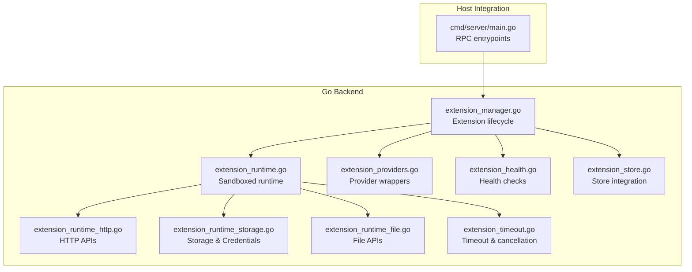
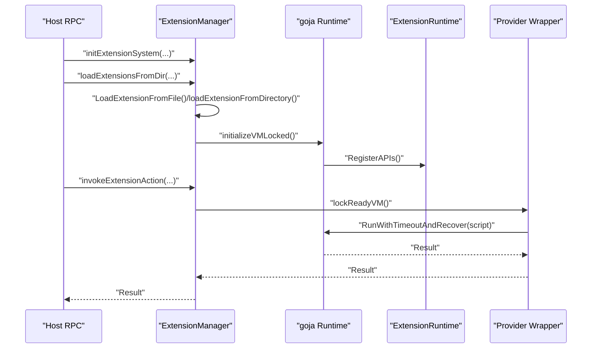
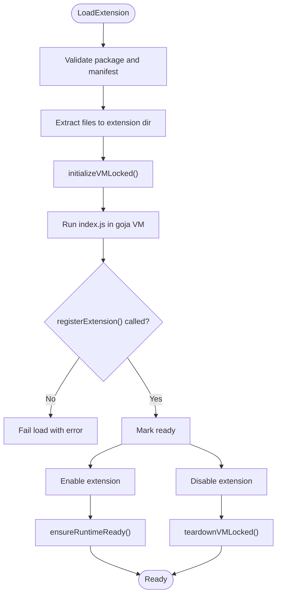
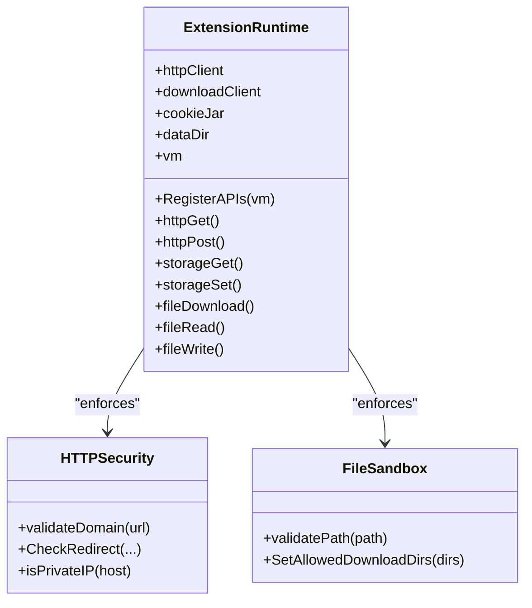
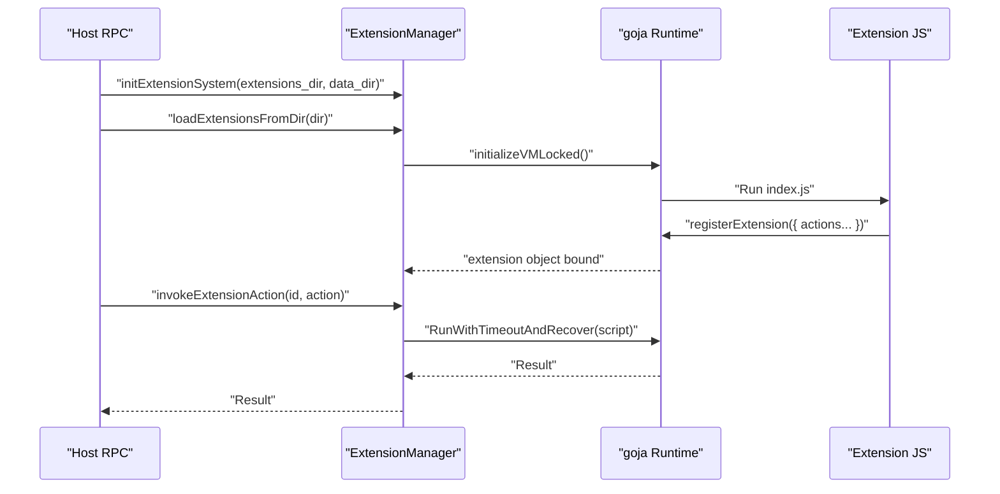
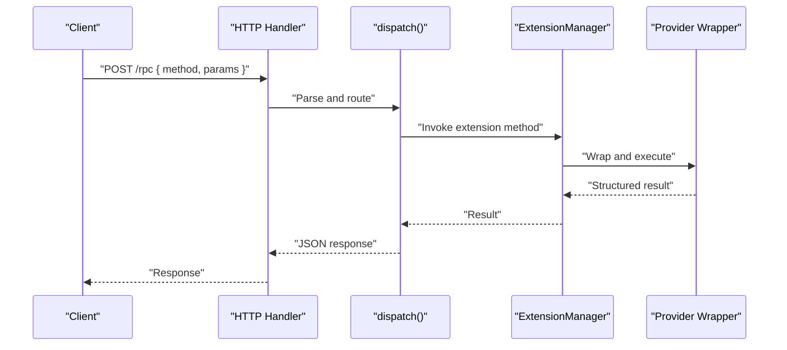
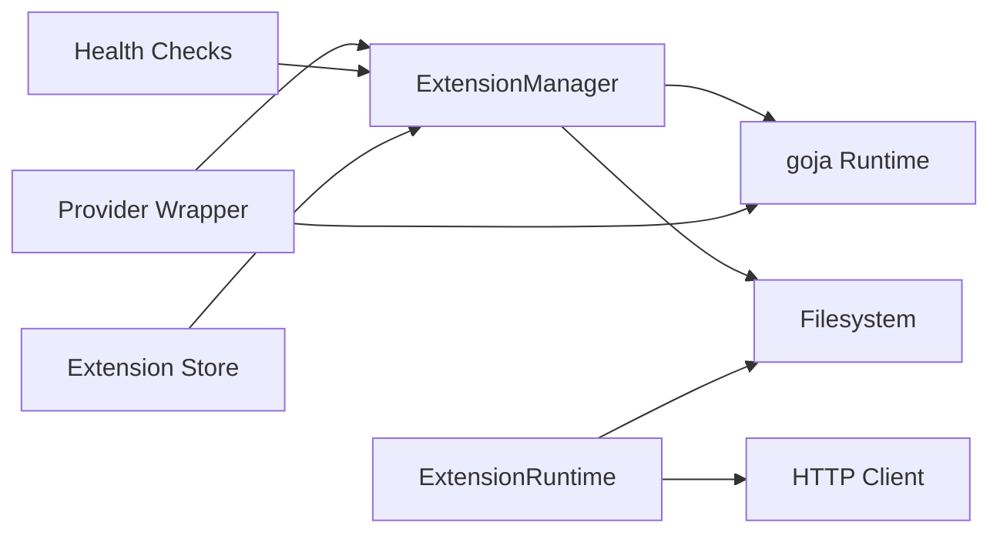

# Extension Architecture

<cite>
**Referenced Files in This Document**
- [extension_manager.go](file://go_backend_spotiflac/extension_manager.go)
- [extension_runtime.go](file://go_backend_spotiflac/extension_runtime.go)
- [extension_manifest.go](file://go_backend_spotiflac/extension_manifest.go)
- [extension_runtime_http.go](file://go_backend_spotiflac/extension_runtime_http.go)
- [extension_runtime_storage.go](file://go_backend_spotiflac/extension_runtime_storage.go)
- [extension_runtime_file.go](file://go_backend_spotiflac/extension_runtime_file.go)
- [extension_timeout.go](file://go_backend_spotiflac/extension_timeout.go)
- [extension_providers.go](file://go_backend_spotiflac/extension_providers.go)
- [extension_health.go](file://go_backend_spotiflac/extension_health.go)
- [extension_store.go](file://go_backend_spotiflac/extension_store.go)
- [main.go](file://go_backend_spotiflac/cmd/server/main.go)
</cite>

## Table of Contents
1. [Introduction](#introduction)
2. [Project Structure](#project-structure)
3. [Core Components](#core-components)
4. [Architecture Overview](#architecture-overview)
5. [Detailed Component Analysis](#detailed-component-analysis)
6. [Dependency Analysis](#dependency-analysis)
7. [Performance Considerations](#performance-considerations)
8. [Troubleshooting Guide](#troubleshooting-guide)
9. [Conclusion](#conclusion)

## Introduction
This document explains the extension architecture for integrating JavaScript-based plugins into the backend system. It covers how the Go backend initializes and manages JavaScript extensions powered by the goja engine, how extensions are sandboxed and isolated, and how they expose APIs to the host system. It also documents the extension lifecycle, loading mechanisms, security boundaries, and practical patterns for extension registration, API exposure, and inter-process communication.

## Project Structure
The extension system is implemented in the Go backend module (`go_backend_spotiflac`). Key areas:
- Extension lifecycle and VM management
- Runtime sandbox exposing safe APIs
- Manifest-driven capability and permission model
- Health monitoring and store integration
- Provider wrappers for metadata/download/lyrics

**Diagram sources**
- [extension_manager.go:120-139](file://go_backend_spotiflac/extension_manager.go#L120-L139)
- [extension_runtime.go:84-147](file://go_backend_spotiflac/extension_runtime.go#L84-L147)
- [extension_runtime_http.go:14-36](file://go_backend_spotiflac/extension_runtime_http.go#L14-L36)
- [extension_runtime_storage.go:19-26](file://go_backend_spotiflac/extension_runtime_storage.go#L19-L26)
- [extension_runtime_file.go:16-26](file://go_backend_spotiflac/extension_runtime_file.go#L16-L26)
- [extension_timeout.go:22-44](file://go_backend_spotiflac/extension_timeout.go#L22-L44)
- [extension_providers.go:523-542](file://go_backend_spotiflac/extension_providers.go#L523-L542)
- [extension_health.go:41-99](file://go_backend_spotiflac/extension_health.go#L41-L99)
- [extension_store.go:120-152](file://go_backend_spotiflac/extension_store.go#L120-L152)
- [main.go:721-800](file://go_backend_spotiflac/cmd/server/main.go#L721-L800)

**Section sources**
- [extension_manager.go:120-139](file://go_backend_spotiflac/extension_manager.go#L120-L139)
- [extension_runtime.go:84-147](file://go_backend_spotiflac/extension_runtime.go#L84-L147)
- [extension_manifest.go:116-138](file://go_backend_spotiflac/extension_manifest.go#L116-L138)
- [extension_runtime_http.go:14-36](file://go_backend_spotiflac/extension_runtime_http.go#L14-L36)
- [extension_runtime_storage.go:19-26](file://go_backend_spotiflac/extension_runtime_storage.go#L19-L26)
- [extension_runtime_file.go:16-26](file://go_backend_spotiflac/extension_runtime_file.go#L16-L26)
- [extension_timeout.go:22-44](file://go_backend_spotiflac/extension_timeout.go#L22-L44)
- [extension_providers.go:523-542](file://go_backend_spotiflac/extension_providers.go#L523-L542)
- [extension_health.go:41-99](file://go_backend_spotiflac/extension_health.go#L41-L99)
- [extension_store.go:120-152](file://go_backend_spotiflac/extension_store.go#L120-L152)
- [main.go:721-800](file://go_backend_spotiflac/cmd/server/main.go#L721-L800)

## Core Components
- Extension Manager: Loads/unloads extensions, validates packages, initializes VMs, and orchestrates lifecycle.
- Extension Runtime: Creates per-extension VMs, registers sandboxed APIs, and enforces security policies.
- Manifest: Defines extension capabilities, permissions, and metadata.
- Provider Wrappers: Bridge extension JS calls to Go backend services.
- Store and Health: Registry-backed discovery and health monitoring.

**Section sources**
- [extension_manager.go:120-139](file://go_backend_spotiflac/extension_manager.go#L120-L139)
- [extension_runtime.go:84-147](file://go_backend_spotiflac/extension_runtime.go#L84-L147)
- [extension_manifest.go:116-138](file://go_backend_spotiflac/extension_manifest.go#L116-L138)
- [extension_providers.go:523-542](file://go_backend_spotiflac/extension_providers.go#L523-L542)
- [extension_health.go:41-99](file://go_backend_spotiflac/extension_health.go#L41-L99)
- [extension_store.go:120-152](file://go_backend_spotiflac/extension_store.go#L120-L152)

## Architecture Overview
The system integrates extensions through a controlled pipeline:
- Host exposes RPC endpoints to manage extensions.
- Extension Manager loads packages and initializes VMs.
- Extension Runtime registers APIs and enforces sandboxing.
- Providers wrap extension calls to backend services.
- Health and Store provide operational visibility and distribution.

**Diagram sources**
- [main.go:721-800](file://go_backend_spotiflac/cmd/server/main.go#L721-L800)
- [extension_manager.go:158-294](file://go_backend_spotiflac/extension_manager.go#L158-L294)
- [extension_runtime.go:424-533](file://go_backend_spotiflac/extension_runtime.go#L424-L533)
- [extension_timeout.go:120-134](file://go_backend_spotiflac/extension_timeout.go#L120-L134)
- [extension_providers.go:535-542](file://go_backend_spotiflac/extension_providers.go#L535-L542)

## Detailed Component Analysis

### Extension Lifecycle Management
- Loading: Validates .spotiflac-ext archives, extracts manifest and index.js, ensures safe paths, and creates directories.
- Initialization: Builds a fresh goja VM, injects console and registerExtension, executes index.js, and verifies extension registration.
- Enabling/Disabling: Ensures runtime readiness on enable, tears down on disable.
- Upgrading: Compares versions, replaces files atomically, preserves enabled state, and reinitializes if needed.
- Cleanup: Runs optional cleanup hook and flushes storage.

**Diagram sources**
- [extension_manager.go:158-294](file://go_backend_spotiflac/extension_manager.go#L158-L294)
- [extension_manager.go:296-344](file://go_backend_spotiflac/extension_manager.go#L296-L344)
- [extension_manager.go:567-584](file://go_backend_spotiflac/extension_manager.go#L567-L584)
- [extension_manager.go:586-640](file://go_backend_spotiflac/extension_manager.go#L586-L640)

**Section sources**
- [extension_manager.go:158-294](file://go_backend_spotiflac/extension_manager.go#L158-L294)
- [extension_manager.go:296-344](file://go_backend_spotiflac/extension_manager.go#L296-L344)
- [extension_manager.go:567-640](file://go_backend_spotiflac/extension_manager.go#L567-L640)
- [extension_manager.go:758-896](file://go_backend_spotiflac/extension_manager.go#L758-L896)

### Sandbox and Security Boundaries
- Network restrictions: HTTPS enforced, optional AllowHTTP, strict domain allowlist, redirect blocking, private IP detection.
- File access: Strict sandbox; only relative paths within extension data dir allowed unless explicit file permission; configurable allowed download directories.
- Storage: JSON-backed key-value store with periodic flushing and encryption for credentials.
- Execution safety: Timeout enforcement, panic recovery, VM interruption, and thread-safety via mutexes.

**Diagram sources**
- [extension_runtime.go:84-147](file://go_backend_spotiflac/extension_runtime.go#L84-L147)
- [extension_runtime_http.go:38-69](file://go_backend_spotiflac/extension_runtime_http.go#L38-L69)
- [extension_runtime_http.go:250-286](file://go_backend_spotiflac/extension_runtime_http.go#L250-L286)
- [extension_runtime_file.go:75-108](file://go_backend_spotiflac/extension_runtime_file.go#L75-L108)

**Section sources**
- [extension_runtime_http.go:38-69](file://go_backend_spotiflac/extension_runtime_http.go#L38-L69)
- [extension_runtime_http.go:250-286](file://go_backend_spotiflac/extension_runtime_http.go#L250-L286)
- [extension_runtime_file.go:75-108](file://go_backend_spotiflac/extension_runtime_file.go#L75-L108)
- [extension_runtime_storage.go:19-26](file://go_backend_spotiflac/extension_runtime_storage.go#L19-L26)

### Extension Registration and API Exposure
- Host exposes RPC methods to initialize the extension system, load/unload/remove, enable/disable, invoke actions, and manage settings.
- Extensions register themselves via a special global function and export an object with action handlers.
- The runtime registers a curated set of APIs under namespaces like http, storage, credentials, file, ffmpeg, matching, utils, and log.

**Diagram sources**
- [main.go:721-800](file://go_backend_spotiflac/cmd/server/main.go#L721-L800)
- [extension_manager.go:296-344](file://go_backend_spotiflac/extension_manager.go#L296-L344)
- [extension_runtime.go:424-533](file://go_backend_spotiflac/extension_runtime.go#L424-L533)
- [extension_timeout.go:120-134](file://go_backend_spotiflac/extension_timeout.go#L120-L134)

**Section sources**
- [main.go:721-800](file://go_backend_spotiflac/cmd/server/main.go#L721-L800)
- [extension_runtime.go:424-533](file://go_backend_spotiflac/extension_runtime.go#L424-L533)
- [extension_timeout.go:22-44](file://go_backend_spotiflac/extension_timeout.go#L22-L44)

### Inter-Process Communication Patterns
- RPC over HTTP: The backend exposes a single endpoint that dispatches to various methods, including extension management and invocation.
- Provider wrappers: Convert JS results to structured Go types and vice versa, enabling seamless integration with backend services.
- Cancellation and timeouts: Requests can be cancelled or timed out safely, with proper VM interruption and recovery.

**Diagram sources**
- [main.go:359-385](file://go_backend_spotiflac/cmd/server/main.go#L359-L385)
- [main.go:555-720](file://go_backend_spotiflac/cmd/server/main.go#L555-L720)
- [extension_providers.go:523-542](file://go_backend_spotiflac/extension_providers.go#L523-L542)

**Section sources**
- [main.go:359-385](file://go_backend_spotiflac/cmd/server/main.go#L359-L385)
- [main.go:555-720](file://go_backend_spotiflac/cmd/server/main.go#L555-L720)
- [extension_providers.go:523-542](file://go_backend_spotiflac/extension_providers.go#L523-L542)

### Extension Isolation and Memory Management
- Per-extension VM: Each extension runs in its own goja VM with isolated globals and state.
- Mutex protection: VM access is guarded to prevent concurrent usage and ensure thread safety.
- Storage caching: In-memory caches with periodic flushes and encryption for sensitive data.
- Resource cleanup: Explicit teardown routines for HTTP clients, cookie jars, and storage flushers.

**Section sources**
- [extension_manager.go:104-118](file://go_backend_spotiflac/extension_manager.go#L104-L118)
- [extension_runtime_storage.go:19-26](file://go_backend_spotiflac/extension_runtime_storage.go#L19-L26)
- [extension_runtime_storage.go:109-141](file://go_backend_spotiflac/extension_runtime_storage.go#L109-L141)
- [extension_runtime.go:541-554](file://go_backend_spotiflac/extension_runtime.go#L541-L554)

### Practical Examples
- Extension registration: The extension must call the registration function to expose actions to the host.
- API exposure: The runtime exposes typed APIs (HTTP, storage, file, credentials, matching, utils, log) under global namespaces.
- Invoking actions: Host sends an RPC to invoke a named action on an enabled extension with timeout protection.

**Section sources**
- [extension_runtime.go:424-533](file://go_backend_spotiflac/extension_runtime.go#L424-L533)
- [extension_manager.go:1134-1201](file://go_backend_spotiflac/extension_manager.go#L1134-L1201)
- [main.go:749-750](file://go_backend_spotiflac/cmd/server/main.go#L749-L750)

## Dependency Analysis
The extension system exhibits clear separation of concerns:
- Extension Manager depends on goja and filesystem operations.
- Extension Runtime depends on HTTP transport, cookie jar, and filesystem.
- Provider Wrappers depend on Extension Manager and goja.
- Health and Store depend on Extension Manager and HTTP.

**Diagram sources**
- [extension_manager.go:120-139](file://go_backend_spotiflac/extension_manager.go#L120-L139)
- [extension_runtime.go:84-147](file://go_backend_spotiflac/extension_runtime.go#L84-L147)
- [extension_providers.go:523-542](file://go_backend_spotiflac/extension_providers.go#L523-L542)
- [extension_health.go:41-99](file://go_backend_spotiflac/extension_health.go#L41-L99)
- [extension_store.go:120-152](file://go_backend_spotiflac/extension_store.go#L120-L152)

**Section sources**
- [extension_manager.go:120-139](file://go_backend_spotiflac/extension_manager.go#L120-L139)
- [extension_runtime.go:84-147](file://go_backend_spotiflac/extension_runtime.go#L84-L147)
- [extension_providers.go:523-542](file://go_backend_spotiflac/extension_providers.go#L523-L542)
- [extension_health.go:41-99](file://go_backend_spotiflac/extension_health.go#L41-L99)
- [extension_store.go:120-152](file://go_backend_spotiflac/extension_store.go#L120-L152)

## Performance Considerations
- VM initialization cost: Creating a new VM per extension adds overhead; reuse and lazy initialization help.
- HTTP limits: Responses are bounded to prevent memory bloat; large downloads should use file.download.
- Storage flush delays: Tunable flush intervals balance responsiveness and I/O pressure.
- Timeouts: Default and per-capability timeouts protect against slow or stuck extensions.
- Concurrency: Mutex-protected access prevents race conditions; avoid long-running synchronous operations in JS.

[No sources needed since this section provides general guidance]

## Troubleshooting Guide
- Extension fails to load: Check manifest validity, presence of index.js, and extraction safety.
- registerExtension not called: The loader requires the registration function to be invoked.
- Network errors: Verify domain allowlist, HTTPS requirement, and redirect policy.
- File access denied: Ensure paths are within sandbox or granted via permissions.
- Timeout errors: Adjust capability-defined timeouts or refactor long-running tasks.
- Health checks failing: Confirm HTTPS endpoints, public hosts, and required permissions.

**Section sources**
- [extension_manager.go:158-294](file://go_backend_spotiflac/extension_manager.go#L158-L294)
- [extension_runtime_http.go:38-69](file://go_backend_spotiflac/extension_runtime_http.go#L38-L69)
- [extension_runtime_file.go:75-108](file://go_backend_spotiflac/extension_runtime_file.go#L75-L108)
- [extension_timeout.go:22-44](file://go_backend_spotiflac/extension_timeout.go#L22-L44)
- [extension_health.go:101-205](file://go_backend_spotiflac/extension_health.go#L101-L205)

## Conclusion
The extension architecture cleanly separates concerns between lifecycle management, sandboxed execution, and provider integration. By leveraging goja, strict security policies, and robust RPC patterns, the system enables powerful, isolated extensions while maintaining host stability and performance. Operators can distribute, monitor, and manage extensions through the store and health systems, ensuring a reliable ecosystem.