# Extension Development

<cite>
**Referenced Files in This Document**
- [extension_runtime.go](file://go_backend_spotiflac/extension_runtime.go)
- [extension_runtime_http.go](file://go_backend_spotiflac/extension_runtime_http.go)
- [extension_runtime_storage.go](file://go_backend_spotiflac/extension_runtime_storage.go)
- [extension_runtime_file.go](file://go_backend_spotiflac/extension_runtime_file.go)
- [extension_runtime_auth.go](file://go_backend_spotiflac/extension_runtime_auth.go)
- [extension_runtime_ffmpeg.go](file://go_backend_spotiflac/extension_runtime_ffmpeg.go)
- [extension_runtime_matching.go](file://go_backend_spotiflac/extension_runtime_matching.go)
- [extension_runtime_utils.go](file://go_backend_spotiflac/extension_runtime_utils.go)
- [extension_providers.go](file://go_backend_spotiflac/extension_providers.go)
- [extension_manifest.go](file://go_backend_spotiflac/extension_manifest.go)
- [extension_manager.go](file://go_backend_spotiflac/extension_manager.go)
- [extension_health.go](file://go_backend_spotiflac/extension_health.go)
</cite>

## Table of Contents
1. [Introduction](#introduction)
2. [Project Structure](#project-structure)
3. [Core Components](#core-components)
4. [Architecture Overview](#architecture-overview)
5. [Detailed Component Analysis](#detailed-component-analysis)
6. [Dependency Analysis](#dependency-analysis)
7. [Performance Considerations](#performance-considerations)
8. [Troubleshooting Guide](#troubleshooting-guide)
9. [Conclusion](#conclusion)
10. [Appendices](#appendices)

## Introduction
This document provides a comprehensive guide for developing extensions for the platform. It covers the JavaScript API surface exposed to extensions, including HTTP client, storage APIs, logging utilities, authentication helpers, file operations, FFmpeg integration, matching utilities, and general utilities. It also explains the extension lifecycle, manifest creation, packaging, and testing strategies. Practical examples demonstrate how to implement custom audio providers, lyrics services, and metadata sources, along with templates and best practices for robust extension development.

## Project Structure
Extensions are packaged as .spotiflac-ext archives containing:
- manifest.json: Defines capabilities, permissions, settings, and behavior.
- index.js: The extension’s main script that registers the extension object and implements provider functions.

The runtime loads the extension, initializes a sandboxed JavaScript VM, injects APIs, and invokes the extension’s registerExtension callback. Extensions can expose one or more provider types: metadata_provider, download_provider, or lyrics_provider.

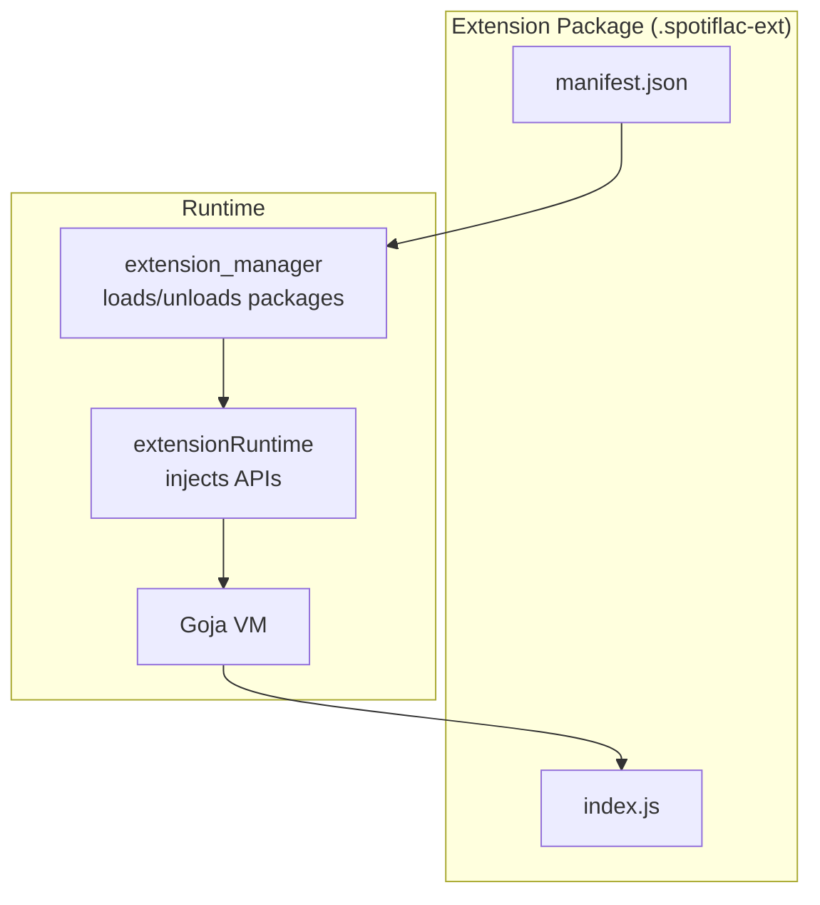

**Diagram sources**
- [extension_manager.go:158-294](file://go_backend_spotiflac/extension_manager.go#L158-L294)
- [extension_runtime.go:424-533](file://go_backend_spotiflac/extension_runtime.go#L424-L533)

**Section sources**
- [extension_manager.go:158-294](file://go_backend_spotiflac/extension_manager.go#L158-L294)
- [extension_manifest.go:149-242](file://go_backend_spotiflac/extension_manifest.go#L149-L242)

## Core Components
This section outlines the JavaScript API surface available to extensions. All APIs are injected into the extension’s VM during initialization.

- HTTP client
  - http.get(url, headers?)
  - http.post(url, body?, headers?)
  - http.put(url, body?, headers?)
  - http.delete(url, headers?)
  - http.patch(url, body?, headers?)
  - http.request(url, options?) supporting method, body, headers
  - http.clearCookies()

- Storage
  - storage.get(key, defaultValue?)
  - storage.set(key, value) -> boolean
  - storage.remove(key) -> boolean

- Credentials
  - credentials.store(key, value) -> { success, error? }
  - credentials.get(key, defaultValue?)
  - credentials.remove(key) -> boolean
  - credentials.has(key) -> boolean

- Authentication
  - auth.openAuthUrl(url, callbackUrl?)
  - auth.getCode() -> string | undefined
  - auth.setAuthCode(codeOrTokens)
  - auth.clear()
  - auth.isAuthenticated() -> boolean
  - auth.getTokens() -> { access_token, refresh_token, is_authenticated, expires_at?, is_expired? }
  - auth.generatePKCE(length?) -> { verifier, challenge, method }
  - auth.getPKCE() -> { verifier, challenge, method }
  - auth.startOAuthWithPKCE(config) -> { success, authUrl, pkce }
  - auth.exchangeCodeWithPKCE(config) -> { success, access_token, refresh_token, token_type?, expires_in?, scope? }

- File operations
  - file.download(url, outputPath, options?) -> { success, error?, path?, size? }
  - file.exists(path) -> boolean
  - file.delete(path) -> { success, error? }
  - file.read(path) -> { success, data, error? }
  - file.readBytes(path, options?) -> { success, data, bytes_read, offset, size, eof, error? }
  - file.write(path, data) -> { success, path?, error? }
  - file.writeBytes(path, data, options?) -> { success, path?, error? }
  - file.copy(src, dst) -> { success, error? }
  - file.move(src, dst) -> { success, error? }
  - file.getSize(path) -> { success, size, error? }

- FFmpeg
  - ffmpeg.execute(command) -> { success, output, error? }
  - ffmpeg.getInfo(path) -> { success, bit_depth, sample_rate, total_samples, duration, error? }
  - ffmpeg.convert(input, output, options?) -> { success, output, error? }

- Matching
  - matching.compareStrings(a, b) -> number (similarity 0..1)
  - matching.compareDuration(ms1, ms2, toleranceMs?) -> boolean
  - matching.normalizeString(str) -> string

- Utilities
  - utils.base64Encode(input) -> string
  - utils.base64Decode(input) -> string
  - utils.md5(input) -> string
  - utils.sha256(input) -> string
  - utils.hmacSHA256(message, key) -> string
  - utils.hmacSHA256Base64(message, key) -> string
  - utils.hmacSHA1(message, key) -> number[]
  - utils.parseJSON(str) -> any | undefined
  - utils.stringifyJSON(any) -> string
  - utils.encrypt(text, key) -> { success, data }
  - utils.decrypt(data, key) -> { success, data }
  - utils.generateKey(length?) -> { success, key, hex }
  - utils.randomUserAgent() -> string
  - utils.appVersion() -> string
  - utils.appUserAgent() -> string
  - utils.sleep(ms) -> boolean (respects cancellation)
  - utils.isDownloadCancelled() -> boolean
  - utils.isRequestCancelled() -> boolean
  - utils.setDownloadStatus(status) -> void

- Logging
  - log.debug(...args)
  - log.info(...args)
  - log.warn(...args)
  - log.error(...args)

- Go backend utilities (gobackend)
  - gobackend.sanitizeFilename(str) -> string
  - gobackend.getAudioQuality(path) -> { bitDepth, sampleRate, totalSamples, duration, error? }
  - gobackend.getLyricsLRC(spotifyID, trackName, artistName, filePath?, durationMs?) -> { lyrics, error? }
  - gobackend.checkISRCExists(outputDir, isrc) -> { exists, filePath, error? }
  - gobackend.addToISRCIndex(outputDir, isrc, filePath) -> { success, error? }
  - gobackend.buildFilename(template, metadata) -> string
  - gobackend.getLocalTime() -> { year, month, day, hour, minute, second, weekday, offsetMinutes, timezone, timestamp }

- Polyfills
  - fetch(url, options?) -> Promise
  - atob(data) -> string
  - btoa(data) -> string
  - TextEncoder, TextDecoder, URL, URLSearchParams, JSON

**Section sources**
- [extension_runtime.go:424-533](file://go_backend_spotiflac/extension_runtime.go#L424-L533)
- [extension_runtime_http.go:71-490](file://go_backend_spotiflac/extension_runtime_http.go#L71-L490)
- [extension_runtime_storage.go:171-472](file://go_backend_spotiflac/extension_runtime_storage.go#L171-L472)
- [extension_runtime_file.go:110-800](file://go_backend_spotiflac/extension_runtime_file.go#L110-L800)
- [extension_runtime_auth.go:55-550](file://go_backend_spotiflac/extension_runtime_auth.go#L55-L550)
- [extension_runtime_ffmpeg.go:53-183](file://go_backend_spotiflac/extension_runtime_ffmpeg.go#L53-L183)
- [extension_runtime_matching.go:9-134](file://go_backend_spotiflac/extension_runtime_matching.go#L9-L134)
- [extension_runtime_utils.go:19-531](file://go_backend_spotiflac/extension_runtime_utils.go#L19-L531)
- [extension_runtime.go:512-533](file://go_backend_spotiflac/extension_runtime.go#L512-L533)

## Architecture Overview
The extension system consists of:
- Packaging and loading: .spotiflac-ext archives are validated and extracted; manifest.json is parsed and verified.
- Runtime initialization: A Goja VM is created, APIs are injected, and index.js is executed. The extension must call registerExtension to provide its API surface.
- Provider invocation: Depending on manifest type, the runtime routes search, availability, and download requests to the extension.
- Lifecycle: Initialization with stored settings, periodic health checks, and cleanup on unload/disable.

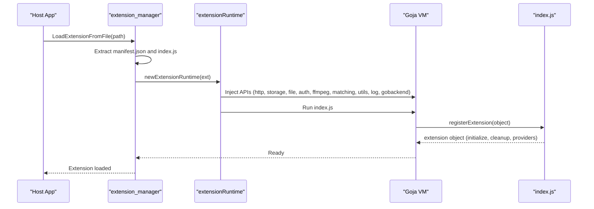

**Diagram sources**
- [extension_manager.go:158-294](file://go_backend_spotiflac/extension_manager.go#L158-L294)
- [extension_manager.go:296-344](file://go_backend_spotiflac/extension_manager.go#L296-L344)
- [extension_runtime.go:424-533](file://go_backend_spotiflac/extension_runtime.go#L424-L533)

**Section sources**
- [extension_manager.go:158-294](file://go_backend_spotiflac/extension_manager.go#L158-L294)
- [extension_manager.go:296-344](file://go_backend_spotiflac/extension_manager.go#L296-L344)

## Detailed Component Analysis

### HTTP Client
The HTTP client enforces strict security policies:
- Only https is allowed unless AllowHTTP is granted in permissions.
- Redirects are blocked to non-https schemes and disallowed domains.
- Private/local IPs are blocked.
- Response bodies are limited to prevent memory exhaustion.
- Automatic cancellation binding for active downloads/requests.

Key behaviors:
- validateDomain(url) ensures scheme, credentials, private IPs, and allowed domains.
- readExtensionHTTPResponseBody enforces max body size.
- httpGet/httpPost/httpRequest support headers, body, and method selection.
- httpClearCookies clears cookies per host.

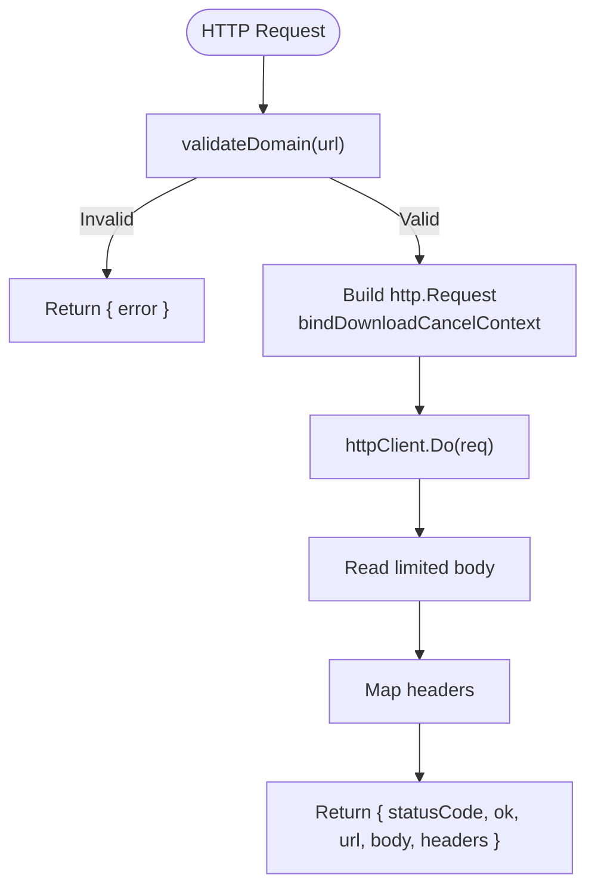

**Diagram sources**
- [extension_runtime_http.go:38-69](file://go_backend_spotiflac/extension_runtime_http.go#L38-L69)
- [extension_runtime_http.go:22-36](file://go_backend_spotiflac/extension_runtime_http.go#L22-L36)
- [extension_runtime_http.go:71-145](file://go_backend_spotiflac/extension_runtime_http.go#L71-L145)

**Section sources**
- [extension_runtime_http.go:38-69](file://go_backend_spotiflac/extension_runtime_http.go#L38-L69)
- [extension_runtime_http.go:22-36](file://go_backend_spotiflac/extension_runtime_http.go#L22-L36)
- [extension_runtime_http.go:71-145](file://go_backend_spotiflac/extension_runtime_http.go#L71-L145)

### Storage and Credentials
Storage:
- Persists key/value pairs in storage.json under the extension’s data directory.
- Uses a flush timer to batch writes and avoid frequent disk I/O.
- Supports default values and dirty tracking.

Credentials:
- Encrypted storage using AES-GCM keyed by extension ID and salt.
- Provides store/get/remove/has operations.

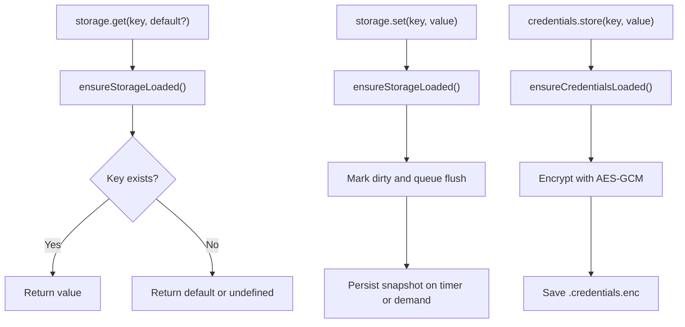

**Diagram sources**
- [extension_runtime_storage.go:39-75](file://go_backend_spotiflac/extension_runtime_storage.go#L39-L75)
- [extension_runtime_storage.go:171-255](file://go_backend_spotiflac/extension_runtime_storage.go#L171-L255)
- [extension_runtime_storage.go:296-368](file://go_backend_spotiflac/extension_runtime_storage.go#L296-L368)

**Section sources**
- [extension_runtime_storage.go:39-75](file://go_backend_spotiflac/extension_runtime_storage.go#L39-L75)
- [extension_runtime_storage.go:171-255](file://go_backend_spotiflac/extension_runtime_storage.go#L171-L255)
- [extension_runtime_storage.go:296-368](file://go_backend_spotiflac/extension_runtime_storage.go#L296-L368)

### Authentication
Supported flows:
- Open auth URL for user consent.
- Retrieve and set auth code or tokens.
- PKCE generation and OAuth token exchange.
- Token retrieval and expiration handling.

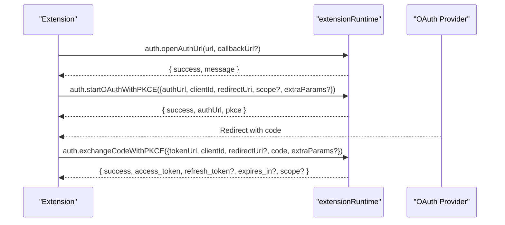

**Diagram sources**
- [extension_runtime_auth.go:55-100](file://go_backend_spotiflac/extension_runtime_auth.go#L55-L100)
- [extension_runtime_auth.go:284-386](file://go_backend_spotiflac/extension_runtime_auth.go#L284-L386)
- [extension_runtime_auth.go:388-549](file://go_backend_spotiflac/extension_runtime_auth.go#L388-L549)

**Section sources**
- [extension_runtime_auth.go:55-100](file://go_backend_spotiflac/extension_runtime_auth.go#L55-L100)
- [extension_runtime_auth.go:284-386](file://go_backend_spotiflac/extension_runtime_auth.go#L284-L386)
- [extension_runtime_auth.go:388-549](file://go_backend_spotiflac/extension_runtime_auth.go#L388-L549)

### File Operations
Security model:
- File access is sandboxed to the extension’s data directory unless absolute paths are allowed by policy.
- Path traversal is prevented by validating against allowed directories.
- Downloads support chunked transfers for servers requiring ranged requests.

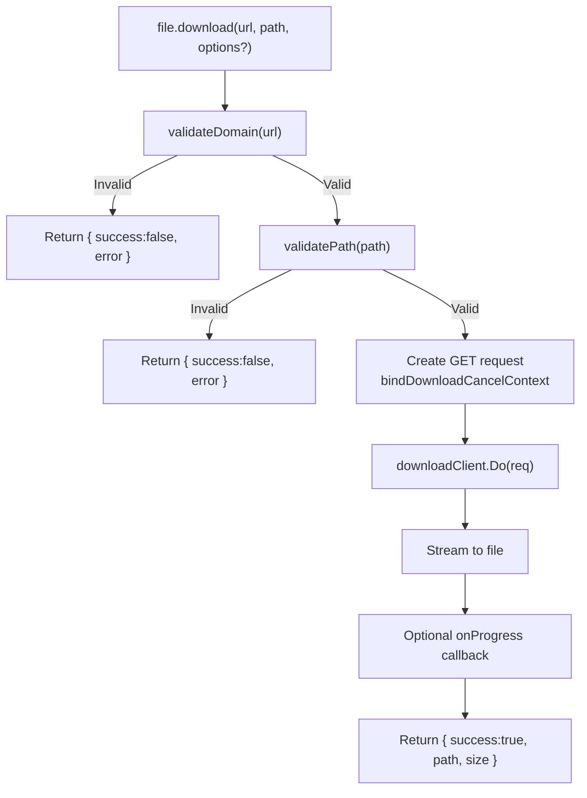

**Diagram sources**
- [extension_runtime_file.go:110-311](file://go_backend_spotiflac/extension_runtime_file.go#L110-L311)
- [extension_runtime_file.go:313-536](file://go_backend_spotiflac/extension_runtime_file.go#L313-L536)

**Section sources**
- [extension_runtime_file.go:110-311](file://go_backend_spotiflac/extension_runtime_file.go#L110-L311)
- [extension_runtime_file.go:313-536](file://go_backend_spotiflac/extension_runtime_file.go#L313-L536)

### FFmpeg Integration
FFmpeg commands are queued and executed asynchronously. The extension waits for completion with a timeout.

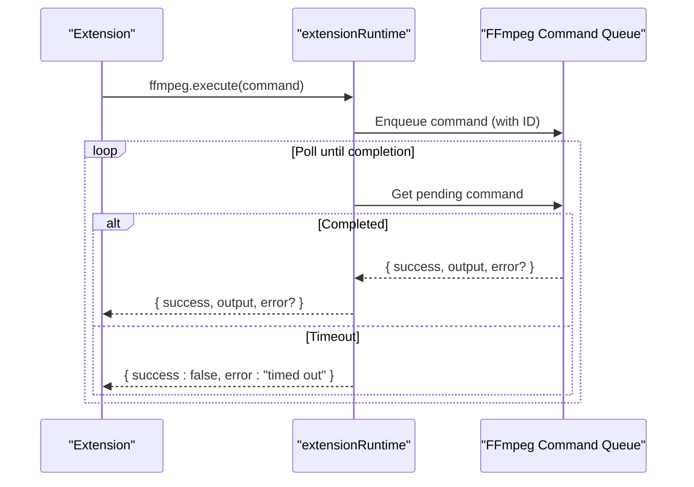

**Diagram sources**
- [extension_runtime_ffmpeg.go:53-108](file://go_backend_spotiflac/extension_runtime_ffmpeg.go#L53-L108)

**Section sources**
- [extension_runtime_ffmpeg.go:53-108](file://go_backend_spotiflac/extension_runtime_ffmpeg.go#L53-L108)

### Matching Utilities
Provides string similarity, duration comparison with tolerance, and normalization for matching.

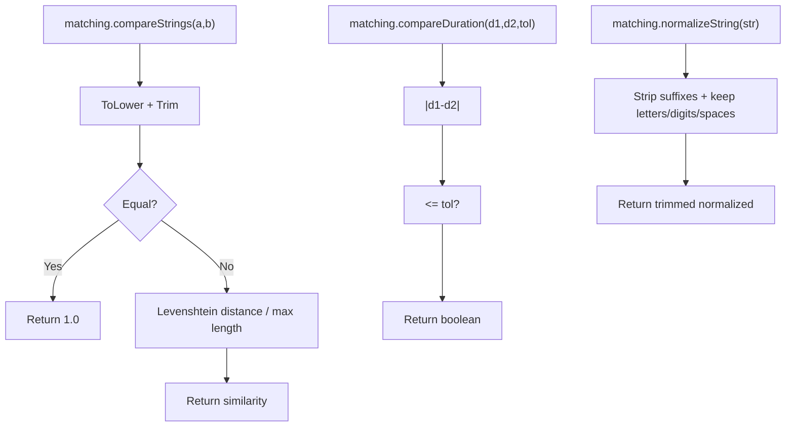

**Diagram sources**
- [extension_runtime_matching.go:9-134](file://go_backend_spotiflac/extension_runtime_matching.go#L9-L134)

**Section sources**
- [extension_runtime_matching.go:9-134](file://go_backend_spotiflac/extension_runtime_matching.go#L9-L134)

### Providers and Data Models
Extensions can implement metadata, download, and lyrics providers. The runtime converts extension results to internal models and overlays enrichment.

Key types:
- ExtTrackMetadata, ExtAlbumMetadata, ExtArtistMetadata
- ExtSearchResult, ExtAvailabilityResult, ExtDownloadResult
- DownloadDecryptionInfo

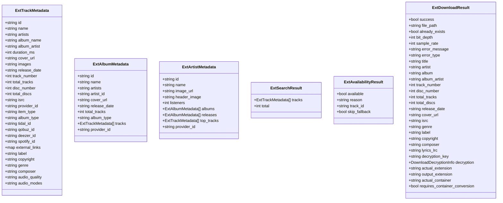

**Diagram sources**
- [extension_providers.go:19-83](file://go_backend_spotiflac/extension_providers.go#L19-L83)
- [extension_providers.go:408-448](file://go_backend_spotiflac/extension_providers.go#L408-L448)

**Section sources**
- [extension_providers.go:19-83](file://go_backend_spotiflac/extension_providers.go#L19-L83)
- [extension_providers.go:408-448](file://go_backend_spotiflac/extension_providers.go#L408-L448)

### Manifest and Capabilities
The manifest defines:
- Types: metadata_provider, download_provider, lyrics_provider
- Permissions: network domains, storage, file access, allowHttp
- Settings: key, type, label, description, required, secret, default, options, action
- Quality options and settings scoped to quality tiers
- Search behavior, URL handler, track matching, post-processing hooks
- Service health checks for runtime monitoring

Validation ensures required fields and supported types.

**Section sources**
- [extension_manifest.go:116-138](file://go_backend_spotiflac/extension_manifest.go#L116-L138)
- [extension_manifest.go:162-242](file://go_backend_spotiflac/extension_manifest.go#L162-L242)

### Lifecycle Hooks and Initialization
- Loading: LoadExtensionFromFile validates manifest and index.js presence, extracts files, creates directories, and stores metadata.
- Initialization: initializeVMLocked runs index.js, injects APIs, and expects registerExtension. Optional initialize(settings) is invoked with stored settings.
- Health checks: CheckExtensionHealth evaluates configured service health endpoints.
- Cleanup: teardownVMLocked flushes storage and calls extension.cleanup if present.

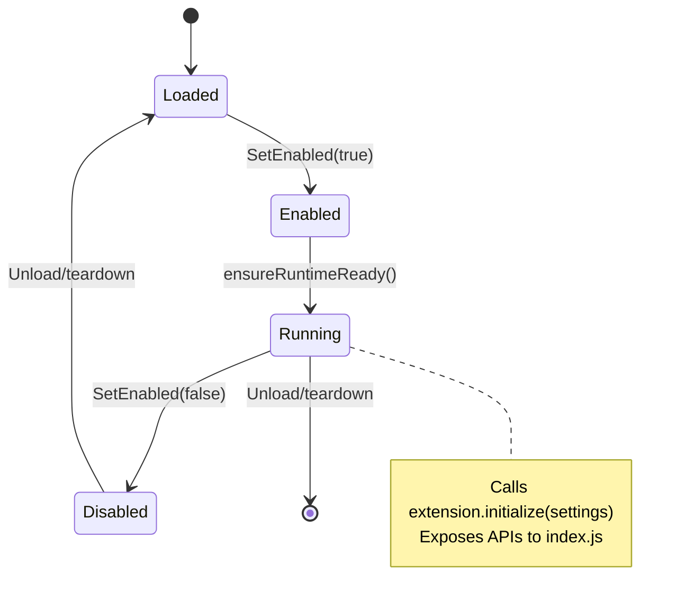

**Diagram sources**
- [extension_manager.go:608-640](file://go_backend_spotiflac/extension_manager.go#L608-L640)
- [extension_manager.go:416-487](file://go_backend_spotiflac/extension_manager.go#L416-L487)
- [extension_manager.go:489-554](file://go_backend_spotiflac/extension_manager.go#L489-L554)

**Section sources**
- [extension_manager.go:608-640](file://go_backend_spotiflac/extension_manager.go#L608-L640)
- [extension_manager.go:416-487](file://go_backend_spotiflac/extension_manager.go#L416-L487)
- [extension_manager.go:489-554](file://go_backend_spotiflac/extension_manager.go#L489-L554)

## Dependency Analysis
The extension runtime composes multiple subsystems:
- HTTP client depends on manifest permissions and domain allowlists.
- File operations depend on allowed directories and sandboxed paths.
- Storage and credentials depend on the extension’s data directory and encryption keys.
- FFmpeg integration depends on the host to execute queued commands.
- Matching utilities depend on string normalization and distance metrics.

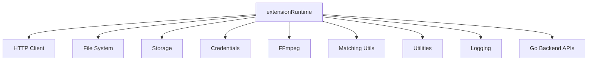

**Diagram sources**
- [extension_runtime.go:84-112](file://go_backend_spotiflac/extension_runtime.go#L84-L112)
- [extension_runtime_http.go:71-145](file://go_backend_spotiflac/extension_runtime_http.go#L71-L145)
- [extension_runtime_file.go:75-108](file://go_backend_spotiflac/extension_runtime_file.go#L75-L108)
- [extension_runtime_storage.go:24-26](file://go_backend_spotiflac/extension_runtime_storage.go#L24-L26)
- [extension_runtime_ffmpeg.go:24-28](file://go_backend_spotiflac/extension_runtime_ffmpeg.go#L24-L28)
- [extension_runtime_matching.go:9-134](file://go_backend_spotiflac/extension_runtime_matching.go#L9-L134)
- [extension_runtime_utils.go:19-531](file://go_backend_spotiflac/extension_runtime_utils.go#L19-L531)

**Section sources**
- [extension_runtime.go:84-112](file://go_backend_spotiflac/extension_runtime.go#L84-L112)
- [extension_runtime_http.go:71-145](file://go_backend_spotiflac/extension_runtime_http.go#L71-L145)
- [extension_runtime_file.go:75-108](file://go_backend_spotiflac/extension_runtime_file.go#L75-L108)
- [extension_runtime_storage.go:24-26](file://go_backend_spotiflac/extension_runtime_storage.go#L24-L26)
- [extension_runtime_ffmpeg.go:24-28](file://go_backend_spotiflac/extension_runtime_ffmpeg.go#L24-L28)
- [extension_runtime_matching.go:9-134](file://go_backend_spotiflac/extension_runtime_matching.go#L9-L134)
- [extension_runtime_utils.go:19-531](file://go_backend_spotiflac/extension_runtime_utils.go#L19-L531)

## Performance Considerations
- Network timeouts: Configure networkTimeoutSeconds in manifest capabilities to tune HTTP client timeouts.
- Response size limits: HTTP responses are limited to prevent memory pressure; use file.download for large media.
- Storage flush batching: Storage writes are debounced to reduce I/O overhead.
- Chunked downloads: Use file.download with chunked option for servers requiring ranged requests.
- Cancellation awareness: Many operations respect active download/request cancellation to avoid wasted work.
- FFmpeg timeouts: Commands are polled with a bounded wait; long-running conversions should be designed accordingly.

[No sources needed since this section provides general guidance]

## Troubleshooting Guide
Common issues and remedies:
- HTTP blocked: Verify domain allowlists and scheme (only https unless AllowHTTP is set). Check redirect policies and private IP restrictions.
- File access denied: Ensure paths are relative or within allowed directories; absolute paths are rejected.
- Storage/credentials errors: Confirm extension data directory exists and permissions are correct; credentials are encrypted and require proper key derivation.
- Authentication failures: Validate auth URLs (https only), PKCE parameters, and token endpoint reachability.
- Health check offline: Ensure health endpoints use https, are permitted by network permissions, and return acceptable statuses.

**Section sources**
- [extension_runtime_http.go:38-69](file://go_backend_spotiflac/extension_runtime_http.go#L38-L69)
- [extension_runtime_file.go:75-108](file://go_backend_spotiflac/extension_runtime_file.go#L75-L108)
- [extension_health.go:101-205](file://go_backend_spotiflac/extension_health.go#L101-L205)

## Conclusion
Extensions integrate seamlessly with the platform via a secure, sandboxed JavaScript runtime. By leveraging the provided APIs—HTTP client, storage, file operations, authentication, FFmpeg, matching, and utilities—developers can implement robust metadata providers, download providers, and lyrics services. Proper manifest configuration, packaging, and lifecycle management ensure reliable operation and maintainability.

[No sources needed since this section summarizes without analyzing specific files]

## Appendices

### A. Extension Manifest Reference
- Required fields: name, version, description, types (one or more of metadata_provider, download_provider, lyrics_provider)
- Permissions: network[], storage, file, allowHttp
- Settings: key, type (string, number, boolean, select, button), label, description, required, secret, default, options, action
- Behavior: searchBehavior, urlHandler, trackMatching, postProcessing
- Health: serviceHealth[] with id, label, url, method, serviceKey, timeoutMs, cacheTtlSeconds, required

**Section sources**
- [extension_manifest.go:116-138](file://go_backend_spotiflac/extension_manifest.go#L116-L138)
- [extension_manifest.go:162-242](file://go_backend_spotiflac/extension_manifest.go#L162-L242)

### B. Packaging and Installation
- Package as .spotiflac-ext with manifest.json and index.js.
- Install via LoadExtensionFromFile; the manager validates manifest and index.js presence, extracts files, and prepares directories.
- Upgrades are allowed only when the new version is greater than the installed version.

**Section sources**
- [extension_manager.go:158-294](file://go_backend_spotiflac/extension_manager.go#L158-L294)
- [extension_manager.go:757-800](file://go_backend_spotiflac/extension_manager.go#L757-L800)

### C. Example Patterns

- Custom audio provider (download_provider)
  - Implement extension object with initialize(settings) and cleanup().
  - Implement provider functions to resolve availability and download URLs.
  - Use http.request for API calls, file.download for media, and ffmpeg.convert for format conversion.
  - Store persistent settings via storage.set and retrieve via storage.get.

- Lyrics service (lyrics_provider)
  - Implement extension.initialize(settings) to load credentials if needed.
  - Use http.get to query lyrics endpoints and return lyrics in LRC format.
  - Utilize gobackend.getLyricsLRC for built-in logic if applicable.

- Metadata source (metadata_provider)
  - Implement search and lookup functions returning ExtSearchResult or ExtAlbumMetadata/ExtArtistMetadata.
  - Use matching.compareStrings and matching.normalizeString to improve match quality.
  - Store user preferences via storage.set and retrieve via storage.get.

- Authentication flow
  - Use auth.openAuthUrl to initiate OAuth.
  - Use auth.startOAuthWithPKCE and auth.exchangeCodeWithPKCE for PKCE-based flows.
  - Persist tokens via auth.setAuthCode and retrieve via auth.getTokens.

- File operations
  - Use file.download with chunked option for servers requiring ranged requests.
  - Use file.readBytes with offset/length for partial reads.
  - Use file.writeBytes with append/truncate/offset options for advanced writes.

- Logging and diagnostics
  - Use log.debug/info/warn/error to emit structured logs.
  - Use gobackend.getLocalTime to include timestamps and timezone info.

**Section sources**
- [extension_runtime_auth.go:55-100](file://go_backend_spotiflac/extension_runtime_auth.go#L55-L100)
- [extension_runtime_auth.go:284-386](file://go_backend_spotiflac/extension_runtime_auth.go#L284-L386)
- [extension_runtime_auth.go:388-549](file://go_backend_spotiflac/extension_runtime_auth.go#L388-L549)
- [extension_runtime_file.go:110-311](file://go_backend_spotiflac/extension_runtime_file.go#L110-L311)
- [extension_runtime_file.go:313-536](file://go_backend_spotiflac/extension_runtime_file.go#L313-L536)
- [extension_runtime_utils.go:342-380](file://go_backend_spotiflac/extension_runtime_utils.go#L342-L380)
- [extension_providers.go:19-83](file://go_backend_spotiflac/extension_providers.go#L19-L83)

### D. Testing Strategies
- Unit tests: Mock Goja VM and inject APIs to test provider logic in isolation.
- Integration tests: Package minimal manifests and index.js, load via LoadExtensionFromFile, and exercise provider functions.
- Health checks: Use CheckExtensionHealthJSON to validate service endpoints and permissions.
- Cancellation tests: Trigger download/request cancellations mid-operation to ensure graceful exits.
- Security tests: Attempt unauthorized redirects, private IP access, and invalid paths to verify sandbox enforcement.

**Section sources**
- [extension_health.go:41-99](file://go_backend_spotiflac/extension_health.go#L41-L99)
- [extension_manager.go:642-678](file://go_backend_spotiflac/extension_manager.go#L642-L678)