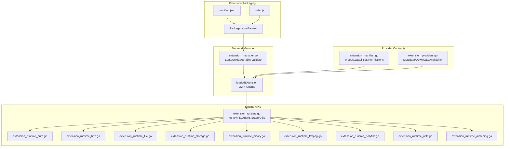
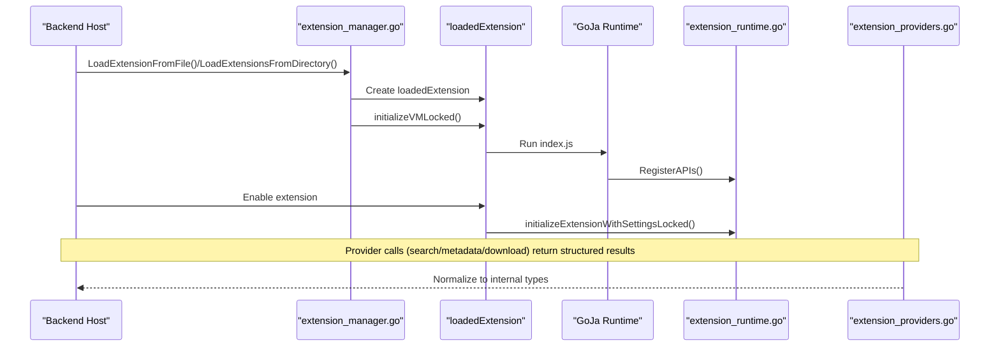
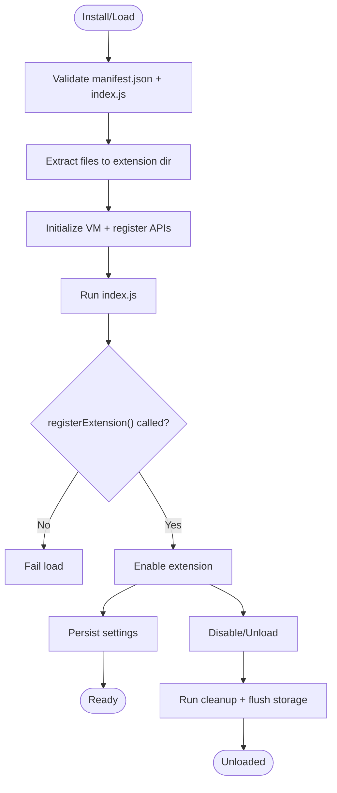
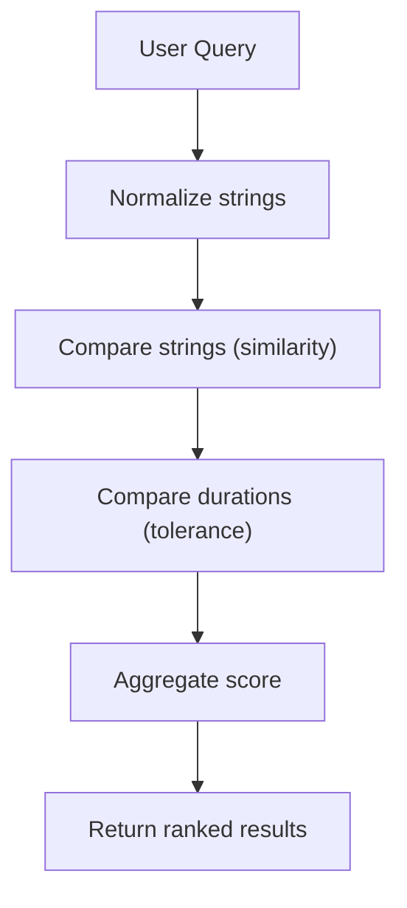
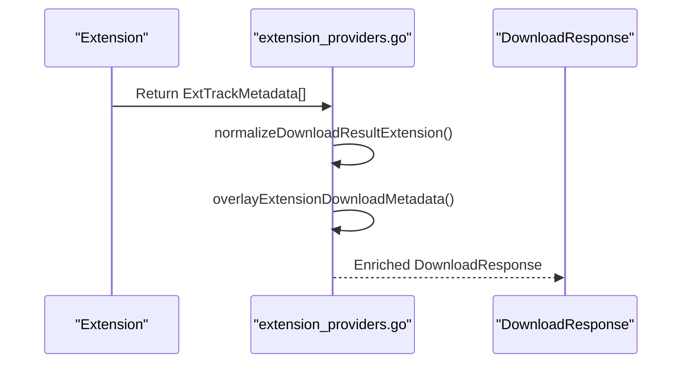
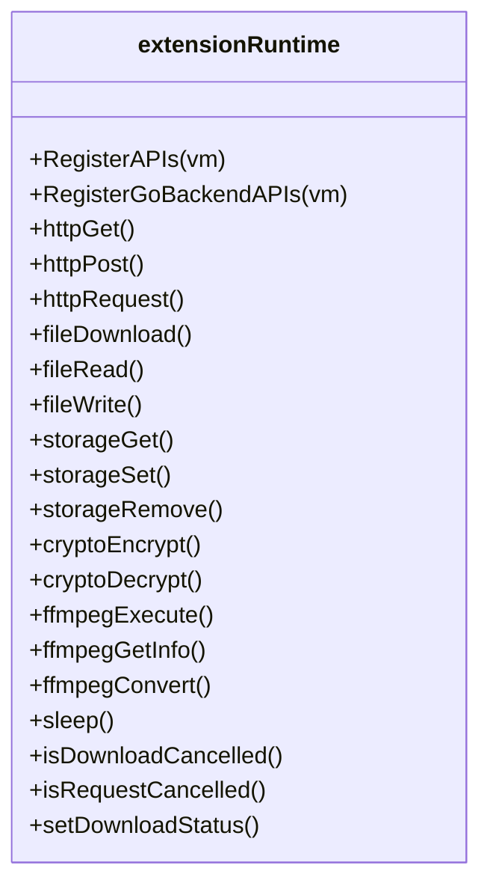
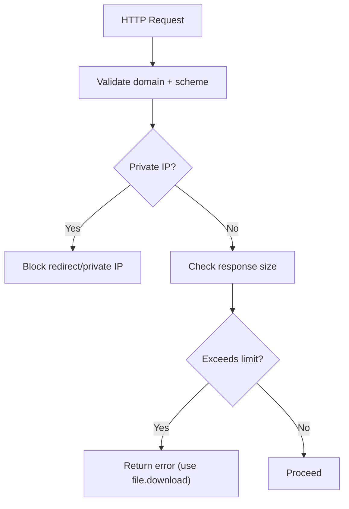
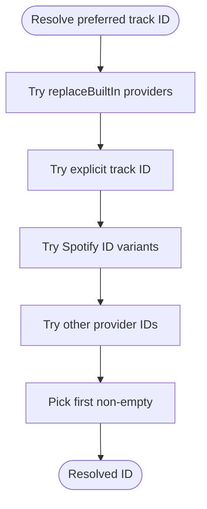
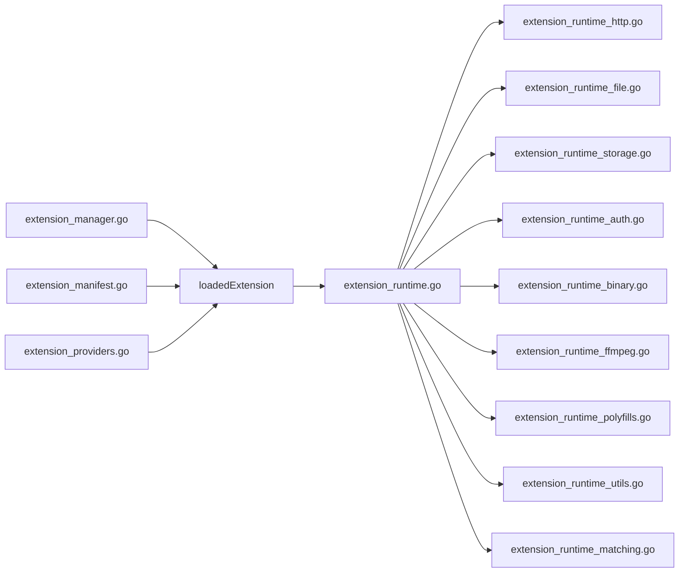

# Extension Providers

<cite>
**Referenced Files in This Document**
- [extension_providers.go](file://go_backend_spotiflac/extension_providers.go)
- [extension_manager.go](file://go_backend_spotiflac/extension_manager.go)
- [extension_manifest.go](file://go_backend_spotiflac/extension_manifest.go)
- [extension_runtime.go](file://go_backend_spotiflac/extension_runtime.go)
- [extension_runtime_auth.go](file://go_backend_spotiflac/extension_runtime_auth.go)
- [extension_runtime_http.go](file://go_backend_spotiflac/extension_runtime_http.go)
- [extension_runtime_file.go](file://go_backend_spotiflac/extension_runtime_file.go)
- [extension_runtime_storage.go](file://go_backend_spotiflac/extension_runtime_storage.go)
- [extension_runtime_binary.go](file://go_backend_spotiflac/extension_runtime_binary.go)
- [extension_runtime_ffmpeg.go](file://go_backend_spotiflac/extension_runtime_ffmpeg.go)
- [extension_runtime_polyfills.go](file://go_backend_spotiflac/extension_runtime_polyfills.go)
- [extension_runtime_utils.go](file://go_backend_spotiflac/extension_runtime_utils.go)
- [extension_runtime_matching.go](file://go_backend_spotiflac/extension_runtime_matching.go)
- [extension_settings.go](file://go_backend_spotiflac/extension_settings.go)
</cite>

## Table of Contents
1. [Introduction](#introduction)
2. [Project Structure](#project-structure)
3. [Core Components](#core-components)
4. [Architecture Overview](#architecture-overview)
5. [Detailed Component Analysis](#detailed-component-analysis)
6. [Dependency Analysis](#dependency-analysis)
7. [Performance Considerations](#performance-considerations)
8. [Troubleshooting Guide](#troubleshooting-guide)
9. [Conclusion](#conclusion)
10. [Appendices](#appendices)

## Introduction
This document explains how to implement and integrate custom audio provider extensions for the backend. It covers the extension lifecycle, provider registration, search and matching algorithms, metadata extraction, callback mechanisms, error handling, and operational best practices such as caching and rate-limiting compliance. Practical patterns for streaming integrations, playlist processing, and quality selection are included.

## Project Structure
The extension system is implemented in Go and exposes a JavaScript runtime to extension authors. Extensions are packaged as .spotiflac-ext archives containing a manifest and an index.js entrypoint. The backend manages loading, initialization, permissions, and sandboxing.

**Diagram sources**
- [extension_manager.go:120-139](file://go_backend_spotiflac/extension_manager.go#L120-L139)
- [extension_manifest.go:116-138](file://go_backend_spotiflac/extension_manifest.go#L116-L138)
- [extension_runtime.go:84-112](file://go_backend_spotiflac/extension_runtime.go#L84-L112)
- [extension_providers.go:19-83](file://go_backend_spotiflac/extension_providers.go#L19-L83)

**Section sources**
- [extension_manager.go:120-139](file://go_backend_spotiflac/extension_manager.go#L120-L139)
- [extension_manifest.go:116-138](file://go_backend_spotiflac/extension_manifest.go#L116-L138)

## Core Components
- Extension manifest defines capabilities, permissions, types (metadata/download/lyrics), quality options, and optional custom matching/search behavior.
- Runtime exposes a sandboxed API surface: HTTP, file IO, storage, credentials, crypto, FFmpeg, polyfills, and utilities.
- Provider wrappers convert extension results to internal types and handle normalization, decryption, and metadata overlay.

Key responsibilities:
- Registration: Extensions call registerExtension() during initialization.
- Permissions: Network domains, file access, and HTTP allowance are enforced.
- Sandbox: Redirects, private IPs, and cookie jars are controlled.
- Settings persistence: Extension settings are stored per extension ID.

**Section sources**
- [extension_manifest.go:116-138](file://go_backend_spotiflac/extension_manifest.go#L116-L138)
- [extension_runtime.go:424-533](file://go_backend_spotiflac/extension_runtime.go#L424-L533)
- [extension_runtime_http.go:38-69](file://go_backend_spotiflac/extension_runtime_http.go#L38-L69)
- [extension_runtime_file.go:75-108](file://go_backend_spotiflac/extension_runtime_file.go#L75-L108)
- [extension_runtime_storage.go:24-75](file://go_backend_spotiflac/extension_runtime_storage.go#L24-L75)
- [extension_settings.go:11-29](file://go_backend_spotiflac/extension_settings.go#L11-L29)

## Architecture Overview
The extension provider architecture centers on a JS runtime inside a sandboxed Go environment. Extensions implement provider functions (search, metadata enrichment, download) and return structured results consumed by the backend.

**Diagram sources**
- [extension_manager.go:158-294](file://go_backend_spotiflac/extension_manager.go#L158-L294)
- [extension_manager.go:296-414](file://go_backend_spotiflac/extension_manager.go#L296-L414)
- [extension_runtime.go:424-533](file://go_backend_spotiflac/extension_runtime.go#L424-L533)
- [extension_providers.go:523-546](file://go_backend_spotiflac/extension_providers.go#L523-L546)

## Detailed Component Analysis

### Provider Registration and Lifecycle
- Loading: The manager reads the .spotiflac-ext archive, validates manifest presence and index.js, and extracts files into an extension directory.
- Initialization: The runtime registers APIs and executes index.js, expecting registerExtension() to be called.
- Enabling: When enabled, the runtime loads persisted settings and initializes the extension.
- Cleanup: On disable/unload, cleanup hooks and storage flushers are invoked.

**Diagram sources**
- [extension_manager.go:158-294](file://go_backend_spotiflac/extension_manager.go#L158-L294)
- [extension_manager.go:296-414](file://go_backend_spotiflac/extension_manager.go#L296-L414)
- [extension_manager.go:567-584](file://go_backend_spotiflac/extension_manager.go#L567-L584)

**Section sources**
- [extension_manager.go:158-294](file://go_backend_spotiflac/extension_manager.go#L158-L294)
- [extension_manager.go:296-414](file://go_backend_spotiflac/extension_manager.go#L296-L414)
- [extension_manager.go:567-584](file://go_backend_spotiflac/extension_manager.go#L567-L584)

### Provider Types and Capabilities
- Types: metadata_provider, download_provider, lyrics_provider.
- Capabilities: networkTimeoutSeconds, replacesBuiltInProviders, etc.
- Permissions: network domains, storage, file access, allowHttp flag.

These influence how the extension is validated, initialized, and sandboxed.

**Section sources**
- [extension_manifest.go:11-25](file://go_backend_spotiflac/extension_manifest.go#L11-L25)
- [extension_manifest.go:116-138](file://go_backend_spotiflac/extension_manifest.go#L116-L138)
- [extension_manifest.go:272-288](file://go_backend_spotiflac/extension_manifest.go#L272-L288)

### Search and Matching Algorithms
- String similarity and duration tolerance are exposed via runtime APIs.
- Normalization removes suffixes and extra whitespace to improve matching.
- Custom matching can be configured in the manifest.

**Diagram sources**
- [extension_runtime_matching.go:9-44](file://go_backend_spotiflac/extension_runtime_matching.go#L9-L44)
- [extension_runtime_matching.go:107-133](file://go_backend_spotiflac/extension_runtime_matching.go#L107-L133)
- [extension_manifest.go:86-90](file://go_backend_spotiflac/extension_manifest.go#L86-L90)

**Section sources**
- [extension_runtime_matching.go:9-44](file://go_backend_spotiflac/extension_runtime_matching.go#L9-L44)
- [extension_runtime_matching.go:107-133](file://go_backend_spotiflac/extension_runtime_matching.go#L107-L133)
- [extension_manifest.go:86-90](file://go_backend_spotiflac/extension_manifest.go#L86-L90)

### Metadata Extraction Workflows
- Extensions return structured metadata (tracks, albums, artists).
- Backend normalizes and overlays metadata onto the response, enriching missing fields and applying decryption info.

**Diagram sources**
- [extension_providers.go:673-726](file://go_backend_spotiflac/extension_providers.go#L673-L726)
- [extension_providers.go:271-339](file://go_backend_spotiflac/extension_providers.go#L271-L339)
- [extension_providers.go:230-269](file://go_backend_spotiflac/extension_providers.go#L230-L269)

**Section sources**
- [extension_providers.go:673-726](file://go_backend_spotiflac/extension_providers.go#L673-L726)
- [extension_providers.go:271-339](file://go_backend_spotiflac/extension_providers.go#L271-L339)
- [extension_providers.go:230-269](file://go_backend_spotiflac/extension_providers.go#L230-L269)

### Provider Interface Contracts and Callbacks
- HTTP callbacks: fetch/fetch polyfill, request methods with headers/body.
- File callbacks: download, exists, delete, read/write, copy/move, size.
- Storage callbacks: get/set/remove with async flush.
- Crypto and binary helpers: AES/Blowfish, base64/hex encodings.
- Utilities: logging, sleep, cancellation checks, filename sanitization.

**Diagram sources**
- [extension_runtime.go:424-533](file://go_backend_spotiflac/extension_runtime.go#L424-L533)
- [extension_runtime_http.go:71-145](file://go_backend_spotiflac/extension_runtime_http.go#L71-L145)
- [extension_runtime_file.go:110-311](file://go_backend_spotiflac/extension_runtime_file.go#L110-L311)
- [extension_runtime_storage.go:171-255](file://go_backend_spotiflac/extension_runtime_storage.go#L171-L255)
- [extension_runtime_binary.go:266-360](file://go_backend_spotiflac/extension_runtime_binary.go#L266-L360)
- [extension_runtime_ffmpeg.go:53-182](file://go_backend_spotiflac/extension_runtime_ffmpeg.go#L53-L182)
- [extension_runtime_utils.go:19-380](file://go_backend_spotiflac/extension_runtime_utils.go#L19-L380)

**Section sources**
- [extension_runtime_http.go:71-145](file://go_backend_spotiflac/extension_runtime_http.go#L71-L145)
- [extension_runtime_file.go:110-311](file://go_backend_spotiflac/extension_runtime_file.go#L110-L311)
- [extension_runtime_storage.go:171-255](file://go_backend_spotiflac/extension_runtime_storage.go#L171-L255)
- [extension_runtime_binary.go:266-360](file://go_backend_spotiflac/extension_runtime_binary.go#L266-L360)
- [extension_runtime_ffmpeg.go:53-182](file://go_backend_spotiflac/extension_runtime_ffmpeg.go#L53-L182)
- [extension_runtime_utils.go:19-380](file://go_backend_spotiflac/extension_runtime_utils.go#L19-L380)

### Error Handling Strategies
- Redirects: Blocked for non-HTTPS unless allowHttp is granted; private IPs disallowed; domain whitelist enforced.
- HTTP responses: Body size limited; large media should use file.download.
- Authentication: Strict validation of URLs and PKCE support; tokens stored securely.
- Cancellation: Active download/request IDs enable cooperative cancellation checks.

**Diagram sources**
- [extension_runtime_http.go:38-69](file://go_backend_spotiflac/extension_runtime_http.go#L38-L69)
- [extension_runtime_http.go:22-36](file://go_backend_spotiflac/extension_runtime_http.go#L22-L36)
- [extension_runtime.go:250-286](file://go_backend_spotiflac/extension_runtime.go#L250-L286)

**Section sources**
- [extension_runtime_http.go:38-69](file://go_backend_spotiflac/extension_runtime_http.go#L38-L69)
- [extension_runtime_http.go:22-36](file://go_backend_spotiflac/extension_runtime_http.go#L22-L36)
- [extension_runtime.go:250-286](file://go_backend_spotiflac/extension_runtime.go#L250-L286)

### Priority Systems, Fallbacks, and Conflict Resolution
- Built-in provider replacement: Manifest capability "replacesBuiltInProviders" controls whether an extension supersedes built-ins.
- Preferred track ID resolution: Attempts Tidal/Qobuz/Deezer/Spotify IDs in priority order.
- Availability gating: Extensions can request to skip fallbacks; otherwise, the backend continues fallback chains.
- Version comparison: Upgrades allowed; downgrades blocked.

**Diagram sources**
- [extension_providers.go:168-211](file://go_backend_spotiflac/extension_providers.go#L168-L211)
- [extension_providers.go:134-151](file://go_backend_spotiflac/extension_providers.go#L134-L151)
- [extension_providers.go:375-399](file://go_backend_spotiflac/extension_providers.go#L375-L399)

**Section sources**
- [extension_providers.go:168-211](file://go_backend_spotiflac/extension_providers.go#L168-L211)
- [extension_providers.go:134-151](file://go_backend_spotiflac/extension_providers.go#L134-L151)
- [extension_providers.go:375-399](file://go_backend_spotiflac/extension_providers.go#L375-L399)

### Practical Implementation Patterns

#### Streaming Service Integrations
- Use HTTP APIs to search and fetch metadata; enforce domain allowlist and HTTPS.
- For large media, use file.download with optional chunked downloads to handle CDNs requiring ranged requests.
- Store tokens and cookies via runtime credentials/storage APIs.

**Section sources**
- [extension_runtime_http.go:71-145](file://go_backend_spotiflac/extension_runtime_http.go#L71-L145)
- [extension_runtime_file.go:110-311](file://go_backend_spotiflac/extension_runtime_file.go#L110-L311)
- [extension_runtime_auth.go:55-100](file://go_backend_spotiflac/extension_runtime_auth.go#L55-L100)
- [extension_runtime_storage.go:171-255](file://go_backend_spotiflac/extension_runtime_storage.go#L171-L255)

#### Playlist Processing
- Iterate playlists via HTTP calls; normalize track names and compare durations to match against known catalog.
- Use storage to cache resolved IDs and avoid repeated lookups.

**Section sources**
- [extension_runtime_matching.go:9-44](file://go_backend_spotiflac/extension_runtime_matching.go#L9-L44)
- [extension_runtime_storage.go:171-255](file://go_backend_spotiflac/extension_runtime_storage.go#L171-L255)

#### Quality Selection Logic
- Use manifest quality options to present selectable qualities.
- FFmpeg conversions supported for post-processing; quality detection via runtime APIs.

**Section sources**
- [extension_manifest.go:46-62](file://go_backend_spotiflac/extension_manifest.go#L46-L62)
- [extension_runtime_ffmpeg.go:137-182](file://go_backend_spotiflac/extension_runtime_ffmpeg.go#L137-L182)
- [extension_runtime_utils.go:398-419](file://go_backend_spotiflac/extension_runtime_utils.go#L398-L419)

## Dependency Analysis
- Extension manager depends on GoJa VM and manages lifecycle and settings.
- Runtime composes multiple subsystems: HTTP, file, storage, auth, crypto, FFmpeg, polyfills, and utilities.
- Provider contracts depend on manifests and capabilities.

**Diagram sources**
- [extension_manager.go:120-139](file://go_backend_spotiflac/extension_manager.go#L120-L139)
- [extension_runtime.go:424-533](file://go_backend_spotiflac/extension_runtime.go#L424-L533)
- [extension_manifest.go:116-138](file://go_backend_spotiflac/extension_manifest.go#L116-L138)
- [extension_providers.go:19-83](file://go_backend_spotiflac/extension_providers.go#L19-L83)

**Section sources**
- [extension_manager.go:120-139](file://go_backend_spotiflac/extension_manager.go#L120-L139)
- [extension_runtime.go:424-533](file://go_backend_spotiflac/extension_runtime.go#L424-L533)
- [extension_manifest.go:116-138](file://go_backend_spotiflac/extension_manifest.go#L116-L138)
- [extension_providers.go:19-83](file://go_backend_spotiflac/extension_providers.go#L19-L83)

## Performance Considerations
- Prefer chunked downloads for CDNs that reject large or unrange requests.
- Use storage to cache frequently accessed data (IDs, tokens).
- Limit concurrent downloads and use sleep with cancellation checks for rate limiting.
- Use FFmpeg for efficient post-processing and format conversions.

[No sources needed since this section provides general guidance]

## Troubleshooting Guide
Common issues and remedies:
- Extension did not call registerExtension(): initialization fails.
- Redirect blocked: non-HTTPS or private IP or not in allowed domains.
- HTTP response too large: use file.download for large media.
- Download cancelled: check active download item ID and cancellation signals.
- Authentication failures: validate auth URLs and PKCE parameters.

**Section sources**
- [extension_manager.go:325-344](file://go_backend_spotiflac/extension_manager.go#L325-L344)
- [extension_runtime_http.go:38-69](file://go_backend_spotiflac/extension_runtime_http.go#L38-L69)
- [extension_runtime_http.go:22-36](file://go_backend_spotiflac/extension_runtime_http.go#L22-L36)
- [extension_runtime_file.go:271-281](file://go_backend_spotiflac/extension_runtime_file.go#L271-L281)
- [extension_runtime_auth.go:18-42](file://go_backend_spotiflac/extension_runtime_auth.go#L18-L42)

## Conclusion
The extension provider system offers a secure, sandboxed environment for building custom audio providers. By leveraging the runtime APIs, adhering to manifest capabilities and permissions, and following the patterns outlined—search and matching, metadata enrichment, quality selection, and robust error handling—you can implement reliable streaming integrations, efficient playlist processing, and compliant rate-limited operations.

## Appendices

### Provider Contract Reference
- Metadata: Tracks, Albums, Artists with normalized fields.
- Availability: Availability result with reasons and skip-fallback flags.
- Download: File path, quality, decryption info, and metadata overlay.

**Section sources**
- [extension_providers.go:19-83](file://go_backend_spotiflac/extension_providers.go#L19-L83)
- [extension_providers.go:90-102](file://go_backend_spotiflac/extension_providers.go#L90-L102)
- [extension_providers.go:408-448](file://go_backend_spotiflac/extension_providers.go#L408-L448)

### Settings Persistence
- Per-extension settings stored under extension data directory.
- JSON-backed store with locking and delayed flush.

**Section sources**
- [extension_settings.go:11-29](file://go_backend_spotiflac/extension_settings.go#L11-L29)
- [extension_settings.go:71-87](file://go_backend_spotiflac/extension_settings.go#L71-L87)
- [extension_settings.go:137-157](file://go_backend_spotiflac/extension_settings.go#L137-L157)