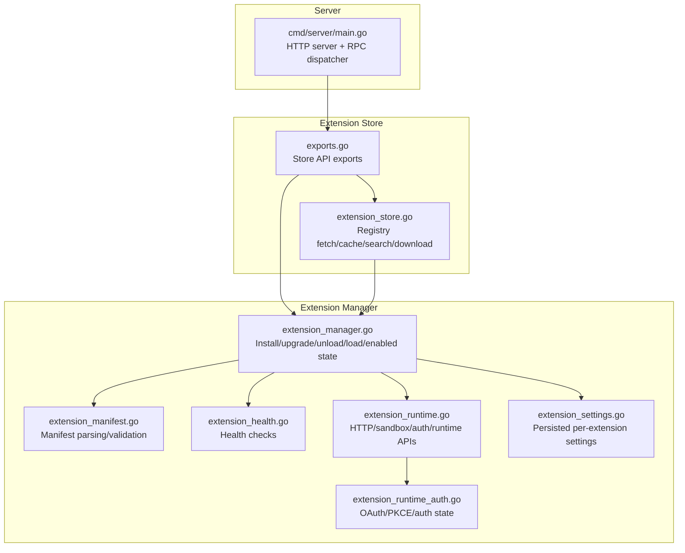
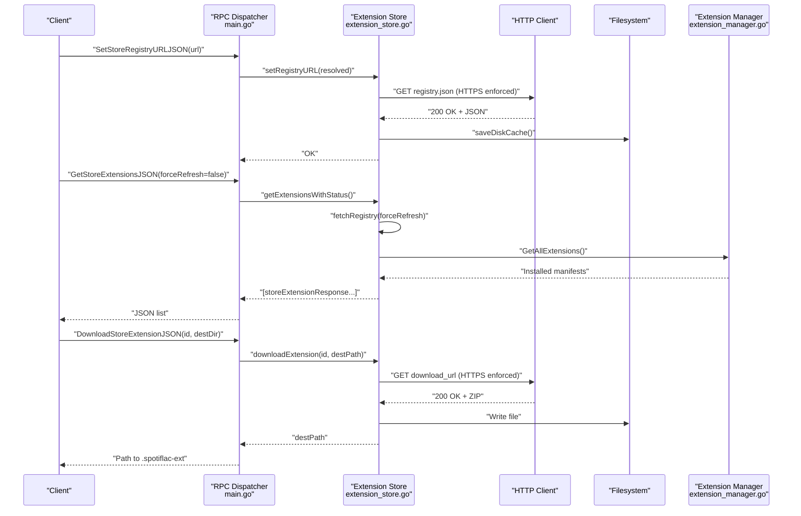
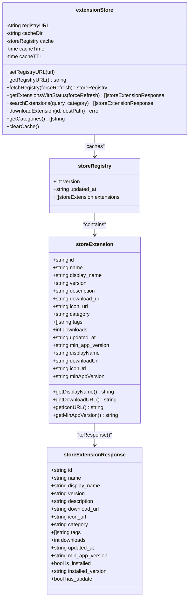
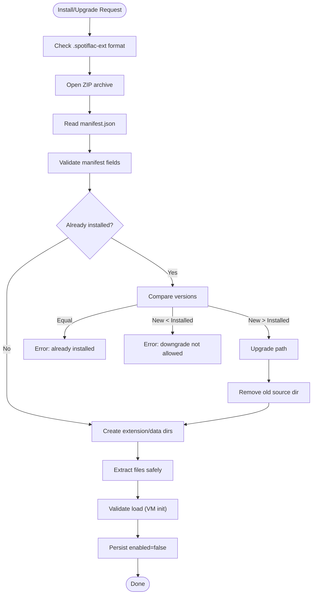
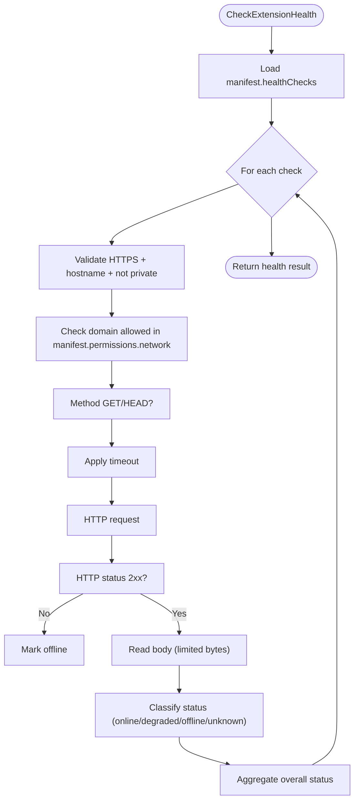
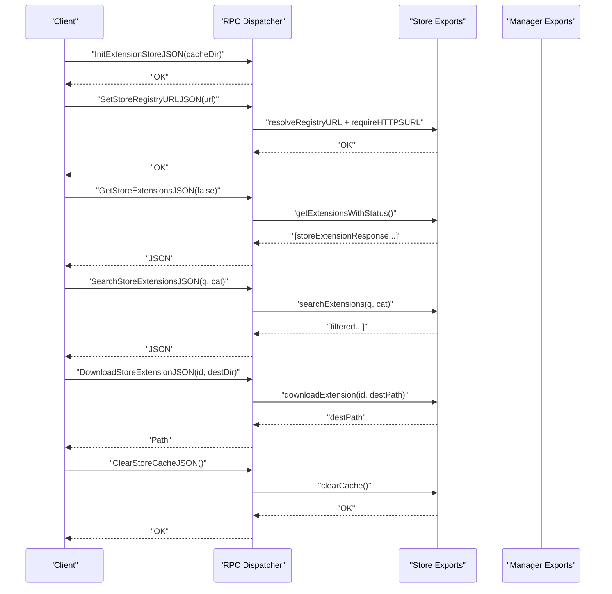
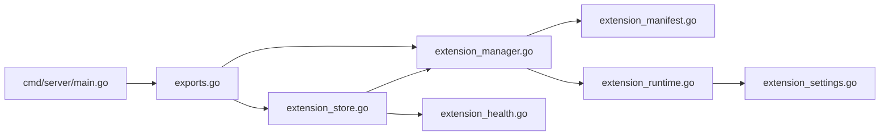

# Extension Store

<cite>
**Referenced Files in This Document**
- [extension_store.go](file://go_backend_spotiflac/extension_store.go)
- [extension_manager.go](file://go_backend_spotiflac/extension_manager.go)
- [extension_manifest.go](file://go_backend_spotiflac/extension_manifest.go)
- [extension_health.go](file://go_backend_spotiflac/extension_health.go)
- [extension_runtime.go](file://go_backend_spotiflac/extension_runtime.go)
- [extension_runtime_auth.go](file://go_backend_spotiflac/extension_runtime_auth.go)
- [extension_settings.go](file://go_backend_spotiflac/extension_settings.go)
- [exports.go](file://go_backend_spotiflac/exports.go)
- [main.go](file://go_backend_spotiflac/cmd/server/main.go)
</cite>

## Table of Contents
1. [Introduction](#introduction)
2. [Project Structure](#project-structure)
3. [Core Components](#core-components)
4. [Architecture Overview](#architecture-overview)
5. [Detailed Component Analysis](#detailed-component-analysis)
6. [Dependency Analysis](#dependency-analysis)
7. [Performance Considerations](#performance-considerations)
8. [Troubleshooting Guide](#troubleshooting-guide)
9. [Conclusion](#conclusion)
10. [Appendices](#appendices)

## Introduction
This document describes the extension store system that powers extension discovery, installation, and management in the backend. It explains the marketplace architecture, version management, dependency resolution, health monitoring, automatic updates, and compatibility checking. It also documents the extension store API, search functionality, categories, and provides practical workflows for browsing, installing, and updating extensions. Security and trust mechanisms, including HTTPS enforcement, domain allowlists, and sandboxing, are covered alongside developer guidelines for publishing and distribution.

## Project Structure
The extension store is implemented in the Go backend module and integrates with the extension manager, runtime, and settings subsystems. The server exposes RPC endpoints that front the extension store and extension manager APIs.

**Diagram sources**
- [main.go:107-134](file://go_backend_spotiflac/cmd/server/main.go#L107-L134)
- [extension_store.go:120-184](file://go_backend_spotiflac/extension_store.go#L120-L184)
- [exports.go:3338-3470](file://go_backend_spotiflac/exports.go#L3338-L3470)
- [extension_manager.go:120-139](file://go_backend_spotiflac/extension_manager.go#L120-L139)
- [extension_manifest.go:116-138](file://go_backend_spotiflac/extension_manifest.go#L116-L138)
- [extension_health.go:41-99](file://go_backend_spotiflac/extension_health.go#L41-L99)
- [extension_runtime.go:84-147](file://go_backend_spotiflac/extension_runtime.go#L84-L147)
- [extension_runtime_auth.go:18-42](file://go_backend_spotiflac/extension_runtime_auth.go#L18-L42)
- [extension_settings.go:11-29](file://go_backend_spotiflac/extension_settings.go#L11-L29)

**Section sources**
- [main.go:107-134](file://go_backend_spotiflac/cmd/server/main.go#L107-L134)
- [extension_store.go:120-184](file://go_backend_spotiflac/extension_store.go#L120-L184)
- [exports.go:3338-3470](file://go_backend_spotiflac/exports.go#L3338-L3470)

## Core Components
- Extension store: Registry caching, HTTPS enforcement, search, and download pipeline.
- Extension manager: Lifecycle management of installed extensions (.spotiflac-ext), version comparison, upgrade/downgrade protection, and runtime initialization.
- Manifest and validation: Defines extension capabilities, permissions, health checks, and settings.
- Health monitoring: Periodic checks against configured endpoints with classification and thresholds.
- Runtime and sandbox: HTTP client with domain allowlist, redirect restrictions, cookie jar, and API surface exposed to extensions.
- Settings store: Persistent JSON-backed settings per extension.
- Exports: Public RPC endpoints that expose store and manager functionality to clients.

**Section sources**
- [extension_store.go:24-118](file://go_backend_spotiflac/extension_store.go#L24-L118)
- [extension_manager.go:120-139](file://go_backend_spotiflac/extension_manager.go#L120-L139)
- [extension_manifest.go:116-242](file://go_backend_spotiflac/extension_manifest.go#L116-L242)
- [extension_health.go:41-99](file://go_backend_spotiflac/extension_health.go#L41-L99)
- [extension_runtime.go:84-147](file://go_backend_spotiflac/extension_runtime.go#L84-L147)
- [extension_settings.go:11-29](file://go_backend_spotiflac/extension_settings.go#L11-L29)
- [exports.go:3338-3470](file://go_backend_spotiflac/exports.go#L3338-L3470)

## Architecture Overview
The extension store architecture centers on a registry-driven model. Clients call RPC endpoints to configure the store’s registry URL, list extensions, search, and download. The store caches the registry locally and enriches results with installed status and update availability. The extension manager handles unpacking, validation, and lifecycle of installed extensions, while the runtime provides a secure, sandboxed environment for extension code.

**Diagram sources**
- [main.go:555-800](file://go_backend_spotiflac/cmd/server/main.go#L555-L800)
- [extension_store.go:154-296](file://go_backend_spotiflac/extension_store.go#L154-L296)
- [extension_manager.go:597-606](file://go_backend_spotiflac/extension_manager.go#L597-L606)
- [exports.go:3343-3460](file://go_backend_spotiflac/exports.go#L3343-L3460)

## Detailed Component Analysis

### Extension Store
Responsibilities:
- Registry URL resolution and HTTPS enforcement.
- Local cache with TTL and disk persistence.
- Enriched extension listing with installed status and update availability.
- Search by query and category.
- Download of .spotiflac-ext packages with HTTPS enforcement.

Key behaviors:
- GitHub URL normalization to raw registry endpoint.
- HTTPS-only registry and download URLs.
- Category enumeration and search filtering.
- Disk cache load/save for offline resilience.

**Diagram sources**
- [extension_store.go:120-184](file://go_backend_spotiflac/extension_store.go#L120-L184)
- [extension_store.go:74-118](file://go_backend_spotiflac/extension_store.go#L74-L118)
- [extension_store.go:24-78](file://go_backend_spotiflac/extension_store.go#L24-L78)

**Section sources**
- [extension_store.go:120-184](file://go_backend_spotiflac/extension_store.go#L120-L184)
- [extension_store.go:233-296](file://go_backend_spotiflac/extension_store.go#L233-L296)
- [extension_store.go:299-331](file://go_backend_spotiflac/extension_store.go#L299-L331)
- [extension_store.go:333-388](file://go_backend_spotiflac/extension_store.go#L333-L388)
- [extension_store.go:390-450](file://go_backend_spotiflac/extension_store.go#L390-L450)
- [extension_store.go:466-474](file://go_backend_spotiflac/extension_store.go#L466-L474)
- [extension_store.go:476-515](file://go_backend_spotiflac/extension_store.go#L476-L515)
- [extension_store.go:517-530](file://go_backend_spotiflac/extension_store.go#L517-L530)

### Extension Manager
Responsibilities:
- Load/unload/remove extensions.
- Validate and install .spotiflac-ext packages.
- Version comparison and upgrade policy (no downgrades).
- Runtime initialization and sandboxing.
- Persist enable/disable state and settings.

Key behaviors:
- Zip extraction with safety checks (no .. paths, no absolute paths).
- Manifest validation and presence checks (manifest.json, index.js).
- Runtime creation with isolated APIs and cookie jar.
- Settings persistence under extension-specific directories.

**Diagram sources**
- [extension_manager.go:158-294](file://go_backend_spotiflac/extension_manager.go#L158-L294)
- [extension_manager.go:758-800](file://go_backend_spotiflac/extension_manager.go#L758-L800)
- [extension_manifest.go:149-160](file://go_backend_spotiflac/extension_manifest.go#L149-L160)

**Section sources**
- [extension_manager.go:158-294](file://go_backend_spotiflac/extension_manager.go#L158-L294)
- [extension_manager.go:758-800](file://go_backend_spotiflac/extension_manager.go#L758-L800)
- [extension_manifest.go:149-160](file://go_backend_spotiflac/extension_manifest.go#L149-L160)

### Manifest and Validation
The manifest defines:
- Identity and metadata (name, version, description).
- Types (metadata_provider, download_provider, lyrics_provider).
- Permissions (network allowlist, storage/file access, optional HTTP allowance).
- Settings schema (types, defaults, options).
- Capabilities (e.g., timeouts, replacements).
- Health checks (per-service endpoints).
- Optional behaviors (search behavior, URL handlers, matching, post-processing).

Validation ensures required fields and correct types.

**Section sources**
- [extension_manifest.go:116-242](file://go_backend_spotiflac/extension_manifest.go#L116-L242)

### Health Monitoring
Health checks are defined per extension via manifest and executed by the runtime:
- HTTPS-only, non-private IP enforcement.
- GET/HEAD allowed, with configurable timeouts.
- Body classification supports top-level status or nested service keys.
- Aggregate status considers required vs. optional checks.

**Diagram sources**
- [extension_health.go:56-99](file://go_backend_spotiflac/extension_health.go#L56-L99)
- [extension_health.go:101-205](file://go_backend_spotiflac/extension_health.go#L101-L205)
- [extension_health.go:207-332](file://go_backend_spotiflac/extension_health.go#L207-L332)

**Section sources**
- [extension_health.go:41-99](file://go_backend_spotiflac/extension_health.go#L41-L99)
- [extension_health.go:101-205](file://go_backend_spotiflac/extension_health.go#L101-L205)
- [extension_health.go:207-332](file://go_backend_spotiflac/extension_health.go#L207-L332)

### Runtime and Sandbox
The extension runtime provides:
- HTTP client with redirect policy (HTTPS-only, allowed domains, no private IPs).
- Cookie jar per extension.
- APIs exposed to extension JS (http, storage, credentials, file, ffmpeg, matching, utils, log, gobackend).
- Optional PKCE/OAuth helpers for auth flows.
- Request cancellation support keyed by request IDs.

Security controls:
- Redirects restricted to HTTPS and allowed domains.
- Private IP detection and blocking.
- HTTPS enforcement for health checks and auth URLs.

**Section sources**
- [extension_runtime.go:250-286](file://go_backend_spotiflac/extension_runtime.go#L250-L286)
- [extension_runtime.go:300-394](file://go_backend_spotiflac/extension_runtime.go#L300-L394)
- [extension_runtime.go:424-533](file://go_backend_spotiflac/extension_runtime.go#L424-L533)
- [extension_runtime_auth.go:18-42](file://go_backend_spotiflac/extension_runtime_auth.go#L18-L42)

### Settings Store
Persistent settings per extension:
- Directory layout per extension ID.
- JSON file for settings.
- Load on startup, save on change.
- Accessors for single/all settings.

**Section sources**
- [extension_settings.go:11-29](file://go_backend_spotiflac/extension_settings.go#L11-L29)
- [extension_settings.go:71-103](file://go_backend_spotiflac/extension_settings.go#L71-L103)
- [extension_settings.go:105-157](file://go_backend_spotiflac/extension_settings.go#L105-L157)

### Extension Store API
Public RPC endpoints:
- Configure registry URL (resolve and HTTPS enforce).
- List extensions with installed/update status.
- Search by query and category.
- Get categories.
- Download extension package.
- Clear cache.

**Diagram sources**
- [exports.go:3338-3470](file://go_backend_spotiflac/exports.go#L3338-L3470)
- [extension_store.go:390-450](file://go_backend_spotiflac/extension_store.go#L390-L450)
- [extension_store.go:476-515](file://go_backend_spotiflac/extension_store.go#L476-L515)
- [extension_store.go:333-388](file://go_backend_spotiflac/extension_store.go#L333-L388)

**Section sources**
- [exports.go:3338-3470](file://go_backend_spotiflac/exports.go#L3338-L3470)

## Dependency Analysis
- Store depends on Manager for installed extension state and on HTTP for registry/package downloads.
- Manager depends on Manifest for validation and on Runtime for sandboxed execution.
- Runtime depends on Manifest for permissions and on Settings for persisted state.
- Health depends on Manifest for health check definitions and on HTTP for requests.
- Server RPC dispatcher depends on Exports for store and manager operations.

**Diagram sources**
- [extension_store.go:120-184](file://go_backend_spotiflac/extension_store.go#L120-L184)
- [extension_manager.go:120-139](file://go_backend_spotiflac/extension_manager.go#L120-L139)
- [extension_manifest.go:116-138](file://go_backend_spotiflac/extension_manifest.go#L116-L138)
- [extension_runtime.go:84-147](file://go_backend_spotiflac/extension_runtime.go#L84-L147)
- [extension_settings.go:11-29](file://go_backend_spotiflac/extension_settings.go#L11-L29)
- [extension_health.go:41-99](file://go_backend_spotiflac/extension_health.go#L41-L99)
- [exports.go:3338-3470](file://go_backend_spotiflac/exports.go#L3338-L3470)
- [main.go:555-800](file://go_backend_spotiflac/cmd/server/main.go#L555-L800)

**Section sources**
- [extension_store.go:120-184](file://go_backend_spotiflac/extension_store.go#L120-L184)
- [extension_manager.go:120-139](file://go_backend_spotiflac/extension_manager.go#L120-L139)
- [extension_manifest.go:116-138](file://go_backend_spotiflac/extension_manifest.go#L116-L138)
- [extension_runtime.go:84-147](file://go_backend_spotiflac/extension_runtime.go#L84-L147)
- [extension_settings.go:11-29](file://go_backend_spotiflac/extension_settings.go#L11-L29)
- [extension_health.go:41-99](file://go_backend_spotiflac/extension_health.go#L41-L99)
- [exports.go:3338-3470](file://go_backend_spotiflac/exports.go#L3338-L3470)
- [main.go:555-800](file://go_backend_spotiflac/cmd/server/main.go#L555-L800)

## Performance Considerations
- Registry caching with TTL reduces network overhead and improves responsiveness.
- Disk cache persists registry and timestamps to survive restarts.
- HTTPS enforcement and strict redirect policies prevent expensive retries and mitigate risks.
- Version comparison is O(n) over semantic version segments; keep manifests concise.
- Health checks use bounded body reads and short timeouts to avoid blocking.

[No sources needed since this section provides general guidance]

## Troubleshooting Guide
Common issues and resolutions:
- Registry URL not HTTPS or invalid: Ensure HTTPS and valid hostnames; GitHub URLs are normalized to raw endpoints.
- Network errors or timeouts: Verify connectivity, allowed domains, and that redirects remain within HTTPS and allowed hosts.
- Extension not found in store: Confirm extension ID exists in registry and that the store cache is not stale (use force refresh).
- Download failures: Check download_url is HTTPS and reachable; review filesystem permissions for destination.
- Health checks failing: Review manifest health check configuration, required vs optional, and service key paths; ensure non-private endpoints.

Operational commands:
- Clear store cache to force reload registry.
- Reconfigure registry URL after fixing malformed input.

**Section sources**
- [extension_store.go:246-279](file://go_backend_spotiflac/extension_store.go#L246-L279)
- [extension_store.go:351-372](file://go_backend_spotiflac/extension_store.go#L351-L372)
- [extension_health.go:118-149](file://go_backend_spotiflac/extension_health.go#L118-L149)
- [extension_runtime.go:260-284](file://go_backend_spotiflac/extension_runtime.go#L260-L284)
- [exports.go:3362-3371](file://go_backend_spotiflac/exports.go#L3362-L3371)
- [exports.go:3462-3470](file://go_backend_spotiflac/exports.go#L3462-L3470)

## Conclusion
The extension store system provides a robust, secure, and efficient mechanism for discovering, installing, and managing extensions. Its registry-driven design, strict security policies, and integrated health monitoring ensure reliability and trust. Developers can publish extensions with clear manifests and health checks, while administrators benefit from clear APIs, caching, and operational controls.

[No sources needed since this section summarizes without analyzing specific files]

## Appendices

### Practical Workflows

- Browse extensions
  - Configure registry URL via RPC.
  - List extensions with installed/update status.
  - Optionally filter by category.

- Install an extension
  - Download the .spotiflac-ext package.
  - Load from file path; the manager validates and installs.

- Update an extension
  - Upgrade from a newer .spotiflac-ext package; downgrades are rejected.

- Check health
  - Trigger health checks for an extension; aggregate status reflects required/optional checks.

- Search and categories
  - Use search by query and category; categories are predefined.

**Section sources**
- [exports.go:3343-3470](file://go_backend_spotiflac/exports.go#L3343-L3470)
- [extension_store.go:476-515](file://go_backend_spotiflac/extension_store.go#L476-L515)
- [extension_manager.go:158-294](file://go_backend_spotiflac/extension_manager.go#L158-L294)
- [extension_health.go:41-99](file://go_backend_spotiflac/extension_health.go#L41-L99)

### Developer Guidelines

- Publishing checklist
  - Define manifest with name, version, description, types, permissions, and capabilities.
  - Add health checks if applicable.
  - Package as .spotiflac-ext with manifest.json and index.js.
  - Host download_url securely and ensure HTTPS.

- Distribution
  - Use HTTPS registry and package endpoints.
  - Normalize GitHub registry URLs to raw endpoints.

- Community management
  - Keep min_app_version aligned with your platform.
  - Provide clear categories and tags for discoverability.
  - Monitor health check results and adjust service keys as needed.

**Section sources**
- [extension_manifest.go:116-242](file://go_backend_spotiflac/extension_manifest.go#L116-L242)
- [extension_store.go:390-450](file://go_backend_spotiflac/extension_store.go#L390-L450)
- [extension_health.go:101-205](file://go_backend_spotiflac/extension_health.go#L101-L205)

### Security and Trust

- HTTPS enforcement
  - Registry URL, download URL, and health endpoints must use HTTPS.
- Domain allowlist
  - Extensions may only access domains in their permissions.network.
- Redirect safety
  - Redirects must remain HTTPS and within allowed domains; private IPs are blocked.
- Auth flows
  - OAuth/PKCE supported with secure state handling.

**Section sources**
- [extension_store.go:452-464](file://go_backend_spotiflac/extension_store.go#L452-L464)
- [extension_health.go:118-149](file://go_backend_spotiflac/extension_health.go#L118-L149)
- [extension_runtime.go:260-284](file://go_backend_spotiflac/extension_runtime.go#L260-L284)
- [extension_runtime_auth.go:18-42](file://go_backend_spotiflac/extension_runtime_auth.go#L18-L42)