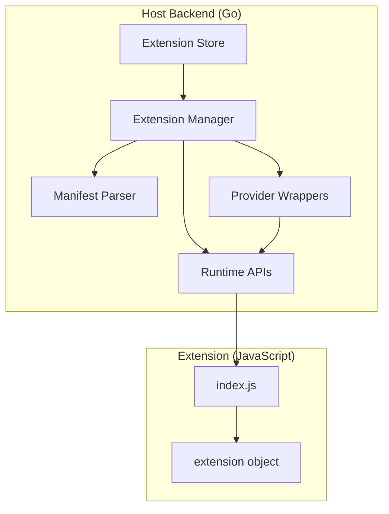
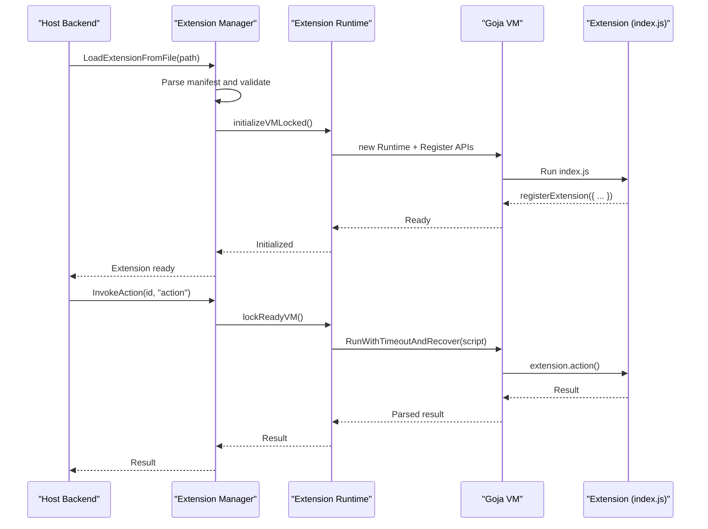
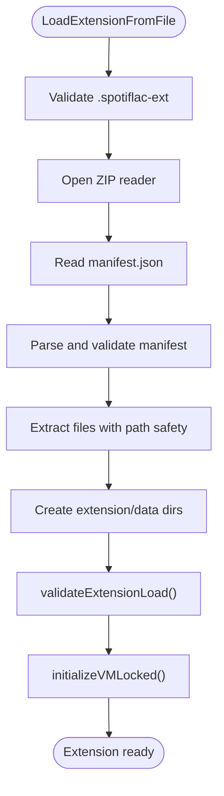
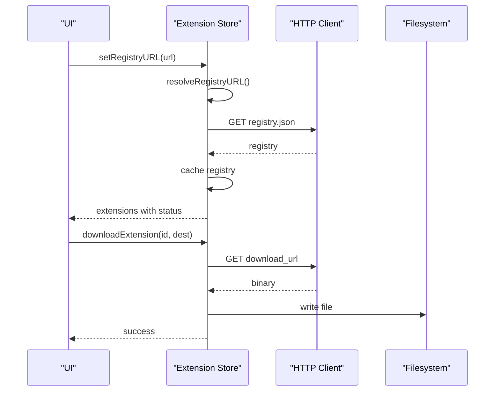
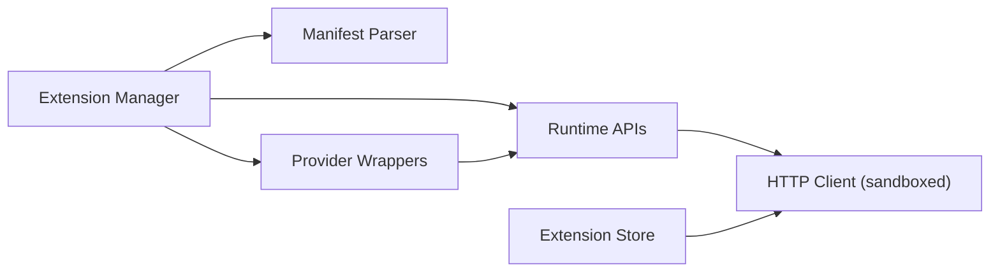

# Extension System

<cite>
**Referenced Files in This Document**
- [extension_manager.go](file://go_backend_spotiflac/extension_manager.go)
- [extension_manifest.go](file://go_backend_spotiflac/extension_manifest.go)
- [extension_runtime.go](file://go_backend_spotiflac/extension_runtime.go)
- [extension_runtime_http.go](file://go_backend_spotiflac/extension_runtime_http.go)
- [extension_providers.go](file://go_backend_spotiflac/extension_providers.go)
- [extension_store.go](file://go_backend_spotiflac/extension_store.go)
</cite>

## Table of Contents
1. [Introduction](#introduction)
2. [Project Structure](#project-structure)
3. [Core Components](#core-components)
4. [Architecture Overview](#architecture-overview)
5. [Detailed Component Analysis](#detailed-component-analysis)
6. [Dependency Analysis](#dependency-analysis)
7. [Performance Considerations](#performance-considerations)
8. [Security Model](#security-model)
9. [Extension Development Guide](#extension-development-guide)
10. [Extension Store and Updates](#extension-store-and-updates)
11. [Troubleshooting Guide](#troubleshooting-guide)
12. [Conclusion](#conclusion)

## Introduction
This document describes the extension system that powers plugin-based audio providers in the application. It covers the JavaScript runtime integration, extension lifecycle management, the extension API surface, manifest system, provider registration mechanisms, and the extension store. It also provides practical guidance for building custom audio providers, lyrics services, and metadata sources, along with security and performance considerations.

## Project Structure
The extension system is implemented in Go and exposes a JavaScript runtime to extensions packaged as .spotiflac-ext archives. The core components include:
- Extension Manager: Loads, validates, initializes, and manages extension lifecycles
- Manifest Parser: Validates extension manifests and permissions
- Runtime APIs: HTTP, storage, credentials, file, FFmpeg, matching, utilities, logging, and sandboxing
- Provider Wrappers: Bridge between Go backend and JavaScript extension APIs
- Extension Store: Registry-driven discovery and installation of extensions



**Diagram sources**
- [extension_manager.go:120-140](file://go_backend_spotiflac/extension_manager.go#L120-L140)
- [extension_manifest.go:116-138](file://go_backend_spotiflac/extension_manifest.go#L116-L138)
- [extension_runtime.go:424-533](file://go_backend_spotiflac/extension_runtime.go#L424-L533)
- [extension_providers.go:523-533](file://go_backend_spotiflac/extension_providers.go#L523-L533)
- [extension_store.go:120-127](file://go_backend_spotiflac/extension_store.go#L120-L127)

**Section sources**
- [extension_manager.go:120-156](file://go_backend_spotiflac/extension_manager.go#L120-L156)
- [extension_manifest.go:116-138](file://go_backend_spotiflac/extension_manifest.go#L116-L138)
- [extension_runtime.go:424-533](file://go_backend_spotiflac/extension_runtime.go#L424-L533)
- [extension_providers.go:523-533](file://go_backend_spotiflac/extension_providers.go#L523-L533)
- [extension_store.go:120-127](file://go_backend_spotiflac/extension_store.go#L120-L127)

## Core Components
- Extension Manager: Handles loading/unloading, enabling/disabling, initialization, and invoking extension actions. Manages per-extension VMs and runtime instances.
- Manifest System: Defines extension types (metadata, download, lyrics), permissions, settings, capabilities, and optional features (custom search, URL handlers, post-processing).
- Runtime APIs: Provides HTTP, storage, credentials, file IO, FFmpeg, matching utilities, cryptography, and logging to extensions.
- Provider Wrappers: Translate Go backend calls into JavaScript invocations and parse results back into structured data.
- Extension Store: Registry-driven discovery, caching, and installation of extensions.

**Section sources**
- [extension_manager.go:120-156](file://go_backend_spotiflac/extension_manager.go#L120-L156)
- [extension_manifest.go:116-138](file://go_backend_spotiflac/extension_manifest.go#L116-L138)
- [extension_runtime.go:424-533](file://go_backend_spotiflac/extension_runtime.go#L424-L533)
- [extension_providers.go:523-533](file://go_backend_spotiflac/extension_providers.go#L523-L533)
- [extension_store.go:120-127](file://go_backend_spotiflac/extension_store.go#L120-L127)

## Architecture Overview
The system integrates a JavaScript engine (Goja) per extension with a sandboxed runtime that exposes a controlled API surface. Extensions are validated against their manifest and permissions before being initialized. Providers implement standardized functions for metadata retrieval, availability checks, downloading, URL handling, custom search, matching, and post-processing.



**Diagram sources**
- [extension_manager.go:158-294](file://go_backend_spotiflac/extension_manager.go#L158-L294)
- [extension_manager.go:296-344](file://go_backend_spotiflac/extension_manager.go#L296-L344)
- [extension_manager.go:1134-1201](file://go_backend_spotiflac/extension_manager.go#L1134-L1201)
- [extension_runtime.go:424-533](file://go_backend_spotiflac/extension_runtime.go#L424-L533)

## Detailed Component Analysis

### Extension Manager
Responsibilities:
- Load extensions from .spotiflac-ext archives or local directories
- Validate manifests and permissions
- Initialize and teardown per-extension VMs
- Manage enable/disable state and persisted settings
- Invoke extension actions with timeouts and recovery
- Upgrade/remove extensions with safety checks

Key behaviors:
- Version comparison and upgrade logic prevents downgrades
- Safe extraction with path sanitization
- Per-extension mutex for thread-safe VM access
- Initialization with stored settings and cleanup hooks



**Diagram sources**
- [extension_manager.go:158-294](file://go_backend_spotiflac/extension_manager.go#L158-L294)
- [extension_manager.go:296-344](file://go_backend_spotiflac/extension_manager.go#L296-L344)

**Section sources**
- [extension_manager.go:158-294](file://go_backend_spotiflac/extension_manager.go#L158-L294)
- [extension_manager.go:296-344](file://go_backend_spotiflac/extension_manager.go#L296-L344)
- [extension_manager.go:567-584](file://go_backend_spotiflac/extension_manager.go#L567-L584)
- [extension_manager.go:608-640](file://go_backend_spotiflac/extension_manager.go#L608-L640)
- [extension_manager.go:738-755](file://go_backend_spotiflac/extension_manager.go#L738-L755)
- [extension_manager.go:758-897](file://go_backend_spotiflac/extension_manager.go#L758-L897)
- [extension_manager.go:1134-1201](file://go_backend_spotiflac/extension_manager.go#L1134-L1201)

### Manifest System
Defines extension capabilities and constraints:
- Types: metadata_provider, download_provider, lyrics_provider
- Permissions: network domains, storage, file access, allowHTTP
- Settings: typed configuration with defaults, secrets, and actions
- Capabilities: optional features like custom search, URL handlers, post-processing, health checks
- Behavior flags: skip metadata enrichment, skip lyrics, stop provider fallback, skip built-in fallback

Validation ensures required fields and correct types.

**Section sources**
- [extension_manifest.go:11-25](file://go_backend_spotiflac/extension_manifest.go#L11-L25)
- [extension_manifest.go:27-44](file://go_backend_spotiflac/extension_manifest.go#L27-L44)
- [extension_manifest.go:116-138](file://go_backend_spotiflac/extension_manifest.go#L116-L138)
- [extension_manifest.go:149-242](file://go_backend_spotiflac/extension_manifest.go#L149-L242)

### Runtime APIs
The runtime exposes a comprehensive API surface to extensions:
- HTTP: GET, POST, PUT, DELETE, PATCH, request with body/header options, cookie clearing
- Storage: key-value persistence with automatic flushing
- Credentials: secure storage/retrieval of tokens and secrets
- File: download, existence checks, delete, read/write bytes, copy/move, size
- FFmpeg: execute, info, convert
- Matching: string normalization, duration comparison
- Utils: crypto, hashing, encoding, JSON, random UA, app version, sleep, cancellation helpers, download status
- Logging: debug/info/warn/error
- Go backend: filename sanitization polyfill

Security and sandboxing:
- HTTPS-only by default; allowHTTP only if explicitly permitted
- Redirects restricted to allowed domains and disallow private IPs
- Request cancellation bound to active download/request contexts
- Response body limited to prevent memory exhaustion
- Cookie jar per extension for isolation

**Section sources**
- [extension_runtime.go:424-533](file://go_backend_spotiflac/extension_runtime.go#L424-L533)
- [extension_runtime_http.go:38-69](file://go_backend_spotiflac/extension_runtime_http.go#L38-L69)
- [extension_runtime_http.go:71-145](file://go_backend_spotiflac/extension_runtime_http.go#L71-L145)
- [extension_runtime_http.go:245-353](file://go_backend_spotiflac/extension_runtime_http.go#L245-L353)

### Provider Registration and Wrappers
Provider wrappers translate Go backend operations into JavaScript calls:
- Metadata providers: searchTracks, getTrack, getAlbum, getPlaylist, getArtist, enrichTrack, customSearch, handleUrl, matchTrack, postProcess/postProcessV2
- Download providers: checkAvailability, getDownloadUrl, download
- Lyrics providers: fetchLyrics

Each wrapper:
- Validates extension type and enabled state
- Initializes a fresh runtime for isolated execution (especially for downloads)
- Binds cancellation contexts to requests/downloads
- Parses structured results into strongly-typed models
- Applies provider-specific transformations and overlays

```mermaid
classDiagram
class ExtensionProviderWrapper {
-extension *loadedExtension
-vm *goja.Runtime
+lockReadyVM() error
+SearchTracks(query, limit) ExtSearchResult
+GetTrack(id) ExtTrackMetadata
+GetAlbum(id) ExtAlbumMetadata
+GetPlaylist(id) ExtAlbumMetadata
+GetArtist(id) ExtArtistMetadata
+EnrichTrack(track) ExtTrackMetadata
+CheckAvailability(isrc, name, artist, ids, duration) ExtAvailabilityResult
+GetDownloadUrl(id, quality) ExtDownloadURLResult
+Download(id, quality, path, itemID, onProgress) ExtDownloadResult
+CustomSearch(query, options) []ExtTrackMetadata
+HandleURL(url) ExtURLHandleResult
+MatchTrack(source, candidates) MatchTrackResult
+PostProcess(path, meta, hookID) PostProcessResult
+PostProcessV2(input, meta, hookID) PostProcessResult
+FetchLyrics(name, artist, album, duration) LyricsResponse
}
class ExtensionManifest {
+Types []ExtensionType
+Permissions ExtensionPermissions
+Settings []ExtensionSetting
+Capabilities map[string]interface{}
+IsMetadataProvider() bool
+IsDownloadProvider() bool
+IsLyricsProvider() bool
+HasCustomSearch() bool
+HasURLHandler() bool
+HasPostProcessing() bool
+StopsProviderFallback() bool
}
ExtensionProviderWrapper --> ExtensionManifest : "validates"
```

**Diagram sources**
- [extension_providers.go:523-533](file://go_backend_spotiflac/extension_providers.go#L523-L533)
- [extension_providers.go:1044-1115](file://go_backend_spotiflac/extension_providers.go#L1044-L1115)
- [extension_providers.go:1117-1164](file://go_backend_spotiflac/extension_providers.go#L1117-L1164)
- [extension_providers.go:1166-1220](file://go_backend_spotiflac/extension_providers.go#L1166-L1220)
- [extension_providers.go:1222-1279](file://go_backend_spotiflac/extension_providers.go#L1222-L1279)
- [extension_providers.go:1340-1419](file://go_backend_spotiflac/extension_providers.go#L1340-L1419)
- [extension_providers.go:1421-1494](file://go_backend_spotiflac/extension_providers.go#L1421-L1494)
- [extension_providers.go:1496-1542](file://go_backend_spotiflac/extension_providers.go#L1496-L1542)
- [extension_providers.go:1546-1654](file://go_backend_spotiflac/extension_providers.go#L1546-L1654)
- [extension_providers.go:2661-2781](file://go_backend_spotiflac/extension_providers.go#L2661-L2781)
- [extension_providers.go:2793-2884](file://go_backend_spotiflac/extension_providers.go#L2793-L2884)
- [extension_providers.go:2893-2942](file://go_backend_spotiflac/extension_providers.go#L2893-L2942)
- [extension_providers.go:2964-3083](file://go_backend_spotiflac/extension_providers.go#L2964-L3083)
- [extension_providers.go:3274-3370](file://go_backend_spotiflac/extension_providers.go#L3274-L3370)
- [extension_manifest.go:244-270](file://go_backend_spotiflac/extension_manifest.go#L244-L270)

**Section sources**
- [extension_providers.go:523-533](file://go_backend_spotiflac/extension_providers.go#L523-L533)
- [extension_providers.go:1044-1115](file://go_backend_spotiflac/extension_providers.go#L1044-L1115)
- [extension_providers.go:1117-1164](file://go_backend_spotiflac/extension_providers.go#L1117-L1164)
- [extension_providers.go:1166-1220](file://go_backend_spotiflac/extension_providers.go#L1166-L1220)
- [extension_providers.go:1222-1279](file://go_backend_spotiflac/extension_providers.go#L1222-L1279)
- [extension_providers.go:1340-1419](file://go_backend_spotiflac/extension_providers.go#L1340-L1419)
- [extension_providers.go:1421-1494](file://go_backend_spotiflac/extension_providers.go#L1421-L1494)
- [extension_providers.go:1496-1542](file://go_backend_spotiflac/extension_providers.go#L1496-L1542)
- [extension_providers.go:1546-1654](file://go_backend_spotiflac/extension_providers.go#L1546-L1654)
- [extension_providers.go:2661-2781](file://go_backend_spotiflac/extension_providers.go#L2661-L2781)
- [extension_providers.go:2793-2884](file://go_backend_spotiflac/extension_providers.go#L2793-L2884)
- [extension_providers.go:2893-2942](file://go_backend_spotiflac/extension_providers.go#L2893-L2942)
- [extension_providers.go:2964-3083](file://go_backend_spotiflac/extension_providers.go#L2964-L3083)
- [extension_providers.go:3274-3370](file://go_backend_spotiflac/extension_providers.go#L3274-L3370)
- [extension_manifest.go:244-270](file://go_backend_spotiflac/extension_manifest.go#L244-L270)

### Extension Store
The store provides:
- Registry-driven discovery and caching
- Category filtering and search
- Install/update/download of extensions
- Resolution of GitHub registry URLs to raw JSON
- HTTPS enforcement for registry and downloads



**Diagram sources**
- [extension_store.go:154-178](file://go_backend_spotiflac/extension_store.go#L154-L178)
- [extension_store.go:233-297](file://go_backend_spotiflac/extension_store.go#L233-L297)
- [extension_store.go:333-388](file://go_backend_spotiflac/extension_store.go#L333-L388)
- [extension_store.go:390-423](file://go_backend_spotiflac/extension_store.go#L390-L423)

**Section sources**
- [extension_store.go:154-178](file://go_backend_spotiflac/extension_store.go#L154-L178)
- [extension_store.go:233-297](file://go_backend_spotiflac/extension_store.go#L233-L297)
- [extension_store.go:333-388](file://go_backend_spotiflac/extension_store.go#L333-L388)
- [extension_store.go:390-423](file://go_backend_spotiflac/extension_store.go#L390-L423)

## Dependency Analysis
- Extension Manager depends on Manifest Parser, Runtime APIs, and Provider Wrappers
- Provider Wrappers depend on Runtime APIs and Goja VM
- Runtime APIs depend on HTTP client with sandboxing rules
- Extension Store depends on HTTP client and filesystem



**Diagram sources**
- [extension_manager.go:120-156](file://go_backend_spotiflac/extension_manager.go#L120-L156)
- [extension_runtime.go:250-286](file://go_backend_spotiflac/extension_runtime.go#L250-L286)
- [extension_runtime_http.go:38-69](file://go_backend_spotiflac/extension_runtime_http.go#L38-L69)
- [extension_store.go:252-263](file://go_backend_spotiflac/extension_store.go#L252-L263)

**Section sources**
- [extension_manager.go:120-156](file://go_backend_spotiflac/extension_manager.go#L120-L156)
- [extension_runtime.go:250-286](file://go_backend_spotiflac/extension_runtime.go#L250-L286)
- [extension_runtime_http.go:38-69](file://go_backend_spotiflac/extension_runtime_http.go#L38-L69)
- [extension_store.go:252-263](file://go_backend_spotiflac/extension_store.go#L252-L263)

## Performance Considerations
- Default JavaScript timeouts are enforced per operation
- Dedicated storage flusher minimizes I/O overhead
- Response body size limits protect memory usage
- Per-operation parsing and payload recording help diagnose slow extensions
- Provider prioritization reduces latency by trying preferred providers first

[No sources needed since this section provides general guidance]

## Security Model
- HTTPS-only network access by default; allowHTTP requires explicit permission
- Redirects validated against allowed domains and blocked private/local IPs
- Path traversal and unsafe paths are rejected during extraction
- Credentials and storage are isolated per extension
- Request cancellation integrates with active download/request contexts
- Response body capped to prevent abuse

**Section sources**
- [extension_runtime_http.go:38-69](file://go_backend_spotiflac/extension_runtime_http.go#L38-L69)
- [extension_runtime_http.go:22-36](file://go_backend_spotiflac/extension_runtime_http.go#L22-L36)
- [extension_manager.go:240-269](file://go_backend_spotiflac/extension_manager.go#L240-L269)

## Extension Development Guide

### Creating a Custom Audio Provider
Steps:
1. Define manifest with type download_provider and required permissions
2. Implement index.js with registerExtension({ ... }) containing:
   - checkAvailability(isrc, name, artist, ids, duration) => availability
   - getDownloadUrl(trackId, quality) => { url, format, bitDepth, sampleRate }
   - download(trackId, quality, outputPath, onProgress) => { success, file_path, error_* }
3. Optionally implement metadata enrichment hooks if acting as metadata provider
4. Package as .spotiflac-ext with manifest.json and index.js

Integration patterns:
- Use http.request for custom protocols or authentication
- Persist small state with storage.set/get
- Report progress via __onProgress callback during download
- Respect cancellation via isDownloadCancelled/isRequestCancelled

**Section sources**
- [extension_manifest.go:11-25](file://go_backend_spotiflac/extension_manifest.go#L11-L25)
- [extension_manifest.go:27-44](file://go_backend_spotiflac/extension_manifest.go#L27-L44)
- [extension_runtime.go:424-533](file://go_backend_spotiflac/extension_runtime.go#L424-L533)
- [extension_runtime_http.go:245-353](file://go_backend_spotiflac/extension_runtime_http.go#L245-L353)
- [extension_providers.go:1421-1494](file://go_backend_spotiflac/extension_providers.go#L1421-L1494)
- [extension_providers.go:1496-1542](file://go_backend_spotiflac/extension_providers.go#L1496-L1542)
- [extension_providers.go:1546-1654](file://go_backend_spotiflac/extension_providers.go#L1546-L1654)

### Creating a Lyrics Service
Steps:
1. Define manifest with type lyrics_provider
2. Implement fetchLyrics(track, artist, album, duration) returning lines, syncType, instrumental, plainLyrics, provider
3. Package and distribute via extension store

**Section sources**
- [extension_manifest.go:11-25](file://go_backend_spotiflac/extension_manifest.go#L11-L25)
- [extension_providers.go:3274-3370](file://go_backend_spotiflac/extension_providers.go#L3274-L3370)

### Creating a Metadata Source
Steps:
1. Define manifest with type metadata_provider
2. Implement searchTracks/query functions and optionally customSearch, handleUrl, matchTrack
3. Return strongly-typed results (tracks, albums, artists)
4. Optionally implement postProcess hooks for downstream transformations

**Section sources**
- [extension_manifest.go:11-25](file://go_backend_spotiflac/extension_manifest.go#L11-L25)
- [extension_providers.go:1044-1115](file://go_backend_spotiflac/extension_providers.go#L1044-L1115)
- [extension_providers.go:2661-2781](file://go_backend_spotiflac/extension_providers.go#L2661-L2781)
- [extension_providers.go:2793-2884](file://go_backend_spotiflac/extension_providers.go#L2793-L2884)
- [extension_providers.go:2893-2942](file://go_backend_spotiflac/extension_providers.go#L2893-L2942)
- [extension_providers.go:2964-3083](file://go_backend_spotiflac/extension_providers.go#L2964-L3083)

### Installation and Management
- Install from .spotiflac-ext or load from directory
- Enable/disable via manager; settings persisted automatically
- Upgrade preserves enabled state and settings
- Remove uninstalls cleanly

**Section sources**
- [extension_manager.go:158-294](file://go_backend_spotiflac/extension_manager.go#L158-L294)
- [extension_manager.go:608-640](file://go_backend_spotiflac/extension_manager.go#L608-L640)
- [extension_manager.go:738-755](file://go_backend_spotiflac/extension_manager.go#L738-L755)
- [extension_manager.go:758-897](file://go_backend_spotiflac/extension_manager.go#L758-L897)

## Extension Store and Updates
- Configure registry URL; supports GitHub raw URLs
- Discover categories and search by query/tags
- Download and install extensions; cache registry locally
- Automatic updates based on version comparisons

**Section sources**
- [extension_store.go:154-178](file://go_backend_spotiflac/extension_store.go#L154-L178)
- [extension_store.go:233-297](file://go_backend_spotiflac/extension_store.go#L233-L297)
- [extension_store.go:333-388](file://go_backend_spotiflac/extension_store.go#L333-L388)
- [extension_store.go:390-423](file://go_backend_spotiflac/extension_store.go#L390-L423)

## Troubleshooting Guide
Common issues and resolutions:
- Extension not calling registerExtension(): initialization fails; ensure extension exposes registerExtension(...)
- Timeout errors: adjust capabilities.networkTimeoutSeconds or reduce work in JS
- Network blocked: verify permissions.allowHttp and allowed domains
- Redirect blocked: ensure HTTPS and allowed domains; private IPs are disallowed
- Not implemented: some providers may return null; implement required functions
- Storage flush failures: monitor logs for storage errors
- Cancellation: ensure isDownloadCancelled/isRequestCancelled checks are respected

**Section sources**
- [extension_manager.go:296-344](file://go_backend_spotiflac/extension_manager.go#L296-L344)
- [extension_runtime_http.go:38-69](file://go_backend_spotiflac/extension_runtime_http.go#L38-L69)
- [extension_runtime_http.go:22-36](file://go_backend_spotiflac/extension_runtime_http.go#L22-L36)
- [extension_providers.go:1085-1093](file://go_backend_spotiflac/extension_providers.go#L1085-L1093)
- [extension_providers.go:1618-1630](file://go_backend_spotiflac/extension_providers.go#L1618-L1630)

## Conclusion
The extension system provides a robust, sandboxed environment for third-party audio providers, lyrics services, and metadata sources. With a clear manifest model, comprehensive runtime APIs, and a store-driven distribution mechanism, developers can extend the platform while maintaining security and performance. Following the development guide and security practices outlined here will ensure reliable and maintainable extensions.