# Flutter Application Structure

<cite>
**Referenced Files in This Document**
- [lib/main.dart](file://lib/main.dart)
- [lib/app.dart](file://lib/app.dart)
- [lib/providers/settings_provider.dart](file://lib/providers/settings_provider.dart)
- [lib/providers/extension_provider.dart](file://lib/providers/extension_provider.dart)
- [lib/providers/local_library_provider.dart](file://lib/providers/local_library_provider.dart)
- [lib/providers/library_collections_provider.dart](file://lib/providers/library_collections_provider.dart)
- [lib/services/platform_bridge.dart](file://lib/services/platform_bridge.dart)
- [lib/services/cover_cache_manager.dart](file://lib/services/cover_cache_manager.dart)
- [lib/services/notification_service.dart](file://lib/services/notification_service.dart)
- [lib/services/share_intent_service.dart](file://lib/services/share_intent_service.dart)
- [android/app/src/main/kotlin/com/example/bitly/MainActivity.kt](file://android/app/src/main/kotlin/com/example/bitly/MainActivity.kt)
- [ios/Runner/AppDelegate.swift](file://ios/Runner/AppDelegate.swift)
- [android/app/build.gradle.kts](file://android/app/build.gradle.kts)
- [ios/Runner/Info.plist](file://ios/Runner/Info.plist)
- [linux/runner/my_application.cc](file://linux/runner/my_application.cc)
- [pubspec.yaml](file://pubspec.yaml)
</cite>

## Table of Contents
1. [Introduction](#introduction)
2. [Project Structure](#project-structure)
3. [Core Components](#core-components)
4. [Architecture Overview](#architecture-overview)
5. [Detailed Component Analysis](#detailed-component-analysis)
6. [Dependency Analysis](#dependency-analysis)
7. [Performance Considerations](#performance-considerations)
8. [Troubleshooting Guide](#troubleshooting-guide)
9. [Conclusion](#conclusion)

## Introduction
This document explains the Flutter application structure with a focus on project organization, build configuration, and startup initialization. It details the main entry point setup, dependency initialization, platform-specific configurations, ProviderScope setup, eager initialization pattern, runtime profile detection, application lifecycle management, service initialization sequence, and deferred provider loading strategy. Practical examples demonstrate initialization order, platform detection logic, and performance optimizations, including cross-platform considerations and memory management via image caching.

## Project Structure
The application follows a layered architecture:
- Entry point initializes platform bindings, runtime profiles, and Riverpod’s ProviderScope.
- App shell configures routing, localization, theme, and scroll behavior.
- Providers encapsulate state for settings, extensions, local library, and collections.
- Services manage platform bridges, notifications, sharing, and caching.
- Platform-specific code resides under android/, ios/, linux/, macos/, windows/.

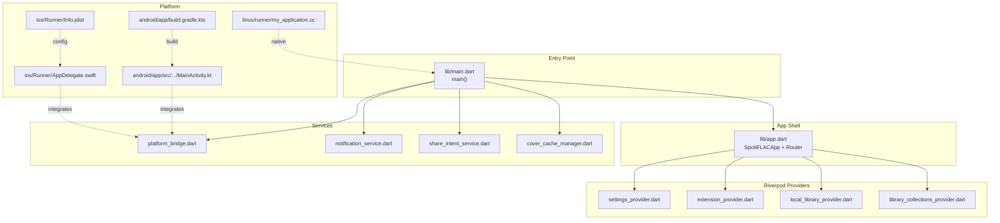

**Diagram sources**
- [lib/main.dart:22-44](file://lib/main.dart#L22-L44)
- [lib/app.dart:54-98](file://lib/app.dart#L54-L98)
- [lib/providers/settings_provider.dart:27-675](file://lib/providers/settings_provider.dart#L27-L675)
- [lib/providers/extension_provider.dart:797-800](file://lib/providers/extension_provider.dart#L797-L800)
- [lib/providers/local_library_provider.dart:95-285](file://lib/providers/local_library_provider.dart#L95-L285)
- [lib/providers/library_collections_provider.dart:666-800](file://lib/providers/library_collections_provider.dart#L666-L800)
- [lib/services/platform_bridge.dart:37-141](file://lib/services/platform_bridge.dart#L37-L141)
- [lib/services/notification_service.dart:9-97](file://lib/services/notification_service.dart#L9-L97)
- [lib/services/share_intent_service.dart:8-106](file://lib/services/share_intent_service.dart#L8-L106)
- [lib/services/cover_cache_manager.dart:8-169](file://lib/services/cover_cache_manager.dart#L8-L169)
- [android/app/src/main/kotlin/com/example/bitly/MainActivity.kt:15-133](file://android/app/src/main/kotlin/com/example/bitly/MainActivity.kt#L15-L133)
- [ios/Runner/AppDelegate.swift:4-13](file://ios/Runner/AppDelegate.swift#L4-L13)
- [android/app/build.gradle.kts:1-55](file://android/app/build.gradle.kts#L1-L55)
- [ios/Runner/Info.plist:1-50](file://ios/Runner/Info.plist#L1-L50)
- [linux/runner/my_application.cc:10-145](file://linux/runner/my_application.cc#L10-L145)

**Section sources**
- [lib/main.dart:22-44](file://lib/main.dart#L22-L44)
- [lib/app.dart:54-98](file://lib/app.dart#L54-L98)
- [pubspec.yaml:9-108](file://pubspec.yaml#L9-L108)

## Core Components
- Entry point and initialization:
  - Ensures Flutter binding is initialized, initializes MediaKit, sets up FFI for non-mobile platforms, resolves runtime profile, configures image cache, wraps the app in ProviderScope, and starts eager initialization.
- App shell:
  - Defines routing, redirects based on settings, and builds the MaterialApp with dynamic color wrapper, localization delegates, and theme animation.
- Providers:
  - Settings provider loads persisted settings, syncs with the platform backend, and notifies initialization completion.
  - Extension provider manages extension lifecycle and metadata.
  - Local library provider handles scanning, progress events, and database refresh.
  - Library collections provider loads user collections and maintains indices.
- Services:
  - Platform bridge coordinates with native backend via MethodChannel or HTTP RPC.
  - Notification service initializes channels and shows progress notifications.
  - Share intent service listens to shared media and extracts URLs.
  - Cover cache manager configures disk-backed cache for artwork.

**Section sources**
- [lib/main.dart:22-44](file://lib/main.dart#L22-L44)
- [lib/app.dart:13-52](file://lib/app.dart#L13-L52)
- [lib/providers/settings_provider.dart:27-675](file://lib/providers/settings_provider.dart#L27-L675)
- [lib/providers/extension_provider.dart:797-800](file://lib/providers/extension_provider.dart#L797-L800)
- [lib/providers/local_library_provider.dart:95-285](file://lib/providers/local_library_provider.dart#L95-L285)
- [lib/providers/library_collections_provider.dart:666-800](file://lib/providers/library_collections_provider.dart#L666-L800)
- [lib/services/platform_bridge.dart:37-141](file://lib/services/platform_bridge.dart#L37-L141)
- [lib/services/notification_service.dart:9-97](file://lib/services/notification_service.dart#L9-L97)
- [lib/services/share_intent_service.dart:8-106](file://lib/services/share_intent_service.dart#L8-L106)
- [lib/services/cover_cache_manager.dart:8-169](file://lib/services/cover_cache_manager.dart#L8-L169)

## Architecture Overview
The startup flow orchestrates platform detection, runtime profile selection, service initialization, and provider warm-up. Eager initialization defers heavy tasks to a post-frame callback to keep UI responsive.

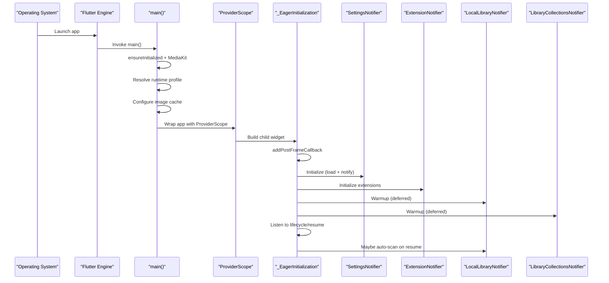

**Diagram sources**
- [lib/main.dart:22-44](file://lib/main.dart#L22-L44)
- [lib/main.dart:96-286](file://lib/main.dart#L96-L286)
- [lib/providers/settings_provider.dart:27-675](file://lib/providers/settings_provider.dart#L27-L675)
- [lib/providers/extension_provider.dart:797-800](file://lib/providers/extension_provider.dart#L797-L800)
- [lib/providers/local_library_provider.dart:95-285](file://lib/providers/local_library_provider.dart#L95-L285)
- [lib/providers/library_collections_provider.dart:666-800](file://lib/providers/library_collections_provider.dart#L666-L800)

## Detailed Component Analysis

### Entry Point and Eager Initialization
- Ensures Flutter binding and media kit initialization.
- Detects non-mobile platforms and switches to FFI SQLite.
- Resolves a runtime profile based on device info (Android) and applies image cache limits.
- Wraps the app in ProviderScope and launches the eager initializer.
- Eager initialization performs:
  - Service initialization (cover cache, notifications, share intents).
  - Extension system initialization and default extension installation feedback.
  - Deferred warm-up of providers with staggered timers.
  - Local library auto-scan scheduling on resume and settings change.

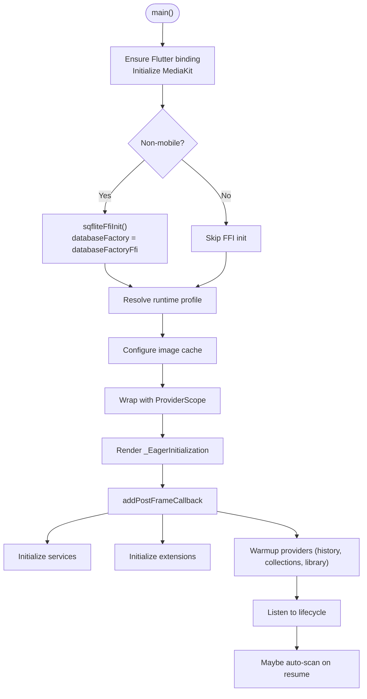

**Diagram sources**
- [lib/main.dart:22-44](file://lib/main.dart#L22-L44)
- [lib/main.dart:96-286](file://lib/main.dart#L96-L286)

**Section sources**
- [lib/main.dart:22-44](file://lib/main.dart#L22-L44)
- [lib/main.dart:96-286](file://lib/main.dart#L96-L286)

### Runtime Profile Detection and Image Cache Configuration
- Runtime profile selects image cache size and bytes based on device capabilities (ARM64 vs ARM32, low RAM).
- Applies image cache limits globally to prevent memory pressure during cover-heavy browsing.

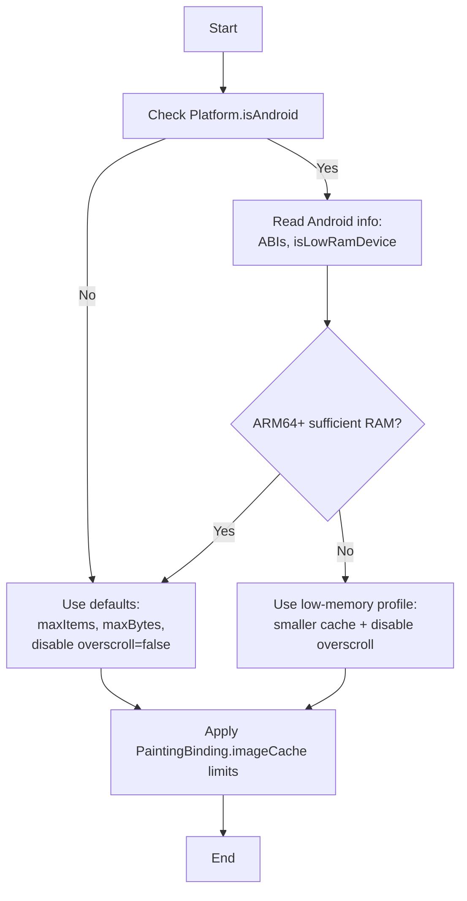

**Diagram sources**
- [lib/main.dart:46-94](file://lib/main.dart#L46-L94)

**Section sources**
- [lib/main.dart:46-94](file://lib/main.dart#L46-L94)

### ProviderScope and Eager Initialization Pattern
- ProviderScope is the root container for Riverpod providers.
- EagerInitialization defers expensive work to a post-frame callback to avoid blocking the UI thread.
- Uses timers to schedule provider warm-ups and listens to lifecycle to trigger scans on resume.

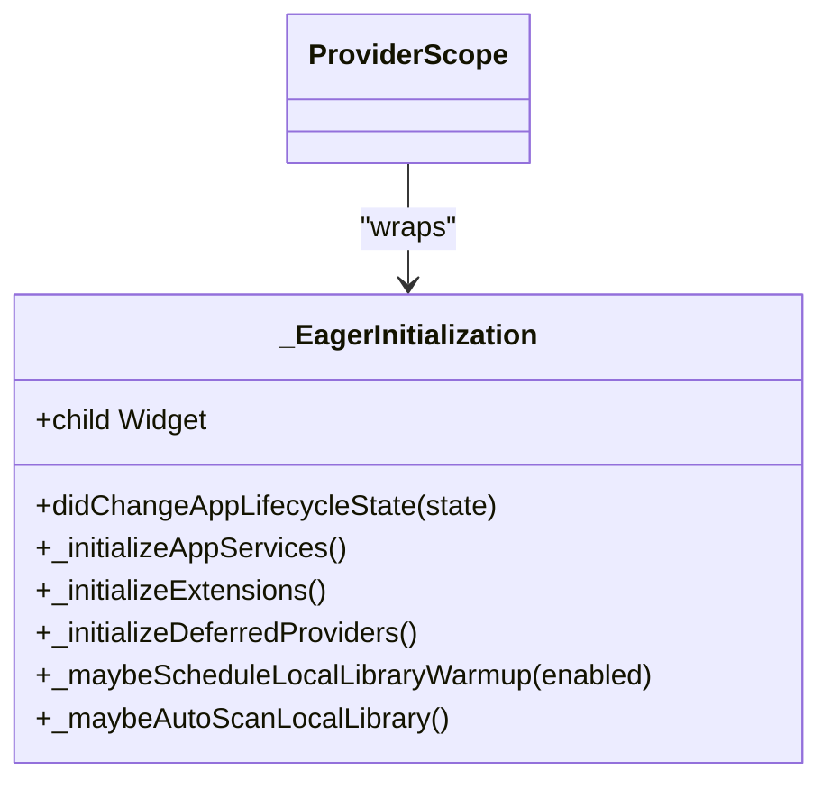

**Diagram sources**
- [lib/main.dart:35-43](file://lib/main.dart#L35-L43)
- [lib/main.dart:96-286](file://lib/main.dart#L96-L286)

**Section sources**
- [lib/main.dart:35-43](file://lib/main.dart#L35-L43)
- [lib/main.dart:96-286](file://lib/main.dart#L96-L286)

### Settings Provider and Backend Synchronization
- Loads settings from the platform backend first, falls back to SharedPreferences.
- Normalizes and migrates settings, syncs lyrics/network/extension fallback settings to the backend.
- Emits initialization completion to drive routing and UI readiness.

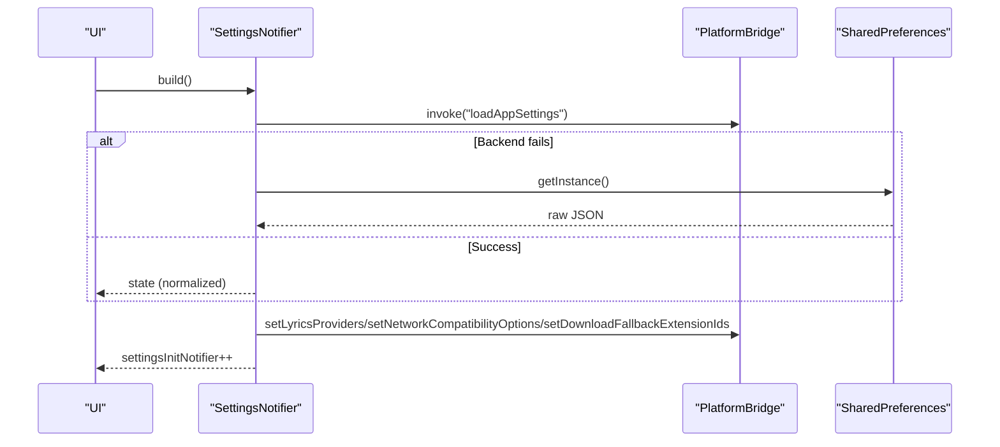

**Diagram sources**
- [lib/providers/settings_provider.dart:27-127](file://lib/providers/settings_provider.dart#L27-L127)
- [lib/providers/settings_provider.dart:145-185](file://lib/providers/settings_provider.dart#L145-L185)
- [lib/services/platform_bridge.dart:44-53](file://lib/services/platform_bridge.dart#L44-L53)

**Section sources**
- [lib/providers/settings_provider.dart:27-127](file://lib/providers/settings_provider.dart#L27-L127)
- [lib/providers/settings_provider.dart:145-185](file://lib/providers/settings_provider.dart#L145-L185)
- [lib/services/platform_bridge.dart:44-53](file://lib/services/platform_bridge.dart#L44-L53)

### Extension Provider and Backend Integration
- Initializes extension directories and installs default extensions.
- Provides metadata and download resolution helpers and manages health checks.

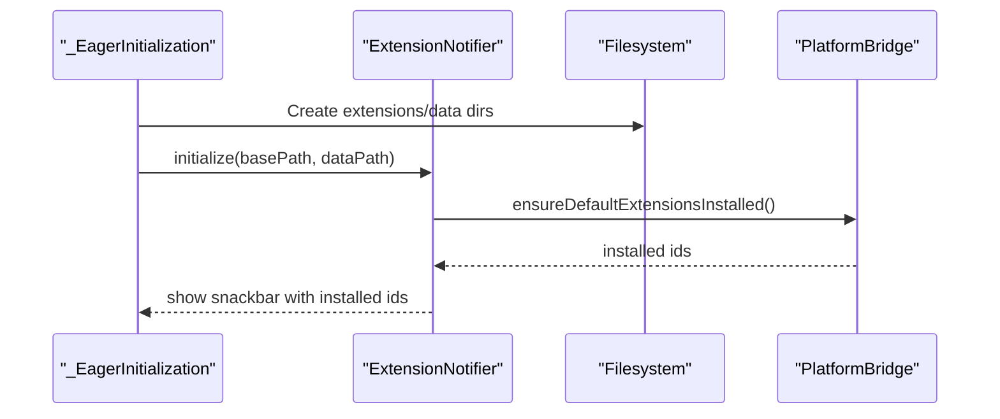

**Diagram sources**
- [lib/main.dart:247-280](file://lib/main.dart#L247-L280)
- [lib/providers/extension_provider.dart:797-800](file://lib/providers/extension_provider.dart#L797-L800)
- [lib/services/platform_bridge.dart:237-239](file://lib/services/platform_bridge.dart#L237-L239)

**Section sources**
- [lib/main.dart:247-280](file://lib/main.dart#L247-L280)
- [lib/providers/extension_provider.dart:797-800](file://lib/providers/extension_provider.dart#L797-L800)
- [lib/services/platform_bridge.dart:237-239](file://lib/services/platform_bridge.dart#L237-L239)

### Local Library Provider and Auto-Scan Logic
- Starts scanning via platform bridge, subscribes to progress events, and updates state.
- Auto-scans on resume based on settings and elapsed time thresholds.

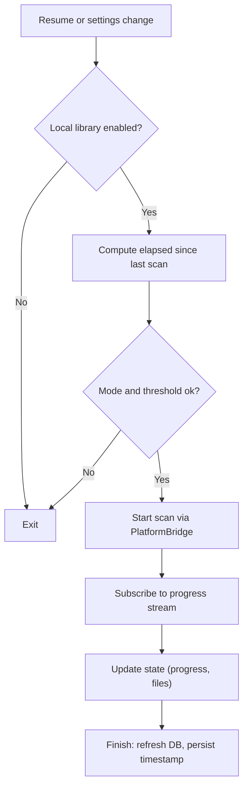

**Diagram sources**
- [lib/main.dart:193-233](file://lib/main.dart#L193-L233)
- [lib/providers/local_library_provider.dart:172-227](file://lib/providers/local_library_provider.dart#L172-L227)

**Section sources**
- [lib/main.dart:193-233](file://lib/main.dart#L193-L233)
- [lib/providers/local_library_provider.dart:172-227](file://lib/providers/local_library_provider.dart#L172-L227)

### Library Collections Provider
- Loads user collections (wishlist, loved, playlists, favorites) from databases and maintains efficient lookups.
- Performs migrations for legacy keys and cleans corrupted entries.

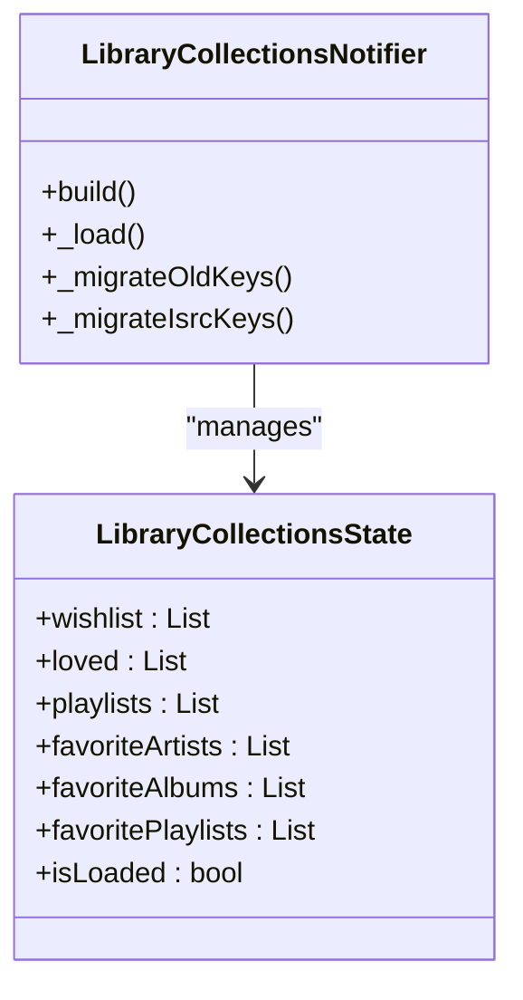

**Diagram sources**
- [lib/providers/library_collections_provider.dart:403-620](file://lib/providers/library_collections_provider.dart#L403-L620)
- [lib/providers/library_collections_provider.dart:666-800](file://lib/providers/library_collections_provider.dart#L666-L800)

**Section sources**
- [lib/providers/library_collections_provider.dart:403-620](file://lib/providers/library_collections_provider.dart#L403-L620)
- [lib/providers/library_collections_provider.dart:666-800](file://lib/providers/library_collections_provider.dart#L666-L800)

### Services: Platform Bridge, Notifications, Share Intent, Cover Cache
- PlatformBridge:
  - Chooses MethodChannel or HTTP RPC depending on platform.
  - Manages backend lifecycle, caches, and event streams.
- NotificationService:
  - Initializes channels per platform and shows progress notifications.
- ShareIntentService:
  - Listens to shared media and extracts Spotify or generic URLs.
- CoverCacheManager:
  - Creates a disk-backed cache for cover images with adaptive limits.

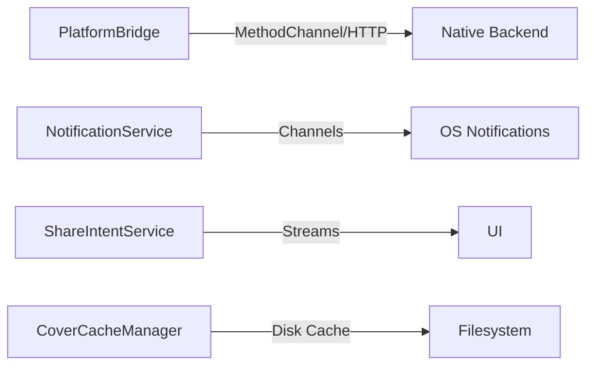

**Diagram sources**
- [lib/services/platform_bridge.dart:37-141](file://lib/services/platform_bridge.dart#L37-L141)
- [lib/services/notification_service.dart:9-97](file://lib/services/notification_service.dart#L9-L97)
- [lib/services/share_intent_service.dart:8-106](file://lib/services/share_intent_service.dart#L8-L106)
- [lib/services/cover_cache_manager.dart:8-169](file://lib/services/cover_cache_manager.dart#L8-L169)

**Section sources**
- [lib/services/platform_bridge.dart:37-141](file://lib/services/platform_bridge.dart#L37-L141)
- [lib/services/notification_service.dart:9-97](file://lib/services/notification_service.dart#L9-L97)
- [lib/services/share_intent_service.dart:8-106](file://lib/services/share_intent_service.dart#L8-L106)
- [lib/services/cover_cache_manager.dart:8-169](file://lib/services/cover_cache_manager.dart#L8-L169)

### App Shell and Routing
- Router defines initial location and redirect logic based on settings and first-launch state.
- App theme adapts to dynamic color and supports locale selection.

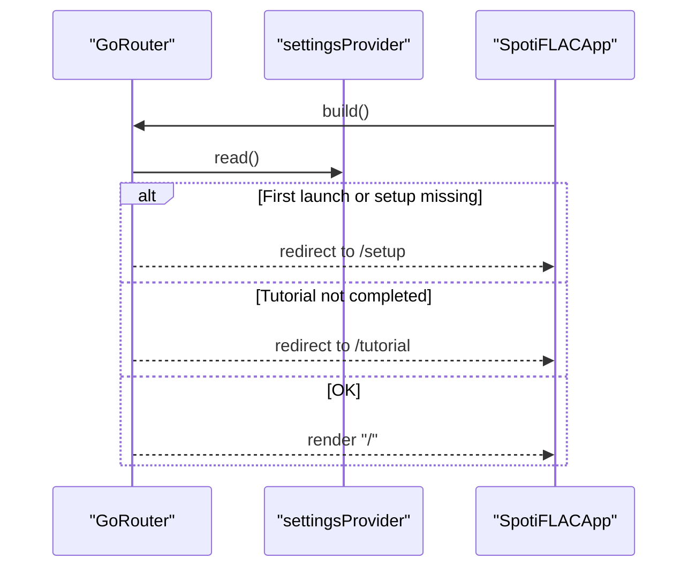

**Diagram sources**
- [lib/app.dart:13-52](file://lib/app.dart#L13-L52)
- [lib/app.dart:54-98](file://lib/app.dart#L54-L98)

**Section sources**
- [lib/app.dart:13-52](file://lib/app.dart#L13-L52)
- [lib/app.dart:54-98](file://lib/app.dart#L54-L98)

### Platform-Specific Configurations
- Android:
  - MainActivity registers a MethodChannel to communicate with the native backend and executes JSON methods on a single-thread executor.
  - Gradle config sets compile/target SDK and uses desugaring.
- iOS:
  - AppDelegate registers plugins and starts the Flutter engine.
  - Info.plist defines bundle identifiers, supported orientations, and related settings.
- Linux:
  - Custom GTK application initializes Flutter view and registers plugins.

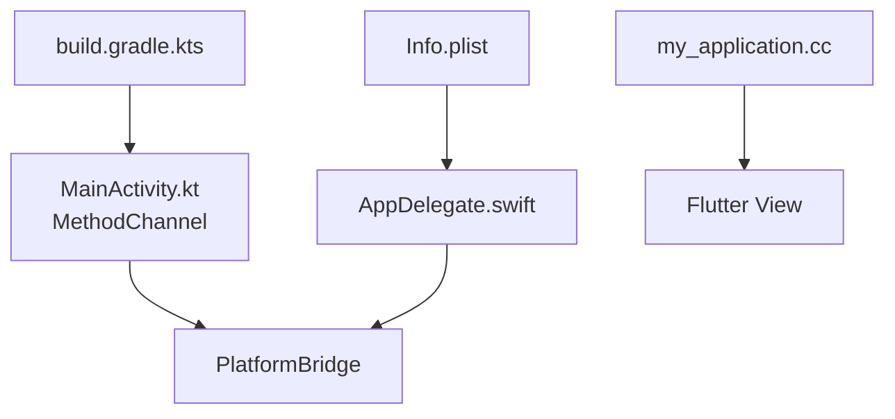

**Diagram sources**
- [android/app/src/main/kotlin/com/example/bitly/MainActivity.kt:15-133](file://android/app/src/main/kotlin/com/example/bitly/MainActivity.kt#L15-L133)
- [ios/Runner/AppDelegate.swift:4-13](file://ios/Runner/AppDelegate.swift#L4-L13)
- [ios/Runner/Info.plist:1-50](file://ios/Runner/Info.plist#L1-L50)
- [android/app/build.gradle.kts:1-55](file://android/app/build.gradle.kts#L1-L55)
- [linux/runner/my_application.cc:10-145](file://linux/runner/my_application.cc#L10-L145)

**Section sources**
- [android/app/src/main/kotlin/com/example/bitly/MainActivity.kt:15-133](file://android/app/src/main/kotlin/com/example/bitly/MainActivity.kt#L15-L133)
- [ios/Runner/AppDelegate.swift:4-13](file://ios/Runner/AppDelegate.swift#L4-L13)
- [ios/Runner/Info.plist:1-50](file://ios/Runner/Info.plist#L1-L50)
- [android/app/build.gradle.kts:1-55](file://android/app/build.gradle.kts#L1-L55)
- [linux/runner/my_application.cc:10-145](file://linux/runner/my_application.cc#L10-L145)

## Dependency Analysis
- Dependencies are declared in pubspec.yaml, including Riverpod, go_router, localization, media_kit, shared preferences, sqflite FFI, and platform-specific plugins.
- Android uses a local AAR for the backend and desugaring for Java compatibility.
- iOS and macOS integrate with Flutter plugins via GeneratedPluginRegistrant.

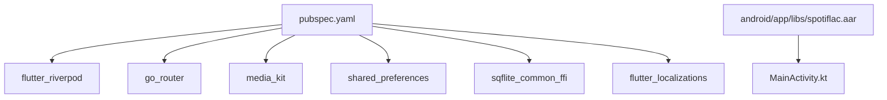

**Diagram sources**
- [pubspec.yaml:9-108](file://pubspec.yaml#L9-L108)
- [android/app/build.gradle.kts:47-50](file://android/app/build.gradle.kts#L47-L50)

**Section sources**
- [pubspec.yaml:9-108](file://pubspec.yaml#L9-L108)
- [android/app/build.gradle.kts:47-50](file://android/app/build.gradle.kts#L47-L50)

## Performance Considerations
- Startup responsiveness:
  - Eager initialization defers heavy work to a post-frame callback.
  - Staggered provider warm-ups reduce peak memory and CPU usage.
- Memory management:
  - Image cache limits prevent excessive memory consumption on low-RAM devices.
  - Cover cache manager uses disk-backed storage with adaptive limits and periodic clearing.
- Cross-platform:
  - FFI SQLite improves performance on desktop platforms.
  - Platform bridge abstracts channel vs HTTP RPC to balance reliability and speed.
- UI smoothness:
  - Disabling overscroll effects on constrained devices reduces unnecessary animations.

[No sources needed since this section provides general guidance]

## Troubleshooting Guide
- Settings load failures:
  - Falls back to SharedPreferences if backend load fails; logs and resets corrupted settings to defaults.
- Extension installation:
  - Shows a snackbar listing newly installed extensions; ensure directories are created and backend is ready.
- Local library scan:
  - Validates settings and elapsed time; cancels and cleans up on errors; supports cancellation and finalization.
- Notifications:
  - Handles platform-specific permission and channel creation; gracefully skips when notifications are disallowed.
- Share intent:
  - Ignores unsupported platforms and sanitizes URLs; exposes pending URL for immediate handling.

**Section sources**
- [lib/providers/settings_provider.dart:51-127](file://lib/providers/settings_provider.dart#L51-L127)
- [lib/main.dart:247-280](file://lib/main.dart#L247-L280)
- [lib/providers/local_library_provider.dart:172-227](file://lib/providers/local_library_provider.dart#L172-L227)
- [lib/services/notification_service.dart:9-97](file://lib/services/notification_service.dart#L9-L97)
- [lib/services/share_intent_service.dart:34-53](file://lib/services/share_intent_service.dart#L34-L53)

## Conclusion
The application employs a robust initialization sequence that separates concerns across platform detection, runtime profiling, service bootstrapping, and provider warm-up. Riverpod’s ProviderScope centralizes state management, while the eager initialization pattern ensures a responsive UI. Cross-platform considerations are addressed through FFI, platform bridges, and adaptive UI behavior. Memory management is enforced via bounded image and cover caches, and startup performance is optimized through staged initialization and deferred provider loading.